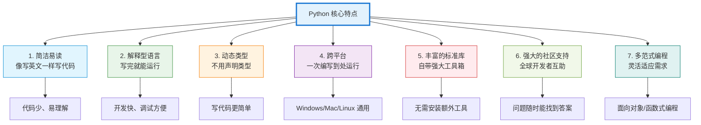
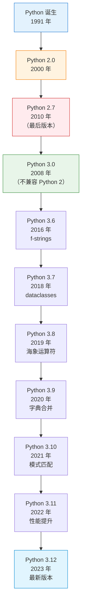
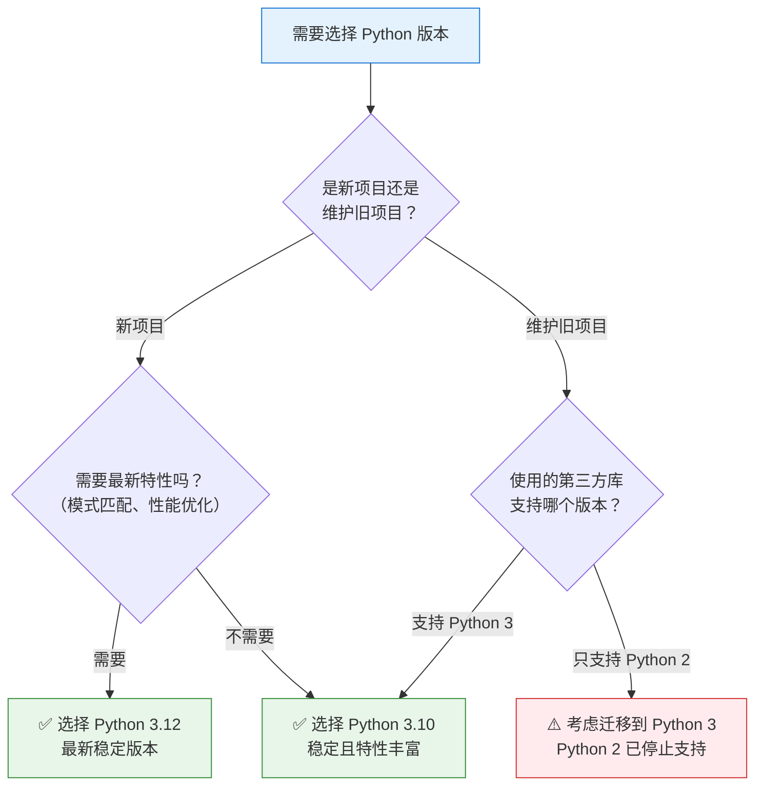
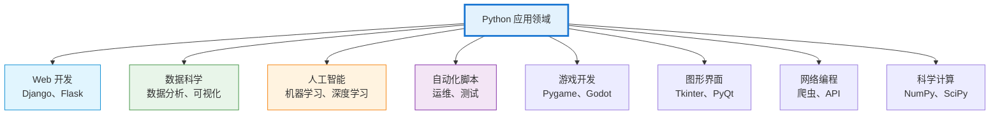

# P1A-Python特点和版本完全指南-从零基础到选择最适合的编程语言

## 📝 摘要

想学编程但不知从何开始？Python 是零基础最佳选择！本指南揭秘 Python 七大核心特点，详解 Python 2 与 Python 3 区别，帮你选择最适合版本。掌握优势，开启编程之路！

## 📋 目录

- [1. 前置知识点](#1-前置知识点)
- [2. Python 是什么？](#2-python-是什么)
- [3. Python 的七大核心特点](#3-python-的七大核心特点)
- [4. Python 版本演进历史](#4-python-版本演进历史)
- [5. Python 2 vs Python 3 核心区别](#5-python-2-vs-python-3-核心区别)
- [6. 如何选择 Python 版本？](#6-如何选择-python-版本)
- [7. Python 应用领域](#7-python-应用领域)
- [8. 为什么选择 Python？](#8-为什么选择-python)
- [9. 学习建议](#9-学习建议)
- [10. 📚 参考资料与学习资源](#10-参考资料与学习资源)
- [11. 总结](#11-总结)

---

## 1. 前置知识点

### 📚 **学习前需要了解的基础知识**

在开始了解 Python 特点和版本之前，你不需要任何编程基础。本指南专为零基础读者设计。

#### 🔰 **本指南将帮助你了解**

- Python 是什么编程语言
- Python 相比其他语言的优势
- Python 版本的演进历史
- 如何选择适合的 Python 版本
- Python 能做什么

### 🎯 **学习建议**

- **零基础小白**：建议通读全文，重点理解 Python 特点和版本选择
- **有基础读者**：可以快速浏览，重点关注版本选择和应用领域

---

## 2. Python 是什么？

### 🎯 Python 的基本定义

**Python** 是一种**高级、解释型、通用的编程语言**相对简单的编程工具，由 Guido van Rossum 在 1991 年首次发布。

**生活化比喻**：Python 就像一本**写代码的"说明书"**，告诉计算机要做什么。

想象你在和外国人交流：
- **不会外语**：需要翻译帮忙（编译型语言）
- **会说 Python**：直接交流，对方能听懂（解释型语言）

Python 的特殊之处在于：你写什么，计算机就做什么，不需要"翻译"成机器语言。

---

## 3. Python 的七大核心特点



### 🔥 **特点一：简洁易读**

**生活化比喻**：就像**写英文句子**，而不是写密码。

**什么是简洁易读**？

Python 的语法设计强调代码的可读性（readability），使开发者能够用**更少的代码表达复杂的逻辑**。

**对比示例**：

| 语言 | 输出 "Hello, World!" 的代码 | 代码行数 |
|------|---------------------------|---------|
| **Python** | `print("Hello, World!")` | **1 行**（相对简单） |
| Java | `public class Hello { public static void main(String[] args) { System.out.println("Hello, World!"); } }` | **4 行**相对复杂 |
| C++ | `#include <iostream>`<br/>`int main() { std::cout << "Hello, World!" << std::endl; return 0; }` | **4 行**相对复杂 |

**Python 的优势**：
- ✅ **代码少**：相同功能，Python 代码通常比其他语言少 3-5 倍
- ✅ **易理解**：像读英文句子，不需要记很多特殊符号
- ✅ **学习快**：零基础也能很快上手

---

### 🔥 **特点二：解释型语言（Interpreted Language）**

**生活化比喻**：就像**同声传译**，你说一句，翻译当场翻译一句。

**什么是解释型语言**？

Python 代码在运行时被**逐行解释执行**，不需要先"翻译"成机器语言（编译）。

**对比说明**：

| 类型 | 工作原理 | 生活化比喻 | 优势 | 劣势 |
|------|---------|-----------|------|------|
| **解释型语言<br/>（Python）** | 写完后直接运行，运行时解释 | 同声传译，边说边翻译 | ✅ 开发快、调试方便<br/>✅ 跨平台性好 | ❌ 运行速度相对慢 |
| **编译型语言<br/>（C/C++）** | 先编译成机器语言，再运行 | 先写成书再出版，然后读 | ✅ 运行速度快 | ❌ 开发周期长<br/>❌ 跨平台性差 |

**Python 作为解释型语言的优势**：
- ✅ **开发快**：写完代码就能运行，不需要编译
- ✅ **调试方便**：运行出错会立即提示，容易找到问题
- ✅ **跨平台**：同一份代码在 Windows、Mac、Linux 都能运行

---

### 🔥 **特点三：动态类型（Dynamic Typing）**

**生活化比喻**：就像**不需要提前说明要装什么**的容器，放什么都可以。

**什么是动态类型**？

Python 变量不需要**显式声明类型**，在运行时自动确定变量的类型。

**对比示例**：

```python
# Python（动态类型）- 不需要声明类型
name = "张三"        # 自动识别为字符串
age = 25            # 自动识别为整数
height = 175.5      # 自动识别为浮点数
is_student = True   # 自动识别为布尔值

# 同一个变量可以重新赋值为不同类型
x = 10              # x 是整数
x = "Hello"         # x 现在是字符串（这在 Python 中完全允许）
```

```java
// Java（静态类型）- 必须声明类型
String name = "张三";      // 必须声明是字符串
int age = 25;              // 必须声明是整数
double height = 175.5;     // 必须声明是浮点数
boolean isStudent = true;  // 必须声明是布尔值

// 不能改变类型
int x = 10;
// x = "Hello";  // 错误！不能把字符串赋值给整数变量
```

**Python 动态类型的优势**：
- ✅ **写代码更简单**：不需要记住复杂的类型声明语法
- ✅ **更灵活**：同一个变量可以存储不同类型的值
- ✅ **学习门槛低**：零基础更容易理解

---

### 🔥 **特点四：跨平台（Cross-platform）**

**生活化比喻**：就像**通用的电源插头**，在世界各地都能用。

**什么是跨平台**？

Python 支持多种操作系统（operating system），包括 Windows、macOS、Linux 等，**一次编写，到处运行**。

**支持的操作系统**：

| 操作系统 | Python 支持情况 | 使用场景 |
|---------|----------------|---------|
| **Windows** | ✅ 完全支持 | 个人电脑、企业服务器 |
| **macOS** | ✅ 完全支持 | Mac 开发、个人电脑 |
| **Linux** | ✅ 完全支持 | 服务器、云计算 |
| **Unix** | ✅ 完全支持 | 企业服务器 |

**Python 跨平台的优势**：
- ✅ **一份代码，多平台运行**：在 Windows 写的代码，可以在 Linux 上运行
- ✅ **开发效率高**：不需要为每个平台单独开发
- ✅ **部署灵活**：可以选择最适合的运行环境

---

### 🔥 **特点五：丰富的标准库（Standard Library）**

**生活化比喻**：就像**自带工具箱的专业工匠**，工具齐全，不需要到处借。

**什么是标准库**？

Python 自带**大量内置模块（modules）**，涵盖了文件操作、网络通信、数据处理、图形界面等多个领域。

**常用标准库示例**：

| 标准库模块 | 功能 | 生活化比喻 |
|-----------|------|-----------|
| **os** | 操作系统接口 | 电脑的"遥控器" |
| **sys** | 系统特定参数 | 电脑的"设置面板 history" |
| **datetime** | 日期和时间处理 | 日历和时间表 |
| **json** | JSON 数据处理 | 数据"翻译器" |
| **random** | 随机数生成 | 摇骰子工具 |
| **re** | 正则表达式 | 文本"搜索器" |

**Python 标准库的优势**：
- ✅ **功能强大**：覆盖 90% 的常见需求
- ✅ **无需安装**：Python 自带，开箱即用
- ✅ **官方维护**：稳定可靠，持续更新

---

### 🔥 **特点六：强大的社区支持（Community Support）**

**生活化比喻**：就像**全球最大的编程"朋友圈"**，有问题随时能找到人帮忙。

**什么是社区支持**？

Python 拥有**活跃的全球开发者社区**，提供了丰富的第三方库（third-party libraries）、学习资源和技术支持。

**社区资源的优势**：

| 资源类型 | 内容 | 生活化比喻 |
|---------|------|-----------|
| **第三方库** | 数十万个现成的工具包 | 应用商店里的各种 APP |
| **学习资源** | 海量教程、文档、视频 | 图书馆的编程书籍 |
| **技术支持** | Stack Overflow、GitHub 等 | 24 小时在线帮助中心 |
| **开源项目** | 大量开源代码可参考 | 可以学习和使用的模板 |

**Python 社区的优势**：
- ✅ **问题随时能找到答案**：几乎任何问题都有人遇到过
- ✅ **学习资源丰富**：从零基础到高级，教程应有尽有
- ✅ **持续更新**：新技术、新工具不断出现

---

### 🔥 **特点七：多范式编程（Multi-paradigm）**

**生活化比喻**：就像**多功能工具箱**，可以根据任务选择最合适的工具。

**什么是多范式编程**？

Python 支持**多种编程范式**，包括面向对象编程、过程式编程、函数式编程等，灵活适应不同的开发需求。

**支持的编程范式**：

| 编程范式 | 特点 | 适用场景 | 生活化比喻 |
|---------|------|---------|-----------|
| **面向对象编程<br/>（OOP）** | 使用类和对象 | 大型项目、代码复用 | 工厂生产：先设计模具，再批量生产 |
| **过程式编程<br/>（Procedural）** | 按步骤执行 | 简单脚本、快速开发 | 写菜谱：按步骤操作 |
| **函数式编程<br/>（Functional）** | 使用函数和不可变数据 | 数据处理、算法实现 | 流水线生产：每个环节独立 |

**Python 多范式编程的优势**：
- ✅ **灵活适应**：可以根据项目需求选择最合适的编程方式
- ✅ **学习全面**：可以掌握多种编程思维
- ✅ **代码优雅**：用最合适的方式解决问题

---

## 4. Python 版本演进历史

### 📅 Python 版本时间线



### 🎯 主要版本里程碑

#### **Python 1.0（1994 年）**

- **意义**：首个正式版本
- **特点**：奠定了 Python 作为解释型语言的基础

#### **Python 2.0（2000 年）**

- **意义**：现代化改进
- **特点**：引入垃圾回收机制、列表推导式（list comprehension）等特性

#### **Python 2.7（2010 年）**

- **意义**：Python 2 系列的最终版本
- **特点**：提供了对 Python 3 部分特性的支持，便于过渡
- ⚠️ **重要**：Python 2 已于 **2020 年停止官方支持**，不再更新安全补丁

#### **Python 3.0（2008 年）**

- **意义**：重大变革版本
- **特点**：解决 Python 2 的设计缺陷，但与 Python 2 **不兼容**

#### **Python 3.6（2016 年）**

- **重要特性**：引入 **f-strings**（格式化字符串）
- **示例**：`name = "张三"; print(f"Hello, {name}")` 

#### **Python 3.7（2018 年）**

- **重要特性**：引入 **dataclasses**（数据类）
- **意义**：简化类的定义和数据管理

#### **Python 3.8（2019 年）**

- **重要特性**：引入**海象运算符（walrus operator）** `:=`
- **示例**：`if (n := len(data)) > 10: print(f"数据太多：{n}")`

#### **Python 3.9（2020 年）**

- **重要特性**：字典合并运算符 `|` 和 `|=`
- **示例**：`dict1 | dict2` 合并两个字典

#### **Python 3.10（2021 年）**

- **重要特性**：引入**模式匹配（match-case）** 语句
- **意义**：提供更强大的条件控制能力

#### **Python 3.11（2022 年）**

- **重要特性**：性能优化，运行速度提升 **10%~60%**
- **意义**：执行效率大幅提升

#### **Python 3.12（2023 年）**

- **当前状态**：最新稳定版本
- **建议**：新项目推荐使用此版本

---

## 5. Python 2 vs Python 3 核心区别

### ⚠️ **重要提醒**

**Python 2 已于 2020 年停止官方支持，不再更新安全补丁，建议所有新项目使用 Python 3。**

### 📊 核心区别对比表

| 特性 | Python 2 | Python 3 | 影响 |
|------|----------|----------|------|
| **print 语句** | `print "Hello"` | `print("Hello")` | 🔥 语法改变 |
| **整数除法** | `5 / 2 = 2`（整数） | `5 / 2 = 2.5`（浮点数） | 🔥 结果不同 |
| **字符串编码** | 默认 ASCII | 默认 Unicode（Unicode） | 🔥 中文支持 |
| **range 函数** | `range()` 返回列表 | `range()` 返回迭代器（iterator） | ⚠️ 性能优化 |
| **异常语法** | `except Exception, e:` | `except Exception as e:` | ⚠️ 语法改进 |
| **官方支持** | ❌ 已停止（2020 年） | ✅ 持续更新 | 🔥 安全性 |

### 🔥 **区别一：print 语句 vs print 函数**

**Python 2**：
```python
print "Hello, World!"  # 不需要括号
```

**Python 3**：
```python
print("Hello, World!")  # 必须使用括号
```

**为什么改变**：函数调用更统一，更容易学习。

---

### 🔥 **区别二：整数除法**

**Python 2**：
```python
5 / 2      # 结果：2（整数）
5.0 / 2    # 结果：2.5（浮点数）
```

**Python 3**：
```python
5 / 2      # 结果：2.5（浮点数）
5 // 2     # 结果：2（整数除法，使用 //）
```

**为什么改变**：更符合数学直觉，避免混淆。

---

### 🔥 **区别三：字符串编码**

**Python 2**：
```python
# 默认使用 ASCII 编码，处理中文需要特殊处理
text = "Hello"  # ASCII
# 中文需要使用 u"中文" 或指定编码
```

**Python 3**：
```python
# 默认使用 Unicode 编码，直接支持中文
text = "Hello, 世界"  # Unicode，直接支持中文
```

**为什么改变**：更好的国际化支持，处理多语言更简单。

---

## 6. 如何选择 Python 版本？

### 🎯 版本选择流程图



### 📋 版本选择建议

| 使用场景 | 推荐版本 | 原因 |
|---------|---------|------|
| **新项目开发** | Python 3.10+ | 稳定、特性丰富、长期支持 |
| **需要最新特性** | Python 3.12 | 最新稳定版本，性能最优 |
| **企业项目** | Python 3.10 或 3.听取 | 稳定可靠，社区支持好 |
| **学习 Python** | Python 3.10+ | 学习最新语法，避免过时知识 |
| **维护旧项目** | 检查不应库兼容性 | 根据第三方库支持情况选择 |

### ⚠️ **重要建议**

1. **不要使用 Python 2**：Python 2 已停止支持，存在安全风险
2. **推荐 Python 3.10+**：稳定、特性丰富、长期支持
3. **检查第三方库兼容性**：确保使用的库支持你选择的 Python 版本

---

## 7. Python 应用领域

### 🎯 Python 应用领域全景图



### 🔥 **应用领域一：Web 开发**

**生活化比喻**：用 Python **搭建网站**，就像用积木盖房子。

**常用框架**：
- **Django**：大型项目，功能全面（像豪华别墅）
- **Flask**：轻量级，灵活快速（像精装小户型）

**实际应用**：
- 企业官网
- 电商平台
- 社交网络
- API 服务

---

### 🔥 **应用领域二：数据科学（Data Science）**

**生活化比喻**：用 Python **分析数据**，就像用显微镜观察细胞。

**常用库**：
- **Pandas**：数据处理和分析
- **NumPy**：数值计算
- **Matplotlib**：数据可视化

**实际应用**：
- 数据分析报告
- 数据可视化图表
- 商业智能分析
- 统计建模

---

### 🔥 **应用领域三：人工智能和机器学习（AI & Machine Learning）**

**生活化比喻**：用 Python **训练 AI 模型**，就像教机器人学习。

**常用库**：
- **TensorFlow**：谷歌开发的深度学习框架
- **PyTorch**：Facebook 开发的深度学习框架
- **Scikit-learn**：机器学习算法库

**实际应用**：
- 图像识别
- 自然语言处理
- 推荐系统
- 自动驾驶

---

### 🔥 **应用领域四：自动化脚本（Automation Scripts）**

**生活化比喻**：用 Python **自动完成任务**，就像雇了一个不知疲倦的助手。

**实际应用**：
- 文件批量处理
- 网页数据爬取
- 系统运维自动化
- 测试自动化

---

## 8. 为什么选择 Python？

### 🎯 选择 Python 的理由

| 理由 | 说明 | 生活化比喻 |
|------|------|-----------|
| **学习曲线平缓** | 语法简单，零基础也能快速上手 | 像学骑自行车，容易入门 |
| **就业前景好** | 市场需求大，薪资待遇高 | 像热门专业，好找工作 |
| **社区支持强** | 全球最大编程社区，问题随时能找到答案 | 像超级图书馆，资源丰富 |
| **应用领域广** | Web、数据、AI、自动化等，覆盖全面 | 像瑞士军刀，功能多样 |
| **持续发展** | Python 3 持续更新，新技术不断涌现 | 像成长中的孩子，不断进步 |

### 📊 Python 就业前景

**2025 年 IT 行业热门编程语言排名**（根据市场需求）：

1. **Python** - 数据科学、AI 领域需求巨大
2. JavaScript - Web 开发必备
3. Java - 企业级应用主流
4. Go - 云原生开发热门
5. Rust - 系统编程新兴

**Python 薪资水平**（2025 年数据）：

| 工作年限 | 平均月薪（人民币） | 适用岗位 |
|---------|------------------|---------|
| 0-1 年 | 8,000 - 12,000 | 初级 Python 开发 |
| 1-3 年 | 12,000 - 18,000 | 中级 Python 开发 |
| 3-5 年 | 18,000 - 25,000 | 高级 Python 开发 |
| 5 年以上 | 25,000+ | Python 架构师、技术专家 |

---

## 9. 学习建议

### 🎯 针对不同水平的学习建议

#### 🔰 **零基础小白**

**学习目标**：
- 了解 Python 的基本概念
- 理解 Python 的核心特点
- 知道如何选择 Python 版本

**学习重点**：
- ✅ 重点理解 Python 的七大特点
- ✅ 理解 Python 2 和 Python 3 的区别
- ✅ 选择 Python 3.10+ 版本开始学习

**预计时间**：1-2 天

---

#### ⭐ **有基础读者**

**学习目标**：
- 深入理解 Python 的特点和优势
- 了解 Python 版本演进和选择策略
- 探索 Python 的应用领域

**学习重点**：
- ✅ 理解多范式编程的概念
- ✅ 了解最新 Python 版本的特性
- ✅ 选择适合自己项目的 Python 版本

**预计时间**：半天

---

## 10. 📚 参考资料与学习资源

### 官方资源

**Python 官方网站**：
- Python 官网：https://www.python.org/
- Python 官方文档：https://docs.python.org/zh-cn/3/
- Python 官方教程：https://docs.python.org/zh-cn/3/tutorial/index.html
- Python 版本发布说明：https://docs.python.org/zh-cn/3/whatsnew/index.html

**Python Enhancement Proposals (PEPs)**：
- PEP 索引：https://peps.python.org/
- PEP 8（Python 代码风格指南）：https://peps.python.org/pep-0008/

### 在线教程

**中文教程**：
- Python 教程 - 廖雪峰：https://www.liaoxuefeng.com/wiki/1016959663602400
- Python 3 教程 - 菜鸟教程：https://www.runoob.com/python3/python3-tutorial.html
- Python 入门教程 - 莫烦 Python：https://mofanpy.com/tutorials/python-basic/

**英文教程**：
- Real Python：https://realpython.com/
- Python.org 官方教程（英文）：https://docs.python.org/3/tutorial/

### 推荐书籍

**入门书籍**：
- 《Python 编程：从入门到实践》- Eric Matthes（适合零基础）
- 《Python 基础教程（第 3 版）》- Magnus Lie Hetland

**进阶书籍**：
- 《流畅的 Python》- Luciano Ramalho
- 《Effective Python：编写高质量 Python 代码的 59 个有效方法》- Brett Slatkin

### 在线练习平台

- Python Challenge：http://www.pythonchallenge.com/
- HackerRank Python：https://www.hackerrank.com/domains/python
- LeetCode Python 题目：https://leetcode.cn/problemset/all/
- Codewars Python：https://www.codewars.com/?language=python

### 开发工具推荐

- **PyCharm**：专业的 Python IDE（集成开发环境）
- **VS Code**：轻量级编辑器，支持 Python 扩展
- **Jupyter Notebook**：交互式编程环境，适合数据科学

---

## 11. 总结

### 🎯 **核心要点回顾**

1. **Python 的七大特点**：
   - 简洁易读
   - 解释型语言
   - 动态类型
   - 跨平台
   - 丰富的标准库
   - 强大的社区支持
   - 多范式编程

2. **Python 版本选择**：
   - ✅ 推荐使用 Python 3.10+
   - ❌ 不要使用 Python 2（已停止支持）
   - 根据项目需求选择合适版本

3. **Python 应用领域广泛**：
   - Web 开发
   - 数据科学
   - 人工智能
   - 自动化脚本
   - 等多种领域

### 💡 **下一步行动**

1. **下载安装 Python**：选择 Python 3.10+ 版本
2. **选择开发工具**：推荐 PyCharm 或 VS Code
3. **开始学习语法**：学习变量、数据类型、控制结构等基础知识

**Python 是零基础学习编程的最佳选择！** 简洁的语法、强大的功能、广阔的应用领域，让 Python 成为 2025 年最热门的编程语言之一。无论你是想进入数据科学、人工智能、Web 开发还是自动化领域，Python 都能为你打开成功的大门。

**加油，未来的 Python 专家！** 从今天开始，踏上 Python 编程之旅，你将成为掌握未来技术的开发者！

---

**厦门工学院人工智能创作坊 -- 郑恩赐**  
**2025 年 10 月 30 日**

