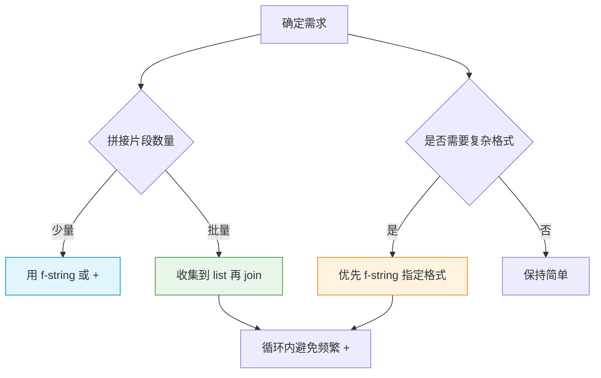

# P1D1-Python字符串完全指南-从创建拼接到格式化的高效实践

## 📝 摘要

面向零基础，一次搞懂 Python 字符串的创建、拼接与格式化；对比 +、join（连接）、f-string（格式化字符串）的可读性与性能，给出避坑与实战范式，帮你写出更快且清晰的代码。

---

## 目录

- [1. 前置知识点](#1-前置知识点)
- [2. 快速上手（3 分钟）](#2-快速上手3-分钟)
- [3. 字符串创建（creation（创建））](#3-字符串创建creation创建)
- [4. 字符串拼接（concatenation（拼接））](#4-字符串拼接concatenation拼接)
- [5. 字符串格式化（formatting（格式化））](#5-字符串格式化formatting格式化)
- [6. 性能与可读性对比](#6-性能与可读性对比)
- [7. 常见错误与对比修正](#7-常见错误与对比修正)
- [8. 选择建议与实践流程](#8-选择建议与实践流程)
- [9. 适用水平与练习建议](#9-适用水平与练习建议)
- [10. 📚 参考资料与学习资源](#10-参考资料与学习资源)
- [11. 总结](#11-总结)

---

## 1. 前置知识点

- 字符串（string，字符串）是不可变（immutable，不可变）的序列（sequence，序列）
- Python 采用 Unicode（统一码）表示文本；推荐显式声明编码只在文件头或 I/O 场景
- 基本转义（escape，转义）：`\n` 换行、`\t` 制表符；原始字符串（raw string，原始字符串）用 `r"..."`

---

## 2. 快速上手（3 分钟）
<p align="right"><span style="background:#e53935;color:#fff;padding:2px 6px;border-radius:4px">🔥 Must（必做实践）｜依赖：Python 3.8+（本概念在本文档某处有详细介绍）</span></p>

目的：用一个最小示例快速对比三件事——
- 创建（create（创建））：字面量、三引号多行
- 拼接（concatenate（拼接））：少量用 +，批量用 join（连接）
- 格式化（formatting（格式化））：优先 f-string（格式化字符串，Python 3.6+）

```python
name = "Alice"
age = 20

# 创建：三种常见字面量写法（单引号、双引号、三引号多行）
s1 = 'hello'
s2 = "python"
s3 = '''支持多行\n文本'''

# 拼接（小量）：片段很少时可读性好
hello = "Hello, " + name

# 拼接（批量）：容器里已有多段文本时优先使用 join（连接），CSV（逗号分隔值）
csv = ",".join(["a", "b", "c"])  # 结果为 "a,b,c"

# 格式化（推荐）：f-string（格式化字符串）语法简单、可读性强
msg = f"{name} is {age} years old"

print(hello)  # 打印小量拼接结果
print(csv)    # 打印批量拼接结果
print(msg)    # 打印格式化结果
```

输出结果：

```text
Hello, Alice
a,b,c
Alice is 20 years old
```

---

## 3. 字符串创建（creation（创建））
<p align="right"><span style="background:#fb8c00;color:#fff;padding:2px 6px;border-radius:4px">⚙️ Should（建议实践）｜依赖：任意 Python 3 版本</span></p>

- 单引号/双引号：`'abc'`、`"abc"`（功能等价）
- 三引号（triple quotes，三引号）：`'''多行'''`、`"""多行"""` 支持多行与内嵌换行
- 原始字符串（raw string，原始字符串）：`r"C:\\path"` 保留反斜杠语义
- 字符串复制：`"ab" * 3 -> "ababab"`

```python
# 原始字符串（raw string，原始字符串）：保留反斜杠语义，避免转义混乱
path = r"C:\Users\Alice\Desktop"

# 三引号：更易书写多行文本，字符串内部包含换行符
doc = """标题\n- 项目 A\n- 项目 B"""

print(path)
print(doc)
```

输出结果：

```text
C:\Users\Alice\Desktop
标题
- 项目 A
- 项目 B
```

---

## 4. 字符串拼接（concatenation（拼接））
<p align="right"><span style="background:#fb8c00;color:#fff;padding:2px 6px;border-radius:4px">⚙️ Should（建议实践）｜依赖：Python 3.7+；批量示例需基础容器</span></p>

### 4.0 join 是什么？（定义与规则）

- 定义：`str.join(iterable)` 将可迭代对象中的多个“字符串元素”按“分隔符字符串”连接为一个新字符串。
- 语法：`"分隔符".join(字符串序列)`，返回新字符串；原序列不变。
- 规则与限制：
  - 参数必须是可迭代对象（list（列表）、tuple（元组）、generator（生成器）等）。
  - 迭代内“所有元素”必须是字符串，否则 `TypeError`。
  - 性能：批量拼接用 join 更优，避免循环中多次 `+` 产生中间对象。
  - 空序列：返回空字符串 `""`。

示例（含非字符串元素的修正）：

```python
nums = [1, 2, 3]
# 错误：元素非字符串会报错
# ",".join(nums)

# 正确：先转字符串再 join
fixed = ",".join(map(str, nums))
print(fixed)
```

输出结果：

```text
1,2,3
```

### 4.1 `+` 与 `+=`（小量拼接）

简介：`+` 适合少量一次性拼接；`+=` 在循环内会产生大量中间对象导致性能下降，仅在次数很少时使用。

```python
a = "Hello"
b = "World"

# 小量片段：使用 + 可读性直观
res = a + ", " + b  # 生成 "Hello, World"

# 循环拼接警示：+= 在大量循环下会生成中间对象，性能差
s = ""
for i in range(3):
    s += str(i)

print(res)
print(s)
```

输出结果：

```text
Hello, World
012
```

适用：片段很少、一次性构造。缺点：大量循环会产生中间对象，性能差。

### 4.2 `str.join(iterable)`（批量高效）

简介：由“分隔符字符串”调用 `join`，把“可迭代里的字符串元素”连接为新字符串。规则：元素必须是字符串；适合批量（先收集到 list（列表），末端一次 join）。

```python
parts = ["id", "name", "score"]  # list（列表）
line = ",".join(parts)  # 将列表高效拼接为 "id,name,score"
print(line)
```

输出结果：

```text
id,name,score
```

适用：已在容器（list、tuple）中的多段文本；性能与可读性兼顾，是批量拼接首选。

### 4.3 f-string（格式化字符串）参与拼接

简介：当拼接中包含变量/表达式或需要同时控制格式时，用 f-string 令模板更清晰；必要时再与 join 结合使用。

```python
user = "alice"
cnt = 5
msg = f"user={user}, count={cnt}"  # 在模板中直接嵌入变量/表达式
print(msg)
```

输出结果：

```text
user=alice, count=5
```

适用：变量多、含表达式、需高可读性场景；Python 3.6+。

---

## 5. 字符串格式化（formatting（格式化））
<p align="right"><span style="background:#e53935;color:#fff;padding:2px 6px;border-radius:4px">🔥 Must（必做实践）｜依赖：f-string 需 Python 3.6+；建议 3.8+</span></p>

### 5.1 f-string（推荐，Python 3.6+）

f-string 是什么（定义与要点）：
- 定义：在字符串字面量前加前缀 `f`/`F`，在花括号 `{}` 内直接写表达式，运行时求值并格式化插入。
- 版本：Python 3.6+；3.8+ 支持“自描述输出”语法 `{expr=}`。性能更新：Python 3.12/3.13 对 f-string 做了优化，格式化更快（详见参考资料中的 “What’s New”）。
- 转换标志：`!s` 使用 `str()`、`!r` 使用 `repr()`、`!a` 使用 `ascii()`。
- 格式说明：与 format 迷你语言一致（对齐、宽度、精度、千分位等）。
- 限制：字面量内不要写反斜杠换行；跨行请用多行字符串，每行都以 `f` 开头或用括号包裹多段相邻 f-string。

#### 5.1.x 转换标志详解（!s / !r / !a）

用途与差异（将表达式转换为字符串插入前的“表示形式（representation（表示形式））选择”）：
- `!s` 等价 `str(x)`：给人看的友好文本表示，适合日志面向用户的输出。
- `!r` 等价 `repr(x)`：给开发者看的精确表示，常含引号与转义，便于调试与还原对象。
- `!a` 等价 `ascii(x)`：将非 ASCII（美国信息交换标准代码）字符转义为 `\x`/`\u` 序列，便于跨终端/编码安全显示。

最小示例：

```python
value = "中文Ω"
print(f"!s={value!s}")  # 走 str：原样友好输出
print(f"!r={value!r}")  # 走 repr：带引号，转义更严格
print(f"!a={value!a}")  # 走 ascii：非 ASCII 转义
```

输出结果（不同环境显示略有差异，这里给出常见表现）：

```text
!s=中文Ω
!r='中文Ω'
!a='\u4e2d\u6587\u03a9'
```

与对象的 `__str__`/`__repr__`（魔术方法）关系：

```python
class User:
    def __init__(self, name):
        self.name = name
    def __str__(self):        # 面向用户的可读表示
        return f"User<{self.name}>"
    def __repr__(self):       # 面向开发者、可用于还原的精确表示
        return f"User(name={self.name!r})"

u = User("alice")
print(f"{u!s}")  # 调用 __str__ -> User<alice>
print(f"{u!r}")  # 调用 __repr__ -> User(name='alice')
```

何时使用：
- 产出面向最终用户（user-facing（面向用户））/日志摘要：首选 `!s`
- 调试、日志定位、需要精准结构信息：首选 `!r`
- 需要避免终端/文件编码干扰（例如混合多语言符号）：用 `!a`

常见注意点：
- `!s/!r/!a` 仅决定“表达式转字符串”的方式，不影响后续“格式说明”（如 `:.2f`）对数值的格式控制。
- 如果对象未实现 `__str__`/`__repr__`，Python 会继承默认实现；`!r` 依然更偏向“精确与可调试”。

示例（表达式、转换标志、自描述输出）：

```python
name = "Alice"
score = 95.25
print(f"{name.upper()} -> {score:.1f}")   # 表达式与格式说明
print(f"{name!r}")                         # !r 使用 repr
value = 42
print(f"{value=}")                         # 3.8+ 自描述输出
```

输出结果：

```text
ALICE -> 95.3
'Alice'
value=42
```

补充示例：格式说明常见用法（小数位、千分位、!r）

```python
pi = 3.1415926
print(f"pi≈{pi:.2f}")   # :.2f 保留 2 位小数
print(f"{1000:,}")      # :,   千位分隔符
name = "Alice"
print(f"{name!r}")      # !r   使用 repr 表示，开发者友好
```

输出结果：

```text
pi≈3.14
1,000
'Alice'
```

优点：最简洁、可读性强、支持表达式与格式说明；缺点：依赖 Python 3.6+。

### 5.2 `str.format()`（兼容性好）

简介：`str.format()` 使用占位符 `{}` 与“格式迷你语言”控制输出格式，兼容性好、易于与字典/命名参数组合使用。

```python
tmpl = "{user} scored {score:.1f}"
print(tmpl.format(user="alice", score=95.0))  # 关键字参数 + 精度控制

# 位置/关键字混用：同时使用位置与命名字段
print("{0} -> {name}".format("id001", name="alice"))
```

输出结果：

```text
alice scored 95.0
id001 -> alice
```

优点：灵活、兼容 Py3 全系；缺点：语法相对冗长。

### 5.3 百分号格式化（`%` formatting，历史兼容）

简介：早期格式化方式，使用 `%` 与类型占位符（如 `%s/%d/%f`）。优点是老项目中广泛存在；缺点是占位类型易错、可读性一般，不建议在新代码中继续使用。

```python
print("%s is %d years" % ("Alice", 20))  # %s 字符串占位，%d 整数占位
print("%.2f" % 3.14159)                   # %.2f 保留 2 位小数
```

输出结果：

```text
Alice is 20 years
3.14
```

优点：老代码常见；缺点：类型占位符易错、可读性一般，除维护存量代码外不推荐新增。

---

## 6. 性能与可读性对比
<p align="right"><span style="background:#1e88e5;color:#fff;padding:2px 6px;border-radius:4px">🧩 Could（可选实践）｜依赖：基础基准测试认知</span></p>

如何阅读：按场景选策略——少量拼接重可读性（+ 或 f-string）、批量拼接收集到 list 后一次性 join、复杂格式用 f-string 指定格式。
| 需求 | 首选 | 备选 |
| --- | --- | --- |
| 少量一次性拼接 | `+` / f-string | `str.format()` |
| 批量拼接（列表已有片段） | `"".join(list)` | f-string 循环收集到 list 后再 join |
| 复杂版式（含格式控制） | f-string | `str.format()` |
| 维护旧代码 | `%` 格式化 | 逐步迁移到 f-string |

提示：循环内高频拼接优先积累到 list，最后 `"".join(list)` 一次成串。

---

## 7. 常见错误与对比修正
<p align="right"><span style="background:#e53935;color:#fff;padding:2px 6px;border-radius:4px">🔥 Must（必做实践）｜依赖：Python 3.7+；按示例运行校验</span></p>

本节先给出“容易犯错的写法”，再给出“等价且更优的正确写法”，并提供对应输出，方便对照验证。

```python
# 错误：在循环里频繁用 + 叠加（性能差）
s = ""
for i in range(5):
    s += str(i)
print(s)

# 正确：收集后一次性 join（性能更优）
s2 = "".join(str(i) for i in range(5))
print(s2)
```

输出结果：

```text
01234
01234
```

路径转义与显示差异：Windows（操作系统）路径中的 `\t` 容易被解释为制表符；原始字符串或双反斜杠可避免该问题。

```python
# 错误：混用引号造成转义混乱（\t 被解释为制表符）
path_bad = "C:\\Users\\Alice\\Desktop\\new\t.txt"
print(path_bad)  # 实际为 \t 转义

# 正确：原始字符串或双反斜杠
path_ok1 = r"C:\\Users\\Alice\\Desktop\\new\\t.txt"
path_ok2 = "C:\\Users\\Alice\\Desktop\\new\\t.txt"
print(path_ok1)
print(path_ok2)
```

输出结果（不同终端可能对制表符显示不同，这里展示常见表现）：

```text
C:\Users\Alice\Desktop\new	.txt
C:\\Users\\Alice\\Desktop\\new\\t.txt
C:\\Users\\Alice\\Desktop\\new\\t.txt
```

```python
# 对比：三种格式化
name, score = "Alice", 95.5
_a = f"{name} scored {score:.1f}"              # 推荐
_b = "{n} scored {s:.1f}".format(n=name, s=score)
_c = "%s scored %.1f" % (name, score)          # 维护旧代码
print(_a)
print(_b)
print(_c)
```

输出结果：

```text
Alice scored 95.5
Alice scored 95.5
Alice scored 95.5
```

---

## 8. 选择建议与实践流程
<p align="right"><span style="background:#fb8c00;color:#fff;padding:2px 6px;border-radius:4px">⚙️ Should（建议实践）｜依赖：能阅读 Mermaid（人机可读流程图）</span></p>

如何使用本图：先判断拼接片段数量与是否需要格式控制，再据箭头选择对应手段；必要时组合（收集 + join，输出用 f-string）。



---

## 9. 适用水平与练习建议
<p align="right"><span style="background:#fb8c00;color:#fff;padding:2px 6px;border-radius:4px">⚙️ Should（建议实践）｜依赖：完成上文 Must 章节练习</span></p>

- 小白（零基础）：掌握创建、`+`、`join`、f-string 三件套；完成 3 个练习（CSV 行拼接、路径字符串、成绩单格式化）
- 初级：熟练使用格式说明（对齐、宽度、小数位、千分位），掌握原始字符串、转义与多行文本
- 中级：编写对性能敏感的批量拼接（列表收集 + join），形成“循环不 +，末端 join”的习惯

---

## 10. 📚 参考资料与学习资源
<p align="right"><span style="background:#757575;color:#fff;padding:2px 6px;border-radius:4px">📘 Won’t（了解即可）｜依赖：可联网访问官方站点</span></p>

### 官方资源

- [Python 官方文档（字符串方法）](https://docs.python.org/zh-cn/3/library/stdtypes.html#textseq)
- [str.join 方法](https://docs.python.org/zh-cn/3/library/stdtypes.html#str.join)
- [格式规范迷你语言（format spec）](https://docs.python.org/zh-cn/3/library/string.html#formatspec)
- [PEP 498：f-string 设计提案与语法](https://peps.python.org/pep-0498/)
- [f-string 语法参考（官方手册）](https://docs.python.org/zh-cn/3/reference/lexical_analysis.html#f-strings)
- [What’s New In Python 3.12（官方）](https://docs.python.org/3/whatsnew/3.12.html)
- [What’s New In Python 3.13（官方）](https://docs.python.org/3/whatsnew/3.13.html)

### 在线教程

- [Python 字符串教程（官方教程）](https://docs.python.org/zh-cn/3/tutorial/introduction.html#strings)
- [Real Python - Python Strings](https://realpython.com/python-strings/)

### 推荐书籍

- 《Python 编程：从入门到实践》- Eric Matthes
- 《Effective Python》- Brett Slatkin

---

## 11. 总结

### 🎯 核心要点回顾

1) 创建：引号/三引号/原始字符串，牢记字符串不可变；2) 拼接：小量用 `+`/f-string，批量用 `"".join(list)`；3) 格式化：优先 f-string，兼顾 `str.format()`；4) 循环内避免 `+`，末端一次性 join。

### 💡 下一步行动

1) 重写你最近的日志输出，用 f-string 与格式说明增强可读性
2) 将循环里的 `+` 改为“收集到 list 后一次性 join”
3) 为金额、百分比添加格式（小数位、千分位）

**加油，未来的 Python 专家！** 把握“少量 f-string、批量 join”的黄金法则，你的代码会更快更清晰。

---

**厦门工学院人工智能创作坊 -- 郑恩赐**  
**2025 年 10 月 30 日**


