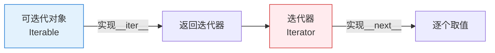

# P2B-Python可迭代对象完全指南-从列表到生成器的Python编程利器

## 📝 摘要


## 1. 什么是可迭代对象 📚

**可迭代对象（Iterable）** 就是可以用 `for` 循环遍历的对象 🔁

通俗来说，就是"能一个一个取出元素的对象"：

```python
# 列表是可迭代对象
for item in [1, 2, 3]:
    print(item)  # 依次输出 1, 2, 3

# 字符串是可迭代对象
for char in "hello":
    print(char)  # 依次输出 h, e, l, l, o

# 字典是可迭代对象
for key in {"name": "Tom", "age": 18}:
    print(key)  # 依次输出 name, age
```

### 技术定义

从代码层面来说，**实现了 `__iter__` 方法的对象就是可迭代对象**：

```python
# 查看列表的__iter__方法
print([].__iter__)  # <method-wrapper '__iter__' of list object at 0x...>
```

这个方法的作用是返回一个**迭代器**（Iterator），然后我们就可以用迭代器逐个获取元素啦~


## 2. 常见可迭代对象类型 🔍

Python 中的可迭代对象非常丰富，主要分为以下几类 📋

### 2.1 内置序列类型

| 类型 | 示例 | 说明 |
|------|------|------|
| 列表 | `[1, 2, 3]` | 有序、可变 |
| 元组 | `(1, 2, 3)` | 有序、不可变 |
| 字符串 | `"hello"` | 有序、字符序列 |
| range | `range(5)` | 整数序列 |

```python
# 列表
for i in [1, 2, 3]:
    print(i)

# 元组
for i in (1, 2, 3):
    print(i)

# 字符串
for c in "abc":
    print(c)

# range
for i in range(3):
    print(i)  # 0, 1, 2
```

### 2.2 集合类型

| 类型 | 示例 | 说明 |
|------|------|------|
| 集合 | `{1, 2, 3}` | 无序、唯一 |
| 字典 | `{"a": 1}` | 键值对 |

```python
# 集合（遍历的是键）
for i in {1, 2, 3}:
    print(i)

# 字典（默认遍历键）
for key in {"name": "Tom", "age": 18}:
    print(key)  # name, age
```

### 2.3 特殊类型

| 类型 | 示例 | 说明 |
|------|------|------|
| 文件对象 | `open("file.txt")` | 逐行读取 |
| 生成器 | `(i for i in range(5))` | 惰性生成，按需取值 |
| 迭代器 | `iter([1,2,3])` | 消耗性遍历，用完就没 |

**什么是消耗性遍历？**

> 💡 知道了解就好，不用深究

迭代器**无法二次使用**，用完就没了 🚫

```python
it = iter([1, 2, 3])
for i in it:
    print(i)  # 1, 2, 3

# 二次使用：什么都不输出，也不会报错
for i in it:
    print(i)  # 不输出
```

**什么是惰性生成？**

> 💡 知道了解就好，不用深究

简单说，生成器**记录了数据怎么生成的规则**，只有当你**用 `next()` 或遍历时**，才会**根据这个规则生成具体的值** 🏭

- **列表** `[1,2,3]` → 直接存了3个值
- **生成器** `(x for x in range(3))` → 只存了"怎么生成"的规则，用到时才算

```python
# 列表 → 直接存值
lst = [1, 2, 3]

# 生成器 → 记录生成规则，用next()才取值
gen = (x * 2 for x in range(3))
print(next(gen))  # 0
print(next(gen))  # 2
print(next(gen))  # 4
```

```python
# 生成器表达式
gen = (i * 2 for i in range(3))
for i in gen:
    print(i)  # 0, 2, 4

# range 对象
for i in range(5):
    print(i)
```

> 💡 **Tip**：几乎所有可以"逐个访问"的数据结构都是可迭代对象！


## 3. 如何判断可迭代对象 ❓

可以用 `isinstance()` 配合 `collections.abc.Iterable` 来判断 🔍

```python
from collections.abc import Iterable

# 测试常见对象
print(isinstance([1, 2, 3], Iterable))  # True - 列表
print(isinstance("hello", Iterable))     # True - 字符串
print(isinstance((1, 2, 3), Iterable))   # True - 元组
print(isinstance({1, 2, 3}, Iterable))   # True - 集合
print(isinstance({"a": 1}, Iterable))   # True - 字典
print(isinstance(range(5), Iterable))    # True - range
print(isinstance((x for x in range(3)), Iterable))  # True - 生成器

# 非可迭代对象
print(isinstance(100, Iterable))          # False - 数字
print(isinstance(None, Iterable))         # False - None
```

### 原理

判断依据：对象是否实现了 `__iter__` 方法

```python
# 列表有 __iter__ 方法
print(hasattr([1, 2, 3], '__iter__'))  # True

# 数字没有
print(hasattr(100, '__iter__'))  # False
```

> 💡 推荐用 `isinstance(obj, Iterable)` 的方式，更规范可靠！


## 4. 迭代器与可迭代对象的区别 🔄

这两个概念很容易混淆，来一张图说明：



### 核心区别

| | 可迭代对象 (Iterable) | 迭代器 (Iterator) |
|---|---|---|
| 实现方法 | `__iter__` | `__iter__` + `__next__` |
| 能否获取下一个值 | ❌ 不能 | ✅ 能 |
| 能否二次遍历 | ✅ 可以 | ❌ 只能一次 |
| 例子 | 列表、字符串、字典 | 生成器、`iter([1,2,3])` |

```python
# 列表 → 可迭代对象
lst = [1, 2, 3]
print(hasattr(lst, '__iter__'))  # True
print(hasattr(lst, '__next__'))  # False

# iter() 返回的是迭代器
it = iter(lst)
print(hasattr(it, '__iter__'))  # True
print(hasattr(it, '__next__'))  # True

# 用 next() 获取值
print(next(it))  # 1
print(next(it))  # 2
print(next(it))  # 3
# print(next(it))  # StopIteration 异常
```

### 关系总结

> **可迭代对象** 实现了 `__iter__`，可以返回 **迭代器**  
> **迭代器** 实现了 `__next__`，可以逐个取值

简单说：**迭代器 = 可迭代对象 + 取值能力** 🔧


## 5. 如何创建可迭代对象和迭代器 🔧

### 5.1 创建可迭代对象

`iter()` 是 Python 内置函数，用于获取可迭代对象的迭代器：

```python
# iter(可迭代对象) → 返回迭代器
lst = [1, 2, 3]
it = iter(lst)  # 获取迭代器
print(next(it))  # 1

# 也可以直接用 iter(obj)
# 相当于调用 obj.__iter__()
```

只需要实现 `__iter__` 方法，返回一个迭代器即可：

```python
# 方式一：用 iter() 返回迭代器
class MyIterable:
    def __init__(self, data):
        self.data = data
    
    def __iter__(self):
        # 返回迭代器对象
        return iter(self.data)

# 方式二：同时实现 __iter__ + __next__，返回 self
class MyIterable2:
    def __init__(self, data):
        self.data = data
        self.index = 0
    
    def __iter__(self):
        return self  # 返回自身
    
    def __next__(self):
        if self.index >= len(self.data):
            raise StopIteration
        value = self.data[self.index]
        self.index += 1
        return value

# 使用
obj = MyIterable([1, 2, 3])
for i in obj:
    print(i)  # 1, 2, 3
```

### 方式三：旧式兼容（了解即可）

Python 早期版本没有 `__iter__`，可以用 `__getitem__` 实现可迭代：

```python
class MyIterable3:
    def __init__(self, data):
        self.data = data
    
    def __getitem__(self, index):
        return self.data[index]

# Python 会自动从 index 0 开始尝试调用 __getitem__
obj = MyIterable3([1, 2, 3])
for i in obj:
    print(i)  # 1, 2, 3
```

> 💡 这种方式是为了兼容性，了解就行，现在推荐用方式一或方式二！

### 5.2 创建迭代器

需要同时实现 `__iter__` 和 `__next__` 方法：

```python
class MyIterator:
    def __init__(self, data):
        self.data = data
        self.index = 0
    
    def __iter__(self):
        return self  # 返回自身
    
    def __next__(self):
        if self.index >= len(self.data):
            raise StopIteration  # 迭代结束
        value = self.data[self.index]
        self.index += 1
        return value

# 使用
it = MyIterator([1, 2, 3])
print(next(it))  # 1
print(next(it))  # 2
print(next(it))  # 3
# next(it)  # StopIteration
```

### 5.3 用 yield 创建生成器（推荐！）

用 `yield` 关键字，**不需要 iter()，不需要写类**，直接创建可迭代对象：

```python
# 用 yield 的函数 → 生成器
def my_generator():
    yield 1
    yield 2
    yield 3

# 调用函数不会执行，只是返回生成器对象
gen = my_generator()
print(gen)  # <generator object my_generator at ...>

# 生成器本身就是迭代器，不需要 iter()
for i in gen:
    print(i)  # 1, 2, 3
```

**特点**：
- 调用函数不执行，只是返回生成器对象
- 用 `next()` 或遍历时才执行
- **用到才生成值**，不占内存

> 💡 **最推荐的方式**，代码最简洁！


## 6. 总结 📌

---

最后更新时间：