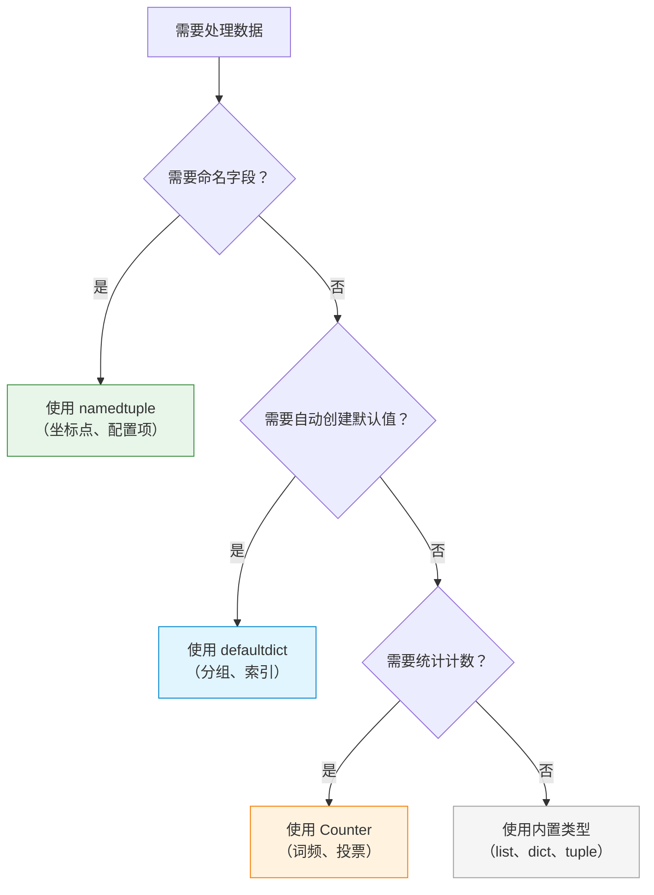

# P2J-Python-collections-什么是namedtuple、defaultdict和Counter？为什么一线开发者都在用？怎么快速掌握？

## 📝 摘要

为什么一线开发者都在用 namedtuple、defaultdict 和 Counter？本文档用生活化比喻解析这三个 collections 工具，帮你掌握高效的数据处理技巧，提升代码可读性和性能。

---

## 目录

- [1. 前置知识点](#1-前置知识点)
- [2. 什么是 collections 模块？](#2-什么是-collections-模块)
- [3. namedtuple（命名元组）：带名字的元组](#3-namedtuple命名元组带名字的元组)
  - [3.1 namedtuple 的基本概念](#31-namedtuple-的基本概念)
  - [3.2 生活化比喻](#32-生活化比喻)
  - [3.3 创建 namedtuple](#33-创建-namedtuple)
  - [3.4 namedtuple 的优势](#34-namedtuple-的优势)
  - [3.5 实际应用场景](#35-实际应用场景)
- [4. defaultdict（默认字典）：自动创建默认值的字典](#4-defaultdict默认字典自动创建默认值的字典)
  - [4.1 defaultdict 的基本概念](#41-defaultdict-的基本概念)
  - [4.2 生活化比喻](#42-生活化比喻)
  - [4.3 创建 defaultdict](#43-创建-defaultdict)
  - [4.4 defaultdict 的优势](#44-defaultdict-的优势)
  - [4.5 实际应用场景](#45-实际应用场景)
- [5. Counter（计数器）：专业的统计工具](#5-counter计数器专业的统计工具)
  - [5.1 Counter 的基本概念](#51-counter-的基本概念)
  - [5.2 生活化比喻](#52-生活化比喻)
  - [5.3 创建 Counter](#53-创建-counter)
  - [5.4 Counter 的常用方法](#54-counter-的常用方法)
  - [5.5 Counter 的优势](#55-counter-的优势)
  - [5.6 实际应用场景](#56-实际应用场景)
- [6. 对比示例：不使用 collections 的问题](#6-对比示例不使用-collections-的问题)
- [7. 三种工具的选择建议](#7-三种工具的选择建议)
- [8. 常见错误与修正](#8-常见错误与修正)
- [9. 总结与展望](#9-总结与展望)
- [10. 📚 参考资料与学习资源](#10-参考资料与学习资源)

---

## 1. 前置知识点

### 基础知识点（必须掌握）

在学习 collections 模块之前，你需要掌握以下知识点：

- **列表（List）**：了解列表的基本操作（参考 P2A 文档）
- **字典（Dictionary）**：了解字典的基本操作（参考 P2D 文档）
- **元组（Tuple）**：了解元组的基本概念
- **函数**：了解函数的定义和调用（参考 P3A 文档）

### 🎯 **学习建议**

- **零基础小白**：建议先学习列表和字典的基础操作，再学习 collections 模块
- **有基础读者**：可以直接学习 collections 模块的高级用法

---

## 2. 什么是 collections 模块？

### 2.1 collections 模块的基本定义

**collections（集合）模块**是 Python 标准库中的一个模块，提供了许多有用的数据结构（Data Structure（数据结构）），这些数据结构是对内置数据类型（如列表、字典、元组）的扩展和增强。

**collections 模块的特点**：
- **扩展性强**：提供了内置数据结构的增强版本
- **高效实用**：针对特定场景优化性能
- **易于使用**：API 简单直观
- **功能强大**：解决实际编程中的常见问题

### 2.2 生活化比喻

**生活化比喻**：collections 模块就像**专业工具箱**。

想象一下：
- **内置数据类型**（list、dict、tuple）= 普通工具箱（基础工具）
- **collections 模块** = 专业工具箱（高级工具）
  - `namedtuple` = 带标签的储物盒（知道里面装的是什么）
  - `defaultdict` = 自动补充的仓库（缺少什么自动补上）
  - `Counter` = 专业的统计器（自动计数）

**另一个比喻**：
- **内置数据类型** = 普通汽车（基本功能）
- **collections 模块** = 专业赛车（高性能、针对特定场景优化）

### 2.3 collections 模块包含的工具

collections 模块包含以下常用工具：

| 工具 | 说明 | 适用场景 |
|------|------|---------|
| **namedtuple** | 带字段名的元组 | 需要为元组元素命名，提高代码可读性 |
| **defaultdict** | 带默认值的字典 | 需要自动创建默认值，避免 KeyError |
| **Counter** | 计数器 | 需要统计元素出现次数 |
| **deque** | 双端队列 | 需要高效的队列操作（本知识点不涉及，见 P2K） |
| **OrderedDict** | 有序字典 | 需要保持插入顺序（本知识点不涉及，见 P2K） |

**本文档重点讲解**：namedtuple、defaultdict、Counter 这三个最常用的工具。

---

## 3. namedtuple（命名元组）：带名字的元组

### 3.1 namedtuple 的基本概念

**namedtuple（命名元组）**是 collections 模块提供的一个工厂函数（Factory Function（工厂函数）），用于创建一个带字段名的元组子类。它结合了元组的不可变性和字典的可读性，让代码更加清晰易懂。

**namedtuple 的特点**：
- **不可变性**：和普通元组一样，创建后不能修改
- **可读性**：可以通过字段名访问元素，而不只是索引
- **内存效率**：比普通类占用的内存更少
- **兼容性**：可以像普通元组一样使用索引访问

### 3.2 生活化比喻

**生活化比喻**：namedtuple 就像**带标签的储物盒**。

想象一下：
- **普通元组** = 没有标签的盒子（只能通过位置知道是什么：`box[0]`、`box[1]`）
- **namedtuple** = 带标签的盒子（可以通过标签知道是什么：`box.name`、`box.age`）

**另一个比喻**：
- **普通元组** = 匿名快递包裹（只能通过编号查找）
- **namedtuple** = 有收件人姓名的快递包裹（可以直接通过姓名查找）

### 3.3 创建 namedtuple

**基本语法**：

```python
from collections import namedtuple

# 创建一个 namedtuple 类型
类型名 = namedtuple('类型名', ['字段1', '字段2', ...])

# 创建实例
实例 = 类型名(值1, 值2, ...)
```

**实际示例**：

```python
from collections import namedtuple

# 创建一个表示坐标点的 namedtuple
Point = namedtuple('Point', ['x', 'y'])

# 创建坐标点实例
p1 = Point(1, 2)
p2 = Point(x=3, y=4)  # 也可以使用关键字参数

# 通过字段名访问（推荐）
print(f"x 坐标：{p1.x}")  # 输出：x 坐标：1
print(f"y 坐标：{p1.y}")  # 输出：y 坐标：2

# 也可以通过索引访问（兼容普通元组）
print(f"x 坐标：{p1[0]}")  # 输出：x 坐标：1
print(f"y 坐标：{p1[1]}")  # 输出：y 坐标：2

# 可以像普通元组一样解包
x, y = p1
print(f"x={x}, y={y}")  # 输出：x=1, y=2
```

**字段名的指定方式**：

```python
from collections import namedtuple

# 方式1：使用列表（推荐）
Person = namedtuple('Person', ['name', 'age', 'city'])

# 方式2：使用字符串（用空格或逗号分隔）
Person = namedtuple('Person', 'name age city')
Person = namedtuple('Person', 'name, age, city')

# 创建实例
p = Person('张三', 25, '北京')
print(f"姓名：{p.name}，年龄：{p.age}，城市：{p.city}")
# 输出：姓名：张三，年龄：25，城市：北京
```

### 3.4 namedtuple 的优势

**对比示例**：

**不使用 namedtuple（普通元组）的问题**：

```python
# 使用普通元组，不知道每个位置代表什么
student1 = ('张三', 18, '北京', '高三')
print(f"姓名：{student1[0]}")  # ❌ 不直观，需要记住索引含义
print(f"年龄：{student1[1]}")  # ❌ 容易出错，索引混淆
```

**使用 namedtuple 的优势**：

```python
from collections import namedtuple

# 使用 namedtuple，代码更清晰
Student = namedtuple('Student', ['name', 'age', 'city', 'grade'])
student1 = Student('张三', 18, '北京', '高三')
print(f"姓名：{student1.name}")   # ✅ 直观明了
print(f"年龄：{student1.age}")    # ✅ 不会混淆
print(f"城市：{student1.city}")   # ✅ 可读性强
```

**优势总结**：

| 特性 | 普通元组 | namedtuple |
|------|---------|-----------|
| **可读性** | ❌ 需要记住索引含义 | ✅ 字段名清晰明了 |
| **安全性** | ❌ 容易索引错误 | ✅ 字段名不容易写错 |
| **维护性** | ❌ 修改字段顺序影响大 | ✅ 字段名不变，顺序可变 |
| **性能** | ✅ 性能相同 | ✅ 性能相同 |
| **兼容性** | ✅ 基础类型 | ✅ 完全兼容元组操作 |

### 3.5 实际应用场景

**场景 1：表示坐标点**

```python
from collections import namedtuple

Point = namedtuple('Point', ['x', 'y'])
p1 = Point(0, 0)
p2 = Point(3, 4)

# 计算两点距离
distance = ((p2.x - p1.x)**2 + (p2.y - p1.y)**2)**0.5
print(f"距离：{distance}")  # 输出：距离：5.0
```

**场景 2：表示学生信息**

```python
from collections import namedtuple

Student = namedtuple('Student', ['name', 'age', 'score'])
students = [
    Student('张三', 18, 85),
    Student('李四', 19, 92),
    Student('王五', 18, 78)
]

# 查找高分学生
high_score_students = [s for s in students if s.score >= 90]
for student in high_score_students:
    print(f"{student.name}：{student.score} 分")
```

**场景 3：函数返回多个值**

```python
from collections import namedtuple

# 定义返回结果类型
Result = namedtuple('Result', ['success', 'message', 'data'])

def process_data(data):
    if not data:
        return Result(False, "数据为空", None)
    return Result(True, "处理成功", data.upper())

# 使用
result = process_data("hello")
if result.success:
    print(f"{result.message}：{result.data}")  # ✅ 代码清晰
```

---

## 4. defaultdict（默认字典）：自动创建默认值的字典

### 4.1 defaultdict 的基本概念

**defaultdict（默认字典）**是 collections 模块提供的一个字典子类，它继承自内置的 `dict` 类，但增加了一个重要特性：当访问不存在的键时，会自动创建一个默认值，而不是抛出 `KeyError` 异常。

**defaultdict 的特点**：
- **自动创建默认值**：访问不存在的键时自动创建默认值
- **避免 KeyError**：不会因为访问不存在的键而报错
- **提高代码简洁性**：减少 if 判断和异常处理
- **完全兼容字典**：可以像普通字典一样使用

### 4.2 生活化比喻

**生活化比喻**：defaultdict 就像**自动补充的仓库**。

想象一下：
- **普通字典** = 普通仓库（如果没有货物，取货时会报错）
- **defaultdict** = 自动补充仓库（如果没有货物，会自动补上默认货物）

**另一个比喻**：
- **普通字典** = 普通书架（找书时如果没有会报错）
- **defaultdict** = 智能书架（找书时如果没有会自动创建空书架）

### 4.3 创建 defaultdict

**基本语法**：

```python
from collections import defaultdict

# 创建一个 defaultdict，指定默认值工厂函数
d = defaultdict(默认值工厂函数)

# 常用的默认值工厂函数
d1 = defaultdict(int)      # 默认值为 0
d2 = defaultdict(list)     # 默认值为空列表 []
d3 = defaultdict(set)      # 默认值为空集合 set()
d4 = defaultdict(str)      # 默认值为空字符串 ""
d5 = defaultdict(lambda: "未知")  # 默认值为自定义值
```

**实际示例**：

```python
from collections import defaultdict

# 示例 1：使用 int 作为默认值（默认值为 0）
scores = defaultdict(int)
scores['张三'] = 85
print(scores['张三'])  # 输出：85
print(scores['李四'])  # 输出：0（自动创建默认值，不会报错）

# 示例 2：使用 list 作为默认值（默认值为空列表）
groups = defaultdict(list)
groups['学生'].append('张三')
groups['学生'].append('李四')
print(groups['学生'])  # 输出：['张三', '李四']
print(groups['老师'])  # 输出：[]（自动创建空列表）

# 示例 3：使用自定义函数作为默认值
info = defaultdict(lambda: "未知")
print(info['城市'])  # 输出：未知
```

### 4.4 defaultdict 的优势

**对比示例**：

**不使用 defaultdict（普通字典）的问题**：

```python
# 统计单词出现次数
words = ['apple', 'banana', 'apple', 'orange', 'banana', 'apple']
word_count = {}

# ❌ 需要手动检查键是否存在
for word in words:
    if word in word_count:
        word_count[word] += 1
    else:
        word_count[word] = 1

print(word_count)  # 输出：{'apple': 3, 'banana': 2, 'orange': 1}
```

**使用 defaultdict 的优势**：

```python
from collections import defaultdict

words = ['apple', 'banana', 'apple', 'orange', 'banana', 'apple']
word_count = defaultdict(int)

# ✅ 不需要检查键是否存在，直接操作
for word in words:
    word_count[word] += 1  # 自动创建默认值 0，然后加 1

print(dict(word_count))  # 输出：{'apple': 3, 'banana': 2, 'orange': 1}
```

**另一个对比示例**：

**不使用 defaultdict（按类别分组）**：

```python
# 按城市分组学生
students = [
    ('张三', '北京'),
    ('李四', '上海'),
    ('王五', '北京'),
    ('赵六', '广州')
]

city_students = {}

# ❌ 需要手动检查键是否存在
for name, city in students:
    if city not in city_students:
        city_students[city] = []
    city_students[city].append(name)

print(city_students)  # 输出：{'北京': ['张三', '王五'], '上海': ['李四'], '广州': ['赵六']}
```

**使用 defaultdict 的优势**：

```python
from collections import defaultdict

students = [
    ('张三', '北京'),
    ('李四', '上海'),
    ('王五', '北京'),
    ('赵六', '广州')
]

city_students = defaultdict(list)

# ✅ 不需要检查键是否存在，直接追加
for name, city in students:
    city_students[city].append(name)

print(dict(city_students))  # 输出：{'北京': ['张三', '王五'], '上海': ['李四'], '广州': ['赵六']}
```

**优势总结**：

| 特性 | 普通字典 | defaultdict |
|------|---------|------------|
| **代码简洁性** | ❌ 需要 if 判断 | ✅ 代码更简洁 |
| **错误处理** | ❌ 需要处理 KeyError | ✅ 自动处理，不会报错 |
| **性能** | ✅ 相同 | ✅ 相同 |
| **可读性** | ⚠️ 代码冗长 | ✅ 代码简洁明了 |

### 4.5 实际应用场景

**场景 1：统计元素出现次数**

```python
from collections import defaultdict

# 统计列表中每个元素的出现次数
numbers = [1, 2, 3, 2, 1, 3, 1, 1, 2]
count = defaultdict(int)

for num in numbers:
    count[num] += 1

print(dict(count))  # 输出：{1: 4, 2: 3, 3: 2}
```

**场景 2：按类别分组**

```python
from collections import defaultdict

# 按部门分组员工
employees = [
    ('张三', '技术部'),
    ('李四', '销售部'),
    ('王五', '技术部'),
    ('赵六', '人事部'),
    ('孙七', '技术部')
]

dept_employees = defaultdict(list)
for name, dept in employees:
    dept_employees[dept].append(name)

for dept, names in dept_employees.items():
    print(f"{dept}：{', '.join(names)}")
# 输出：
# 技术部：张三, 王五, 孙七
# 销售部：李四
# 人事部：赵六
```

**场景 3：构建索引**

```python
from collections import defaultdict

# 为文档中的单词构建位置索引
documents = [
    "Python is great",
    "Python is easy",
    "Python is powerful"
]

word_positions = defaultdict(list)
for doc_id, doc in enumerate(documents):
    words = doc.split()
    for position, word in enumerate(words):
        word_positions[word.lower()].append((doc_id, position))

print(word_positions['python'])  # 输出：[(0, 0), (1, 0), (2, 0)]
```

---


## 5. Counter（计数器）：专业的统计工具

### 5.1 Counter 的基本概念

**Counter（计数器）**是 collections 模块提供的一个字典子类，专门用于统计可哈希（Hashable（可哈希））对象的出现次数。它将元素作为键（Key），出现次数作为值（Value），提供了便捷的计数功能。

**Counter 的特点**：
- **自动计数**：自动统计元素出现次数
- **功能丰富**：提供了多种统计和操作方法
- **高效便捷**：比手动循环计数更简洁高效
- **兼容字典**：完全兼容字典的所有操作

### 5.2 生活化比喻

**生活化比喻**：Counter 就像**专业的统计器**。

想象一下：
- **手动计数** = 人工数数（容易出错，效率低）
- **Counter** = 自动计数器（准确快速，功能强大）

**另一个比喻**：
- **手动统计** = 手工记账（一个个数）
- **Counter** = 电子记账器（自动统计，还能排序、筛选）

### 5.3 创建 Counter

**基本语法**：

```python
from collections import Counter

# 创建 Counter 对象
c = Counter(可迭代对象)
c = Counter({'键1': 值1, '键2': 值2})  # 从字典创建
c = Counter(键1=值1, 键2=值2)  # 使用关键字参数
```

**实际示例**：

```python
from collections import Counter

# 示例 1：统计字符串中字符的出现次数
text = "abracadabra"
c1 = Counter(text)
print(c1)  # 输出：Counter({'a': 5, 'b': 2, 'r': 2, 'c': 1, 'd': 1})

# 示例 2：统计列表中元素的出现次数
numbers = [1, 2, 3, 2, 1, 3, 1, 1, 2]
c2 = Counter(numbers)
print(c2)  # 输出：Counter({1: 4, 2: 3, 3: 2})

# 示例 3：从字典创建
c3 = Counter({'a': 3, 'b': 2, 'c': 1})
print(c3)  # 输出：Counter({'a': 3, 'b': 2, 'c': 1})

# 示例 4：使用关键字参数创建
c4 = Counter(a=3, b=2, c=1)
print(c4)  # 输出：Counter({'a': 3, 'b': 2, 'c': 1})
```

### 5.4 Counter 的常用方法

**主要方法**：

| 方法 | 说明 | 示例 |
|------|------|------|
| **most_common(n)** | 返回出现次数最多的 n 个元素 | `c.most_common(3)` |
| **update(iterable)** | 更新计数器，增加元素计数 | `c.update(['a', 'b', 'a'])` |
| **elements()** | 返回所有元素的迭代器 | `list(c.elements())` |
| **subtract(iterable)** | 减少元素计数 | `c.subtract(['a', 'b'])` |
| **total()** | 返回所有计数的总和（Python 3.10+） | `c.total()` |

**实际示例**：

```python
from collections import Counter

c = Counter('abracadabra')
print(f"完整计数：{c}")  # 输出：Counter({'a': 5, 'b': 2, 'r': 2, 'c': 1, 'd': 1})

# most_common()：获取出现次数最多的元素
print(f"出现最多的 3 个：{c.most_common(3)}")  # 输出：[('a', 5), ('b', 2), ('r', 2)]
print(f"出现最多的 1 个：{c.most_common(1)}")  # 输出：[('a', 5)]

# update()：更新计数器
c.update('aaaaazzz')
print(f"更新后：{c}")  # 输出：Counter({'a': 10, 'z': 3, 'b': 2, 'r': 2, 'c': 1, 'd': 1})

# elements()：返回所有元素（按计数重复）
elements = list(c.elements())
print(f"所有元素：{elements}")  # 输出：包含 10 个 'a'、3 个 'z'、2 个 'b' 等

# subtract()：减少计数
c.subtract('aaaa')
print(f"减少后：{c}")  # 输出：Counter({'a': 6, 'z': 3, 'b': 2, 'r': 2, 'c': 1, 'd': 1})

# 访问单个元素的计数
print(f"'a' 出现次数：{c['a']}")  # 输出：'a' 出现次数：6
print(f"'x' 出现次数：{c['x']}")  # 输出：'x' 出现次数：0（不存在返回 0，不会报错）

# Counter 支持数学运算
c1 = Counter(a=3, b=2)
c2 = Counter(a=1, b=3)
print(f"相加：{c1 + c2}")  # 输出：Counter({'b': 5, 'a': 4})
print(f"相减：{c1 - c2}")  # 输出：Counter({'a': 2})
print(f"取交集：{c1 & c2}")  # 输出：Counter({'a': 1, 'b': 2})（取较小值）
print(f"取并集：{c1 | c2}")  # 输出：Counter({'a': 3, 'b': 3})（取较大值）
```

### 5.5 Counter 的优势

**对比示例**：

**不使用 Counter（手动统计）的问题**：

```python
# 统计单词出现次数
words = ['apple', 'banana', 'apple', 'orange', 'banana', 'apple', 'grape']
word_count = {}

# ❌ 需要手动循环和判断
for word in words:
    if word in word_count:
        word_count[word] += 1
    else:
        word_count[word] = 1

# ❌ 需要手动排序获取最多的
sorted_words = sorted(word_count.items(), key=lambda x: x[1], reverse=True)
top_3 = sorted_words[:3]
print(top_3)  # 输出：[('apple', 3), ('banana', 2), ('orange', 1)]
```

**使用 Counter 的优势**：

```python
from collections import Counter

words = ['apple', 'banana', 'apple', 'orange', 'banana', 'apple', 'grape']

# ✅ 一行代码完成统计
word_count = Counter(words)
print(word_count)  # 输出：Counter({'apple': 3, 'banana': 2, 'orange': 1, 'grape': 1})

# ✅ 直接获取出现最多的元素
top_3 = word_count.most_common(3)
print(top_3)  # 输出：[('apple', 3), ('banana', 2), ('orange', 1)]
```

**优势总结**：

| 特性 | 手动统计 | Counter |
|------|---------|---------|
| **代码简洁性** | ❌ 需要循环和判断 | ✅ 一行代码完成 |
| **功能丰富性** | ❌ 需要手动实现排序等功能 | ✅ 提供丰富的统计方法 |
| **性能** | ⚠️ 手动实现可能效率低 | ✅ 高度优化 |
| **可读性** | ⚠️ 代码冗长 | ✅ 代码简洁明了 |

### 5.6 实际应用场景

**场景 1：统计文本词频**

```python
from collections import Counter

# 统计文章中的词频
text = """
Python is a great programming language.
Python is easy to learn.
Python is powerful and versatile.
"""
words = text.lower().split()
word_count = Counter(words)
print(f"最常见的 5 个词：{word_count.most_common(5)}")
# 输出：最常见的 5 个词：[('python', 3), ('is', 3), ('a', 1), ('great', 1), ('programming', 1)]
```

**场景 2：统计投票结果**

```python
from collections import Counter

# 统计投票结果
votes = ['张三', '李四', '张三', '王五', '李四', '张三', '张三']
vote_count = Counter(votes)
winner = vote_count.most_common(1)[0]
print(f"获胜者：{winner[0]}，得票数：{winner[1]}")  # 输出：获胜者：张三，得票数：4
```

**场景 3：查找重复元素**

```python
from collections import Counter

# 查找列表中重复的元素
numbers = [1, 2, 3, 2, 1, 3, 1, 1, 2, 4]
count = Counter(numbers)
duplicates = [num for num, cnt in count.items() if cnt > 1]
print(f"重复的元素：{duplicates}")  # 输出：重复的元素：[1, 2, 3]
```

**场景 4：对比两个序列的差异**

```python
from collections import Counter

# 对比两个列表的差异
list1 = ['a', 'b', 'c', 'a', 'b']
list2 = ['a', 'b', 'c', 'd']

c1 = Counter(list1)
c2 = Counter(list2)

# 找出 list1 中有但 list2 中没有的
diff = c1 - c2
print(f"list1 多出的元素：{dict(diff)}")  # 输出：list1 多出的元素：{'a': 1, 'b': 1}

# 找出 list2 中有但 list1 中没有的
diff2 = c2 - c1
print(f"list2 多出的元素：{dict(diff2)}")  # 输出：list2 多出的元素：{'d': 1}
```

## 6. 对比示例：不使用 collections 的问题

### 6.1 namedtuple vs 普通元组对比

**问题场景**：表示一个学生的信息（姓名、年龄、成绩）。

**不使用 namedtuple（普通元组）**：

```python
# ❌ 问题：不知道每个索引代表什么含义
student1 = ('张三', 18, 85)
student2 = ('李四', 19, 92)

# ❌ 容易出错：索引混淆
print(f"姓名：{student1[0]}, 年龄：{student1[1]}, 成绩：{student1[2]}")

# ❌ 不直观：需要记住索引含义
# 如果字段顺序改变，代码会出错
```

**使用 namedtuple**：

```python
from collections import namedtuple

# ✅ 解决方案：字段名清晰明了
Student = namedtuple('Student', ['name', 'age', 'score'])
student1 = Student('张三', 18, 85)
student2 = Student('李四', 19, 92)

# ✅ 直观清晰：通过字段名访问
print(f"姓名：{student1.name}, 年龄：{student1.age}, 成绩：{student1.score}")

# ✅ 不容易出错：字段名不会混淆
```

### 6.2 defaultdict vs 普通字典对比

**问题场景**：统计列表中每个元素的出现次数。

**不使用 defaultdict（普通字典）**：

```python
# ❌ 问题：需要手动检查键是否存在
numbers = [1, 2, 3, 2, 1, 3, 1, 1, 2]
count = {}

for num in numbers:
    if num in count:  # ❌ 需要每次判断
        count[num] += 1
    else:
        count[num] = 1

print(count)  # 输出：{1: 4, 2: 3, 3: 2}
```

**使用 defaultdict**：

```python
from collections import defaultdict

# ✅ 解决方案：自动创建默认值
numbers = [1, 2, 3, 2, 1, 3, 1, 1, 2]
count = defaultdict(int)

for num in numbers:
    count[num] += 1  # ✅ 不需要判断，自动创建默认值

print(dict(count))  # 输出：{1: 4, 2: 3, 3: 2}
```

**另一个问题场景**：按城市分组学生。

**不使用 defaultdict（普通字典）**：

```python
# ❌ 问题：需要手动检查键是否存在
students = [
    ('张三', '北京'),
    ('李四', '上海'),
    ('王五', '北京')
]

city_students = {}
for name, city in students:
    if city not in city_students:  # ❌ 需要每次判断
        city_students[city] = []
    city_students[city].append(name)

print(city_students)  # 输出：{'北京': ['张三', '王五'], '上海': ['李四']}
```

**使用 defaultdict**：

```python
from collections import defaultdict

# ✅ 解决方案：自动创建空列表
students = [
    ('张三', '北京'),
    ('李四', '上海'),
    ('王五', '北京')
]

city_students = defaultdict(list)
for name, city in students:
    city_students[city].append(name)  # ✅ 不需要判断，自动创建空列表

print(dict(city_students))  # 输出：{'北京': ['张三', '王五'], '上海': ['李四']}
```

### 6.3 Counter vs 手动统计对比

**问题场景**：统计单词出现次数，并找出出现最多的 3 个。

**不使用 Counter（手动统计）**：

```python
# ❌ 问题：需要手动循环、判断、排序
words = ['apple', 'banana', 'apple', 'orange', 'banana', 'apple', 'grape']
word_count = {}

# ❌ 手动统计
for word in words:
    if word in word_count:
        word_count[word] += 1
    else:
        word_count[word] = 1

# ❌ 手动排序获取最多的
sorted_words = sorted(word_count.items(), key=lambda x: x[1], reverse=True)
top_3 = sorted_words[:3]

print(top_3)  # 输出：[('apple', 3), ('banana', 2), ('orange', 1)]
```

**使用 Counter**：

```python
from collections import Counter

# ✅ 解决方案：一行代码完成统计和排序
words = ['apple', 'banana', 'apple', 'orange', 'banana', 'apple', 'grape']
word_count = Counter(words)
top_3 = word_count.most_common(3)

print(top_3)  # 输出：[('apple', 3), ('banana', 2), ('orange', 1)]
```

**对比总结**：

| 特性 | 不使用 collections | 使用 collections |
|------|-------------------|-----------------|
| **代码行数** | ❌ 需要多行代码 | ✅ 代码更简洁 |
| **可读性** | ⚠️ 需要理解循环逻辑 | ✅ 语义清晰 |
| **错误风险** | ❌ 容易出错（索引混淆、键判断） | ✅ 降低错误风险 |
| **维护性** | ❌ 代码冗长难维护 | ✅ 代码简洁易维护 |

## 7. 三种工具的选择建议

### 7.1 使用场景对比表格

**选择建议表格**：

| 工具 | 适用场景 | 典型应用 | 选择条件 |
|------|---------|---------|---------|
| **namedtuple** | 需要为元组元素命名，提高可读性 | 坐标点、学生信息、配置项 | ✅ 需要不可变数据<br/>✅ 需要字段名访问<br/>✅ 需要提高代码可读性 |
| **defaultdict** | 需要自动创建默认值，避免 KeyError | 分组统计、构建索引、计数初始化 | ✅ 需要自动创建默认值<br/>✅ 频繁访问可能不存在的键<br/>✅ 需要简化代码逻辑 |
| **Counter** | 需要统计元素出现次数 | 词频统计、投票统计、查找重复 | ✅ 需要统计计数<br/>✅ 需要排序和筛选<br/>✅ 需要频繁统计操作 |

### 7.2 选择流程图

**选择流程说明**：下面的流程图帮助你根据实际需求选择合适的 collections 工具。



**快速选择指南**：

1. **namedtuple**：当你需要元组的不可变性，但又想要字段名访问时
2. **defaultdict**：当你需要字典，但经常访问可能不存在的键时
3. **Counter**：当你需要统计元素出现次数，并可能进行排序筛选时

## 8. 常见错误与修正

### 8.1 namedtuple 常见错误

**错误 1：尝试修改 namedtuple 的值**

```python
from collections import namedtuple

Point = namedtuple('Point', ['x', 'y'])
p = Point(1, 2)

# ❌ 错误：namedtuple 是不可变的
p.x = 3  # AttributeError: can't set attribute
```

**✅ 修正**：namedtuple 是不可变的，如果需要修改，创建新实例：

```python
from collections import namedtuple

Point = namedtuple('Point', ['x', 'y'])
p = Point(1, 2)

# ✅ 正确：使用 _replace() 方法创建新实例
p = p._replace(x=3)
print(p)  # 输出：Point(x=3, y=2)
```

**错误 2：字段名不符合 Python 标识符规范**

```python
from collections import namedtuple

# ❌ 错误：字段名不能以数字开头
Point = namedtuple('Point', ['1x', '2y'])  # ValueError
```

**✅ 修正**：字段名必须是有效的 Python 标识符：

```python
from collections import namedtuple

# ✅ 正确：使用有效的标识符
Point = namedtuple('Point', ['x1', 'y2'])
```

### 8.2 defaultdict 常见错误

**错误 1：忘记传入工厂函数**

```python
from collections import defaultdict

# ❌ 错误：defaultdict() 需要一个可调用对象作为参数
d = defaultdict()  # TypeError: first argument must be callable or None

# ❌ 错误：传入了值而不是工厂函数
d = defaultdict(0)  # TypeError: first argument must be callable or None
```

**✅ 修正**：传入可调用对象（函数或类）：

```python
from collections import defaultdict

# ✅ 正确：传入 int（可调用对象）
d = defaultdict(int)

# ✅ 正确：传入 lambda 函数
d = defaultdict(lambda: "默认值")
```

**错误 2：误以为默认值会提前创建**

```python
from collections import defaultdict

d = defaultdict(int)
print(len(d))  # 输出：0（默认值不会提前创建）

# ✅ 只有访问不存在的键时才会创建默认值
print(d['key'])  # 输出：0（此时才创建）
print(len(d))  # 输出：1
```

### 8.3 Counter 常见错误

**错误 1：对 Counter 进行错误的数学运算**

```python
from collections import Counter

c1 = Counter(a=3, b=2)
c2 = Counter(a=1, b=3)

# ⚠️ 注意：减法可能产生负值或零值
result = c1 - c2
print(result)  # 输出：Counter({'a': 2})（'b' 被移除了，因为结果为 0 或负）

# ✅ 如果不想移除，使用 subtract() 方法
c1.subtract(c2)
print(c1)  # 输出：Counter({'a': 2, 'b': -1})（保留负值）
```

**错误 2：混淆 Counter 和字典的操作**

```python
from collections import Counter

c = Counter('abracadabra')

# ✅ Counter 访问不存在的键返回 0，不会报错
print(c['x'])  # 输出：0

# ✅ 但是，Counter 的某些操作与字典不同
# Counter 的键只能是可哈希对象
c[(1, 2)] = 5  # ✅ 元组是可哈希的，可以
# c[[1, 2]] = 5  # ❌ 列表不可哈希，会报错
```

## 9. 总结与展望

### 9.1 核心要点回顾

通过本指南的学习，你已经掌握了 collections 模块中三个最重要的工具：

1. **namedtuple（命名元组）**：
   - 带字段名的元组，提高代码可读性
   - 不可变，内存效率高
   - 适用于需要为元组元素命名的场景

2. **defaultdict（默认字典）**：
   - 自动创建默认值的字典
   - 避免 KeyError，简化代码逻辑
   - 适用于需要自动创建默认值的场景

3. **Counter（计数器）**：
   - 专业的统计工具
   - 自动统计元素出现次数
   - 提供丰富的统计和操作方法

**核心优势**：
- ✅ **代码简洁**：减少冗余代码，提高可读性
- ✅ **功能强大**：针对特定场景优化
- ✅ **易于使用**：API 简单直观
- ✅ **性能优化**：高度优化的实现

### 9.2 下一步学习方向

完成本阶段的学习后，建议按照以下顺序继续学习：

1. **继续学习 collections 模块**（P2K）：学习 `deque` 和 `OrderedDict`
2. **学习函数进阶**（P3B-P3F）：学习参数类型、Lambda 表达式、内置函数
3. **学习模块与包**（P3G-P3I）：深入理解模块导入机制

**学习建议**：
- ✅ **多实践**：尝试在实际项目中使用这些工具
- ✅ **多对比**：思考使用 collections 工具前后的代码差异
- ✅ **多思考**：理解每个工具的适用场景，选择合适的工具

### 9.3 鼓励与展望

collections 模块是 Python 标准库中的精华，掌握这些工具能让你编写出更优雅、更高效的代码。namedtuple、defaultdict 和 Counter 是 Python 程序员日常工作中最常用的工具之一，它们能显著提升你的编程效率和代码质量。

**记住**：
- namedtuple = 带标签的储物盒，让代码更清晰
- defaultdict = 自动补充的仓库，让代码更简洁
- Counter = 专业的统计器，让统计更轻松

继续加油，你已经掌握了 collections 模块的核心工具！接下来，你将学习更多高级的数据结构和编程技巧，进一步提升 Python 编程能力！

**继续加油，你离 Python 高手又近了一步！** 🚀

---


## 10. 📚 参考资料与学习资源

### 10.1 官方文档

**collections 模块官方文档**：
- [Python collections 模块官方文档](https://docs.python.org/zh-cn/3/library/collections.html) - collections 模块完整文档
- [namedtuple 官方文档](https://docs.python.org/zh-cn/3/library/collections.html#collections.namedtuple) - namedtuple 详细说明
- [defaultdict 官方文档](https://docs.python.org/zh-cn/3/library/collections.html#collections.defaultdict) - defaultdict 详细说明
- [Counter 官方文档](https://docs.python.org/zh-cn/3/library/collections.html#collections.Counter) - Counter 详细说明

### 10.2 在线教程

**中文教程**：
- [Python collections 模块教程 - 菜鸟教程](https://www.runoob.com/python3/python-collections.html) - 中文入门教程
- [Python collections 模块详解 - 廖雪峰](https://www.liaoxuefeng.com/wiki/1016959663602400/1017681679479008) - 通俗易懂的教程

**英文教程**：
- [Python collections Module - Real Python](https://realpython.com/python-collections-module/) - 详细的英文教程
- [Python Counter - GeeksforGeeks](https://www.geeksforgeeks.org/python-counter-objects-elements/) - Counter 使用示例

### 10.3 推荐书籍

**入门书籍**：
- 《Python 编程：从入门到实践》- Eric Matthes（包含 collections 模块介绍）
- 《Python 基础教程（第 3 版）》- Magnus Lie Hetland

**进阶书籍**：
- 《流畅的 Python》- Luciano Ramalho（深入讲解 collections 模块）
- 《Effective Python：编写高质量 Python 代码的 59 个有效方法》- Brett Slatkin（包含 collections 最佳实践）

---

**厦门工学院人工智能创作坊 -- 郑恩赐**  
**2025 年 11 月 03 日**

