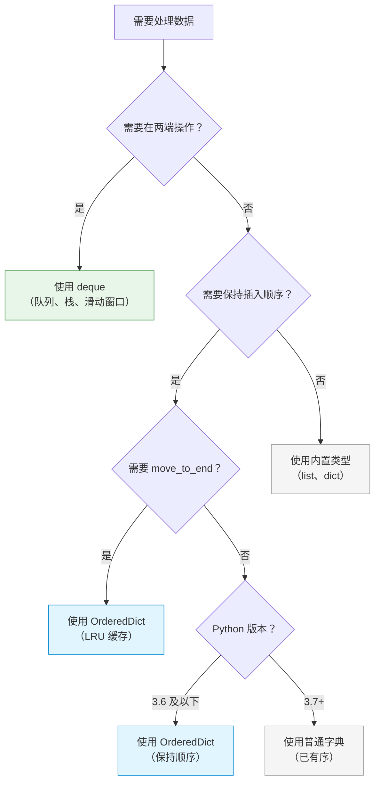

# P2K-Python-collections-什么是deque和OrderedDict？为什么需要双端队列和有序字典？怎么快速掌握？

## 📝 摘要

为什么需要 deque（双端队列）和 OrderedDict（有序字典）？本文档用生活化比喻解析这两个 collections 工具，帮你掌握高效的队列操作和有序字典管理，提升代码性能和可维护性。

---

## 目录

- [1. 前置知识点](#1-前置知识点)
- [2. 快速上手（3 分钟）](#2-快速上手3-分钟)
- [3. deque（双端队列）：高效的两端操作](#3-deque双端队列高效的两端操作)
  - [3.1 deque 的基本概念](#31-deque-的基本概念)
  - [3.2 生活化比喻](#32-生活化比喻)
  - [3.3 创建 deque](#33-创建-deque)
  - [3.4 deque 的常用方法](#34-deque-的常用方法)
  - [3.5 deque 的优势](#35-deque-的优势)
  - [3.6 实际应用场景](#36-实际应用场景)
- [4. OrderedDict（有序字典）：保持插入顺序的字典](#4-ordereddict有序字典保持插入顺序的字典)
  - [4.1 OrderedDict 的基本概念](#41-ordereddict-的基本概念)
  - [4.2 生活化比喻](#42-生活化比喻)
  - [4.3 创建 OrderedDict](#43-创建-ordereddict)
  - [4.4 OrderedDict 的常用方法](#44-ordereddict-的常用方法)
  - [4.5 OrderedDict 的优势](#45-ordereddict-的优势)
  - [4.6 实际应用场景](#46-实际应用场景)
- [5. 对比示例：不使用 deque 和 OrderedDict 的问题](#5-对比示例不使用-deque-和-ordereddict-的问题)
- [6. 两种工具的选择建议](#6-两种工具的选择建议)
- [7. 常见错误与修正](#7-常见错误与修正)
- [8. 总结与展望](#8-总结与展望)
- [9. 📚 参考资料与学习资源](#9-参考资料与学习资源)

---

## 1. 前置知识点

### 基础知识点（必须掌握）

在学习 deque 和 OrderedDict 之前，你需要掌握以下知识点：

- **列表（List）**：了解列表的基本操作（参考 P2A 文档）
- **字典（Dictionary）**：了解字典的基本操作（参考 P2D 文档）
- **collections 模块基础**：了解 collections 模块的基本概念（参考 P2J 文档）

### 🎯 **学习建议**

- **零基础小白**：建议先学习列表和字典的基础操作，再学习 deque 和 OrderedDict
- **有基础读者**：可以直接学习 deque 和 OrderedDict 的高级用法

---

## 2. 快速上手（3 分钟）

<p align="right"><span style="background:#e53935;color:#fff;padding:2px 6px;border-radius:4px">🔥 Must（必做实践）</span></p>

### 2.1 deque 快速示例

**deque（双端队列）**可以高效地从两端添加或删除元素：

```python
from collections import deque

# 创建一个双端队列
queue = deque(['a', 'b', 'c'])

# 从右侧添加元素（类似列表的 append）
queue.append('d')  # deque(['a', 'b', 'c', 'd'])

# 从左侧添加元素（列表没有这个方法）
queue.appendleft('z')  # deque(['z', 'a', 'b', 'c', 'd'])

# 从右侧删除元素
item = queue.pop()  # 返回 'd'

# 从左侧删除元素
item = queue.popleft()  # 返回 'z'
```

**关键优势**：列表在左侧操作需要 O(n) 时间，而 deque 在两端操作都是 O(1) 时间。

### 2.2 OrderedDict 快速示例

**OrderedDict（有序字典）**能够记住键值对的插入顺序：

```python
from collections import OrderedDict

# 创建一个有序字典
od = OrderedDict()

# 按顺序添加元素
od['apple'] = 1
od['banana'] = 2
od['orange'] = 3

# 遍历时保持插入顺序
for key, value in od.items():
    print(f"{key}: {value}")
# 输出：
# apple: 1
# banana: 2
# orange: 3
```

**关键优势**：在 Python 3.7 之前，普通字典是无序的，OrderedDict 保证了插入顺序。现在虽然普通字典也有序，但 OrderedDict 提供了更多操作顺序的方法。

## 3. deque（双端队列）：高效的两端操作

### 3.1 deque 的基本概念 [📖官方文档](https://docs.python.org/zh-cn/3/library/collections.html#collections.deque) [📚教程](https://realpython.com/python-deque/) [💡示例](https://www.geeksforgeeks.org/deque-in-python/)

**deque（双端队列）**是 collections 模块提供的一个双端队列（Double-ended Queue）数据结构，它支持在队列的两端高效地进行添加和删除操作。

**deque 的特点**：
- **高效的两端操作**：在两端添加或删除元素的时间复杂度为 O(1)
- **线程安全**：支持多线程环境下的操作
- **内存高效**：内部使用双向链表实现，内存占用小
- **功能丰富**：提供了旋转、限制长度等高级功能

**deque 的命名来源**：
- **d** = double（双端）
- **e** = ended（端）
- **que** = queue（队列）
- **deque** = 双端队列

### 3.2 生活化比喻

**生活化比喻**：deque 就像**双开门的地铁车厢**。

想象一下：
- **列表（list）** = 单开门地铁（只能从一端上下车，从另一端操作很慢）
- **deque** = 双开门地铁（可以从前后两端快速上下车）

**另一个比喻**：
- **列表（list）** = 只有一个入口的银行（从后面排队很慢）
- **deque** = 有前后两个入口的银行（两端都可以快速处理）

### 3.3 创建 deque

<p align="right"><span style="background:#e53935;color:#fff;padding:2px 6px;border-radius:4px">🔥 Must（必做实践）</span></p>

**基本语法**：

```python
from collections import deque

# 创建空的双端队列
d1 = deque()

# 从可迭代对象创建
d2 = deque(['a', 'b', 'c'])

# 指定最大长度
d3 = deque([1, 2, 3], maxlen=5)
```

**实际示例**：

```python
from collections import deque

# 示例 1：创建空的双端队列
queue = deque()
print(queue)  # 输出：deque([])

# 示例 2：从列表创建
items = deque(['apple', 'banana', 'orange'])
print(items)  # 输出：deque(['apple', 'banana', 'orange'])

# 示例 3：指定最大长度
limited = deque([1, 2, 3], maxlen=3)
limited.append(4)  # 添加 4，会挤掉最左边的 1
print(limited)  # 输出：deque([2, 3, 4], maxlen=3)
```

### 3.4 deque 的常用方法 [📖官方文档](https://docs.python.org/zh-cn/3/library/collections.html#collections.deque) [📚教程](https://realpython.com/python-deque/)

<p align="right"><span style="background:#e53935;color:#fff;padding:2px 6px;border-radius:4px">🔥 Must（必做实践）</span></p>

**主要方法**：

| 方法 | 说明 | 时间复杂度 |
|------|------|-----------|
| **append(x)** [📖](https://docs.python.org/zh-cn/3/library/collections.html#collections.deque.append) | 在右侧添加元素 x | O(1) |
| **appendleft(x)** [📖](https://docs.python.org/zh-cn/3/library/collections.html#collections.deque.appendleft) | 在左侧添加元素 x | O(1) |
| **pop()** [📖](https://docs.python.org/zh-cn/3/library/collections.html#collections.deque.pop) | 移除并返回右侧的元素 | O(1) |
| **popleft()** [📖](https://docs.python.org/zh-cn/3/library/collections.html#collections.deque.popleft) | 移除并返回左侧的元素 | O(1) |
| **extend(iterable)** [📖](https://docs.python.org/zh-cn/3/library/collections.html#collections.deque.extend) | 在右侧添加多个元素 | O(k)（k 是元素数量） |
| **extendleft(iterable)** [📖](https://docs.python.org/zh-cn/3/library/collections.html#collections.deque.extendleft) | 在左侧添加多个元素（逆序） | O(k) |
| **rotate(n)** [📖](https://docs.python.org/zh-cn/3/library/collections.html#collections.deque.rotate) | 向右旋转 n 步（n 为负则向左） | O(k)（k 是旋转的元素数） |
| **clear()** | 清空所有元素 | O(n) |
| **count(x)** | 统计元素 x 的出现次数 | O(n) |

**实际示例**：

```python
from collections import deque

d = deque(['a', 'b', 'c'])

# append() 和 appendleft()：添加元素
d.append('d')        # 右侧添加
d.appendleft('z')    # 左侧添加
print(d)  # 输出：deque(['z', 'a', 'b', 'c', 'd'])

# pop() 和 popleft()：删除元素
right_item = d.pop()      # 删除并返回 'd'
left_item = d.popleft()   # 删除并返回 'z'
print(d)  # 输出：deque(['a', 'b', 'c'])

# extend() 和 extendleft()：添加多个元素
d.extend(['d', 'e'])      # 右侧添加 ['d', 'e']
print(d)  # 输出：deque(['a', 'b', 'c', 'd', 'e'])

d.extendleft(['x', 'y'])  # 左侧添加，注意会逆序
print(d)  # 输出：deque(['y', 'x', 'a', 'b', 'c', 'd', 'e'])

# rotate()：旋转队列
d.rotate(2)   # 向右旋转 2 步
print(d)  # 输出：deque(['d', 'e', 'y', 'x', 'a', 'b', 'c'])

d.rotate(-1)  # 向左旋转 1 步
print(d)  # 输出：deque(['e', 'y', 'x', 'a', 'b', 'c', 'd'])

# count()：统计元素
print(d.count('a'))  # 输出：1
```

### 3.5 deque 的优势

**对比示例**：

**不使用 deque（使用列表）的问题**：

```python
# ❌ 问题：列表在左侧操作很慢（O(n) 时间复杂度）
queue = ['a', 'b', 'c']

# 在右侧添加（快速）
queue.append('d')  # O(1)

# 在左侧添加（很慢，需要移动所有元素）
queue.insert(0, 'z')  # O(n) ❌ 性能差

# 从左侧删除（很慢，需要移动所有元素）
item = queue.pop(0)  # O(n) ❌ 性能差
```

**使用 deque 的优势**：

```python
from collections import deque

# ✅ 解决方案：deque 在两端操作都是 O(1)
queue = deque(['a', 'b', 'c'])

# 在右侧添加（快速）
queue.append('d')  # O(1) ✅

# 在左侧添加（快速）
queue.appendleft('z')  # O(1) ✅

# 从左侧删除（快速）
item = queue.popleft()  # O(1) ✅
```

**性能对比**：

| 操作 | 列表（list） | deque | 性能差异 |
|------|------------|-------|---------|
| **左侧添加** | O(n) | O(1) | deque 快得多 |
| **左侧删除** | O(n) | O(1) | deque 快得多 |
| **右侧添加** | O(1) | O(1) | 相同 |
| **右侧删除** | O(1) | O(1) | 相同 |

**优势总结**：
- ✅ **性能优势**：两端操作都是 O(1)，比列表快得多
- ✅ **功能丰富**：提供旋转、限制长度等高级功能
- ✅ **内存高效**：内部实现更高效

### 3.6 实际应用场景

<p align="right"><span style="background:#fb8c00;color:#fff;padding:2px 6px;border-radius:4px">💡 Should（建议实践）</span></p>

**场景 1：实现队列（FIFO（先进先出））** [📖官方文档](https://docs.python.org/zh-cn/3/library/collections.html#deque-objects) [💡示例](https://realpython.com/python-deque/)

```python
from collections import deque

# 使用 deque 实现队列
queue = deque()

# 入队（从右侧添加）
queue.append('任务1')
queue.append('任务2')
queue.append('任务3')

# 出队（从左侧删除）
while queue:
    task = queue.popleft()
    print(f"处理任务：{task}")
# 输出：
# 处理任务：任务1
# 处理任务：任务2
# 处理任务：任务3
```

**场景 2：实现栈（LIFO（后进先出））** [📖官方文档](https://docs.python.org/zh-cn/3/library/collections.html#deque-objects) [💡示例](https://realpython.com/python-deque/)

```python
from collections import deque

# 使用 deque 实现栈
stack = deque()

# 入栈（从右侧添加）
stack.append('元素1')
stack.append('元素2')
stack.append('元素3')

# 出栈（从右侧删除）
while stack:
    item = stack.pop()
    print(f"弹出：{item}")
# 输出：
# 弹出：元素3
# 弹出：元素2
# 弹出：元素1
```

**场景 3：滑动窗口** [📖官方文档](https://docs.python.org/zh-cn/3/library/collections.html#deque-recipes) [💡示例](https://www.geeksforgeeks.org/sliding-window-maximum-maximum-of-all-subarrays-of-size-k/)

```python
from collections import deque

def sliding_window_max(nums, k):
    """计算滑动窗口的最大值"""
    result = []
    window = deque()
    
    for i, num in enumerate(nums):
        # 移除窗口外的元素
        while window and window[0] <= i - k:
            window.popleft()
        
        # 移除小于当前元素的元素（保持单调递减）
        while window and nums[window[-1]] < num:
            window.pop()
        
        window.append(i)
        
        # 窗口大小达到 k 时，记录最大值
        if i >= k - 1:
            result.append(nums[window[0]])
    
    return result

# 使用示例
nums = [1, 3, -1, -3, 5, 3, 6, 7]
k = 3
print(sliding_window_max(nums, k))  # 输出：[3, 3, 5, 5, 6, 7]
```

**场景 4：限制长度的队列（最近 N 条记录）** [📖官方文档](https://docs.python.org/zh-cn/3/library/collections.html#deque-objects) [💡示例](https://realpython.com/python-deque/)

```python
from collections import deque

# 创建一个限制长度为 5 的队列
recent_items = deque(maxlen=5)

# 添加元素
for i in range(10):
    recent_items.append(i)
    print(f"添加 {i} 后：{list(recent_items)}")

# 输出：只保留最近 5 条记录
```

## 4. OrderedDict（有序字典）：保持插入顺序的字典

### 4.1 OrderedDict 的基本概念 [📖官方文档](https://docs.python.org/zh-cn/3/library/collections.html#collections.OrderedDict) [📚教程](https://realpython.com/python-ordereddict/) [💡示例](https://www.geeksforgeeks.org/ordereddict-in-python/)

**OrderedDict（有序字典）**是 collections 模块提供的一个字典子类，它能够记住键值对的插入顺序。在遍历 OrderedDict 时，元素会按照插入的顺序返回。

**OrderedDict 的特点**：
- **保持插入顺序**：元素按照插入顺序排列
- **兼容字典**：完全兼容字典的所有操作
- **额外方法**：提供了 `move_to_end()` 等操作顺序的方法
- **历史意义**：在 Python 3.7 之前，普通字典是无序的，OrderedDict 提供了有序字典的实现

**重要说明**：
- **Python 3.7+**：普通字典（dict）也已经是有序的了
- **OrderedDict 的价值**：仍然有用，因为提供了更多操作顺序的方法（如 `move_to_end()`）
- **向后兼容**：如果代码需要在 Python 3.6 及以下版本运行，仍然需要使用 OrderedDict

### 4.2 生活化比喻

**生活化比喻**：OrderedDict 就像**按时间顺序排列的日记本**。

想象一下：
- **普通字典（Python 3.6 及以前）** = 乱序的日记本（找不到顺序）
- **OrderedDict** = 按时间顺序的日记本（可以按照记录的时间顺序查看）

**另一个比喻**：
- **普通字典（旧版）** = 打乱顺序的扑克牌（不知道顺序）
- **OrderedDict** = 按顺序排列的扑克牌（知道插入顺序）

### 4.3 创建 OrderedDict

<p align="right"><span style="background:#e53935;color:#fff;padding:2px 6px;border-radius:4px">🔥 Must（必做实践）</span></p>

**基本语法**：

```python
from collections import OrderedDict

# 创建空的有序字典
od1 = OrderedDict()

# 从可迭代对象创建
od2 = OrderedDict([('a', 1), ('b', 2), ('c', 3)])

# 使用关键字参数创建（Python 3.6+）
od3 = OrderedDict(a=1, b=2, c=3)
```

**实际示例**：

```python
from collections import OrderedDict

# 示例 1：创建空的有序字典
od = OrderedDict()
od['apple'] = 1
od['banana'] = 2
od['orange'] = 3

print(od)  # 输出：OrderedDict([('apple', 1), ('banana', 2), ('orange', 3)])

# 示例 2：从列表创建
items = OrderedDict([('x', 10), ('y', 20), ('z', 30)])
print(items)  # 输出：OrderedDict([('x', 10), ('y', 20), ('z', 30)])

# 示例 3：遍历时保持插入顺序
for key, value in od.items():
    print(f"{key}: {value}")
# 输出：
# apple: 1
# banana: 2
# orange: 3
```

### 4.4 OrderedDict 的常用方法 [📖官方文档](https://docs.python.org/zh-cn/3/library/collections.html#collections.OrderedDict) [📚教程](https://realpython.com/python-ordereddict/)

<p align="right"><span style="background:#e53935;color:#fff;padding:2px 6px;border-radius:4px">🔥 Must（必做实践）</span></p>

**主要方法**：

| 方法 | 说明 | 示例 |
|------|------|------|
| **move_to_end(key, last=True)** [📖](https://docs.python.org/zh-cn/3/library/collections.html#collections.OrderedDict.move_to_end) | 将键移动到末尾（last=True）或开头（last=False） | `od.move_to_end('b')` |
| **popitem(last=True)** [📖](https://docs.python.org/zh-cn/3/library/collections.html#collections.OrderedDict.popitem) | 移除并返回末尾（last=True）或开头（last=False）的键值对 | `od.popitem()` |
| **clear()** | 清空所有元素 | `od.clear()` |
| **copy()** | 创建浅拷贝 | `od.copy()` |

**实际示例**：

```python
from collections import OrderedDict

od = OrderedDict()
od['a'] = 1
od['b'] = 2
od['c'] = 3
od['d'] = 4

print(f"初始顺序：{list(od.keys())}")  # 输出：初始顺序：['a', 'b', 'c', 'd']

# move_to_end()：移动元素到末尾
od.move_to_end('b')
print(f"移动 'b' 到末尾后：{list(od.keys())}")  # 输出：移动 'b' 到末尾后：['a', 'c', 'd', 'b']

# move_to_end(last=False)：移动元素到开头
od.move_to_end('d', last=False)
print(f"移动 'd' 到开头后：{list(od.keys())}")  # 输出：移动 'd' 到开头后：['d', 'a', 'c', 'b']

# popitem()：移除末尾的键值对
key, value = od.popitem()
print(f"移除末尾元素：{key}={value}")  # 输出：移除末尾元素：b=2
print(f"剩余元素：{list(od.keys())}")  # 输出：剩余元素：['d', 'a', 'c']

# popitem(last=False)：移除开头的键值对
key, value = od.popitem(last=False)
print(f"移除开头元素：{key}={value}")  # 输出：移除开头元素：d=4
print(f"剩余元素：{list(od.keys())}")  # 输出：剩余元素：['a', 'c']
```

### 4.5 OrderedDict 的优势

**对比示例**：

**不使用 OrderedDict（Python 3.6 及以前）的问题**：

```python
# ❌ Python 3.6 及以前：普通字典是无序的
d = {}
d['apple'] = 1
d['banana'] = 2
d['orange'] = 3

# 遍历顺序可能随机
for key in d:
    print(key)  # ❌ 顺序不确定
```

**使用 OrderedDict 的优势**：

```python
from collections import OrderedDict

# ✅ 解决方案：OrderedDict 保持插入顺序
od = OrderedDict()
od['apple'] = 1
od['banana'] = 2
od['orange'] = 3

# 遍历顺序确定（按插入顺序）
for key in od:
    print(key)  # ✅ 输出：apple, banana, orange（顺序确定）
```

**Python 3.7+ 的情况**：

在 Python 3.7+ 中，普通字典也是有序的，但 OrderedDict 仍然有用：

```python
from collections import OrderedDict

# 普通字典（Python 3.7+）也是有序的
d = {'a': 1, 'b': 2, 'c': 3}

# OrderedDict 提供额外的方法
od = OrderedDict([('a', 1), ('b', 2), ('c', 3)])

# ✅ OrderedDict 的独特功能
od.move_to_end('a')  # 可以移动元素
print(list(od.keys()))  # 输出：['b', 'c', 'a']
```

**优势总结**：

| 特性 | 普通字典（Python 3.6-） | OrderedDict | 普通字典（Python 3.7+） |
|------|----------------------|------------|---------------------|
| **插入顺序** | ❌ 无序 | ✅ 有序 | ✅ 有序 |
| **move_to_end()** | ❌ 不支持 | ✅ 支持 | ❌ 不支持 |
| **向后兼容** | ✅ 原生支持 | ✅ 支持旧版本 | ✅ 原生支持 |

### 4.6 实际应用场景

<p align="right"><span style="background:#fb8c00;color:#fff;padding:2px 6px;border-radius:4px">💡 Should（建议实践）</span></p>

**场景 1：实现 LRU（Least Recently Used（最近最少使用））缓存** [📖官方文档](https://docs.python.org/zh-cn/3/library/collections.html#ordereddict-examples-and-recipes) [💡示例](https://realpython.com/python-ordereddict/) [📚详解](https://www.geeksforgeeks.org/lru-cache-in-python-using-ordereddict/)

```python
from collections import OrderedDict

class LRUCache:
    def __init__(self, capacity):
        self.cache = OrderedDict()
        self.capacity = capacity
    
    def get(self, key):
        if key not in self.cache:
            return -1
        # 移动到末尾（表示最近使用）
        self.cache.move_to_end(key)
        return self.cache[key]
    
    def put(self, key, value):
        if key in self.cache:
            # 更新值并移动到末尾
            self.cache.move_to_end(key)
        else:
            # 如果超过容量，删除最旧的（开头的）
            if len(self.cache) >= self.capacity:
                self.cache.popitem(last=False)
        self.cache[key] = value

# 使用示例
cache = LRUCache(2)
cache.put(1, 'a')
cache.put(2, 'b')
print(cache.get(1))  # 输出：'a'
cache.put(3, 'c')    # 删除键 2（最旧的）
print(cache.get(2))  # 输出：-1（已被删除）
```

**场景 2：配置文件解析（保持配置顺序）** [📖官方文档](https://docs.python.org/zh-cn/3/library/collections.html#ordereddict-examples-and-recipes) [💡示例](https://realpython.com/python-ordereddict/)

```python
from collections import OrderedDict

# 解析配置文件时保持顺序
config = OrderedDict()
config['host'] = 'localhost'
config['port'] = 8080
config['debug'] = True
config['database'] = 'mydb'

# 保存配置时保持顺序
def save_config(od, filename):
    with open(filename, 'w') as f:
        for key, value in od.items():
            f.write(f"{key} = {value}\n")

# 这样保存的配置文件顺序是可预测的
```

**场景 3：按插入顺序处理数据** [📖官方文档](https://docs.python.org/zh-cn/3/library/collections.html#ordereddict-examples-and-recipes) [💡示例](https://realpython.com/python-ordereddict/)

```python
from collections import OrderedDict

# 处理数据时保持顺序
data = OrderedDict()
data['first'] = '处理第一步'
data['second'] = '处理第二步'
data['third'] = '处理第三步'

# 按插入顺序处理
for step, description in data.items():
    print(f"{step}: {description}")
# 输出：
# first: 处理第一步
# second: 处理第二步
# third: 处理第三步
```

## 5. 对比示例：不使用 deque 和 OrderedDict 的问题

### 5.1 deque vs 列表对比

**问题场景 1：实现队列（FIFO（先进先出））**

**不使用 deque（使用列表）的问题**：

```python
# ❌ 问题：列表在左侧操作很慢
queue = []

# 入队（右侧添加，快速）
queue.append('任务1')
queue.append('任务2')
queue.append('任务3')

# 出队（左侧删除，很慢）
while queue:
    task = queue.pop(0)  # O(n) ❌ 每次删除都需要移动所有元素
    print(f"处理任务：{task}")
```

**使用 deque 的优势**：

```python
from collections import deque

# ✅ 解决方案：deque 在两端操作都是 O(1)
queue = deque()

# 入队（右侧添加，快速）
queue.append('任务1')
queue.append('任务2')
queue.append('任务3')

# 出队（左侧删除，快速）
while queue:
    task = queue.popleft()  # O(1) ✅ 快速
    print(f"处理任务：{task}")
```

**性能对比**：

当队列中有 10000 个元素时：
- **列表**：删除第一个元素需要移动 9999 个元素，很慢
- **deque**：删除第一个元素是常数时间，非常快

### 5.2 OrderedDict vs 普通字典对比

**问题场景 1：需要保持插入顺序（Python 3.6 及以前）**

**不使用 OrderedDict（Python 3.6）的问题**：

```python
# ❌ Python 3.6：普通字典无序
config = {}
config['host'] = 'localhost'
config['port'] = 8080
config['debug'] = True

# 遍历顺序不确定
for key in config:
    print(key)  # ❌ 顺序可能随机：可能是 port, host, debug
```

**使用 OrderedDict 的优势**：

```python
from collections import OrderedDict

# ✅ 解决方案：OrderedDict 保持插入顺序
config = OrderedDict()
config['host'] = 'localhost'
config['port'] = 8080
config['debug'] = True

# 遍历顺序确定
for key in config:
    print(key)  # ✅ 输出：host, port, debug（顺序确定）
```

**问题场景 2：需要移动元素位置**

**普通字典（Python 3.7+）的限制**：

```python
# Python 3.7+ 的普通字典虽然有序，但没有 move_to_end() 方法
d = {'a': 1, 'b': 2, 'c': 3}

# ❌ 想要将 'b' 移到末尾，需要重新创建字典
# 需要手动实现
```

**使用 OrderedDict 的优势**：

```python
from collections import OrderedDict

# ✅ OrderedDict 提供 move_to_end() 方法
od = OrderedDict([('a', 1), ('b', 2), ('c', 3)])

# 直接移动元素
od.move_to_end('b')  # ✅ 一行代码完成
print(list(od.keys()))  # 输出：['a', 'c', 'b']
```

**对比总结**：

| 特性 | 列表（队列场景） | deque | 普通字典（Python 3.6-） | OrderedDict |
|------|--------------|-------|----------------------|------------|
| **左侧操作性能** | ❌ O(n) | ✅ O(1) | - | - |
| **插入顺序** | - | - | ❌ 无序 | ✅ 有序 |
| **move_to_end()** | - | - | ❌ 不支持 | ✅ 支持 |

## 6. 两种工具的选择建议

### 6.1 使用场景对比表格

**选择建议表格**：

| 工具 | 适用场景 | 典型应用 | 选择条件 |
|------|---------|---------|---------|
| **deque** | 需要在两端频繁操作 | 队列、栈、滑动窗口 | ✅ 需要从两端添加/删除<br/>✅ 需要 O(1) 的左侧操作<br/>✅ 需要旋转功能 |
| **OrderedDict** | 需要保持插入顺序 | LRU 缓存、配置文件解析 | ✅ 需要保持插入顺序（Python 3.6-）<br/>✅ 需要 move_to_end() 方法<br/>✅ 需要操作元素顺序 |

### 6.2 选择流程图

**选择流程说明**：下面的流程图帮助你根据实际需求选择合适的 collections 工具。



**快速选择指南**：

1. **deque**：当你需要从两端频繁添加或删除元素时（如实现队列、栈）
2. **OrderedDict**：当你需要保持插入顺序，或需要 `move_to_end()` 方法时（如实现 LRU 缓存）

## 7. 常见错误与修正

### 7.1 deque 常见错误

**错误 1：对空 deque 执行 pop 操作**

```python
from collections import deque

d = deque()

# ❌ 错误：空 deque 执行 pop() 会报错
item = d.pop()  # IndexError: pop from an empty deque
```

**✅ 修正**：先检查 deque 是否为空：

```python
from collections import deque

d = deque()

# ✅ 正确：先检查是否为空
if d:
    item = d.pop()
else:
    print("deque 为空")
```

**错误 2：extendleft() 的逆序问题**

```python
from collections import deque

d = deque(['a', 'b'])

# ⚠️ 注意：extendleft() 会逆序添加
d.extendleft(['x', 'y'])
print(d)  # 输出：deque(['y', 'x', 'a', 'b']) ❌ 注意是逆序的
```

**✅ 修正**：了解 extendleft() 的行为，或手动逆序：

```python
from collections import deque

d = deque(['a', 'b'])

# ✅ 正确：extendleft() 会逆序添加，这是预期的行为
d.extendleft(['x', 'y'])
print(d)  # 输出：deque(['y', 'x', 'a', 'b']) ✅ 这是正确的

# 如果想保持顺序，可以手动逆序
d2 = deque(['a', 'b'])
d2.extendleft(reversed(['x', 'y']))
print(d2)  # 输出：deque(['x', 'y', 'a', 'b'])
```

**错误 3：maxlen 的行为理解错误**

```python
from collections import deque

d = deque([1, 2, 3], maxlen=3)

# ✅ 当达到 maxlen 时，新元素会挤掉另一端的元素
d.append(4)
print(d)  # 输出：deque([2, 3, 4], maxlen=3) ✅ 1 被挤掉了

d.appendleft(0)
print(d)  # 输出：deque([0, 2, 3], maxlen=3) ✅ 4 被挤掉了
```

### 7.2 OrderedDict 常见错误

**错误 1：在 Python 3.7+ 中过度使用 OrderedDict**

```python
from collections import OrderedDict

# ⚠️ Python 3.7+ 中，普通字典已经有序
# 如果不需要 move_to_end() 等方法，直接用普通字典即可
od = OrderedDict([('a', 1), ('b', 2)])  # ❌ 可能不必要

# ✅ Python 3.7+ 可以这样
d = {'a': 1, 'b': 2}  # ✅ 普通字典已经有序
```

**✅ 修正**：根据需求选择：

```python
# ✅ 如果只需要保持顺序（Python 3.7+），用普通字典
d = {'a': 1, 'b': 2}  # 已经有顺序

# ✅ 如果需要 move_to_end() 等方法，用 OrderedDict
from collections import OrderedDict
od = OrderedDict([('a', 1), ('b', 2)])
od.move_to_end('a')  # ✅ 需要这个功能才用 OrderedDict
```

**错误 2：在 Python 3.6 及以下版本使用普通字典期望有序**

```python
# ❌ Python 3.6：普通字典无序
d = {}
d['first'] = 1
d['second'] = 2

# 遍历顺序不确定
for key in d:
    print(key)  # ❌ 顺序可能随机
```

**✅ 修正**：在 Python 3.6 及以下使用 OrderedDict：

```python
from collections import OrderedDict

# ✅ Python 3.6 及以下：使用 OrderedDict
od = OrderedDict()
od['first'] = 1
od['second'] = 2

# 遍历顺序确定
for key in od:
    print(key)  # ✅ 输出：first, second（顺序确定）
```

## 8. 总结与展望

### 8.1 核心要点回顾

通过本指南的学习，你已经掌握了 collections 模块中另外两个重要的工具：

1. **deque（双端队列）**：
   - 高效的两端操作，时间复杂度 O(1)
   - 适用于队列、栈、滑动窗口等场景
   - 提供旋转、限制长度等高级功能

2. **OrderedDict（有序字典）**：
   - 保持插入顺序
   - 提供 `move_to_end()` 等操作顺序的方法
   - 适用于 LRU 缓存、配置文件解析等场景

**核心优势**：
- ✅ **性能优化**：deque 在两端操作比列表快得多
- ✅ **功能丰富**：提供了操作顺序的高级方法
- ✅ **实用性强**：解决实际编程中的常见问题

### 8.2 下一步学习方向

完成本阶段的学习后，建议按照以下顺序继续学习：

1. **继续学习 collections 模块**：你已经完成了 collections 模块的核心工具学习
2. **学习函数进阶**（P3B-P3F）：学习参数类型、Lambda 表达式、内置函数
3. **学习模块与包**（P3G-P3I）：深入理解模块导入机制

**学习建议**：
- ✅ **多实践**：尝试在实际项目中使用 deque 和 OrderedDict
- ✅ **多对比**：思考使用这些工具前后的性能差异
- ✅ **多思考**：理解每个工具的适用场景，选择合适的工具

### 8.3 鼓励与展望

collections 模块是 Python 标准库中的精华，deque 和 OrderedDict 是解决特定场景问题的专业工具。掌握这些工具能让你编写出更高效、更优雅的代码。

**记住**：
- deque = 双开门地铁，两端都可以快速操作
- OrderedDict = 按时间顺序的日记本，保持插入顺序

继续加油，你已经掌握了 collections 模块的核心工具！接下来，你将学习更多 Python 的高级特性，进一步提升编程能力！

**继续加油，你离 Python 高手又近了一步！** 🚀

## 9. 📚 参考资料与学习资源

### 9.1 官方文档

**collections 模块官方文档**：
- [Python collections 模块官方文档](https://docs.python.org/zh-cn/3/library/collections.html) - collections 模块完整文档
- [deque 官方文档](https://docs.python.org/zh-cn/3/library/collections.html#collections.deque) - deque 详细说明
- [OrderedDict 官方文档](https://docs.python.org/zh-cn/3/library/collections.html#collections.OrderedDict) - OrderedDict 详细说明

### 9.2 在线教程

**中文教程**：
- [Python collections 模块教程 - 菜鸟教程](https://www.runoob.com/python3/python-collections.html) - 中文入门教程
- [Python deque 和 OrderedDict 详解 - 廖雪峰](https://www.liaoxuefeng.com/wiki/1016959663602400/1017684555494592) - 通俗易懂的教程

**英文教程**：
- [Python collections Module - Real Python](https://realpython.com/python-collections-module/) - 详细的英文教程
- [Python deque - GeeksforGeeks](https://www.geeksforgeeks.org/deque-in-python/) - deque 使用示例
- [Python OrderedDict - GeeksforGeeks](https://www.geeksforgeeks.org/ordereddict-in-python/) - OrderedDict 使用示例

### 9.3 推荐书籍

**入门书籍**：
- 《Python 编程：从入门到实践》- Eric Matthes（包含 collections 模块介绍）
- 《Python 基础教程（第 3 版）》- Magnus Lie Hetland

**进阶书籍**：
- 《流畅的 Python》- Luciano Ramalho（深入讲解 collections 模块）
- 《Effective Python：编写高质量 Python 代码的 59 个有效方法》- Brett Slatkin（包含 collections 最佳实践）

---

**厦门工学院人工智能创作坊 -- 郑恩赐**  
**2025 年 11 月 04 日**

