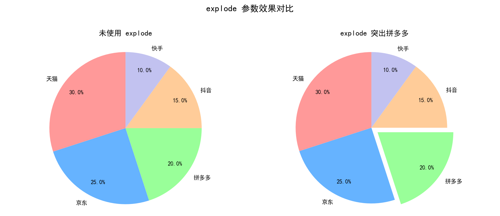
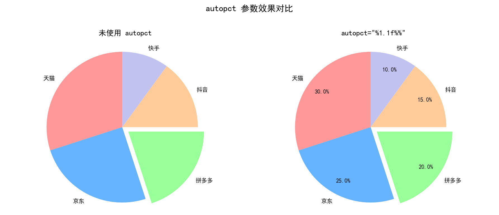
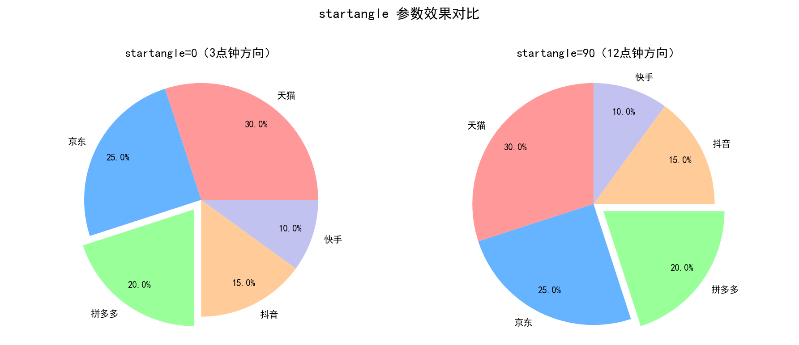
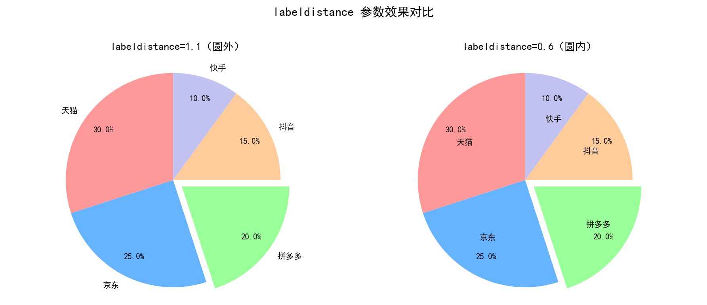
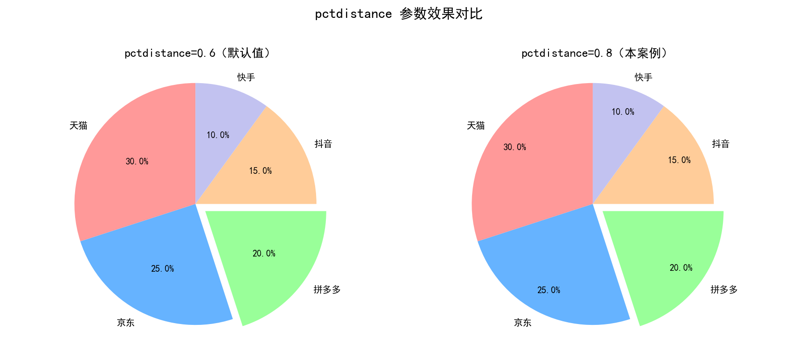
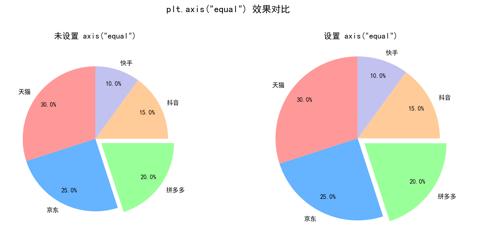

# P2L-Matplotlib饼图完全指南-从数据可视化到图表定制的Python绘图利器

本文档基于 Matplotlib 从零实现饼图的绘制，涵盖环境准备、`pie()` 函数核心参数详解、完整代码实现及逐行解析、运行结果展示等内容。通过一个电商公司销售渠道占比的实际案例，帮助读者深入理解饼图的绘制方法和参数配置技巧 🥧

This document implements pie chart drawing from scratch using Matplotlib, covering environment setup, detailed parameter explanation of the `pie()` function, complete code implementation with line-by-line analysis, and result visualization. Through a real-world e-commerce sales channel case study, it helps readers deeply understand pie chart drawing techniques and parameter configuration 🥧

---

## 术语表 / Terminology

| 术语 / Term | 说明 / Description |
|-------------|-------------------|
| **Pie Chart（饼图）** | 用于展示各类别在总体中所占比例的圆形统计图，每个扇形（Wedge）代表一个类别 |
| **Wedge（扇形）** | 饼图中的每一个扇形区域，代表一个数据类别及其在整体中的占比 |
| **explode（突出）** | 将某个扇形从饼图中心向外偏移的效果，用于强调特定数据 |
| **autopct（自动百分比）** | 在扇形上自动显示百分比数值的参数，支持格式化字符串 |
| **startangle（起始角度）** | 饼图第一个扇形开始绘制的角度位置，默认从 x 轴正方向（3 点钟方向）开始 |
| **labeldistance（标签距离）** | 类别标签与饼图中心的相对距离，以半径为基准的比值 |
| **pctdistance（百分比距离）** | 百分比文本与饼图中心的相对距离，以半径为基准的比值 |

---

## 章节阅读路线图 🗺️ / Chapter Reading Roadmap

1. **环境准备** 🧰 / Environment Setup → 确认 Matplotlib 安装并导入必要库
2. **饼图基础概念** 🥧 / Basic Concepts of Pie Chart → 了解饼图的定义、适用场景和核心要素
3. **核心参数详解** 🔧 / Core Parameters Explained → 深入理解 `pie()` 函数的关键参数及其作用
4. **完整代码实现** 💻 / Complete Code Implementation → 电商渠道占比案例的完整代码
5. **代码逐行解析** 🔍 / Line-by-Line Code Analysis → 详细拆解每一步的计算和数据流向
6. **运行结果展示** 📊 / Result Visualization → 展示生成的饼图效果
7. **总结** 📝 / Summary → 回顾核心要点和参数配置技巧

---

## 1. 环境准备 🧰 / Environment Setup

> 📦 **Note:** 本章确认 Matplotlib 安装并导入必要库 / This chapter confirms Matplotlib installation and imports required libraries.

🔧 在开始绘图之前，请确保你的环境中已经安装了 Matplotlib。如果还没有安装，可以通过以下命令快速安装：

```bash
pip install matplotlib
```

📚 绘制饼图通常只需要导入 Matplotlib 的 pyplot 模块，同时为了处理中文显示问题，还需要进行字体配置：

```python
import matplotlib.pyplot as plt              # 导入 pyplot 模块，提供类似 MATLAB 的绘图接口 🔥
import numpy as np                           # 导入 NumPy 库，用于数值计算和数组操作 🔢

# 设置 Matplotlib 支持中文显示 🇨🇳
plt.rcParams['font.sans-serif'] = ['SimHei', 'DejaVu Sans']  # 设置中文字体为黑体，英文字体为 DejaVu Sans
plt.rcParams['axes.unicode_minus'] = False   # 解决坐标轴负号显示为方块的问题 ✅
```

- **matplotlib.pyplot** 🔥：Matplotlib 的核心模块，提供类似 MATLAB 的绘图接口
- **numpy** 🔢：数值计算库，用于处理数据数组
- **rcParams** ⚙️：Matplotlib 的运行时配置参数字典，用于全局设置字体、样式等

> 💡 如果你的系统没有 SimHei 字体，也可以使用其他中文字体如 `'Microsoft YaHei'`（微软雅黑）或 `'KaiTi'`（楷体），具体取决于你的操作系统。

---

**参考资料：**

- [matplotlib.pyplot.pie 官方文档 -- Matplotlib](https://matplotlib.org/stable/api/_as_gen/matplotlib.pyplot.pie.html) ⭐值得阅读
- [Matplotlib 饼图 -- 菜鸟教程](https://www.runoob.com/matplotlib/matplotlib-pie.html)
- [Matplotlib 中文显示 -- 菜鸟教程](https://www.runoob.com/matplotlib/matplotlib-zh.html)

---

## 2. 饼图基础概念 🥧 / Basic Concepts of Pie Chart

> 🥧 **Note:** 本章介绍饼图的定义、适用场景和核心要素 / This chapter introduces the definition, use cases, and core elements of pie charts.

### 2.1 什么是饼图？🤔 / What is a Pie Chart?

**饼图（Pie Chart）** 是一种圆形统计图表，它将一个圆划分为多个扇形 **（Wedge）** ，每个扇形的面积代表该类别在整体中所占的比例。饼图的核心思想是 **"整体与部分的关系"** —— 整个圆代表 100%（整体），每个扇形代表一个类别（部分）。

**直观类比** 🍕：想象一个完整的披萨被切成不同大小的块

- 整个披萨 = 总销售额（100%）
- 每块披萨的大小 = 每个渠道的销售额占比
- 块越大 = 该渠道贡献的销售额越多

### 2.2 适用场景 🎯 / When to Use Pie Charts

饼图最适合展示 **"部分占整体的比例关系"** ，特别是在以下场景：

| 场景 | 示例 | 说明 |
|------|------|------|
| **市场份额分析** 📊 | 各电商平台的市场占有率 | 直观对比谁大谁小 |
| **预算分配** 💰 | 各部门的预算占比 | 展示资源分配结构 |
| **用户画像** 👥 | 不同年龄段的用户比例 | 展示构成分布 |
| **时间分配** ⏰ | 各项活动耗时占比 | 展示时间投入结构 |

### 2.3 使用注意事项 ⚠️ / Usage Considerations

饼图虽然直观，但有以下局限性：

1. **类别不宜过多** 🔢：建议不超过 5-6 个类别，太多会使扇形过于拥挤
2. **差异不宜过小** 📏：如果比例接近（如 48% vs 52%），饼图难以区分，建议使用条形图
3. **不适合比较多个总体** 🚫：饼图只能展示一个整体内部的比例，多个整体对比应使用堆叠条形图

---

**参考资料：**

- [Pie charts -- Matplotlib Documentation](https://matplotlib.org/stable/gallery/pie_and_polar_charts/pie_features.html) ⭐值得阅读
- [Matplotlib 饼图 -- 菜鸟教程](https://www.runoob.com/matplotlib/matplotlib-pie.html)

---

## 3. 核心参数详解 🔧 / Core Parameters Explained

> 🔧 **Note:** 本章深入讲解 `pie()` 函数的关键参数及其作用 / This chapter explains the key parameters of the `pie()` function in detail.

`plt.pie()` 是 Matplotlib 中用于绘制饼图的核心函数，其基本语法如下：

```python
plt.pie(x, explode=None, labels=None, colors=None, autopct=None,
        pctdistance=0.6, shadow=False, labeldistance=1.1, startangle=0,
        radius=1, counterclock=True, wedgeprops=None, textprops=None)
```

### 3.1 核心参数速查表 📋 / Core Parameters Quick Reference

| 参数 | 类型 | 默认值 | 说明 |
|------|------|--------|------|
| `x` | array-like | 必填 | 每个扇形的数值，函数内部自动计算 `x / sum(x)` 作为比例 |
| `explode` | array-like | None | 每个扇形偏离中心的距离（以半径比例为单位），用于突出显示 |
| `labels` | list | None | 每个扇形的标签文字 |
| `colors` | list | 自动 | 每个扇形的颜色，支持十六进制、RGB、颜色名称等 |
| `autopct` | str/callable | None | 百分比显示格式，如 `'%1.1f%%'` 表示保留 1 位小数 |
| `startangle` | float | 0 | 起始角度，0 表示从 x 轴正方向（3 点钟方向）开始 |
| `labeldistance` | float | 1.1 | 标签与圆心距离（半径的倍数），>1 在圆外，<1 在圆内 |
| `pctdistance` | float | 0.6 | 百分比文本与圆心距离（半径的倍数） |

### 3.2 关键参数详解 🔍 / Key Parameters Deep Dive

#### 3.2.1 `explode` 参数 —— 突出显示特定扇形 🎯

`explode` 参数是一个与 `x` 等长的数组，每个值表示对应扇形向外偏移的距离（以半径为基准）：

- `0`：不偏移
- `>0`：向外偏移指定距离
- **值越大，扇形偏离中心越远**

```python
explode = (0, 0, 0.1, 0, 0)  # 第3个扇形（索引2）向外偏移 0.1 倍半径 🔍
```

**直观类比** 🎯：就像从披萨中抽出一块，让这块更醒目地展示在盘子上



**图解读** 🔍：左图所有扇形紧贴圆心，无法突出任何渠道；右图中拼多多（绿色扇形）向外偏移 0.1 倍半径，立即成为视觉焦点，读者可以第一时间关注到这个渠道。

*图片来源：本文档配套生成 -- Python-基础技术*

#### 3.2.2 `autopct` 参数 —— 显示百分比 📊

`autopct` 控制百分比文本的显示格式：

| 格式字符串 | 效果 | 示例输出 |
|-----------|------|---------|
| `'%d%%'` | 整数百分比 | `30%` |
| `'%1.1f%%'` | 保留 1 位小数 | `30.0%` |
| `'%1.2f%%'` | 保留 2 位小数 | `30.00%` |

> ⚠️ **注意**：`%%` 中的第一个 `%` 是转义字符，表示输出一个字面上的百分号 `%`



**图解读** 🔍：左图没有设置 autopct，读者只能通过扇形面积大致判断比例，无法获取精确数值；右图设置 `autopct='%1.1f%%'` 后，每个扇形内部直接显示保留 1 位小数的百分比，数据一目了然。

*图片来源：本文档配套生成 -- Python-基础技术*

#### 3.2.3 `startangle` 参数 —— 控制起始角度 🔄

`startangle` 决定饼图从哪个方向开始绘制第一个扇形：

- `0`（默认）：从 x 轴正方向（3 点钟或 East 方向）开始
- `90`：从 y 轴正方向（12 点钟或 North 方向）开始
- `180`：从 x 轴负方向（9 点钟方向）开始
- `270`：从 y 轴负方向（6 点钟方向）开始

**直观类比** 🧭：就像转动一个转盘，改变起始指针的位置



**图解读** 🔍：左图从正右方（3 点钟方向）开始绘制，天猫扇形出现在右侧；右图旋转 90 度后从正上方（12 点钟方向）开始，天猫扇形出现在顶部。startangle=90 的布局更符合从上到下的阅读习惯，是大多数商业报告的首选。

*图片来源：本文档配套生成 -- Python-基础技术*

#### 3.2.4 `labeldistance` 和 `pctdistance` —— 控制文本位置 📍

这两个参数控制标签和百分比文本与圆心的距离，以**半径的比值**表示：

- `labeldistance=1.1`（默认）：标签在圆外距离边缘 0.1 倍半径的位置
- `pctdistance=0.6`（默认）：百分比文本在扇形内部距离圆心 0.6 倍半径的位置

当 `labeldistance < 1` 时标签显示在圆内，当 `pctdistance > 1` 时百分比显示在圆外。



**图解读** 🔍：左图标签在圆外（距离圆心 1.1 倍半径），与百分比文本内外呼应、布局清晰；右图标签移入圆内（0.6 倍半径），虽然节省了外部空间，但可能导致标签与百分比文本重叠。在实际应用中，`labeldistance=1.1` 是更安全的选择。

*图片来源：本文档配套生成 -- Python-基础技术*



**图解读** 🔍：左图百分比文本距离圆心 0.6 倍半径，位于扇形内部靠近中心；右图距离 0.8 倍半径，百分比外移到扇形中部偏外位置。选择 pctdistance=0.8 可以让百分比文本与标签保持平衡，避免过于拥挤。

*图片来源：本文档配套生成 -- Python-基础技术*

---

**参考资料：**

- [matplotlib.pyplot.pie 官方参数文档 -- Matplotlib](https://matplotlib.org/stable/api/_as_gen/matplotlib.pyplot.pie.html) ⭐值得阅读
- [Pie charts 示例 -- Matplotlib Gallery](https://matplotlib.org/stable/gallery/pie_and_polar_charts/pie_features.html) ⭐值得阅读
- [Python matplotlib 饼图参数详解 -- 博客园](https://www.cnblogs.com/shanger/p/13073275.html)

---

## 4. 完整代码实现 💻 / Complete Code Implementation

> 💻 **Note:** 本章展示电商渠道销售额占比的饼图完整代码 / This chapter presents the complete code for the e-commerce channel sales pie chart.

### 4.1 案例数据 📊 / Case Data

某电商公司 **2026 年第二季度（Q2）** 各渠道销售额占比数据如下：

| 渠道 | 销售额占比 | 说明 |
|------|-----------|------|
| 天猫 | 30% | 传统电商主力渠道 |
| 京东 | 25% | 综合电商平台 |
| **拼多多** | **20%** | **需要突出显示的渠道** 🎯 |
| 抖音 | 15% | 直播电商新渠道 |
| 快手 | 10% | 短视频电商渠道 |

### 4.2 完整代码 🎬 / Complete Code

```python
import matplotlib.pyplot as plt              # 导入 pyplot 模块，提供绘图接口 🔥
import numpy as np                           # 导入 NumPy，用于数组运算 🔢

# ========== 1. 设置中文字体 ========== 🇨🇳
plt.rcParams['font.sans-serif'] = ['SimHei', 'DejaVu Sans']  # 设置黑体为默认字体，确保中文正常显示
plt.rcParams['axes.unicode_minus'] = False   # 解决负号显示为方块的问题 ✅

# ========== 2. 准备数据 ========== 📊
# 各渠道名称，数据流动：字符串列表 → labels 参数
labels = ['天猫', '京东', '拼多多', '抖音', '快手']

# 各渠道销售额占比（%），数据流动：[30, 25, 20, 15, 10] → pie() 自动归一化
sizes = [30, 25, 20, 15, 10]

# 自定义颜色，使用柔和的配色方案 🎨
colors = ['#ff9999', '#66b3ff', '#99ff99', '#ffcc99', '#c2c2f0']

# ========== 3. 设置突出效果 ========== 🎯
# explode 参数：第3个渠道（拼多多，索引2）突出 0.1 倍半径
# 数据流动：[0, 0, 0.1, 0, 0] → 拼多多扇形偏离中心 0.1 倍半径
explode = (0, 0, 0.1, 0, 0)

# ========== 4. 绘制饼图 ========== 🥧
plt.pie(                                          # 调用 pie() 绘制饼图
    sizes,                                        # x：各渠道的数值数据 🔢
    explode=explode,                              # explode：突出拼多多渠道 🎯
    labels=labels,                                # labels：各渠道的名称标签 🏷️
    colors=colors,                                # colors：自定义颜色方案 🎨
    autopct='%1.1f%%',                            # autopct：显示百分比，保留 1 位小数 📊
    startangle=90,                                # startangle：从 12 点钟方向开始绘制 🔄
    labeldistance=1.1,                            # labeldistance：标签距离圆心 1.1 倍半径 📍
    pctdistance=0.8                               # pctdistance：百分比距离圆心 0.8 倍半径 📍
)

# ========== 5. 添加标题和美化 ========== 🏷️
plt.title('2026年Q2销售渠道占比分析')              # 设置饼图标题，说明图表内容 🏷️
plt.axis('equal')                                 # 设置坐标轴等比例，确保饼图为正圆形 🔵

# ========== 6. 显示饼图 ========== 👁️
plt.show()                                        # 渲染并显示饼图（Jupyter 中可省略）🖼️
```

> 💡 **提示**：如果需要在非交互式环境中保存图片，可以使用 `plt.savefig('pie_chart.png', dpi=150, bbox_inches='tight')` 替代 `plt.show()`。

---

**参考资料：**

- [Pie charts 示例代码 -- Matplotlib Gallery](https://matplotlib.org/stable/gallery/pie_and_polar_charts/pie_features.html) ⭐值得阅读
- [Matplotlib 饼图 -- 菜鸟教程](https://www.runoob.com/matplotlib/matplotlib-pie.html)
- [Python 绘制饼图详解 -- 知乎](https://zhuanlan.zhihu.com/p/657981526)

---

## 5. 代码逐行解析 🔍 / Line-by-Line Code Analysis

> 🔍 **Note:** 本节详细拆解每一步的操作和数据流向 / This section breaks down each step's operation and data flow.

### 第1步：设置中文字体 🇨🇳

```python
plt.rcParams['font.sans-serif'] = ['SimHei', 'DejaVu Sans']  # 设置中文字体为黑体 SimHei
plt.rcParams['axes.unicode_minus'] = False   # 修复负号显示为方块的问题 ✅
```

Matplotlib 默认字体不支持中文，直接使用中文标签会出现乱码（显示为小方块）。通过修改 `rcParams` 配置：

- `font.sans-serif`：设置无衬线字体列表，SimHei（黑体）排在第一优先级
- `axes.unicode_minus`：设置为 `False` 解决负号显示异常

> 💡 **为什么需要设置中文字体？** Matplotlib 的默认字体是 DejaVu Sans，它不包含中文字符集。SimHei（黑体）是 Windows 系统自带的中文字体，也可以使用 `'Microsoft YaHei'`（微软雅黑）。

### 第2步：准备数据 📊

```python
labels = ['天猫', '京东', '拼多多', '抖音', '快手']                    # 各渠道名称
sizes = [30, 25, 20, 15, 10]                                          # 各渠道销售额占比
colors = ['#ff9999', '#66b3ff', '#99ff99', '#ffcc99', '#c2c2f0']       # 自定义颜色
```

**数据准备要点** 💡：

1. **sizes 数据**：可以是绝对值（如销售额金额），也可以是百分比值。`pie()` 内部自动执行 `x / sum(x)` 归一化
2. **labels 顺序**：必须与 sizes 一一对应
3. **colors 数量**：必须与 sizes 数量一致（这里 5 个渠道对应 5 种颜色）
4. **颜色格式**：使用十六进制颜色码 `#RRGGBB`，也可以使用颜色名称如 `'red'`、`'blue'` 或 RGB 元组

### 第3步：设置突出效果 🎯

```python
explode = (0, 0, 0.1, 0, 0)    # 第3个渠道（拼多多，索引2）突出 0.1 倍半径
```

**explode 的工作原理** 🧠：

- 每个元素的值代表对应扇形向外偏移的距离（以半径为基准）
- `0` = 不偏移
- `0.1` = 向外偏移 0.1 倍半径
- 值越大，突出越明显

**直观类比** 🎯：就像从完整的披萨中抽出一块，让它单独"站出来"吸引注意力。在电商场景中，突出"拼多多"可以让读者快速关注到这个特定渠道的表现。

### 第4步：绘制饼图 🥧

这是最核心的一步，`plt.pie()` 的每个参数都有明确的作用：

```python
plt.pie(
    sizes,                                        # x：原始数据，函数自动计算比例
    explode=explode,                              # explode：突出拼多多渠道
    labels=labels,                                # labels：各渠道名称
    colors=colors,                                # colors：自定义配色
    autopct='%1.1f%%',                            # autopct：保留 1 位小数的百分比
    startangle=90,                                # startangle：从 12 点钟方向开始
    labeldistance=1.1,                            # labeldistance：标签在圆外 0.1 倍半径处
    pctdistance=0.8                               # pctdistance：百分比文本在扇形内部
)
```

**参数详解** 🔍：

**`autopct='%1.1f%%'`** 📊：

这是一个格式化字符串，其中：
- `%1.1f`：浮点数格式，总宽度为 1，保留 1 位小数
- `%%`：输出一个百分号（第一个 `%` 是转义字符）
- 示例：`20.0` → `20.0%`

**`startangle=90`** 🔄：

默认 `startangle=0` 从 x 轴正方向（3 点钟或 East）开始。设置为 90 表示逆时针旋转 90 度，即从 y 轴正方向（12 点钟或 North）开始。这样第一个类别"天猫"会出现在饼图正上方，更符合阅读习惯。

**`labeldistance=1.1` 和 `pctdistance=0.8`** 📍：

这两个参数都以**半径**为基准的相对距离：
- `labeldistance=1.1`：标签位于圆外（1.0 是边缘，多出的 0.1 在圆外）
- `pctdistance=0.8`：百分比位于扇形内部（距离圆心 0.8 倍半径处）

### 第5步：添加标题和美化 🏷️

```python
plt.title('2026年Q2销售渠道占比分析')              # 设置标题，说明图表主题
plt.axis('equal')                                 # 设置坐标轴等比例，确保饼图为正圆形
```

**`plt.axis('equal')`** 🔵：

这是饼图绘制中非常关键的一步。如果不设置，Matplotlib 默认的坐标轴比例会导致饼图显示为**椭圆形**。`axis('equal')` 强制 x 轴和 y 轴使用相同比例，确保饼图呈现出完美的正圆形。

**直观类比** 🎨：就像用圆规画圆时确保两脚间距不变，否则画出来的是椭圆而不是正圆。



**图解读** 🔍：左图没有设置 `axis('equal')`，饼图被拉伸为椭圆形，视觉上歪曲了各渠道的占比关系；右图设置 `axis('equal')` 后，饼图为完美的正圆形，各扇区的面积比例准确反映数据。这是绘制饼图时最容易忽略但最关键的一步。

*图片来源：本文档配套生成 -- Python-基础技术*

### 第6步：显示饼图 👁️

```python
plt.show()    # 渲染并显示图像
```

`plt.show()` 将缓冲区中的图形渲染到屏幕上。在 Jupyter Notebook 中，这步可以省略（Notebook 自动显示最后绘制的图形），但在 Python 脚本中必须调用 `plt.show()` 或 `plt.savefig()` 才能看到图形。

---

**参考资料：**

- [Matplotlib 中文乱码问题解决 -- CSDN](https://blog.csdn.net/qq_41803278/article/details/151754381)
- [Matplotlib rcParams 配置详解 -- CSDN](https://blog.csdn.net/sinat_38340111/article/details/81023230)

---

## 6. 运行结果展示 📊 / Result Visualization

> 📊 **Note:** 本章展示生成的饼图效果 / This chapter shows the resulting pie chart.

运行上述代码后，将生成一个展示 2026 年 Q2 各渠道销售额占比的饼图：

- 🟥 **天猫（30%）**：占比最高，使用粉色 `#ff9999`
- 🟦 **京东（25%）**：第二高，使用蓝色 `#66b3ff`
- 🟩 **拼多多（20%）**：被突出显示，从饼图中心分离，使用绿色 `#99ff99`
- 🟧 **抖音（15%）**：使用橙色 `#ffcc99`
- 🟪 **快手（10%）**：占比最小，使用紫色 `#c2c2f0`

**饼图解读要点** 🔍：

1. **扇形面积**：扇形面积越大，该渠道的销售额占比越高
2. **突出效果**：拼多多扇形与主体分离，是最先吸引视觉注意力的部分
3. **百分比标签**：每个扇形内部显示精确到 1 位小数的百分比
4. **渠道标签**：圆外标注各渠道名称，便于识别
5. **正圆形**：由于设置了 `axis('equal')`，饼图为完美的正圆

> 💡 **Key Takeaways / 核心要点**
>
> - **Pie chart visualizes proportions** — each wedge represents a category's share / 饼图直观展示比例关系，每个扇形代表一个类别的占比
> - **Explode highlights key data** — offset the wedge to draw attention / explode 参数突出关键数据点，通过偏移吸引注意力
> - **startangle=90 aligns with convention** — starting from 12 o'clock is intuitive / 从 12 点钟方向开始绘制更符合阅读习惯
> - **axis('equal') ensures circular shape** — prevents distortion into an ellipse / 等比例约束确保正圆形，避免视觉变形

---

**参考资料：**

- [Creating Pie Charts in Python with Matplotlib -- Canard Analytics](https://canardanalytics.com/blog/pie-chart-matplotlib/)
- [Plot a Pie Chart in Python using Matplotlib -- GeeksforGeeks](https://www.geeksforgeeks.org/python/plot-a-pie-chart-in-python-using-matplotlib/)

---

## 7. 总结 📝 / Summary

本节我们完成了 Matplotlib 饼图的绘制，从案例数据到完整代码实现，核心要点回顾：🎯

| 步骤 | 操作 | 代码对应 |
|------|------|---------|
| 1️⃣ | 设置中文字体 | `plt.rcParams['font.sans-serif'] = ['SimHei', ...]` |
| 2️⃣ | 准备数据 | `labels = [...]`, `sizes = [...]`, `colors = [...]` |
| 3️⃣ | 设置突出 | `explode = (0, 0, 0.1, 0, 0)` 🎯 |
| 4️⃣ | 绘制饼图 | `plt.pie(sizes, explode=..., labels=..., ...)` 🥧 |
| 5️⃣ | 添加标题和约束 | `plt.title(...)`, `plt.axis('equal')` 🏷️ |
| 6️⃣ | 显示图表 | `plt.show()` 👁️ |

🔴 **关键理解**：

- 🥧 饼图的核心是展示**部分与整体的比例关系**，使用 `pie()` 函数绘制
- 🎯 `explode` 参数通过偏移突出特定类别，让数据"站出来说话"
- 🔄 `startangle=90` 从 12 点钟方向开始，更符合视觉阅读习惯
- 📍 `labeldistance` 和 `pctdistance` 分别控制标签和百分比的显示位置
- 🔵 `plt.axis('equal')` 确保饼图为正圆形，是绘制饼图的标准实践
- 🎨 自定义颜色方案让图表更具专业感，配色应柔和协调

---

**参考资料：**

- [matplotlib.pyplot.pie 官方文档 -- Matplotlib](https://matplotlib.org/stable/api/_as_gen/matplotlib.pyplot.pie.html) ⭐值得阅读
- [Pie charts -- Matplotlib Gallery](https://matplotlib.org/stable/gallery/pie_and_polar_charts/pie_features.html) ⭐值得阅读
- [Matplotlib 饼图 -- 菜鸟教程](https://www.runoob.com/matplotlib/matplotlib-pie.html)
- [Creating Pie Charts in Matplotlib -- Canard Analytics](https://canardanalytics.com/blog/pie-chart-matplotlib/)
- [Plot a Pie Chart in Python using Matplotlib -- GeeksforGeeks](https://www.geeksforgeeks.org/python/plot-a-pie-chart-in-python-using-matplotlib/)
- [Python matplotlib 饼图参数详解 -- 博客园](https://www.cnblogs.com/shanger/p/13073275.html)

---

**最后更新时间**：2026-06-29
