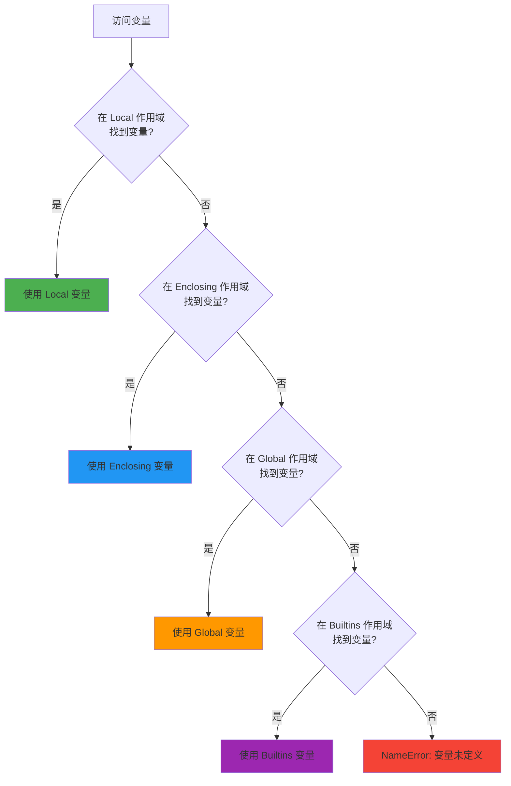

# P3D-Python局部变量和全局变量-什么是作用域？为什么90%初学者踩坑global关键字？怎么快速掌握LEGB规则？

## 摘要

90% 的 Python 初学者在函数中修改全局变量时遇到 UnboundLocalError 错误，原因是不理解作用域规则。合格的程序员通过掌握 global、nonlocal 关键字和 LEGB 查找规则，写出清晰可维护的代码。本文档帮你彻底理解变量作用域，避免常见陷阱。

> 面试官问："在 Python 函数中，如何修改全局变量？" 求职者回答："直接用 global 关键字声明..." 面试官追问："那你知道为什么有时候不用 global 也能访问全局变量，但修改就会报错吗？LEGB 规则是什么？" 这样的困惑，90% 的 Python 初学者都遇到过。今天我们就来系统地学习 Python 的变量作用域，让你在面试和实际开发中都能游刃有余，不再踩坑。

## 目录

- [什么是全局变量？](#什么是全局变量)
  - [全局变量的定义与特点](#全局变量的定义与特点)
  - [全局变量的访问规则](#全局变量的访问规则)
  - [全局变量的修改](#全局变量的修改)
- [什么是局部变量？](#什么是局部变量)
  - [局部变量的定义与特点](#局部变量的定义与特点)
  - [局部变量的生命周期](#局部变量的生命周期)
  - [局部变量的访问限制](#局部变量的访问限制)
- [global 关键字：修改全局变量](#global-关键字修改全局变量)
  - [global 关键字的作用](#global-关键字的作用)
  - [global 关键字的使用规则](#global-关键字的使用规则)
  - [可变类型与不可变类型的区别](#可变类型与不可变类型的区别)
- [nonlocal 关键字：修改嵌套作用域变量](#nonlocal-关键字修改嵌套作用域变量)
  - [nonlocal 关键字的作用](#nonlocal-关键字的作用)
  - [nonlocal 与 global 的区别](#nonlocal-与-global-的区别)
  - [使用 nonlocal 构建闭包](#使用-nonlocal-构建闭包)
- [LEGB 规则：Python 作用域查找顺序](#legb-规则python-作用域查找顺序)
  - [LEGB 规则详解](#legb-规则详解)
  - [作用域查找示例](#作用域查找示例)
  - [命名空间的概念](#命名空间的概念)
- [常见错误与注意事项](#常见错误与注意事项)
  - [UnboundLocalError 错误](#unboundlocalerror-错误)
  - [变量查找顺序问题](#变量查找顺序问题)
  - [全局变量的使用建议](#全局变量的使用建议)
- [对比示例：不使用作用域规则的问题](#对比示例不使用作用域规则的问题)
- [写在最后](#写在最后)

---

## 什么是全局变量？

<p align="right"><span style="background:#e53935;color:#fff;padding:2px 6px;border-radius:4px">🔥 Must（必做实践）</span></p>

让我们先来理解什么是全局变量。**全局变量（Global Variable）** 是在函数外部定义的变量，它的作用域覆盖整个模块（文件），可以在程序的任何位置被访问。

### 全局变量的定义与特点

**定义位置：**
- 定义在函数体外、模块内的变量称为全局变量
- 在程序的最外层定义的变量
- 在文件顶部定义的变量

**作用域范围：**
- 全局变量在所有函数体内都可以进行访问
- 全局变量声明在全局命名空间中，作用域是当前文件中的所有位置
- 可以从程序中的任何位置访问全局变量
- Python 的全局变量的作用域为特定模块之内

### 通俗理解：全局变量就像公共公告栏

想象一下公司里的公共公告栏：
- 📌 公告栏放在大厅里，所有人都能看到
- 📌 任何部门的员工都可以查看公告栏上的信息
- 📌 公告栏上的信息在整个公司范围内都有效

全局变量就是这个道理：**定义在函数外部的变量，就像放在"公共区域"的信息，所有函数都可以访问它。**

### 全局变量的基本用法

让我们通过一个简单的例子来理解全局变量：

```python
# 全局变量定义
name = "Python"  # 这是一个全局变量，定义在函数外部

def greet():
    """
    问候函数：访问全局变量
    """
    print(f"你好，{name}！")  # 在函数内部可以直接访问全局变量

def show_name():
    """
    显示名称函数：同样可以访问全局变量
    """
    print(f"当前名称是：{name}")

# 调用函数
greet()      # 输出：你好，Python！
show_name()  # 输出：当前名称是：Python

# 在函数外部也可以直接访问
print(name)  # 输出：Python
```

**运行结果：**
```
你好，Python！
当前名称是：Python
Python
```

**关键点：**
- `name` 是全局变量，定义在函数外部
- 在 `greet()` 和 `show_name()` 函数内部都可以直接访问 `name`
- 在函数外部也可以直接访问 `name`

### 全局变量的访问规则

**访问规则：**
- ✅ **读取全局变量**：在函数内部可以直接读取全局变量的值，无需使用 `global` 关键字
- ⚠️ **修改全局变量**：在函数内部修改全局变量时，必须使用 `global` 关键字声明，否则会出错

让我们看看读取和修改的区别：

```python
# 全局变量
count = 0

def read_global():
    """
    读取全局变量：无需 global 关键字
    """
    print(f"当前计数：{count}")  # ✅ 可以直接读取

def modify_global():
    """
    修改全局变量：必须使用 global 关键字
    """
    global count  # ⚠️ 必须声明 global
    count += 1    # 现在可以修改了
    print(f"修改后的计数：{count}")

read_global()     # 输出：当前计数：0
modify_global()   # 输出：修改后的计数：1
read_global()     # 输出：当前计数：1
```

**运行结果：**
```
当前计数：0
修改后的计数：1
当前计数：1
```

**重要提示：**
- 如果只是读取全局变量的值，可以省略 `global` 关键字（但加上更规范）
- 如果要修改全局变量的值，必须使用 `global` 关键字声明

### 全局变量的修改

全局变量的修改分为两种情况：**不可变类型**和**可变类型**。

#### 不可变类型全局变量（如字符串、数字）

对于不可变类型的全局变量，如果要修改，必须使用 `global` 关键字：

```python
# 不可变类型全局变量
name = "Python"

def change_name():
    """
    修改不可变类型全局变量
    """
    global name  # 必须使用 global
    name = "Java"  # 重新赋值
    print(f"修改后的名称：{name}")

print(f"修改前：{name}")  # 输出：修改前：Python
change_name()            # 输出：修改后的名称：Java
print(f"修改后：{name}")  # 输出：修改后：Java
```

#### 可变类型全局变量（如列表、字典）

对于可变类型的全局变量，情况有所不同：

```python
# 可变类型全局变量
numbers = [1, 2, 3]  # 列表是可变类型

def modify_list():
    """
    修改可变类型内部的数据：直接修改即可
    """
    numbers.append(4)  # ✅ 可以直接修改列表内容，无需 global
    print(f"修改后的列表：{numbers}")

def reassign_list():
    """
    给可变类型全局变量重新赋值：需要使用 global
    """
    global numbers  # ⚠️ 重新赋值时必须使用 global
    numbers = [10, 20, 30]  # 重新赋值
    print(f"重新赋值后的列表：{numbers}")

print(f"修改前：{numbers}")  # 输出：修改前：[1, 2, 3]
modify_list()                # 输出：修改后的列表：[1, 2, 3, 4]
print(f"修改后：{numbers}")  # 输出：修改后：[1, 2, 3, 4]

reassign_list()              # 输出：重新赋值后的列表：[10, 20, 30]
print(f"重新赋值后：{numbers}")  # 输出：重新赋值后：[10, 20, 30]
```

**关键区别：**
- **修改可变对象内部的数据**：直接修改即可，无需 `global`（如 `list.append()`、`dict['key'] = value`）
- **给可变对象重新赋值**：必须使用 `global` 关键字（如 `list = [1, 2, 3]`）

**本质原因：**
- 在函数中不使用 `global` 声明全局变量时，不能修改全局变量的**指向**（即不能将全局变量指向新的数据）
- 对于不可变类型，因其指向的数据不能修改，所以不使用 `global` 时无法修改全局变量
- 对于可变类型，修改内部数据不会改变变量的指向，所以可以直接修改；但重新赋值会改变指向，所以需要 `global`

### 全局变量与局部变量同名

如果全局变量和局部变量同名，函数内部会优先使用局部变量：

```python
# 全局变量
name = "全局变量"

def test():
    """
    局部变量与全局变量同名
    """
    name = "局部变量"  # 局部变量，与全局变量同名
    print(f"函数内部：{name}")  # 输出：函数内部：局部变量

test()
print(f"函数外部：{name}")  # 输出：函数外部：全局变量
```

**运行结果：**
```
函数内部：局部变量
函数外部：全局变量
```

**关键点：**
- 当局部变量与全局变量同名时，函数内部会优先使用局部变量（局部作用域优先级更高）
- 在函数内定义一个与全局变量一样名字的变量时，相当于你在函数内重新定义了一个局部变量
- 在函数内重新定义这个变量后，无论你在函数内怎样改动这个变量的值，只有在函数内生效，对全局来说是没有任何影响的

**小技巧：** 强龙不压地头蛇——局部变量优先级高于全局变量。

---

## 什么是局部变量？

<p align="right"><span style="background:#e53935;color:#fff;padding:2px 6px;border-radius:4px">🔥 Must（必做实践）</span></p>

**局部变量（Local Variable）** 是在函数体内部定义的变量，它的作用域仅限于该函数内部，函数执行完成后就会被销毁。

### 局部变量的定义与特点

**定义位置：**
- 定义在函数体内部的变量称为局部变量
- 在函数内部定义的变量
- 函数的形参也是局部变量

**作用域范围：**
- 局部变量的作用范围只在声明该局部变量的函数体内
- 声明在函数内部的变量，只能在当前函数内部访问
- 只能在定义这个变量的函数内部使用
- 当你在一个函数的定义中声明变量时，它们不会以任何方式与身处函数之外但具有相同名称的变量产生关系

### 通俗理解：局部变量就像私人抽屉

想象一下办公室里的私人抽屉：
- 📦 每个员工都有自己的私人抽屉
- 📦 只有抽屉的主人才能使用里面的物品
- 📦 其他员工无法访问别人的私人抽屉
- 📦 员工离职后，抽屉会被清空

局部变量就是这个道理：**定义在函数内部的变量，就像放在"私人区域"的信息，只有这个函数才能访问它，函数执行完毕后就会被销毁。**

### 局部变量的基本用法

让我们通过一个简单的例子来理解局部变量：

```python
def calculate_sum(a, b):
    """
    计算两个数的和
    
    参数：
        a: 第一个数（形参，也是局部变量）
        b: 第二个数（形参，也是局部变量）
    返回：
        两个数的和
    """
    result = a + b  # result 是局部变量，定义在函数内部
    return result

# 调用函数
sum_result = calculate_sum(5, 3)
print(f"计算结果：{sum_result}")  # 输出：计算结果：8

# ❌ 错误：无法在函数外部访问局部变量
# print(result)  # 会报错：NameError: name 'result' is not defined
```

**运行结果：**
```
计算结果：8
```

**关键点：**
- `a`、`b` 是函数的形参，也是局部变量
- `result` 是局部变量，定义在函数内部
- 在函数外部无法访问 `result`，会报 `NameError` 错误

### 局部变量的生命周期

**生命周期：**
- 局部变量在函数被调用时创建
- 在函数执行完毕后销毁（除非它们被返回或以其他方式传递到外部）
- 函数执行完成后（堆内存执行完成后函数就回收），局部变量就随着函数被回收了

让我们通过一个例子来理解局部变量的生命周期：

```python
def create_local():
    """
    创建局部变量
    """
    local_var = "我是局部变量"
    print(f"函数内部：{local_var}")
    return local_var  # 返回局部变量

# 调用函数
returned_value = create_local()  # 输出：函数内部：我是局部变量
print(f"返回值：{returned_value}")  # 输出：返回值：我是局部变量

# ❌ 错误：函数执行完毕后，局部变量已被销毁
# print(local_var)  # 会报错：NameError: name 'local_var' is not defined
```

**运行结果：**
```
函数内部：我是局部变量
返回值：我是局部变量
```

**重要提示：**
- 如果一个数据在函数中临时使用，使用完之后就没有作用的数据，就可以声明为局部变量在当前函数内部使用
- 局部变量在函数执行完毕后会被销毁，无法在函数外部访问

### 局部变量的访问限制

**访问限制：**
- 局部变量只能在其被声明的函数内部访问
- 外部代码通常无法访问内部变量
- 调用函数时，所有在函数内声明的变量名称都将被加入到作用域中

让我们看看不同函数中的局部变量：

```python
def function_a():
    """
    函数 A：定义局部变量
    """
    local_var = "函数 A 的局部变量"
    print(f"函数 A：{local_var}")

def function_b():
    """
    函数 B：定义同名局部变量
    """
    local_var = "函数 B 的局部变量"  # 同名局部变量，互不影响
    print(f"函数 B：{local_var}")

# 调用函数
function_a()  # 输出：函数 A：函数 A 的局部变量
function_b()  # 输出：函数 B：函数 B 的局部变量
```

**运行结果：**
```
函数 A：函数 A 的局部变量
函数 B：函数 B 的局部变量
```

**关键点：**
- 不同的函数可以定义相同名字的局部变量，但是各用各的不会产生影响
- 每个函数的局部变量都是独立的，互不干扰

---

## global 关键字：修改全局变量

<p align="right"><span style="background:#e53935;color:#fff;padding:2px 6px;border-radius:4px">🔥 Must（必做实践）</span></p>

**global 关键字**用于在函数内部声明全局变量，告诉 Python 这是一个全局变量，作用跟在全局作用域里写下一个全局变量是一样的效果。

### global 关键字的作用

**作用：**
- 声明一个或多个变量，这些变量的作用域为模块级的作用域的变量，即全局变量
- 将赋值变量映射到模块文件内部的作用域
- 在函数内部声明全局变量，用于告诉 Python 这是一个全局变量
- 在函数中定义全局变量的关键字为 global，加了 global 就是全局变量了

### 通俗理解：global 就像通行证

想象一下进入公司需要通行证：
- 🎫 没有通行证，你只能在大厅里看看（读取全局变量）
- 🎫 有了通行证，你才能进入各个部门（修改全局变量）
- 🎫 通行证就是 `global` 关键字

`global` 关键字就是这个道理：**在函数内部，如果你想要修改全局变量，就必须先"申请通行证"（使用 `global` 关键字），告诉 Python："我要修改的是全局变量，不是创建新的局部变量。"**

### global 关键字的基本用法

让我们通过一个简单的例子来理解 `global` 关键字：

```python
# 全局变量
counter = 0

def increment():
    """
    增加计数器：使用 global 修改全局变量
    """
    global counter  # 声明 counter 是全局变量
    counter += 1    # 现在可以修改全局变量了
    print(f"计数器值：{counter}")

def reset():
    """
    重置计数器：使用 global 修改全局变量
    """
    global counter  # 声明 counter 是全局变量
    counter = 0     # 重置为 0
    print(f"计数器已重置：{counter}")

# 调用函数
print(f"初始值：{counter}")  # 输出：初始值：0
increment()                  # 输出：计数器值：1
increment()                  # 输出：计数器值：2
reset()                      # 输出：计数器已重置：0
print(f"最终值：{counter}")  # 输出：最终值：0
```

**运行结果：**
```
初始值：0
计数器值：1
计数器值：2
计数器已重置：0
最终值：0
```

**关键点：**
- 在函数内部使用 `global counter` 声明 `counter` 是全局变量
- 声明后，对 `counter` 的修改会影响全局变量
- 函数执行完毕后，全局变量的值已经被修改

### global 关键字的使用规则

**使用规则：**
- ⚠️ **不能先声明局部变量，再用 global 声明为全局变量**
- ⚠️ **global 变量列表里的变量名不能出现在次作用域内的形参列表**
- ⚠️ **用 global 定义全局变量的时候不能同时赋值，要在下一行才能赋值**
- ⚠️ **在函数中定义了全局变量后，要这个函数执行了，全局变量才生效**
- ⚠️ **在函数中引用它之前使用 global 关键字**，因为你会得到以下错误：`SyntaxError: name 'city' is used prior to global declaration`

让我们看看正确的使用方式：

```python
# ✅ 正确：先声明 global，再使用
def correct_usage():
    global name  # 先声明
    name = "Python"  # 再赋值
    print(name)

# ❌ 错误：先使用，再声明 global
def wrong_usage():
    print(name)  # 错误：在 global 声明前使用
    global name
    name = "Python"

# ❌ 错误：global 声明和赋值不能在同一行
def wrong_usage2():
    global name = "Python"  # 语法错误：SyntaxError

# ✅ 正确：在函数中定义全局变量
def define_global():
    global new_var  # 声明全局变量
    new_var = "新全局变量"  # 赋值
    print(f"函数内部：{new_var}")

define_global()  # 输出：函数内部：新全局变量
print(f"函数外部：{new_var}")  # 输出：函数外部：新全局变量
```

**重要提示：**
- 只要变量在这个函数块内被申明，他的作用域就是整个函数，如果在申明之前被引用，那就会报错
- `global` 关键字改变了函数内部声明的变量的可见性
- 在函数中定义了全局变量后，要这个函数执行了，全局变量才生效

### 省略 global 关键字的情况

**可以省略：**
- ✅ 当你的函数里只读取全局变量的值，此时可省略 `global`，Python 解释器明白你访问的是全局变量
- ✅ 只是访问（读取）全局变量的值，无需 `global` 修饰（加上 `global` 更规范）

**不可省略：**
- ❌ 如果全局变量的名字和局部变量的名字相同，那么使用的是局部变量的
- ❌ 如果在函数内部试图修改全局变量的值，Python 将会创建一个新的局部变量，而不是修改全局变量的值
- ❌ 必须加上 `global` 修饰变量，说明先访问全局变量的值，然后再相加，最后赋值全局变量，如果没有 `global` 修饰，Python 解释器会无法找到变量，因为此时 Python 解释器认为变量为局部变量，应该先创建

让我们看看省略和不能省略的情况：

```python
# 全局变量
count = 10

def read_only():
    """
    只读取全局变量：可以省略 global
    """
    print(f"读取全局变量：{count}")  # ✅ 可以省略 global

def modify_without_global():
    """
    修改全局变量但不使用 global：会出错
    """
    # count += 1  # ❌ 错误：UnboundLocalError: local variable 'count' referenced before assignment
    pass

def modify_with_global():
    """
    修改全局变量并使用 global：正确
    """
    global count  # ✅ 必须使用 global
    count += 1
    print(f"修改后的值：{count}")

read_only()           # 输出：读取全局变量：10
modify_with_global()  # 输出：修改后的值：11
```

### 可变类型与不可变类型的区别

这是理解 `global` 关键字的关键点。让我们详细看看：

#### 不可变类型（如字符串、数字）

对于不可变类型的全局变量，如果要修改，必须使用 `global` 关键字：

```python
# 不可变类型全局变量
name = "Python"

def change_name():
    """
    修改不可变类型全局变量
    """
    global name  # 必须使用 global
    name = "Java"  # 重新赋值
    print(f"修改后的名称：{name}")

print(f"修改前：{name}")  # 输出：修改前：Python
change_name()            # 输出：修改后的名称：Java
print(f"修改后：{name}")  # 输出：修改后：Java
```

#### 可变类型（如列表、字典）

对于可变类型的全局变量，情况有所不同：

```python
# 可变类型全局变量
numbers = [1, 2, 3]  # 列表是可变类型

def modify_list_content():
    """
    修改可变类型内部的数据：直接修改即可
    """
    numbers.append(4)  # ✅ 可以直接修改列表内容，无需 global
    numbers[0] = 10    # ✅ 可以直接修改列表元素，无需 global
    print(f"修改后的列表：{numbers}")

def reassign_list():
    """
    给可变类型全局变量重新赋值：需要使用 global
    """
    global numbers  # ⚠️ 重新赋值时必须使用 global
    numbers = [10, 20, 30]  # 重新赋值
    print(f"重新赋值后的列表：{numbers}")

print(f"修改前：{numbers}")  # 输出：修改前：[1, 2, 3]
modify_list_content()        # 输出：修改后的列表：[10, 2, 3, 4]
print(f"修改后：{numbers}")  # 输出：修改后：[10, 2, 3, 4]

reassign_list()              # 输出：重新赋值后的列表：[10, 20, 30]
print(f"重新赋值后：{numbers}")  # 输出：重新赋值后：[10, 20, 30]
```

**本质原因：**
- 在函数中不使用 `global` 声明全局变量时，不能修改全局变量的**指向**（即不能将全局变量指向新的数据）
- 对于不可变类型，因其指向的数据不能修改，所以不使用 `global` 时无法修改全局变量
- 对于可变类型，修改内部数据不会改变变量的指向，所以可以直接修改；但重新赋值会改变指向，所以需要 `global`

---

## nonlocal 关键字：修改嵌套作用域变量

<p align="right"><span style="background:#ff9800;color:#fff;padding:2px 6px;border-radius:4px">⭐ Should（应该实践）</span></p>

**nonlocal 关键字**用于在嵌套函数中修改外层函数的变量（非全局变量）。它可以修改嵌套作用域（enclosing 作用域，外层非全局作用域）中的变量。

### nonlocal 关键字的作用

**作用：**
- 在局部嵌套函数中将外层函数中的自由变量绑定到内层函数作用域
- 它可以修改嵌套作用域（enclosing 作用域，外层非全局作用域）中的变量
- 若要在嵌套函数中修改外层函数的变量（非全局），需用 `nonlocal` 声明

### 通俗理解：nonlocal 就像部门内部通行证

想象一下公司的部门结构：
- 🏢 公司有全局规则（全局变量）
- 🏬 部门有自己的规则（外层函数变量）
- 👤 员工需要遵守部门规则（内层函数）

`nonlocal` 关键字就是这个道理：**在嵌套函数中，如果你想要修改外层函数的变量（但不是全局变量），就需要使用 `nonlocal` 关键字，告诉 Python："我要修改的是外层函数的变量，不是创建新的局部变量。"**

### nonlocal 关键字的基本用法

让我们通过一个简单的例子来理解 `nonlocal` 关键字：

```python
def outer():
    """
    外层函数
    """
    message = 'local'  # 外层函数的局部变量
    
    def inner():
        """
        内层函数：使用 nonlocal 修改外层函数的变量
        """
        nonlocal message  # 声明 message 是外层函数的变量
        message = 'nonlocal'  # 修改外层函数的变量
        print(f"inner: {message}")
    
    inner()  # 调用内层函数
    print(f"outer: {message}")  # 输出修改后的值

outer()
```

**运行结果：**
```
inner: nonlocal
outer: nonlocal
```

**关键点：**
- `message` 是外层函数 `outer()` 的局部变量
- 在内层函数 `inner()` 中使用 `nonlocal message` 声明
- 声明后，对 `message` 的修改会影响外层函数的变量
- 外层函数中的 `message` 值也被修改了

### nonlocal 与 global 的区别

让我们通过对比来理解 `nonlocal` 和 `global` 的区别：

```python
# 全局变量
global_var = "global"

def outer():
    """
    外层函数
    """
    nonlocal_var = "nonlocal"  # 外层函数的局部变量
    
    def inner_global():
        """
        使用 global：修改全局变量
        """
        global global_var  # 声明全局变量
        global_var = "modified global"
        print(f"inner_global: {global_var}")
    
    def inner_nonlocal():
        """
        使用 nonlocal：修改外层函数的变量
        """
        nonlocal nonlocal_var  # 声明外层函数的变量
        nonlocal_var = "modified nonlocal"
        print(f"inner_nonlocal: {nonlocal_var}")
    
    print(f"outer before: nonlocal_var = {nonlocal_var}")
    inner_nonlocal()  # 调用内层函数
    print(f"outer after: nonlocal_var = {nonlocal_var}")
    
    print(f"outer before: global_var = {global_var}")
    inner_global()  # 调用内层函数
    print(f"outer after: global_var = {global_var}")

outer()
print(f"global: global_var = {global_var}")
```

**运行结果：**
```
outer before: nonlocal_var = nonlocal
inner_nonlocal: modified nonlocal
outer after: nonlocal_var = modified nonlocal
outer before: global_var = global
inner_global: modified global
outer after: global_var = modified global
global: global_var = modified global
```

**关键区别：**
- **global**：修改的是全局变量（模块级变量）
- **nonlocal**：修改的是外层函数的局部变量（非全局变量）
- 如果使用 `global` 关键字来声明变量，那么最终的打印输出结果会不同，这是因为 `global` 关键字的使用让我们在 `inner()` 函数（局部作用域）内声明了一个 `global` 变量，故如果我们在 `inner()` 函数内做任何修改，则修改的结果只会在局部作用域（也即 `outer()` 函数）之外出现

### 使用 nonlocal 构建闭包

`nonlocal` 还可以用来构建闭包函数。让我们看看一个经典的计数器例子：

```python
def create_counter():
    """
    创建计数器：使用 nonlocal 构建闭包
    """
    count = 0  # 外层函数的局部变量
    
    def counter():
        """
        计数器函数：闭包
        """
        nonlocal count  # 声明外层函数的变量
        count += 1      # 修改外层函数的变量
        return count
    
    return counter  # 返回内层函数

# 创建计数器
counter1 = create_counter()
counter2 = create_counter()

# 使用计数器
print(counter1())  # 输出：1
print(counter1())  # 输出：2
print(counter1())  # 输出：3

print(counter2())  # 输出：1（独立的计数器）
print(counter2())  # 输出：2
```

**运行结果：**
```
1
2
3
1
2
```

**关键点：**
- `create_counter()` 函数返回一个内层函数 `counter()`
- `counter()` 函数通过 `nonlocal` 访问并修改外层函数的 `count` 变量
- 每次调用 `create_counter()` 都会创建一个新的计数器，它们之间是独立的
- 这就是闭包的典型应用场景

**nonlocal 的查找规则：**
- 只要你使用了关键字 `nonlocal` 他就能获取你上一级函数的局部变量
- 获取不到就再获取上一级函数的变量，当然，只限函数外
- 如果最外面的函数也还是没有的错，那就会报错

---

## LEGB 规则：Python 作用域查找顺序

<p align="right"><span style="background:#e53935;color:#fff;padding:2px 6px;border-radius:4px">🔥 Must（必做实践）</span></p>

**LEGB 规则**是 Python 变量查找的顺序规则，它决定了 Python 在查找变量时按照什么顺序搜索不同的作用域。

### LEGB 规则详解

**LEGB 的含义：**
- **L -> Local（本地）**：局部作用域，函数内部声明的变量
- **E -> Enclosing（嵌套）**：嵌套作用域，函数内部的函数
- **G -> Global（全局）**：全局作用域，Python 文件的内部
- **B -> Builtins（内建）**：Python 内建作用域

**查找顺序：**
- Python 引用变量的顺序：当前作用域局部变量 → 外层作用域变量 → 当前模块中的全局变量 → Python 内置变量
- 变量使用时，查询顺序就近原则【找变量离自己声明最近的一份命名空间】
- 当访问一个变量时，Python 会从内到外依次搜索所有作用域，直到找到变量或报错
- 在局部找不到，便会去局部外的局部找（例如闭包），再找不到就会去全局找，最后去内建中找
- 如果这样还找不到，那就提示变量不存在的错误

### 通俗理解：LEGB 就像找东西的顺序

想象一下你在找一本书：
1. 📚 先在自己的桌子上找（Local - 局部作用域）
2. 📚 如果没找到，去部门的书架上找（Enclosing - 嵌套作用域）
3. 📚 如果还没找到，去公司图书馆找（Global - 全局作用域）
4. 📚 如果还是没找到，去公共图书馆找（Builtins - 内建作用域）

LEGB 规则就是这个道理：**Python 查找变量时，按照从内到外的顺序，一层一层地搜索，直到找到为止。**

### LEGB 规则的可视化

让我们用 Mermaid 流程图来可视化 LEGB 查找顺序：



### 作用域查找示例

让我们通过具体的例子来理解 LEGB 规则：

```python
# Global 作用域
g_count = 0  # 全局变量

def outer():
    """
    外层函数：Enclosing 作用域
    """
    o_count = 1  # 外层函数的局部变量（对 inner 来说是 Enclosing）
    
    def inner():
        """
        内层函数：Local 作用域
        """
        i_count = 2  # 内层函数的局部变量（Local）
        
        # 在 inner 函数中访问变量时，顺序为：
        # i_count（L）→ o_count（E）→ g_count（G）→ 内置名称（B）
        print(f"Local (i_count): {i_count}")      # 输出：Local (i_count): 2
        print(f"Enclosing (o_count): {o_count}")  # 输出：Enclosing (o_count): 1
        print(f"Global (g_count): {g_count}")     # 输出：Global (g_count): 0
        print(f"Builtins (len): {len([1, 2, 3])}")  # 输出：Builtins (len): 3
    
    inner()

outer()
```

**运行结果：**
```
Local (i_count): 2
Enclosing (o_count): 1
Global (g_count): 0
Builtins (len): 3
```

**关键点：**
- `i_count` 在 Local 作用域中找到
- `o_count` 在 Enclosing 作用域中找到
- `g_count` 在 Global 作用域中找到
- `len` 在 Builtins 作用域中找到

### 函数作用域的特殊规则

**重要规则：** Python 函数的作用域取决于其函数代码块在整体代码中的位置，而不是调用时机的位置。

让我们看一个例子：

```python
name = 'jack'  # 全局变量

def f1():
    """
    函数 f1：定义时外部是 name = 'jack'
    """
    print(name)  # 输出：jack

def f2():
    """
    函数 f2：定义局部变量 name
    """
    name = 'eric'  # 局部变量
    f1()  # 调用 f1

f2()  # 输出：jack（不是 eric）
```

**运行结果：**
```
jack
```

**关键点：**
- 调用 `f1()` 的时候，会去 `f1` 函数的定义体查找
- 对于 `f1` 函数，它的外部是 `name = 'jack'`，而不是 `name = 'eric'`
- 函数的作用域取决于定义位置，而不是调用位置

### 命名空间的概念

**三种命名空间：**
- **内置名称（built-in names）**：Python 语言自带的名称，比如内置函数 `abs()`、`len()`，以及异常类 `BaseException`、`Exception` 等。这些名称在 Python 启动时就已加载，全局可见
- **全局名称（global names）**：模块（.py 文件）中定义的名称，包括函数、类、导入的模块、模块级变量和常量等。全局命名空间在模块加载时创建，直到模块被卸载时销毁
- **局部名称（local names）**：函数或类中定义的名称，包括函数参数、局部变量等。局部命名空间在函数/类被调用时创建，执行结束后销毁

**查找顺序：**
- 当使用一个变量时，Python 会按以下顺序查找对应的命名空间：局部命名空间 → 全局命名空间 → 内置命名空间
- 如果在所有命名空间中都找不到该变量，就会抛出 `NameError` 异常

**生命周期：**
- 内置命名空间：从 Python 启动到退出，全程存在
- 全局命名空间：从模块加载到卸载，持续存在
- 局部命名空间：从函数/类调用开始，到执行结束后销毁
- 外部命名空间无法访问内部命名空间的对象

---

## 常见错误与注意事项

<p align="right"><span style="background:#ff9800;color:#fff;padding:2px 6px;border-radius:4px">⭐ Should（应该实践）</span></p>

让我们来看看在使用全局变量和局部变量时常见的错误，以及如何避免这些错误。

### UnboundLocalError 错误

**错误原因：**
- 如果在函数内部要修改一个变量，那么这个变量需要是内部变量，除非你用 `global` 声明了它是外部变量
- 在函数中 `=` 号左边表示定义了一个局部变量，待赋值，而如果还没赋值就拿来进行运算，自然就会报错了
- 如果在函数中既想使用全局变量，又未用 `global` 声明，会导致错误

**错误示例：**

```python
# 全局变量
a = 10

def test():
    """
    错误示例：未使用 global 直接修改全局变量
    """
    a = a + 1  # ❌ 错误：UnboundLocalError: local variable 'a' referenced before assignment
    print(a)

test()
```

**错误原因分析：**
- Python 的规则是，如果在函数内部要修改一个变量，那么这个变量需要是内部变量，除非你用 `global` 声明了它是外部变量
- 很明显，我们没有在函数内部定义变量 `a`，所以会弹出局部变量在未定义之前就引用的错误
- 函数内部使用一个变量时，底层代码将变量的声明提升到函数的头部，但是赋值的过程还在原来的位置，此时如果在赋值之前使用变量，就会出现变量和值没有绑定的情况，于是就出现了 `UnboundLocalError`

**解决方法：**

```python
# 全局变量
a = 10

def test_correct():
    """
    正确示例：使用 global 声明全局变量
    """
    global a  # ✅ 使用 global 声明
    a = a + 1
    print(a)  # 输出：11

def test_correct2():
    """
    正确示例：通过函数参数传递变量（推荐，避免全局变量滥用）
    """
    local_a = 10  # 局部变量
    local_a = local_a + 1
    print(local_a)  # 输出：11

test_correct()
test_correct2()
```

**运行结果：**
```
11
11
```

### 变量查找顺序问题

**常见问题：**

```python
name = "tom"  # 全局变量

def test():
    """
    错误示例：变量声明提升导致的错误
    """
    print(name)  # ❌ 错误：UnboundLocalError: local variable 'name' referenced before assignment
    name = "jerry"  # 局部变量

test()
```

**错误原因：**
- 函数内部使用一个变量时，底层代码将变量的声明提升到函数的头部，但是赋值的过程还在原来的位置
- 此时如果在赋值之前使用变量，就会出现变量和值没有绑定的情况

**解决方法：**

```python
name = "tom"  # 全局变量

def test_correct():
    """
    正确示例：先声明 global，再使用
    """
    global name  # ✅ 先声明
    print(name)  # 输出：tom
    name = "jerry"  # 再赋值

def test_correct2():
    """
    正确示例：使用不同的变量名
    """
    local_name = "jerry"  # 使用不同的变量名
    print(local_name)  # 输出：jerry

test_correct()
test_correct2()
```

### 在 global 声明前使用变量

**错误示例：**

```python
param = 10  # 全局变量

def main():
    """
    错误示例：在 global 声明前使用变量
    """
    print("param_value:%d\t param_id:%d" % (param, id(param)))  # ❌ 错误
    global param
    param = 6
    print("param_value:%d\t param_id:%d" % (param, id(param)))

main()
```

**错误信息：**
```
SyntaxError: name 'param' is used prior to global declaration
```

**解决方法：**

```python
param = 10  # 全局变量

def main_correct():
    """
    正确示例：先声明 global，再使用
    """
    global param  # ✅ 先声明
    print("param_value:%d\t param_id:%d" % (param, id(param)))  # 输出：param_value:10	 param_id:...
    param = 6
    print("param_value:%d\t param_id:%d" % (param, id(param)))  # 输出：param_value:6	 param_id:...

main_correct()
```

### 全局变量的使用建议

**使用建议：**
- 应该只能通过传参，并且对于全局变量不要随意修改
- 反正 Python 在函数外定义的变量均当做全局变量来处理，也不需要画蛇添足加上 `global` 关键字，只有当确认需要对 `global` 变量做出修改的时候，再使用 `global` 关键字
- 局部变量优先级大于全局变量
- 在自定义函数内部优先级：局部变量 > 全局变量

**最佳实践：**
1. **优先使用局部变量**：尽可能使用局部变量，通过参数和返回值在函数之间传递数据
2. **避免命名冲突**：全局变量和局部变量最好使用不同的名称，以避免混淆和错误
3. **慎用全局变量**：过多使用全局变量可能导致代码难以维护和调试
4. **使用 `global` 和 `nonlocal` 时需谨慎**：在函数内部修改全局变量或外层函数变量时，必须使用 `global` 或 `nonlocal` 关键字进行声明，但这可能增加代码的复杂性，应谨慎使用

---

## 对比示例：不使用作用域规则的问题

<p align="right"><span style="background:#2196f3;color:#fff;padding:2px 6px;border-radius:4px">💡 Could（可以实践）</span></p>

让我们通过对比示例来看看，如果不理解作用域规则，会遇到什么问题。

### 问题场景：计数器应用

假设我们要实现一个计数器功能，记录函数被调用的次数。

**❌ 错误做法：不理解作用域规则**

```python
# 错误示例：不理解作用域规则
count = 0  # 全局变量

def increment_wrong():
    """
    错误示例：未使用 global 关键字
    """
    count = count + 1  # ❌ 错误：UnboundLocalError
    return count

# 调用函数会报错
# increment_wrong()  # UnboundLocalError: local variable 'count' referenced before assignment
```

**✅ 正确做法：使用 global 关键字**

```python
# 正确示例：使用 global 关键字
count = 0  # 全局变量

def increment_correct():
    """
    正确示例：使用 global 关键字
    """
    global count  # ✅ 使用 global 声明
    count = count + 1
    return count

# 调用函数
print(increment_correct())  # 输出：1
print(increment_correct())  # 输出：2
print(increment_correct())  # 输出：3
```

**运行结果：**
```
1
2
3
```

**更好的做法：使用闭包（避免全局变量）**

```python
# 更好的做法：使用闭包，避免全局变量
def create_counter():
    """
    创建计数器：使用闭包，避免全局变量
    """
    count = 0  # 外层函数的局部变量
    
    def increment():
        """
        增加计数：使用 nonlocal
        """
        nonlocal count  # ✅ 使用 nonlocal
        count += 1
        return count
    
    return increment

# 创建计数器
counter = create_counter()

# 使用计数器
print(counter())  # 输出：1
print(counter())  # 输出：2
print(counter())  # 输出：3
```

**运行结果：**
```
1
2
3
```

**对比总结：**
- ❌ **错误做法**：不理解作用域规则，直接修改全局变量，导致 `UnboundLocalError`
- ✅ **正确做法**：使用 `global` 关键字声明全局变量，可以正常工作
- ⭐ **更好的做法**：使用闭包和 `nonlocal`，避免全局变量，代码更加优雅

### 问题场景：配置管理

假设我们要实现一个配置管理功能，在函数中修改配置。

**❌ 错误做法：不理解可变类型和不可变类型的区别**

```python
# 错误示例：不理解可变类型和不可变类型的区别
config = {
    "host": "localhost",
    "port": 8080
}  # 全局配置字典

def update_config_wrong():
    """
    错误示例：重新赋值未使用 global
    """
    config = {  # ❌ 错误：创建了新的局部变量，没有修改全局变量
        "host": "example.com",
        "port": 9090
    }
    print(f"函数内部：{config}")

update_config_wrong()
print(f"函数外部：{config}")  # 全局变量没有被修改
```

**运行结果：**
```
函数内部：{'host': 'example.com', 'port': 9090}
函数外部：{'host': 'localhost', 'port': 8080}
```

**✅ 正确做法：理解可变类型和不可变类型的区别**

```python
# 正确示例：理解可变类型和不可变类型的区别
config = {
    "host": "localhost",
    "port": 8080
}  # 全局配置字典

def update_config_correct1():
    """
    正确示例：修改字典内容，无需 global
    """
    config["host"] = "example.com"  # ✅ 修改字典内容，无需 global
    config["port"] = 9090
    print(f"函数内部：{config}")

def update_config_correct2():
    """
    正确示例：重新赋值，使用 global
    """
    global config  # ✅ 重新赋值，必须使用 global
    config = {
        "host": "newhost.com",
        "port": 10000
    }
    print(f"函数内部：{config}")

print(f"修改前：{config}")  # 输出：修改前：{'host': 'localhost', 'port': 8080}
update_config_correct1()    # 输出：函数内部：{'host': 'example.com', 'port': 9090}
print(f"修改后：{config}")  # 输出：修改后：{'host': 'example.com', 'port': 9090}

update_config_correct2()    # 输出：函数内部：{'host': 'newhost.com', 'port': 10000}
print(f"重新赋值后：{config}")  # 输出：重新赋值后：{'host': 'newhost.com', 'port': 10000}
```

**运行结果：**
```
修改前：{'host': 'localhost', 'port': 8080}
函数内部：{'host': 'example.com', 'port': 9090}
修改后：{'host': 'example.com', 'port': 9090}
函数内部：{'host': 'newhost.com', 'port': 10000}
重新赋值后：{'host': 'newhost.com', 'port': 10000}
```

**对比总结：**
- ❌ **错误做法**：不理解可变类型和不可变类型的区别，重新赋值时未使用 `global`，导致创建了新的局部变量
- ✅ **正确做法**：理解可变类型可以直接修改内容，重新赋值时需要 `global`，代码可以正常工作

---

## 写在最后

🎉 恭喜你！通过本文的学习，我们掌握了 Python 变量作用域的核心知识点：

✅ **全局变量和局部变量的区别**：全局变量定义在函数外部，作用域覆盖整个模块；局部变量定义在函数内部，作用域仅限于该函数

✅ **global 关键字的使用**：在函数内部修改全局变量时，必须使用 `global` 关键字声明

✅ **nonlocal 关键字的使用**：在嵌套函数中修改外层函数的变量时，必须使用 `nonlocal` 关键字声明

✅ **LEGB 查找规则**：Python 按照 Local → Enclosing → Global → Builtins 的顺序查找变量

✅ **可变类型和不可变类型的区别**：修改可变对象的内容无需 `global`，但重新赋值需要 `global`

✅ **常见错误的避免**：理解了 `UnboundLocalError` 的原因和解决方法

💪 现在你已经掌握了 Python 变量作用域的核心知识，可以写出更加清晰、可维护的代码了。记住：理解作用域规则是写出专业代码的基础，多实践、多思考，你一定能成为 Python 高手！

🚀 继续加油，让我们一起在 Python 的世界里探索更多精彩！

---

**作者**：郑恩赐  
**机构**：厦门工学院人工智能创作坊  
**日期**：2025 年 11 月 10 日

