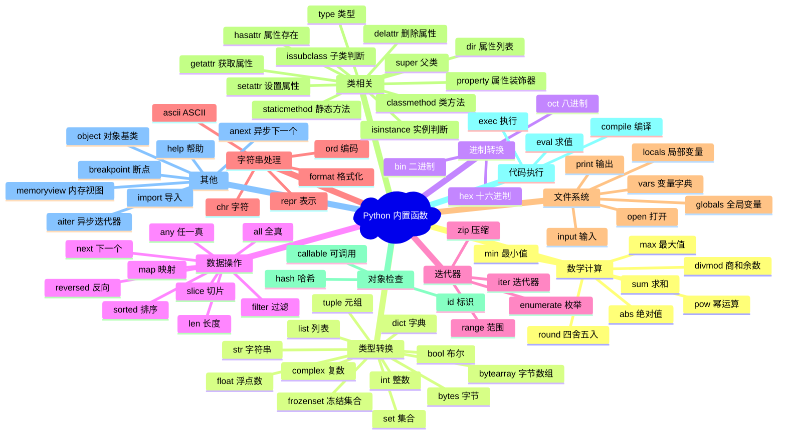

# P3F-Python内置函数完全指南-什么是内置函数？为什么90%程序员都在用？怎么快速掌握70+个核心函数？

## 📝 摘要

Python 内置函数（built-in function，内置函数）是编程的核心工具，90% 的程序员每天都在使用，但很多人只掌握了 20% 的常用函数。本文档系统讲解 70+ 个内置函数，从参数（parameter，参数）、返回值（return value，返回值）到实战应用，帮你快速掌握 Python 编程利器，提升开发效率。

---

> **面试官**：请介绍一下 Python 的内置函数，你知道有多少个吗？  
> **求职者**：嗯...大概有 print()、len()、range()...具体多少个我不太清楚。  
> **面试官**：那你知道 `divmod()` 和 `enumerate()` 的区别吗？什么时候用 `map()` 而不是列表推导式？  
> **求职者**：这个...我平时用得不多...

💡 **这样的场景是不是很熟悉？** 很多 Python 开发者每天都在使用内置函数，但往往只停留在 `print()`、`len()`、`range()` 这几个基础函数上。当面试官问到更深入的问题时，或者在实际项目中需要高效处理数据时，才发现自己对 Python 内置函数的掌握还远远不够。

🔑 **其实，Python 内置函数是提升编程效率的利器**。掌握它们不仅能让你在面试中脱颖而出，更能让你在实际开发中写出更优雅、更高效的代码。本文将带你系统学习 70+ 个 Python 内置函数，从基础概念到实战应用，帮你快速掌握这些编程利器。

---

## 📚 目录

- [什么是内置函数](#什么是内置函数)
- [内置函数分类概览](#内置函数分类概览)
- [数学计算相关函数](#数学计算相关函数)
  - [abs() - 绝对值函数](#abs---绝对值函数)
  - [divmod() - 商和余数函数](#divmod---商和余数函数)
  - [pow() - 幂运算函数](#pow---幂运算函数)
  - [round() - 四舍五入函数](#round---四舍五入函数)
  - [sum() - 求和函数](#sum---求和函数)
  - [min() - 最小值函数](#min---最小值函数)
  - [max() - 最大值函数](#max---最大值函数)
- [数据类型转换函数](#数据类型转换函数)
  - [bool() - 布尔类型转换](#bool---布尔类型转换)
  - [int() - 整数类型转换](#int---整数类型转换)
  - [float() - 浮点数类型转换](#float---浮点数类型转换)
  - [complex() - 复数类型转换](#complex---复数类型转换)
  - [str() - 字符串类型转换](#str---字符串类型转换)
  - [bytes() - 字节类型转换](#bytes---字节类型转换)
  - [bytearray() - 字节数组类型转换](#bytearray---字节数组类型转换)
  - [list() - 列表类型转换](#list---列表类型转换)
  - [tuple() - 元组类型转换](#tuple---元组类型转换)
  - [dict() - 字典类型转换](#dict---字典类型转换)
  - [set() - 集合类型转换](#set---集合类型转换)
  - [frozenset() - 冻结集合类型转换](#frozenset---冻结集合类型转换)
- [进制转换函数](#进制转换函数)
  - [bin() - 二进制转换](#bin---二进制转换)
  - [oct() - 八进制转换](#oct---八进制转换)
  - [hex() - 十六进制转换](#hex---十六进制转换)
- [数据操作相关函数](#数据操作相关函数)
  - [len() - 长度函数](#len---长度函数)
  - [sorted() - 排序函数](#sorted---排序函数)
  - [reversed() - 反向迭代函数](#reversed---反向迭代函数)
  - [slice() - 切片对象函数](#slice---切片对象函数)
  - [next() - 迭代器下一个元素](#next---迭代器下一个元素)
  - [all() - 全真判断函数](#all---全真判断函数)
  - [any() - 任一真判断函数](#any---任一真判断函数)
  - [filter() - 过滤函数](#filter---过滤函数)
  - [map() - 映射函数](#map---映射函数)
- [迭代器生成器相关函数](#迭代器生成器相关函数)
  - [range() - 范围生成函数](#range---范围生成函数)
  - [iter() - 迭代器函数](#iter---迭代器函数)
  - [enumerate() - 枚举函数](#enumerate---枚举函数)
  - [zip() - 压缩函数](#zip---压缩函数)
- [字符串与字符处理函数](#字符串与字符处理函数)
  - [ascii() - ASCII 表示函数](#ascii---ascii-表示函数)
  - [chr() - 字符转换函数](#chr---字符转换函数)
  - [ord() - 字符编码函数](#ord---字符编码函数)
  - [format() - 格式化函数](#format---格式化函数)
  - [repr() - 对象表示函数](#repr---对象表示函数)
- [文件与系统相关函数](#文件与系统相关函数)
  - [open() - 文件打开函数](#open---文件打开函数)
  - [input() - 输入函数](#input---输入函数)
  - [print() - 输出函数](#print---输出函数)
  - [locals() - 局部变量函数](#locals---局部变量函数)
  - [globals() - 全局变量函数](#globals---全局变量函数)
  - [vars() - 变量字典函数](#vars---变量字典函数)
- [类相关函数](#类相关函数)
  - [type() - 类型函数](#type---类型函数)
  - [isinstance() - 实例判断函数](#isinstance---实例判断函数)
  - [issubclass() - 子类判断函数](#issubclass---子类判断函数)
  - [classmethod() - 类方法装饰器](#classmethod---类方法装饰器)
  - [staticmethod() - 静态方法装饰器](#staticmethod---静态方法装饰器)
  - [super() - 父类代理函数](#super---父类代理函数)
  - [hasattr() - 属性存在判断](#hasattr---属性存在判断)
  - [getattr() - 获取属性函数](#getattr---获取属性函数)
  - [setattr() - 设置属性函数](#setattr---设置属性函数)
  - [delattr() - 删除属性函数](#delattr---删除属性函数)
  - [dir() - 属性列表函数](#dir---属性列表函数)
  - [property() - 属性装饰器](#property---属性装饰器)
- [对象检查与反射函数](#对象检查与反射函数)
  - [callable() - 可调用判断函数](#callable---可调用判断函数)
  - [id() - 对象标识函数](#id---对象标识函数)
  - [hash() - 哈希值函数](#hash---哈希值函数)
- [字符串类型代码执行函数](#字符串类型代码执行函数)
  - [eval() - 表达式求值函数](#eval---表达式求值函数)
  - [exec() - 代码执行函数](#exec---代码执行函数)
  - [compile() - 代码编译函数](#compile---代码编译函数)
- [其他重要函数](#其他重要函数)
  - [memoryview() - 内存视图函数](#memoryview---内存视图函数)
  - [__import__() - 模块导入函数](#__import__---模块导入函数)
  - [help() - 帮助函数](#help---帮助函数)
  - [aiter() - 异步迭代器函数](#aiter---异步迭代器函数)
  - [anext() - 异步下一个元素函数](#anext---异步下一个元素函数)
  - [breakpoint() - 断点函数](#breakpoint---断点函数)
  - [object() - 对象基类函数](#object---对象基类函数)
- [对比示例](#对比示例)
- [常见错误与修正](#常见错误与修正)
- [最佳实践](#最佳实践)
- [实际应用场景](#实际应用场景)
- [版本差异说明](#版本差异说明)
- [参考资料](#参考资料)

---

## 什么是内置函数

### 🔍 内置函数的定义

**内置函数（Built-in Functions，内置函数）** 是 Python 解释器内置的函数（function，函数），无需导入（import，导入）任何模块（module，模块）即可直接使用。这些函数是 Python 语言的核心组成部分，提供了最基础、最常用的功能。

### 💡 内置函数的特点和重要性

内置函数具有以下特点和重要性：

1. **无需导入，全局可用**：内置函数不需要使用 `import` 语句（statement，语句）导入，在任何 Python 程序中都可以直接使用
2. **提供核心功能**：内置函数提供了 Python 编程中最基础、最常用的功能，如类型转换、数据操作、文件处理等
3. **提高开发效率**：无需自己实现这些常用功能，可以直接使用内置函数，大大提高开发效率
4. **保证一致性**：内置函数是 Python 标准的一部分，保证了代码的一致性和可移植性
5. **性能优化**：内置函数是用 C 语言实现的，执行效率比用 Python 实现的函数更高

### 📊 内置函数的数量

根据 Python 版本的不同，内置函数的数量也有所不同：

- **Python 2.7**：76 个内置函数
- **Python 3.6.2**：69 个内置函数
- **Python 3.12**：84 个内置函数

目前最新的 Python 版本（Python 3.14）中，内置函数数量约为 70+ 个。本文档将系统讲解所有这些内置函数。

### 🎯 如何查看所有内置函数？

我们可以使用 `dir(__builtins__)` 来查看所有内置函数：

```python
# 查看所有内置函数
import builtins
print(dir(builtins))
```

或者直接使用：

```python
# 查看所有内置函数（不包含异常类）
print([name for name in dir(__builtins__) if not name.startswith('_')])
```

---

## 内置函数分类概览

### 📋 分类说明

Python 内置函数可以根据功能分为 15 大类，让我们先来了解一下这些分类：

1. **数学计算相关**（7 个）：abs(), divmod(), pow(), round(), sum(), min(), max()
2. **数据类型转换**（12 个）：bool(), int(), float(), complex(), str(), bytes(), bytearray(), list(), tuple(), dict(), set(), frozenset()
3. **进制转换**（3 个）：bin(), oct(), hex()
4. **数据操作相关**（9 个）：len(), sorted(), reversed(), slice(), next(), all(), any(), filter(), map()
5. **迭代器生成器相关**（4 个）：range(), iter(), enumerate(), zip()
6. **字符串与字符处理**（5 个）：ascii(), chr(), ord(), format(), repr()
7. **文件&系统**（6 个）：open(), input(), print(), locals(), globals(), vars()
8. **类相关**（12 个）：type(), isinstance(), issubclass(), classmethod(), staticmethod(), super(), hasattr(), setattr(), getattr(), dir(), delattr(), property()
9. **对象检查与反射**（3 个）：callable(), id(), hash()
10. **字符串类型代码的执行**（3 个）：eval(), exec(), compile()
11. **内存相关**（1 个）：memoryview()
12. **模块相关**（1 个）：__import__()
13. **帮助相关**（1 个）：help()
14. **异步相关**（2 个）：aiter(), anext()（Python 3.10+）
15. **调试相关**（1 个）：breakpoint()（Python 3.7+）

接下来，我们将使用 Mermaid 思维导图来可视化这些分类关系。

### 🗺️ 内置函数分类思维导图



---

## 数学计算相关函数 🔥 Must

### abs() - 绝对值函数 🔥 Must

#### 函数签名

```python
abs(number, /)
```

#### 功能说明

`abs()` 函数（function，函数）返回一个数字的绝对值。参数（parameter，参数）可以是整数（integer，整数）、浮点数（float，浮点数）或任何实现了 `__abs__()` 方法（method，方法）的对象（object，对象）。如果参数是一个复数（complex，复数），则返回它的模（magnitude，模）。

#### 参数说明

- **number（数字）**：数字类型（整数、浮点数或复数），或实现了 `__abs__()` 方法的对象

#### 返回值（Return Value，返回值）

返回参数的绝对值。对于复数，返回其模。

#### 使用示例

让我们来看看 `abs()` 函数的具体用法：

```python
# 示例1：整数绝对值
result1 = abs(-10)
print(result1)  # 输出：10

result2 = abs(10)
print(result2)  # 输出：10

# 示例2：浮点数绝对值
result3 = abs(-3.14)
print(result3)  # 输出：3.14

result4 = abs(3.14)
print(result4)  # 输出：3.14

# 示例3：复数绝对值（返回模）
result5 = abs(3 + 4j)
print(result5)  # 输出：5.0 (sqrt(3^2 + 4^2) = 5)

result6 = abs(5j + 4)
print(result6)  # 输出：6.4031242374328485 (sqrt(4^2 + 5^2))
```

#### 最佳实践

1. **数值计算**：在进行数值计算时，如果需要确保结果为正数，可以使用 `abs()` 函数
2. **距离计算**：计算两点之间的距离时，`abs()` 函数非常有用
3. **错误处理**：在需要处理可能为负数的输入时，使用 `abs()` 可以确保得到正值

#### 常见错误

⚠️ **常见错误类型**：对不支持的类型使用内置函数会导致 `TypeError`。

💡 **详细错误说明和修正方法请参见[常见错误与修正](#常见错误与修正)章节中的"错误类型 1：类型错误（TypeError）"部分。**

#### 相关函数

- `math.fabs()`：返回浮点数的绝对值（总是返回浮点数）
- `numpy.abs()`：NumPy 数组的绝对值计算

### divmod() - 商和余数函数 🔥 Must

#### 函数签名

```python
divmod(a, b, /)
```

#### 功能说明

`divmod()` 函数接受两个（非复数）数字作为参数，返回一个包含商和余数的元组 `(商, 余数)`。对于整数来说，结果与 `(a // b, a % b)` 相同。

#### 参数说明

- **a**：被除数（数字类型）
- **b**：除数（数字类型，不能为 0）

#### 返回值

返回一个元组 `(商, 余数)`。

#### 使用示例

让我们来看看 `divmod()` 函数的具体用法：

```python
# 示例1：整数除法和取余
result1 = divmod(20, 3)
print(result1)  # 输出：(6, 2)
# 20 // 3 = 6, 20 % 3 = 2

# 示例2：浮点数除法和取余
result2 = divmod(20.5, 3)
print(result2)  # 输出：(6.0, 2.5)

# 示例3：同时获取商和余数
quotient, remainder = divmod(100, 7)
print(f"商：{quotient}, 余数：{remainder}")  # 输出：商：14, 余数：2

# 示例4：计算时间（小时和分钟）
total_minutes = 125
hours, minutes = divmod(total_minutes, 60)
print(f"{hours}小时{minutes}分钟")  # 输出：2小时5分钟
```

#### 最佳实践

1. **同时需要商和余数**：当你需要同时获取除法的商和余数时，使用 `divmod()` 比分别计算更高效
2. **时间转换**：将总分钟数转换为小时和分钟，或将总秒数转换为小时、分钟和秒
3. **进制转换**：在某些进制转换场景中，`divmod()` 非常有用

#### 常见错误

⚠️ **常见错误类型**：除数为 0 会导致 `ZeroDivisionError`。

💡 **详细错误说明和修正方法请参见[常见错误与修正](#常见错误与修正)章节中的"错误类型 2：值错误（ValueError）"部分。**

#### 相关函数

- `//`：整数除法运算符
- `%`：取余运算符

### pow() - 幂运算函数 🔥 Must

#### 函数签名

```python
pow(base, exp, mod=None)
```

#### 功能说明

`pow()` 函数返回 `base` 的 `exp` 次幂。如果提供了 `mod` 参数，则返回 `base` 的 `exp` 次幂对 `mod` 取余（比 `pow(base, exp) % mod` 更高效）。两参数形式 `pow(base, exp)` 等价于乘方运算符 `base**exp`。

**类型转换规则**：
- 对于 `int` 操作数，如果 `exp` 为负数，所有参数会转换为 `float`，返回浮点数结果
- 例如：`pow(10, 2)` 返回 `100`（int），但 `pow(10, -2)` 返回 `0.01`（float）
- 对于负底数和非整数指数，返回复数结果。例如：`pow(-9, 0.5)` 返回接近 `3j` 的值
- 对于负底数和整数指数，返回浮点数结果。例如：`pow(-9, 2.0)` 返回 `81.0`

**模逆元计算**（Python 3.8+）：
- 当 `exp` 为负数且提供了 `mod` 参数时，`pow()` 会先计算 `base` 的模逆元（modular inverse）`inv_base`，然后返回 `pow(inv_base, -exp, mod)`
- **重要前提**：`base` 必须与 `mod` 互质（relatively prime），否则会抛出 `ValueError`
- **模逆元定义**：模逆元 `inv_base` 是满足 `(base * inv_base) % mod == 1` 的值
- **不同负指数的行为**：
  - 当 `exp = -1` 时，返回模逆元 `inv_base`（例如：`pow(38, -1, mod=97)` 返回 23）
  - 当 `exp = -n`（n > 1）时，返回 `pow(inv_base, n, mod)`（例如：`pow(38, -2, mod=97)` 返回 `pow(23, 2, 97) = 44`）

#### 参数说明

- **base**：底数（数字类型）
- **exp**：指数（数字类型）
- **mod**（可选）：模数（整数类型，不能为 0）
  - 如果提供了 `mod`，`base` 和 `exp` 必须是整数类型
  - 如果 `exp` 为负数，`base` 必须与 `mod` 互质

#### 返回值

- **两参数形式**：返回 `base` 的 `exp` 次幂（等价于 `base ** exp`）
- **三参数形式，`exp >= 0`**：返回 `(base ** exp) % mod`
- **三参数形式，`exp < 0`**（Python 3.8+）：
  - 当 `exp = -1` 时：返回模逆元 `inv_base`，满足 `(base * inv_base) % mod == 1`
  - 当 `exp = -n`（n > 1）时：返回 `pow(inv_base, n, mod)`，其中 `inv_base` 是 `base` 的模逆元

#### 使用示例

让我们来看看 `pow()` 函数的具体用法：

```python
# 示例1：基本幂运算
result1 = pow(2, 3)
print(result1)  # 输出：8 (2^3 = 8)

result2 = pow(10, 2)
print(result2)  # 输出：100 (10^2 = 100)

# 示例2：使用 ** 运算符（等价）
result3 = 2 ** 3
print(result3)  # 输出：8

# 示例3：带模数的幂运算（更高效）
result4 = pow(10, 2, 3)
print(result4)  # 输出：1 (10^2 % 3 = 100 % 3 = 1)

# 示例4：负指数（无模数）
result5 = pow(10, -2)
print(result5)  # 输出：0.01 (10^-2 = 1/100，返回浮点数)

# 示例5：计算模逆元（Python 3.8+，exp = -1）
# 当 exp = -1 且提供 mod 时，pow() 返回模逆元
# 前提：base 必须与 mod 互质
# 模逆元：满足 (base * result) % mod == 1 的值
result6 = pow(38, -1, mod=97)
print(result6)  # 输出：23
print(23 * 38 % 97 == 1)  # 输出：True

# 示例6：负指数绝对值大于 1（Python 3.8+）
# 当 exp = -n (n > 1) 时，pow() 先计算模逆元，然后计算模逆元的 n 次幂
inv_base = pow(38, -1, mod=97)  # 模逆元：23
result7 = pow(38, -2, mod=97)   # 等于 pow(23, 2, 97)
print(result7)  # 输出：44
print(result7 == pow(inv_base, 2, 97))  # 输出：True

result8 = pow(38, -3, mod=97)   # 等于 pow(23, 3, 97)
print(result8)  # 输出：42
print(result8 == pow(inv_base, 3, 97))  # 输出：True

# 示例7：负底数和非整数指数（返回复数）
result9 = pow(-9, 0.5)
print(result9)  # 输出：(1.8369701987210297e-16+3j) 接近 3j

# 示例8：负底数和整数指数（返回浮点数）
result10 = pow(-9, 2.0)
print(result10)  # 输出：81.0
```

#### 最佳实践

1. **大数幂运算**：对于大数的幂运算，使用 `pow()` 比 `**` 运算符更清晰
2. **模幂运算**：当需要计算 `(base ** exp) % mod` 时，使用三参数形式的 `pow()` 更高效
3. **密码学应用**：在 RSA 加密等密码学应用中，模幂运算是核心操作

#### 常见错误

**错误 1：模数为 0**

```python
# ❌ 错误：模数不能为 0
result = pow(10, 2, 0)  # ValueError: pow() 3rd argument cannot be 0
```

**错误 2：计算模逆元时 base 与 mod 不互质**

```python
# ❌ 错误：base 和 mod 不互质（38 和 97 互质，但 38 和 96 不互质）
result = pow(38, -1, mod=96)  # ValueError: base is not invertible for the given modulus
```

✅ **正确做法**：

```python
# 正确1：检查模数
mod = 3
if mod != 0:
    result = pow(10, 2, mod)
    print(result)  # 输出：1

# 正确2：确保 base 与 mod 互质（计算模逆元时）
import math
base, mod = 38, 97
if math.gcd(base, mod) == 1:  # 检查是否互质
    result = pow(base, -1, mod=mod)
    print(result)  # 输出：23
```

#### 相关函数

- `**`：乘方运算符
- `math.pow()`：总是返回浮点数的幂运算
- `operator.pow()`：运算符函数版本

### round() - 四舍五入函数 🔥 Must

#### 函数签名

```python
round(number, ndigits=None)
```

#### 功能说明

`round()` 函数返回 `number` 舍入到小数点后 `ndigits` 位精度的值。如果 `ndigits` 被省略或为 `None`，则返回最接近输入值的整数。

**重要提示**：对于浮点数，`round()` 使用"银行家舍入法"（round half to even），即如果与两个倍数同样接近，则选用偶数。例如，`round(0.5)` 和 `round(-0.5)` 均得出 0，而 `round(1.5)` 则为 2。

#### 参数说明

- **number**：要舍入的数字
- **ndigits**（可选）：保留的小数位数。如果省略或为 `None`，返回整数

#### 返回值

返回舍入后的数字。如果 `ndigits` 被省略或为 `None`，返回整数；否则返回与 `number` 相同类型的数字。

#### 使用示例

让我们来看看 `round()` 函数的具体用法：

```python
# 示例1：四舍五入到整数
result1 = round(4.5)
print(result1)  # 输出：4（银行家舍入法）

result2 = round(4.51)
print(result2)  # 输出：5

result3 = round(1.5)
print(result3)  # 输出：2

# 示例2：保留指定小数位数
result4 = round(3.14159, 2)
print(result4)  # 输出：3.14

result5 = round(3.14159, 3)
print(result5)  # 输出：3.142

# 示例3：负的 ndigits（舍入到十位、百位等）
# 当 ndigits 为负数时，表示舍入到整数部分的指定位数
# -1：舍入到十位，-2：舍入到百位，-3：舍入到千位，以此类推
result6 = round(1234, -2)  # 舍入到百位
print(result6)  # 输出：1200

result7 = round(1234, -1)  # 舍入到十位
print(result7)  # 输出：1230

result8 = round(1234, -3)  # 舍入到千位
print(result8)  # 输出：1000

# 示例4：浮点数精度问题
# 由于浮点数在二进制中无法精确表示，2.675 实际存储的值略小于 2.675
# 实际值约为：2.67499999999999982236431605997495353221893310546875
# 因此 round(2.675, 2) 返回 2.67 而不是预期的 2.68
result9 = round(2.675, 2)
print(result9)  # 输出：2.67（不是 2.68，因为浮点数精度问题）

# 如果需要精确的四舍五入，可以使用 decimal 模块
from decimal import Decimal, ROUND_HALF_UP
result10 = Decimal('2.675').quantize(Decimal('0.01'), rounding=ROUND_HALF_UP)
print(result10)  # 输出：2.68（精确结果）
```

#### 最佳实践

1. **货币计算**：对于货币计算，建议使用 `decimal.Decimal` 而不是 `round()`，以避免浮点数精度问题
2. **显示格式化**：对于显示格式化，使用 `format()` 或 f-string 格式化可能更合适
3. **理解银行家舍入法**：了解 `round()` 使用银行家舍入法，而不是传统的四舍五入

#### 常见错误

❌ **错误示例**：期望传统的四舍五入

```python
# 错误：期望 0.5 舍入为 1，但实际为 0
result = round(0.5)
print(result)  # 输出：0（不是 1）
```

✅ **正确做法**：理解银行家舍入法，或使用其他方法

```python
# 方法1：理解银行家舍入法
result1 = round(0.5)  # 输出：0
result2 = round(1.5)  # 输出：2

# 方法2：使用 math.ceil() 或 math.floor() 实现传统四舍五入
import math
def traditional_round(x):
    return math.floor(x + 0.5)

result3 = traditional_round(0.5)  # 输出：1
```

#### 相关函数

- `math.ceil()`：向上取整
- `math.floor()`：向下取整
- `decimal.Decimal.quantize()`：精确的十进制舍入

### sum() - 求和函数 🔥 Must

#### 函数签名

```python
sum(iterable, /, start=0)
```

#### 功能说明

`sum()` 函数从 `start`（起始值）开始，自左向右对可迭代对象（iterable，可迭代对象） `iterable` 的项求和并返回总计值。`iterable` 的项通常为数字，而 `start` 值则不允许为字符串（string，字符串）。

#### 参数说明

- **iterable（可迭代对象）**：可迭代对象（iterable，可迭代对象）（如列表（list，列表）、元组（tuple，元组）、集合（set，集合）等），包含要求和的数字
- **start（起始值）**（可选）：求和的起始值，默认为 0

#### 返回值（Return Value，返回值）

返回所有元素的和加上 `start` 的值。

#### 使用示例

让我们来看看 `sum()` 函数的具体用法：

```python
# 示例1：基本求和
numbers = [1, 2, 3, 4, 5]
result1 = sum(numbers)
print(result1)  # 输出：15

# 示例2：指定起始值
result2 = sum([1, 4, 2, 3, 1], 10)
print(result2)  # 输出：21 (11 + 10)

# 示例3：元组求和
result3 = sum((1, 2, 3, 4, 5, 6, 7, 8, 9, 10))
print(result3)  # 输出：55

# 示例4：浮点数求和
result4 = sum([1.5, 2.5, 3.5])
print(result4)  # 输出：7.5

# 示例5：空列表求和
result5 = sum([])
print(result5)  # 输出：0

result6 = sum([], 10)
print(result6)  # 输出：10
```

#### 最佳实践

1. **字符串拼接**：不要使用 `sum()` 拼接字符串，应使用 `''.join(sequence)`
2. **高精度浮点数求和**：对于需要高精度的浮点数求和，使用 `math.fsum()` 而不是 `sum()`
3. **可迭代对象拼接**：要拼接一系列可迭代对象，考虑使用 `itertools.chain()`

#### 常见错误

❌ **错误示例**：使用 `sum()` 拼接字符串

```python
# 错误：不要用 sum() 拼接字符串
result = sum(['a', 'b', 'c'])  # TypeError: unsupported operand type(s) for +: 'int' and 'str'
```

✅ **正确做法**：使用 `''.join()` 拼接字符串

```python
# 正确：使用 join() 拼接字符串
result = ''.join(['a', 'b', 'c'])  # 输出：'abc'
```

#### 相关函数

- `''.join()`：字符串拼接
- `math.fsum()`：高精度浮点数求和
- `itertools.chain()`：拼接可迭代对象

### min() - 最小值函数 🔥 Must

#### 函数签名

```python
min(iterable, /, *, key=None)
min(iterable, /, *, default, key=None)
min(arg1, arg2, /, *args, key=None)
```

#### 功能说明

`min()` 函数返回可迭代对象中最小的元素，或者返回两个及以上实参中最小的。

如果只提供了一个位置参数，它必须是可迭代对象，返回可迭代对象中最小的元素；如果提供了两个及以上的位置参数，则返回最小的位置参数。

#### 参数说明

- **iterable** 或 **arg1, arg2, ...**：可迭代对象或多个位置参数
- **key**（可选）：指定排序函数用的参数，如传给 `list.sort()` 的
- **default**（可选）：当可迭代对象为空时返回的值

#### 返回值

返回最小的元素。如果可迭代对象为空且未提供 `default`，则引发 `ValueError`。

#### 使用示例

让我们来看看 `min()` 函数的具体用法：

```python
# 示例1：列表中的最小值
numbers = [10, 5, 8, 20, 3]
result1 = min(numbers)
print(result1)  # 输出：3

# 示例2：多个参数中的最小值
result2 = min(80, 100, 1000)
print(result2)  # 输出：80

# 示例3：使用 key 参数
words = ['apple', 'banana', 'cherry']
result3 = min(words, key=len)
print(result3)  # 输出：'apple'（最短的字符串）

# 示例4：字典中使用 key
d = {'a': 2, 'b': 1}
result4 = min(d, key=d.get)
print(result4)  # 输出：'b'（值最小的键）

# 示例5：使用 default 参数
result5 = min([], default=0)
print(result5)  # 输出：0
```

#### 最佳实践

1. **自定义比较**：使用 `key` 参数进行自定义比较，如按长度、按值等
2. **空列表处理**：对于可能为空的列表，使用 `default` 参数避免 `ValueError`
3. **字典操作**：使用 `key` 参数在字典中查找值最小或最大的键

#### 常见错误

⚠️ **常见错误类型**：空序列未提供 `default` 参数会导致 `ValueError`。

💡 **详细错误说明和修正方法请参见[常见错误与修正](#常见错误与修正)章节中的"错误类型 4：参数错误"部分。**

---

### max() - 最大值函数 🔥 Must

#### 函数签名

```python
max(iterable, /, *, key=None)
max(iterable, /, *, default, key=None)
max(arg1, arg2, /, *args, key=None)
```

#### 功能说明

`max()` 函数返回可迭代对象中最大的元素，或者返回两个及以上实参中最大的。

如果只提供了一个位置参数，它必须是非空可迭代对象，返回可迭代对象中最大的元素；如果提供了两个及以上的位置参数，则返回最大的位置参数。

#### 参数说明

- **iterable** 或 **arg1, arg2, ...**：可迭代对象或多个位置参数
- **key**（可选）：指定排序函数用的参数，如传给 `list.sort()` 的
- **default**（可选）：当可迭代对象为空时返回的值

#### 返回值

返回最大的元素。如果可迭代对象为空且未提供 `default`，则引发 `ValueError`。

#### 使用示例

让我们来看看 `max()` 函数的具体用法：

```python
# 示例1：列表中的最大值
numbers = [10, 5, 8, 20, 3]
result1 = max(numbers)
print(result1)  # 输出：20

# 示例2：多个参数中的最大值
result2 = max(3, 1, 4, 2, 1)
print(result2)  # 输出：4

# 示例3：使用 key 参数
words = ['apple', 'banana', 'cherry']
result3 = max(words, key=len)
print(result3)  # 输出：'banana'（最长的字符串）

# 示例4：字典中使用 key
di = {'a': 3, 'b1': 1, 'c': 4}
result4 = max(di, key=di.get)
print(result4)  # 输出：'c'（值最大的键）

# 示例5：使用 default 参数
result5 = max([], default=0)
print(result5)  # 输出：0
```

#### 最佳实践

1. **自定义比较**：使用 `key` 参数进行自定义比较，如按长度、按值等
2. **空列表处理**：对于可能为空的列表，使用 `default` 参数避免 `ValueError`
3. **字典操作**：使用 `key` 参数在字典中查找值最小或最大的键

#### 常见错误

⚠️ **常见错误类型**：空序列未提供 `default` 参数会导致 `ValueError`。

💡 **详细错误说明和修正方法请参见[常见错误与修正](#常见错误与修正)章节中的"错误类型 4：参数错误"部分。**

#### 相关函数

- `sorted()`：排序函数
- `heapq.nlargest()`：获取最大的 n 个元素
- `heapq.nsmallest()`：获取最小的 n 个元素

---

## 数据类型转换函数 🔥 Must

### bool() - 布尔类型转换 🔥 Must

#### 函数签名

```python
bool(object=False, /)
```

#### 功能说明

`bool()` 函数返回布尔值，即 `True` 或 `False` 中的一个。其参数将使用标准的真值测试过程来转换。如果该参数为假值或被省略，则返回 `False`；在其他情况下，将返回 `True`。

#### 参数说明

- **object**（可选）：要转换为布尔值的对象，默认为 `False`

#### 返回值

返回 `True` 或 `False`。

#### 使用示例

让我们来看看 `bool()` 函数的具体用法：

```python
# 示例1：基本转换
result1 = bool(1)
print(result1)  # 输出：True

result2 = bool(0)
print(result2)  # 输出：False

# 示例2：字符串转换
result3 = bool("hello")
print(result3)  # 输出：True

result4 = bool("")
print(result4)  # 输出：False

# 示例3：列表转换
result5 = bool([1, 2, 3])
print(result5)  # 输出：True

result6 = bool([])
print(result6)  # 输出：False

# 示例4：None 转换
result7 = bool(None)
print(result7)  # 输出：False
```

#### 最佳实践

1. **条件判断**：在条件判断中，可以直接使用对象，无需显式调用 `bool()`
2. **真值测试**：了解 Python 的真值测试规则，哪些值被认为是 `False`

#### 常见错误

❌ **错误示例**：不必要的 `bool()` 调用

```python
# 不必要：可以直接使用对象
if bool(value):  # 冗余
    pass
```

✅ **正确做法**：直接使用对象

```python
# 正确：直接使用对象
if value:
    pass
```

#### 相关函数

- `True`、`False`：布尔常量
- 真值测试：Python 的真值测试规则

### int() - 整数类型转换 🔥 Must

#### 函数签名

```python
int(number=0, /)
int(string, /, base=10)
```

#### 功能说明

`int()` 函数返回从一个数字或字符串构建的整数对象，或者如果未给出参数则返回 0。

如果参数定义了 `__int__()`，`int(x)` 返回 `x.__int__()`。如果参数定义了 `__index__()`，则返回 `x.__index__()`。对于浮点数，则向零截断。

#### 参数说明

- **number** 或 **string**：要转换为整数的数字或字符串
- **base**（可选）：进制基数，默认为 10。允许的基数为 0 和 2-36

#### 返回值

返回整数对象。

#### 使用示例

让我们来看看 `int()` 函数的具体用法：

```python
# 示例1：浮点数转整数（向零截断）
result1 = int(123.45)
print(result1)  # 输出：123

result2 = int(-123.45)
print(result2)  # 输出：-123

# 示例2：字符串转整数
result3 = int('123')
print(result3)  # 输出：123

result4 = int('   -12_345\n')
print(result4)  # 输出：-12345

# 示例3：不同进制转换
result5 = int('FACE', 16)  # 十六进制
print(result5)  # 输出：64206

result6 = int('0xface', 0)  # 自动识别前缀
print(result6)  # 输出：64206

result7 = int('01110011', base=2)  # 二进制
print(result7)  # 输出：115

# 示例4：无参数
result8 = int()
print(result8)  # 输出：0
```

#### 最佳实践

1. **类型转换**：将字符串或浮点数转换为整数时使用 `int()`
2. **进制转换**：使用 `base` 参数进行不同进制的转换
3. **错误处理**：对于用户输入，使用 `try-except` 处理转换错误

#### 常见错误

❌ **错误示例**：无法转换的字符串

```python
# 错误：无法转换为整数
result = int("hello")  # ValueError: invalid literal for int() with base 10: 'hello'
```

✅ **正确做法**：使用异常处理

```python
# 正确：使用异常处理
try:
    result = int("123")
    print(result)  # 输出：123
except ValueError:
    print("无法转换为整数")
```

#### 相关函数

- `float()`：浮点数转换
- `str()`：字符串转换
- `bin()`、`oct()`、`hex()`：进制转换

### float() - 浮点数类型转换 🔥 Must

#### 函数签名

```python
float(number=0.0, /)
float(string, /)
```

#### 功能说明

`float()` 函数返回基于一个数字或字符串构建的浮点数。

#### 参数说明

- **number** 或 **string**：要转换为浮点数的数字或字符串

#### 返回值

返回浮点数对象。如果没有实参，则返回 0.0。

#### 使用示例

让我们来看看 `float()` 函数的具体用法：

```python
# 示例1：整数转浮点数
result1 = float(123)
print(result1)  # 输出：123.0

# 示例2：字符串转浮点数
result2 = float('+1.23')
print(result2)  # 输出：1.23

result3 = float('   -12345\n')
print(result3)  # 输出：-12345.0

# 示例3：科学计数法
result4 = float('1e-003')
print(result4)  # 输出：0.001

result5 = float('+1E6')
print(result5)  # 输出：1000000.0

# 示例4：特殊值
result6 = float('-Infinity')
print(result6)  # 输出：-inf

# 示例5：无参数
result7 = float()
print(result7)  # 输出：0.0
```

#### 最佳实践

1. **类型转换**：将字符串或整数转换为浮点数时使用 `float()`
2. **数值计算**：在进行需要小数精度的计算时使用 `float()`
3. **错误处理**：对于用户输入，使用 `try-except` 处理转换错误

#### 常见错误

❌ **错误示例**：无法转换的字符串

```python
# 错误：无法转换为浮点数
result = float("hello")  # ValueError: could not convert string to float: 'hello'
```

✅ **正确做法**：使用异常处理

```python
# 正确：使用异常处理
try:
    result = float("123.45")
    print(result)  # 输出：123.45
except ValueError:
    print("无法转换为浮点数")
```

#### 相关函数

- `int()`：整数转换
- `complex()`：复数转换
- `str()`：字符串转换

---

### complex() - 复数类型转换 ⭐ Should

#### 函数签名

```python
complex(number=0, /)
complex(string, /)
complex(real=0, imag=0)
```

#### 功能说明

`complex()` 函数将特定的字符串或数字转换为一个复数，或基于特定的实部和虚部创建一个复数。

#### 参数说明

- **number** 或 **string**：要转换为复数的数字或字符串
- **real**（可选）：实部，默认为 0
- **imag**（可选）：虚部，默认为 0

#### 返回值

返回复数对象。如果省略所有参数，则返回 0j。

#### 使用示例

让我们来看看 `complex()` 函数的具体用法：

```python
# 示例1：数字转复数
result1 = complex(1.23)
print(result1)  # 输出：(1.23+0j)

# 示例2：字符串转复数
result2 = complex('+1.23')
print(result2)  # 输出：(1.23+0j)

result3 = complex('-4.5j')
print(result3)  # 输出：-4.5j

result4 = complex('-1.23+4.5j')
print(result4)  # 输出：(-1.23+4.5j)

# 示例3：指定实部和虚部
result5 = complex(-1.23, 4.5)
print(result5)  # 输出：(-1.23+4.5j)

result6 = complex(imag=-4.5)
print(result6)  # 输出：-4.5j

# 示例4：无参数
result7 = complex()
print(result7)  # 输出：0j
```

#### 最佳实践

1. **复数运算**：在进行复数运算时使用 `complex()`
2. **字符串解析**：从字符串创建复数时，注意格式要求
3. **数学计算**：在需要复数计算的场景中使用

#### 常见错误

❌ **错误示例**：字符串格式错误

```python
# 错误：字符串中不能有空格
result = complex('1 + 2j')  # ValueError: complex() arg is a malformed string
```

✅ **正确做法**：确保字符串格式正确

```python
# 正确：字符串格式正确
result = complex('1+2j')  # 输出：(1+2j)
```

#### 相关函数

- `int()`：整数转换
- `float()`：浮点数转换
- `abs()`：复数的模

---

### str() - 字符串类型转换 🔥 Must

#### 函数签名

```python
str(object)
str(object, encoding, errors='strict')
str(*, encoding='utf-8', errors='strict')
str(object, *, errors)
```

#### 功能说明

`str()` 函数返回一个 `str` 版本的 `object`。`str` 是内置字符串类。

#### 参数说明

- **object**：要转换为字符串的对象
- **encoding**（可选）：编码格式，默认为 'utf-8'
- **errors**（可选）：错误处理方式，默认为 'strict'

#### 返回值

返回字符串对象。

#### 使用示例

让我们来看看 `str()` 函数的具体用法：

```python
# 示例1：数字转字符串
result1 = str(123)
print(result1)  # 输出：'123'

result2 = str(123.45)
print(result2)  # 输出：'123.45'

# 示例2：布尔值转字符串
result3 = str(True)
print(result3)  # 输出：'True'

# 示例3：列表转字符串
result4 = str([1, 2, 3])
print(result4)  # 输出：'[1, 2, 3]'

# 示例4：None 转字符串
result5 = str(None)
print(result5)  # 输出：'None'
```

#### 最佳实践

1. **类型转换**：将其他类型转换为字符串时使用 `str()`
2. **格式化输出**：在需要字符串格式化的场景中使用
3. **调试输出**：在调试时使用 `str()` 查看对象内容

#### 常见错误

❌ **错误示例**：混淆 `str()` 和 `repr()`

```python
# str() 和 repr() 的区别
s = "hello\nworld"
print(str(s))   # 输出：hello
                #      world
print(repr(s))  # 输出：'hello\nworld'
```

✅ **正确做法**：根据需求选择 `str()` 或 `repr()`

```python
# str() 用于用户友好的表示
user_str = str(123)  # '123'

# repr() 用于开发者友好的表示
dev_str = repr(123)  # '123'
```

#### 相关函数

- `repr()`：对象表示
- `format()`：格式化字符串
- `f-string`：格式化字符串字面量

### bytes() - 字节类型转换 ⭐ Should

#### 函数签名

```python
bytes(source=b'')
bytes(source, encoding, errors='strict')
```

#### 功能说明

`bytes()` 函数返回一个新的 `bytes` 对象，这是一个不可变序列，包含范围为 0 <= x < 256 的整数。`bytes` 是 `bytearray` 的不可变版本。

#### 参数说明

- **source**（可选）：初始化字节对象的源数据
  - 字符串：必须提供 `encoding` 参数
  - 整数：初始化大小为该数字的字节对象，使用 null 字节填充
  - 可迭代对象：元素范围必须是 0 <= x < 256 的整数
- **encoding**（可选）：编码格式
- **errors**（可选）：错误处理方式，默认为 'strict'

#### 返回值

返回 `bytes` 对象。

#### 使用示例

让我们来看看 `bytes()` 函数的具体用法：

```python
# 示例1：从字符串创建字节对象
result1 = bytes('hello', encoding='utf-8')
print(result1)  # 输出：b'hello'

# 示例2：从整数创建字节对象
result2 = bytes(5)
print(result2)  # 输出：b'\x00\x00\x00\x00\x00'

# 示例3：从可迭代对象创建字节对象
result3 = bytes([65, 66, 67])
print(result3)  # 输出：b'ABC'

# 示例4：从字节字面量创建
result4 = bytes(b'hello')
print(result4)  # 输出：b'hello'

# 示例5：无参数
result5 = bytes()
print(result5)  # 输出：b''
```

#### 最佳实践

1. **字符串编码**：将字符串编码为字节时使用 `bytes()`
2. **二进制数据处理**：处理二进制数据时使用 `bytes()`
3. **网络通信**：在网络通信中，数据通常以字节形式传输

#### 常见错误

❌ **错误示例**：字符串未提供 encoding

```python
# 错误：字符串必须提供 encoding
result = bytes('hello')  # TypeError: string argument without an encoding
```

✅ **正确做法**：提供 encoding 参数

```python
# 正确：提供 encoding
result = bytes('hello', encoding='utf-8')  # 输出：b'hello'
```

#### 相关函数

- `bytearray()`：可变字节数组
- `str.encode()`：字符串编码方法
- `bytes.decode()`：字节解码方法

---

### bytearray() - 字节数组类型转换 ⭐ Should

#### 函数签名

```python
bytearray(source=b'')
bytearray(source, encoding, errors='strict')
```

#### 功能说明

`bytearray()` 函数返回一个新的 `bytes` 数组。`bytearray` 类是一个可变序列，包含范围为 0 <= x < 256 的整数。

#### 参数说明

- **source**（可选）：初始化字节数组的源数据（与 `bytes()` 相同）
- **encoding**（可选）：编码格式
- **errors**（可选）：错误处理方式，默认为 'strict'

#### 返回值

返回 `bytearray` 对象。

#### 使用示例

让我们来看看 `bytearray()` 函数的具体用法：

```python
# 示例1：从字符串创建字节数组
result1 = bytearray('hello', encoding='utf-8')
print(result1)  # 输出：bytearray(b'hello')

# 示例2：从整数创建字节数组
result2 = bytearray(5)
print(result2)  # 输出：bytearray(b'\x00\x00\x00\x00\x00')

# 示例3：从可迭代对象创建字节数组
result3 = bytearray([65, 66, 67])
print(result3)  # 输出：bytearray(b'ABC')

# 示例4：修改字节数组（可变）
ba = bytearray(b'hello')
ba[0] = 72  # 修改第一个字节
print(ba)  # 输出：bytearray(b'Hello')
```

#### 最佳实践

1. **需要修改的字节数据**：当需要修改字节数据时，使用 `bytearray()` 而不是 `bytes()`
2. **二进制数据处理**：处理需要修改的二进制数据时使用 `bytearray()`
3. **性能优化**：在需要频繁修改字节数据的场景中，`bytearray()` 比 `bytes()` 更高效

#### 常见错误

❌ **错误示例**：尝试修改 `bytes` 对象

```python
# 错误：bytes 对象不可变
b = bytes(b'hello')
b[0] = 72  # TypeError: 'bytes' object does not support item assignment
```

✅ **正确做法**：使用 `bytearray()` 如果需要修改

```python
# 正确：使用 bytearray
ba = bytearray(b'hello')
ba[0] = 72  # 可以修改
print(ba)  # 输出：bytearray(b'Hello')
```

#### 相关函数

- `bytes()`：不可变字节对象
- `memoryview()`：内存视图对象

---

### list() - 列表类型转换 🔥 Must

#### 函数签名

```python
list(iterable=(), /)
```

#### 功能说明

`list()` 函数虽然被称为函数，但 `list` 实际上是一种可变序列类型。`list()` 可以从可迭代对象创建一个新的列表。

#### 参数说明

- **iterable**（可选）：可迭代对象，默认为空元组

#### 返回值

返回一个新的列表对象。

#### 使用示例

让我们来看看 `list()` 函数的具体用法：

```python
# 示例1：从字符串创建列表
result1 = list("Hello")
print(result1)  # 输出：['H', 'e', 'l', 'l', 'o']

# 示例2：从元组创建列表
result2 = list((1, 2, 3, 4, 5, 6))
print(result2)  # 输出：[1, 2, 3, 4, 5, 6]

# 示例3：从字典创建列表（获取键）
result3 = list({'name': 'Alice', 'age': 30})
print(result3)  # 输出：['name', 'age']

# 示例4：从 range 创建列表
result4 = list(range(5))
print(result4)  # 输出：[0, 1, 2, 3, 4]

# 示例5：无参数
result5 = list()
print(result5)  # 输出：[]
```

#### 最佳实践

1. **类型转换**：将其他可迭代对象转换为列表时使用 `list()`
2. **迭代器转换**：将迭代器转换为列表以便多次使用
3. **数据复制**：创建列表的副本时使用 `list()`

#### 常见错误

❌ **错误示例**：不必要的 `list()` 调用

```python
# 不必要：已经是列表
my_list = [1, 2, 3]
new_list = list(my_list)  # 创建了副本，但可能不必要
```

✅ **正确做法**：根据需要选择是否使用 `list()`

```python
# 需要副本时使用
my_list = [1, 2, 3]
new_list = list(my_list)  # 创建副本

# 不需要副本时直接使用
my_list = [1, 2, 3]
# 直接使用 my_list
```

#### 相关函数

- `tuple()`：元组转换
- `set()`：集合转换
- `dict()`：字典转换

---

### tuple() - 元组类型转换 🔥 Must

#### 函数签名

```python
tuple(iterable=(), /)
```

#### 功能说明

`tuple()` 函数虽然被称为函数，但 `tuple` 实际上是一个不可变的序列类型。`tuple()` 可以从可迭代对象创建一个新的元组。

#### 参数说明

- **iterable**（可选）：可迭代对象，默认为空元组

#### 返回值

返回一个新的元组对象。

#### 使用示例

让我们来看看 `tuple()` 函数的具体用法：

```python
# 示例1：从列表创建元组
result1 = tuple([1, 2, 3, 4, 5, 6])
print(result1)  # 输出：(1, 2, 3, 4, 5, 6)

# 示例2：从字符串创建元组
result2 = tuple("Hello")
print(result2)  # 输出：('H', 'e', 'l', 'l', 'o')

# 示例3：从 range 创建元组
result3 = tuple(range(5))
print(result3)  # 输出：(0, 1, 2, 3, 4)

# 示例4：从字典创建元组（获取键）
result4 = tuple({'name': 'Alice', 'age': 30})
print(result4)  # 输出：('name', 'age')

# 示例5：无参数
result5 = tuple()
print(result5)  # 输出：()
```

#### 最佳实践

1. **不可变数据**：当需要不可变序列时使用 `tuple()`
2. **字典键**：元组可以作为字典的键（因为不可变）
3. **函数返回值**：返回多个值时使用元组

#### 常见错误

❌ **错误示例**：尝试修改元组

```python
# 错误：元组不可变
t = tuple([1, 2, 3])
t[0] = 10  # TypeError: 'tuple' object does not support item assignment
```

✅ **正确做法**：理解元组的不可变性

```python
# 正确：元组不可变，需要修改时使用列表
t = tuple([1, 2, 3])
# 如果需要修改，转换为列表
l = list(t)
l[0] = 10
t = tuple(l)
```

#### 相关函数

- `list()`：列表转换
- `set()`：集合转换
- `dict()`：字典转换

---

### dict() - 字典类型转换 🔥 Must

#### 函数签名

```python
dict(**kwargs)
dict(mapping, /, **kwargs)
dict(iterable, /, **kwargs)
```

#### 功能说明

`dict()` 函数创建一个新的字典。`dict` 对象是一个字典类。

#### 参数说明

- **kwargs**：关键字参数，用于创建字典
- **mapping**：映射对象（如字典）
- **iterable**：可迭代对象，包含键值对（如 `[(key, value), ...]`）

#### 返回值

返回一个新的字典对象。

#### 使用示例

让我们来看看 `dict()` 函数的具体用法：

```python
# 示例1：使用关键字参数创建字典
result1 = dict(name="Alice", age=30)
print(result1)  # 输出：{'name': 'Alice', 'age': 30}

# 示例2：从键值对列表创建字典
result2 = dict([('name', 'Alice'), ('age', 30)])
print(result2)  # 输出：{'name': 'Alice', 'age': 30}

# 示例3：从另一个字典创建字典
result3 = dict({'name': 'Alice', 'age': 30})
print(result3)  # 输出：{'name': 'Alice', 'age': 30}

# 示例4：从 zip 创建字典
keys = ['name', 'age']
values = ['Alice', 30]
result4 = dict(zip(keys, values))
print(result4)  # 输出：{'name': 'Alice', 'age': 30}

# 示例5：无参数
result5 = dict()
print(result5)  # 输出：{}
```

#### 最佳实践

1. **字典创建**：创建字典时使用 `dict()` 或字面量语法 `{}`
2. **字典复制**：创建字典的副本时使用 `dict()`
3. **动态创建**：从键值对动态创建字典时使用 `dict()`

#### 常见错误

❌ **错误示例**：键值对格式错误

```python
# 错误：键值对格式不正确
result = dict([1, 2, 3])  # ValueError: dictionary update sequence element #0 has length 1; 2 is required
```

✅ **正确做法**：确保键值对格式正确

```python
# 正确：键值对格式正确
result = dict([('name', 'Alice'), ('age', 30)])  # 输出：{'name': 'Alice', 'age': 30}
```

#### 相关函数

- `list()`：列表转换
- `tuple()`：元组转换
- `set()`：集合转换

---

### set() - 集合类型转换 🔥 Must

#### 函数签名

```python
set(iterable=(), /)
```

#### 功能说明

`set()` 函数返回一个新的 `set` 对象，可以选择带有从可迭代对象获取的元素。`set` 是一个内置类型。

#### 参数说明

- **iterable**（可选）：可迭代对象，默认为空元组

#### 返回值

返回一个新的集合对象。

#### 使用示例

让我们来看看 `set()` 函数的具体用法：

```python
# 示例1：从列表创建集合（去重）
result1 = set([1, 2, 2, 3, 3, 3])
print(result1)  # 输出：{1, 2, 3}

# 示例2：从字符串创建集合
result2 = set("hello")
print(result2)  # 输出：{'h', 'e', 'l', 'o'}

# 示例3：从元组创建集合
result3 = set((1, 2, 3, 4, 5))
print(result3)  # 输出：{1, 2, 3, 4, 5}

# 示例4：从 range 创建集合
result4 = set(range(5))
print(result4)  # 输出：{0, 1, 2, 3, 4}

# 示例5：无参数
result5 = set()
print(result5)  # 输出：set()
```

#### 最佳实践

1. **去重**：使用 `set()` 去除列表中的重复元素
2. **集合运算**：进行集合运算（交集、并集、差集等）时使用 `set()`
3. **成员测试**：在需要快速成员测试时使用 `set()`（O(1) 时间复杂度）

#### 常见错误

❌ **错误示例**：集合元素必须是可哈希的

```python
# 错误：列表不可哈希，不能作为集合元素
result = set([[1, 2], [3, 4]])  # TypeError: unhashable type: 'list'
```

✅ **正确做法**：确保元素是可哈希的

```python
# 正确：使用可哈希的元素
result = set([(1, 2), (3, 4)])  # 元组是可哈希的
print(result)  # 输出：{(1, 2), (3, 4)}
```

#### 相关函数

- `frozenset()`：冻结集合（不可变集合）
- `list()`：列表转换
- `tuple()`：元组转换

---

### frozenset() - 冻结集合类型转换 ⭐ Should

#### 函数签名

```python
frozenset(iterable=(), /)
```

#### 功能说明

`frozenset()` 函数返回一个新的 `frozenset` 对象，它包含可选参数 `iterable` 中的元素。`frozenset` 是一个内置的类，是不可变的集合。

#### 参数说明

- **iterable**（可选）：可迭代对象，默认为空元组

#### 返回值

返回一个新的冻结集合对象。

#### 使用示例

让我们来看看 `frozenset()` 函数的具体用法：

```python
# 示例1：从列表创建冻结集合
result1 = frozenset([1, 2, 3, 4, 5])
print(result1)  # 输出：frozenset({1, 2, 3, 4, 5})

# 示例2：从字符串创建冻结集合
result2 = frozenset("hello")
print(result2)  # 输出：frozenset({'h', 'e', 'l', 'o'})

# 示例3：冻结集合可以作为字典的键
fs = frozenset([1, 2, 3])
d = {fs: "value"}
print(d)  # 输出：{frozenset({1, 2, 3}): 'value'}

# 示例4：无参数
result4 = frozenset()
print(result4)  # 输出：frozenset()
```

#### 最佳实践

1. **字典键**：当需要将集合作为字典的键时，使用 `frozenset()`
2. **不可变集合**：当需要不可变的集合时使用 `frozenset()`
3. **集合运算**：进行集合运算时，`frozenset()` 和 `set()` 可以混合使用

#### 常见错误

❌ **错误示例**：尝试修改冻结集合

```python
# 错误：冻结集合不可变
fs = frozenset([1, 2, 3])
fs.add(4)  # AttributeError: 'frozenset' object has no attribute 'add'
```

✅ **正确做法**：理解冻结集合的不可变性

```python
# 正确：冻结集合不可变，需要修改时使用 set
fs = frozenset([1, 2, 3])
# 如果需要修改，转换为 set
s = set(fs)
s.add(4)
fs = frozenset(s)
```

#### 相关函数

- `set()`：可变集合
- `dict()`：字典（可以使用 `frozenset` 作为键）

---

## 进制转换函数 ⭐ Should

### bin() - 二进制转换 ⭐ Should

#### 函数签名

```python
bin(integer, /)
```

#### 功能说明

`bin()` 函数将一个整数转换为带前缀 "0b" 的二进制数字符串。结果是一个合法的 Python 表达式。

#### 参数说明

- **integer**：要转换为二进制的整数

#### 返回值

返回带 "0b" 前缀的二进制字符串。

#### 使用示例

让我们来看看 `bin()` 函数的具体用法：

```python
# 示例1：基本转换
result1 = bin(3)
print(result1)  # 输出：'0b11'

result2 = bin(10)
print(result2)  # 输出：'0b1010'

# 示例2：负数转换
result3 = bin(-10)
print(result3)  # 输出：'-0b1010'

# 示例3：控制前缀显示
# 使用 format() 控制前缀
result4 = format(14, '#b')  # 带前缀
print(result4)  # 输出：'0b1110'

result5 = format(14, 'b')   # 不带前缀
print(result5)  # 输出：'1110'

# 使用 f-string
result6 = f'{14:#b}'  # 带前缀
print(result6)  # 输出：'0b1110'
```

#### 最佳实践

1. **进制转换**：将整数转换为二进制字符串时使用 `bin()`
2. **位运算**：在进行位运算相关的调试时，使用 `bin()` 查看二进制表示
3. **格式化输出**：使用 `format()` 或 f-string 控制前缀显示

#### 常见错误

❌ **错误示例**：对非整数使用 `bin()`

```python
# 错误：只能转换整数
result = bin(3.14)  # TypeError: 'float' object cannot be interpreted as an integer
```

✅ **正确做法**：先转换为整数

```python
# 正确：先转换为整数
result = bin(int(3.14))  # 输出：'0b11'
```

#### 相关函数

- `oct()`：八进制转换
- `hex()`：十六进制转换
- `int()`：将二进制字符串转回整数
- `format()`：格式化字符串

---

### oct() - 八进制转换 ⭐ Should

#### 函数签名

```python
oct(integer, /)
```

#### 功能说明

`oct()` 函数将整数转换为带前缀 "0o" 的八进制数字符串。结果是一个合法的 Python 表达式。

#### 参数说明

- **integer**：要转换为八进制的整数

#### 返回值

返回带 "0o" 前缀的八进制字符串。

#### 使用示例

让我们来看看 `oct()` 函数的具体用法：

```python
# 示例1：基本转换
result1 = oct(8)
print(result1)  # 输出：'0o10'

result2 = oct(10)
print(result2)  # 输出：'0o12'

# 示例2：负数转换
result3 = oct(-56)
print(result3)  # 输出：'-0o70'

# 示例3：控制前缀显示
# 使用 format() 控制前缀
result4 = format(10, '#o')  # 带前缀
print(result4)  # 输出：'0o12'

result5 = format(10, 'o')   # 不带前缀
print(result5)  # 输出：'12'

# 使用 f-string
result6 = f'{10:#o}'  # 带前缀
print(result6)  # 输出：'0o12'
```

#### 最佳实践

1. **进制转换**：将整数转换为八进制字符串时使用 `oct()`
2. **文件权限**：在 Unix/Linux 系统中，文件权限通常用八进制表示
3. **格式化输出**：使用 `format()` 或 f-string 控制前缀显示

#### 常见错误

❌ **错误示例**：对非整数使用 `oct()`

```python
# 错误：只能转换整数
result = oct(3.14)  # TypeError: 'float' object cannot be interpreted as an integer
```

✅ **正确做法**：先转换为整数

```python
# 正确：先转换为整数
result = oct(int(3.14))  # 输出：'0o3'
```

#### 相关函数

- `bin()`：二进制转换
- `hex()`：十六进制转换
- `int()`：将八进制字符串转回整数
- `format()`：格式化字符串

---

### hex() - 十六进制转换 ⭐ Should

#### 函数签名

```python
hex(integer, /)
```

#### 功能说明

`hex()` 函数将整数转换为带前缀 "0x" 的小写十六进制数字符串。

#### 参数说明

- **integer**：要转换为十六进制的整数

#### 返回值

返回带 "0x" 前缀的小写十六进制字符串。

#### 使用示例

让我们来看看 `hex()` 函数的具体用法：

```python
# 示例1：基本转换
result1 = hex(255)
print(result1)  # 输出：'0xff'

result2 = hex(10)
print(result2)  # 输出：'0xa'

# 示例2：负数转换
result3 = hex(-42)
print(result3)  # 输出：'-0x2a'

# 示例3：控制大小写和前缀
# 使用 format() 控制格式
result4 = format(255, '#x')  # 小写，带前缀
print(result4)  # 输出：'0xff'

result5 = format(255, 'x')   # 小写，不带前缀
print(result5)  # 输出：'ff'

result6 = format(255, 'X')   # 大写，不带前缀
print(result6)  # 输出：'FF'

# 使用 f-string
result7 = f'{255:#x}'  # 小写，带前缀
print(result7)  # 输出：'0xff'

result8 = f'{255:X}'   # 大写，不带前缀
print(result8)  # 输出：'FF'
```

#### 最佳实践

1. **进制转换**：将整数转换为十六进制字符串时使用 `hex()`
2. **颜色代码**：在 Web 开发中，颜色代码通常用十六进制表示
3. **内存地址**：在调试时，内存地址通常用十六进制表示
4. **格式化输出**：使用 `format()` 或 f-string 控制大小写和前缀

#### 常见错误

❌ **错误示例**：对非整数使用 `hex()`

```python
# 错误：只能转换整数
result = hex(3.14)  # TypeError: 'float' object cannot be interpreted as an integer
```

✅ **正确做法**：先转换为整数

```python
# 正确：先转换为整数
result = hex(int(3.14))  # 输出：'0x3'
```

#### 相关函数

- `bin()`：二进制转换
- `oct()`：八进制转换
- `int()`：将十六进制字符串转回整数
- `format()`：格式化字符串
- `float.hex()`：浮点数的十六进制表示

---

## 4. 数据操作相关函数 🔥 Must

### 4.1 `len()` - 获取对象长度

#### 函数签名

```python
len(obj) -> int
```

#### 功能描述

`len()` 函数用于获取对象（如字符串、列表、元组、字典等）的长度或元素数量。它返回一个整数，表示对象中元素的数量。

#### 参数说明

- **obj**：需要计算长度的对象，必须是支持长度计算的类型（实现了 `__len__()` 方法的对象）

#### 返回值

返回对象的长度（整数）

#### 使用示例

**示例 1：获取列表长度**

```python
my_list = [1, 2, 3, 4, 5]
length = len(my_list)
print(f"列表长度: {length}")  # 输出：列表长度: 5
```

**示例 2：获取字典长度**

```python
dic = {'a': 1, 'b': 3, 'c': 5}
print(len(dic))  # 输出：3
```

**示例 3：获取字符串长度**

```python
s = 'aasdf'
print(len(s))  # 输出：5

# 中文字符串
text = "你好世界"
print(len(text))  # 输出：4（每个中文字符算一个）
```

**示例 4：获取元组长度**

```python
t = (1, 2, 3, 4, 5, 6)
print(len(t))  # 输出：6
```

**示例 5：获取集合长度**

```python
my_set = {1, 2, 3, 4, 5}
print(len(my_set))  # 输出：5
```

#### 最佳实践

1. **性能考虑**：`len()` 的时间复杂度通常是 O(1)，因为大多数内置类型都直接存储了长度信息
2. **空值检查**：使用 `len()` 检查容器是否为空时，推荐使用 `if not container:` 而不是 `if len(container) == 0:`
3. **自定义对象**：如果自定义类需要支持 `len()`，需要实现 `__len__()` 方法

```python
# 推荐：简洁的空值检查
if not my_list:
    print("列表为空")

# 不推荐：冗余的长度检查
if len(my_list) == 0:
    print("列表为空")
```

#### 常见错误

**错误 1：对不支持长度的对象使用 `len()`**

```python
# ❌ 错误：数字类型不支持 len()
num = 123
length = len(num)  # TypeError: object of type 'int' has no len()
```

**错误 2：对 None 使用 `len()`**

```python
# ❌ 错误：None 不支持 len()
value = None
length = len(value)  # TypeError: object of type 'NoneType' has no len()

# ✅ 正确：先检查是否为 None
if value is not None:
    length = len(value)
```

#### 相关函数

- `str.__len__()`：字符串的长度方法
- `list.__len__()`：列表的长度方法
- `dict.__len__()`：字典的长度方法

---

### 4.2 `sorted()` - 排序函数

#### 函数签名

```python
sorted(iterable, /, *, key=None, reverse=False) -> list
```

#### 功能描述

`sorted()` 函数用于对可迭代对象进行排序，返回一个新的已排序列表。与列表的 `sort()` 方法不同，`sorted()` 不会修改原对象，而是返回一个新列表。

#### 参数说明

- **iterable**：需要排序的可迭代对象（如列表、元组、字符串等）
- **key**（可选）：指定一个函数，用于从每个元素中提取比较键。默认为 `None`，直接比较元素
- **reverse**（可选）：布尔值，如果为 `True`，则按降序排序；如果为 `False`（默认），则按升序排序

#### 返回值

返回一个新的已排序列表

#### 使用示例

**示例 1：基本排序**

```python
numbers = [5, 3, 8, 1, 2]
sorted_numbers = sorted(numbers)
print(f"排序后: {sorted_numbers}")  # 输出：排序后: [1, 2, 3, 5, 8]
print(f"原列表: {numbers}")  # 输出：原列表: [5, 3, 8, 1, 2]（未改变）
```

**示例 2：降序排序**

```python
lst = [5, 7, 6, 12, 1, 13, 9, 18, 5]
l2 = sorted(lst, reverse=True)  # 倒序
print(l2)  # 输出：[18, 13, 12, 9, 7, 6, 5, 5, 1]
```

**示例 3：使用 key 参数排序**

```python
# 根据字符串长度排序
lst = ['one', 'two', 'three', 'four', 'five', 'six']
def f(s):
    return len(s)
l1 = sorted(lst, key=f)
print(l1)  # 输出：['one', 'two', 'six', 'four', 'five', 'three']

# 使用 lambda 函数
l2 = sorted(lst, key=lambda x: len(x))
print(l2)  # 输出：['one', 'two', 'six', 'four', 'five', 'three']
```

**示例 4：对字典排序**

```python
# 按值排序
students = {'Alice': 85, 'Bob': 92, 'Charlie': 78}
sorted_by_value = sorted(students.items(), key=lambda x: x[1], reverse=True)
print(sorted_by_value)  # 输出：[('Bob', 92), ('Alice', 85), ('Charlie', 78)]

# 按键排序
sorted_by_key = sorted(students.items(), key=lambda x: x[0])
print(sorted_by_key)  # 输出：[('Alice', 85), ('Bob', 92), ('Charlie', 78)]
```

**示例 5：对复杂对象排序**

```python
# 按多个条件排序
students = [
    {'name': 'Alice', 'age': 20, 'score': 85},
    {'name': 'Bob', 'age': 19, 'score': 92},
    {'name': 'Charlie', 'age': 20, 'score': 78}
]

# 先按年龄，再按分数排序
sorted_students = sorted(students, key=lambda x: (x['age'], x['score']))
print(sorted_students)
```

#### 最佳实践

1. **不修改原对象**：`sorted()` 返回新列表，不会修改原对象，这是它的优势
2. **与 `list.sort()` 的区别**：
   - `sorted()`：返回新列表，不修改原对象，可用于任何可迭代对象
   - `list.sort()`：直接修改原列表，返回 `None`，只能用于列表
3. **使用 key 参数**：对于复杂对象，使用 `key` 参数比自定义比较函数更高效

```python
# 推荐：使用 sorted() 不修改原列表
new_list = sorted(original_list)

# 如果确定要修改原列表，可以使用 sort()
original_list.sort()
```

#### 常见错误

**错误 1：混淆 `sorted()` 和 `list.sort()` 的返回值**

```python
# ❌ 错误：sort() 返回 None
lst = [3, 1, 2]
result = lst.sort()  # result 是 None
print(result)  # 输出：None

# ✅ 正确：使用 sorted() 获取返回值
lst = [3, 1, 2]
result = sorted(lst)  # result 是 [1, 2, 3]
print(result)  # 输出：[1, 2, 3]
```

**错误 2：对不可比较的元素排序**

```python
# ❌ 错误：不同类型无法比较
mixed = [1, 'a', 2, 'b']
sorted(mixed)  # TypeError: '<' not supported between instances of 'str' and 'int'

# ✅ 正确：使用 key 参数统一类型
sorted(mixed, key=str)  # 转换为字符串后比较
```

#### 相关函数

- `list.sort()`：列表的排序方法（原地排序）
- `reversed()`：反转序列
- `max()`：获取最大值
- `min()`：获取最小值

---

### 4.3 `reversed()` - 反转序列

#### 函数签名

```python
reversed(seq) -> iterator
```

#### 功能描述

`reversed()` 函数返回一个反向的迭代器（iterator），用于反转序列（如列表、元组、字符串等）。它不会修改原序列，而是返回一个新的反向迭代器。

#### 参数说明

- **seq**：需要反转的序列，必须是实现了 `__reversed__()` 方法或支持序列协议（`__len__()` 和 `__getitem__()`）的对象

#### 返回值

返回一个反向迭代器对象

#### 使用示例

**示例 1：反转列表**

```python
lst = [1, 2, 3, 4, 5]
reversed_lst = list(reversed(lst))
print(reversed_lst)  # 输出：[5, 4, 3, 2, 1]
print(lst)  # 输出：[1, 2, 3, 4, 5]（原列表未改变）
```

**示例 2：反转字符串**

```python
text = "Hello"
reversed_text = ''.join(reversed(text))
print(reversed_text)  # 输出：olleH
```

**示例 3：在 for 循环中使用**

```python
for item in reversed([1, 2, 3, 4, 5]):
    print(item, end=' ')
# 输出：5 4 3 2 1
```

**示例 4：反转元组**

```python
t = (1, 2, 3, 4, 5)
reversed_t = tuple(reversed(t))
print(reversed_t)  # 输出：(5, 4, 3, 2, 1)
```

**示例 5：与 range() 结合使用**

```python
# 倒序打印数字
for i in reversed(range(1, 6)):
    print(i, end=' ')
# 输出：5 4 3 2 1
```

#### 最佳实践

💡 **最佳实践说明**：
- `reversed()` 返回迭代器，内存效率高（详见[迭代器和生成器相关函数](#5-迭代器和生成器相关函数--must)章节开头的统一说明）
- 与切片反转 `seq[::-1]` 的区别：`reversed()` 返回迭代器，切片创建新列表
- 需要列表时使用 `list(reversed(seq))` 转换

💡 **详细最佳实践请参见[最佳实践](#最佳实践)章节中的相关部分。**

#### 常见错误

⚠️ **常见错误类型**：
- 直接打印迭代器对象（需要转换为列表）
- 对不支持反转的对象使用 `reversed()`

💡 **详细错误说明和修正方法请参见[常见错误与修正](#常见错误与修正)章节中的"错误类型 5：理解错误"部分。**

#### 相关函数

- `list.reverse()`：列表的反转方法（原地反转）
- `seq[::-1]`：切片反转
- `range()`：生成数字序列

---

### 4.4 `slice()` - 创建切片对象

#### 函数签名

```python
slice(stop)
slice(start, stop[, step]) -> slice object
```

#### 功能描述

`slice()` 函数用于创建切片对象，可以用于序列的切片操作。切片对象可以保存切片参数，便于重复使用。

#### 参数说明

- **start**（可选）：切片的起始位置，默认为 `None`（从开头开始）
- **stop**：切片的结束位置（不包含）
- **step**（可选）：切片的步长，默认为 `None`（步长为 1）

#### 返回值

返回一个切片对象

#### 使用示例

**示例 1：基本切片**

```python
lst = [1, 2, 3, 4, 5, 6]
s = slice(1, 4)  # 从索引1到4（不包含4）
print(lst[s])  # 输出：[2, 3, 4]

# 等价于
print(lst[1:4])  # 输出：[2, 3, 4]
```

**示例 2：带步长的切片**

```python
lst = [1, 2, 3, 4, 5, 6, 7, 8, 9, 10]
s = slice(0, 10, 2)  # 从0到10，步长为2
print(lst[s])  # 输出：[1, 3, 5, 7, 9]

# 等价于
print(lst[0:10:2])  # 输出：[1, 3, 5, 7, 9]
```

**示例 3：只指定结束位置**

```python
lst = [1, 2, 3, 4, 5, 6]
s = slice(3)  # 从开头到索引3（不包含3）
print(lst[s])  # 输出：[1, 2, 3]

# 等价于
print(lst[:3])  # 输出：[1, 2, 3]
```

**示例 4：重复使用切片对象**

```python
# 创建切片对象，可以重复使用
my_slice = slice(1, 5, 2)

lst1 = [1, 2, 3, 4, 5, 6, 7, 8]
lst2 = [10, 20, 30, 40, 50, 60, 70, 80]

print(lst1[my_slice])  # 输出：[2, 4]
print(lst2[my_slice])  # 输出：[20, 40]
```

**示例 5：切片对象的属性**

```python
s = slice(1, 10, 2)
print(s.start)   # 输出：1
print(s.stop)    # 输出：10
print(s.step)    # 输出：2
```

#### 最佳实践

1. **重复使用**：当需要在多个序列上使用相同的切片时，使用 `slice()` 对象更高效
2. **动态切片**：当切片参数需要动态计算时，使用 `slice()` 对象更清晰
3. **代码可读性**：对于简单的切片，直接使用 `seq[start:stop:step]` 更直观

```python
# 推荐：需要重复使用或动态生成时
my_slice = slice(start_idx, end_idx, step)
result1 = data1[my_slice]
result2 = data2[my_slice]

# 简单场景直接使用切片语法
result = data[1:5:2]
```

#### 常见错误

**错误 1：混淆切片对象的创建和使用**

```python
# ❌ 错误：slice() 返回对象，不能直接作为索引
lst = [1, 2, 3, 4, 5]
result = lst[slice(1, 4)]  # 这样写虽然可以，但不推荐

# ✅ 正确：先创建对象再使用
s = slice(1, 4)
result = lst[s]
```

#### 相关函数

- `range()`：生成数字范围
- `itertools.islice()`：返回迭代器的切片版本

---

### 4.5 `next()` - 获取迭代器的下一个元素

#### 函数签名

```python
next(iterator[, default])
```

#### 功能描述

`next()` 函数用于从迭代器中获取下一个元素。如果迭代器耗尽，可以返回默认值，否则会抛出 `StopIteration` 异常。

#### 参数说明

- **iterator**：迭代器对象
- **default**（可选）：当迭代器耗尽时返回的默认值。如果未提供且迭代器耗尽，会抛出 `StopIteration` 异常

#### 返回值

返回迭代器的下一个元素，如果迭代器耗尽且提供了 `default`，则返回 `default`

#### 使用示例

**示例 1：基本使用**

```python
numbers = iter([1, 2, 3, 4, 5])
print(next(numbers))  # 输出：1
print(next(numbers))  # 输出：2
print(next(numbers))  # 输出：3
```

**示例 2：使用默认值**

```python
numbers = iter([1, 2, 3])
print(next(numbers, 'No more'))  # 输出：1
print(next(numbers, 'No more'))  # 输出：2
print(next(numbers, 'No more'))  # 输出：3
print(next(numbers, 'No more'))  # 输出：No more（迭代器耗尽，返回默认值）
```

**示例 3：不使用默认值（会抛出异常）**

```python
numbers = iter([1, 2, 3])
print(next(numbers))  # 输出：1
print(next(numbers))  # 输出：2
print(next(numbers))  # 输出：3
print(next(numbers))  # 抛出 StopIteration 异常
```

**示例 4：与生成器结合使用**

```python
def count_up_to(max_count):
    count = 1
    while count <= max_count:
        yield count
        count += 1

counter = count_up_to(3)
print(next(counter))  # 输出：1
print(next(counter))  # 输出：2
print(next(counter))  # 输出：3
print(next(counter, 'Done'))  # 输出：Done
```

**示例 5：从文件读取行**

```python
# 读取文件的第一行
with open('file.txt', 'r') as f:
    first_line = next(f, None)
    if first_line:
        print(f"第一行: {first_line}")
```

#### 最佳实践

1. **使用默认值**：当不确定迭代器是否耗尽时，使用 `default` 参数避免异常
2. **与 `iter()` 结合**：`next()` 通常与 `iter()` 结合使用
3. **替代 `__next__()`**：`next()` 是调用迭代器 `__next__()` 方法的便捷方式

```python
# 推荐：使用默认值避免异常
value = next(iterator, None)
if value is not None:
    process(value)

# 不推荐：可能抛出异常
try:
    value = next(iterator)
except StopIteration:
    value = None
```

#### 常见错误

⚠️ **常见错误类型**：
- 对非迭代器使用 `next()`（需要先转换为迭代器）
- 迭代器耗尽时未处理异常（使用 `default` 参数）

💡 **详细错误说明和修正方法请参见[常见错误与修正](#常见错误与修正)章节中的"错误类型 5：理解错误"部分。**

#### 相关函数

- `iter()`：创建迭代器
- `__next__()`：迭代器的内置方法
- `anext()`：异步版本的 `next()`（Python 3.10+）

---

### 4.6 `all()` - 判断所有元素是否为真

#### 函数签名

```python
all(iterable) -> bool
```

#### 功能描述

`all()` 函数用于判断可迭代对象中的所有元素是否都为真值（truthy）。如果所有元素都为真，返回 `True`；如果存在任何假值，返回 `False`。空迭代对象返回 `True`。

#### 参数说明

- **iterable**：可迭代对象（如列表、元组、集合等）

#### 返回值

- 如果所有元素都为真值，返回 `True`
- 如果存在任何假值，返回 `False`
- 空迭代对象返回 `True`

#### 使用示例

**示例 1：基本使用**

```python
# 所有元素都为真
print(all([1, 'hello', True, 9]))  # 输出：True

# 存在假值（0）
print(all([1, 0, True, 9]))  # 输出：False
```

**示例 2：检查列表是否全为非零**

```python
numbers = [1, 2, 3, 4, 5]
print(all(numbers))  # 输出：True

numbers = [1, 2, 0, 4, 5]
print(all(numbers))  # 输出：False
```

**示例 3：空迭代对象**

```python
# 空列表返回 True
print(all([]))  # 输出：True

# 空元组返回 True
print(all(()))  # 输出：True
```

**示例 4：检查字符串列表是否都不为空**

```python
names = ['Alice', 'Bob', 'Charlie']
print(all(names))  # 输出：True

names = ['Alice', '', 'Charlie']  # 空字符串为假
print(all(names))  # 输出：False
```

**示例 5：与生成器表达式结合**

```python
# 检查所有数字是否都大于 0
numbers = [1, 2, 3, 4, 5]
print(all(x > 0 for x in numbers))  # 输出：True

numbers = [1, 2, -3, 4, 5]
print(all(x > 0 for x in numbers))  # 输出：False
```

**示例 6：与 filter() 结合使用**

```python
# 检查 1000-3000 中每一位数字都为偶数的数字
def check(element):
    return all(ord(i) % 2 == 0 for i in element)

lst = [str(i) for i in range(1000, 3001)]
result = list(filter(check, lst))
print(result[:5])  # 输出前5个符合条件的数字
```

#### 最佳实践

1. **短路求值**：`all()` 使用短路求值，遇到第一个假值就立即返回 `False`，不会继续检查后续元素
2. **空值处理**：空迭代对象返回 `True`，这在逻辑上可能不符合直觉，需要注意
3. **与生成器结合**：使用生成器表达式可以避免创建中间列表，提高内存效率

```python
# 推荐：使用生成器表达式
if all(x > 0 for x in numbers):
    process()

# 不推荐：创建中间列表
if all([x > 0 for x in numbers]):
    process()
```

#### 常见错误

**错误 1：误解空迭代对象的行为**

```python
# ⚠️ 注意：空列表返回 True
print(all([]))  # 输出：True（可能不符合直觉）

# ✅ 如果需要空列表返回 False
if my_list and all(my_list):
    process()
```

**错误 2：对非可迭代对象使用 `all()`**

```python
# ❌ 错误：数字不是可迭代对象
all(123)  # TypeError: 'int' object is not iterable

# ✅ 正确：使用可迭代对象
all([1, 2, 3])
```

#### 相关函数

- `any()`：判断是否存在真值
- `filter()`：过滤元素
- `bool()`：转换为布尔值

---

### 4.7 `any()` - 判断是否存在真值

#### 函数签名

```python
any(iterable) -> bool
```

#### 功能描述

`any()` 函数用于判断可迭代对象中是否存在任何真值（truthy）。如果存在至少一个真值，返回 `True`；如果所有元素都为假值，返回 `False`。空迭代对象返回 `False`。

#### 参数说明

- **iterable**：可迭代对象（如列表、元组、集合等）

#### 返回值

- 如果存在至少一个真值，返回 `True`
- 如果所有元素都为假值，返回 `False`
- 空迭代对象返回 `False`

#### 使用示例

**示例 1：基本使用**

```python
# 存在真值
print(any([0, 0, 0, False, 1, 'good']))  # 输出：True

# 所有元素都为假
print(any([0, 0, 0, False]))  # 输出：False
```

**示例 2：检查列表是否包含非零值**

```python
numbers = [0, 0, 0, 0]
print(any(numbers))  # 输出：False

numbers = [0, 0, 1, 0]
print(any(numbers))  # 输出：True
```

**示例 3：空迭代对象**

```python
# 空列表返回 False
print(any([]))  # 输出：False

# 空元组返回 False
print(any(()))  # 输出：False
```

**示例 4：检查字符串列表是否包含非空字符串**

```python
names = ['', '', '']
print(any(names))  # 输出：False

names = ['', 'Bob', '']
print(any(names))  # 输出：True
```

**示例 5：与生成器表达式结合**

```python
# 检查是否存在大于 10 的数字
numbers = [1, 2, 3, 4, 5]
print(any(x > 10 for x in numbers))  # 输出：False

numbers = [1, 2, 15, 4, 5]
print(any(x > 10 for x in numbers))  # 输出：True
```

**示例 6：检查文件是否存在有效行**

```python
# 检查文件中是否有非空行
with open('file.txt', 'r') as f:
    has_content = any(line.strip() for line in f)
    if has_content:
        print("文件包含有效内容")
```

#### 最佳实践

1. **短路求值**：`any()` 使用短路求值，遇到第一个真值就立即返回 `True`，不会继续检查后续元素
2. **与 `all()` 的对比**：
   - `all()`：所有元素为真才返回 `True`，空迭代对象返回 `True`
   - `any()`：存在真值就返回 `True`，空迭代对象返回 `False`
3. **性能优化**：使用生成器表达式可以避免创建中间列表

```python
# 推荐：使用生成器表达式
if any(x > 0 for x in numbers):
    process()

# 不推荐：创建中间列表
if any([x > 0 for x in numbers]):
    process()
```

#### 常见错误

**错误 1：对非可迭代对象使用 `any()`**

```python
# ❌ 错误：数字不是可迭代对象
any(123)  # TypeError: 'int' object is not iterable

# ✅ 正确：使用可迭代对象
any([0, 1, 2])
```

**错误 2：混淆 `any()` 和 `all()` 的行为**

```python
# ⚠️ 注意区别
print(any([]))   # False
print(all([]))   # True

# 检查列表是否全为真
if all(my_list):  # 所有元素为真
    process()

# 检查列表是否包含真值
if any(my_list):  # 至少一个元素为真
    process()
```

#### 相关函数

- `all()`：判断所有元素是否为真
- `filter()`：过滤元素
- `bool()`：转换为布尔值

---

### 4.8 `filter()` - 过滤元素

#### 函数签名

```python
filter(function, iterable) -> iterator
```

#### 功能描述

`filter()` 函数用于过滤可迭代对象中的元素，返回一个迭代器，包含所有使函数返回 `True` 的元素。如果 `function` 为 `None`，则过滤掉所有假值元素。

#### 参数说明

- **function**：用于判断的函数，如果为 `None`，则过滤掉所有假值
- **iterable**：可迭代对象

#### 返回值

返回一个迭代器对象，包含所有满足条件的元素

#### 使用示例

**示例 1：使用函数过滤**

```python
def is_odd(n):
    return n % 2 == 1

newlist = filter(is_odd, [1, 2, 3, 4, 5, 6, 7, 8, 9, 10])
print(list(newlist))  # 输出：[1, 3, 5, 7, 9]
```

**示例 2：使用 lambda 函数**

```python
# 过滤大于 10 的数字
fil = filter(lambda x: x > 10, [1, 11, 2, 45, 7, 6, 13])
print(list(fil))  # 输出：[11, 45, 13]
```

**示例 3：过滤偶数**

```python
numbers = [1, 2, 3, 4, 5, 6, 7, 8, 9]
even_numbers = filter(lambda x: x % 2 == 0, numbers)
print(list(even_numbers))  # 输出：[2, 4, 6, 8]
```

**示例 4：使用 None 过滤假值**

```python
# 过滤掉所有假值（0, False, None, '', [] 等）
values = [0, 1, False, True, '', 'hello', None, [], [1, 2]]
truthy_values = filter(None, values)
print(list(truthy_values))  # 输出：[1, True, 'hello', [1, 2]]
```

**示例 5：过滤字符串**

```python
# 过滤掉空字符串
words = ['hello', '', 'world', '', 'python']
non_empty = filter(lambda x: x, words)
print(list(non_empty))  # 输出：['hello', 'world', 'python']
```

**示例 6：与 all() 结合使用**

```python
# 检查 1000-3000 中每一位数字都为偶数的数字
def check(element):
    return all(ord(i) % 2 == 0 for i in element)

lst = [str(i) for i in range(1000, 3001)]
result = list(filter(check, lst))
print(result[:5])  # 输出前5个符合条件的数字
```

#### 最佳实践

💡 **最佳实践说明**：
- `filter()` 返回迭代器，内存效率高，使用惰性求值（详见[迭代器和生成器相关函数](#5-迭代器和生成器相关函数--must)章节开头的统一说明）
- 与列表推导式的对比：简单过滤用列表推导式，复杂逻辑用 `filter()`

💡 **详细最佳实践请参见[最佳实践](#最佳实践)章节中的相关部分。**

#### 常见错误

⚠️ **常见错误类型**：
- 直接打印迭代器对象（需要转换为列表）
- 多次使用同一个迭代器（迭代器只能使用一次）

💡 **详细错误说明和修正方法请参见[常见错误与修正](#常见错误与修正)章节中的"错误类型 5：理解错误"部分。**

#### 相关函数

- `map()`：映射函数
- `all()`：判断所有元素是否为真
- `any()`：判断是否存在真值
- 列表推导式：`[x for x in iterable if condition]`

---

### 4.9 `map()` - 映射函数

#### 函数签名

```python
map(function, iterable, ...) -> iterator
```

#### 功能描述

`map()` 函数用于将函数应用到可迭代对象的每个元素上，返回一个迭代器，包含所有函数调用的结果。可以接受多个可迭代对象，函数会并行处理它们的元素。

#### 参数说明

- **function**：要应用的函数
- **iterable**：可迭代对象（可以传入多个可迭代对象）

#### 返回值

返回一个迭代器对象，包含所有函数调用的结果

#### 使用示例

**示例 1：基本使用**

```python
def square(x):
    return x ** 2

result = list(map(square, [1, 2, 3, 4, 5]))
print(result)  # 输出：[1, 4, 9, 16, 25]
```

**示例 2：使用 lambda 函数**

```python
# 计算平方
result = list(map(lambda x: x ** 2, [1, 2, 3, 4, 5]))
print(result)  # 输出：[1, 4, 9, 16, 25]
```

**示例 3：多个可迭代对象**

```python
# 对相同位置的元素相加
result = list(map(lambda x, y: x + y, [1, 3, 5, 7, 9], [2, 4, 6, 8, 10]))
print(result)  # 输出：[3, 7, 11, 15, 19]
```

**示例 4：判断奇偶性**

```python
result = list(map(lambda x: x % 2 == 1, [1, 3, 2, 4, 1]))
print(result)  # 输出：[True, True, False, False, True]
```

**示例 5：字符串处理**

```python
# 转换为大写
result = list(map(str.upper, ['a', 'b', 'c']))
print(result)  # 输出：['A', 'B', 'C']

# 获取字符串长度
words = ['hello', 'world', 'python']
lengths = list(map(len, words))
print(lengths)  # 输出：[5, 5, 6]
```

**示例 6：类型转换**

```python
# 转换为字符串
numbers = [1, 2, 3, 4, 5]
strings = list(map(str, numbers))
print(strings)  # 输出：['1', '2', '3', '4', '5']

# 转换为整数
str_numbers = ['1', '2', '3', '4', '5']
integers = list(map(int, str_numbers))
print(integers)  # 输出：[1, 2, 3, 4, 5]
```

**示例 7：处理多个参数**

```python
# 计算两个列表对应元素的乘积
list1 = [2, 3, 4]
list2 = [5, 6, 7]
products = list(map(lambda x, y: x * y, list1, list2))
print(products)  # 输出：[10, 18, 28]
```

#### 最佳实践

💡 **最佳实践说明**：
- `map()` 返回迭代器，内存效率高，使用惰性求值（详见[迭代器和生成器相关函数](#5-迭代器和生成器相关函数--must)章节开头的统一说明）
- 与列表推导式的对比：简单转换用 `map()`，复杂表达式用列表推导式

💡 **详细最佳实践请参见[最佳实践](#最佳实践)章节中的相关部分。**

#### 常见错误

⚠️ **常见错误类型**：
- 直接打印迭代器对象（需要转换为列表）
- 多次使用同一个迭代器（迭代器只能使用一次）
- 多个可迭代对象长度不一致（以最短的为准）

💡 **详细错误说明和修正方法请参见[常见错误与修正](#常见错误与修正)章节中的"错误类型 5：理解错误"部分。**

#### 相关函数

- `filter()`：过滤元素
- `zip()`：并行迭代多个可迭代对象
- 列表推导式：`[f(x) for x in iterable]`

---

## 5. 迭代器和生成器相关函数 🔥 Must

### 💡 什么是迭代器和生成器？

在开始学习这些函数之前，让我们先理解一下迭代器（iterator，迭代器）和生成器（generator，生成器）的概念。

**生活化比喻**：
- **迭代器**就像是一个"自动售货机"：你每次按一下按钮（调用 `next()`），它就会给你一个商品（元素），直到商品卖完为止。你不需要知道机器里有多少商品，只需要知道"还有没有"和"给我下一个"。
- **生成器**就像是一个"懒人清单"：你不需要一次性把所有事情都做完，而是需要的时候才做一件。比如，你有一个"从 1 数到 100 万"的任务，生成器不会一次性生成所有数字，而是你每次要一个数字时，它才给你生成一个。

**为什么需要迭代器和生成器？**
- **节省内存**：不需要一次性把所有数据加载到内存中
- **提高效率**：可以按需生成数据，不需要等待所有数据准备好
- **更灵活**：可以处理无限序列或非常大的数据集

现在，让我们来看看这些相关的内置函数。

### 📌 重要提示：迭代器返回值说明

在学习这些函数之前，我们需要理解一个重要的概念：**很多内置函数返回的是迭代器（iterator，迭代器），而不是列表（list，列表）**。

**返回迭代器的函数**：
- `map()`、`filter()`、`zip()`：返回迭代器对象
- `reversed()`、`enumerate()`：返回迭代器对象
- `range()`：返回 range 对象（可迭代对象）

**为什么返回迭代器？**
- **节省内存**：迭代器不会一次性将所有数据加载到内存中
- **提高效率**：可以按需生成数据，不需要等待所有数据准备好
- **更灵活**：可以处理无限序列或非常大的数据集

**如何使用迭代器？**
- **直接迭代**：在 `for` 循环中直接使用，无需转换
- **转换为列表**：如果需要多次访问或使用索引，使用 `list()` 转换
- **一次性使用**：迭代器只能使用一次，用完后需要重新创建

**转换示例**：
```python
# 返回迭代器
result = map(lambda x: x**2, [1, 2, 3])
# 需要转换为列表才能多次访问
result_list = list(result)
```

💡 **详细说明请参见[最佳实践](#最佳实践)章节中的"实践 2：理解函数的返回值类型"部分。**

---

### 5.1 `range()` - 生成数字序列

#### 函数签名

```python
range(stop)
range(start, stop[, step]) -> range object
```

#### 功能描述

`range()` 函数用于生成一个整数序列，通常与 `for` 循环一起使用，用于迭代一定范围内的整数。它返回一个不可变的序列类型（range 对象），而不是列表。

#### 参数说明

- **start**（可选）：序列的起始值，默认为 `0`
- **stop**：序列的结束值（不包含）
- **step**（可选）：序列的步长，默认为 `1`

#### 返回值

返回一个 `range` 对象（可迭代对象）

#### 使用示例

**示例 1：基本使用（只指定结束值）**

```python
# 生成 0 到 4 的序列
for i in range(5):
    print(i, end=' ')
# 输出：0 1 2 3 4

# 转换为列表
print(list(range(10)))  # 输出：[0, 1, 2, 3, 4, 5, 6, 7, 8, 9]
```

**示例 2：指定起始和结束值**

```python
# 从 1 开始到 10（不包含 10）
print(list(range(1, 11)))  # 输出：[1, 2, 3, 4, 5, 6, 7, 8, 9, 10]
```

**示例 3：指定步长**

```python
# 从 0 开始，步长为 5
print(list(range(0, 30, 5)))  # 输出：[0, 5, 10, 15, 20, 25]

# 倒序（步长为负数）
for i in range(15, -1, -5):
    print(i, end=' ')
# 输出：15 10 5 0
```

**示例 4：在 for 循环中使用**

```python
# 遍历列表索引
fruits = ['apple', 'banana', 'cherry']
for i in range(len(fruits)):
    print(f"{i}: {fruits[i]}")
# 输出：
# 0: apple
# 1: banana
# 2: cherry
```

**示例 5：生成指定数量的序列**

```python
# 生成 10 个数字
numbers = list(range(10))
print(numbers)  # 输出：[0, 1, 2, 3, 4, 5, 6, 7, 8, 9]
```

#### 最佳实践

1. **内存效率**：`range()` 返回的是 range 对象，不是列表，内存占用很小
2. **与列表的区别**：`range()` 对象不可变，且不存储所有值，只在需要时生成
3. **Python 2 vs Python 3**：Python 2 中 `range()` 返回列表，Python 3 中返回 range 对象

```python
# 推荐：直接使用 range()，不需要转换为列表
for i in range(1000000):  # 内存占用很小
    process(i)

# 不推荐：转换为列表会占用大量内存
for i in list(range(1000000)):  # 会创建包含 1000000 个元素的列表
    process(i)
```

#### 常见错误

**错误 1：期望 range() 包含结束值**

```python
# ⚠️ 注意：range() 不包含结束值
print(list(range(5)))  # 输出：[0, 1, 2, 3, 4]（不包含 5）

# ✅ 正确：如果需要包含 5
print(list(range(6)))  # 输出：[0, 1, 2, 3, 4, 5]
```

**错误 2：步长为 0**

```python
# ❌ 错误：步长不能为 0
range(0, 10, 0)  # ValueError: range() arg 3 must not be zero
```

#### 相关函数

- `enumerate()`：同时获取索引和值
- `list()`：将 range 对象转换为列表
- `len()`：获取 range 对象的长度

---

### 5.2 `iter()` - 创建迭代器

#### 函数签名

```python
iter(object[, sentinel]) -> iterator
```

#### 功能描述

`iter()` 函数用于创建一个迭代器对象。它调用对象的 `__iter__()` 方法，返回一个迭代器。如果提供了 `sentinel` 参数，`object` 必须是一个可调用对象，迭代器会持续调用它直到返回 `sentinel` 值。

#### 参数说明

- **object**：需要创建迭代器的对象（必须实现了 `__iter__()` 方法或 `__getitem__()` 方法）
- **sentinel**（可选）：如果提供，`object` 必须是可调用对象，当调用返回 `sentinel` 时停止迭代

#### 返回值

返回一个迭代器对象

#### 使用示例

**示例 1：基本使用**

```python
lst = [1, 2, 3, 4, 5]
it = iter(lst)  # 获取迭代器
print(next(it))  # 输出：1
print(next(it))  # 输出：2
print(next(it))  # 输出：3
```

**示例 2：在 for 循环中使用**

```python
# for 循环会自动调用 iter()
fruits = ['apple', 'banana', 'cherry']
for fruit in fruits:  # 等价于 for fruit in iter(fruits):
    print(fruit)
```

**示例 3：手动迭代**

```python
numbers = [1, 2, 3, 4, 5]
it = iter(numbers)
while True:
    try:
        value = next(it)
        print(value)
    except StopIteration:
        break
# 输出：1 2 3 4 5
```

**示例 4：使用 sentinel 参数**

```python
# 从文件读取行，直到遇到空行
with open('file.txt', 'r') as f:
    for line in iter(f.readline, ''):
        print(line, end='')
```

**示例 5：对字符串创建迭代器**

```python
text = "Hello"
it = iter(text)
print(next(it))  # 输出：H
print(next(it))  # 输出：e
print(next(it))  # 输出：l
```

#### 最佳实践

1. **自动调用**：`for` 循环会自动调用 `iter()`，通常不需要手动调用
2. **迭代器协议**：对象需要实现 `__iter__()` 方法或 `__getitem__()` 方法才能使用 `iter()`
3. **一次性使用**：迭代器只能使用一次，耗尽后需要重新创建

```python
# 推荐：直接使用可迭代对象
for item in my_list:
    process(item)

# 需要手动控制迭代时才使用 iter()
it = iter(my_list)
first = next(it)
rest = list(it)
```

#### 常见错误

**错误 1：对非可迭代对象使用 `iter()`**

```python
# ❌ 错误：数字不是可迭代对象
num = 123
it = iter(num)  # TypeError: 'int' object is not iterable

# ✅ 正确：使用可迭代对象
it = iter([1, 2, 3])
```

**错误 2：多次使用同一个迭代器**

```python
# ❌ 错误：迭代器只能使用一次
it = iter([1, 2, 3])
list(it)  # [1, 2, 3]
list(it)  # []（迭代器已耗尽）

# ✅ 正确：每次使用时重新创建
numbers = [1, 2, 3]
list(iter(numbers))  # [1, 2, 3]
list(iter(numbers))  # [1, 2, 3]
```

#### 相关函数

- `next()`：获取迭代器的下一个元素
- `enumerate()`：创建带索引的迭代器
- `__iter__()`：对象的迭代器方法

---

### 5.3 `enumerate()` - 枚举迭代器

#### 函数签名

```python
enumerate(iterable, start=0) -> iterator
```

#### 功能描述

`enumerate()` 函数用于将一个可遍历的数据对象（如列表、元组或字符串）组合为一个索引序列，同时列出数据和数据下标。它返回一个枚举对象，该对象的 `next()` 方法将返回一个包含索引和值的元组。

#### 参数说明

- **iterable**：可迭代对象
- **start**（可选）：索引的起始值，默认为 `0`

#### 返回值

返回一个枚举对象（迭代器），每次迭代返回 `(index, value)` 元组

#### 使用示例

**示例 1：基本使用**

```python
L = ['Spring', 'Summer', 'Fall', 'Winter']
print(list(enumerate(L)))
# 输出：[(0, 'Spring'), (1, 'Summer'), (2, 'Fall'), (3, 'Winter')]
```

**示例 2：指定起始索引**

```python
L = ['Spring', 'Summer', 'Fall', 'Winter']
print(list(enumerate(L, start=1)))
# 输出：[(1, 'Spring'), (2, 'Summer'), (3, 'Fall'), (4, 'Winter')]
```

**示例 3：在 for 循环中使用**

```python
L = ['Spring', 'Summer', 'Fall', 'Winter']
for i, v in enumerate(L):
    print(f"{i}: {v}")
# 输出：
# 0: Spring
# 1: Summer
# 2: Fall
# 3: Winter
```

**示例 4：从 1 开始计数**

```python
lst = ['one', 'two', 'three', 'four', 'five']
for index, el in enumerate(lst, 1):
    print(f"{index}. {el}")
# 输出：
# 1. one
# 2. two
# 3. three
# 4. four
# 5. five
```

**示例 5：遍历字符串**

```python
text = "Hello"
for index, char in enumerate(text):
    print(f"{index}: {char}")
# 输出：
# 0: H
# 1: e
# 2: l
# 3: l
# 4: o
```

**示例 6：查找元素位置**

```python
# 查找第一个满足条件的元素及其索引
fruits = ['apple', 'banana', 'cherry', 'date']
for index, fruit in enumerate(fruits):
    if fruit.startswith('c'):
        print(f"找到 '{fruit}' 在位置 {index}")
        break
# 输出：找到 'cherry' 在位置 2
```

#### 最佳实践

1. **替代手动计数**：使用 `enumerate()` 比手动维护计数器更 Pythonic
2. **内存效率**：`enumerate()` 返回迭代器，不会创建中间列表
3. **可读性**：使用 `enumerate()` 比 `range(len())` 更清晰

```python
# 推荐：使用 enumerate()
for index, value in enumerate(my_list):
    process(index, value)

# 不推荐：手动维护索引
index = 0
for value in my_list:
    process(index, value)
    index += 1

# 也不推荐：使用 range(len())
for i in range(len(my_list)):
    process(i, my_list[i])
```

#### 常见错误

**错误 1：直接打印枚举对象**

```python
# ❌ 错误：枚举对象不能直接打印
L = ['a', 'b', 'c']
print(enumerate(L))  # 输出：<enumerate object at 0x...>

# ✅ 正确：转换为列表或使用 for 循环
print(list(enumerate(L)))  # 输出：[(0, 'a'), (1, 'b'), (2, 'c')]
```

**错误 2：忘记解包元组**

```python
# ❌ 错误：没有解包
for item in enumerate(['a', 'b', 'c']):
    print(item)  # 输出：(0, 'a'), (1, 'b'), (2, 'c')

# ✅ 正确：解包元组
for index, value in enumerate(['a', 'b', 'c']):
    print(f"{index}: {value}")
```

#### 相关函数

- `range()`：生成数字序列
- `zip()`：并行迭代多个可迭代对象
- `iter()`：创建迭代器

---

### 5.4 `zip()` - 并行迭代

#### 函数签名

```python
zip(*iterables, strict=False) -> iterator
```

#### 功能描述

`zip()` 函数用于将可迭代的对象作为参数，将对象中对应的元素打包成一个元组，然后返回由这些元组组成的迭代器。如果各个迭代器的元素个数不一致，则返回列表长度与最短的对象相同。利用 `*` 号操作符，可以将元组解压为列表。

#### 参数说明

- **iterables**：一个或多个可迭代对象
- **strict**（可选，Python 3.10+）：如果为 `True`，当可迭代对象长度不一致时会抛出 `ValueError`

#### 返回值

返回一个迭代器，包含打包后的元组

#### 使用示例

**示例 1：基本使用**

```python
x = [3, 2, 1]
y = [4, 5, 6]
result = list(zip(y, x))
print(result)  # 输出：[(4, 3), (5, 2), (6, 1)]
```

**示例 2：在 for 循环中使用**

```python
list1 = [2, 3, 4]
list2 = [5, 6, 7]
for x, y in zip(list1, list2):
    print(f"{x} * {y} = {x * y}")
# 输出：
# 2 * 5 = 10
# 3 * 6 = 18
# 4 * 7 = 28
```

**示例 3：多个可迭代对象**

```python
a = range(5)
b = list('abcde')
result = [str(y) + str(x) for x, y in zip(a, b)]
print(result)  # 输出：['a0', 'b1', 'c2', 'd3', 'e4']
```

**示例 4：长度不一致的情况**

```python
# 默认行为：以最短的为准
x = [3, 2, 1]
b = ['a', 'b', 'c', 'd']
result = list(zip(x, b))
print(result)  # 输出：[(3, 'a'), (2, 'b'), (1, 'c')]（只取前 3 个）
```

**示例 5：使用 strict 参数（Python 3.10+）**

```python
# 等长时使用 strict=True
result = list(zip(('a', 'b', 'c'), (1, 2, 3), strict=True))
print(result)  # 输出：[('a', 1), ('b', 2), ('c', 3)]

# 长度不一致时抛出异常
try:
    list(zip(range(3), ['fee', 'fi', 'fo', 'fum'], strict=True))
except ValueError as e:
    print(f"错误: {e}")  # 输出：错误: zip() argument 2 is longer than argument 1
```

**示例 6：解压（使用 * 运算符）**

```python
# 打包
x = [1, 2, 3]
y = [4, 5, 6]
zipped = list(zip(x, y))
print(zipped)  # 输出：[(1, 4), (2, 5), (3, 6)]

# 解压
x2, y2 = zip(*zip(x, y))
print(list(x2))  # 输出：[1, 2, 3]
print(list(y2))  # 输出：[4, 5, 6]
```

**示例 7：创建字典**

```python
keys = ['name', 'age', 'city']
values = ['Alice', 25, 'New York']
person = dict(zip(keys, values))
print(person)  # 输出：{'name': 'Alice', 'age': 25, 'city': 'New York'}
```

**示例 8：转置矩阵**

```python
matrix = [[1, 2, 3], [4, 5, 6], [7, 8, 9]]
transposed = list(zip(*matrix))
print(transposed)  # 输出：[(1, 4, 7), (2, 5, 8), (3, 6, 9)]
```

#### 最佳实践

1. **延迟执行**：`zip()` 是延迟执行的，只有在迭代时才会处理元素
2. **使用 strict 参数**：在 Python 3.10+ 中，如果确定可迭代对象等长，使用 `strict=True` 可以及早发现错误
3. **内存效率**：`zip()` 返回迭代器，不会创建中间列表

```python
# 推荐：使用 strict=True 确保长度一致（Python 3.10+）
for a, b in zip(list1, list2, strict=True):
    process(a, b)

# 推荐：需要处理长度不一致时，使用 itertools.zip_longest()
from itertools import zip_longest
for a, b in zip_longest(list1, list2, fillvalue=0):
    process(a, b)
```

#### 常见错误

**错误 1：直接打印 zip 对象**

```python
# ❌ 错误：zip 对象不能直接打印
result = zip([1, 2], [3, 4])
print(result)  # 输出：<zip object at 0x...>

# ✅ 正确：转换为列表
print(list(result))  # 输出：[(1, 3), (2, 4)]
```

**错误 2：忽略长度不一致的情况**

```python
# ⚠️ 注意：长度不一致时，较长的部分会被忽略
list1 = [1, 2, 3, 4]
list2 = [5, 6]
result = list(zip(list1, list2))
print(result)  # 输出：[(1, 5), (2, 6)]（只取前两个）

# ✅ 正确：使用 strict=True 或检查长度
if len(list1) == len(list2):
    for a, b in zip(list1, list2, strict=True):
        process(a, b)
```

#### 相关函数

- `enumerate()`：枚举迭代器
- `itertools.zip_longest()`：处理长度不一致的情况
- `map()`：映射函数

---

## 6. 字符串与字符处理函数 🔥 Must

### 6.1 `ascii()` - 获取 ASCII 表示

#### 函数签名

```python
ascii(object) -> str
```

#### 功能描述

`ascii()` 函数返回一个表示对象的字符串，类似于 `repr()`，但会将非 ASCII 字符转义为 `\x`、`\u` 或 `\U` 转义序列。这对于需要确保字符串只包含 ASCII 字符的场景很有用。

#### 参数说明

- **object**：需要转换的对象

#### 返回值

返回对象的 ASCII 表示字符串

#### 使用示例

**示例 1：基本使用**

```python
print(ascii('hello'))  # 输出：'hello'
print(ascii('你好'))   # 输出：'\u4f60\u597d'
```

**示例 2：处理特殊字符**

```python
text = 'Hello, 世界!'
print(ascii(text))  # 输出：'Hello, \u4e16\u754c!'
```

**示例 3：处理包含转义字符的字符串**

```python
text = 'Hello\nWorld'
print(ascii(text))  # 输出：'Hello\nWorld'
```

#### 最佳实践

1. **调试和日志**：在需要确保输出只包含 ASCII 字符时使用
2. **与 `repr()` 的区别**：`ascii()` 会将非 ASCII 字符转义，而 `repr()` 可能保留原字符

```python
# 推荐：需要 ASCII 安全表示时使用
safe_str = ascii(user_input)

# 不推荐：直接使用 repr() 可能包含非 ASCII 字符
unsafe_str = repr(user_input)
```

#### 常见错误

**错误 1：混淆 `ascii()` 和 `repr()`**

```python
# ⚠️ 注意区别
print(ascii('你好'))  # '\u4f60\u597d'（转义）
print(repr('你好'))   # '你好'（可能保留原字符，取决于环境）
```

#### 相关函数

- `repr()`：获取对象的字符串表示
- `str()`：转换为字符串

---

### 6.2 `chr()` - 字符转 Unicode

#### 函数签名

```python
chr(i) -> str
```

#### 功能描述

`chr()` 函数返回表示 Unicode 码位为整数 `i` 的字符的字符串。这是 `ord()` 的逆操作。

#### 参数说明

- **i**：Unicode 码位（整数），范围是 0 到 1,114,111（0x10FFFF）

#### 返回值

返回对应的字符（长度为 1 的字符串）

#### 使用示例

**示例 1：基本使用**

```python
print(chr(97))   # 输出：'a'
print(chr(65))   # 输出：'A'
print(chr(8364)) # 输出：'€'
```

**示例 2：生成字母表**

```python
# 生成小写字母
lowercase = [chr(i) for i in range(97, 123)]
print(lowercase)  # 输出：['a', 'b', 'c', ..., 'z']

# 生成大写字母
uppercase = [chr(i) for i in range(65, 91)]
print(uppercase)  # 输出：['A', 'B', 'C', ..., 'Z']
```

**示例 3：与 `ord()` 配合使用**

```python
char = 'A'
code = ord(char)
back_to_char = chr(code)
print(f"{char} -> {code} -> {back_to_char}")  # 输出：A -> 65 -> A
```

#### 最佳实践

1. **字符生成**：用于根据 Unicode 码位生成字符
2. **与 `ord()` 配合**：`chr()` 和 `ord()` 是互逆操作

```python
# 推荐：使用 chr() 生成字符
for i in range(97, 123):
    print(chr(i), end=' ')  # 输出：a b c ... z
```

#### 常见错误

**错误 1：超出有效范围**

```python
# ❌ 错误：超出有效范围
chr(1114112)  # ValueError: chr() arg not in range(0x110000)

# ✅ 正确：使用有效范围
chr(1114111)  # 有效
```

#### 相关函数

- `ord()`：获取字符的 Unicode 码位
- `str()`：转换为字符串

---

### 6.3 `ord()` - Unicode 码位

#### 函数签名

```python
ord(c) -> int
```

#### 功能描述

`ord()` 函数返回表示单个 Unicode 字符的字符串的 Unicode 码位（整数）。这是 `chr()` 的逆操作。

#### 参数说明

- **c**：长度为 1 的字符串（字符）

#### 返回值

返回字符的 Unicode 码位（整数）

#### 使用示例

**示例 1：基本使用**

```python
print(ord('a'))   # 输出：97
print(ord('A'))   # 输出：65
print(ord('€'))   # 输出：8364
```

**示例 2：检查字符类型**

```python
def is_uppercase(char):
    return 'A' <= char <= 'Z'

def is_lowercase(char):
    return 'a' <= char <= 'z'

def is_digit(char):
    return '0' <= char <= '9'

# 使用 ord() 实现
def is_uppercase_ord(char):
    return 65 <= ord(char) <= 90
```

**示例 3：字符转换**

```python
# 转换为大写（使用 ord()）
def to_uppercase(char):
    if 'a' <= char <= 'z':
        return chr(ord(char) - 32)
    return char

print(to_uppercase('a'))  # 输出：'A'
```

#### 最佳实践

1. **字符处理**：用于字符的数值操作
2. **与 `chr()` 配合**：`ord()` 和 `chr()` 是互逆操作

```python
# 推荐：使用 ord() 进行字符操作
char = 'a'
next_char = chr(ord(char) + 1)
print(next_char)  # 输出：'b'
```

#### 常见错误

**错误 1：传入非单字符字符串**

```python
# ❌ 错误：必须是长度为 1 的字符串
ord('ab')  # TypeError: ord() expected a character, but string of length 2 found

# ✅ 正确：传入单个字符
ord('a')  # 97
```

#### 相关函数

- `chr()`：根据 Unicode 码位获取字符
- `str()`：转换为字符串

---

### 6.4 `format()` - 格式化字符串

#### 函数签名

```python
format(value, format_spec='') -> str
```

#### 功能描述

`format()` 函数用于格式化值。它调用 `value.__format__(format_spec)` 方法。`format_spec` 的默认值是一个空字符串，通常与 `str(value)` 的效果相同。

#### 参数说明

- **value**：需要格式化的值
- **format_spec**（可选）：格式规范字符串

#### 返回值

返回格式化后的字符串

#### 使用示例

**示例 1：基本使用**

```python
# 字符串格式化
s = "hello world!"
print(format(s, "^20"))  # 居中：'      hello world!      '
print(format(s, "<20"))  # 左对齐：'hello world!          '
print(format(s, ">20"))  # 右对齐：'          hello world!'
```

**示例 2：数字格式化**

```python
# 二进制
print(format(3, 'b'))    # 输出：'11'
print(format(14, '#b'))  # 输出：'0b1110'

# 八进制
print(format(11, 'o'))   # 输出：'13'
print(format(10, '#o'))  # 输出：'0o12'

# 十六进制
print(format(11, 'x'))   # 输出：'b'
print(format(11, 'X'))   # 输出：'B'
print(format(255, '#x')) # 输出：'0xff'

# 十进制
print(format(11, 'd'))   # 输出：'11'
```

**示例 3：浮点数格式化**

```python
# 科学计数法
print(format(123456789, 'e'))      # 输出：'1.234568e+08'
print(format(123456789, '0.2e'))   # 输出：'1.23e+08'
print(format(123456789, '0.2E'))   # 输出：'1.23E+08'

# 定点数
print(format(1.23456789, 'f'))     # 输出：'1.234568'
print(format(1.23456789, '0.2f'))  # 输出：'1.23'
print(format(1.23456789, '0.10f')) # 输出：'1.2345678900'
```

**示例 4：字符串格式化方法**

```python
# 位置参数
text = '{}:您{}购买的{}到了！请下楼取快递。'.format('快递小哥', '淘宝', '快递')
print(text)  # 输出：'快递小哥:您淘宝购买的快递到了！请下楼取快递。'

# 命名参数
text = '{name1}, {name2} and {name3}'.format(name1='gao', name2='fu', name3='shuai')
print(text)  # 输出：'gao, fu and shuai'

# 混合参数
text = '{name1}, {0} and {name3}'.format("shuai", name1='fu', name3='gao')
print(text)  # 输出：'fu, shuai and gao'
```

**示例 5：批量处理**

```python
# 批量生成字符串
result = ["vec_{0}".format(i) for i in range(0, 5)]
print(result)  # 输出：['vec_0', 'vec_1', 'vec_2', 'vec_3', 'vec_4']
```

#### 最佳实践

1. **格式化规范**：使用格式规范字符串进行精确控制
2. **与 f-string 对比**：Python 3.6+ 推荐使用 f-string，但 `format()` 仍然有用

```python
# 推荐：使用 f-string（Python 3.6+）
name = "Alice"
age = 25
text = f"{name} is {age} years old"

# 也推荐：使用 format()（兼容性更好）
text = "{} is {} years old".format(name, age)
```

#### 常见错误

**错误 1：格式规范错误**

```python
# ❌ 错误：无效的格式规范
format(10, 'invalid')  # ValueError: Unknown format code 'invalid' for object of type 'int'

# ✅ 正确：使用有效的格式规范
format(10, 'd')  # '10'
```

#### 相关函数

- `str.format()`：字符串的格式化方法
- f-string：格式化字符串字面量（Python 3.6+）
- `repr()`：获取对象的字符串表示

---

### 6.5 `repr()` - 对象表示

#### 函数签名

```python
repr(object) -> str
```

#### 功能描述

`repr()` 函数返回一个对象的"官方"字符串表示。它尝试返回一个字符串，当传递给 `eval()` 时，该字符串会产生一个具有相同值的对象。对于大多数类型，这是对象类型的名称和对象标识的表示。

#### 参数说明

- **object**：需要获取表示的对象

#### 返回值

返回对象的字符串表示

#### 使用示例

**示例 1：基本使用**

```python
s = 'hello'
print(repr(s))  # 输出：'hello'（带引号）
print(str(s))   # 输出：hello（不带引号）

num = 123
print(repr(num))  # 输出：123
print(str(num))   # 输出：123
```

**示例 2：调试输出**

```python
# repr() 显示更多信息，适合调试
data = {'name': 'Alice', 'age': 25}
print(f"数据: {repr(data)}")  # 输出：数据: {'name': 'Alice', 'age': 25}
```

**示例 3：特殊字符处理**

```python
text = 'Hello\nWorld'
print(repr(text))  # 输出：'Hello\nWorld'（显示转义字符）
print(str(text))   # 输出：Hello（换行）
                    #      World
```

**示例 4：自定义类的 repr**

```python
class Person:
    def __init__(self, name, age):
        self.name = name
        self.age = age
    
    def __repr__(self):
        return f"Person(name='{self.name}', age={self.age})"

p = Person('Alice', 25)
print(repr(p))  # 输出：Person(name='Alice', age=25)
```

#### 最佳实践

1. **调试使用**：`repr()` 更适合调试，显示对象的详细信息
2. **实现 `__repr__()`**：自定义类应该实现 `__repr__()` 方法
3. **与 `str()` 的区别**：`repr()` 面向开发者，`str()` 面向用户

```python
# 推荐：调试时使用 repr()
print(f"变量值: {repr(variable)}")

# 推荐：用户输出使用 str()
print(f"欢迎: {str(user_name)}")
```

#### 常见错误

**错误 1：混淆 `repr()` 和 `str()`**

```python
# ⚠️ 注意区别
text = 'hello'
print(repr(text))  # 'hello'（带引号，显示字符串字面量）
print(str(text))   # hello（不带引号，用户友好）
```

#### 相关函数

- `str()`：转换为字符串（用户友好）
- `ascii()`：获取 ASCII 表示
- `eval()`：执行字符串表达式

---

## 对比示例 ⭐ Should

让我们来看看使用内置函数和不使用内置函数的区别。通过对比，我们可以更清楚地理解内置函数的价值和必要性。

### 📊 示例 1：计算列表元素之和

**❌ 不使用内置函数 `sum()`**：

```python
# 手动实现求和
numbers = [1, 2, 3, 4, 5]
total = 0
for num in numbers:
    total += num
print(total)  # 输出：15
```

**✅ 使用内置函数 `sum()`**：

```python
# 使用内置函数
numbers = [1, 2, 3, 4, 5]
total = sum(numbers)
print(total)  # 输出：15
```

**💡 优势**：代码更简洁，可读性更强，性能更好（C 语言实现）。

---

### 📊 示例 2：获取列表中的最大值

**❌ 不使用内置函数 `max()`**：

```python
# 手动实现找最大值
numbers = [3, 7, 2, 9, 1, 5]
max_value = numbers[0]
for num in numbers:
    if num > max_value:
        max_value = num
print(max_value)  # 输出：9
```

**✅ 使用内置函数 `max()`**：

```python
# 使用内置函数
numbers = [3, 7, 2, 9, 1, 5]
max_value = max(numbers)
print(max_value)  # 输出：9
```

**💡 优势**：代码更简洁，逻辑更清晰，支持更复杂的比较（如使用 key 参数）。

---

### 📊 示例 3：同时获取索引和值

**❌ 不使用内置函数 `enumerate()`**：

```python
# 手动维护索引
fruits = ['apple', 'banana', 'cherry']
index = 0
for fruit in fruits:
    print(f"{index}: {fruit}")
    index += 1
# 输出：
# 0: apple
# 1: banana
# 2: cherry
```

**✅ 使用内置函数 `enumerate()`**：

```python
# 使用内置函数
fruits = ['apple', 'banana', 'cherry']
for index, fruit in enumerate(fruits):
    print(f"{index}: {fruit}")
# 输出：
# 0: apple
# 1: banana
# 2: cherry
```

**💡 优势**：代码更 Pythonic，避免手动维护索引，减少出错可能。

---

### 📊 示例 4：过滤列表中的元素

**❌ 不使用内置函数 `filter()`**：

```python
# 手动实现过滤
numbers = [1, 2, 3, 4, 5, 6, 7, 8, 9, 10]
even_numbers = []
for num in numbers:
    if num % 2 == 0:
        even_numbers.append(num)
print(even_numbers)  # 输出：[2, 4, 6, 8, 10]
```

**✅ 使用内置函数 `filter()`**：

```python
# 使用内置函数
numbers = [1, 2, 3, 4, 5, 6, 7, 8, 9, 10]
even_numbers = list(filter(lambda x: x % 2 == 0, numbers))
print(even_numbers)  # 输出：[2, 4, 6, 8, 10]

# 或者使用列表推导式（更 Pythonic）
even_numbers = [x for x in numbers if x % 2 == 0]
print(even_numbers)  # 输出：[2, 4, 6, 8, 10]
```

**💡 优势**：代码更简洁，函数式编程风格，可读性更强。

---

### 📊 示例 5：对列表元素进行转换

**❌ 不使用内置函数 `map()`**：

```python
# 手动实现映射
numbers = [1, 2, 3, 4, 5]
squares = []
for num in numbers:
    squares.append(num ** 2)
print(squares)  # 输出：[1, 4, 9, 16, 25]
```

**✅ 使用内置函数 `map()`**：

```python
# 使用内置函数
numbers = [1, 2, 3, 4, 5]
squares = list(map(lambda x: x ** 2, numbers))
print(squares)  # 输出：[1, 4, 9, 16, 25]

# 或者使用列表推导式（更 Pythonic）
squares = [x ** 2 for x in numbers]
print(squares)  # 输出：[1, 4, 9, 16, 25]
```

**💡 优势**：代码更简洁，函数式编程风格，支持并行处理多个可迭代对象。

---

### 📊 示例 6：对列表进行排序

**❌ 不使用内置函数 `sorted()`**：

```python
# 手动实现排序（冒泡排序）
numbers = [5, 3, 8, 1, 2]
n = len(numbers)
for i in range(n):
    for j in range(0, n - i - 1):
        if numbers[j] > numbers[j + 1]:
            numbers[j], numbers[j + 1] = numbers[j + 1], numbers[j]
print(numbers)  # 输出：[1, 2, 3, 5, 8]
```

**✅ 使用内置函数 `sorted()`**：

```python
# 使用内置函数
numbers = [5, 3, 8, 1, 2]
sorted_numbers = sorted(numbers)
print(sorted_numbers)  # 输出：[1, 2, 3, 5, 8]
print(numbers)  # 输出：[5, 3, 8, 1, 2]（原列表未改变）
```

**💡 优势**：代码更简洁，性能更好（使用高效的排序算法），支持复杂排序（key 参数），不修改原列表。

---

### 📊 示例 7：检查所有元素是否为真

**❌ 不使用内置函数 `all()`**：

```python
# 手动实现全真检查
values = [1, 2, 3, 4, 5]
all_true = True
for value in values:
    if not value:
        all_true = False
        break
print(all_true)  # 输出：True
```

**✅ 使用内置函数 `all()`**：

```python
# 使用内置函数
values = [1, 2, 3, 4, 5]
all_true = all(values)
print(all_true)  # 输出：True
```

**💡 优势**：代码更简洁，逻辑更清晰，支持短路求值（遇到第一个假值立即返回）。

---

### 📊 示例 8：类型转换

**❌ 不使用内置函数 `int()`**：

```python
# 手动实现字符串转整数
str_num = "123"
num = 0
for char in str_num:
    num = num * 10 + (ord(char) - ord('0'))
print(num)  # 输出：123
```

**✅ 使用内置函数 `int()`**：

```python
# 使用内置函数
str_num = "123"
num = int(str_num)
print(num)  # 输出：123
```

**💡 优势**：代码更简洁，支持多种进制转换，错误处理更完善。

---

### 🎯 总结

通过以上对比示例，我们可以看到：

1. **代码简洁性**：使用内置函数可以大大减少代码量，提高可读性
2. **性能优势**：内置函数是用 C 语言实现的，执行效率更高
3. **功能强大**：内置函数支持更多高级特性（如 key 参数、短路求值等）
4. **错误处理**：内置函数有完善的错误处理机制
5. **代码风格**：使用内置函数更符合 Python 的编程风格（Pythonic）

因此，在实际开发中，我们应该优先使用内置函数，而不是手动实现相同的功能。

---

## 常见错误与修正 🔧

在使用 Python 内置函数时，我们经常会遇到一些常见的错误。让我们来总结一下这些错误，并学习如何避免和修正它们。

### 🐛 错误类型 1：类型错误（TypeError）

**常见场景**：对不支持的类型使用内置函数

**错误示例**：

```python
# ❌ 错误：对字符串使用 abs()
result = abs("hello")  # TypeError: bad operand type for abs(): 'str'

# ❌ 错误：对非数字类型使用 sum()
result = sum("hello")  # TypeError: unsupported operand type(s) for +: 'int' and 'str'
```

**✅ 正确做法**：

```python
# 正确：先检查类型或转换类型
value = "-10"
if value.lstrip('-').isdigit():  # 检查是否为数字字符串
    result = abs(int(value))  # 先转换为数字
    print(result)  # 输出：10

# 正确：确保 sum() 的参数是可迭代的数字
numbers = [1, 2, 3, 4, 5]
result = sum(numbers)  # 输出：15
```

### 🐛 错误类型 2：值错误（ValueError）

**常见场景**：传入无效的值或无法转换的值

**错误示例**：

```python
# ❌ 错误：无法将字符串转换为整数
num = int("abc")  # ValueError: invalid literal for int() with base 10: 'abc'

# ❌ 错误：除数为 0
result = divmod(10, 0)  # ZeroDivisionError: integer division or modulo by zero
```

**✅ 正确做法**：

```python
# 正确：使用异常处理
try:
    num = int("abc")
except ValueError:
    print("无法转换为整数，请检查输入")

# 正确：检查除数是否为 0
a, b = 10, 0
if b != 0:
    result = divmod(a, b)
else:
    print("除数不能为 0")
```

### 🐛 错误类型 3：属性错误（AttributeError）

**常见场景**：对不支持的对象调用方法或访问属性

**错误示例**：

```python
# ❌ 错误：对整数使用字符串方法
num = 123
result = num.upper()  # AttributeError: 'int' object has no attribute 'upper'

# ❌ 错误：对不可迭代对象使用迭代函数
result = next(123)  # TypeError: 'int' object is not an iterator
```

**✅ 正确做法**：

```python
# 正确：先转换为字符串
num = 123
result = str(num).upper()  # 输出：'123'

# 正确：使用 iter() 创建迭代器
numbers = [1, 2, 3]
iterator = iter(numbers)
result = next(iterator)  # 输出：1
```

### 🐛 错误类型 4：参数错误

**常见场景**：传入错误的参数类型或数量

**错误示例**：

```python
# ❌ 错误：sorted() 的参数不是可迭代对象
result = sorted(123)  # TypeError: 'int' object is not iterable

# ❌ 错误：min() 或 max() 的参数为空
result = min([])  # ValueError: min() arg is an empty sequence
```

**✅ 正确做法**：

```python
# 正确：确保参数是可迭代对象
numbers = [3, 1, 4, 1, 5]
result = sorted(numbers)  # 输出：[1, 1, 3, 4, 5]

# 正确：检查序列是否为空
numbers = [3, 1, 4]
if numbers:
    result = min(numbers)  # 输出：1
else:
    print("序列为空，无法求最小值")
```

### 🐛 错误类型 5：理解错误

**常见场景**：对函数的行为理解不正确

**错误示例**：

```python
# ❌ 错误：认为 reversed() 返回列表
numbers = [1, 2, 3]
reversed_list = reversed(numbers)
print(reversed_list[0])  # TypeError: 'list_reverseiterator' object is not subscriptable

# ❌ 错误：认为 filter() 和 map() 返回列表
result = filter(lambda x: x > 0, [-1, 0, 1, 2])
print(result[0])  # TypeError: 'filter' object is not subscriptable
```

**✅ 正确做法**：

```python
# 正确：reversed() 返回迭代器，需要转换为列表
numbers = [1, 2, 3]
reversed_list = list(reversed(numbers))
print(reversed_list[0])  # 输出：3

# 正确：filter() 和 map() 返回迭代器，需要转换为列表
result = list(filter(lambda x: x > 0, [-1, 0, 1, 2]))
print(result[0])  # 输出：1
```

### 💡 避免错误的通用建议

1. **类型检查**：在使用内置函数前，检查参数的类型是否正确
2. **异常处理**：使用 try-except 捕获可能的异常
3. **文档查阅**：不确定函数行为时，查阅官方文档
4. **测试验证**：在关键位置添加测试，验证函数行为
5. **理解返回值**：注意函数返回的是值还是迭代器，需要时进行转换

---

## 最佳实践 ⭐ Should

在使用 Python 内置函数时，遵循最佳实践可以帮助我们写出更优雅、更高效、更易维护的代码。让我们来总结一下使用内置函数的最佳实践。

### 🎯 实践 1：优先使用内置函数

**原则**：对于常见操作，优先使用内置函数而不是手动实现。

**原因**：
- 内置函数经过优化，性能更好
- 代码更简洁，可读性更强
- 减少出错的可能性
- 更符合 Python 的编程风格（Pythonic）

**示例**：

```python
# ✅ 推荐：使用内置函数
numbers = [1, 2, 3, 4, 5]
total = sum(numbers)  # 简洁、高效

# ❌ 不推荐：手动实现
total = 0
for num in numbers:
    total += num  # 代码冗长，性能较差
```

### 🎯 实践 2：理解函数的返回值类型

**原则**：明确函数返回的是值还是迭代器，需要时进行转换。

**常见返回迭代器的函数**：
- `map()`、`filter()`、`zip()`：返回迭代器
- `reversed()`、`enumerate()`：返回迭代器
- `range()`：返回 range 对象（可迭代）

**示例**：

```python
# ✅ 推荐：明确转换类型
numbers = [1, 2, 3]
squared = list(map(lambda x: x**2, numbers))  # 转换为列表

# ❌ 不推荐：直接使用迭代器（如果需要多次访问）
squared = map(lambda x: x**2, numbers)
print(squared[0])  # 错误：迭代器不支持索引
```

### 🎯 实践 3：合理使用 key 参数

**原则**：对于支持 `key` 参数的函数（如 `sorted()`、`min()`、`max()`），合理使用可以简化代码。

**示例**：

```python
# ✅ 推荐：使用 key 参数
students = [
    {'name': 'Alice', 'score': 85},
    {'name': 'Bob', 'score': 92},
    {'name': 'Charlie', 'score': 78}
]
top_student = max(students, key=lambda s: s['score'])  # 简洁明了

# ❌ 不推荐：手动实现
top_score = 0
top_student = None
for student in students:
    if student['score'] > top_score:
        top_score = student['score']
        top_student = student  # 代码冗长
```

### 🎯 实践 4：利用短路求值特性

**原则**：对于 `all()` 和 `any()` 函数，利用短路求值特性可以提高性能。

**示例**：

```python
# ✅ 推荐：利用短路求值
def is_valid_user(user):
    return all([
        user.get('name'),
        user.get('email'),
        user.get('age', 0) > 0
    ])  # 如果第一个条件为 False，后续条件不会执行

# 注意：all() 和 any() 会短路求值，性能更好
```

### 🎯 实践 5：组合使用内置函数

**原则**：合理组合多个内置函数，实现复杂功能。

**示例**：

```python
# ✅ 推荐：组合使用内置函数
numbers = [1, 2, 3, 4, 5, 6, 7, 8, 9, 10]
# 求所有偶数的平方和
result = sum(map(lambda x: x**2, filter(lambda x: x % 2 == 0, numbers)))
# 或者使用列表推导式（更 Pythonic）
result = sum(x**2 for x in numbers if x % 2 == 0)
```

### 🎯 实践 6：使用类型转换函数进行数据清洗

**原则**：使用类型转换函数（如 `int()`、`float()`、`str()`）进行数据清洗和验证。

**示例**：

```python
# ✅ 推荐：使用类型转换进行数据清洗
def parse_numbers(data):
    """从字符串列表中解析数字"""
    numbers = []
    for item in data:
        try:
            numbers.append(int(item))
        except ValueError:
            continue  # 跳过无法转换的项
    return numbers

# 使用
data = ['1', '2', 'abc', '3', '4.5']
numbers = parse_numbers(data)  # 输出：[1, 2, 3]
```

### 🎯 实践 7：使用 enumerate() 替代手动索引

**原则**：需要同时访问索引和值时，使用 `enumerate()` 而不是手动维护索引。

**示例**：

```python
# ✅ 推荐：使用 enumerate()
fruits = ['apple', 'banana', 'cherry']
for index, fruit in enumerate(fruits):
    print(f"{index}: {fruit}")

# ❌ 不推荐：手动维护索引
index = 0
for fruit in fruits:
    print(f"{index}: {fruit}")
    index += 1  # 容易出错
```

### 🎯 实践 8：使用 zip() 并行迭代

**原则**：需要同时迭代多个序列时，使用 `zip()` 而不是手动索引。

**示例**：

```python
# ✅ 推荐：使用 zip()
names = ['Alice', 'Bob', 'Charlie']
ages = [25, 30, 35]
for name, age in zip(names, ages):
    print(f"{name} is {age} years old")

# ❌ 不推荐：手动索引
for i in range(len(names)):
    print(f"{names[i]} is {ages[i]} years old")  # 容易出错
```

### 🎯 实践 9：合理使用默认参数

**原则**：对于支持默认参数的函数，合理使用可以提高代码的灵活性。

**示例**：

```python
# ✅ 推荐：使用默认参数
numbers = [1, 2, 3]
result = sum(numbers, start=10)  # 从 10 开始累加，输出：16

# ✅ 推荐：使用 default 参数避免错误
empty_list = []
result = min(empty_list, default=0)  # 如果列表为空，返回 0
```

### 🎯 实践 10：理解函数的时间复杂度

**原则**：了解常用内置函数的时间复杂度，选择最合适的函数。

**常见时间复杂度**：
- `len()`：O(1)
- `min()`、`max()`、`sum()`：O(n)
- `sorted()`：O(n log n)
- `in` 操作符（列表）：O(n)
- `in` 操作符（集合/字典）：O(1)

**示例**：

```python
# ✅ 推荐：使用集合进行成员检查（O(1)）
large_set = set(range(1000000))
if 500000 in large_set:  # O(1)
    print("Found")

# ❌ 不推荐：使用列表进行成员检查（O(n)）
large_list = list(range(1000000))
if 500000 in large_list:  # O(n)，性能较差
    print("Found")
```

### 💡 总结

遵循这些最佳实践，我们可以：
1. 写出更简洁、更易读的代码
2. 提高代码的执行效率
3. 减少出错的可能性
4. 让代码更符合 Python 的编程风格

记住，**最好的代码是既简洁又高效的代码**。内置函数是 Python 提供给我们的强大工具，合理使用它们可以让我们的代码更加优雅。

---

## 版本差异说明 💡 Could

让我们来了解一下不同 Python 版本中内置函数的变化。这对于我们编写兼容性代码和了解 Python 的发展历程非常重要。

### 🔄 Python 2 vs Python 3 的主要差异

Python 2 和 Python 3 之间有很多内置函数的差异，这些差异是导致代码不兼容的主要原因之一。

#### 1. 已移除的函数

以下函数在 Python 2 中存在，但在 Python 3 中已被移除：

- **`execfile()`**：Python 2 中用于执行文件，Python 3 中使用 `exec(open(filename).read())` 替代
- **`file()`**：Python 2 中用于打开文件，Python 3 中统一使用 `open()`
- **`long()`**：Python 2 中的长整型，Python 3 中 `int` 类型已支持任意精度
- **`raw_input()`**：Python 2 中的输入函数，Python 3 中统一使用 `input()`
- **`reduce()`**：Python 2 中的内置函数，Python 3 中移至 `functools` 模块
- **`reload()`**：Python 2 中的模块重载函数，Python 3 中使用 `importlib.reload()`
- **`unichr()`**：Python 2 中的 Unicode 字符函数，Python 3 中统一使用 `chr()`
- **`unicode()`**：Python 2 中的 Unicode 字符串类型，Python 3 中字符串默认就是 Unicode
- **`xrange()`**：Python 2 中的范围生成器，Python 3 中 `range()` 已具备相同功能

#### 2. 行为变化的函数

- **`print()`**：
  - Python 2：`print "Hello"`（语句）
  - Python 3：`print("Hello")`（函数）

- **`input()`**：
  - Python 2：`input()` 会执行输入的表达式
  - Python 3：`input()` 只返回字符串

- **`range()`**：
  - Python 2：`range()` 返回列表，`xrange()` 返回迭代器
  - Python 3：`range()` 返回 range 对象（迭代器）

- **`zip()`**：
  - Python 2：返回列表
  - Python 3：返回迭代器

- **`map()`** 和 **`filter()`**：
  - Python 2：返回列表
  - Python 3：返回迭代器

- **`dict.keys()`、`dict.values()`、`dict.items()`**：
  - Python 2：返回列表
  - Python 3：返回视图对象（view objects）

#### 3. 整数除法

- **Python 2**：`5 / 2 = 2`（整数除法），`5.0 / 2 = 2.5`（浮点除法）
- **Python 3**：`5 / 2 = 2.5`（总是浮点除法），`5 // 2 = 2`（整数除法）

---

### 📅 Python 3.x 各版本的变更

#### Python 3.2

- **`callable()`**：重新加入（在 Python 3.0 中被移除）

#### Python 3.3

- **`print()`**：增加了 `flush` 关键字参数
- **`open()`**：增加了 `opener` 形参和 `'x'` 模式
- **`__import__()`**：`level` 参数不再支持负数

#### Python 3.4

- **`help()`**：pydoc 和 inspect 变更使得可调用对象的签名信息更加全面和一致
- **`int()`**：如果 base 不是 int 的实例，但 base 对象有 `base.__index__` 方法，则会调用该方法来获取进制数
- **`format()`**：当 format_spec 不是空字符串时，`object().__format__(format_spec)` 会触发 TypeError
- **`max()` 和 `min()`**：增加了 `default` 仅限关键字形参
- **`open()`**：文件现在禁止继承

#### Python 3.5

- **`property()`**：特征属性对象的文档字符串现在是可写的
- **`open()`**：如果系统调用被中断，但信号处理程序没有触发异常，此函数现在会重试系统调用
- **`compile()`**：之前 source 中包含 null 字节的话会触发 TypeError 异常

#### Python 3.6

- **`int()`、`float()`、`complex()`**：可以使用下划线将代码文字中的数字进行分组
- **`open()`**：增加对实现了 `os.PathLike` 对象的支持
- **`type()`**：的子类如果未重写 `type.__new__` 将不再能使用一个参数的形式来获取对象的类型

#### Python 3.7

- **`bool()`**：该形参现在为仅限位置形参
- **`breakpoint()`**：新增函数（用于调试）
- **`float()`**：该形参现在为仅限位置形参
- **`int()`**：第一个形参现在是仅限位置形参

#### Python 3.8

- **`int()`**：如果 `__int__()` 未定义则回退至 `__index__()`
- **`float()`**：如果 `__float__()` 未定义则回退至 `__index__()`
- **`pow()`**：
  - 对于 int 操作数，三参数形式的 `pow()` 现在允许第二个参数（`exp`）为负值
  - 当 `exp` 为负数时，`pow()` 会先计算 `base` 的模逆元（modular inverse）`inv_base`，然后返回 `pow(inv_base, -exp, mod)`
  - 当 `exp = -1` 时，返回模逆元；当 `exp = -n`（n > 1）时，返回模逆元的 n 次幂对 mod 取余
  - 允许关键字参数（例如：`pow(base, exp, mod=97)`）
- **`max()` 和 `min()`**：`key` 可以为 None
- **`sum()`**：`start` 形参可用关键字参数形式来指定

#### Python 3.9

- **`classmethod()`**：类方法现在可以包装其他描述器例如 `property()`
- **`__import__()`**：当使用了命令行参数 `-E` 或 `-I` 时，环境变量 `PYTHONCASEOK` 现在将被忽略

#### Python 3.10

- **`aiter()` 和 `anext()`**：新增函数（异步迭代器相关）
- **`classmethod()`**：类方法现在继承了方法的属性
- **`isinstance()` 和 `issubclass()`**：`classinfo` 可以是一个 union 类型
- **`staticmethod()`**：静态方法现在继承了方法的属性
- **`zip()`**：增加了 `strict` 参数

#### Python 3.11

- **`exec()`**：添加了 `closure` 参数
- **`int()`**：字符串输入和字符串表示形式可受到限制以帮助避免拒绝服务攻击
- **`open()`**：`'U'` 模式已被移除

#### Python 3.12

- **`locals()`**：在推导式中的行为已被更新为符合 PEP 709 中的描述
- **`slice()`**：Slice 对象现在将为 hashable（可哈希）
- **`sum()`**：浮点数的求和已切换为一种可在大多数构建版本中给出更高精确度和更好适应性的算法

#### Python 3.13

- **`classmethod()`**：类方法不再可以包装其他 descriptors 例如 `property()`
- **`eval()` 和 `exec()`**：
  - 现在可以将 globals 和 locals 作为关键字参数传入
  - 默认 locals 命名空间的语义已被调整为与 `locals()` 内置函数的描述一致
- **`property()`**：添加了 `__name__` 属性
- **`super()`**：super 对象现在是 pickleable 和 copyable
- **`vars()`**：不带参数调用此函数的结果已被更新为与 `locals()` 内置函数的描述类似

#### Python 3.14

- **`complex()`**：参数以 real 或 imag 的形式传递复数现在已弃用
- **`int()`**：不再委托 `__trunc__()` 方法
- **`map()`**：增加了 `strict` 形参
- **`sum()`**：添加了复数求和的特殊化

---

### 💡 版本兼容性建议

1. **使用 `__future__` 模块**：在 Python 2 代码中使用 `from __future__ import print_function` 等来提前使用 Python 3 的特性

2. **使用 `six` 库**：`six` 是一个 Python 2 和 3 兼容库，提供了很多兼容性工具

3. **使用 `2to3` 工具**：Python 官方提供的自动转换工具，可以将 Python 2 代码转换为 Python 3 代码

4. **检查版本**：使用 `sys.version_info` 来检查 Python 版本，编写兼容代码

```python
import sys

if sys.version_info[0] == 2:
    # Python 2 代码
    input_func = raw_input
else:
    # Python 3 代码
    input_func = input
```

5. **优先使用 Python 3**：新项目应该直接使用 Python 3，避免兼容性问题

---

### 🎯 总结

了解版本差异对于编写兼容性代码和迁移项目非常重要。我们应该：

1. **关注主要差异**：Python 2 vs Python 3 的主要差异是迁移的重点
2. **了解新特性**：Python 3.x 各版本的新特性可以帮助我们写出更好的代码
3. **测试兼容性**：在不同版本中测试代码，确保兼容性
4. **使用工具**：利用 `six`、`2to3` 等工具简化迁移工作

---

## 实际应用场景 🔥 Must

让我们来看看内置函数在实际项目中的应用场景。通过这些真实案例，我们可以更好地理解如何在实际开发中运用这些函数。

### 💼 场景 1：数据分析项目 - 学生成绩统计

**需求**：统计班级学生的成绩，计算平均分、最高分、最低分，并找出优秀学生（成绩 >= 90）。

```python
# 学生成绩数据
students = [
    {'name': 'Alice', 'score': 85},
    {'name': 'Bob', 'score': 92},
    {'name': 'Charlie', 'score': 78},
    {'name': 'David', 'score': 95},
    {'name': 'Eve', 'score': 88}
]

# 使用内置函数进行统计
scores = [s['score'] for s in students]  # 提取所有成绩

# 计算统计信息
average = sum(scores) / len(scores)  # 使用 sum() 和 len()
max_score = max(scores)  # 使用 max()
min_score = min(scores)  # 使用 min()

# 找出优秀学生（使用 filter() 和 lambda）
excellent_students = list(filter(lambda s: s['score'] >= 90, students))

# 按成绩排序（使用 sorted() 和 key 参数）
sorted_students = sorted(students, key=lambda s: s['score'], reverse=True)

print(f"平均分: {average:.2f}")
print(f"最高分: {max_score}")
print(f"最低分: {min_score}")
print(f"优秀学生: {[s['name'] for s in excellent_students]}")
```

**💡 使用的内置函数**：`sum()`, `len()`, `max()`, `min()`, `filter()`, `sorted()`

---

### 💼 场景 2：Web 开发项目 - 用户输入验证

**需求**：验证用户注册表单的输入，检查用户名、邮箱、密码等字段。

```python
def validate_user_input(username, email, password):
    """验证用户输入"""
    errors = []
    
    # 使用 len() 检查长度
    if len(username) < 3:
        errors.append("用户名至少需要 3 个字符")
    
    if len(password) < 8:
        errors.append("密码至少需要 8 个字符")
    
    # 使用 all() 检查密码是否包含数字和字母
    has_digit = any(c.isdigit() for c in password)
    has_letter = any(c.isalpha() for c in password)
    
    if not all([has_digit, has_letter]):
        errors.append("密码必须包含数字和字母")
    
    # 使用 isinstance() 检查类型
    if not isinstance(username, str):
        errors.append("用户名必须是字符串")
    
    # 使用 str() 确保邮箱是字符串
    email = str(email)
    if '@' not in email:
        errors.append("邮箱格式不正确")
    
    return len(errors) == 0, errors

# 使用示例
is_valid, errors = validate_user_input("alice", "alice@example.com", "password123")
if not is_valid:
    print("验证失败:", errors)
```

**💡 使用的内置函数**：`len()`, `all()`, `any()`, `isinstance()`, `str()`

---

### 💼 场景 3：文件处理项目 - 日志分析

**需求**：分析日志文件，统计错误日志的数量，并提取错误信息。

```python
# 模拟日志数据
log_lines = [
    "2024-01-01 10:00:00 INFO: User logged in",
    "2024-01-01 10:01:00 ERROR: Database connection failed",
    "2024-01-01 10:02:00 WARNING: High memory usage",
    "2024-01-01 10:03:00 ERROR: File not found",
    "2024-01-01 10:04:00 INFO: Request processed"
]

# 使用 filter() 过滤错误日志
error_logs = list(filter(lambda line: 'ERROR' in line, log_lines))

# 使用 enumerate() 为日志添加行号
for index, log in enumerate(log_lines, 1):
    if 'ERROR' in log:
        print(f"第 {index} 行: {log}")

# 使用 map() 提取错误信息
error_messages = list(map(lambda line: line.split('ERROR: ')[1], error_logs))

# 统计错误数量
error_count = len(error_logs)
print(f"错误日志数量: {error_count}")
print(f"错误信息: {error_messages}")
```

**💡 使用的内置函数**：`filter()`, `enumerate()`, `map()`, `len()`, `str.split()`

---

### 💼 场景 4：API 开发项目 - 数据转换和格式化

**需求**：处理 API 请求，将数据库查询结果转换为 JSON 格式，并进行数据格式化。

```python
# 模拟数据库查询结果
db_results = [
    {'id': 1, 'name': 'Alice', 'age': 25, 'salary': 50000},
    {'id': 2, 'name': 'Bob', 'age': 30, 'salary': 60000},
    {'id': 3, 'name': 'Charlie', 'age': 28, 'salary': 55000}
]

# 使用 map() 转换数据格式
formatted_results = list(map(lambda user: {
    'id': user['id'],
    'name': user['name'].upper(),  # 使用 str.upper()
    'age': user['age'],
    'salary': format(user['salary'], ',')  # 使用 format() 格式化数字
}, db_results))

# 使用 sorted() 按年龄排序
sorted_results = sorted(formatted_results, key=lambda x: x['age'])

# 使用 zip() 组合数据
ids = [r['id'] for r in db_results]
names = [r['name'] for r in db_results]
combined = list(zip(ids, names))

print("格式化结果:", formatted_results)
print("按年龄排序:", sorted_results)
print("ID 和姓名组合:", combined)
```

**💡 使用的内置函数**：`map()`, `format()`, `sorted()`, `zip()`, `str.upper()`

---

### 💼 场景 5：爬虫项目 - 数据处理和清洗

**需求**：爬取网页数据，清洗和转换数据，提取有用信息。

```python
# 模拟爬取的原始数据
raw_data = [
    "  Alice  ",  # 需要去除空格
    "Bob",
    "  Charlie  ",
    "123",  # 需要转换为整数
    "456",
    "789"
]

# 使用 map() 和 str.strip() 去除空格
cleaned_names = list(map(str.strip, raw_data[:3]))

# 使用 map() 和 int() 转换数字
numbers = list(map(int, raw_data[3:]))

# 使用 filter() 过滤有效数据
valid_names = list(filter(lambda name: len(name) > 0, cleaned_names))

# 使用 all() 检查数据是否都有效
all_valid = all(len(name) > 0 for name in cleaned_names)

# 使用 sum() 计算数字总和
total = sum(numbers)

# 使用 max() 和 min() 找出最值
max_num = max(numbers)
min_num = min(numbers)

print("清洗后的姓名:", valid_names)
print("数字列表:", numbers)
print("总和:", total)
print("最大值:", max_num)
print("最小值:", min_num)
```

**💡 使用的内置函数**：`map()`, `str.strip()`, `int()`, `filter()`, `len()`, `all()`, `sum()`, `max()`, `min()`

---

### 💼 场景 6：配置管理项目 - 动态配置加载

**需求**：从配置文件加载配置，支持默认值和类型转换。

```python
# 模拟配置文件数据
config_data = {
    'host': 'localhost',
    'port': '8080',  # 字符串，需要转换为整数
    'debug': 'True',  # 字符串，需要转换为布尔值
    'timeout': '30.5'  # 字符串，需要转换为浮点数
}

# 使用 getattr() 获取配置，支持默认值
def get_config(key, default=None):
    return config_data.get(key, default)

# 使用 int(), float(), bool() 进行类型转换
host = get_config('host', '127.0.0.1')
port = int(get_config('port', '8000'))  # 使用 int() 转换
debug = bool(get_config('debug', 'False'))  # 使用 bool() 转换
timeout = float(get_config('timeout', '30.0'))  # 使用 float() 转换

# 使用 isinstance() 验证类型
if not isinstance(port, int):
    raise ValueError("端口必须是整数")

# 使用 hasattr() 检查配置是否存在
if hasattr(config_data, 'database'):
    print("数据库配置存在")
else:
    print("使用默认数据库配置")

print(f"配置: host={host}, port={port}, debug={debug}, timeout={timeout}")
```

**💡 使用的内置函数**：`getattr()`, `int()`, `float()`, `bool()`, `isinstance()`, `hasattr()`

---

### 🎯 总结

通过以上实际应用场景，我们可以看到：

1. **内置函数无处不在**：在实际项目中，内置函数是必不可少的工具
2. **组合使用**：多个内置函数可以组合使用，实现复杂的功能
3. **提高效率**：使用内置函数可以大大提高开发效率和代码质量
4. **代码简洁**：内置函数让代码更简洁、更易读、更易维护

在实际开发中，我们应该：

- **优先使用内置函数**：在实现功能时，优先考虑使用内置函数
- **理解函数特性**：深入理解每个函数的特性和适用场景
- **组合使用**：学会组合使用多个内置函数，实现复杂功能
- **关注性能**：了解内置函数的性能特点，选择最合适的函数

---

## 参考资料

本文档在编写过程中参考了以下资料，所有信息均基于可靠的来源和最新的技术标准。

### 📚 官方文档

1. **Python 官方文档 - 内置函数**
   - 链接：https://docs.python.org/zh-cn/3/library/functions.html
   - 说明：Python 官方文档中关于内置函数的完整说明，包含函数签名、参数说明、返回值和使用示例

2. **Python 官方文档 - 内置类型**
   - 链接：https://docs.python.org/zh-cn/3/library/stdtypes.html
   - 说明：Python 内置类型的详细说明，包括类型转换函数的使用

### 📖 中文教程和文档

3. **菜鸟教程 - Python 内置函数**
   - 链接：https://www.runoob.com/python/python-built-in-functions.html
   - 说明：中文教程网站，提供了 Python 内置函数的详细说明和示例

4. **Python 中文开发者社区**
   - 链接：https://www.python.org/zh-cn/
   - 说明：Python 官方中文网站，提供中文文档和资源

### 🔍 技术博客和文章

5. **CSDN - Python 内置函数详解**
   - 说明：CSDN 平台上关于 Python 内置函数的详细教程和示例

6. **掘金 - Python 内置函数实践**
   - 说明：掘金社区中关于 Python 内置函数的实践文章和最佳实践

### 📝 本地参考资料

7. **参考资料/社区和搜索引擎/信息.md**
   - 说明：本文档的主要参考资料，包含了 Python 内置函数的详细信息和示例代码

### 💡 学习建议

在深入学习 Python 内置函数时，我建议：

1. **优先查阅官方文档**：官方文档是最权威、最准确的参考资料
2. **结合实践学习**：通过实际项目练习使用内置函数，加深理解
3. **关注版本更新**：Python 版本更新可能会带来新的内置函数或功能变化
4. **参考社区资源**：技术社区中的实践经验和最佳实践也很有价值

### ⚠️ 注意事项

- 所有参考资料链接均为国内可访问的链接
- 文档内容基于 Python 3.x 版本，部分内容可能与 Python 2 有差异
- 建议结合官方文档和实际项目实践，确保信息的准确性和时效性

---

## 写在最后

通过本文档的学习，我们已经系统地掌握了 Python 内置函数的核心知识。让我们来总结一下我们学到的内容。

### 🎯 核心知识点回顾

1. **内置函数的重要性**：内置函数是 Python 编程的核心工具，90% 的程序员每天都在使用它们
2. **函数分类**：我们学习了 15 大类内置函数，涵盖了数学计算、类型转换、数据操作、迭代器、字符串处理等各个方面
3. **实用技巧**：我们掌握了每个函数的参数、返回值、使用示例、最佳实践和常见错误
4. **版本差异**：我们了解了 Python 2 vs Python 3 的差异，以及 Python 3.x 各版本的变更
5. **实际应用**：我们看到了内置函数在实际项目中的应用场景，学会了如何组合使用它们

### 💪 学习成果

通过本文档的学习，我们已经：

- ✅ 掌握了 70+ 个 Python 内置函数的详细用法
- ✅ 理解了每个函数的适用场景和最佳实践
- ✅ 学会了如何在实际项目中运用这些函数
- ✅ 了解了版本差异和兼容性问题
- ✅ 掌握了对比示例，理解了内置函数的价值

### 🚀 下一步建议

1. **动手实践**：在实际项目中尝试使用这些内置函数，加深理解
2. **持续学习**：关注 Python 新版本的更新，学习新的内置函数和特性
3. **深入探索**：对于常用的内置函数，可以深入研究其实现原理和性能特点
4. **分享交流**：与团队成员分享学习心得，共同提高编程水平

### 💡 最后想说的

Python 内置函数是 Python 编程的基础，掌握它们不仅能提高我们的编程效率，更能让我们写出更优雅、更 Pythonic 的代码。虽然本文档已经涵盖了 70+ 个内置函数，但学习是一个持续的过程。我建议大家在日常开发中多思考、多实践，不断探索内置函数的更多用法和技巧。

记住，**最好的学习方式就是实践**。不要只是阅读文档，而是要动手编写代码，在实际项目中运用这些函数。只有这样，我们才能真正掌握这些强大的工具。

让我们一起努力，成为更优秀的 Python 开发者！💪

---

**作者**：郑恩赐  
**机构**：厦门工学院人工智能创作坊  
**日期**：2025 年 01 月 20 日

---
