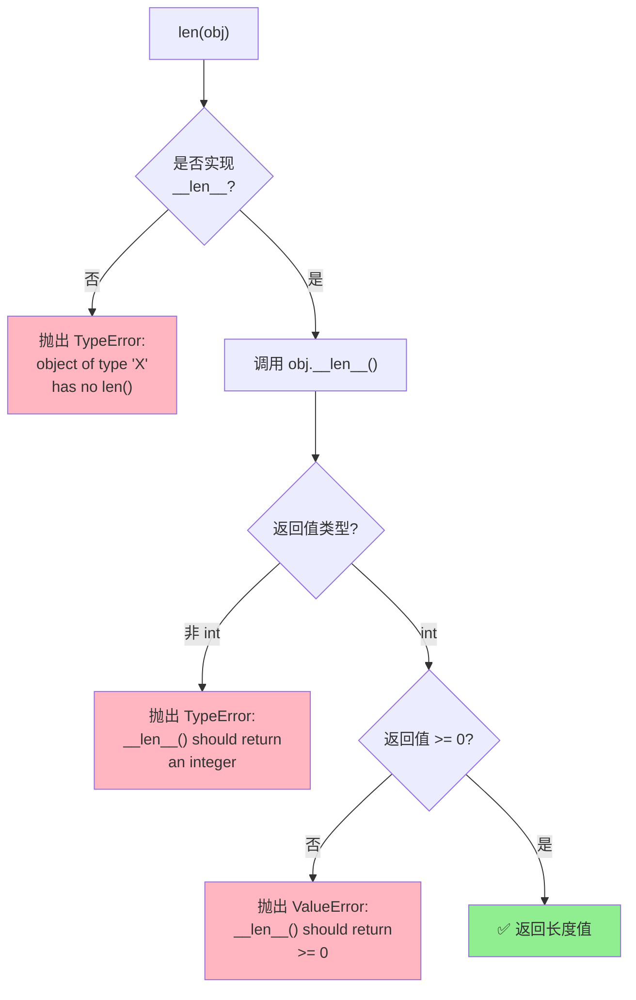
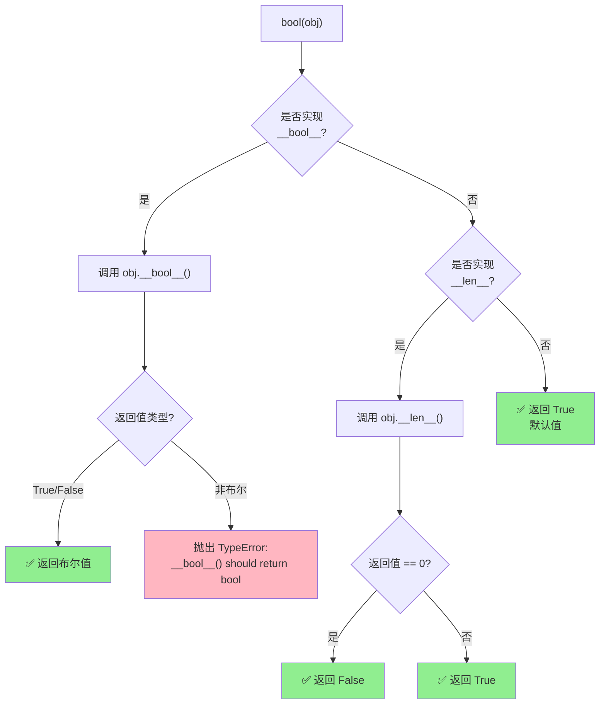
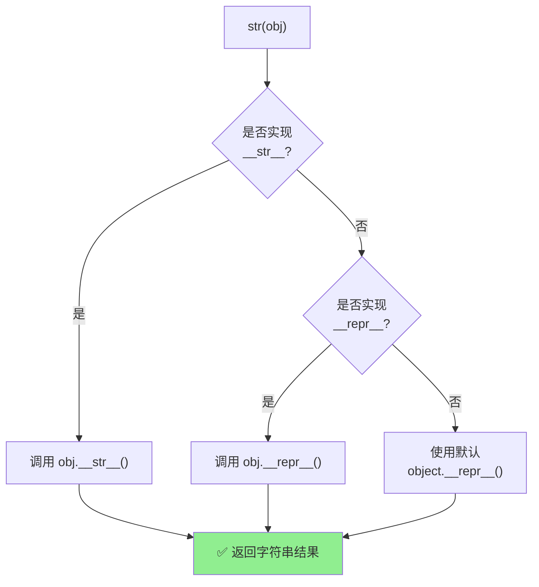
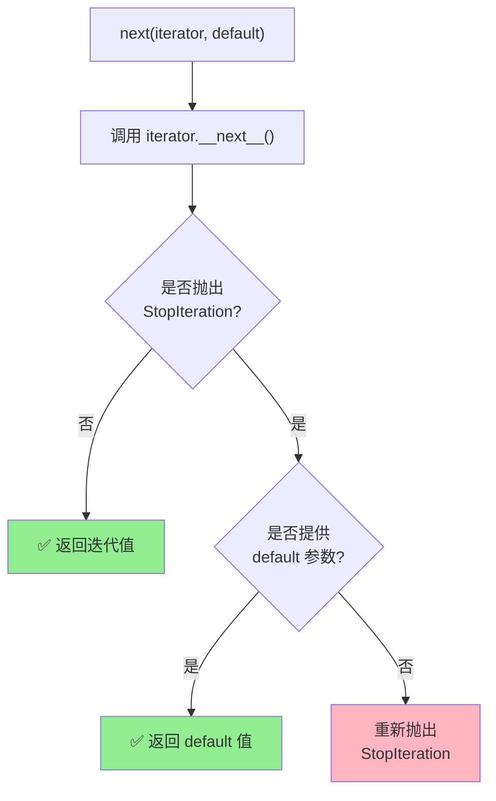

# P3H-Python魔术方法协议-为什么内置函数必须依赖它们？直接调用会踩哪些坑？怎么写出兼容代码？

> **摘要**：本文解释 Python 内置函数与魔术方法的关系，说明为什么应该使用内置函数而不是直接调用魔术方法，以及两者的区别和利弊。

> 假如面试官问你"你知道 `len()` 函数内部是怎么工作的吗？"，
> 再问你"为什么我们不能直接调用 `obj.__len__()` 呢？"，
> 还问你"直接调用魔术方法和使用内置函数有什么区别？"，
> 你会如何回答？
> 本文档能让你深入理解 Python 内置函数与魔术方法的关系，掌握为什么应该使用内置函数而不是直接调用魔术方法，以及两者的区别和利弊，写出更加健壮和兼容的代码。

## 📑 目录

- [📚 基础概念：内置函数与魔术方法](#-基础概念内置函数与魔术方法)
- [🧠 原理速查：内置函数到魔术方法的委派](#-原理速查内置函数到魔术方法的委派)
  - [📋 内置函数与魔术方法映射表](#-内置函数与魔术方法映射表)
  - [📝 本文档的讲解范围说明](#-本文档的讲解范围说明)
  - [委派流程图](#委派流程图)
  - [💭 从流程图中我们发现了什么？](#-从流程图中我们发现了什么)
- [🆚 直接调用魔术方法 vs 内置函数](#-直接调用魔术方法-vs-内置函数)

## 📚 基础概念：内置函数与魔术方法 🔥 必须掌握

在深入委派机制之前，让我们先明确两个核心概念：

**🔧 内置函数（Built-in Functions）**：Python 解释器提供的、无需导入即可直接使用的函数，如 `len()`、`str()`、`bool()`、`next()`、`iter()` 等。它们是 Python 的"公共接口"，为所有对象提供统一的操作方式。

**✨ 魔术方法（Magic Methods）**：也称为特殊方法或双下划线方法（Dunder Methods），以双下划线开头和结尾（如 `__len__`、`__str__`、`__bool__`、`__next__` 等）。它们定义在类内部，用于控制对象在特定操作下的行为。

**🔗 两者的关系**：内置函数是"调用者"，魔术方法是"被调用者"。当我们调用 `len(obj)` 时，Python 会在内部查找并调用 `obj.__len__()` 方法；当我们调用 `str(obj)` 时，Python 会调用 `obj.__str__()` 或 `obj.__repr__()`。这种机制让自定义类能够"告诉"内置函数如何处理自己。

**⚖️ 核心区别**：
- **内置函数**：面向用户，提供统一、安全的调用接口，包含类型检查、异常处理、回退机制等保护措施
- **魔术方法**：面向实现，定义对象的具体行为，是类与 Python 协议交互的"钩子"

**🦆 鸭子类型（Duck Typing）**：Python 的一种编程风格，核心思想是"如果它走起来像鸭子、游泳起来像鸭子、叫起来也像鸭子，那么它就是鸭子"。在代码中，这意味着我们关注的是对象的行为（是否实现了某个方法），而不是对象的类型（是否继承自某个类或实现了某个接口）。

例如，只要一个对象实现了 `__len__()` 方法，我们就可以对它使用 `len()` 函数，无需关心它是什么类型；只要实现了 `__iter__()` 方法，它就可以被 `for` 循环遍历。这种设计让代码更加灵活和简洁，也是 Python 协议机制的核心思想。

简单来说，**内置函数是"做什么"（What），魔术方法是"怎么做"（How）**。通过实现相应的魔术方法，我们的自定义类就能与 Python 的内置功能无缝协作，实现"鸭子类型"的优雅设计——只要行为符合协议，就能享受内置函数的便利。

### 💻 代码示例：自定义类与内置函数的协作 🔥 必须掌握

让我们通过一个实际的例子来理解内置函数与魔术方法的关系：

```python
# 定义一个自定义类，实现 __len__() 魔术方法
class MyList:
    """自定义列表类，演示魔术方法的使用"""
    def __init__(self, items):
        self.items = items  # 存储实际数据
    
    def __len__(self):
        """实现 __len__() 方法，返回列表长度"""
        return len(self.items)  # 返回内部列表的长度

# 创建自定义列表对象
my_list = MyList([1, 2, 3, 4, 5])

# ✅ 正确做法：使用内置函数 len()
print(len(my_list))  # 输出: 5

# ❌ 不推荐：直接调用魔术方法（仅用于调试）
print(my_list.__len__())  # 输出: 5（虽然结果相同，但绕过了安全检查）
```

**输出结果**：
```
5
5
```

**对比说明**：
- **使用 `len(my_list)`**：Python 会先检查对象是否实现了 `__len__()` 方法，然后验证返回值是否为非负整数，最后返回结果。如果对象没有实现 `__len__()`，会抛出清晰的 `TypeError`（类型错误）。
- **直接调用 `my_list.__len__()`**：绕过了所有安全检查，如果方法不存在会直接抛出 `AttributeError`（属性错误），错误信息不够友好。

让我们再看一个更复杂的例子，展示直接调用魔术方法可能带来的问题：

```python
class BadLength:
    """一个故意实现错误的 __len__() 方法的类"""
    def __len__(self):
        return -1  # 返回负数，这是不合法的

bad = BadLength()

# ✅ 使用内置函数：会自动检查并抛出错误
try:
    print(len(bad))
except ValueError as e:
    print(f"内置函数捕获错误: {e}")
# 输出: 内置函数捕获错误: __len__() should return >= 0

# ❌ 直接调用魔术方法：不会检查，可能造成后续逻辑错误
print(bad.__len__())  # 输出: -1（没有检查，可能导致后续代码出错）
```

**输出结果**：
```
内置函数捕获错误: __len__() should return >= 0
-1
```

这个例子清楚地展示了内置函数的安全检查机制：它会验证返回值是否符合规范，而直接调用魔术方法则跳过了这些检查，可能导致难以发现的 Bug。

## 🧠 原理速查：内置函数到魔术方法的委派 🔥 必须掌握

### 📋 内置函数与魔术方法映射表 ⭐ 应该掌握

Python 中常见的内置函数与魔术方法的对应关系如下：

| 类别 | 内置函数/操作符 | 对应魔术方法 | 说明 |
|------|----------------|-------------|------|
| **长度与表示** | `len(obj)` | `__len__()` | 返回对象长度 |
| | `str(obj)` | `__str__()` → `__repr__()` | 字符串表示 |
| | `repr(obj)` | `__repr__()` | 开发者表示 |
| | `format(obj, spec)` | `__format__()` | 格式化输出 |
| | `hash(obj)` | `__hash__()` | 哈希值 |
| | `bool(obj)` | `__bool__()` → `__len__()` | 布尔值 |
| **迭代相关** | `iter(obj)` | `__iter__()` → `__getitem__()` | 获取迭代器 |
| | `next(iterator)` | `__next__()` | 获取下一个元素 |
| | `reversed(obj)` | `__reversed__()` → `__getitem__()` | 反向迭代 |
| | `obj in container` | `__contains__()` → `__iter__()` | 成员检查 |
| **数值转换** | `int(obj)` | `__int__()` | 整数转换 |
| | `float(obj)` | `__float__()` | 浮点数转换 |
| | `complex(obj)` | `__complex__()` | 复数转换 |
| | `abs(obj)` | `__abs__()` | 绝对值 |
| | `round(obj, n)` | `__round__()` | 四舍五入 |
| **比较与排序** | `sorted(iterable)` | `__lt__()` 等比较方法 | 排序 |
| | `min(iterable)` | `__lt__()` | 最小值 |
| | `max(iterable)` | `__lt__()` | 最大值 |
| **上下文管理** | `with obj:` | `__enter__()` / `__exit__()` | 上下文管理器 |
| **属性访问** | `dir(obj)` | `__dir__()` | 属性列表 |
| | `getattr(obj, name)` | `__getattribute__()` / `__getattr__()` | 属性获取 |
| | `setattr(obj, name, value)` | `__setattr__()` | 属性设置 |
| | `delattr(obj, name)` | `__delattr__()` | 属性删除 |
| **调用** | `obj()` | `__call__()` | 可调用对象 |

> 📌 **完整参考**：更多映射关系请参考 [Python 官方文档 - 数据模型](https://docs.python.org/3/reference/datamodel.html#special-method-names)

### 📝 本文档的讲解范围说明 💡 可以了解

> 💡 **重要说明**：上表展示了 Python 中常见的内置函数与魔术方法的对应关系。**本文档将重点以 `len()`、`bool()`、`str()` 和 `next()` 这四个函数作为典型示例**，通过详细的流程图深入讲解它们的委派机制、安全检查、回退策略等核心概念。
>
> **选择这四个函数的原因**：
> - **`len()`**：展示了类型检查和值验证机制（返回值必须是整数且非负）
> - **`bool()`**：展示了智能回退机制（`__bool__` → `__len__` → 默认 `True`）
> - **`str()`**：展示了优先级回退机制（`__str__` → `__repr__` → 默认实现）
> - **`next()`**：展示了异常处理和默认值机制（自动捕获 `StopIteration`）
>
> 理解了这四个典型示例后，其他内置函数的委派机制遵循相同的设计原则，读者可以举一反三，或查阅官方文档了解具体细节。

### 委派流程图 🔥 必须掌握

现在让我们通过流程图来理解内置函数是如何委派到魔术方法的：

#### len() 的委派流程 🔥 必须掌握



#### bool() 的委派流程 🔥 必须掌握



#### str() 的委派流程 🔥 必须掌握



#### next() 的委派流程 🔥 必须掌握



### 💭 从流程图中我们发现了什么？ 🔥 必须掌握

通过上面的四个流程图，我们可以清晰地看到：**内置函数并不是简单地"转发"到魔术方法，而是做了大量额外的工作**。这些工作正是我们为什么应该使用内置函数而不是直接调用魔术方法的核心原因：

1. **🔍 安全检查与验证**：`len()` 会检查返回值是否为整数、是否非负；`bool()` 会验证 `__bool__()` 返回的是真正的布尔值。如果我们直接调用 `obj.__len__()`，即使返回了负数或字符串，也不会被拦截，可能导致后续逻辑错误。

2. **🔄 智能回退机制**：`bool()` 在 `__bool__` 不存在时会自动回退到 `__len__`；`str()` 在 `__str__` 不存在时会回退到 `__repr__`。这种"优雅降级"让我们的代码更加健壮，但直接调用 `obj.__bool__()` 或 `obj.__str__()` 时，如果方法不存在就会直接报错，无法享受这种回退机制。

3. **🛡️ 异常处理与容错**：`next()` 会自动捕获 `StopIteration`（停止迭代异常），并根据是否提供 `default` 参数来决定返回默认值还是重新抛出异常。如果我们直接调用 `iterator.__next__()`，就必须自己手动处理 `StopIteration`，代码会变得冗长且容易遗漏。

4. **📝 友好的错误信息**：当协议缺失时，内置函数会抛出清晰的错误信息，比如 `TypeError`（类型错误）: object of type 'X' has no len()，这些错误信息会明确指出是哪个内置函数、哪个协议缺失。而直接调用魔术方法时，如果方法不存在，只会得到通用的 `AttributeError`（属性错误），调试起来更困难。

5. **🔗 协议一致性**：内置函数是 Python 协议的"标准入口"，它们确保了所有对象都遵循相同的调用约定。直接调用魔术方法会绕过这些约定，可能导致代码在不同场景下表现不一致。

> 💡 **关键洞察**：内置函数是"协议的门卫"，它们不仅负责调用魔术方法，更重要的是**验证、保护、回退和标准化**。直接调用魔术方法就像绕过安检直接进入，虽然看起来"更快"，但实际上失去了所有保护机制，风险远大于收益。

因此，**在业务代码中，我们应该始终使用内置函数**（`len()`、`bool()`、`str()`、`next()` 等），只有在调试、测试或特殊场景下才考虑直接调用魔术方法。这样既能保证代码的健壮性和可维护性，又能让团队遵循统一的编码规范。

### 💻 代码示例：深入理解内置函数的保护机制 🔥 必须掌握

让我们通过具体的代码示例来验证上述五个核心特性：

#### 示例 1：len() 的类型检查与验证

```python
class InvalidLength:
    """演示 len() 的类型检查机制"""
    def __len__(self):
        return "invalid"  # 返回字符串，而不是整数

invalid = InvalidLength()

# ✅ 使用内置函数：会自动检查返回值类型
try:
    print(len(invalid))
except TypeError as e:
    print(f"内置函数捕获类型错误: {e}")
# 输出: 内置函数捕获类型错误: __len__() should return an integer

# ❌ 直接调用：不会检查类型
print(invalid.__len__())  # 输出: invalid（没有类型检查）
```

**输出结果**：
```
内置函数捕获类型错误: __len__() should return an integer
invalid
```

#### 示例 2：bool() 的智能回退机制

```python
class SmartBool:
    """演示 bool() 的回退机制"""
    def __init__(self, items):
        self.items = items
    
    # 注意：这个类没有实现 __bool__() 方法
    def __len__(self):
        """只实现了 __len__() 方法"""
        return len(self.items)

# 创建对象
empty = SmartBool([])      # 空列表
non_empty = SmartBool([1])  # 非空列表

# ✅ 使用内置函数 bool()：会自动回退到 __len__()
print(bool(empty))      # 输出: False（因为 __len__() 返回 0）
print(bool(non_empty))  # 输出: True（因为 __len__() 返回 1）

# ❌ 直接调用 __bool__()：方法不存在，会报错
try:
    print(empty.__bool__())
except AttributeError as e:
    print(f"直接调用失败: {e}")
# 输出: 直接调用失败: 'SmartBool' object has no attribute '__bool__'
```

**输出结果**：
```
False
True
直接调用失败: 'SmartBool' object has no attribute '__bool__'
```

#### 示例 3：str() 的优先级回退机制

```python
class SmartString:
    """演示 str() 的回退机制"""
    def __init__(self, name):
        self.name = name
    
    # 只实现 __repr__()，不实现 __str__()
    def __repr__(self):
        return f"SmartString('{self.name}')"

obj = SmartString("Python")

# ✅ 使用内置函数 str()：会自动回退到 __repr__()
print(str(obj))  # 输出: SmartString('Python')

# ❌ 直接调用 __str__()：方法不存在，会报错
try:
    print(obj.__str__())
except AttributeError as e:
    print(f"直接调用失败: {e}")
# 输出: 直接调用失败: 'SmartString' object has no attribute '__str__'

# 但是，如果直接调用 __repr__()，可以工作（但不推荐）
print(obj.__repr__())  # 输出: SmartString('Python')
```

**输出结果**：
```
SmartString('Python')
直接调用失败: 'SmartString' object has no attribute '__str__'
SmartString('Python')
```

#### 示例 4：next() 的异常处理与默认值

```python
class SimpleIterator:
    """简单的迭代器类"""
    def __init__(self, data):
        self.data = data
        self.index = 0
    
    def __iter__(self):
        return self
    
    def __next__(self):
        if self.index >= len(self.data):
            raise StopIteration  # 抛出 StopIteration 异常
        value = self.data[self.index]
        self.index += 1
        return value

# 创建迭代器
iterator = SimpleIterator([1, 2, 3])

# ✅ 使用内置函数 next()：自动处理 StopIteration，支持默认值
print(next(iterator))        # 输出: 1
print(next(iterator))        # 输出: 2
print(next(iterator))        # 输出: 3
print(next(iterator, None))  # 输出: None（提供默认值，不会抛出异常）

# ❌ 直接调用 __next__()：需要手动处理异常
iterator2 = SimpleIterator([1, 2])
print(iterator2.__next__())  # 输出: 1
print(iterator2.__next__())  # 输出: 2
try:
    print(iterator2.__next__())  # 会抛出 StopIteration
except StopIteration:
    print("需要手动捕获 StopIteration 异常")
```

**输出结果**：
```
1
2
3
None
1
2
需要手动捕获 StopIteration 异常
```

这些示例清楚地展示了内置函数提供的保护机制：类型检查、智能回退、异常处理等，这些都是直接调用魔术方法所无法获得的。

🔬 **动手实践**：为了深入理解内置函数的保护机制，我建议你亲自运行上面的代码示例。首先，复制示例 1 的代码到 Python 解释器中，观察 `len()` 函数如何捕获类型错误；然后尝试修改 `InvalidLength` 类的 `__len__()` 方法，让它返回负数，看看会发生什么。接下来，运行示例 2 和示例 3，亲自验证 `bool()` 和 `str()` 的回退机制，你会发现即使没有实现 `__bool__()` 或 `__str__()` 方法，内置函数也能正常工作。最后，运行示例 4，对比使用 `next()` 函数和直接调用 `__next__()` 的区别，你会深刻体会到内置函数异常处理的便利性。通过这些实践，你将真正理解为什么内置函数是"协议的门卫"。

## 🆚 直接调用魔术方法 vs 内置函数 🔥 必须掌握

既然我们已经理解了内置函数是如何工作的，那么一个自然的问题就出现了：**为什么不能直接调用魔术方法？**

让我们先理解两者的本质区别：
- **内置函数**（如 `len()`、`bool()`）是 Python 提供的**公共接口**，它们会做安全检查、错误处理、fallback（回退机制）等额外工作
- **直接调用魔术方法**（如 `obj.__len__()`）是**绕过公共接口**，直接访问内部实现，跳过了所有保护机制

虽然有时候直接调用看起来"更直接"，但实际上会带来很多问题。让我们通过对比来理解：

| 场景 | 使用内置函数（推荐） | 直接调用魔术方法（仅限调试） |
| --- | --- | --- |
| 错误信息 | `len(obj)` 自动抛 `TypeError: object of type ... has no len()`，更易读 | `obj.__len__()` 报错位置指向我们自己的类，堆栈不友好 |
| 兼容性 | `iter(obj)`、`format(obj)` 会 fallback（回退）到序列协议或基类实现 | `obj.__iter__()` 要求对象显式实现，缺少时会直接 `AttributeError`（属性错误） |
| 安全性 | `next(obj, default)` 自动吞掉 `StopIteration`（停止迭代异常）并提供默认值 | `obj.__next__()` 需要我们自己包 `try/except` |
| 可维护性 | 任何阅读 Python 代码的人都熟悉内置函数调用方式 | 直接 `obj.__bool__()` 看起来像内部 API，容易让团队误以为可随时改签名 |
| 性能差异 | CPython 内置函数大都用 C 级别优化 | 直接调用魔术方法不会更快，反而可能跳过缓存/检查 |

**实践原则：**

1. **业务代码一律调用内置函数**，只在 REPL（交互式解释器，Read-Eval-Print Loop）或单元测试里直接访问双下划线，方便断言或调试；
2. **跨协议桥接时写适配器**，例如在数据库 ORM 中实现 `__len__` 返回查询结果数量，而不是到处 `query.__len__()`；
3. **文档/评审中解释 fallback（回退机制）**，例如告诉同事 `bool(obj)` 会回退到 `__len__`，让他们理解"为什么只实现一个方法也能控制真假"。

💬 **经验**：在我多年的 Python 开发实践中，我发现很多开发者（包括我自己早期）都曾犯过直接调用魔术方法的错误。最典型的场景是在自定义容器类中，为了"提高性能"而直接调用 `__len__()` 或 `__getitem__()`。但实际上，这种"优化"不仅没有带来性能提升，反而让代码失去了内置函数提供的安全检查，导致在生产环境中出现了难以调试的 Bug。例如，我曾经在一个项目中看到有人直接调用 `obj.__bool__()`，结果当对象没有实现 `__bool__()` 方法时，代码直接崩溃，而如果使用 `bool(obj)`，Python 会自动回退到 `__len__()`，代码依然能正常工作。这个经验让我深刻认识到，内置函数不仅仅是语法糖，更是 Python 协议机制的核心保障，我们应该始终信任并使用它们。

## 写在最后

通过本文的学习，我们深入理解了 Python 内置函数与魔术方法的关系，掌握了以下核心要点：

1. **内置函数是"协议的门卫"**：它们不仅负责调用魔术方法，更重要的是提供验证、保护、回退和标准化机制。
2. **直接调用魔术方法的风险**：会绕过所有安全检查，失去智能回退机制，可能导致难以发现的 Bug。
3. **最佳实践**：在业务代码中始终使用内置函数，只有在调试、测试或特殊场景下才考虑直接调用魔术方法。

理解这些概念不仅能帮助我们写出更加健壮和兼容的代码，更能让我们深入理解 Python 协议机制的设计哲学。Python 的"鸭子类型"和协议机制正是通过内置函数与魔术方法的协作来实现的，这种设计让代码更加灵活、优雅和易维护。

💪 **继续前行**：掌握了内置函数与魔术方法的关系后，你可以继续深入学习 Python 的其他协议机制，如迭代器协议、上下文管理器协议等。记住，理解原理比记住语法更重要，只有真正理解了 Python 的设计思想，才能写出真正优雅的代码。让我们一起在 Python 的世界里不断探索，写出更加优秀的代码！

---
**作者**：郑恩赐  
**机构**：厦门工学院人工智能创作坊  
**日期**：2025 年 11 月 19 日
