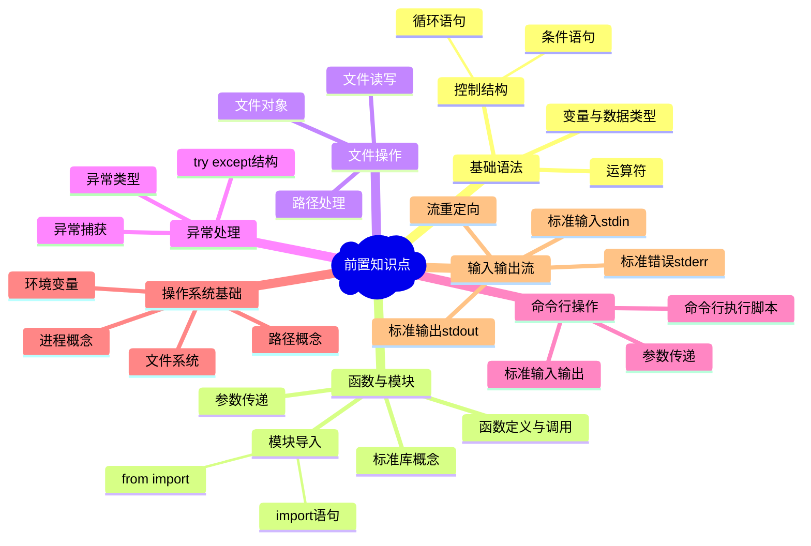

# P3H1-Python-sys模块完全指南-系统参数与命令行参数处理利器

## 📚 前置知识点

在深入学习本文档之前，建议您先掌握以下前置知识点。掌握了这些基础知识后，您将能够更高效地理解`sys`模块的功能和使用方法，并能够灵活运用`sys`模块解决实际问题。

### 前置知识点思维导图



**如果您对上述知识点还不熟悉，建议先进行相应的学习，以便更高效地使用本文档。**

---

## 💡 学习建议

本文档旨在帮助您了解 Python `sys` 模块的功能和使用方法。需要注意的是，在实际开发中，并非所有场景都需要使用 `sys` 模块。因此，建议您：

- **了解为主**：对 `sys` 模块的功能有一个大致的认识即可，无需深入掌握每个细节
- **按需学习**：在实际开发中遇到需要使用 `sys` 模块的场景时，再学习相应的函数和用法
- **灵活选择**：根据具体需求选择合适的工具，不必拘泥于使用 `sys` 模块

当您需要处理命令行参数、模块路径管理、标准输入输出流、程序退出控制、系统信息获取、性能分析等场景时，可以查找相应的解决方案和示例代码。

---

## 📝 摘要

sys模块是Python标准库中与解释器交互的核心模块，提供了访问系统参数、命令行参数、模块搜索路径等关键功能。掌握sys模块是编写专业Python程序的基础，特别是在处理命令行参数、模块管理和系统交互时不可或缺。

---

## 1. sys模块概述

### 1.1 什么是sys模块

**sys模块**是Python标准库中与解释器交互的核心模块，提供了访问和操作Python解释器运行时环境的功能。

**sys模块的核心特点：**

1. **标准库模块**：sys是Python内置的标准库，无需安装即可使用
2. **解释器交互**：提供与Python解释器直接交互的接口
3. **系统参数访问**：可以获取和修改解释器的系统参数
4. **命令行参数处理**：通过`sys.argv`处理命令行传入的参数
5. **模块路径管理**：通过`sys.path`管理模块的搜索路径
6. **标准流控制**：控制标准输入、输出和错误流（stdin/stdout/stderr）
7. **程序流程控制**：通过`sys.exit()`控制程序的退出
8. **系统信息获取**：获取Python版本、平台信息、解释器路径等

sys模块是编写专业Python程序的基础工具，特别是在开发命令行工具、系统脚本和需要与操作系统交互的程序时不可或缺。

### 1.2 sys模块的作用与应用场景

sys模块在实际开发中有广泛的应用场景，主要包括：

1. **命令行工具开发**：使用`sys.argv`处理命令行参数，开发CLI工具和脚本
2. **系统脚本编写**：通过`sys.exit()`控制程序退出状态，编写系统管理脚本
3. **模块动态加载**：利用`sys.path`动态添加模块搜索路径，实现插件系统
4. **日志和输出重定向**：通过`sys.stdout`/`sys.stderr`重定向输出到文件或自定义处理
5. **跨平台兼容性**：使用`sys.platform`检测操作系统，编写跨平台代码
6. **版本兼容性检查**：通过`sys.version`/`sys.version_info`检查Python版本要求
7. **内存优化和调试**：使用`sys.getsizeof()`和`sys.getrefcount()`进行内存分析和优化
8. **递归算法优化**：通过`sys.setrecursionlimit()`调整递归深度限制

## 2. 命令行参数处理（sys.argv）

### 2.1 sys.argv的基本概念

**sys.argv**是sys模块中用于获取命令行参数的列表，包含脚本运行时从命令行传入的所有参数。

**sys.argv的核心特点：**

1. **列表类型**：sys.argv是一个Python列表（list），可以通过索引访问各个元素
2. **自动填充**：由Python解释器在程序启动时自动创建和填充，无需手动初始化
3. **第一个元素**：`sys.argv[0]`是脚本的名称（可能是完整路径或相对路径）
4. **后续元素**：`sys.argv[1:]`是传递给脚本的命令行参数，按顺序排列
5. **字符串类型**：列表中的所有元素都是字符串类型，需要时需进行类型转换
6. **最小长度**：sys.argv的长度至少为1（至少包含脚本名称）
7. **参数分隔**：命令行参数以空格分隔，每个参数作为列表的一个元素
8. **只读性**：虽然可以修改，但通常只用于读取，不建议直接修改

sys.argv是处理命令行参数最基础、最直接的方式，适合简单的命令行工具和脚本。

### 2.2 sys.argv的使用方法

使用sys.argv处理命令行参数的基本方法：

1. **导入sys模块**：首先需要`import sys`导入sys模块
2. **获取脚本名称**：使用`sys.argv[0]`获取当前脚本的名称或路径
3. **获取参数列表**：使用`sys.argv[1:]`获取所有命令行参数（排除脚本名）
4. **检查参数数量**：使用`len(sys.argv)`检查参数总数，`len(sys.argv) - 1`获取实际参数个数
5. **索引访问**：通过`sys.argv[1]`、`sys.argv[2]`等按索引访问特定参数
6. **类型转换**：参数都是字符串类型，需要时使用`int()`、`float()`等进行类型转换
7. **参数验证**：在访问参数前检查`len(sys.argv) > 1`，避免IndexError异常
8. **遍历参数**：使用`for arg in sys.argv[1:]`遍历所有参数进行处理

> 参数来源提示：`sys.argv` 中的值全部来自运行脚本时命令行中紧跟脚本名输入的内容，例如执行 `python app.py foo bar` 时，`sys.argv` 将是 `['app.py', 'foo', 'bar']`。

**IDE运行与命令行运行的区别：**

正常情况下，如果使用代码编辑器（如PyCharm、VSCode等）运行代码，编辑器实际执行的命令类似：

```bash
C:\Python\python.exe C:\Users\YourName\Desktop\test1.py
```

在这种情况下，`sys.argv` 只包含脚本路径，没有额外参数：
- `sys.argv[0]` = `C:\Users\YourName\Desktop\test1.py`（脚本的完整路径）
- `len(sys.argv)` = 1（只有脚本名，没有参数）

如果你手动在控制台（命令行）输入命令并传递参数：

```bash
python test1.py arg1 arg2 arg3
```

那么 `sys.argv` 就会包含这些参数：
- `sys.argv[0]` = `test1.py`（或完整路径）
- `sys.argv[1]` = `arg1`
- `sys.argv[2]` = `arg2`
- `sys.argv[3]` = `arg3`
- `len(sys.argv)` = 4

**注意事项：**
- 在IDE中运行时，如果需要测试命令行参数，可以在IDE的运行配置中设置参数（如PyCharm的"Run/Debug Configurations"）
- 或者直接在命令行/终端中手动运行脚本并传递参数
- 开发时建议始终检查 `len(sys.argv) > 1`，避免在没有参数时访问 `sys.argv[1]` 导致IndexError

**基本示例：**

```python
import sys

# 获取脚本名称
script_name = sys.argv[0]
print(f"脚本名称: {script_name}")

# 检查是否有参数
if len(sys.argv) > 1:
    # 获取第一个参数
    first_arg = sys.argv[1]
    # 获取所有参数
    all_args = sys.argv[1:]
    print(f"参数列表: {all_args}")
else:
    print("没有提供参数")
```

### 2.3 sys.argv的应用场景

sys.argv在实际开发中有多种应用场景：

1. **文件处理脚本**：通过命令行参数传递文件路径，脚本根据路径读取或处理文件
2. **命令行工具开发**：创建接受参数的命令行工具，如文件转换、数据处理工具
3. **参数化脚本执行**：传递不同的参数值，使脚本在不同条件下执行不同任务
4. **自动化任务**：在批处理或定时任务中，通过参数控制脚本行为
5. **模式切换**：通过标志参数（如`--verbose`、`--debug`）控制脚本的运行模式
6. **批量处理**：传递多个文件路径或配置参数，实现批量操作
7. **配置传递**：通过命令行参数传递配置信息，如数据库连接、API密钥等
8. **脚本组合**：在shell脚本或批处理中调用Python脚本并传递参数，实现脚本间的协作

**特别适用于无界面系统或环境：**

sys.argv在**没有图形界面的系统或环境**中尤为重要，因为命令行是唯一的交互方式：

1. **服务器环境**：在Linux/Unix服务器上运行的脚本，通过命令行参数接收配置和执行指令
2. **远程管理**：通过SSH连接远程服务器执行脚本时，命令行参数是传递配置的主要方式
3. **容器化应用**：在Docker等容器环境中，应用启动时通过命令行参数进行配置
4. **系统服务**：作为系统服务运行的后台程序，通过启动参数控制服务行为
5. **嵌入式系统**：在资源受限的嵌入式设备中，命令行参数是配置程序的主要方式
6. **定时任务**：在cron等定时任务系统中，通过命令行参数传递不同的执行参数
7. **批处理环境**：在Windows批处理或Linux shell脚本中，通过参数调用Python脚本
8. **CI/CD流水线**：在持续集成/部署环境中，通过命令行参数传递构建和部署配置

**典型应用示例：**

- **文件处理**：`python process.py input.txt output.txt`
- **模式选择**：`python script.py --mode production`
- **批量操作**：`python batch.py file1.txt file2.txt file3.txt`
- **配置传递**：`python app.py --host localhost --port 8080`
- **服务器环境**：`python backup.py --source /data --dest /backup`
- **容器启动**：`docker run myapp python app.py --config /etc/config.json`

## 3. 模块搜索路径管理（sys.path）

`sys.path` 决定了 Python 在执行 `import` 时**按照什么顺序去哪些目录找模块**。它不仅影响模块能否被找到，还会影响**导入到哪一个版本、是否出现命名冲突、甚至是否暴露安全风险**。通常情况下，路径列表由以下几部分组成：

- 当前脚本所在目录或当前工作目录
- 标准库与动态扩展库目录
- `site-packages`（全局与用户级第三方包）
- 由环境变量 `PYTHONPATH`、`.pth` 文件或启动参数动态注入的路径

**`.pth` 文件是什么？**  
它是保存于 `site-packages` 目录下的纯文本文件（文件名以 `.pth` 结尾），Python 启动时会逐行读取其中的路径，并自动追加到 `sys.path`。这样无需改代码或环境变量，就能在多个项目或机器间共享同一套内部库，适合企业/团队级别的路径分发。

理解搜索路径能够帮助我们：

1. **定位导入异常**：快速判断 `ModuleNotFoundError` 是否由路径缺失引起
2. **控制模块版本**：同名模块位于不同目录时，通过路径顺序决定优先级
3. **隔离运行环境**：结合虚拟环境、自定义路径，实现项目级依赖管理
4. **降低安全风险**：避免将不可信目录加入 `sys.path`，防止被恶意模块劫持

本章将分别介绍 sys.path 的构成、查看方式、修改方案以及典型应用场景，帮助你在复杂项目中稳健管理模块搜索路径。

### 3.1 sys.path的基本概念

**sys.path**是sys模块中用于管理Python模块搜索路径的列表，决定了Python解释器在导入模块时搜索的目录顺序。

**sys.path的核心特点：**

1. **列表类型**：sys.path是一个Python列表，可以通过列表操作进行修改
2. **搜索顺序**：Python按照列表中的路径顺序依次搜索模块，找到即停止
3. **默认路径**：包含当前目录、标准库目录、site-packages等默认搜索路径
4. **可修改性**：可以在运行时动态添加、删除或修改路径
5. **初始化来源**：由PYTHONPATH环境变量、site模块和解释器默认路径初始化
6. **路径格式**：列表中的元素是字符串类型的目录路径（绝对路径或相对路径）
7. **当前目录优先**：通常第一个元素是空字符串`''`，表示当前工作目录
8. **标准库路径**：包含Python标准库的安装目录，用于导入内置模块

sys.path是Python模块导入机制的核心，理解其工作原理对于模块管理和动态导入至关重要。

**查看sys.path列表内容：**

```python
import sys

# 方法1：直接打印整个列表
print(sys.path)

# 方法2：遍历打印每个路径
for path in sys.path:
    print(path)

# 方法3：带索引打印
for i, path in enumerate(sys.path):
    print(f"{i}: {path}")
```

**示例输出：**

```text
# 方法1：列表形式输出
['', '/usr/lib/python3.10', '/usr/lib/python3.10/lib-dynload', '/usr/local/lib/python3.10/site-packages', '/usr/lib/python3/dist-packages']

# 方法2：逐行输出
/home/user/project
/usr/lib/python3.10
/usr/lib/python3.10/lib-dynload
/usr/local/lib/python3.10/site-packages
/usr/lib/python3/dist-packages

# 方法3：带索引输出
0: /home/user/project
1: /usr/lib/python3.10
2: /usr/lib/python3.10/lib-dynload
3: /usr/local/lib/python3.10/site-packages
4: /usr/lib/python3/dist-packages
```

**典型的sys.path列表内容示例：**

在Windows系统上，典型的`sys.path`可能包含：

```python
[
    '',  # 空字符串，表示当前工作目录
    'C:\\Python\\python39.zip',
    'C:\\Python\\DLLs',
    'C:\\Python\\lib',
    'C:\\Python\\lib\\site-packages',
    'C:\\Users\\YourName\\AppData\\Roaming\\Python\\Python39\\site-packages'
]
```

在Linux/macOS系统上，典型的`sys.path`可能包含：

```python
[
    '',  # 空字符串，表示当前工作目录
    '/usr/lib/python3.9',
    '/usr/lib/python3.9/lib-dynload',
    '/usr/local/lib/python3.9/dist-packages',
    '/usr/lib/python3/dist-packages'
]
```

**列表元素说明：**

1. **空字符串`''`**：表示当前工作目录，优先级最高
2. **Python标准库路径**：包含内置模块和标准库（如`lib`、`DLLs`目录）
3. **site-packages路径**：第三方库的安装目录
4. **用户site-packages**：用户级别的第三方库目录
5. **PYTHONPATH路径**：如果设置了PYTHONPATH环境变量，其路径也会包含在内

### 3.2 查看和修改sys.path

在日常开发中，最常见的需求是**临时或永久性地调整模块搜索路径**。下面列出了 8 项高频操作及示例，帮助你在不同场景下灵活管理 `sys.path`。

1. **追加搜索路径（append）**

   ```python
   import sys
   sys.path.append('/path/to/custom/modules')
   ```

   将路径追加到列表末尾，适用于一次性导入不常用的目录。

2. **提升优先级（insert）**

   ```python
   import sys
   sys.path.insert(0, '/path/to/project/src')
   ```

   将路径插入到索引 0，可保证该目录优先于标准库与第三方包。

3. **删除无效路径（remove）**

   ```python
   import sys
   invalid_path = '/tmp/old_lib'
   if invalid_path in sys.path:
       sys.path.remove(invalid_path)
   ```

   清理失效路径，避免导入到错误版本的模块。

4. **临时修改并恢复**

   ```python
   import sys
   original_paths = sys.path.copy()
   sys.path.insert(0, '/path/to/test/modules')
   # ... 执行测试代码 ...
   sys.path = original_paths  # 恢复原始顺序
   ```

   在测试或脚本中临时覆写路径时，应记得恢复，防止影响后续逻辑。

5. **使用 `site.addsitedir` 读取目录与 .pth 文件**

   ```python
   import site
   site.addsitedir('/opt/app/common_libs')
   ```

   该方法会自动解析目录中的 `.pth` 文件，适合需要批量加入路径的场景。

6. **依赖环境变量 `PYTHONPATH`**

   - Linux/macOS：`export PYTHONPATH=/path/to/lib:$PYTHONPATH`
   - Windows：`set PYTHONPATH=C:\path\to\lib;%PYTHONPATH%`

   适用于需要在多个项目或终端会话中共享路径配置的情况。

7. **通过 `.pth` 文件持久化配置**

   在 `site-packages` 目录新建 `custom_paths.pth`，写入要添加的绝对路径（每行一个）。解释器启动时会自动加载，适合团队级别的统一路径。

8. **确保路径类型正确**

   ```python
   from pathlib import Path
   import sys
   extra_path = Path(__file__).parent.parent  # 以当前文件为基准回到上级目录
   sys.path.append(str(extra_path))  # 必须转换为字符串
   ```

   `sys.path` 只接受字符串路径，记得把 `Path` 对象转换为 `str`，否则会出现 `ModuleNotFoundError`。

> **温馨提醒：** 调整 `sys.path` 会改变模块加载顺序，务必只添加可信目录，并定期审查是否存在过期或潜在风险路径。

## 4. 标准输入输出流（sys.stdin/stdout/stderr）

标准输入输出流是程序与外部环境进行数据交互的基本通道，提供了统一的输入输出接口。Python通过`sys.stdin`、`sys.stdout`和`sys.stderr`三个文件对象来访问这些流，它们分别对应：

- **标准输入流（stdin）**：用于从外部接收数据，默认连接到键盘或终端输入
- **标准输出流（stdout）**：用于向外部发送正常输出，默认连接到显示器或终端
- **标准错误流（stderr）**：用于输出错误信息和诊断消息，默认也连接到显示器，但与stdout分离

**标准流的作用和影响：**

1. **统一接口**：提供与具体设备无关的输入输出方式，增强程序可移植性
2. **重定向支持**：可以通过重定向将输入输出转向文件或其他程序，实现灵活的数据处理
3. **错误分离**：stderr与stdout分开，便于区分正常输出和错误信息，方便日志记录和调试
4. **管道操作**：支持命令行管道，实现程序间的数据流式传输

理解标准流有助于编写更灵活、可移植的程序，特别是在命令行工具、脚本自动化和日志处理等场景中。

### 4.1 标准输入流（sys.stdin）

**sys.stdin**是sys模块中用于读取标准输入的文件对象，提供了从键盘、文件重定向或管道接收数据的能力。

**sys.stdin的核心特点：**

1. **文件对象接口**：sys.stdin是一个文件对象，支持`read()`、`readline()`、`readlines()`等方法
2. **逐行读取**：使用`readline()`可以逐行读取输入，适合处理多行文本
3. **循环读取**：可以像文件一样在循环中迭代，自动处理EOF（文件结束符）。EOF（End Of File）表示输入流的结束，在交互式输入中通常通过Ctrl+D（Unix/Linux）或Ctrl+Z（Windows）触发
4. **去除换行符**：读取的内容通常包含换行符，需要使用`strip()`或`rstrip()`去除
5. **重定向支持**：支持从文件重定向输入（`python script.py < input.txt`）
6. **管道输入**：支持从其他程序的输出接收数据（`echo "data" | python script.py`）
7. **与input()的区别**：sys.stdin更底层，适合批量处理和自动化场景
8. **编码处理**：默认使用系统编码，可通过`encoding`参数指定编码方式

**基本使用方法：**

```python
import sys

# 方法1：读取单行输入
line = sys.stdin.readline().strip()
print(f"输入内容: {line}")

# 方法2：循环读取多行（直到EOF）
for line in sys.stdin:
    print(f"处理: {line.strip()}")

# 方法3：一次性读取所有输入
content = sys.stdin.read()
print(f"全部内容:\n{content}")

# 方法4：读取所有行到列表
lines = sys.stdin.readlines()
for line in lines:
    print(f"行: {line.strip()}")
```

**典型应用场景：**

- **批量数据处理**：从文件重定向读取大量数据
- **管道操作**：接收其他程序的输出作为输入
- **交互式脚本**：在命令行环境中接收用户输入
- **日志处理**：逐行处理日志文件内容

**Windows系统输入输出不一致的原因：**

在Windows系统上使用`sys.stdin.read()`时，如果出现输入输出不一致（部分输入未被读取），通常由以下原因导致：

1. **包含EOF的行不会被读取**：在PyCharm中，当在某一行的中间或末尾按`Ctrl+D`时，该行会被当作EOF信号处理，导致包含`Ctrl+D`的那一行不会被读取到输入流中
2. **EOF信号的位置要求**：`Ctrl+D`必须在新的一行输入（单独一行），而不是在已有内容的行中，否则该行会被丢弃
3. **行缓冲处理机制**：终端在处理EOF信号时，如果EOF字符出现在行中间，整行可能被当作控制信号处理而非数据
4. **部分数据丢失**：当EOF信号与数据在同一行时，该行的数据会被丢弃，只有EOF之前的行被读取
5. **终端模拟器行为**：PyCharm的终端模拟器在处理EOF时，会将包含EOF字符的行视为控制信号，不将其作为输入数据
6. **输入缓冲区刷新**：当检测到EOF时，当前行的缓冲区可能被清空，导致该行数据丢失
7. **EOF信号优先级**：EOF信号的处理优先级高于普通输入，导致包含EOF的行被特殊处理
8. **跨平台行为差异**：不同终端环境对EOF在同一行的处理方式不同，PyCharm的行为可能与标准终端不同

**解决方案：**

- **EOF必须单独一行**：在PyCharm中使用`Ctrl+D`时，必须在新的空行按`Ctrl+D`，不要在有内容的行中按`Ctrl+D`
- **使用文件重定向（推荐）**：将输入保存到文件，通过`python script.py < input.txt`从文件读取，这是最可靠的方法
- **使用input()替代**：对于交互式输入，建议使用`input()`逐行读取，避免EOF处理问题
- **避免在行中按EOF**：如果必须使用`sys.stdin.read()`，确保EOF信号在单独的新行，不要与数据在同一行

### 4.2 标准输出流（sys.stdout）

**sys.stdout**是sys模块中用于写入标准输出的文件对象，默认将输出发送到控制台或终端。

**sys.stdout的核心特点：**

1. **文件对象接口**：sys.stdout是一个文件对象，支持`write()`、`flush()`等方法
2. **print()的底层实现**：`print()`函数实际上是对`sys.stdout.write()`的封装，默认输出到sys.stdout
3. **不自动换行**：`sys.stdout.write()`不会自动添加换行符，需要手动添加`\n`
4. **可重定向**：可以将`sys.stdout`重定向到文件或其他流对象，实现输出捕获
5. **缓冲区控制**：使用`flush()`方法可以强制刷新输出缓冲区，确保内容立即显示
6. **文本模式**：sys.stdout以文本模式打开，支持字符串的写入操作
7. **恢复机制**：重定向后可以通过`sys.__stdout__`恢复原始的标准输出
8. **编码支持**：默认使用系统编码，可通过`encoding`参数指定编码方式

**基本使用方法：**

```python
import sys
import time

# 方法1：直接写入输出
# sys.stdout.write() 直接向标准输出写入字符串
# 注意：不会自动添加换行符，需要手动添加 \n
sys.stdout.write('Hello, World!\n')

# 方法2：重定向到文件
# 通过修改 sys.stdout 的指向，将输出重定向到文件
with open('output.txt', 'w') as f:
    # 保存原始的 sys.stdout，以便后续恢复
    original_stdout = sys.stdout
    # 将 sys.stdout 重定向到文件对象 f
    sys.stdout = f
    # 此时 print() 的输出会写入文件，而不是控制台
    print('这行文字将被写入文件')
    # 恢复原始的标准输出，确保后续输出正常显示在控制台
    sys.stdout = original_stdout  # 恢复标准输出

# 方法3：刷新缓冲区（实时输出）
# 使用 \r 将光标移到行首，实现同一行的实时更新
# flush() 强制刷新缓冲区，确保输出立即显示
for i in range(5):
    # \r 表示回车符，将光标移到行首，覆盖之前的输出
    sys.stdout.write(f'\r进度: {i+1}/5')
    # flush() 强制刷新输出缓冲区，确保内容立即显示在控制台
    sys.stdout.flush()  # 立即显示
    # 模拟耗时操作
    time.sleep(1)

# 方法4：捕获输出（用于测试）
# 使用 io.StringIO 创建一个内存中的字符串缓冲区
# 将 sys.stdout 重定向到该缓冲区，从而捕获所有输出
import io
# 创建 StringIO 对象，用于在内存中存储字符串
output = io.StringIO()
# 保存原始的 sys.stdout，以便后续恢复
original_stdout = sys.stdout
# 将 sys.stdout 重定向到 StringIO 对象
sys.stdout = output
# 此时 print() 的输出会被写入 StringIO 对象，而不是控制台
print('这行文字将被捕获')
# 恢复原始的标准输出（或使用 sys.stdout = sys.__stdout__）
sys.stdout = original_stdout
# 获取 StringIO 对象中捕获的所有输出内容
captured = output.getvalue()
```

**典型应用场景：**

- **输出重定向**：将程序输出保存到文件，便于日志记录
- **实时进度显示**：使用`\r`和`flush()`实现进度条或实时更新
- **输出捕获**：在测试中捕获程序输出进行验证
- **日志记录**：自定义日志输出格式和目的地

### 4.3 标准错误流（sys.stderr）

**sys.stderr**是sys模块中用于写入标准错误输出的文件对象，专门用于输出错误信息、警告和诊断消息，与标准输出流分离。

**sys.stderr的核心特点：**

1. **文件对象接口**：sys.stderr是一个文件对象，支持`write()`、`flush()`等方法，与sys.stdout接口相同
2. **错误信息专用**：专门用于输出错误、警告和诊断信息，与正常输出分离
3. **不自动换行**：`sys.stderr.write()`不会自动添加换行符，需要手动添加`\n`
4. **可重定向**：可以将`sys.stderr`重定向到文件或其他流对象，实现错误日志记录
5. **缓冲区控制**：使用`flush()`方法可以强制刷新错误输出缓冲区，确保错误信息立即显示
6. **与stdout分离**：stderr和stdout是独立的流，可以分别重定向，便于区分正常输出和错误信息
7. **恢复机制**：重定向后可以通过`sys.__stderr__`或保存的引用恢复原始的标准错误流
8. **编码支持**：默认使用系统编码，可通过`encoding`参数指定编码方式

**基本使用方法：**

```python
import sys

# 方法1：直接写入错误信息
# sys.stderr.write() 直接向标准错误流写入字符串
# 注意：不会自动添加换行符，需要手动添加 \n
sys.stderr.write('错误：文件未找到\n')

# 运行效果：
# 错误：文件未找到
# （输出到标准错误流，通常显示在控制台，但可以通过重定向分离）

# 方法2：使用print()重定向到stderr
# print() 函数的 file 参数可以指定输出目标
# 将错误信息输出到标准错误流，而不是标准输出
print('警告：内存使用率过高', file=sys.stderr)

# 运行效果：
# 警告：内存使用率过高
# （输出到标准错误流，与标准输出分离）

# 方法3：重定向到文件（错误日志记录）
# 注意：这是示例代码，仅用于演示原理，正常开发中不会直接修改 sys.stderr
# 直接修改 sys.stderr 在异常发生时可能无法正确恢复，存在风险
with open('error.log', 'w') as f:
    # 保存原始的 sys.stderr，以便后续恢复
    original_stderr = sys.stderr
    # 将 sys.stderr 重定向到文件对象 f
    sys.stderr = f
    # 此时所有错误信息会写入文件，而不是控制台
    print('错误：连接数据库失败', file=sys.stderr)
    # 恢复原始的标准错误流，确保后续错误信息正常显示
    sys.stderr = original_stderr  # 恢复标准错误流

# 运行效果：
# 控制台无输出（错误信息已写入文件）
# error.log 文件内容：
# 错误：连接数据库失败

# 方法4：在异常处理中使用
# 在异常处理块中，将错误信息输出到 stderr
try:
    result = 10 / 0
except ZeroDivisionError as e:
    # 将异常信息输出到标准错误流
    print(f'错误：{e}', file=sys.stderr)
    # 或使用 sys.stderr.write()
    sys.stderr.write(f'错误详情：除零操作\n')

# 运行效果：
# 错误：division by zero
# 错误详情：除零操作
# （两条错误信息都输出到标准错误流）
```

**典型应用场景：**

- **错误日志记录**：将程序运行中的错误信息输出到stderr，便于记录和调试
- **调试信息输出**：在开发和测试阶段，使用stderr输出调试信息，不影响正常输出
- **错误与输出分离**：在需要分别处理正常输出和错误信息的场景中，使用stderr实现分离
- **异常信息记录**：在异常处理中将错误信息输出到stderr，便于问题追踪和分析

### 4.4 重定向标准输入输出

**重定向标准输入输出**是指将程序的输入输出流从默认的终端/控制台转向文件或其他流对象，实现数据的灵活处理和日志记录。

**重定向的核心特点：**

1. **输入重定向**：将`sys.stdin`重定向到文件，程序从文件读取数据而非键盘输入
2. **输出重定向**：将`sys.stdout`重定向到文件，程序输出写入文件而非控制台
3. **错误重定向**：将`sys.stderr`重定向到文件，错误信息写入日志文件
4. **命令行重定向**：使用`<`、`>`、`2>`等符号在命令行层面进行重定向
5. **程序内重定向**：在代码中修改`sys.stdin`/`stdout`/`stderr`的指向实现重定向
6. **分离重定向**：stdout和stderr可以分别重定向到不同文件，实现输出分离
7. **恢复机制**：重定向后需要恢复原始流，确保后续操作正常
8. **管道操作**：通过管道（`|`）将前一个程序的输出作为后一个程序的输入

**基本使用方法：**

```python
import sys

# 方法1：重定向标准输入（从文件读取）
# 将 sys.stdin 重定向到文件，程序从文件读取数据
with open('input.txt', 'r') as f:
    # 保存原始的 sys.stdin，以便后续恢复
    original_stdin = sys.stdin
    # 将 sys.stdin 重定向到文件对象 f
    sys.stdin = f
    # 此时 input() 和 sys.stdin.read() 会从文件读取
    data = sys.stdin.read()
    print(f"从文件读取的内容：\n{data}")
    # 恢复原始的标准输入
    sys.stdin = original_stdin  # 恢复标准输入

# 运行效果：
# 从文件读取的内容：
# （显示 input.txt 文件的内容）

# 方法2：重定向标准输出（写入文件）
# 将 sys.stdout 重定向到文件，程序输出写入文件
with open('output.txt', 'w') as f:
    # 保存原始的 sys.stdout，以便后续恢复
    original_stdout = sys.stdout
    # 将 sys.stdout 重定向到文件对象 f
    sys.stdout = f
    # 此时 print() 的输出会写入文件
    print('这行文字将被写入文件')
    print('另一行文字')
    # 恢复原始的标准输出
    sys.stdout = original_stdout  # 恢复标准输出

# 运行效果：
# 控制台无输出（输出已写入文件）
# output.txt 文件内容：
# 这行文字将被写入文件
# 另一行文字

# 方法3：同时重定向stdout和stderr（输出分离）
# 将正常输出和错误输出分别重定向到不同文件
with open('output.txt', 'w') as f_out, open('error.log', 'w') as f_err:
    # 保存原始的流
    original_stdout = sys.stdout
    original_stderr = sys.stderr
    # 分别重定向
    sys.stdout = f_out
    sys.stderr = f_err
    # 正常输出写入 output.txt
    print('这是正常输出')
    # 错误输出写入 error.log
    print('这是错误信息', file=sys.stderr)
    # 恢复原始流
    sys.stdout = original_stdout
    sys.stderr = original_stderr

# 运行效果：
# 控制台无输出
# output.txt 文件内容：
# 这是正常输出
# error.log 文件内容：
# 这是错误信息

# 方法4：命令行重定向（在运行脚本时使用）
# 命令行示例：
# python script.py < input.txt          # 输入重定向
# python script.py > output.txt         # 输出重定向
# python script.py 2> error.log         # 错误重定向
# python script.py < input.txt > output.txt  # 同时重定向输入输出
# python script1.py | python script2.py     # 管道操作

# 示例代码（配合命令行重定向使用）：
import sys
# 从标准输入读取（命令行：python script.py < input.txt）
for line in sys.stdin:
    # 处理每一行
    processed = line.strip().upper()
    # 输出到标准输出（命令行：python script.py > output.txt）
    print(processed)

# 运行效果（命令行：python script.py < input.txt > output.txt）：
# 控制台无输出
# output.txt 文件内容：
# （显示处理后的 input.txt 内容，每行转为大写）
```

**典型应用场景：**

- **日志记录**：将程序输出和错误信息重定向到日志文件，便于问题追踪
- **批量数据处理**：从文件读取输入，处理后将结果写入文件，实现自动化处理
- **程序间通信**：通过管道将多个程序连接，实现数据流式传输和处理
- **测试和调试**：重定向输入输出，模拟不同场景，便于自动化测试

## 5. 程序退出控制（sys.exit）

程序退出控制是Python程序管理执行流程的重要机制。`sys.exit()`提供了优雅终止程序的方式，允许程序在完成任务后正常退出，或在遇到错误时以指定的状态码退出。与直接使用`exit()`或`quit()`不同，`sys.exit()`是标准库的一部分，适用于所有Python环境，是生产代码中终止程序的推荐方式。

**程序退出控制的作用和影响：**

1. **正常退出**：程序完成任务后，通过`sys.exit(0)`表示成功执行并正常退出
2. **错误退出**：程序遇到错误时，通过`sys.exit(非0)`表示异常终止，便于调用者判断执行结果
3. **状态码传递**：退出状态码可以传递给调用程序（如shell脚本），用于流程控制和错误处理
4. **异常机制**：`sys.exit()`通过引发`SystemExit`异常来终止程序，可以被`try-except`捕获进行清理
5. **清理执行**：与`os._exit()`不同，`sys.exit()`会执行`finally`块和清理函数，确保资源正确释放
6. **跨平台兼容**：`sys.exit()`在所有Python环境中可用，不依赖`site`模块，适合生产环境
7. **流程控制**：在条件满足时提前退出，避免不必要的代码执行，提高程序效率
8. **脚本集成**：在shell脚本、批处理或自动化工具中，通过退出状态码判断程序执行结果

理解程序退出控制有助于编写更健壮、更易集成的Python程序，特别是在系统脚本、命令行工具和自动化任务中。

### 5.1 sys.exit()的基本用法

**sys.exit()** 是sys模块中用于终止程序执行的函数，通过引发`SystemExit`异常来实现程序的优雅退出。

**sys.exit()的核心特点：**

1. **函数调用**：`sys.exit()`是一个函数，需要先导入sys模块才能使用
2. **可选参数**：可以传递一个整数参数作为退出状态码，默认为0（正常退出）
3. **异常机制**：通过引发`SystemExit`异常来终止程序，可以被try-except捕获
4. **立即终止**：调用后程序立即终止，后续代码不会执行
5. **清理执行**：会执行finally块和atexit注册的清理函数，确保资源正确释放
6. **跨平台兼容**：在所有Python环境中可用，不依赖site模块
7. **状态码传递**：退出状态码会传递给调用程序（如shell脚本），用于判断执行结果
8. **线程限制**：在多线程程序中，只退出调用该函数的线程，不会终止整个程序

**基本使用方法：**

```python
import sys

# 方法1：正常退出（状态码0）
# 程序成功完成任务后正常退出
print('程序开始执行')
# 执行主要逻辑...
print('任务完成')
sys.exit(0)  # 正常退出，返回状态码0

# 运行效果：
# 程序开始执行
# 任务完成
# （程序正常退出，状态码0）

# 方法2：异常退出（非0状态码）
# 程序遇到错误时以非0状态码退出
if error_condition:
    print('发生错误，程序即将退出')
    sys.exit(1)  # 异常退出，返回状态码1

# 运行效果：
# 发生错误，程序即将退出
# （程序异常退出，状态码1）

# 方法3：无参数调用（默认状态码0）
# 不传递参数时，默认使用状态码0
sys.exit()  # 等同于 sys.exit(0)

# 方法4：传递字符串参数
# 可以传递字符串作为错误消息，但会被转换为状态码
sys.exit('错误信息')  # 会打印错误信息并退出，状态码为1

# 运行效果：
# 错误信息
# （程序退出，状态码为1，字符串会被打印到stderr）
```

**典型应用场景：**

- **条件退出**：在满足特定条件时提前退出程序，避免不必要的执行
- **错误处理**：在捕获到严重错误时，以非0状态码退出，便于调用者判断
- **脚本集成**：在shell脚本或批处理中，通过退出状态码控制流程
- **资源清理**：在退出前执行清理操作，确保资源正确释放

### 5.2 退出状态码的含义

**退出状态码**是程序退出时传递给操作系统的整数值，用于表示程序的执行结果，便于调用程序判断执行是否成功。

**退出状态码的核心特点：**

1. **整数类型**：退出状态码必须是整数，可以是0或任何非0整数
2. **约定俗成**：0表示成功，非0表示失败，这是Unix/Linux系统的通用约定
3. **状态码范围**：通常使用0-255之间的整数，超出范围可能被截断
4. **调用者判断**：shell脚本、批处理等调用程序通过状态码判断执行结果
5. **错误分类**：不同的非0状态码可以表示不同类型的错误
6. **流程控制**：在自动化脚本中，通过状态码控制后续流程的执行
7. **日志记录**：退出状态码可以记录在日志中，便于问题追踪和分析
8. **跨平台差异**：不同操作系统对状态码的处理可能略有差异

**常见退出状态码：**

```python
import sys

# 状态码0：正常退出（成功）
sys.exit(0)  # 程序成功执行完成

# 状态码1：一般错误
sys.exit(1)  # 通用错误，未分类的错误

# 状态码2：误用shell命令
sys.exit(2)  # 命令使用错误，参数错误等

# 状态码126：命令不可执行
sys.exit(126)  # 权限不足，无法执行

# 状态码127：命令未找到
sys.exit(127)  # 找不到命令或脚本

# 状态码130：被Ctrl+C中断
sys.exit(130)  # 程序被用户中断（SIGINT）

# 自定义状态码：根据业务需求定义
sys.exit(10)  # 文件未找到
sys.exit(20)  # 网络连接失败
sys.exit(30)  # 数据库连接失败
```

**典型应用场景：**

- **成功判断**：调用程序通过检查状态码是否为0判断程序是否成功执行
- **错误分类**：使用不同的非0状态码表示不同类型的错误，便于错误处理
- **脚本控制**：在shell脚本中使用`if [ $? -eq 0 ]`判断上一条命令是否成功
- **自动化测试**：测试框架通过检查退出状态码判断测试是否通过

### 5.3 sys.exit()与异常处理的区别

**sys.exit()与异常处理**在程序终止机制上存在重要区别，理解这些区别有助于正确选择程序终止方式。

**sys.exit()与异常处理的核心区别：**

1. **退出方式**：`sys.exit()`通过引发`SystemExit`异常退出，普通异常通过`raise`引发
2. **可捕获性**：`SystemExit`异常可以被try-except捕获，允许执行清理操作
3. **清理执行**：`sys.exit()`会执行finally块和清理函数，普通异常也会执行finally块
4. **状态码传递**：`sys.exit()`可以将状态码传递给操作系统，普通异常不能
5. **设计目的**：`sys.exit()`用于正常或预期的程序终止，异常用于错误处理
6. **调用者感知**：`sys.exit()`的状态码可被调用程序感知，异常通常需要特殊处理
7. **使用场景**：`sys.exit()`适合脚本和命令行工具，异常适合库函数和模块
8. **错误处理**：异常可以传递错误信息，`sys.exit()`主要通过状态码表示结果

**基本使用方法：**

```python
import sys

# 方法1：sys.exit()可以被捕获
# sys.exit()引发SystemExit异常，可以被try-except捕获
try:
    print('程序开始')
    sys.exit(1)  # 引发SystemExit异常
    print('这行不会执行')
except SystemExit as e:
    print(f'捕获到SystemExit异常，状态码：{e.code}')
    # 可以执行清理操作
    # 如果不重新raise，程序不会退出

# 运行效果：
# 程序开始
# 捕获到SystemExit异常，状态码：1
# （如果捕获后不重新raise，程序会继续执行）

# 方法2：sys.exit()与finally块
# sys.exit()会执行finally块中的清理代码
try:
    print('程序开始')
    sys.exit(0)
finally:
    print('清理操作：关闭文件、释放资源等')
    # finally块会执行，确保资源清理

# 运行效果：
# 程序开始
# 清理操作：关闭文件、释放资源等
# （程序退出，状态码0）

# 方法3：异常处理用于错误处理
# 使用异常处理错误情况，而不是直接退出
try:
    result = 10 / 0
except ZeroDivisionError as e:
    print(f'发生错误：{e}')
    # 可以选择继续执行或调用sys.exit()
    sys.exit(1)  # 错误严重时退出

# 方法4：sys.exit() vs raise SystemExit
# 两者功能相同，但sys.exit()更明确表达退出意图
sys.exit(1)  # 推荐：明确表示程序退出
raise SystemExit(1)  # 功能相同，但不常用
```

**典型应用场景：**

- **正常退出**：程序完成任务后使用`sys.exit(0)`正常退出
- **错误退出**：遇到无法恢复的错误时使用`sys.exit(非0)`退出
- **清理操作**：在try-finally中确保资源清理，即使调用了`sys.exit()`
- **异常捕获**：捕获`SystemExit`异常执行特定清理，或阻止程序退出

## 6. 系统信息获取

系统信息获取是Python程序了解运行环境的重要途径。通过`sys`模块提供的系统信息属性，程序可以获取Python版本、操作系统平台、解释器路径、字节序等关键信息，实现版本兼容性检查、跨平台适配和运行时环境判断等功能。

**系统信息获取的作用和影响：**

1. **版本兼容性**：通过检查Python版本，确保程序在特定版本上运行，避免兼容性问题
2. **跨平台适配**：根据操作系统平台信息，执行平台特定的代码，实现跨平台兼容
3. **环境检测**：检测虚拟环境、解释器路径等信息，判断程序的运行环境
4. **数据格式处理**：根据系统字节序，正确处理二进制数据和网络协议
5. **功能选择**：根据系统信息选择合适的功能实现，优化程序性能
6. **错误诊断**：在错误报告中包含系统信息，便于问题定位和调试
7. **条件编译**：根据平台信息条件性地编译或执行代码，提高代码可维护性
8. **资源管理**：根据系统特性合理分配和管理系统资源

理解系统信息获取有助于编写更健壮、更兼容的Python程序，特别是在跨平台开发和版本兼容性处理中。

### 6.1 Python版本信息（sys.version和sys.version_info）

**sys.version和sys.version_info**是sys模块中用于获取Python解释器版本信息的属性，提供了详细的版本号、编译信息等。

**Python版本信息的核心特点：**

1. **sys.version**：返回包含版本信息的字符串，包括版本号、编译日期、编译器信息等
2. **sys.version_info**：返回包含版本信息的命名元组，便于程序化比较和判断
3. **版本号组成**：主版本号（major）、次版本号（minor）、微版本号（micro）
4. **发布级别**：alpha、beta、candidate、final等发布级别信息
5. **序列号**：发布序列号，用于区分同一版本的不同发布
6. **可比较性**：sys.version_info支持直接比较，便于版本检查
7. **详细编译信息**：sys.version包含编译器、编译日期等详细信息
8. **运行时获取**：在程序运行时动态获取，无需硬编码版本信息

**基本使用方法：**

```python
import sys

# 方法1：获取版本字符串（sys.version）
# sys.version 返回包含完整版本信息的字符串
print(sys.version)

# 运行效果：
# 3.9.1 (default, Dec  8 2020, 07:51:42) 
# [GCC 8.3.0]

# 方法2：获取版本信息元组（sys.version_info）
# sys.version_info 返回命名元组，便于程序化处理
version = sys.version_info
print(f"主版本号: {version.major}")
print(f"次版本号: {version.minor}")
print(f"微版本号: {version.micro}")
print(f"发布级别: {version.releaselevel}")
print(f"序列号: {version.serial}")

# 运行效果：
# 主版本号: 3
# 次版本号: 9
# 微版本号: 1
# 发布级别: final
# 序列号: 0

# 方法3：版本比较和兼容性检查
# sys.version_info 支持直接比较，便于版本检查
if sys.version_info >= (3, 8):
    print("Python 3.8 或更高版本")
    # 使用 3.8+ 的特性
else:
    print("需要 Python 3.8 或更高版本")
    sys.exit(1)

# 运行效果（Python 3.9）：
# Python 3.8 或更高版本

# 方法4：检查特定版本
# 使用元组比较检查特定版本要求
if sys.version_info < (3, 7):
    print("警告：建议使用 Python 3.7 或更高版本")
elif sys.version_info >= (3, 10):
    print("使用 Python 3.10+ 的新特性")
else:
    print("Python 版本符合要求")

# 运行效果（Python 3.9）：
# Python 版本符合要求
```

**典型应用场景：**

- **版本兼容性检查**：在程序启动时检查Python版本，确保满足最低版本要求
- **功能选择**：根据Python版本选择使用新特性或兼容旧版本的实现
- **错误报告**：在错误信息中包含Python版本，便于问题诊断
- **条件导入**：根据版本信息条件性地导入模块或使用特定功能

### 6.2 操作系统平台信息（sys.platform）

**sys.platform**是sys模块中用于获取当前运行的操作系统平台标识符的字符串属性，用于跨平台代码的条件判断。

**操作系统平台信息的核心特点：**

1. **字符串标识符**：返回表示平台的字符串，如'win32'、'linux'、'darwin'等
2. **平台识别**：可以准确识别Windows、Linux、macOS等主流操作系统
3. **跨平台判断**：通过平台字符串判断当前运行环境，执行平台特定代码
4. **大小写敏感**：平台字符串区分大小写，比较时需注意
5. **详细程度**：不同平台返回的详细程度不同，Windows返回'win32'而非具体版本
6. **稳定性**：平台标识符在程序运行期间保持不变
7. **条件编译**：根据平台信息条件性地编译或执行代码
8. **功能适配**：根据平台特性选择合适的功能实现

**基本使用方法：**

```python
import sys

# 方法1：获取平台标识符
# sys.platform 返回当前运行平台的字符串标识符
platform = sys.platform
print(f"当前运行平台: {platform}")

# 运行效果（Windows）：
# 当前运行平台: win32
# 运行效果（Linux）：
# 当前运行平台: linux
# 运行效果（macOS）：
# 当前运行平台: darwin

# 方法2：平台条件判断
# 根据平台信息执行不同的代码
if sys.platform == 'win32':
    print("Windows 系统")
    # Windows 特定代码
elif sys.platform.startswith('linux'):
    print("Linux 系统")
    # Linux 特定代码
elif sys.platform == 'darwin':
    print("macOS 系统")
    # macOS 特定代码
else:
    print(f"未知平台: {sys.platform}")

# 运行效果（Windows）：
# Windows 系统

# 方法3：平台特定功能选择
# 根据平台选择合适的功能实现
if sys.platform == 'win32':
    # Windows 特定的系统调用
    import ctypes
    # Windows 代码
elif sys.platform.startswith('linux'):
    # Linux 特定的系统调用
    import fcntl
    # Linux 代码
```

**常见平台标识符：**

- **'win32'**：Windows系统（包括32位和64位）
- **'linux'**：Linux系统
- **'darwin'**：macOS系统
- **'cygwin'**：Cygwin环境
- **'freebsd'**：FreeBSD系统

**典型应用场景：**

- **跨平台适配**：根据平台执行不同的代码路径，实现跨平台兼容
- **路径处理**：根据平台使用正确的路径分隔符和路径格式
- **系统调用**：根据平台选择合适的系统调用和API
- **功能选择**：根据平台特性选择合适的功能实现

### 6.3 Python解释器路径（sys.executable）

**sys.executable**是sys模块中用于获取当前Python解释器的可执行文件路径的字符串属性，用于确定解释器的位置。

**Python解释器路径的核心特点：**

1. **绝对路径**：返回解释器可执行文件的绝对路径，而非相对路径
2. **可执行文件**：指向实际运行的Python解释器程序（如python.exe、python3等）
3. **虚拟环境支持**：在虚拟环境中返回虚拟环境的解释器路径
4. **跨平台兼容**：在不同操作系统上返回正确的路径格式
5. **运行时获取**：在程序运行时动态获取，反映实际使用的解释器
6. **子进程启动**：可用于启动子进程时指定解释器路径
7. **环境检测**：通过路径判断是否在虚拟环境中运行
8. **脚本路径**：可用于构建相对于解释器的脚本路径

**基本使用方法：**

```python
import sys
import os

# 方法1：获取解释器路径
# sys.executable 返回当前Python解释器的可执行文件路径
interpreter_path = sys.executable
print(f"Python解释器路径: {interpreter_path}")

# 运行效果（Windows）：
# Python解释器路径: C:\Python\python.exe
# 运行效果（Linux）：
# Python解释器路径: /usr/bin/python3
# 运行效果（虚拟环境）：
# Python解释器路径: /path/to/venv/bin/python

# 方法2：检测虚拟环境
# 通过解释器路径判断是否在虚拟环境中
if 'venv' in sys.executable or 'virtualenv' in sys.executable:
    print("运行在虚拟环境中")
else:
    print("运行在系统Python环境中")

# 运行效果（虚拟环境）：
# 运行在虚拟环境中

# 方法3：启动子进程
# 使用解释器路径启动子进程
import subprocess
script_path = 'script.py'
result = subprocess.run([sys.executable, script_path], capture_output=True)
print(result.stdout.decode())

# 运行效果：
# （执行script.py并捕获输出）

# 方法4：获取解释器目录
# 从解释器路径获取解释器所在目录
interpreter_dir = os.path.dirname(sys.executable)
print(f"解释器目录: {interpreter_dir}")

# 运行效果（Windows）：
# 解释器目录: C:\Python
```

**典型应用场景：**

- **子进程启动**：使用相同的解释器启动子进程，确保版本一致性
- **虚拟环境检测**：判断程序是否在虚拟环境中运行
- **脚本路径构建**：构建相对于解释器的脚本或资源路径
- **环境报告**：在错误报告或日志中包含解释器路径信息

### 6.4 系统字节序（sys.byteorder）

**sys.byteorder**是sys模块中用于获取系统字节序（字节顺序）的字符串属性，用于处理二进制数据和网络协议。

**系统字节序的核心特点：**

1. **字符串值**：返回'big'（大端序）或'little'（小端序）字符串
2. **字节顺序**：表示多字节数据在内存中的存储顺序
3. **平台相关**：不同平台的字节序可能不同，x86/x64通常为小端序
4. **数据交换**：在网络传输和文件格式中需要考虑字节序
5. **二进制处理**：处理二进制数据时需要了解系统字节序
6. **网络字节序**：网络协议通常使用大端序（网络字节序）
7. **数据转换**：在不同字节序之间转换数据时需要使用
8. **跨平台兼容**：处理跨平台数据交换时需要考虑字节序差异

**基本使用方法：**

```python
import sys

# 方法1：获取系统字节序
# sys.byteorder 返回 'big' 或 'little'
byteorder = sys.byteorder
print(f"系统字节序: {byteorder}")

# 运行效果（x86/x64）：
# 系统字节序: little
# 运行效果（某些平台）：
# 系统字节序: big

# 方法2：字节序判断
# 根据字节序执行不同的处理逻辑
if sys.byteorder == 'little':
    print("小端序系统：低字节在前")
    # 小端序特定处理
else:
    print("大端序系统：高字节在前")
    # 大端序特定处理

# 运行效果（x86/x64）：
# 小端序系统：低字节在前

# 方法3：网络字节序转换
# 网络协议使用大端序，需要转换
import struct
value = 0x12345678

# 转换为网络字节序（大端序）
network_bytes = struct.pack('>I', value)  # '>' 表示大端序
print(f"网络字节序: {network_bytes.hex()}")

# 从网络字节序转换回本地字节序
local_value = struct.unpack('>I', network_bytes)[0]
print(f"本地值: {hex(local_value)}")

# 运行效果：
# 网络字节序: 12345678
# 本地值: 0x12345678

# 方法4：二进制文件处理
# 读取二进制文件时需要考虑字节序
import struct
# 假设从文件读取4字节整数（大端序）
data = b'\x12\x34\x56\x78'
if sys.byteorder == 'little':
    # 需要转换字节序
    value = struct.unpack('>I', data)[0]  # 大端序读取
else:
    # 直接读取
    value = struct.unpack('I', data)[0]
print(f"读取的值: {hex(value)}")

# 运行效果（小端序系统）：
# 读取的值: 0x12345678
```

**典型应用场景：**

- **网络编程**：处理网络协议时进行字节序转换（网络字节序通常为大端序）
- **二进制文件**：读取或写入二进制文件时正确处理字节序
- **数据交换**：在不同字节序的系统间交换数据时进行转换
- **底层编程**：进行底层系统编程时需要考虑字节序影响

## 7. 内存与性能管理

内存与性能管理是Python程序优化的重要方面。通过`sys`模块提供的内存管理工具，可以获取对象的内存占用、引用计数等信息，帮助开发者进行性能分析和内存优化，提高程序的运行效率和资源利用率。

**内存与性能管理的作用和影响：**

1. **内存分析**：通过获取对象大小，分析程序的内存占用情况，找出内存消耗大的对象
2. **性能优化**：识别内存占用大的数据结构，优化算法和数据结构选择
3. **引用计数**：了解对象的引用计数，检测潜在的内存泄漏和循环引用
4. **资源监控**：监控程序运行时的内存使用情况，及时发现内存问题
5. **调试辅助**：在调试过程中分析对象的内存占用和引用关系
6. **容量规划**：根据内存占用情况，合理规划系统资源
7. **性能对比**：对比不同实现方式的内存占用，选择最优方案
8. **内存泄漏检测**：通过引用计数检测未释放的对象，发现内存泄漏

理解内存与性能管理有助于编写更高效、更节省资源的Python程序，特别是在处理大量数据和高性能场景中。

### 7.1 获取对象内存大小（sys.getsizeof）

**sys.getsizeof**是sys模块中用于获取对象内存占用大小的函数，返回对象占用的字节数。

**sys.getsizeof的核心特点：**

1. **字节单位**：返回对象占用的字节数，便于量化内存占用
2. **对象大小**：包括对象本身的大小，不包括引用对象的大小
3. **递归计算**：可以递归计算容器对象的总大小（需要手动实现）
4. **类型相关**：不同数据类型的对象大小不同，取决于类型和内容
5. **平台相关**：不同平台上的对象大小可能略有差异
6. **动态对象**：对于列表、字典等动态对象，大小会随内容变化
7. **最小大小**：每个对象都有最小内存占用，即使为空也有开销
8. **内存对齐**：实际内存占用可能因内存对齐而略大于计算值

**基本使用方法：**

```python
import sys

# 方法1：获取基本对象的大小
# sys.getsizeof() 返回对象占用的字节数
size_int = sys.getsizeof(42)
size_str = sys.getsizeof("Hello")
size_list = sys.getsizeof([1, 2, 3])
print(f"整数大小: {size_int} 字节")
print(f"字符串大小: {size_str} 字节")
print(f"列表大小: {size_list} 字节")

# 运行效果：
# 整数大小: 28 字节
# 字符串大小: 54 字节
# 列表大小: 88 字节

# 方法2：比较不同数据结构的内存占用
# 比较列表和元组的内存占用
list_obj = [1, 2, 3, 4, 5]
tuple_obj = (1, 2, 3, 4, 5)
print(f"列表大小: {sys.getsizeof(list_obj)} 字节")
print(f"元组大小: {sys.getsizeof(tuple_obj)} 字节")

# 运行效果：
# 列表大小: 104 字节
# 元组大小: 80 字节
# （元组通常比列表占用更少内存）

# 方法3：递归计算容器对象的总大小
# 计算包含嵌套对象的容器总大小
def total_size(obj):
    """递归计算对象及其所有引用对象的总大小"""
    size = sys.getsizeof(obj)
    if isinstance(obj, dict):
        size += sum(total_size(k) + total_size(v) for k, v in obj.items())
    elif isinstance(obj, (list, tuple, set)):
        size += sum(total_size(item) for item in obj)
    return size

nested_dict = {'a': [1, 2, 3], 'b': {'x': 1, 'y': 2}}
print(f"嵌套字典总大小: {total_size(nested_dict)} 字节")

# 运行效果：
# 嵌套字典总大小: （包含所有嵌套对象的总字节数）

# 方法4：内存优化分析
# 分析不同实现方式的内存占用
# 方式1：使用列表存储
list_data = [i for i in range(1000)]
size_list = sys.getsizeof(list_data)

# 方式2：使用生成器（不占用额外内存）
def gen_data():
    for i in range(1000):
        yield i
gen = gen_data()
size_gen = sys.getsizeof(gen)

print(f"列表大小: {size_list} 字节")
print(f"生成器大小: {size_gen} 字节")

# 运行效果：
# 列表大小: 8856 字节
# 生成器大小: 120 字节
# （生成器占用内存远小于列表）
```

**典型应用场景：**

- **内存分析**：分析程序的内存占用，找出内存消耗大的对象
- **性能优化**：对比不同数据结构的内存占用，选择最优方案
- **容量规划**：根据内存占用情况，规划系统资源需求
- **调试辅助**：在调试过程中分析对象的内存占用情况

### 7.2 获取对象引用计数（sys.getrefcount）

**sys.getrefcount**是sys模块中用于获取对象引用计数的函数，返回指向该对象的引用数量。

**sys.getrefcount的核心特点：**

1. **引用计数**：返回指向对象的引用数量，包括临时引用
2. **临时引用**：函数调用会创建临时引用，返回值通常比实际引用多1
3. **垃圾回收**：当引用计数为0时，对象会被垃圾回收器回收
4. **循环引用**：无法通过引用计数检测循环引用，需要其他机制
5. **调试工具**：用于调试内存泄漏和对象生命周期问题
6. **性能影响**：频繁调用可能影响性能，主要用于调试
7. **不可变对象**：对于小整数、字符串等，可能有多个引用指向同一对象
8. **对象共享**：Python会共享某些不可变对象，减少内存占用

**基本使用方法：**

```python
import sys

# 方法1：获取基本对象的引用计数
# sys.getrefcount() 返回对象的引用计数
obj = [1, 2, 3]
ref_count = sys.getrefcount(obj)
print(f"对象引用计数: {ref_count}")

# 运行效果：
# 对象引用计数: 2
# （包括obj变量和getrefcount函数的临时引用）

# 方法2：观察引用计数的变化
# 创建对象并观察引用计数的变化
obj = []
print(f"初始引用计数: {sys.getrefcount(obj)}")  # 2

ref1 = obj
print(f"添加引用后: {sys.getrefcount(obj)}")  # 3

ref2 = obj
print(f"再添加引用后: {sys.getrefcount(obj)}")  # 4

del ref1
print(f"删除引用后: {sys.getrefcount(obj)}")  # 3

# 运行效果：
# 初始引用计数: 2
# 添加引用后: 3
# 再添加引用后: 4
# 删除引用后: 3

# 方法3：检测循环引用
# 循环引用无法通过引用计数检测，需要其他方法
class Node:
    def __init__(self, value):
        self.value = value
        self.next = None

node1 = Node(1)
node2 = Node(2)
node1.next = node2
node2.next = node1  # 循环引用

print(f"node1引用计数: {sys.getrefcount(node1)}")
print(f"node2引用计数: {sys.getrefcount(node2)}")
# 循环引用不会导致引用计数异常，但会导致内存泄漏

# 运行效果：
# node1引用计数: 3
# node2引用计数: 3
# （循环引用需要垃圾回收器的循环检测机制处理）

# 方法4：不可变对象的引用共享
# Python会共享小整数和短字符串
a = 100
b = 100
print(f"整数100的引用计数: {sys.getrefcount(100)}")
# 小整数会被缓存和共享

short_str = "hello"
print(f"短字符串的引用计数: {sys.getrefcount('hello')}")
# 短字符串也可能被共享

# 运行效果：
# 整数100的引用计数: （可能很大，因为被共享）
# 短字符串的引用计数: （可能较大，因为被共享）
```

**典型应用场景：**

- **内存泄漏检测**：检测未释放的对象，发现潜在的内存泄漏
- **对象生命周期**：了解对象的引用关系，分析对象生命周期
- **调试辅助**：在调试过程中分析对象的引用计数
- **性能分析**：分析对象引用关系对性能的影响

### 7.3 内存优化的实践技巧

**内存优化实践技巧**是通过合理使用内存管理工具和优化策略，减少程序的内存占用，提高运行效率。

**内存优化的核心技巧：**

1. **选择合适的数据结构**：根据需求选择内存占用小的数据结构（如元组替代列表）
2. **使用生成器**：对于大量数据，使用生成器而非列表，减少内存占用
3. **及时释放引用**：使用`del`删除不需要的引用，帮助垃圾回收
4. **避免循环引用**：避免创建循环引用，或使用`weakref`打破循环
5. **对象池化**：对于频繁创建的对象，使用对象池复用
6. **分块处理**：对于大数据，分块处理而非一次性加载
7. **使用`__slots__`**：对于类，使用`__slots__`减少内存占用
8. **监控内存使用**：使用`sys.getsizeof()`监控内存占用，及时发现问题

**基本使用方法：**

```python
import sys

# 技巧1：选择合适的数据结构
# 元组比列表占用更少内存
list_data = [1, 2, 3, 4, 5]
tuple_data = (1, 2, 3, 4, 5)
print(f"列表大小: {sys.getsizeof(list_data)} 字节")
print(f"元组大小: {sys.getsizeof(tuple_data)} 字节")

# 运行效果：
# 列表大小: 104 字节
# 元组大小: 80 字节

# 技巧2：使用生成器替代列表
# 生成器不存储所有数据，按需生成
def numbers_gen(n):
    for i in range(n):
        yield i

# 列表存储所有数据
numbers_list = list(range(1000))
# 生成器不存储数据
numbers_gen_obj = numbers_gen(1000)

print(f"列表大小: {sys.getsizeof(numbers_list)} 字节")
print(f"生成器大小: {sys.getsizeof(numbers_gen_obj)} 字节")

# 运行效果：
# 列表大小: 8856 字节
# 生成器大小: 120 字节

# 技巧3：及时释放不需要的引用
# 使用del删除不需要的引用
large_data = list(range(1000000))
print(f"数据大小: {sys.getsizeof(large_data)} 字节")

# 不再需要时删除引用
del large_data
# 对象会被垃圾回收器回收

# 技巧4：使用__slots__减少类内存占用
# 普通类
class RegularClass:
    def __init__(self, x, y):
        self.x = x
        self.y = y

# 使用__slots__的类
class SlotsClass:
    __slots__ = ['x', 'y']
    def __init__(self, x, y):
        self.x = x
        self.y = y

obj1 = RegularClass(1, 2)
obj2 = SlotsClass(1, 2)
print(f"普通类对象大小: {sys.getsizeof(obj1)} 字节")
print(f"__slots__类对象大小: {sys.getsizeof(obj2)} 字节")

# 注意：sys.getsizeof()只返回对象本身大小，不包括__dict__
# 普通类对象还需要额外的__dict__来存储属性
print(f"普通类对象__dict__大小: {sys.getsizeof(obj1.__dict__)} 字节")
print(f"普通类对象总大小（对象+__dict__）: {sys.getsizeof(obj1) + sys.getsizeof(obj1.__dict__)} 字节")
print(f"__slots__类对象是否有__dict__: {hasattr(obj2, '__dict__')}")

# 运行效果：
# 普通类对象大小: 48 字节
# __slots__类对象大小: 48 字节
# 普通类对象__dict__大小: 296 字节
# 普通类对象总大小（对象+__dict__）: 344 字节
# __slots__类对象是否有__dict__: False
# （虽然对象本身大小相同，但普通类需要额外的__dict__，总占用更大）
```

**典型应用场景：**

- **大数据处理**：在处理大量数据时，优化内存占用
- **性能优化**：减少内存占用，提高程序运行效率
- **资源受限环境**：在内存受限的环境中运行程序
- **长期运行程序**：避免内存泄漏，确保程序长期稳定运行

## 8. 递归深度控制

### 8.1 获取递归深度限制（sys.getrecursionlimit）

**sys.getrecursionlimit**是sys模块中用于获取Python解释器允许的最大递归深度的函数，返回当前设置的递归深度限制值。

**sys.getrecursionlimit的核心特点：**

1. **返回整数**：返回一个整数，表示允许的最大递归深度
2. **默认值**：Python的默认递归深度限制通常是1000
3. **栈保护**：防止递归调用过深导致栈溢出，保护程序安全
4. **可查询**：可以在程序运行时查询当前的递归深度限制
5. **平台相关**：不同平台上的默认值可能略有差异
6. **运行时获取**：在程序运行时动态获取，反映当前设置
7. **与setrecursionlimit配合**：通常与`sys.setrecursionlimit()`配合使用
8. **性能影响**：递归深度过大会占用大量栈空间，影响程序性能

**基本使用方法：**

```python
import sys

# 方法1：获取当前递归深度限制
limit = sys.getrecursionlimit()
print(f"当前递归深度限制: {limit}")

# 运行效果：
# 当前递归深度限制: 1000

# 方法2：在递归函数中使用
def factorial(n):
    if n <= 1:
        return 1
    return n * factorial(n - 1)

result = factorial(10)
print(f"10的阶乘: {result}")

# 运行效果：
# 10的阶乘: 3628800
```

**典型应用场景：**

- **递归算法**：在实现递归算法时，了解当前的递归深度限制
- **深度优先搜索**：在树或图的深度优先搜索中，检查递归深度
- **调试辅助**：在调试递归函数时，了解递归深度限制
- **性能优化**：根据递归深度限制优化递归算法，避免栈溢出

### 8.2 设置递归深度限制（sys.setrecursionlimit）

**sys.setrecursionlimit**是sys模块中用于设置Python解释器允许的最大递归深度的函数，可以调整递归深度限制值。

**sys.setrecursionlimit的核心特点：**

1. **设置限制值**：接受一个整数参数，设置新的递归深度限制
2. **立即生效**：设置后立即生效，影响后续的递归调用
3. **全局影响**：设置后影响整个程序的递归深度限制
4. **风险控制**：设置过高可能导致栈溢出，需谨慎使用
5. **内存占用**：递归深度越大，占用的栈内存越多
6. **平台限制**：不同平台的栈大小限制不同，不能无限设置
7. **与getrecursionlimit配合**：通常先获取当前限制，再设置新限制
8. **临时调整**：可以临时调整限制，执行完特定任务后恢复

**基本使用方法：**

```python
import sys

# 方法1：设置递归深度限制
original_limit = sys.getrecursionlimit()
sys.setrecursionlimit(2000)
print(f"新限制: {sys.getrecursionlimit()}")

# 运行效果：
# 新限制: 2000

# 方法2：临时调整并恢复
original = sys.getrecursionlimit()
sys.setrecursionlimit(3000)
# 执行需要深度递归的操作
sys.setrecursionlimit(original)  # 恢复原始限制
```

**典型应用场景：**

- **深度递归算法**：处理需要深度递归的算法时，适当增加限制
- **树结构遍历**：遍历深度很大的树结构时，需要增加递归深度
- **递归优化**：在优化递归算法前，临时增加限制进行测试
- **特殊场景**：处理特定数据结构时，需要更深的递归深度

### 8.3 递归深度控制的注意事项

在使用`sys.setrecursionlimit()`调整递归深度限制时，需要注意以下事项，避免程序崩溃和资源耗尽。

**递归深度控制的注意事项：**

1. **栈溢出风险**：设置过高的递归深度可能导致栈溢出，使程序崩溃
2. **内存占用**：递归深度越大，占用的栈内存越多，可能耗尽系统资源
3. **平台限制**：不同操作系统的栈大小限制不同，不能无限增加递归深度
4. **合理范围**：建议将递归深度限制设置在合理范围内（通常不超过5000）
5. **优先优化算法**：应优先考虑优化递归算法，减少递归深度，而非单纯增加限制
6. **临时调整**：只在必要时临时调整递归深度，执行完任务后及时恢复
7. **测试验证**：调整递归深度后，需要充分测试，确保程序稳定运行
8. **迭代替代**：对于深度递归场景，考虑使用迭代或尾递归优化替代递归

**典型注意事项：**

- **避免无限递归**：确保递归函数有明确的终止条件，防止无限递归
- **监控资源使用**：调整递归深度后，监控程序的内存和栈使用情况
- **错误处理**：捕获`RecursionError`异常，优雅处理递归深度超限的情况
- **文档说明**：在代码中说明为什么需要调整递归深度，便于后续维护

## 9. 模块缓存管理（sys.modules）

缓存是一种用于临时存储数据的高效机制，旨在加速数据访问速度并提高系统性能。在Python中，模块缓存机制通过`sys.modules`字典实现，将已导入的模块存储在内存中，避免重复导入时的重复加载和初始化。

**模块缓存的作用和影响：**

1. **性能优化**：避免重复导入模块时的文件读取和解析，显著提高导入速度
2. **内存共享**：已导入的模块在内存中只存在一份，多个导入共享同一模块对象
3. **状态保持**：模块的全局变量和初始化状态在多次导入间保持一致
4. **单例模式**：通过缓存机制，模块天然实现了单例模式，确保模块只初始化一次
5. **资源节省**：减少磁盘I/O操作和模块解析开销，节省系统资源
6. **导入检查**：可以通过检查`sys.modules`判断模块是否已导入
7. **模块重载**：需要时可以手动清理缓存，实现模块的重新加载
8. **调试辅助**：查看`sys.modules`可以了解程序已加载的所有模块

理解模块缓存机制有助于优化Python程序的导入性能，特别是在大型项目中管理模块依赖和实现动态模块加载时。

### 9.1 sys.modules的基本概念

**sys.modules**是sys模块中用于管理已导入模块的全局字典，记录了自解释器启动以来导入的所有模块。

**sys.modules的核心特点：**

1. **字典类型**：sys.modules是一个字典，键是模块名称（字符串），值是模块对象
2. **全局缓存**：作为全局缓存，存储所有已导入的模块，包括标准库和第三方库
3. **自动填充**：在模块导入时自动填充，无需手动添加
4. **避免重复加载**：Python导入模块时先检查sys.modules，已存在则直接使用
5. **模块对象引用**：字典的值是模块对象本身，可以直接访问模块的属性和方法
6. **包含预加载模块**：包含Python启动时预加载的模块（如sys、builtins等）
7. **可修改性**：可以修改或删除字典中的条目，但需谨慎操作
8. **运行时查询**：可以在程序运行时查询已加载的模块，用于调试和管理

**典型应用场景：**

- **模块检查**：检查特定模块是否已导入，避免重复导入
- **模块访问**：直接访问已导入的模块对象，获取模块信息
- **调试辅助**：查看程序已加载的所有模块，用于调试和分析
- **动态导入**：在动态导入场景中，检查和管理模块缓存

### 9.2 查看已加载的模块

**查看已加载的模块**是通过访问`sys.modules`字典来获取当前已导入的所有模块信息，用于调试、分析和模块管理。

**查看已加载模块的核心方法：**

1. **遍历模块名称**：使用`sys.modules.keys()`获取所有已加载模块的名称
2. **遍历模块对象**：使用`sys.modules.values()`获取所有已加载模块的对象
3. **遍历键值对**：使用`sys.modules.items()`同时获取模块名称和对象
4. **检查模块存在**：使用`in`操作符检查特定模块是否已加载
5. **获取模块对象**：通过模块名称直接访问`sys.modules[模块名]`获取模块对象
6. **统计模块数量**：使用`len(sys.modules)`统计已加载模块的总数
7. **过滤模块**：根据模块名称模式过滤和查找特定模块
8. **获取模块信息**：通过模块对象访问`__file__`、`__name__`等属性获取模块信息

**基本使用方法：**

```python
import sys

# 方法1：遍历所有模块名称
print("已加载的模块:")
for name in list(sys.modules.keys())[:5]:  # 显示前5个
    print(f"  {name}")

# 运行效果：
# 已加载的模块:
#   sys
#   builtins
#   _frozen_importlib
#   ...

# 方法2：检查模块是否已加载
if 'os' in sys.modules:
    print("os模块已加载")
    os_module = sys.modules['os']
    print(f"os模块路径: {os_module.__file__}")
else:
    print("os模块未加载")

# 运行效果：
# os模块已加载
# os模块路径: /usr/lib/python3.8/os.py
```

**典型应用场景：**

- **调试分析**：查看程序已加载的所有模块，分析模块依赖关系
- **模块检查**：检查特定模块是否已导入，避免重复导入
- **模块统计**：统计已加载模块的数量，监控程序的内存使用
- **模块查找**：根据模块名称模式查找和过滤特定类型的模块

### 9.3 模块重载与缓存清理

**模块重载与缓存清理**是通过操作`sys.modules`或使用`importlib.reload()`来清除模块缓存并重新加载模块，使模块的修改能够立即生效。

**模块重载与缓存清理的核心方法：**

1. **删除缓存条目**：使用`del sys.modules[模块名]`删除模块缓存，强制重新导入
2. **使用importlib.reload**：使用`importlib.reload()`函数重新加载已导入的模块
3. **清理特定模块**：只清理需要重载的模块，保留其他模块的缓存
4. **批量清理**：清理多个模块的缓存，实现批量重载
5. **条件清理**：根据条件判断是否需要清理模块缓存
6. **开发调试**：在开发过程中修改模块代码后，通过重载使修改生效
7. **热更新**：在运行时动态更新模块，实现热更新功能
8. **注意事项**：清理缓存可能导致已导入对象的引用失效，需谨慎操作

**基本使用方法：**

```python
import sys
import importlib

# 方法1：使用del删除缓存后重新导入
if 'my_module' in sys.modules:
    del sys.modules['my_module']
import my_module  # 重新导入

# 方法2：使用importlib.reload重载模块
import my_module
importlib.reload(my_module)  # 重新加载模块
```

**典型应用场景：**

- **开发调试**：修改模块代码后，通过重载使修改立即生效，无需重启程序
- **热更新**：在运行时动态更新模块功能，实现程序的热更新
- **测试环境**：在测试中重新加载模块，测试不同版本的模块行为
- **插件系统**：在插件系统中实现插件的动态加载和重载

## 10. 异常处理与调试

### 10.1 获取异常信息（sys.exc_info）

**sys.exc_info**是sys模块中用于获取当前异常信息的函数，返回包含异常类型、异常值和异常追踪对象的元组。

**sys.exc_info的核心特点：**

1. **返回元组**：返回包含三个元素的元组`(exc_type, exc_value, exc_traceback)`
2. **异常类型**：第一个元素是异常类型（如`ValueError`、`TypeError`等）
3. **异常值**：第二个元素是异常对象，包含异常的具体信息
4. **异常追踪**：第三个元素是追踪对象，包含异常的调用栈信息
5. **异常上下文**：只能在异常处理块（except）中调用，否则返回`(None, None, None)`
6. **动态获取**：在异常处理过程中动态获取异常信息，不依赖异常变量
7. **调试辅助**：用于获取详细的异常信息，便于调试和错误处理
8. **与traceback配合**：通常与`traceback`模块配合使用，格式化异常信息

**基本使用方法：**

```python
import sys

# 方法1：在异常处理中获取异常信息
try:
    result = 10 / 0
except:
    exc_type, exc_value, exc_traceback = sys.exc_info()
    print(f"异常类型: {exc_type.__name__}")
    print(f"异常信息: {exc_value}")

# 运行效果：
# 异常类型: ZeroDivisionError
# 异常信息: division by zero

# 方法2：检查是否有异常
exc_type, exc_value, exc_traceback = sys.exc_info()
if exc_type is not None:
    print(f"发生异常: {exc_type.__name__}")
else:
    print("没有异常")
```

**典型应用场景：**

- **异常处理**：在异常处理块中获取详细的异常信息
- **错误日志**：记录异常的类型、值和追踪信息到日志文件
- **调试辅助**：在调试过程中获取完整的异常上下文信息
- **异常分析**：分析异常的类型和原因，实现智能错误处理

### 10.2 设置跟踪函数（sys.settrace）

**sys.settrace**是sys模块中用于设置全局跟踪函数的函数，在代码执行时会调用跟踪函数，用于调试和代码分析。

**sys.settrace的核心特点：**

1. **跟踪函数**：接受一个跟踪函数作为参数，该函数在代码执行时被调用
2. **事件驱动**：跟踪函数会在特定事件发生时被调用（如函数调用、行执行等）
3. **全局设置**：设置后影响整个程序的执行，所有代码都会被跟踪
4. **性能影响**：跟踪会显著降低程序执行速度，主要用于调试
5. **事件类型**：跟踪函数接收事件类型参数（如'call'、'line'、'return'等）
6. **帧对象**：跟踪函数接收当前执行的帧对象，包含局部变量等信息
7. **可恢复**：可以使用`sys.settrace(None)`取消跟踪，或使用`sys.gettrace()`获取当前跟踪函数
8. **调试工具**：是Python调试器（如pdb）的基础实现机制

**跟踪函数的参数说明：**

跟踪函数必须接受三个参数：`frame`、`event`、`arg`

1. **frame（帧对象）**：当前执行的堆栈帧对象，包含代码执行信息
   - `frame.f_code`：代码对象，包含函数名、文件名等信息
   - `frame.f_code.co_name`：当前函数名
   - `frame.f_code.co_filename`：当前文件名
   - `frame.f_lineno`：当前行号
   - `frame.f_locals`：当前局部变量字典

2. **event（事件类型）**：字符串，表示发生的事件类型
   - `'call'`：函数被调用时触发
   - `'line'`：解释器即将执行新的一行代码时触发
   - `'return'`：函数即将返回时触发
   - `'exception'`：函数中引发异常时触发
   - `'opcode'`：解释器即将执行新的操作码时触发（较少使用）

3. **arg（附加参数）**：其值取决于事件类型
   - `'call'`事件：`arg`为`None`
   - `'line'`事件：`arg`为`None`
   - `'return'`事件：`arg`是函数的返回值
   - `'exception'`事件：`arg`是包含异常类型、异常值和回溯信息的元组
   - `'opcode'`事件：`arg`为`None`

**基本使用方法：**

```python
import sys

# 方法1：设置跟踪函数
def trace_func(frame, event, arg):
    # frame: 当前堆栈帧对象
    # event: 事件类型（'call', 'line', 'return', 'exception'等）
    # arg: 根据事件类型不同而不同
    if event == 'call':
        print(f"调用函数: {frame.f_code.co_name}")
    elif event == 'line':
        print(f"执行行: {frame.f_lineno}")
    elif event == 'return':
        print(f"函数返回: {arg}")
    return trace_func  # 返回跟踪函数本身，继续跟踪

sys.settrace(trace_func)

def test():
    print("测试函数")
    return 42

test()

sys.settrace(None)  # 取消跟踪

# 运行效果：
# 调用函数: test
# 执行行: （显示行号）
# 测试函数
# 函数返回: 42

# 方法2：获取当前跟踪函数
current_trace = sys.gettrace()
if current_trace is None:
    print("当前没有设置跟踪函数")
```

**典型应用场景：**

- **调试工具**：实现自定义调试器，跟踪代码执行流程
- **代码分析**：分析代码的执行路径和函数调用关系
- **性能分析**：跟踪函数调用次数和执行时间
- **动态调试**：在运行时动态跟踪和分析程序行为

### 10.3 设置性能分析函数（sys.setprofile）

**sys.setprofile**是sys模块中用于设置全局性能分析函数的函数，在函数调用和返回时会被调用，用于性能分析和代码优化。

**sys.setprofile的核心特点：**

1. **性能分析函数**：接受一个性能分析函数作为参数，在函数调用和返回时被调用
2. **函数级别跟踪**：只跟踪函数调用和返回，不跟踪每行代码执行
3. **性能影响较小**：相比`sys.settrace()`，对程序性能的影响较小
4. **全局设置**：设置后影响整个程序的执行，所有函数调用都会被跟踪
5. **事件类型**：跟踪函数接收事件类型参数（如'call'、'return'、'c_call'等）
6. **C函数支持**：可以跟踪C扩展函数的调用和返回
7. **可恢复**：可以使用`sys.setprofile(None)`取消性能分析，或使用`sys.getprofile()`获取当前函数
8. **性能分析工具**：是Python性能分析工具的基础实现机制

**性能分析函数的参数说明：**

性能分析函数必须接受三个参数：`frame`、`event`、`arg`

1. **frame（帧对象）**：当前执行的堆栈帧对象，与`sys.settrace()`相同
2. **event（事件类型）**：字符串，表示发生的事件类型
   - `'call'`：Python函数被调用时触发
   - `'return'`：Python函数即将返回时触发
   - `'c_call'`：C函数被调用时触发
   - `'c_return'`：C函数返回时触发
   - `'c_exception'`：C函数抛出异常时触发
3. **arg（附加参数）**：其值取决于事件类型
   - `'call'`事件：`arg`为`None`
   - `'return'`事件：`arg`是函数的返回值
   - `'c_call'`、`'c_return'`、`'c_exception'`事件：`arg`是C函数对象

**基本使用方法：**

```python
import sys

# 方法1：设置性能分析函数
def profile_func(frame, event, arg):
    if event == 'call':
        print(f"调用函数: {frame.f_code.co_name}")
    elif event == 'return':
        print(f"函数返回: {frame.f_code.co_name}")
    return profile_func

sys.setprofile(profile_func)

def test():
    print("测试函数")
    return 42

test()

sys.setprofile(None)  # 取消性能分析

# 运行效果：
# 调用函数: test
# 测试函数
# 函数返回: test

# 方法2：获取当前性能分析函数
current_profile = sys.getprofile()
if current_profile is None:
    print("当前没有设置性能分析函数")
```

**典型应用场景：**

- **性能分析**：分析函数调用次数和执行时间，找出性能瓶颈
- **代码优化**：识别频繁调用的函数，进行针对性优化
- **调用统计**：统计函数调用关系，分析程序执行流程
- **性能监控**：在运行时监控程序的函数调用情况

### 10.4 sys.setprofile与sys.settrace的区别

**sys.setprofile**和**sys.settrace**都用于跟踪程序执行，但在跟踪粒度、事件类型和性能影响等方面存在重要区别。

**两者的核心区别：**

1. **跟踪粒度**：`sys.settrace()`跟踪每行代码执行，`sys.setprofile()`只跟踪函数调用和返回
2. **事件类型**：`sys.settrace()`支持'call'、'line'、'return'、'exception'、'opcode'，`sys.setprofile()`支持'call'、'return'、'c_call'、'c_return'、'c_exception'
3. **性能影响**：`sys.settrace()`性能开销大（每行都触发），`sys.setprofile()`性能开销较小（仅函数调用触发）
4. **应用场景**：`sys.settrace()`主要用于调试和代码分析，`sys.setprofile()`主要用于性能分析
5. **行级别跟踪**：`sys.settrace()`可以跟踪每行代码执行，`sys.setprofile()`不能跟踪行级别
6. **C函数支持**：`sys.setprofile()`可以跟踪C扩展函数，`sys.settrace()`主要跟踪Python函数
7. **调试器基础**：`sys.settrace()`是调试器（如pdb）的基础，`sys.setprofile()`是性能分析工具的基础
8. **使用频率**：`sys.settrace()`适合详细调试，`sys.setprofile()`适合性能监控

**选择建议：**

- **需要调试代码逻辑**：使用`sys.settrace()`，可以跟踪每行代码执行
- **需要性能分析**：使用`sys.setprofile()`，性能开销小，适合长时间运行
- **需要详细执行路径**：使用`sys.settrace()`，提供更详细的执行信息
- **需要监控函数调用**：使用`sys.setprofile()`，专注于函数级别的分析

## 11. 其他常用功能

### 11.1 默认编码（sys.getdefaultencoding）

**sys.getdefaultencoding**是sys模块中用于获取Python默认字符串编码的函数，返回当前Python解释器使用的默认编码名称。

**sys.getdefaultencoding的核心特点：**

1. **无参数函数**：不需要传递任何参数，直接调用即可获取编码名称
2. **字符串返回值**：返回编码名称的字符串，通常是'utf-8'或'ascii'
3. **只读属性**：返回的编码是Python解释器启动时确定的，无法修改
4. **Python 3默认**：Python 3.x版本默认返回'utf-8'，支持Unicode字符
5. **影响字符串操作**：影响字符串编码和解码的默认行为
6. **跨平台一致**：在不同平台上，Python 3.x通常都返回'utf-8'
7. **与locale无关**：不受系统locale设置影响，是Python解释器的固定设置
8. **字符串处理基础**：是Python字符串编码处理的基础配置

**基本使用方法：**

```python
import sys

# 方法1：获取默认编码
default_encoding = sys.getdefaultencoding()
print(f"默认编码: {default_encoding}")

# 运行效果：
# 默认编码: utf-8

# 方法2：检查编码类型
if sys.getdefaultencoding() == 'utf-8':
    print("支持Unicode字符")
else:
    print("使用ASCII编码")

# 运行效果：
# 支持Unicode字符
```

**典型应用场景：**

- **字符串编码处理**：在需要明确编码时，使用默认编码进行字符串转换
- **文件读写**：在文件操作中，使用默认编码作为文本文件的编码格式
- **跨平台兼容**：检查编码设置，确保程序在不同环境下的兼容性
- **编码转换**：在进行字符串编码转换时，使用默认编码作为参考

### 11.2 整数和浮点数信息（sys.int_info和sys.float_info）

**sys.int_info**和**sys.float_info**是sys模块中用于获取整数和浮点数系统信息的命名元组，包含当前Python解释器对数值类型的实现细节和限制。

**sys.int_info的核心特点：**

1. **命名元组**：返回一个命名元组，包含多个整数相关的属性
2. **bits_per_digit**：每个数字位占用的位数，通常为15或30
3. **sizeof_digit**：每个数字位占用的字节数，通常为2或4
4. **平台相关**：不同平台和Python实现可能有不同的值
5. **只读属性**：这些值在Python解释器启动时确定，无法修改
6. **大整数支持**：Python支持任意精度整数，这些信息描述内部实现
7. **性能参考**：可用于了解整数运算的性能特征
8. **实现细节**：主要用于了解Python解释器的内部实现

**sys.float_info的核心特点：**

1. **命名元组**：返回一个命名元组，包含多个浮点数相关的属性
2. **max**：可表示的最大浮点数，通常约为1.7976931348623157e+308
3. **min**：可表示的最小正浮点数，通常约为2.2250738585072014e-308
4. **epsilon**：浮点数精度，两个浮点数之间的最小差值
5. **mant_dig**：尾数位数，表示浮点数的精度
6. **max_exp**：最大指数值，表示可表示的最大数量级
7. **min_exp**：最小指数值，表示可表示的最小数量级
8. **IEEE 754标准**：通常遵循IEEE 754双精度浮点数标准

**基本使用方法：**

```python
import sys

# 方法1：查看整数信息
print("整数信息:")
print(f"每个数字位占用位数: {sys.int_info.bits_per_digit}")
print(f"每个数字位占用字节数: {sys.int_info.sizeof_digit}")

# 运行效果：
# 整数信息:
# 每个数字位占用位数: 30
# 每个数字位占用字节数: 4

# 方法2：查看浮点数信息
print("浮点数信息:")
print(f"最大浮点数: {sys.float_info.max}")
print(f"最小正浮点数: {sys.float_info.min}")
print(f"浮点数精度: {sys.float_info.epsilon}")
print(f"尾数位数: {sys.float_info.mant_dig}")

# 运行效果：
# 浮点数信息:
# 最大浮点数: 1.7976931348623157e+308
# 最小正浮点数: 2.2250738585072014e-308
# 浮点数精度: 2.220446049250313e-16
# 尾数位数: 53
```

**典型应用场景：**

- **数值计算边界检查**：在进行数值计算前，检查数值是否在有效范围内
- **精度控制**：了解浮点数精度，避免精度误差导致的计算错误
- **科学计算**：在科学计算中，了解数值类型的限制和特性
- **性能优化**：根据数值类型信息，优化数值计算的性能

### 11.3 最大整数值（sys.maxsize）

**sys.maxsize**是sys模块中用于获取当前平台支持的最大整数值的常量，表示列表、字符串等序列类型可以包含的最大元素数量。

**sys.maxsize的核心特点：**

1. **平台相关**：不同平台的值不同，64位系统通常为9223372036854775807，32位系统通常为2147483647
2. **整数常量**：是一个整数常量，表示平台支持的最大索引值
3. **序列限制**：限制列表、元组、字符串等序列类型的最大长度
4. **索引边界**：表示有效的数组索引范围（0到sys.maxsize-1）
5. **只读属性**：在Python解释器启动时确定，无法修改
6. **平台标识**：可用于判断当前Python是32位还是64位实现
7. **大整数支持**：Python支持任意精度整数，但序列长度受此限制
8. **内存限制**：实际可用长度还受系统内存限制

**基本使用方法：**

```python
import sys

# 方法1：获取最大整数值
max_size = sys.maxsize
print(f"最大整数值: {max_size}")

# 运行效果（64位系统）：
# 最大整数值: 9223372036854775807

# 运行效果（32位系统）：
# 最大整数值: 2147483647

# 方法2：判断平台类型
if sys.maxsize > 2**32:
    print("64位Python")
else:
    print("32位Python")

# 运行效果（64位系统）：
# 64位Python

# 方法3：检查索引范围
index = 1000000
if 0 <= index < sys.maxsize:
    print(f"索引 {index} 在有效范围内")
else:
    print(f"索引 {index} 超出范围")

# 运行效果：
# 索引 1000000 在有效范围内
```

**典型应用场景：**

- **序列长度检查**：在创建大型序列前，检查长度是否在有效范围内
- **平台判断**：判断当前Python是32位还是64位实现
- **索引边界验证**：验证数组索引是否在有效范围内
- **大数组处理**：在处理大型数据结构时，了解系统限制
