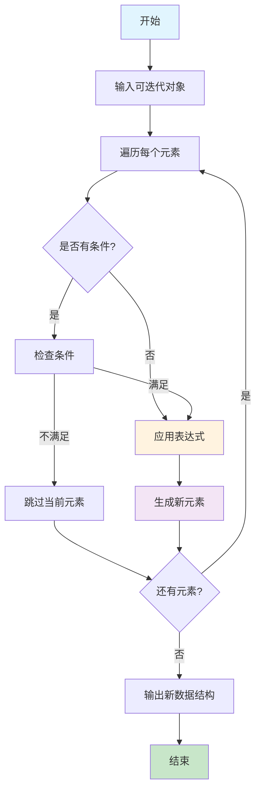

# P5D-Python_推导式完全指南-从列表推导式到字典推导式的Python编程利器

## 📋 摘要

掌握 Python 推导式（Comprehension）语法，用一行代码替代多行循环，提升代码简洁性和执行效率。涵盖列表推导式、字典推导式等核心语法，适合 Python 初学者到高级开发者。

---

## 🎯 什么是推导式？

### 生活化比喻：智能工厂生产线

想象你是一家**智能工厂的厂长**，需要批量生产产品：

- **传统方式**：工人一个个手工制作，效率低
- **推导式方式**：自动化生产线，输入原料，自动输出成品

推导式就像这条**自动化生产线**，让你用一行代码完成原本需要多行循环才能实现的功能。

### 核心概念对比

| 概念 | 传统循环 | 推导式 |
|------|----------|--------|
| **代码行数** | 3-5 行 | 1 行 |
| **可读性** | 需要理解循环逻辑 | 直观表达意图 |
| **性能** | 较慢 | 更快 |
| **适用场景** | 复杂逻辑 | 简单转换 |

---

## 🔄 推导式执行流程图



---

## 📝 列表推导式（List Comprehension）

### 基础语法详解

```python
# 基础语法：适用于小白（零基础）
[表达式 for 变量 in 可迭代对象 if 条件]
```

#### 🔍 语法组成部分详解

| 组成部分 | 说明 | 示例 |
|----------|------|------|
| **表达式** | 对变量进行处理或直接使用，生成新元素 | `x`、`x * 2`、`x.upper()`、`x + 1` |
| **变量** | 从可迭代对象中取出的每个元素 | `x`、`item`、`num` |
| **可迭代对象** | 可以被遍历的数据结构 | `[1,2,3]`、`"hello"`、`range(5)` |
| **条件**（可选） | 筛选满足条件的元素 | `x > 5`、`len(x) > 3` |

#### 📚 核心概念解释

**1. 表达式（Expression）**
- **作用**：对变量进行加工处理或直接使用，生成新的元素
- **类型**：
  - **直接使用**：不处理，直接使用变量本身
  - **算术运算**：加减乘除、幂运算、取模、整除等
  - **比较运算**：大于、小于、等于、不等于、大于等于、小于等于
  - **逻辑运算**：与（and）、或（or）、非（not）
  - **位运算**（高级）：按位与（&）、按位或（|）、按位异或（^）、左移（<<）、右移（>>）
    - `&`：按位与，两个位都为1时结果为1
    - `<<`：左移，二进制位向左移动，右边补0
  - **成员检查**：in、not in 操作
  - **身份检查**：is、is not 操作
  - **字符串操作**：大小写转换、拼接、格式化、切片等
  - **列表/元组操作**：索引、切片、拼接等
  - **字典操作**：键值访问、更新等
  - **函数调用**：调用内置函数或自定义函数
  - **方法调用**：对象方法调用
  - **条件表达式**：三元运算符（if-else）
    - 语法：`值1 if 条件 else 值2`
    - 作用：根据条件选择返回值
  - **复合表达式**：组合多种操作
  - **嵌套推导式**：表达式可以是另一个推导式
- **简单示例**：
  ```python
  # 表达式示例（完整的表达式代码）
  x = 5
  print(x)                    # 直接使用变量
  
  result = x * 2
  print(result)               # 算术运算：变量乘以2
  
  result = x ** 2
  print(result)               # 算术运算：变量平方
  
  name = "alice"
  result = name.upper()
  print(result)               # 字符串操作：转大写
  
  result = f"Hello {name}"
  print(result)               # 字符串操作：格式化
  
  word = "hello"
  result = len(word)
  print(result)               # 函数调用：计算长度
  
  x = -3
  result = x if x > 0 else 0
  print(result)               # 条件表达式：三元运算符
  # 三元运算符语法：值1 if 条件 else 值2
  # 如果条件为True，返回值1；如果条件为False，返回值2
  ```

**2. 可迭代对象（Iterable）**
- **定义**：可以被逐个访问元素的数据结构
- **常见类型**：
  - **列表**：`[1, 2, 3, 4, 5]`
  - **字符串**：`"hello"`
  - **范围**：`range(5)` 生成 0,1,2,3,4
  - **元组**：`(1, 2, 3)`
  - **字典**：`{"a": 1, "b": 2}`（遍历键）
- **示例**：
  ```python
  # 可迭代对象示例（完整的可迭代对象代码）
  numbers = [1, 2, 3, 4, 5]
  for num in numbers:
      print(num)        # 列表：遍历数字
  
  text = "hello"
  for char in text:
      print(char)       # 字符串：遍历字符
  
  for i in range(5):
      print(i)          # 范围：遍历0,1,2,3,4
  
  data = (1, 2, 3)
  for item in data:
      print(item)       # 元组：遍历元素
  
  info = {"a": 1, "b": 2}
  for key in info:
      print(key)        # 字典：遍历键
  ```

**3. 条件（Condition）**
- **作用**：筛选满足条件的元素
- **触发机制**：只有条件为 `True` 的元素才会被处理
- **示例**：
  ```python
  # 条件示例（完整的条件代码）
  x = 5
  if x > 3:
      print("大于3")        # 数字条件：大于3
  
  word = "hello"
  if len(word) > 2:
      print("长度大于2")    # 字符串长度条件：长度大于2
  
  x = 4
  if x % 2 == 0:
      print("是偶数")       # 数学条件：偶数
  
  x = 4
  if x % 2 == 0 and x > 2:
      print("偶数且大于2")  # 复合条件：偶数且大于2
  
  name = "Alice"
  if name in ["Alice", "Bob"]:
      print("在列表中")     # 成员检查：在指定列表中
  ```

#### 🔍 表达式详解

**表达式是推导式的核心，决定了每个元素如何被处理。以下是各种表达式类型的详细示例：**

**1. 算术运算表达式**
```python
# 基本算术运算
result = [x * 2 for x in [1, 2, 3]]
print(result)  # 输出：[2, 4, 6]

result = [x ** 2 for x in [1, 2, 3]]
print(result)  # 输出：[1, 4, 9]

result = [x % 2 for x in [1, 2, 3, 4]]
print(result)  # 输出：[1, 0, 1, 0]

result = [x // 2 for x in [5, 7, 9]]
print(result)  # 输出：[2, 3, 4]
```

**2. 比较运算表达式**
```python
# 比较运算
result = [x > 2 for x in [1, 2, 3, 4]]
print(result)  # 输出：[False, False, True, True]

result = [x == 2 for x in [1, 2, 3]]
print(result)  # 输出：[False, True, False]
```

**3. 逻辑运算表达式**
```python
# 逻辑运算
result = [x > 0 and x < 5 for x in [1, 6, 3]]
print(result)  # 输出：[True, False, True]

# 检查数字是否为偶数
# x % 2 计算 x 除以 2 的余数：偶数余数为 0，奇数余数为 1
# not (x % 2) 对余数取反：
#   - 当余数为 0（偶数）时，not 0 结果为 True（因为 0 在 Python 中为 False）
#   - 当余数为 1（奇数）时，not 1 结果为 False（因为 1 在 Python 中为 True）
# Python 布尔值规则：0 为 False，非零数字为 True
result = [not (x % 2) for x in [1, 2, 3, 4]]
print(result)  # 输出：[False, True, False, True]
```

**4. 位运算表达式（高级用法，小白可跳过）**
```python
# & 符号含义：按位与运算符（bitwise AND）
# 规则：两个二进制位都为1时，结果才为1；否则为0
# 示例：5 & 3 = 1
# 5的二进制：0101
# 3的二进制：0011
# 按位与：   0001（结果）

# 按位与运算：检查数字的奇偶性（与 x % 2 效果相同）
result = [x & 1 for x in [1, 2, 3, 4]]
print(result)  # 输出：[1, 0, 1, 0]

# 小白推荐写法（更易理解）：
result = [x % 2 for x in [1, 2, 3, 4]]
print(result)  # 输出：[1, 0, 1, 0]（效果相同）

# << 符号含义：左移运算符（left shift）
# 规则：将二进制位向左移动指定位数，右边补0
# 示例：3 << 1 = 6
# 3的二进制：0011
# 左移1位：  0110（结果）

# 左移运算：将数字乘以 2（与 x * 2 效果相同）
result = [x << 1 for x in [1, 2, 3]]
print(result)  # 输出：[2, 4, 6]

# 小白推荐写法（更易理解）：
result = [x * 2 for x in [1, 2, 3]]
print(result)  # 输出：[2, 4, 6]（效果相同）
```

**5. 字符串操作表达式**
```python
# 字符串方法调用
result = [name.upper() for name in ["alice", "bob"]]
print(result)  # 输出：['ALICE', 'BOB']

# f-string 字符串格式化（Python 3.6+）
# f-string 语法：f"字符串内容{变量或表达式}"
# 作用：在字符串中插入变量值或表达式结果
# 输入：字符串模板和变量
# 输出：格式化后的字符串

# 基本用法：插入变量
names = ["Alice", "Bob", "Charlie"]
ages = [25, 30, 35]
result = [f"姓名：{name}，年龄：{age}" for name, age in zip(names, ages)]
print(result)  # 输出：['姓名：Alice，年龄：25', '姓名：Bob，年龄：30', '姓名：Charlie，年龄：35']

# 表达式计算：在 f-string 中进行计算
numbers = [1, 2, 3, 4, 5]
result = [f"数字：{x}，平方：{x**2}，立方：{x**3}" for x in numbers]
print(result)  # 输出：['数字：1，平方：1，立方：1', '数字：2，平方：4，立方：8', '数字：3，平方：9，立方：27']

# 格式化控制：设置数字格式
prices = [19.99, 29.50, 45.678]
result = [f"价格：{price:.2f}元" for price in prices]  # .2f 表示保留2位小数
print(result)  # 输出：['价格：19.99元', '价格：29.50元', '价格：45.68元']

# 对齐格式化：设置字符串对齐
names = ["Alice", "Bob", "Charlie"]
result = [f"姓名：{name:>10}" for name in names]  # >10 表示右对齐，占10个字符宽度
print(result)  # 输出：['姓名：     Alice', '姓名：       Bob', '姓名：  Charlie']

# 条件格式化：根据条件选择格式
scores = [85, 92, 78, 96]
result = [f"成绩：{score}分{'（优秀）' if score >= 90 else '（良好）' if score >= 80 else '（需努力）'}" for score in scores]
print(result)  # 输出：['成绩：85分（良好）', '成绩：92分（优秀）', '成绩：78分（需努力）', '成绩：96分（优秀）']
```

**6. 函数调用表达式**
```python
# 内置函数调用
# len() - 获取对象长度
# 输入：字符串、列表、元组等可迭代对象
# 输出：整数，表示对象的元素个数
result = [len(word) for word in ["hello", "world"]]
print(result)  # 输出：[5, 5]

# abs() - 获取绝对值
# 输入：数字（整数或浮点数）
# 输出：数字的绝对值
result = [abs(x) for x in [-1, 2, -3, 4]]
print(result)  # 输出：[1, 2, 3, 4]

# str() - 转换为字符串
# 输入：任意对象
# 输出：对象的字符串表示
result = [str(x) for x in [1, 2, 3]]
print(result)  # 输出：['1', '2', '3']

# int() - 转换为整数
# 输入：字符串或数字
# 输出：整数
result = [int(x) for x in ["1", "2", "3"]]
print(result)  # 输出：[1, 2, 3]

# round() - 四舍五入
# 输入：数字，可选的小数位数
# 输出：四舍五入后的数字
result = [round(x, 1) for x in [1.25, 2.67, 3.14]]
print(result)  # 输出：[1.2, 2.7, 3.1]

# 字符串方法调用
# upper() - 转大写
# 输入：字符串
# 输出：大写字符串
result = [name.upper() for name in ["alice", "bob"]]
print(result)  # 输出：['ALICE', 'BOB']

# lower() - 转小写
# 输入：字符串
# 输出：小写字符串
result = [word.lower() for word in ["HELLO", "WORLD"]]
print(result)  # 输出：['hello', 'world']

# strip() - 去除首尾空格
# 输入：字符串
# 输出：去除首尾空格后的字符串
result = [word.strip() for word in [" hello ", " world "]]
print(result)  # 输出：['hello', 'world']

# replace() - 替换字符
# 输入：字符串，要替换的字符，替换后的字符
# 输出：替换后的字符串
result = [word.replace("o", "0") for word in ["hello", "world"]]
print(result)  # 输出：['hell0', 'w0rld']

# split() - 分割字符串
# 输入：字符串，可选的分割符
# 输出：列表，包含分割后的子字符串
result = [sentence.split() for sentence in ["hello world", "python is great"]]
print(result)  # 输出：[['hello', 'world'], ['python', 'is', 'great']]

# 自定义函数调用
def double(x):
    """
    将数字翻倍
    输入：数字
    输出：数字的2倍
    """
    return x * 2

result = [double(x) for x in [1, 2, 3]]
print(result)  # 输出：[2, 4, 6]
```

**7. 条件表达式（三元运算符）**
```python
# 三元运算符语法：值1 if 条件 else 值2
# 如果条件为True，返回值1；如果条件为False，返回值2

# 条件表达式：如果数字大于 0 则保留，否则设为 0
result = [x if x > 0 else 0 for x in [-1, 2, -3, 4]]
print(result)  # 输出：[0, 2, 0, 4]

# 三元运算符详细说明：
# x if x > 0 else 0
#  ↑     ↑        ↑
# 值1   条件     值2
# 当 x > 0 为 True 时，返回 x
# 当 x > 0 为 False 时，返回 0

# 更多三元运算符示例
result = ["正数" if x > 0 else "非正数" for x in [-1, 2, -3, 4]]
print(result)  # 输出：['非正数', '正数', '非正数', '正数']

result = [x * 2 if x > 0 else 0 for x in [-1, 2, -3, 4]]
print(result)  # 输出：[0, 4, 0, 8]
```

**8. 复合表达式**
```python
# 复合表达式：先取绝对值，再乘以 2
result = [abs(x) * 2 for x in [-1, -2, 3]]
print(result)  # 输出：[2, 4, 6]

# 计算字符串长度并加 1
result = [len(word) + 1 for word in ["hi", "hello"]]
print(result)  # 输出：[3, 6]
```

**9. 嵌套推导式**
```python
# 嵌套推导式：将二维列表展平为一维列表
matrix = [[1, 2, 3], [4, 5, 6]]
result = [num for row in matrix for num in row]
print(result)  # 输出：[1, 2, 3, 4, 5, 6]
```

#### 🔍 推导式循环与条件顺序详解

**推导式中循环和条件判断的顺序会影响执行逻辑和结果，理解这个区别非常重要：**

**1. 循环在前，条件在后（筛选模式）**
- **语法**：`[表达式 for 变量 in 可迭代对象 if 条件]`
- **执行逻辑**：先遍历所有元素，再筛选满足条件的元素
- **结果**：只包含满足条件的元素
- **适用场景**：需要筛选特定元素

```python
# 筛选偶数
result = [x for x in range(10) if x % 2 == 0]
print(result)  # 输出：[0, 2, 4, 6, 8]

# 筛选长度大于2的字符串
words = ["hi", "hello", "world", "ok"]
result = [word for word in words if len(word) > 2]
print(result)  # 输出：['hello', 'world']

# 筛选正数
numbers = [-1, 2, -3, 4, -5]
result = [x for x in numbers if x > 0]
print(result)  # 输出：[2, 4]
```

**2. 条件在前，循环在后（转换模式）**
- **语法**：`[表达式1 if 条件 else 表达式2 for 变量 in 可迭代对象]`
- **执行逻辑**：对每个元素先判断条件，再选择不同的表达式
- **结果**：包含所有元素，但根据条件进行不同处理
- **适用场景**：需要对所有元素进行条件转换

```python
# 偶数保持不变，奇数乘以2
result = [x if x % 2 == 0 else x * 2 for x in range(10)]
print(result)  # 输出：[0, 2, 4, 6, 8, 2, 6, 10, 14, 18]

# 正数保持不变，负数转为0
numbers = [-1, 2, -3, 4, -5]
result = [x if x > 0 else 0 for x in numbers]
print(result)  # 输出：[0, 2, 0, 4, 0]

# 长字符串转大写，短字符串转小写
words = ["hi", "hello", "world", "ok"]
result = [word.upper() if len(word) > 2 else word.lower() for word in words]
print(result)  # 输出：['hi', 'HELLO', 'WORLD', 'ok']
```

**3. 两种模式的区别对比**

| 特征 | 循环在前，条件在后 | 条件在前，循环在后 |
|------|-------------------|-------------------|
| **语法** | `[表达式 for 变量 in 可迭代对象 if 条件]` | `[表达式1 if 条件 else 表达式2 for 变量 in 可迭代对象]` |
| **执行逻辑** | 先遍历，再筛选 | 先判断，再转换 |
| **结果数量** | 可能减少（只保留满足条件的） | 保持不变（所有元素都处理） |
| **主要用途** | 筛选元素 | 条件转换 |
| **性能** | 跳过不满足条件的元素 | 处理所有元素 |

**4. 实际应用场景**

**筛选模式应用**：
```python
# 筛选高薪员工（薪资 > 10000）
salaries = [15000, 8000, 20000, 12000, 9500, 18000]
high_salary = [salary for salary in salaries if salary > 10000]
print(high_salary)  # 输出：[15000, 20000, 12000, 18000]

# 筛选有效邮箱
emails = ["user@example.com", "invalid", "admin@test.com", ""]
valid_emails = [email for email in emails if "@" in email and email]
print(valid_emails)  # 输出：['user@example.com', 'admin@test.com']
```

**转换模式应用**：
```python
# 成绩等级转换
scores = [85, 92, 78, 96, 88, 73, 91]
grades = ["优秀" if score >= 90 else "良好" if score >= 80 else "及格" for score in scores]
print(grades)  # 输出：['良好', '优秀', '及格', '优秀', '良好', '及格', '优秀']

# 价格折扣计算
prices = [100, 200, 150, 300]
discounted = [price * 0.8 if price > 150 else price for price in prices]
print(discounted)  # 输出：[100, 160.0, 150, 240.0]
```

**5. 两种模式结合使用（高级用法）**

**结合语法**：`[表达式1 if 条件1 else 表达式2 for 变量 in 可迭代对象 if 条件2]`
- **执行逻辑**：先筛选满足条件2的元素，再对每个元素进行条件1的判断和转换
- **适用场景**：既需要筛选，又需要条件转换

```python
# 筛选非零数字，正数保持不变，负数转为0
numbers = [-1, 2, -3, 4, -5, 6, 0]
result = [x if x > 0 else 0 for x in numbers if x != 0]
print(result)  # 输出：[0, 2, 0, 4, 0, 6]

# 更好的示例：筛选有效成绩，优秀成绩保持不变，其他成绩转为"需努力"
scores = [95, 85, 75, 65, 55, 0, 92]
result = [score if score >= 90 else "需努力" for score in scores if score > 0]
print(result)  # 输出：[95, '需努力', '需努力', '需努力', '需努力', 92]

# 筛选长度大于2的字符串，长字符串转大写，短字符串转小写
words = ["hi", "hello", "world", "ok", "python"]
result = [word.upper() if len(word) > 4 else word.lower() for word in words if len(word) > 2]
print(result)  # 输出：['hello', 'world', 'python']

# 筛选薪资大于5000的员工，高薪员工薪资保持不变，低薪员工薪资翻倍
salaries = [15000, 8000, 20000, 12000, 9500, 18000, 3000]
result = [salary if salary > 10000 else salary * 2 for salary in salaries if salary > 5000]
print(result)  # 输出：[15000, 16000, 20000, 12000, 19000, 18000]

# 筛选包含@的邮箱，完整邮箱保持不变，不完整邮箱转为"无效邮箱"
emails = ["user@example.com", "invalid", "admin@test.com", "@", "test@domain.com"]
result = [email if "." in email else "无效邮箱" for email in emails if "@" in email]
print(result)  # 输出：['user@example.com', 'admin@test.com', 'test@domain.com']
```

**6. 三种模式完整对比**

| 模式 | 语法 | 执行逻辑 | 结果数量 | 主要用途 | 示例 |
|------|------|----------|----------|----------|------|
| **筛选模式** | `[表达式 for 变量 in 可迭代对象 if 条件]` | 先遍历，再筛选 | 可能减少 | 筛选元素 | `[x for x in range(10) if x % 2 == 0]` |
| **转换模式** | `[表达式1 if 条件 else 表达式2 for 变量 in 可迭代对象]` | 先判断，再转换 | 保持不变 | 条件转换 | `[x if x > 0 else 0 for x in numbers]` |
| **结合模式** | `[表达式1 if 条件1 else 表达式2 for 变量 in 可迭代对象 if 条件2]` | 先筛选，再转换 | 可能减少 | 筛选+转换 | `[x if x > 0 else 0 for x in numbers if x != 0]` |

**7. 实际应用场景对比**

```python
# 场景：处理学生成绩数据
scores = [85, 92, 78, 96, 88, 73, 91, 0, 95, 82]

# 筛选模式：只保留及格成绩（>= 60）
passing_scores = [score for score in scores if score >= 60]
print("及格成绩：", passing_scores)  # 输出：[85, 92, 78, 96, 88, 73, 91, 95, 82]

# 转换模式：所有成绩转换为等级
all_grades = ["优秀" if score >= 90 else "良好" if score >= 80 else "及格" if score >= 60 else "不及格" for score in scores]
print("所有等级：", all_grades)  # 输出：['良好', '优秀', '及格', '优秀', '良好', '及格', '优秀', '不及格', '优秀', '良好']

# 结合模式：筛选及格成绩，优秀成绩保持不变，其他成绩转为"需努力"
passing_grades = [score if score >= 90 else "需努力" for score in scores if score >= 60]
print("及格成绩处理：", passing_grades)  # 输出：[85, 92, 78, 96, 88, 73, 91, 95, 82]
```

**8. 避免冗余判断的最佳实践**

**问题示例**：
```python
# ❌ 冗余判断：条件对所有元素都成立
numbers = [-1, 2, -3, 4, -5, 6]
result = [x if x > 0 else 0 for x in numbers if x != 0]  # x != 0 对所有非零数都成立
print(result)  # 输出：[0, 2, 0, 4, 0, 6]

# ❌ 冗余判断：条件逻辑重复
emails = ["user@example.com", "invalid", "admin@test.com"]
result = [email if "@" in email else "无效" for email in emails if "@" in email]  # 重复检查@
print(result)  # 输出：['user@example.com', 'admin@test.com']
```

**优化方案**：
```python
# ✅ 优化1：直接转换，无需额外筛选
numbers = [-1, 2, -3, 4, -5, 6, 0]
result = [x if x > 0 else 0 for x in numbers]  # 直接转换，无需筛选
print(result)  # 输出：[0, 2, 0, 4, 0, 6]

# ✅ 优化2：分离筛选和转换逻辑
emails = ["user@example.com", "invalid", "admin@test.com", "@", "test@domain.com"]
# 先筛选包含@的邮箱，再判断是否完整（包含.）
result = [email if "." in email else "无效邮箱" for email in emails if "@" in email]
print(result)  # 输出：['user@example.com', 'admin@test.com', 'test@domain.com']

# ✅ 优化3：使用更合理的条件
words = ["hi", "hello", "world", "ok", "python"]
# 筛选长度大于2的字符串，然后根据长度转换
result = [word.upper() if len(word) > 4 else word.lower() for word in words if len(word) > 2]
print(result)  # 输出：['hello', 'world', 'python']
```

**最佳实践原则**：
1. **避免重复条件**：不要在筛选条件和转换条件中重复相同的判断
2. **逻辑清晰**：先筛选，再转换，逻辑层次分明
3. **条件合理**：确保筛选条件真正起到筛选作用
4. **性能考虑**：减少不必要的条件判断

#### 🔍 Python 布尔值规则详解

**在 Python 中，所有值都有"真值性"（Truthiness），理解这个规则对推导式非常重要：**

| 类型 | False 值 | True 值 | 示例 |
|------|----------|---------|------|
| **数字** | `0` | 非零数字 | `0` 为 False，`1`、`-1`、`0.5` 为 True |
| **字符串** | `""`（空字符串） | 非空字符串 | `""` 为 False，`"hello"` 为 True |
| **列表** | `[]`（空列表） | 非空列表 | `[]` 为 False，`[1, 2]` 为 True |
| **字典** | `{}`（空字典） | 非空字典 | `{}` 为 False，`{"a": 1}` 为 True |
| **None** | `None` | 不存在 | `None` 始终为 False |

**实际应用示例：**
```python
# 数字布尔值转换
print(bool(0))    # 输出：False
print(bool(1))     # 输出：True
print(bool(-1))    # 输出：True
print(bool(0.0))   # 输出：False

# 字符串布尔值转换
print(bool(""))    # 输出：False
print(bool("hi"))  # 输出：True

# 在推导式中的应用
# 筛选非零数字
numbers = [0, 1, 2, 0, 3, 0]
non_zero = [x for x in numbers if x]  # 利用数字的布尔值
print(non_zero)  # 输出：[1, 2, 3]

# 筛选非空字符串
words = ["", "hello", "", "world"]
non_empty = [word for word in words if word]  # 利用字符串的布尔值
print(non_empty)  # 输出：['hello', 'world']
```

#### 🔧 函数调用详解

**函数调用是推导式中最强大的表达式类型**，可以调用各种函数来处理数据：

**1. 内置函数（Built-in Functions）**
```python
# len() - 获取长度
result = [len(word) for word in ["hello", "world"]]
print(result)  # 输出：[5, 5]

# abs() - 获取绝对值
result = [abs(x) for x in [-1, 2, -3, 4]]
print(result)  # 输出：[1, 2, 3, 4]

# str() - 转换为字符串
result = [str(x) for x in [1, 2, 3]]
print(result)  # 输出：['1', '2', '3']

# int() - 转换为整数
result = [int(x) for x in ["1", "2", "3"]]
print(result)  # 输出：[1, 2, 3]

# round() - 四舍五入
result = [round(x, 1) for x in [1.25, 2.67, 3.14]]
print(result)  # 输出：[1.2, 2.7, 3.1]
```

**2. 字符串方法（String Methods）**
```python
# upper() - 转大写
result = [name.upper() for name in ["alice", "bob"]]
print(result)  # 输出：['ALICE', 'BOB']

# lower() - 转小写
result = [word.lower() for word in ["HELLO", "WORLD"]]
print(result)  # 输出：['hello', 'world']

# strip() - 去除首尾空格
result = [word.strip() for word in [" hello ", " world "]]
print(result)  # 输出：['hello', 'world']

# replace() - 替换字符
result = [word.replace("o", "0") for word in ["hello", "world"]]
print(result)  # 输出：['hell0', 'w0rld']

# split() - 分割字符串
result = [sentence.split() for sentence in ["hello world", "python is great"]]
print(result)  # 输出：[['hello', 'world'], ['python', 'is', 'great']]
```

**3. 自定义函数（Custom Functions）**
```python
# 定义自定义函数
def process_number(x):
    if x > 0:
        return x * 2
    else:
        return 0

def get_grade(score):
    if score >= 90:
        return "A"
    elif score >= 80:
        return "B"
    else:
        return "C"

# 使用自定义函数
result = [process_number(x) for x in [1, -2, 3, -4]]
print(result)  # 输出：[2, 0, 6, 0]

result = [get_grade(score) for score in [85, 92, 78, 96]]
print(result)  # 输出：['B', 'A', 'C', 'A']
```


### 实际应用场景

#### 🎓 场景一：学生成绩管理系统（小白）

```python
# 将学生成绩转换为等级
scores = [85, 92, 78, 96, 88, 73, 91]

# 传统方式（3 行代码）
grades = []
for score in scores:
    if score >= 90:
        grades.append("优秀")
    elif score >= 80:
        grades.append("良好")
    else:
        grades.append("及格")

# 推导式方式（1 行代码）
grades = ["优秀" if score >= 90 else "良好" if score >= 80 else "及格" for score in scores]

print(grades)  # 输出：['良好', '优秀', '及格', '优秀', '良好', '及格', '优秀']
```

#### 🛒 场景二：商品价格计算（初级）

```python
# 计算商品原价的 8 折价格
original_prices = [3000, 8000, 500, 1200, 2500]

# 传统方式（3 行代码）
discounted_prices = []
for price in original_prices:
    discounted_prices.append(price * 0.8)

# 推导式方式（1 行代码）
discounted_prices = [price * 0.8 for price in original_prices]

print(discounted_prices)  # 输出：[2400.0, 6400.0, 400.0, 960.0, 2000.0]
```

#### 🏢 场景三：员工薪资筛选（中级）

```python
# 筛选高薪员工（薪资 > 10000）
salaries = [15000, 8000, 20000, 12000, 9500, 18000]

# 传统方式（4 行代码）
high_salary_employees = []
for salary in salaries:
    if salary > 10000:
        high_salary_employees.append(salary)

# 推导式方式（1 行代码）
high_salary_employees = [salary for salary in salaries if salary > 10000]

print(high_salary_employees)  # 输出：[15000, 20000, 12000, 18000]
```

---

## 📚 字典推导式（Dictionary Comprehension）

### 基础语法详解

```python
# 基础语法：适用于小白（零基础）
{键表达式: 值表达式 for 变量 in 可迭代对象 if 条件}
```

#### 🔍 语法组成部分详解

| 组成部分 | 说明 | 示例 |
|----------|------|------|
| **键表达式** | 生成字典的键（可直接使用变量） | `x`、`x.upper()`、`f"key_{x}"` |
| **值表达式** | 生成字典的值（可直接使用变量） | `x`、`x * 2`、`len(x)`、`x + 1` |
| **变量** | 从可迭代对象中取出的每个元素 | `x`、`item`、`key` |
| **可迭代对象** | 可以被遍历的数据结构 | `[1,2,3]`、`{"a":1, "b":2}` |
| **条件**（可选） | 筛选满足条件的元素 | `x > 5`、`len(x) > 3` |

#### 📚 核心概念解释

**1. 键表达式（Key Expression）**
- **作用**：生成字典的键（Key），可直接使用变量或进行处理
- **要求**：必须是不可变类型（字符串、数字、元组等）
- **示例**：
  ```python
  # 直接使用变量作为键（不做处理）
  {x: x for x in [1, 2, 3]}  # 输出：{1: 1, 2: 2, 3: 3}
  
  # 数学运算键
  {x*2: x for x in [1, 2, 3]}  # 输出：{2: 1, 4: 2, 6: 3}
  
  # 字符串键
  {f"item_{x}": x*2 for x in [1, 2, 3]}  # 输出：{'item_1': 2, 'item_2': 4, 'item_3': 6}
  
  # 大写转换键
  {name.upper(): len(name) for name in ["alice", "bob"]}  # 输出：{'ALICE': 5, 'BOB': 3}
  ```

**2. 值表达式（Value Expression）**
- **作用**：生成字典的值（Value），可直接使用变量或进行处理
- **类型**：可以是任何数据类型
- **示例**：
  ```python
  # 直接使用变量作为值（不做处理）
  {x: x for x in [1, 2, 3]}  # 输出：{1: 1, 2: 2, 3: 3}
  
  # 数学运算值
  {x: x**2 for x in [1, 2, 3]}  # 输出：{1: 1, 2: 4, 3: 9}
  
  # 内置函数调用值
  {x: len(str(x)) for x in [1, 12, 123]}  # 输出：{1: 1, 12: 2, 123: 3}
  {x: abs(x) for x in [-1, 2, -3]}  # 输出：{-1: 1, 2: 2, -3: 3}
  
  # 字符串方法调用值
  {name: name.upper() for name in ["alice", "bob"]}  # 输出：{'alice': 'ALICE', 'bob': 'BOB'}
  {word: word.strip() for word in [" hello ", " world "]}  # 输出：{' hello ': 'hello', ' world ': 'world'}
  
  # 自定义函数调用值
  def square(x):
      return x * x
  {x: square(x) for x in [1, 2, 3]}  # 输出：{1: 1, 2: 4, 3: 9}
  
  # 字符串值
  {x: f"value_{x}" for x in [1, 2, 3]}  # 输出：{1: 'value_1', 2: 'value_2', 3: 'value_3'}
  
  # 列表值
  {x: [x, x*2, x*3] for x in [1, 2]}  # 输出：{1: [1, 2, 3], 2: [2, 4, 6]}
  ```

**3. 可迭代对象在字典推导式中的应用**
- **列表**：`[1, 2, 3]` → 遍历每个数字
- **字典**：`{"a": 1, "b": 2}` → 遍历键值对
- **字符串**：`"hello"` → 遍历每个字符
- **zip()**：`zip(keys, values)` → 同时遍历两个列表

**4. 条件触发机制**
- **作用**：只有条件为 `True` 的键值对才会被创建
- **示例**：
  ```python
  # 数字条件
  {x: x*2 for x in [1, 2, 3, 4, 5] if x > 3}  # 输出：{4: 8, 5: 10}
  
  # 字符串长度条件
  {word: len(word) for word in ["hi", "hello", "world"] if len(word) > 2}  # 输出：{'hello': 5, 'world': 5}
  
  # 复合条件
  {x: x**2 for x in [1, 2, 3, 4, 5] if x % 2 == 0 and x > 2}  # 输出：{4: 16}
  ```

### 实际应用场景

#### 🎓 场景一：学生信息管理系统（小白）

```python
# 将学生姓名和成绩组合成字典
names = ["小明", "小红", "小刚", "小丽"]
scores = [85, 92, 78, 96]

# 传统方式（4 行代码）
student_scores = {}
for i in range(len(names)):
    student_scores[names[i]] = scores[i]

# 推导式方式（1 行代码）
student_scores = {name: score for name, score in zip(names, scores)}

print(student_scores)  # 输出：{'小明': 85, '小红': 92, '小刚': 78, '小丽': 96}
```

#### 🛒 场景二：商品库存管理系统（初级）

```python
# 统计商品库存状态
products = [
    {"name": "苹果", "stock": 50},
    {"name": "香蕉", "stock": 30},
    {"name": "橙子", "stock": 5},
    {"name": "葡萄", "stock": 80}
]

# 标记库存状态（库存 < 20 为缺货）
stock_status = {
    product["name"]: "缺货" if product["stock"] < 20 else "充足"
    for product in products
}

print(stock_status)  # 输出：{'苹果': '充足', '香蕉': '充足', '橙子': '缺货', '葡萄': '充足'}
```

#### 🏢 场景三：企业员工权限系统（中级）

```python
# 根据员工级别设置权限
employees = [
    {"name": "张三", "level": "高级", "department": "技术部"},
    {"name": "李四", "level": "初级", "department": "销售部"},
    {"name": "王五", "level": "中级", "department": "技术部"}
]

# 传统方式（6 行代码）
permissions = {}
for emp in employees:
    if emp["level"] == "高级":
        permissions[emp["name"]] = 3
    elif emp["level"] == "中级":
        permissions[emp["name"]] = 2
    else:
        permissions[emp["name"]] = 1

# 推导式方式（1 行代码）
permissions = {
    emp["name"]: 3 if emp["level"] == "高级" else 2 if emp["level"] == "中级" else 1
    for emp in employees
}

print(permissions)  # 输出：{'张三': 3, '李四': 1, '王五': 2}
```

---

## 🔧 其他推导式类型

### 集合推导式（Set Comprehension）

```python
# 去重并转换字符串
words = ["apple", "banana", "apple", "cherry", "banana"]
unique_lengths = {len(word) for word in words}

print(unique_lengths)  # 输出：{5, 6}（去重后的长度）
```

### 元组推导式（Generator Expression）

```python
# 生成器表达式（节省内存）
numbers = (x * 2 for x in range(5))
print(list(numbers))  # 输出：[0, 2, 4, 6, 8]
```

---

## ⚠️ 常见问题预警

### 1. 过度使用推导式

**问题**：将所有循环都改为推导式，导致代码难以理解

```python
# ❌ 错误示例：过度复杂
result = [x for x in [y for y in range(10) if y % 2 == 0] if x > 3]

# ✅ 正确示例：分步处理
even_numbers = [y for y in range(10) if y % 2 == 0]
result = [x for x in even_numbers if x > 3]
```

### 2. 忘记条件判断

**问题**：推导式中条件判断逻辑错误

```python
# ❌ 错误示例：条件逻辑错误
numbers = [1, 2, 3, 4, 5]
result = [x * 2 if x > 3 else x for x in numbers]  # 所有元素都会处理

# ✅ 正确示例：明确条件
result = [x * 2 for x in numbers if x > 3]  # 只处理大于 3 的元素
```

### 3. 性能考虑不当

**问题**：在大数据集上使用推导式可能影响性能

```python
# ❌ 错误示例：大数据集一次性处理
huge_list = list(range(1000000))
result = [x * 2 for x in huge_list if x % 2 == 0]

# ✅ 正确示例：使用生成器表达式
result = (x * 2 for x in huge_list if x % 2 == 0)
```

---

## 🎯 学习路径建议

### 小白（零基础）
1. **掌握基础语法**：理解 `[表达式 for 变量 in 可迭代对象]` 结构
2. **练习简单转换**：数字运算、字符串处理
3. **逐步添加条件**：学会使用 `if` 条件筛选
4. **避免复杂运算**：暂时跳过位运算等高级用法

### 初级开发者
1. **掌握字典推导式**：理解键值对转换
2. **学习嵌套推导式**：处理复杂数据结构
3. **性能优化技巧**：选择合适的推导式类型
4. **逐步学习高级语法**：条件表达式

### 中级开发者
1. **高级语法应用**：条件表达式、多重循环
2. **与其他特性结合**：生成器
3. **代码重构实践**：将传统循环改为推导式
4. **学习位运算**：理解按位操作的应用场景

### 高级开发者
1. **性能分析**：不同推导式的性能对比
2. **最佳实践总结**：何时使用推导式，何时避免
3. **团队规范制定**：推导式使用规范
4. **位运算优化**：在性能关键场景使用位运算

---

## 🏆 最佳实践总结

### 1. 选择合适的推导式类型

| 需求 | 推荐类型 | 示例 |
|------|----------|------|
| **简单列表转换** | 列表推导式 | `[x*2 for x in numbers]` |
| **键值对处理** | 字典推导式 | `{k: v*2 for k, v in data.items()}` |
| **去重处理** | 集合推导式 | `{len(word) for word in words}` |
| **内存优化** | 生成器表达式 | `(x*2 for x in numbers)` |

### 2. 代码可读性原则

```python
# ✅ 好的实践：清晰易懂
student_grades = [
    "优秀" if score >= 90 else "良好" if score >= 80 else "及格"
    for score in scores
]

# ❌ 避免：过于复杂
result = [a if b else c for a, b, c in zip(x, y, z) if d and e]
```

### 3. 性能优化建议

- **小数据集**：使用列表推导式
- **大数据集**：使用生成器表达式
- **内存敏感**：避免创建中间列表
- **复杂逻辑**：考虑使用传统循环

---

## 🎉 总结

Python 推导式是提升代码质量和开发效率的**强大工具**。通过掌握列表推导式、字典推导式等核心语法，你可以：

- **简化代码**：用一行代码替代多行循环
- **提升性能**：推导式通常比传统循环更快
- **增强可读性**：直观表达数据处理意图
- **减少错误**：减少循环相关的常见错误

记住，推导式不是万能的，**合适的场景使用合适的工具**才是最佳实践。从简单的数字处理开始，逐步掌握复杂的数据转换，你就能成为 Python 推导式的高手！

**继续探索，让代码更优雅！** 🚀

---

**厦门工学院人工智能创作坊 -- 郑恩赐**  
**2025 年 10 月 21 日**
