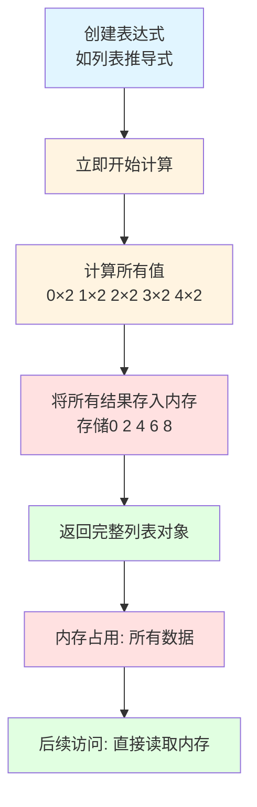
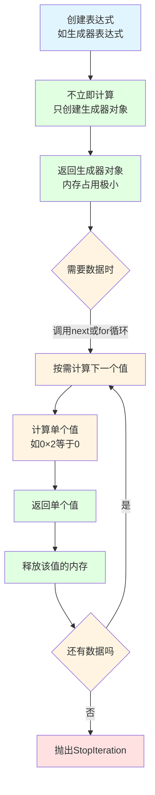
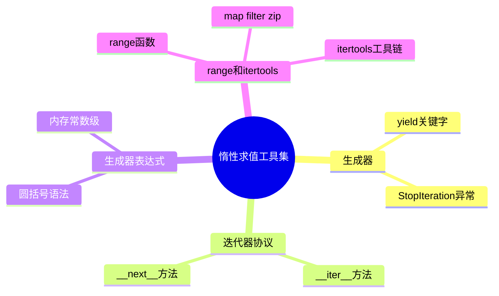
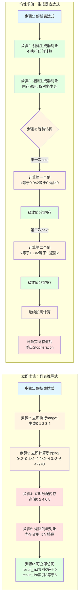
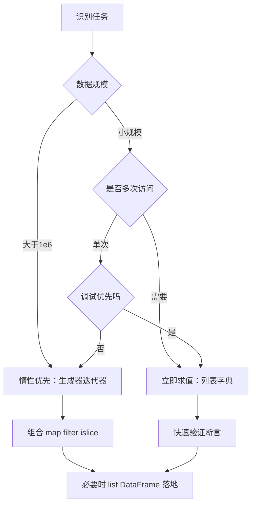

# P5H-Python惰性求值 vs 立即求值-为什么内存优化和调试体验总是对着干？

## 📝 摘要

面向零基础，我们拆解 Python 惰性求值与立即求值的取舍冲突，结合内存与调试的真实案例，告诉你何时该放慢求值节奏。

> 面试官：如果一个生成器抛出异常会卡住生产，你会怎么排查？  
> 我：先确认它是不是惰性求值延迟暴雷，再看立即求值是否导致多余计算。内存优化和调试体验其实互相拉扯。让我们复盘这个场景，把惰性与立即求值的优劣一口气拆透。

## 目录

我们按照下述顺序拆解惰性与立即求值，你可以跟着目录逐步跳转到自己关心的章节。

- [1. 前置知识点](#1-前置知识点)
- [2. 什么是求值（Evaluation（求值））？](#2-什么是求值evaluation求值)
- [3. 快速上手（3 分钟）](#3-快速上手3-分钟)
- [4. 基本概念：惰性 vs 立即](#4-基本概念惰性-vs-立即)
- [5. 惰性求值实现地图](#5-惰性求值实现地图)
- [6. 立即求值实现全景](#6-立即求值实现全景)
- [7. 内置函数里的惰性求值](#7-内置函数里的惰性求值)
- [8. 短路求值：and-or与any-all](#8-短路求值and-or与any-all)
- [9. 优缺点对比与性能权衡](#9-优缺点对比与性能权衡)
- [10. 实际应用场景](#10-实际应用场景)
- [11. 选择建议与实践流程](#11-选择建议与实践流程)
- [12. 对比示例：写法与调试体验](#12-对比示例写法与调试体验)
- [13. 常见错误与修正](#13-常见错误与修正)
- [14. 常见困惑解答（FAQ）](#14-常见困惑解答faq)
- [15. 总结与行动号召](#15-总结与行动号召)

## 1. 前置知识点

以下是理解惰性求值与立即求值所需的基础知识。

### 1.1 变量与数据类型（Variable & Data Type（变量与数据类型））

- **是什么**：变量就像生活中的**盒子**，用来存放数据。数据类型告诉我们盒子里装的是什么（整数、小数、文字等）。
- **为什么需要**：理解数据类型能帮助我们明白，当我们说"计算"时，计算机到底在做什么。比如，整数 5 和字符串 "5" 在内存中的存储方式完全不同。
- **简单例子**：
```python
age = 25        # 整数（int），就像盒子里放了一个数字
name = "小明"   # 字符串（str），就像盒子里放了一段文字
price = 99.9    # 浮点数（float），就像盒子里放了一个带小数点的数字
```

### 1.2 控制流（Control Flow（控制流））

- **是什么**：控制流就是告诉程序"什么时候做什么"的指令，就像做菜的步骤：先洗菜，再切菜，最后炒菜。
- **为什么需要**：理解 if/for/while 的执行顺序，能帮助我们理解"什么时候计算"和"什么时候不计算"。
- **简单例子**：
```python
# if 语句：如果条件成立就执行
if age >= 18:
    print("成年了")  # 只有当 age >= 18 时才会执行

# for 循环：重复执行某件事
for i in range(3):
    print(i)  # 会打印 0, 1, 2
```

### 1.3 迭代器基础（Iterator Basics（迭代器基础））

- **是什么**：迭代器就像一个**自动售货机**，你按一下按钮（调用 `next()`），它就给你一个商品（数据），直到商品卖完为止。
- **为什么需要**：理解迭代器能帮助我们理解"按需获取数据"的概念，这是惰性求值的核心。
- **简单理解**：
  - `__iter__()`：告诉 Python"我是一个可以遍历的对象"
  - `__next__()`：每次调用时返回下一个数据，没有数据了就抛出 `StopIteration` 异常
- **你可能会想**："为什么需要迭代器？"答案是：当数据量很大时，我们不需要一次性把所有数据都加载到内存，而是需要哪个就拿哪个，这样更省内存。

### 1.4 性能度量工具（Performance Metrics（性能度量））

- **是什么**：用来测量代码运行速度和内存占用的工具，就像用尺子量长度、用秤称重量一样。
- **为什么需要**：只有用数据说话，我们才能知道惰性求值和立即求值到底哪个更省内存、哪个更快。
- **常用工具**：
  - `sys.getsizeof()`：测量对象占用了多少内存（单位：字节）
  - `timeit`：测量代码执行需要多长时间
- **简单例子**：
```python
import sys
my_list = [1, 2, 3]
print(sys.getsizeof(my_list))  # 看看这个列表占用了多少内存
```

💡 **学习建议**：如果对上面这些概念还不熟悉，建议先理解一下，这样后面的内容会更容易理解。

## 2. 什么是求值（Evaluation（求值））？

在深入惰性求值和立即求值之前，让我们先理解一个最基础的概念：**什么是求值？**

### 2.1 求值的通俗理解

**求值（Evaluation）** 就是"计算并得到结果"的过程。

在生活中，我们经常会遇到"什么时候做某件事"的选择。比如：
- 你是提前做好所有菜，还是需要时才做？
- 你是下载完整部电影，还是在线看视频？

在编程中也是一样，**求值时机**（什么时候计算）会影响程序的性能和内存使用。Python 中有两种主要的求值方式：**立即求值**和**惰性求值**。我们稍后会在第4章详细讲解这两种方式。

### 2.2 编程中的求值

在编程中，**求值**就是执行代码并得到结果的过程：

```python
# 这是一个表达式：1 + 2
result = 1 + 2  # 这里发生了"求值"，result 变成了 3
```

💡 **关键理解**：求值时机（什么时候计算）会影响程序的性能和内存使用。这就是为什么我们需要学习惰性求值和立即求值的原因。详细的概念和区别，我们会在第4章"基本概念：惰性 vs 立即"中详细讲解。

## 3. 快速上手（3 分钟）

<p align="right"><span style="background:#e53935;color:#fff;padding:2px 6px;border-radius:4px">🔥 Must（必做实践）｜依赖：任意 Python 3 解释器</span></p>

用一个简单的例子感受惰性求值和立即求值的区别：

### 3.1 任务目标

🎯 **我们要做什么**：模拟抛硬币 100 万次，看看"立即求值"和"惰性求值"在内存占用上有什么不同。

### 3.2 代码示例

```python
import random
from sys import getsizeof

# 方式一：立即求值（列表推导式 []）
def eager_coin_toss(n=1_000_000):
    return [
        "Heads" if random.random() > 0.5 else "Tails"
        for _ in range(n)
    ]

# 方式二：惰性求值（生成器表达式 ()）
def lazy_coin_toss(n=1_000_000):
    return (
        "Heads" if random.random() > 0.5 else "Tails"
        for _ in range(n)
    )

# 测试内存占用
eager_list = eager_coin_toss()
lazy_iter = lazy_coin_toss()

print(f"立即求值内存：{getsizeof(eager_list)} bytes")  # ~8 MB
print(f"惰性求值内存：{getsizeof(lazy_iter)} bytes")  # ~200 bytes

# 从生成器中取值
print(next(lazy_iter))
```

### 3.3 运行结果说明

当你运行这段代码时，你会看到：

```
=== 开始测试 ===
立即求值内存：8448728 bytes  # 大约 8 MB，占用了大量内存
惰性求值内存：200 bytes      # 只有 200 字节，几乎不占内存！
从惰性生成器中取第一个值：
Heads  # 或者 Tails（随机）
```

### 3.4 关键观察点

🧩 **你发现了什么？**

1. **立即求值**：即使你只需要一个结果，程序也会生成全部 100 万个结果，占用了 8 MB 内存
2. **惰性求值**：程序只占用 200 字节，因为它还没有生成任何结果，只是"记住了"如何生成
3. **按需生成**：只有当你调用 `next(lazy_iter)` 时，才会真正生成一个结果

💡 **生活化理解**：详见[第4章基本概念](#4-基本概念惰性-vs-立即)中的看视频比喻。

### 3.5 试试看

🔬 **动手实践**：你可以尝试连续调用几次 `next(lazy_iter)`，看看每次都会得到一个新的随机结果。这证明了生成器是"按需生成"的。

💡 **提示**：这个示例展示了内存占用的差异。如果生成器表达式中包含可能出错的操作（如除零、类型转换错误等），惰性求值会延迟到实际消费时才暴露异常；而立即求值会在创建列表时立刻抛错。这也是我们后文要重点拆解的“内存优化 vs 调试体验”矛盾。

## 4. 基本概念：惰性 vs 立即

现在让我们深入理解这两个核心概念。

### 4.1 惰性求值（Lazy Evaluation（惰性求值） / call-by-need（按需调用））

#### 什么是惰性求值？

**惰性求值**就是"需要时才计算"的策略。

- 在线看视频时，只加载你正在看的那一段，看完就释放，不占用太多空间
- 在编程中，惰性求值就是"记住"如何计算，但等到真正需要结果时才计算
- 惰性求值就是"需要哪个数据就计算哪个数据"，而不是一次性计算所有数据

#### 技术定义

- 💤 **定义**：表达式在被绑定到变量后不会立刻执行，而是在第一次被消费（使用）时才计算。
- 🔍 **Python 中的例子**：生成器、迭代器、`range()`、`map()` 都体现了这种"按需取值"的行为。

#### 为什么需要惰性求值？

💾 **价值**：我更愿意把惰性求值理解成"内存延迟付款"——就像信用卡一样，只在真的有人要数据时才"付钱"（占用内存），从而让我们可以：
- 处理大文件（不需要一次性加载整个文件）
- 生成无限序列（不需要提前生成所有数据）
- 避免无意义的计算（只计算真正需要的部分）

### 4.2 立即求值（Eager Evaluation（立即求值））

#### 什么是立即求值？

**立即求值**就是"立即计算"的策略。

- 你下载完整部电影到手机里，电影的所有内容都占用你的存储空间
- 在编程中，立即求值就是"立即计算并得到结果"，全部放在内存里
- 立即求值就是"一次性计算所有结果"，全部放在内存里

#### 技术定义

- ⚡ **定义**：表达式在出现的那一刻就被执行，结果立刻落在内存里。
- 🔍 **Python 中的例子**：列表/字典/集合字面量、标准函数调用、`list` 推导式都属于立即求值。

#### 为什么需要立即求值？

🧪 **特点**：我们在调试时常常选择立即求值，因为：
- 异常会立刻被抛出，方便我们快速定位问题
- 执行顺序更加可预测，代码更容易理解
- 可以多次访问数据，不需要重新计算

### 4.3 核心差异对比表

让我们用一个表格来对比这两种方式，这样更直观：

| 维度 | 惰性求值 | 立即求值 |
| --- | --- | --- |
| **计算时机** | 等到需要使用时才计算 | 定义时就立即计算 |
| **内存占用** | 只保留当前正在使用的数据，适合处理超大文件或无限序列 | 一次性存放全部结果，占用内存较大 |
| **调试体验** | 错误可能延迟出现（就像问题藏在后面，需要等到使用时才发现） | 错误立即反馈（就像问题马上暴露，方便排查） |
| **执行顺序** | 执行顺序可能不太直观（因为是根据需要才执行） | 执行顺序与代码书写顺序一致（更容易理解） |

💡 **生活化理解**：
- **惰性求值**：就像"按需生产"，需要时才做，省空间但可能延迟发现问题
- **立即求值**：就像"批量生产"，提前做好，占空间但问题马上暴露

#### 工作流程对比图

下面两个流程图展示了立即求值和惰性求值的核心工作流程差异：

**立即求值工作流程**：



**惰性求值工作流程**：



**关键差异总结**：
- ⚡ **立即求值**：创建时一次性计算所有值，内存占用大，但可以立即看到所有结果
- 💤 **惰性求值**：创建时只返回生成器对象，按需逐个计算，内存占用小，但需要遍历才能看到结果

### 4.4 两者的关系和常见术语

让我们理解一些相关的概念：

- 🔄 **短路求值（Short-circuit Evaluation（短路求值））**：
  - **通俗理解**：就像"如果第一个条件不满足，就不看后面的条件了"
  - **例子**：`and` / `or` / `any()` / `all()` 的行为本质上就是局部的惰性求值
  - **为什么叫"短路"**：就像电路短路一样，电流（计算）提前结束了
  - 我们将在后文单独详细讲解

- 🤝 **组合使用策略**：
  - **通俗理解**：就像做菜时，有些菜提前做好（立即求值），有些菜需要时才做（惰性求值）
  - **实际应用**：大多数项目会混用两者——例如用生成器做数据流（惰性），用列表推导式存放最终结果（立即）
  - **关键**：我们需要做的是看清场景，让内存和调试体验达到平衡

- 🧠 **关于"严格"和"非严格"（了解即可）**：
  - 这是更高级的概念，对初学者来说可以暂时忽略
  - 简单理解：惰性求值通常对应"非严格"（不立即执行），立即求值对应"严格"（立即执行）
  - 如果你现在不理解也没关系，先掌握基本概念更重要

## 5. 惰性求值实现地图

<p align="right"><span style="background:#ff9800;color:#000;padding:2px 6px;border-radius:4px">⚙️ Should（建议实践）｜依赖：Python 3.8+、`itertools` 标准库</span></p>

现在让我们来看看 Python 中是如何实现惰性求值的。



### 5.1 生成器（Generator（生成器））

#### 什么是生成器？

**生成器**就像一个"可以暂停的函数"。

- 🎬 **拍电影的例子**：
  - 普通函数就像拍完整个电影，一次性给你看完整部电影
  - 生成器就像拍电影时，每拍完一个镜头就给你看，然后暂停，等你需要下一个镜头时再继续拍

- 🏭 **生产线的例子**：
  - 普通函数就像工厂一次性生产完所有产品，全部堆在仓库
  - 生成器就像生产线，需要时才生产一个产品，不占仓库空间

#### 技术定义

- 🧱 **本质**：包含 `yield` 关键字的函数会返回生成器对象。每次调用 `next()` 时，函数会执行到下一个 `yield` 并暂停，保留当前的状态（就像按了暂停键，下次按播放键时从暂停的地方继续）。

#### 为什么需要生成器？

🧪 **优势**：我常用生成器来处理大文件或无限序列，因为：
- 可以逐行读取大文件（不需要一次性加载整个文件）
- 可以生成无限序列（不需要提前生成所有数据）
- 节省内存（只保留当前状态，不保留所有结果）

#### 代码示例

生成斐波那契数列：

```python
def fibonacci():
    a, b = 0, 1
    while True:
        yield a          # 返回当前值并暂停
        a, b = b, a + b  # 状态保留，下次继续

fib = fibonacci()
for i in range(5):
    print(next(fib))  # 0, 1, 1, 2, 3
```

**运行结果**：
```
0
1
1
2
3
```

💡 **关键理解**：
- `yield` 就像"暂停键"，函数执行到这里会暂停，返回一个值
- 下次调用 `next()` 时，函数会从 `yield` 的下一行继续执行
- 生成器会"记住"当前的状态（比如 a 和 b 的值）

> ⚠️ **常见坑**：如果你手动调用 `next()` 太多次，可能会遇到 `StopIteration` 异常。建议始终通过 `for` 循环或 `itertools.islice` 来使用生成器，这样更安全。

### 5.2 迭代器协议（Iterator Protocol（迭代器协议））

#### 什么是迭代器协议？

**迭代器协议**就是 Python 规定的一套"规则"，只要一个对象遵循这套规则，它就可以被 `for` 循环遍历。

#### 通俗理解

- 🎰 **自动售货机的例子**：
  - 迭代器就像一个自动售货机，你按一下按钮（调用 `next()`），它就给你一个商品（数据）
  - 当商品卖完了（没有更多数据），它就会告诉你"卖完了"（抛出 `StopIteration` 异常）

- 📖 **翻书的例子**：
  - 迭代器就像翻书，每次翻一页（调用 `next()`），你就看到一页内容（数据）
  - 翻到最后一页后，再翻就没有了（抛出 `StopIteration` 异常）

#### 迭代器协议的两个方法

- `__iter__()`：告诉 Python"我是一个可以遍历的对象"，通常返回 `self`（自己）
- `__next__()`：每次调用时返回下一个数据，没有数据了就抛出 `StopIteration` 异常

#### 为什么需要迭代器协议？

🛠️ **价值**：有了迭代器协议，我们就可以用统一的方式（比如 `for` 循环）来遍历各种不同的数据结构，而不需要关心它们内部是如何实现的。

#### 自定义迭代器示例

倒计时迭代器：

```python
class Countdown:
    def __init__(self, start):
        self.current = start

    def __iter__(self):
        return self

    def __next__(self):
        if self.current < 0:
            raise StopIteration
        value = self.current
        self.current -= 1
        return value

for number in Countdown(3):
    print(number)  # 3, 2, 1, 0
```

**运行结果**：
```
3
2
1
0
```


💡 **理解要点**：生成器本质上就是 Python 自动帮我们实现了迭代器协议。可以通过手动实现类似的迷你迭代器类（如上面的 `Countdown`），实现 `__iter__()` 和 `__next__()` 来理解迭代器的工作原理，这样比单纯看概念更容易上手。

### 5.3 生成器表达式 vs 列表推导式

#### 语法对比

这两种写法的区别：

- **列表推导式**：使用方括号 `[]`，会立即计算所有结果
- **生成器表达式**：使用圆括号 `()`，不会立即计算，而是"记住"如何生成

#### 为什么需要理解这个区别？

区别很大，用代码验证：

```python
import sys

# 列表推导式：立即计算
coins_list = ["Heads" for _ in range(1_000_000)]

# 生成器表达式：按需计算
coins_gen = ("Heads" for _ in range(1_000_000))

print("列表占用内存：", sys.getsizeof(coins_list), "bytes")  # ~8 MB
print("生成器占用内存：", sys.getsizeof(coins_gen), "bytes")  # ~200 bytes
```

**运行结果**：
```
列表占用内存： 8448728 bytes  # 约 8 MB，占用了大量内存
生成器占用内存： 200 bytes    # 只有 200 字节，几乎不占内存！
```

💡 **关键理解**：详见[第4章基本概念](#4-基本概念惰性-vs-立即)中的看视频比喻。

#### 代码执行步骤分解图

让我们通过一个具体的代码示例，详细展示列表推导式和生成器表达式的执行步骤差异：

**示例代码**：
```python
# 立即求值：列表推导式
result_list = [x*2 for x in range(5)]

# 惰性求值：生成器表达式
result_gen = (x*2 for x in range(5))
```

**执行步骤对比**：



**执行时机对比**：

| 操作 | 立即求值（列表推导式） | 惰性求值（生成器表达式） |
|------|---------------------|----------------------|
| **定义时** | ✅ 立即计算所有值 | ❌ 不计算，只创建对象 |
| **内存占用** | 所有值（5个整数） | 仅生成器对象（~200字节） |
| **访问第一个值** | 直接从内存读取 | 此时才计算第一个值 |
| **访问最后一个值** | 直接从内存读取 | 此时才计算最后一个值 |
| **异常时机** | 定义时立即抛出 | 访问到错误数据时才抛出 |

💡 **关键洞察**：立即求值在"定义时"就完成了所有工作，而惰性求值将工作分散到"每次访问时"。

#### 什么时候用哪个？

> ✅ **选型建议**：
> - **用生成器表达式**：如果只需要遍历一次数据，用生成器表达式更省内存
> - **用列表推导式**：如果需要随机访问（如 `list[0]`）、切片（如 `list[:10]`）或重复迭代，用列表推导式更方便

### 5.4 `range()` 函数（Range Function（range 函数））

#### 什么是 range()？

`range()` 是 Python 中用来生成数字序列的函数，它天生就是惰性的！

#### 通俗理解

- 📊 **数数的例子**：
  - 如果你要数 1 到 100 万，你不需要提前把所有数字都写下来
  - `range(1, 1000000)` 就像"记住"如何数数，需要哪个数字时才数到那个数字

#### 为什么 range() 是惰性的？

🧮 **关键点**：Python 3 的 `range` 天生惰性，迭代时才计算数字。这意味着：
- `range(1000000)` 不会立即创建 100 万个数字
- 只有当你遍历它时，才会按需生成数字
- 这样即使 `range(1000000000)` 也不会占用大量内存

#### 代码示例

```python
# range() 不会立即创建所有数字
my_range = range(1, 1000000)  # 这行代码执行得很快，不会占用大量内存

# 只有当你遍历时，才会按需生成数字
for i in my_range:
    if i > 10:  # 只取前 10 个数字
        break
    print(i)  # 打印 1, 2, 3, ..., 10
```

💡 **注意**：如果你使用的是 Python 2，需要用 `xrange()` 才能实现惰性。但 Python 3 的 `range()` 已经是惰性的了，不需要再使用 `xrange()`。

### 5.5 `itertools` 工具箱（itertools Toolbox（itertools 工具箱））

`itertools` 是 Python 标准库中的一个模块，提供了很多惰性工具。让我们看看最常用的几个：

#### 5.5.1 `itertools.chain()` - 连接多个列表

**通俗理解**：就像把多个书架上的书"虚拟地"连接在一起，不需要真的把所有书都搬到一个书架上。

```python
import itertools as it  # 导入 itertools 模块，用 it 作为简称

# 有两个列表
list1 = [1, 2, 3]
list2 = [4, 5, 6]

# 使用 chain() 连接它们（惰性，不会创建新列表）
combined = it.chain(list1, list2)

# 遍历时才会按需获取数据
for num in combined:
    print(num)  # 打印 1, 2, 3, 4, 5, 6
```

#### 5.5.2 `itertools.islice()` - 惰性切片

**通俗理解**：就像从一本书中"虚拟地"取出某几页，不需要真的把整本书都复制一份。

```python
import itertools as it

# 有一个很大的范围
big_range = range(1000000)

# 使用 islice() 只取前 10 个（惰性，不会创建中间列表）
first_10 = it.islice(big_range, 10)  # 取前 10 个

for num in first_10:
    print(num)  # 只打印 0, 1, 2, ..., 9
```

#### 5.5.3 `itertools.count()` - 生成无限序列

**通俗理解**：就像一个永远不会停的计数器，需要哪个数字就数到哪个数字。

```python
import itertools as it

# 创建一个从 0 开始的无限计数器
counter = it.count(0)  # 从 0 开始，每次加 1

# 只取前 5 个数字
for i, num in enumerate(counter):
    if i >= 5:  # 只取 5 个
        break
    print(num)  # 打印 0, 1, 2, 3, 4
```

### 5.6 `map()`、`filter()`、`zip()` 函数

这些函数都返回迭代器，本质上就是轻量级的惰性工具。我们将在后文"内置函数"部分给出更完整的示例。

💡 **总结**：惰性工具并不是孤立存在的，它们可以组合起来使用。我的经验是：从"数据源 → 过滤 → 转换 → 汇总"整条链路都用迭代器衔接，再在最后需要结果时切换成立即求值（比如转换成列表），这样既省内存又方便调试。

## 6. 立即求值实现全景

<p align="right"><span style="background:#ffd54f;color:#000;padding:2px 6px;border-radius:4px">⚡ Should｜依赖：Python 3.8+、任意文本/CSV 文件</span></p>

现在让我们来看看 Python 中是如何实现立即求值的。

### 6.1 列表推导式（List Comprehension（列表推导式））

- 🔥 **特点**：一旦执行就立刻构造完整列表，可以被多次遍历、切片、随机访问。
- 🧪 **调试友好**：错误在创建阶段就会抛出，方便我们快速定位问题。

```python
players = [
    {"name": "Denise", "games": 0, "points": 0},
    {"name": "Sarah", "games": 4, "points": 23},
]

avg_points = [
    item["points"] / item["games"]
    for item in players
]  # ZeroDivisionError 会立刻在这里抛出
```

> 💬 我在做数据校验时喜欢用列表推导式，因为它能一次性暴露所有异常行；不用担心隐藏的延迟爆雷。

### 6.2 集合/字典/元组等集合类型

#### 什么是集合类型？

**集合类型**包括列表（list）、字典（dict）、集合（set）、元组（tuple）等，它们都是立即求值的。

#### 通俗理解

- 📦 **装箱的例子**：
  - 集合类型就像把东西装进箱子，一旦装箱，所有东西都在箱子里了
  - 创建集合时，所有元素都会立即计算并存储

#### 为什么集合类型是立即求值的？

- 🧱 **特点**：`list()/dict()/set()/tuple()` 在构造时就会计算并存储所有元素。
- 🧠 **应用**：当我们需要多次迭代、随机抽取或进行集合运算（交/并/差）时，立即求值的集合结构会让代码更直接。

#### 代码示例

证明集合类型是立即求值的：

```python
import time  # 导入 time 模块，用来模拟耗时操作

# 创建一个列表，注意：列表中的 time.sleep() 会立即执行
xs = [
    'Printed after 3s',  # 第一个元素是字符串
    time.sleep(1),       # 第二个元素：立即执行，等待 1 秒
    time.sleep(2)        # 第三个元素：立即执行，等待 2 秒
]
# ⚠️ 注意：在创建列表时，time.sleep(1) 和 time.sleep(2) 就已经执行了！
# 总共等待了 3 秒（1秒 + 2秒）

# 现在才打印第一个元素
print(xs[0])  # 打印 'Printed after 3s'
# 但是 time.sleep() 在列表创建时就已经执行完毕了
```

💡 **关键理解**：
- 创建列表时，所有元素都会**立即**计算
- 即使你只使用第一个元素，后面的 `time.sleep()` 也会执行
- 这就是立即求值的特点：提前计算所有内容

### 6.3 标准函数与表达式

- 🧮 **函数调用**：除生成器函数外，普通函数会立即执行并返回结果；所以 `sum(range(10))` 会即时得到整数 45。
- 🧱 **表达式求值顺序**：Python 在解析表达式时就会一次性求出所有字面量、算术和函数调用，这是它“严格语义”带来的确定性。
- 🧩 **`any()` / `all()` 以外**：除了短路函数，诸如 `sorted()`、`list()`、`dict()` 这样的标准工具也会一次性遍历输入，所以我们应该谨慎给它们传入巨大的迭代器。

### 6.4 文件读取的立即版本

- 📄 **`file.readlines()`**：会把文件全部加载到内存中，适合行数较少、需要随机访问的场景。

```python
with open("superhero_pets.csv", encoding="utf-8") as f:
    data = f.readlines()  # 立即求值，整份 CSV 被读入内存
```

- ⚠️ **风险**：面对 GB 级日志或数据仓库文件，这种写法会迅速压垮内存。
- ✅ **替代**：当你只需要逐行处理时，请切换到前文的生成器/迭代器方案；或者使用 `csv.reader()`（惰性迭代器）配合 `for` 循环。

💡 **实践建议**：建议先用立即求值工具快速验证数据、写断言、补测试；在边界条件会导致内存或性能崩溃时，再替换为惰性策略，实现"先求正确，再求高效"的双阶段流程。

## 7. 内置函数里的惰性求值

<p align="right"><span style="background:#4caf50;color:#fff;padding:2px 6px;border-radius:4px">🧰 Should｜依赖：Python 3.8+、`itertools`、`csv` 标准库</span></p>

### 7.1 `map()` / `filter()`：按需转换与过滤

- 🧪 **行为**：它们返回的都是迭代器；只有在遍历时才会调用传入的函数。

```python
names = ["sarah", "matt", "kate"]
upper_iter = map(str.upper, names)          # 没有立刻执行
only_long = filter(lambda name: len(name) > 4, upper_iter)
for item in only_long:
    print(item)  # 实际打印时才会触发 str.upper 与 filter 判断
```

- 💬 **经验**：当我需要串联多个转换时，直接让 `map` + `filter` 接力，避免在每一步都构建临时列表。

### 7.2 `zip()` / `enumerate()`：惰性配对

- 🔗 **`zip()`**：不会复制输入序列，只会在迭代时按索引取值；非常适合对齐两个大型列表或流式数据。
- 🔢 **`enumerate()`**：返回一个惰性生成的 `(index, value)` 元组，我们可以设置 `start` 参数，避免手动维护计数器。

```python
weekdays = ["Mon", "Tue", "Wed"]
tasks = ["Log cleanup", "Model tuning", "Data sync"]
for day, task in zip(weekdays, tasks):
    print(day, task)
```

### 7.3 `itertools`：惰性组件的一站式集合

- 🔗 **`chain()`**：把多个可迭代对象虚拟拼接，常用于跨文件、跨分页数据。
- ✂️ **`islice()`**：惰性切片，支持 `islice(iterator, start, stop, step)`。
- 🔢 **`count()` / `cycle()`**：创建无限序列，配合 `islice` 可以轻松抽取任意范围。

```python
import itertools as it
first_names = ["Ada", "Grace"]
last_names = ["Lovelace", "Hopper"]
for full in it.islice(it.chain(first_names, last_names), 3):
    print(full)
```

### 7.4 `csv.reader()`：逐行读取 CSV

- 📄 **行为**：`csv.reader()` 返回一个迭代器，每次迭代才会去文件里读取下一行。

```python
import csv
with open("superhero_pets.csv", encoding="utf-8", newline="") as file:
    for row in csv.reader(file):
        print(row)  # 惰性读取，内存恒定
```

- ✅ **价值**：读大文件时不再需要 `readlines()` 占满内存；配合 `map/filter` 可以构建高性能 ETL pipeline。

💡 **总结**：这些内置函数的惰性特性往往被忽略。它们无需额外依赖、语义简洁，还能减轻内存压力。

## 8. 短路求值：`and`/`or` 与 `any`/`all`

### 8.1 逻辑运算符的惰性

- 🔦 **`and`**：左操作数为假时，Python 不再计算右操作数，直接返回左值。
- 🔦 **`or`**：左操作数为真时就短路，直接返回左值。

```python
def heavy():
    print("heavy called")
    return True

False and heavy()  # 不打印任何内容
True or heavy()    # 同样不会执行 heavy()
```

> 💬 我调试时常在 `and` 右侧放 `print()`，如果日志没有出现，就说明左操作数已经短路。

### 8.2 `any()` / `all()` 的延迟判定

- `any(iterable)`：发现第一个真值就停止遍历。
- `all(iterable)`：遇到第一个假值就返回 `False`。

```python
def lazy_values():
    yield 0
    yield "hello"
    yield int("python")  # 只有前两个都不满足时才会触发

print(any(lazy_values()))  # 输出 True，不会触发 ValueError
```

### 8.3 利用短路做性能优化

- 📉 **条件排序**：把最可能短路的条件放在前面，例如 `random.randint(0, 1) and random.randint(0, 10)` 远比反过来更快。
- 🐛 **错误隔离**：我们可以先验证输入是否为空，再调用昂贵的函数，防止无谓执行。

💡 **小结**：短路求值是惰性策略在条件判断中的缩影。我们只要学会把"低成本、能快速给出结果的判断"放在前面，就能免费获得性能优化。

## 9. 优缺点对比与性能权衡

| 维度 | 惰性求值优点 | 惰性求值缺点 | 立即求值优点 | 立即求值缺点 |
| --- | --- | --- | --- | --- |
| 内存 | 只保留当前值，支持无限序列、大文件流 | 可能过度保留闭包变量，全部消费时反而浪费 | 一次性占满，便于多次访问 | 大数据时可能直接 OOM |
| 性能 | 避免无用计算，按需分摊耗时 | 每次访问都要重新计算，常量开销大 | 小数据集下执行快速、可预测 | 可能做了很多最终没有用的数据 |
| 调试 | 可以延迟副作用，易于构建声明式管道 | 错误延迟暴露，执行顺序难追踪 | 错误立即抛出，易插断点 | 所有副作用立即触发，降低容错 |
| 代码耦合 | 生产者/消费者解耦，处理流程更灵活 | 需要严格遵守纯函数/无副作用约定 | 执行顺序与代码一致，易理解 | 生产者与消费者耦合，难拆分 |

### 9.1 何时偏向惰性

- 📦 **大体量数据**：逐行读取日志、处理音视频流、无限序列（`itertools.count`）。
- 🔁 **按需计算**：我们只关心前 N 个结果或首个满足条件的元素，让惰性帮忙节省算力。
- 🪄 **声明式数据流**：`map -> filter -> chain -> islice` 组合可以在代码层面展示业务流程，便于审查。

### 9.2 何时偏向立即

- 🧪 **调试/排查阶段**：我要快速暴露异常时，先构建列表或字典，让错误马上出现。
- 🔁 **多次遍历**：当同一数据集需要多轮统计、随机访问或切片时，立即求值能避免重复计算。
- 🧰 **第三方库需求**：很多 API 需要真实的 list/dict（例如某些机器学习库），此时就别死抠惰性。

### 9.3 性能测试套路

> 📖 **完整示例**：关于抛硬币的内存对比示例，请参见[第3章 快速上手](#3-快速上手3-分钟)。

性能测试示例：

```python
import random, sys, timeit

list_case = timeit.timeit(
    "['Heads' if random.random() > 0.5 else 'Tails' for _ in range(1_000_000)]",
    number=1,
    globals=globals(),
)
gen_case = timeit.timeit(
    "('Heads' if random.random() > 0.5 else 'Tails' for _ in range(1_000_000))",
    number=1,
    globals=globals(),
)
print("list:", list_case, "seconds")
print("gen size:", sys.getsizeof(('Heads' for _ in range(1_000_000))))
```

## 10. 实际应用场景

### 10.1 大文件逐行处理

- ✅ **惰性方案**：生成器 + `yield from` 让我们可以 0 拷贝地扫描超大日志。

```python
def read_large_file(path):
    with open(path, encoding="utf-8") as fh:
        for line in fh:
            yield line.rstrip("\n")

for idx, line in enumerate(read_large_file("access.log")):
    if "ERROR" in line:
        print(idx, line)
```

- ⚠️ **立即方案**：`open(...).readlines()` 会瞬间占满内存，日志一大就崩。

### 10.2 无限序列/实时流

- 🌀 **惰性复合**：`itertools.count()` or `cycle()` 可生成无限序列，`islice` 控制窗口，`map/filter` 做在线计算。

```python
import itertools as it
temperatures = (sensor.read() for sensor in sensors)  # 惰性数据源
stable = it.islice((t for t in temperatures if t < 80), 0, 100)
```

### 10.3 大数据聚合

- 🧮 **生成器表达式**：配合 `sum()`、`any()` 在计算前不落地整个列表，减少 I/O。
- 🔁 **列表推导式**：当你需要对结果做多次统计（例如同时求平均值和最大值）时，直接生成列表可以避免重复运算。

### 10.4 车牌枚举（惰性 vs 立即）

```python
from itertools import product
from string import ascii_uppercase as alphabet

def gen_license_plates():
    for letters in product(alphabet, repeat=3):
        letters = ''.join(letters)
        for number in range(1000):
            yield f'{letters}{number:03}'
```

- 🐢 **惰性**：实时生成需要的车牌，节省 17576000 个字符串的存储。
- 🚀 **立即**：如果业务一次性要导出全部车牌做批量校验，可以直接把生成器结果 `list()` 化，换取操作简洁。

### 10.5 CSV/ETL Pipeline

- 🧵 **惰性链路**：`csv.reader()` → `map(clean_row)` → `filter(valid)` → `itertools.islice`，内存恒定。
- 📊 **立即阶段**：最后用 `list()` 或 `DataFrame` 完成统计、绘图或导出报表。

## 11. 选择建议与实践流程

<p align="right"><span style="background:#e53935;color:#fff;padding:2px 6px;border-radius:4px">🔥 Must｜实战优先级</span></p>



### 11.1 三步走

1. 🎯 **先问目的**：我们是在“清洗/过滤”还是“汇总/回放”？前者优先惰性，后者可以立即落地。
2. 📏 **评估规模**：>1M 行、无限流或未知终点的数据，请先保证惰性链路。
3. 🧪 **调试策略**：建议先写立即求值版本验证边界，再抽象成惰性流水线，确保 correctness > performance。

## 12. 对比示例：写法与调试体验

下面展示两类常见的写法对比，帮助理解它们的差异。

### 12.1 列表推导式 vs 生成器表达式

> 📖 **详细讲解**：关于语法、内存差异和选型建议，请参见[第5.3章 生成器表达式 vs 列表推导式](#53-生成器表达式-vs-列表推导式)。

**实际应用示例**：

```python
# 立即：适合多次遍历、切片
orders = [
    clean(order)
    for order in raw_orders
]
print(orders[:10])  # 可以直接切片

# 惰性：适合串联数据流
orders_lazy = (clean(order) for order in raw_orders)
valid_orders = (order for order in orders_lazy if order.status == "PAID")
for payload in itertools.islice(valid_orders, 100):
    push(payload)
```

> 🧠 **判断依据**：需要多次遍历？选列表。只想一次性推送？生成器更省。

### 12.2 立即求值 vs 惰性求值在调试上的差异

```python
# 立即：错误即时抛出
averages = [
    item["Points"] / item["Games"]
    for item in players   # Denise games=0 时立刻抛 ZeroDivisionError
]

# 惰性：错误延迟到消费阶段
averages_lazy = (
    item["Points"] / item["Games"]
    for item in players
)
for avg in averages_lazy:
    print(avg)            # 迭代到 Denise 才抛 ZeroDivisionError
```

💬 **调试建议**：开发期优先使用立即求值拿到错误堆栈；上线前再切换为惰性版本，或在生成器里主动捕获并包装异常，避免线上延迟爆雷。注意惰性求值中的异常会延迟到实际使用时才抛出，容易被忽略。

## 13. 常见错误与修正

| 错误场景 | 症状 | 修正方案 |
| --- | --- | --- |
| 在生成器中抛出异常却无人处理 | 生产环境随机 `StopIteration` 或 `ZeroDivisionError` | 在消费端包裹 `try/except` 或在生成器内部 `yield` 前捕获异常并返回默认值 |
| 惰性迭代器被重复使用 | 第二次遍历结果为空 | 在确实需要多次遍历时，把迭代器转换为列表/元组或使用 `itertools.tee` |
| `range()` 误以为生成列表 | Python 2 思维导致担心内存 | Python 3 的 `range` 已惰性化；如果需要列表，请显式 `list(range(...))` |
| 列表推导式处理超大输入 | 出现 `MemoryError` | 改为生成器表达式或分批处理 |
| `any()`/`all()` 搭配含副作用的函数 | 某些分支没有执行，逻辑失效 | 避免在短路表达式中放置带副作用的语句；把副作用转换为显式函数调用 |

💡 **选型建议**：惰性并不是银弹，写代码前先问一句"我要遍历几次？我需要即时异常吗？"。一旦回答清楚，错误自然会少很多。

## 14. 常见困惑解答（FAQ）

在学习惰性求值和立即求值的过程中，你可能会遇到一些困惑。让我来解答一些最常见的问题：

### 14.1 为什么生成器只能遍历一次？

**问题**：为什么生成器遍历一次后，再次遍历就得不到数据了？

**通俗理解**：
- 生成器就像一个"一次性使用的自动售货机"
- 第一次使用时，商品（数据）被取走了
- 第二次使用时，商品已经没有了，所以是空的

**技术解释**：
- 生成器是"按需生成"的，它不会保存所有数据
- 遍历时，生成器会"消耗"数据，数据被取走后就不存在了
- 如果需要多次遍历，需要重新创建生成器，或者转换成列表

**代码示例**：
```python
# 创建一个生成器
gen = (x for x in range(3))

# 第一次遍历：正常
for num in gen:
    print(num)  # 打印 0, 1, 2

# 第二次遍历：空的！
for num in gen:
    print(num)  # 什么都不打印，因为生成器已经"消耗"完了
```

**解决方案**：
```python
# 方案一：重新创建生成器
gen1 = (x for x in range(3))
for num in gen1:
    print(num)  # 打印 0, 1, 2

gen2 = (x for x in range(3))  # 重新创建
for num in gen2:
    print(num)  # 打印 0, 1, 2

# 方案二：转换成列表（如果数据量不大）
gen = (x for x in range(3))
my_list = list(gen)  # 转换成列表，可以多次遍历
for num in my_list:
    print(num)  # 打印 0, 1, 2
for num in my_list:
    print(num)  # 再次打印 0, 1, 2
```

### 14.2 什么时候应该用惰性求值，什么时候用立即求值？

**问题**：我应该在什么情况下选择惰性求值，什么情况下选择立即求值？

**简单判断方法**：

1. **数据量大吗？**
   - 如果数据量很大（比如几百万行），优先考虑惰性求值
   - 如果数据量小（比如几十行），用立即求值更方便

2. **需要遍历几次？**
   - 如果只需要遍历一次，用惰性求值更省内存
   - 如果需要多次遍历或随机访问，用立即求值更方便

3. **调试阶段还是生产阶段？**
   - 调试阶段：用立即求值，错误会立即暴露
   - 生产阶段：根据数据量和性能要求选择

**决策流程图**：
```
数据量大吗？
├─ 是 → 需要遍历几次？
│      ├─ 一次 → 用惰性求值（生成器）
│      └─ 多次 → 用立即求值（列表），但要注意内存
└─ 否 → 用立即求值（列表），简单直接
```

### 14.3 生成器和列表推导式有什么区别？

**问题**：生成器表达式 `(x for x in range(10))` 和列表推导式 `[x for x in range(10)]` 有什么区别？

> 📖 **详细讲解**：关于语法对比、内存差异、代码示例和选型建议，请参见[第5.3章 生成器表达式 vs 列表推导式](#53-生成器表达式-vs-列表推导式)。

**快速对比**：

| 特性 | 列表推导式 `[]` | 生成器表达式 `()` |
| --- | --- | --- |
| **计算时机** | 立即计算所有结果 | 按需计算，需要时才生成 |
| **内存占用** | 占用大量内存 | 占用很少内存 |
| **遍历次数** | 可以多次遍历 | 只能遍历一次 |
| **随机访问** | 可以 | 不可以 |

### 14.4 为什么有时候惰性求值反而更慢？

**问题**：不是说惰性求值更高效吗？为什么有时候反而更慢？

**原因分析**：

1. **每次访问都要重新计算**：
   - 如果生成器中的计算很复杂，每次 `next()` 都要重新计算
   - 列表推导式虽然占用内存，但计算一次后就可以直接访问

2. **多次遍历的开销**：
   - 如果需要对同一个数据遍历多次，列表推导式只需要计算一次
   - 生成器每次遍历都要重新计算

**什么时候惰性求值更慢**：
```python
# 复杂计算 + 多次遍历 = 惰性求值可能更慢
def complex_calculation(x):
    # 假设这是一个很复杂的计算
    return sum(range(x)) ** 2

# 列表推导式：计算一次，可以多次使用
my_list = [complex_calculation(x) for x in range(1000)]
result1 = sum(my_list)  # 第一次使用
result2 = sum(my_list)  # 第二次使用，不需要重新计算

# 生成器表达式：每次都要重新计算
my_gen = (complex_calculation(x) for x in range(1000))
result1 = sum(my_gen)  # 第一次使用，需要计算
result2 = sum(my_gen)  # 第二次使用，生成器已经空了！
```

**建议**：
- 如果计算简单且只需要遍历一次，用生成器
- 如果计算复杂或需要多次遍历，用列表推导式

### 14.5 如何调试惰性求值的代码？

**问题**：惰性求值的代码很难调试，错误延迟出现，怎么办？

**调试技巧**：

1. **开发阶段先用立即求值**：
```python
# 开发阶段：用列表推导式，错误立即暴露
data = [process(item) for item in raw_data]  # 错误会立即抛出

# 生产阶段：改成生成器表达式
data = (process(item) for item in raw_data)  # 优化内存
```

2. **在生成器内部添加异常处理**：
```python
def safe_generator(data):
    for item in data:
        try:
            result = process(item)  # 可能出错的操作
            yield result
        except Exception as e:
            print(f"处理 {item} 时出错：{e}")  # 记录错误
            yield None  # 返回默认值，继续处理
```

3. **使用调试工具**：
```python
# 在生成器表达式中添加调试信息
def debug_generator(data):
    for i, item in enumerate(data):
        print(f"处理第 {i} 项：{item}")  # 调试信息
        yield process(item)
```

💡 **总结**：调试惰性求值代码的关键是"先求正确，再求高效"。先用立即求值确保逻辑正确，再优化为惰性求值。

## 15. 总结与行动号召

- ✅ 已拆解惰性 vs 立即的原理、实现方式、短路机制与性能权衡。
- 🧠 记住“三问”：数据规模？遍历次数？调试优先级？任何场景都能迅速选型。
- 🛠️ 用生成器/itertools 构建惰性链路，并在需要时切换到列表/字典落地多次遍历。
- 🧪 调试阶段大胆使用立即求值，确保异常及时抛出；上线前再根据内存与吞吐要求调整。

💡 **写在最后**：将这套取舍思维应用到实际编程中，通过思考"为什么这里用惰性/立即"来提升代码质量和性能意识。

---
**作者**：郑恩赐  
**机构**：厦门工学院人工智能创作坊  
**日期**：2025 年 11 月 17 日

