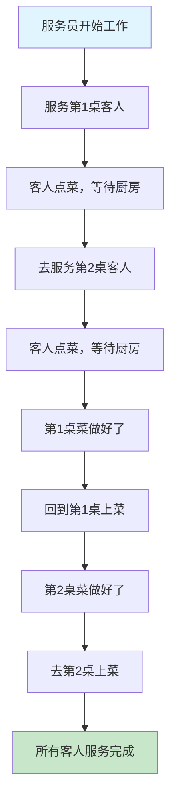

# P5I-Python_async异步编程完全指南-从协程到高并发的Python编程利器

## 📋 摘要

Python async（异步编程）是处理 I/O 密集型任务利器，通过协程实现非阻塞并发。用生活化比喻解释 async/await 核心概念，提供学生作业、网络爬虫、微服务应用场景，助力掌握并发编程

## 🎯 什么是异步编程？

想象一下**餐厅服务员**的工作方式：

- **同步方式**：服务员必须等一个客人点完菜、上完菜、结完账，才能服务下一个客人
- **异步方式**：服务员可以同时服务多桌客人，在等待厨房做菜时去服务其他客人

Python 的 async（异步编程）就是让程序像聪明的服务员一样，在等待 I/O 操作（网络请求、文件读写）时，可以同时处理其他任务。

## 🔄 异步编程执行流程

想象一下**餐厅服务员**同时服务多桌客人的过程：



**简单解释**：
- 服务员不用等一桌客人完全结束才服务下一桌
- 在等待厨房做菜时，可以去服务其他客人
- 这样效率更高，能同时服务多桌客人

## 🚀 基础语法入门

### 1. 定义异步函数

```python
import asyncio  # 导入异步编程模块

# 定义异步函数（协程）
async def say_hello():
    """异步函数示例 - 适用水平：小白"""
    print("开始说你好")  # 打印开始信息
    await asyncio.sleep(1)  # 等待 1 秒（模拟耗时操作），await 表示等待
    print("你好，世界！")  # 等待完成后打印结果

# 运行协程
asyncio.run(say_hello())  # 启动异步程序
```

**运行结果示例**：
```
开始说你好
你好，世界！
```

**代码解释**：
- `import asyncio`：导入 Python 的异步编程模块
- `async def`：定义异步函数，返回协程对象（不是普通函数）
- `await`：等待异步操作完成，期间可以执行其他任务
- `asyncio.sleep(1)`：异步等待 1 秒，不阻塞其他协程
- `asyncio.run()`：运行协程的主函数，创建事件循环

**运行结果说明**：
- 程序会先打印"开始说你好"
- 然后等待 1 秒钟（期间不打印任何内容）
- 1 秒后打印"你好，世界！"
- 程序结束

### 2. 并发执行多个协程

```python
import asyncio  # 导入异步编程模块

async def download_file(filename, delay):
    """模拟文件下载 - 适用水平：小白"""
    print(f"开始下载 {filename}")  # 打印开始下载信息
    await asyncio.sleep(delay)  # 等待指定时间（模拟下载时间）
    print(f"{filename} 下载完成")  # 打印下载完成信息
    return f"{filename} 的内容"  # 返回下载的内容

async def main():
    """主函数 - 适用水平：小白"""
    print("开始并发下载")  # 打印开始信息
    
    # 并发执行多个下载任务
    results = await asyncio.gather(  # gather 函数可以同时运行多个协程
        download_file("文件1.txt", 2),  # 下载文件1，需要2秒
        download_file("文件2.txt", 1),  # 下载文件2，需要1秒
        download_file("文件3.txt", 3)   # 下载文件3，需要3秒
    )
    
    print("所有文件下载完成：", results)  # 打印所有结果

# 运行程序
asyncio.run(main())  # 启动主函数
```

**执行结果**：
```
开始并发下载
开始下载 文件1.txt
开始下载 文件2.txt
开始下载 文件3.txt
文件2.txt 下载完成
文件1.txt 下载完成
文件3.txt 下载完成
所有文件下载完成： ['文件1.txt 的内容', '文件2.txt 的内容', '文件3.txt 的内容']
```

**代码解释**：
- `asyncio.gather()`：同时运行多个协程，等待所有协程完成
- `return`：函数返回结果
- `results`：存储所有协程的返回结果
- 注意：文件2 最先完成（1秒），然后是文件1（2秒），最后是文件3（3秒）

## 🎯 实际应用场景

### 场景一：学生作业管理系统（小白适用）

```python
import asyncio  # 导入异步编程模块
import random   # 导入随机数模块

async def check_homework(student_name, subject):
    """检查学生作业 - 适用水平：小白"""
    print(f"开始检查 {student_name} 的 {subject} 作业")  # 打印开始检查信息
    
    # 模拟检查时间（随机 1-3 秒）
    check_time = random.uniform(1, 3)  # 生成 1-3 之间的随机小数
    await asyncio.sleep(check_time)    # 等待随机时间（模拟检查耗时）
    
    # 模拟检查结果
    score = random.randint(60, 100)    # 生成 60-100 之间的随机整数作为分数
    print(f"{student_name} 的 {subject} 作业检查完成，得分：{score}")  # 打印检查结果
    
    return {  # 返回字典格式的结果
        "学生": student_name,  # 学生姓名
        "科目": subject,      # 科目名称
        "得分": score         # 得分
    }

async def batch_check_homework():
    """批量检查作业 - 适用水平：小白"""
    students = ["张三", "李四", "王五"]  # 学生名单
    subjects = ["数学", "语文", "英语"]  # 科目名单
    
    print("开始批量检查作业")  # 打印开始信息
    
    # 创建所有检查任务
    tasks = []  # 创建空列表存储任务
    for student in students:      # 遍历每个学生
        for subject in subjects:  # 遍历每个科目
            task = check_homework(student, subject)  # 创建检查任务
            tasks.append(task)    # 将任务添加到列表中
    
    # 并发执行所有检查任务
    results = await asyncio.gather(*tasks)  # 同时执行所有任务，*tasks 表示展开列表
    
    print("\n所有作业检查完成！")  # 打印完成信息
    for result in results:  # 遍历所有结果
        print(f"{result['学生']} - {result['科目']}: {result['得分']}分")  # 打印每个结果

# 运行程序
asyncio.run(batch_check_homework())  # 启动批量检查函数
```

**运行结果示例**：
```
开始批量检查作业
开始检查 张三 的 数学 作业
开始检查 张三 的 语文 作业
开始检查 张三 的 英语 作业
开始检查 李四 的 数学 作业
开始检查 李四 的 语文 作业
开始检查 李四 的 英语 作业
开始检查 王五 的 数学 作业
开始检查 王五 的 语文 作业
开始检查 王五 的 英语 作业
张三 的 语文 作业检查完成，得分：85
李四 的 数学 作业检查完成，得分：92
张三 的 数学 作业检查完成，得分：78
王五 的 英语 作业检查完成，得分：88
李四 的 英语 作业检查完成，得分：95
张三 的 英语 作业检查完成，得分：82
王五 的 数学 作业检查完成，得分：90
李四 的 语文 作业检查完成，得分：87
王五 的 语文 作业检查完成，得分：93

所有作业检查完成！
张三 - 数学: 78分
张三 - 语文: 85分
张三 - 英语: 82分
李四 - 数学: 92分
李四 - 语文: 87分
李四 - 英语: 95分
王五 - 数学: 90分
王五 - 语文: 93分
王五 - 英语: 88分
```

**适用水平**：小白（零基础）
**核心价值**：理解异步编程的基本概念，学会使用 `async/await` 和 `asyncio.gather()`

**代码解释**：
- `random.uniform(1, 3)`：生成 1-3 之间的随机小数
- `random.randint(60, 100)`：生成 60-100 之间的随机整数
- `tasks = []`：创建空列表存储任务
- `tasks.append(task)`：将任务添加到列表中
- `*tasks`：展开列表，将列表中的每个元素作为单独的参数传递
- `for result in results`：遍历所有结果
- `result['学生']`：从字典中获取学生姓名

**运行结果说明**：
- 所有检查任务同时开始，但完成时间不同（因为随机等待时间）
- 可以看到检查完成的顺序是随机的，不是按照开始顺序
- 最后统一显示所有学生的成绩汇总

## ⚠️ 常见问题与解决方案

### 问题一：忘记使用 await

```python
# ❌ 错误写法
async def wrong_example():
    result = asyncio.sleep(1)  # 没有 await，这行代码会立即执行
    print("这行代码会立即执行")  # 不会等待 1 秒

# ✅ 正确写法
async def correct_example():
    await asyncio.sleep(1)  # 使用 await，等待 1 秒
    print("这行代码会等待 1 秒后执行")  # 等待完成后才执行
```

**原因**：不使用 `await` 会返回协程对象而不是执行结果

### 问题二：在非异步函数中使用 await

```python
# ❌ 错误写法
def sync_function():
    await asyncio.sleep(1)  # 语法错误：await 只能在 async 函数中使用

# ✅ 正确写法
async def async_function():
    await asyncio.sleep(1)  # 正确：在 async 函数中使用 await
```

**原因**：`await` 只能在 `async` 函数中使用

## 🎯 最佳实践建议

### 1. 选择合适的应用场景

| 场景类型 | 是否适合异步 | 原因 |
|----------|-------------|------|
| **网络请求** | ✅ 非常适合 | I/O 密集型，等待时间长 |
| **文件读写** | ✅ 适合 | I/O 操作，可以并发处理 |
| **数据库查询** | ✅ 适合 | 网络 I/O，等待数据库响应 |
| **CPU 计算** | ❌ 不适合 | CPU 密集型，异步无法提升性能 |
| **图像处理** | ❌ 不适合 | CPU 密集型，需要多进程 |

## 📚 学习路径建议

### 小白（零基础）
1. 理解同步 vs 异步的基本概念
2. 学会使用 `async def` 和 `await`
3. 掌握 `asyncio.run()` 的基本用法
4. 练习简单的并发任务

### 初级开发者
1. 深入学习 `asyncio.gather()` 和 `asyncio.create_task()`
2. 掌握异步上下文管理器
3. 学习异步网络编程（aiohttp）
4. 理解事件循环的工作原理

## 🎉 总结

Python async（异步编程）是现代 Python 开发的重要技能，通过协程实现高效的并发处理。从餐厅服务员的比喻到学生作业系统的应用，异步编程让程序能够"一心多用"，在等待 I/O 操作时处理其他任务。

掌握 async/await 语法、理解事件循环机制、学会并发任务管理，你就能编写出高效、响应迅速的 Python 程序。

**继续深入学习异步编程，让 Python 程序飞起来！** 🚀

---

**厦门工学院人工智能创作坊 -- 郑恩赐**  
**2025 年 10 月 19 日**
