# Python 学习路线完全指南 - 从零基础到精通的编程技能养成计划

## 📝 摘要

Python 完整学习路线涵盖基础语法到高级特性全流程，通过五阶段循序渐进：基础语法、数据结构、函数模块、面向对象、高级特性。系统掌握 Python 核心技能，全面提升编程能力。

## 🗺️ Python 完整学习路线图

```mermaid
graph TD
    Start["Python 学习路线图"]
    
    P1["第一阶段：基础语法<br/>(10-14天)"]
    P1A["了解 Python 特点和版本"]
    P1B["安装 Python 和开发环境<br/>IDE（PyCharm/VS Code）"]
    P1C["变量：整数、浮点数、布尔值"]
    P1D["字符串：创建、拼接、格式化"]
    P1E["运算符：算术、比较、逻辑、赋值"]
    P1F["条件语句：if、elif、else、嵌套"]
    P1G["循环语句：for 遍历、while 循环"]
    P1H["循环控制：break、continue、else"]
    P1I["输入输出：print、input、格式化输出"]
    P1J["注释：单行、多行、文档字符串"]
    
    P2["第二阶段：数据结构<br/>(10-14天)"]
    P2A["列表 List：创建、索引、切片"]
    P2B["列表操作：增删改查、排序、反转"]
    P2C["元组 Tuple：创建、不可变性"]
    P2D["字典 Dictionary：键值对、创建、访问"]
    P2E["字典操作：增删改查、遍历、嵌套"]
    P2F["集合 Set：创建、去重、集合运算"]
    P2G["字符串方法：split、join、strip、replace"]
    P2H["字符串格式化：format、f-string"]
    P2I["正则表达式 re：模式匹配、搜索、替换"]
    P2J["collections：namedtuple、defaultdict、Counter"]
    P2K["collections：deque、OrderedDict"]
    
    P3["第三阶段：函数与模块<br/>(10-14天)"]
    P3A["函数定义：def、参数、返回值"]
    P3B["参数类型：位置参数、关键字参数"]
    P3C["默认参数、可变参数、关键字参数"]
    P3D["作用域：全局变量、局部变量"]
    P3E["Lambda 表达式：匿名函数"]
    P3F["内置函数：map、filter、reduce"]
    P3G["模块导入：import、from...import"]
    P3H["标准库：os、sys、datetime、random"]
    P3I["包 Package：__init__.py、__all__"]
    P3J["JSON 模块：序列化与反序列化"]
    P3K["pathlib 模块：现代化路径处理"]
    P3L["itertools 模块：permutations、combinations、cycle、chain"]
    P3M["itertools 模块：groupby 分组迭代"]
    P3N["functools 模块：partial、wraps、lru_cache"]
    P3O["functools 模块：total_ordering 比较运算符"]
    P3P["typing 类型注解：List、Dict、Optional、Union、Callable"]
    
    P4["第四阶段：面向对象<br/>(12-16天)"]
    P4A["类 Class：定义、属性、方法"]
    P4B["对象 Object：实例化、属性访问"]
    P4C["封装：私有属性、属性装饰器"]
    P4D["继承：单继承、多重继承、super"]
    P4E["多态：方法重写、鸭子类型"]
    P4F["特殊方法：__init__、__str__、__repr__"]
    P4G["异常处理：try、except、finally、else"]
    P4H["自定义异常：raise、Exception 类"]
    P4I["文件操作：open、read、write、with"]
    P4J["上下文管理器：__enter__、__exit__"]
    P4K["property 属性：@property、setter、deleter"]
    P4L["__slots__：类属性限制"]
    P4M["enum 枚举类型：定义和使用枚举"]
    P4N["dataclass 数据类：@dataclass 装饰器"]
    P4O["抽象基类 ABC：abc.ABC、@abstractmethod"]
    P4P["with 语句进阶：多个上下文管理器"]
    
    P5["第五阶段：高级特性<br/>(12-16天)"]
    P5A["装饰器：函数装饰器、类装饰器"]
    P5B["生成器：yield、生成器表达式"]
    P5C["迭代器：iter、next、可迭代对象"]
    P5D["推导式：列表、字典、集合推导式"]
    P5E["yield from：生成器委派"]
    P5F["描述符协议：__get__、__set__、__delete__"]
    P5G["多线程：threading、锁、队列"]
    P5H["多进程：multiprocessing、进程池"]
    P5I["异步编程：async、await、asyncio"]
    P5J["pickle 模块：对象序列化"]
    
    Start --> P1
    P1 --> P1A --> P1B --> P1C --> P1D --> P1E --> P1F --> P1G --> P1H --> P1I --> P1J
    P1J --> P2
    P2 --> P2A --> P2B --> P2C --> P2D --> P2E --> P2F --> P2G --> P2H --> P2I --> P2J --> P2K
    P2K --> P3
    P3 --> P3A --> P3B --> P3C --> P3D --> P3E --> P3F --> P3G --> P3H --> P3I --> P3J --> P3K --> P3L --> P3M --> P3N --> P3O --> P3P
    P3P --> P4
    P4 --> P4A --> P4B --> P4C --> P4D --> P4E --> P4F --> P4G --> P4H --> P4I --> P4J --> P4K --> P4L --> P4M --> P4N --> P4O --> P4P
    P4P --> P5
    P5 --> P5A --> P5B --> P5C --> P5D --> P5E --> P5F --> P5G --> P5H --> P5I --> P5J
    
    style Start fill:#e3f2fd,stroke:#1976d2,stroke-width:3px
    style P1 fill:#e1f5fe,stroke:#0288d1
    style P2 fill:#e8f5e9,stroke:#388e3c
    style P3 fill:#fff3e0,stroke:#f57c00
    style P4 fill:#f3e5f5,stroke:#7b1fa2
    style P5 fill:#ffebee,stroke:#d32f2f
```

## 📚 参考资料

### 第一阶段：基础语法

**官方文档**：
- Python 官方文档：https://docs.python.org/zh-cn/3/
- Python 教程 - 官方中文版：https://docs.python.org/zh-cn/3/tutorial/index.html

**在线教程**：
- Python 教程 - 廖雪峰：https://www.liaoxuefeng.com/wiki/1016959663602400
- Python 3 教程 - 菜鸟教程：https://www.runoob.com/python3/python3-tutorial.html
- Python 入门教程 - 莫烦 Python：https://mofanpy.com/tutorials/python-basic/

**在线练习**：
- Python Challenge：http://www.pythonchallenge.com/
- HackerRank Python：https://www.hackerrank.com/domains/python
- LeetCode Python 题目：https://leetcode.cn/problemset/all/

**推荐书籍**：
- 《Python 编程：从入门到实践》- Eric Matthes（适合零基础）
- 《Python 基础教程（第 3 版）》- Magnus Lie Hetland

---

### 第二阶段：数据结构

**官方文档**：
- Python 数据结构文档：https://docs.python.org/zh-cn/3/tutorial/datastructures.html
- 内置类型文档：https://docs.python.org/zh-cn/3/library/stdtypes.html
- 正则表达式 re 模块：https://docs.python.org/zh-cn/3/library/re.html
- collections 模块：https://docs.python.org/zh-cn/3/library/collections.html

**推荐书籍**：
- 《Python 数据结构与算法分析》- 布拉德利·米勒
- 《Python 算法教程》- Magnus Lie Hetland

**在线教程**：
- Python 数据结构 - Real Python：https://realpython.com/python-data-structures/
- Python 正则表达式教程：https://docs.python.org/zh-cn/3/howto/regex.html

---

### 第三阶段：函数与模块

**官方文档**：
- Python 函数文档：https://docs.python.org/zh-cn/3/tutorial/controlflow.html#defining-functions
- Python 模块文档：https://docs.python.org/zh-cn/3/tutorial/modules.html
- JSON 模块：https://docs.python.org/zh-cn/3/library/json.html
- pathlib 模块：https://docs.python.org/zh-cn/3/library/pathlib.html
- itertools 模块：https://docs.python.org/zh-cn/3/library/itertools.html（包含 permutations、combinations、cycle、chain、groupby 等）
- functools 模块：https://docs.python.org/zh-cn/3/library/functools.html（包含 partial、wraps、lru_cache、total_ordering 等）
- typing 模块：https://docs.python.org/zh-cn/3/library/typing.html（包含 List、Dict、Optional、Union、Callable 等）

**推荐书籍**：
- 《流畅的 Python》- Luciano Ramalho
- 《Effective Python：编写高质量 Python 代码的 59 个有效方法》- Brett Slatkin

**在线教程**：
- Python 函数详解 - Real Python：https://realpython.com/defining-your-own-python-function/
- Python 类型注解指南：https://docs.python.org/zh-cn/3/library/typing.html

---

### 第四阶段：面向对象

**官方文档**：
- Python 类文档：https://docs.python.org/zh-cn/3/tutorial/classes.html
- 异常处理文档：https://docs.python.org/zh-cn/3/tutorial/errors.html
- enum 模块：https://docs.python.org/zh-cn/3/library/enum.html
- dataclasses 模块：https://docs.python.org/zh-cn/3/library/dataclasses.html
- abc 抽象基类：https://docs.python.org/zh-cn/3/library/abc.html

**推荐书籍**：
- 《Python 面向对象编程指南》- Steven F. Lott
- 《Python 进阶》- 廖雪峰

**在线教程**：
- Python 面向对象编程 - Real Python：https://realpython.com/python3-object-oriented-programming/
- Python property 装饰器：https://docs.python.org/zh-cn/3/library/functions.html#property
- Python 描述符协议：https://docs.python.org/zh-cn/3/howto/descriptor.html

---

### 第五阶段：高级特性

**官方文档**：
- Python 装饰器：https://docs.python.org/zh-cn/3/glossary.html#term-decorator
- 生成器文档：https://docs.python.org/zh-cn/3/tutorial/classes.html#generators
- 并发编程：https://docs.python.org/zh-cn/3/library/concurrent.futures.html
- 描述符协议：https://docs.python.org/zh-cn/3/howto/descriptor.html
- pickle 模块：https://docs.python.org/zh-cn/3/library/pickle.html

**推荐书籍**：
- 《Python 高级编程》- Tarek Ziadé
- 《Python Cookbook 中文版》- David Beazley & Brian K. Jones

**工具推荐**：
- PyCharm（IDE 开发环境）
- VS Code（轻量级编辑器）
- Git（版本控制）

---

**厦门工学院人工智能创作坊 -- 郑恩赐**  
**2025 年 10 月 29 日**

