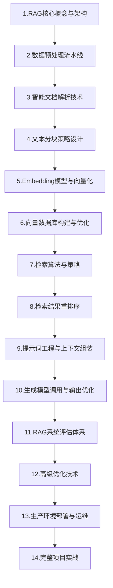

# RAG学习路线

## 1. RAG概述

在本文中，我们将一起探索RAG（检索增强生成）技术。RAG是将信息检索与大语言模型结合的技术框架，它能通过从外部知识库检索相关信息来增强模型输出的准确性、时效性和可溯源性，有效解决知识幻觉问题。我们发现这项技术在企业知识库、智能客服等场景中应用广泛。

## 2. 为什么需要学习RAG

我们发现大语言模型（LLM）存在一些固有缺陷，比如知识时效性滞后、幻觉问题频发、领域专业知识不足等。通过引入RAG技术，我们能够有效解决这些问题。在企业级应用中，我们将学会如何让AI系统实时访问最新数据、提供专业领域知识支撑、确保回答可追溯验证。RAG已成为智能客服、企业知识库、法律医疗助手等知识密集型场景的标配技术，掌握这项技术是我们作为AI开发者的核心能力要求。

## 3. 学习阶段概览

| 步骤 | 学习内容 | 关键技能与工具 |
|------|----------|----------------|
| 1 | RAG核心概念与架构 | RAG原理、检索器与生成器协同、架构设计 |
| 2 | 数据预处理流水线 | 数据清洗、格式转换、质量筛选、去重标准化 |
| 3 | 智能文档解析技术 | PDFplumber、LayoutParser、OCR、表格提取 |
| 4 | 文本分块策略设计 | 固定分块、递归分块、语义分块、滑动窗口 |
| 5 | Embedding模型与向量化 | BGE、M3E、OpenAI Embedding、向量维度选择 |
| 6 | 向量数据库构建与优化 | FAISS、Milvus、Chroma、HNSW索引、量化 |
| 7 | 检索算法与策略 | 稠密检索、稀疏检索、混合检索、多路召回 |
| 8 | 检索结果重排序 | Cross-Encoder、RRF、重排序模型微调 |
| 9 | 提示词工程与上下文组装 | RAG提示模板、上下文压缩、token优化 |
| 10 | 生成模型调用与输出优化 | GPT、Claude、Llama API调用、流式输出 |
| 11 | RAG系统评估体系 | 准确率、召回率、MRR、生成质量、人工评估 |
| 12 | 高级优化技术 | 查询重写、假设文档嵌入、Self-RAG、多跳检索 |
| 13 | 生产环境部署与运维 | Docker、K8s、监控、日志、性能优化 |
| 14 | 完整项目实战 | 企业知识库、智能客服、法律助手 |

