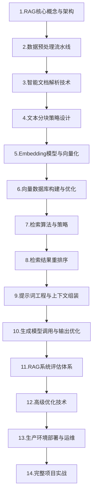

# RAG学习路线与文档链接目录

RAG（检索增强生成）技术学习路线与专栏文档链接目录

## 📋 专栏概述

RAG（检索增强生成）是将信息检索与大语言模型结合的技术框架，它能通过从外部知识库检索相关信息来增强模型输出的准确性、时效性和可溯源性，有效解决知识幻觉问题。本专栏基于最新技术趋势，涵盖RAG核心概念、数据预处理、向量化技术、检索算法、重排序优化以及大模型集成等关键技术，帮助开发者从入门到精通掌握企业级RAG应用开发。

> 📌 **文档更新说明**：本专栏文档会不定期更新，随着新文档的发布，将及时在下方链接目录中添加对应的在线文档链接。

## 1. 为什么需要学习RAG

我们发现大语言模型（LLM）存在一些固有缺陷，比如知识时效性滞后、幻觉问题频发、领域专业知识不足等。通过引入RAG技术，我们能够有效解决这些问题。在企业级应用中，我们将学会如何让AI系统实时访问最新数据、提供专业领域知识支撑、确保回答可追溯验证。RAG已成为智能客服、企业知识库、法律医疗助手等知识密集型场景的标配技术，掌握这项技术是我们作为AI开发者的核心能力要求。

## 2. 学习阶段概览

## 📚 专栏文档链接目录（按学习顺序排序）

### 01-RAG学习路线
- 掘金：[01-RAG学习路线](https://juejin.cn/post/7603673564908879907)
- CSDN：[01-RAG学习路线](https://blog.csdn.net/2301_79239314/article/details/157910168)

### 02-RAG核心概念与架构
- 掘金：[02-RAG核心概念与架构](https://juejin.cn/post/7604685644683984948)
- CSDN：[02-RAG核心概念与架构](https://blog.csdn.net/2301_79239314/article/details/157910258)

### 03-数据预处理流水线
- 掘金：[03-数据预处理流水线](https://juejin.cn/post/7605042079669927951)
- CSDN：[03-数据预处理流水线](https://blog.csdn.net/2301_79239314/article/details/157974263)

### 04-智能文档解析技术
- 掘金：[04. 智能文档解析技术](https://juejin.cn/post/7606136423072022574)
- CSDN：[04. 智能文档解析技术](https://blog.csdn.net/2301_79239314/article/details/158072521)

### 04a-LayoutParser安装指南
- 掘金：[04a. LayoutParser 安装指南](https://juejin.cn/post/7606136581062262811)
- CSDN：[04a. LayoutParser 安装指南](https://blog.csdn.net/2301_79239314/article/details/158045300)

### 05-文本分块策略设计
- 掘金：[05. 文本分块策略设计](https://juejin.cn/post/7606589625743130674)
- CSDN：[05. 文本分块策略设计](https://blog.csdn.net/2301_79239314/article/details/158156489)

### 06-Embedding模型与向量化
- 掘金：[06. Embedding模型与向量化](https://juejin.cn/post/7608760065668137010)
- CSDN：[06. Embedding模型与向量化](https://blog.csdn.net/2301_79239314/article/details/158289587)

### 07-向量数据库构建与优化
- 掘金：[07. 向量数据库构建与优化](https://juejin.cn/post/7610421035330961450)
- CSDN：[07. 向量数据库构建与优化](https://blog.csdn.net/2301_79239314/article/details/158369377)

### 08a-检索算法与策略-稠密检索技术
- 掘金：[08a. 检索算法与策略-稠密检索技术](https://juejin.cn/post/7611179521161248822)
- CSDN：[08a. 检索算法与策略-稠密检索技术](https://blog.csdn.net/2301_79239314/article/details/158469913)

### 08b-检索算法与策略-稀疏检索
- 掘金：[08b. 检索算法与策略-稀疏检索](https://juejin.cn/post/7614053051440300082)
- CSDN：[08b. 检索算法与策略-稀疏检索](https://blog.csdn.net/2301_79239314/article/details/158775460)

### 08c-检索算法与策略-混合检索
- 掘金：[08c. 检索算法与策略-混合检索](https://juejin.cn/post/7614084911990915110)
- CSDN：[08c. 检索算法与策略-混合检索](https://blog.csdn.net/2301_79239314/article/details/158805748)

### 08d-布隆过滤器是什么？
- 掘金：[08d. 布隆过滤器是什么？](https://juejin.cn/post/7618141138447466505)
- CSDN：[08d. 布隆过滤器是什么？](https://blog.csdn.net/2301_79239314/article/details/159207467)

### 09-检索结果重排序与优化-重排序基本原理
- 掘金：[09. 检索结果重排序与优化-重排序基本原理](https://juejin.cn/post/7614389567052677146)
- CSDN：[09. 检索结果重排序与优化-重排序基本原理](https://blog.csdn.net/2301_79239314/article/details/158806311)

### 10-重排序模型实战-BGE-Rerank应用
- 掘金：[10. 重排序模型实战-BGE-Rerank应用](https://juejin.cn/post/7614897667962126387)
- CSDN：[10. 重排序模型实战-BGE-Rerank应用](https://blog.csdn.net/2301_79239314/article/details/158841631)

### 11a-阿里云大模型API调用基础
- 掘金：[11a. 阿里云大模型API调用基础](https://juejin.cn/post/7615069320984477750)
- CSDN：[11a. 阿里云大模型API调用基础](https://blog.csdn.net/2301_79239314/article/details/158849545)

### 11b-OpenAI API密钥获取指南
- 掘金：[11b. OpenAI API密钥获取指南](https://juejin.cn/post/7615074260230799406)
- CSDN：[11b. OpenAI API密钥获取指南](https://blog.csdn.net/2301_79239314/article/details/158851617)

### 11c-Token智能压缩技术
- 掘金：[11c. Token智能压缩技术](https://juejin.cn/spost/7615446397371301938)
- CSDN：[11c. Token智能压缩技术](https://blog.csdn.net/2301_79239314/article/details/158892286)

---

最后更新时间：2026-03-18

