# 02-RAG核心概念与架构

## 1. 概述

本文系统讲解RAG技术原理与架构设计，涵盖基本概念、检索与生成模块、工作流程、技术栈选型及Naive到Modular的范式演进，为后续实践打下理论基础。

## 2. RAG基本概念

### 2.1 什么是检索增强生成

RAG（Retrieval-Augmented Generation，检索增强生成）是一种将信息检索技术与生成式大语言模型相结合的AI框架。其核心思想是在模型生成回答前，先从外部知识库中检索相关信息，将检索结果作为上下文输入给大语言模型，从而生成更准确、更可靠的回答。简单理解，RAG = 检索技术 + LLM提示。

### 2.2 RAG与传统LLM的区别

传统LLM（Large Language Model，大语言模型）完全依赖训练数据中的参数化知识，存在知识时效性滞后、无法获取最新信息、容易产生幻觉等问题。RAG通过引入外部知识库，实现了知识的动态更新，回答可溯源验证，大幅降低了模型编造事实的概率。

### 2.3 RAG的核心价值

RAG的核心价值在于解决大语言模型的三大痛点：知识时效性不足、幻觉问题频发、领域专业知识缺失。通过实时检索外部知识，RAG让AI系统能够访问最新数据、提供专业领域支撑、确保回答准确可溯源，成为企业级AI应用的标配技术。

## 3. RAG核心架构

### 3.1 架构整体概览

RAG架构主要由两大核心模块组成：检索模块（Retriever）和生成模块（Generator）。我们将学习检索模块如何从知识库中找到相关信息，以及生成模块如何利用这些信息生成回答。两个模块通过融合机制协同工作，形成完整的RAG系统。

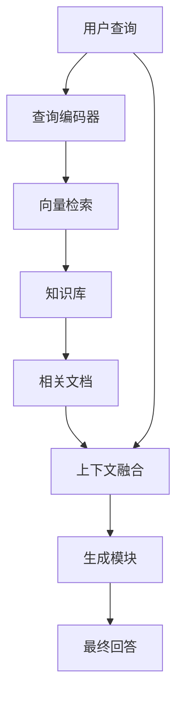

### 3.2 检索模块

检索模块负责从外部知识库中检索与用户查询相关的文档片段。我们通常会使用嵌入模型（Embedding Model）将查询和文档转化为向量，通过计算向量相似度来召回最相关的内容。检索方式包括稀疏检索（如BM25）和稠密检索（如向量相似度搜索），也可以结合两者进行混合检索。

### 3.3 生成模块

生成模块基于检索到的信息生成最终回答。我们通常使用大语言模型（LLM，Large Language Model）作为生成器，将用户查询与检索结果拼接为上下文输入，由模型生成连贯、准确的回答。生成模块不仅依赖检索知识，还会结合模型自身的语言理解能力进行创作。

### 3.4 融合机制

融合机制负责将检索结果与生成过程有效结合。我们通常会将检索到的文档片段按照相关性排序，提取关键信息后拼接到提示词（Prompt）中，作为上下文输入给大语言模型。良好的融合机制能够最大化利用检索知识，同时保持生成内容的流畅性和可读性。

## 4. 检索模块详解

### 4.1 查询编码器

查询编码器（Query Encoder）是检索模块的入口组件，负责将用户的自然语言查询转换为稠密向量表示。我们将学习查询编码器的核心工作原理及其在RAG系统中的关键作用。

**为什么要转换为向量？** 计算机无法直接理解原始文本的语义，只能处理数值数据。将文本转换为向量（这一过程称为 Embedding，嵌入）的核心目的是将人类可读的文本映射到机器可计算的数值空间。转换后的向量使语义相似性度量成为可能——我们可以通过计算向量之间的距离或夹角来判断两段文本在语义上的接近程度。例如，"机器学习"和"人工智能"的向量在高维空间中距离很近，而"机器学习"和"苹果"的向量距离很远。只有完成这种转换，我们才能在大规模数据中进行高效的相似度检索，将用户查询与知识库中的相关内容进行匹配。

查询编码器通常基于Transformer架构的预训练语言模型，如BERT（Bidirectional Encoder Representations from Transformers，双向编码器表示）或其变体。当用户输入问题"什么是机器学习？"时，查询编码器会将其编码为一个固定维度（如768维）的向量，这个向量捕获了查询的语义信息。

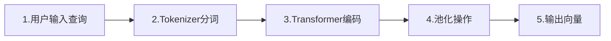

主流查询编码器模型包括：

| 模型名称 | 架构特点 | 适用场景 |
|---------|---------|---------|
| BERT | 双向Transformer，12-24层 | 通用语义编码 |
| ELECTRA | 判别式预训练，轻量高效 | 实时检索场景 |
| Contriever | 对比学习训练，无监督 | 零样本检索 |
| bge-large | 中英双语优化 | 中文RAG应用 |

查询编码器的选择直接影响检索质量。我们需要根据具体应用场景权衡模型的精度与推理速度，对于高并发系统，通常选用轻量级模型如ELECTRA-small；对于追求精度的场景，则可选用更大规模的模型。

### 4.2 文档编码器

文档编码器（Document Encoder）负责将外部知识库中的文档转换为向量表示，构建可检索的向量索引。我们将学习文档编码的技术实现和索引构建策略。

文档编码器与查询编码器通常采用双塔模型（Bi-Encoder）架构，两者共享相同的向量空间。这种设计的优势在于查询和文档可以独立编码，文档向量可预先计算并存储，检索时只需编码查询，大幅提升检索效率。

文档编码的关键步骤包括：
- 文档分块（Chunking）：将长文档切分为适当长度的文本片段
- 文本清洗：去除无关标记、统一编码格式
- 向量化编码：使用文档编码器生成向量
- 索引存储：将向量写入向量数据库

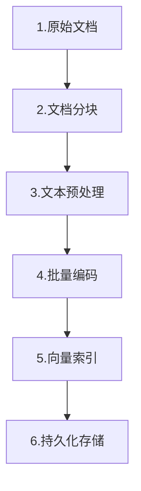

**Bi-Encoder 是什么？有什么用？** Bi-Encoder（双塔编码器）就像一个「速配筛选系统」。想象你在一个巨大的相亲数据库里找人：系统先把每个人的资料（文档）提前转换成一张「特征卡片」（向量）存起来；当你输入择偶条件（查询）时，系统快速把你的条件也转换成卡片，然后和你库存里的卡片做对比，秒级找出最匹配的前100人。它的核心价值是**快**——提前算好、快速匹配，适合从海量数据中快速召回候选。

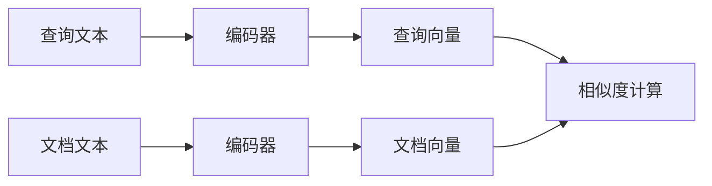

**Cross-Encoder 是什么？有什么用？** Cross-Encoder（交叉编码器）就像一个「深度面试官」。它不看预存的卡片，而是把求职者和岗位需求放在一起深度交流——逐字逐句分析双方的匹配度，判断「这个人到底适不适合这个岗位」。它的核心价值是**准**——通过深度交互判断真实相关性，但处理速度慢。所以实际应用是：先用 Bi-Encoder 快速筛选出100个候选人，再用 Cross-Encoder 精确排序，挑出最靠谱的前10个。

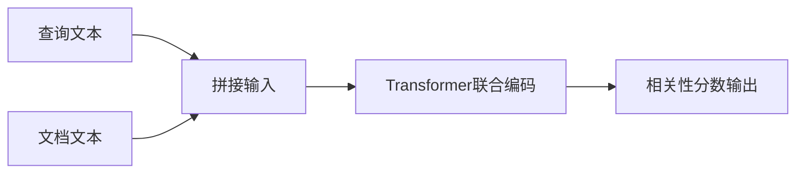

**一句话总结**：Bi-Encoder 是「快速海选」，Cross-Encoder 是「精准复选」，两者配合才能既快又准。

Cross-Encoder与Bi-Encoder的对比：

| 特性 | Bi-Encoder | Cross-Encoder |
|------|-----------|---------------|
| 架构 | 双塔独立编码 | 联合编码 |
| 计算复杂度 | O(n)，适合大规模检索 | O(n²)，适合重排序 |
| 精度 | 中等 | 高 |
| 典型应用 | 召回阶段 | 精排阶段 |

在实际RAG系统中，我们通常采用两阶段策略：先用Bi-Encoder快速召回Top-K候选，再用Cross-Encoder进行精确重排序，在效率与精度之间取得平衡。

### 4.3 相似度计算

相似度计算是检索模块的核心算法，决定了如何从海量向量中找出最相关的文档。我们将学习常用的向量相似度度量方法及其数学原理。

余弦相似度（Cosine Similarity）是最常用的相似度度量方法，它通过计算两个向量夹角的余弦值来评估相似度。余弦相似度关注向量的方向而非长度，取值范围为[-1, 1]，值越接近1表示越相似。

$$cosine(A, B) = \frac{A \cdot B}{\|A\| \|B\|} = \frac{\sum_{i=1}^{n} A_i B_i}{\sqrt{\sum_{i=1}^{n} A_i^2} \sqrt{\sum_{i=1}^{n} B_i^2}}$$

常用相似度计算方法对比：

| 方法名称 | 计算公式 | 特点 | 适用场景 |
|---------|---------|------|---------|
| 余弦相似度 | 向量夹角余弦 | 忽略向量长度，关注方向 | 文本语义匹配 |
| 点积（IP） | $$A \cdot B = \sum A_i B_i$$ | 考虑向量长度 | 已归一化向量 |
| 欧氏距离（L2） | $$\sqrt{\sum(A_i - B_i)^2}$$ | 计算空间直线距离 | 数值型数据 |
| 曼哈顿距离 | $$\sum\|A_i - B_i\|$$ | 计算网格路径距离 | 高维稀疏向量 |

在实际应用中，我们需要根据向量特性选择合适的相似度算法。对于经过归一化的 Embedding 向量，点积与余弦相似度等价；对于需要区分向量强度的场景，欧氏距离往往更合适。

近似最近邻（ANN，Approximate Nearest Neighbor）算法是支撑大规模向量检索的核心技术。常见ANN算法包括：
- HNSW（Hierarchical Navigable Small World）：基于图结构的多层索引，查询速度快
- IVF（Inverted File Index）：倒排索引，适合亿级规模数据
- LSH（Locality Sensitive Hashing）：局部敏感哈希，内存占用小

### 4.4 向量数据库

向量数据库（Vector Database）是专门用于存储和检索高维向量的数据库系统。我们将学习主流向量数据库的特性对比和选型建议。

向量数据库的核心能力包括：高效向量存储、近似最近邻搜索、元数据过滤、分布式扩展。与传统关系型数据库不同，向量数据库针对高维空间搜索进行了深度优化，能够在毫秒级响应时间内从亿级向量中找出最相似的Top-K结果。

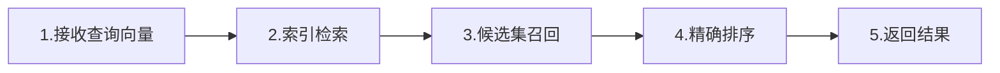

主流向量数据库对比：

| 数据库 | 架构特点 | 索引算法 | 适用场景 | 部署方式 |
|-------|---------|---------|---------|---------|
| Milvus | 分布式云原生 | HNSW/IVF/ANNOY | 十亿级规模企业应用 | 自托管/云托管 |
| Qdrant | Rust编写，高性能 | HNSW | 高并发实时检索 | 自托管/云服务 |
| Chroma | 轻量级，LLM原生 | 内存索引 | 原型开发、小规模应用 | 嵌入式 |
| Weaviate | 图+向量混合 | HNSW | 知识图谱、语义搜索 | 自托管/云托管 |
| Pinecone | 全托管服务 | 专有算法 | 快速上线、无运维 | 纯SaaS |
| pgvector | PostgreSQL扩展 | HNSW/IVF | 已有PG基础设施 | 插件扩展 |

选型建议：
- 大规模生产环境（千万级以上）：选择Milvus或Qdrant，具备优秀的扩展性和性能
- 快速原型验证：选择Chroma，API简洁，易于集成
- 已有PostgreSQL基础设施：使用pgvector扩展，降低运维复杂度
- 无运维团队：选择Pinecone等托管服务，专注业务开发

我们需要根据数据规模、查询QPS、延迟要求和运维能力综合评估，选择最适合业务场景的向量数据库解决方案。

## 5. 生成模块详解

### 5.1 上下文组装

上下文组装是生成模块的第一步，负责将用户查询与检索结果整合成适合大语言模型理解的输入格式。我们可以把它想象成「准备食材」——检索到的文档碎片是原材料，上下文组装就是按菜谱把它们切成合适的形状、摆放到正确的位置。

一个完整的上下文通常包含以下部分：
- **系统指令**：告诉模型应该扮演什么角色、遵循什么规则
- **检索上下文**：从知识库召回的相关文档片段
- **用户查询**：原始问题或请求
- **历史对话**（可选）：多轮对话时的上文记录

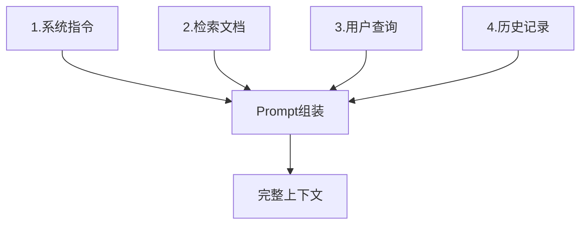

上下文组装的常用模式：

| 模式名称 | 适用场景 | 特点 |
|---------|---------|------|
| 直接拼接 | 单文档问答 | 简单直接，检索结果直接附加在问题后 |
| 多文档融合 | 需要综合多源信息 | 对多个片段排序去重，避免重复内容 |
| 结构化模板 | 复杂任务 | 使用XML/JSON格式标记不同内容块 |
| 动态截断 | 上下文长度受限 | 按相关性排序，优先保留高分片段 |

我们需要注意上下文长度限制。大多数大语言模型有固定的上下文窗口（如4K、8K、128K tokens），超出部分会被截断或导致错误。因此，在组装时要合理控制检索结果的数量和每个片段的长度，确保核心信息完整保留。

### 5.2 大语言模型选择

大语言模型（LLM）是生成模块的「大脑」，负责理解上下文并生成回答。选择合适的模型直接影响RAG系统的输出质量和成本。

**闭源商业模型 vs 开源模型**：

| 类型 | 代表模型 | 优势 | 劣势 |
|-----|---------|------|------|
| 闭源商业 | GPT-4o、Claude 3.7、Gemini | 性能领先、稳定性好 | 成本高、数据需外传 |
| 开源可部署 | Llama 3、Qwen、DeepSeek | 可控、隐私保护好 | 性能略逊、需自运维 |

**不同场景的模型选型建议**：

| 应用场景 | 推荐模型 | 理由 |
|---------|---------|------|
| 企业客服（高准确） | GPT-4o / Claude 3.7 Sonnet | 指令遵循能力强，幻觉率低 |
| 代码生成 | Claude 3.7 / DeepSeek-Coder | 代码理解和生成能力突出 |
| 长文档处理 | Gemini 1.5 Pro / Claude 3.7 | 支持超长上下文（百万级tokens） |
| 私有化部署 | Llama 3 / Qwen2.5 | 开源可本地部署，数据不出域 |
| 成本敏感场景 | GPT-4o-mini / Claude 3.5 Haiku | 性价比高，适合高并发 |

我们还需要考虑模型的推理部署方式：
- **API调用**：最简单，按需付费，适合快速验证
- **私有化部署**：使用vLLM、TGI等框架自建服务，适合大规模应用
- **边缘部署**：使用Llama.cpp等工具在CPU/移动设备运行，适合离线场景

### 5.3 输出生成策略

输出生成策略控制模型如何「组织语言」生成回答。我们可以把它理解为调节模型的「性格」——是严谨保守还是创意奔放。

**核心参数解析**：

| 参数 | 作用 | 典型值 | 适用场景 |
|-----|------|--------|---------|
| Temperature | 控制随机性 | 0.0-2.0 | 低值严谨，高值创意 |
| Top-p | 核采样阈值 | 0.1-1.0 | 控制候选词范围 |
| Top-k | 候选词数量 | 1-100 | 限制每步选择的词数 |
| Max Tokens | 最大生成长度 | 100-4000 | 控制回答篇幅 |

**Temperature（温度）** 是最关键的参数：
- **低温度（0.1-0.3）**：模型倾向选择概率最高的词，输出确定性强、事实准确，适合问答、摘要等任务
- **高温度（0.7-1.0）**：模型更愿意尝试低概率词，输出更有创意但可能偏离事实，适合写作、头脑风暴

**Top-p（核采样）** 与 Temperature 常配合使用：
- 先按累积概率筛选出最可能的前P比例词（如Top-p=0.9保留90%概率质量的词）
- 再在这些词中按 Temperature 采样

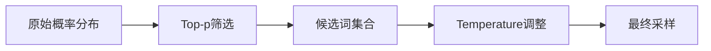

**RAG场景的参数建议**：
- **知识问答**：Temperature=0.1-0.3，Top-p=0.9，确保事实准确
- **内容创作**：Temperature=0.7-0.9，Top-p=0.95，增加创意空间
- **代码生成**：Temperature=0.0-0.2，Top-p=0.95，追求确定性

我们还可以通过提示词工程（Prompt Engineering）进一步引导输出：
- 明确要求「基于上述资料回答，不要编造」
- 指定输出格式（列表、JSON、Markdown等）
- 设置回答风格（简洁、详细、专业等）

综合运用这些策略，我们可以让RAG系统在保证准确性的同时，输出符合预期的高质量回答。

## 6. RAG工作流程

RAG系统的工作流程可以分为两大阶段：**离线准备阶段**（建库）和**在线服务阶段**（问答）。我们可以把它想象成开图书馆：离线阶段是「采购编目上架」，在线阶段是「读者查书借阅」。

### 6.1 离线阶段：知识库构建

离线阶段负责将原始数据加工成可供检索的向量知识库。这个阶段的任务是一次性或周期性执行，不需要实时处理。

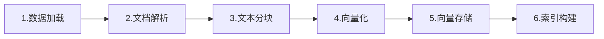

**各步骤详解**：

| 步骤 | 任务内容 | 关键技术 |
|-----|---------|---------|
| 数据加载 | 从多源获取原始数据 | 支持PDF、Word、网页、数据库等 |
| 文档解析 | 提取文本内容，去除格式噪音 | OCR、HTML解析、表格识别 |
| 文本分块 | 将长文档切分为语义完整的小块 | 按段落、语义、固定长度等策略 |
| 向量化 | 使用Embedding模型将文本转为向量 | BERT、bge等编码模型 |
| 向量存储 | 将向量写入向量数据库 | Milvus、Chroma、pgvector等 |
| 索引构建 | 构建ANN索引加速检索 | HNSW、IVF等算法 |

**文本分块策略对比**：

| 策略 | 优点 | 缺点 | 适用场景 |
|-----|------|------|---------|
| 固定长度 | 简单高效 | 可能切断语义 | 通用文档 |
| 按段落分割 | 保持语义完整 | 段落长短不一 | 文章、报告 |
| 语义分块 | 边界最合理 | 计算开销大 | 高质量要求 |
| 递归分块 | 兼顾大小粒度 | 实现复杂 | 多层级文档 |

### 6.2 在线阶段：检索与生成

在线阶段响应用户的实时查询，完成检索、增强、生成的完整链路。

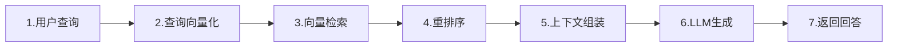

**各步骤详解**：

| 步骤 | 任务内容 | 关键技术 |
|-----|---------|---------|
| 查询向量化 | 将用户问题转为向量 | 与文档编码使用同一模型 |
| 向量检索 | 在向量库中找相似文档 | ANN近似最近邻搜索 |
| 重排序 | 对召回结果精排去重 | Cross-Encoder、RRF融合 |
| 上下文组装 | 拼接查询与检索结果 | Prompt工程、长度控制 |
| LLM生成 | 大模型基于上下文生成回答 | GPT、Claude等 |
| 返回回答 | 输出最终结果给用户 | 格式化、引用标注 |

### 6.3 完整流程串联

我们可以把整个RAG流程想象成「智能图书管理员」的工作：

1. **采购编目（离线）**：管理员先把各种书籍采购回来，拆分成章节，给每章打上标签（向量），整理到书架（向量库）上
2. **读者提问（在线）**：读者来问「有没有讲机器学习的书？」
3. **快速定位（检索）**：管理员把问题也转换成标签，快速找到标签相似的书架位置
4. **精选推荐（重排）**：从找到的书里挑出最相关的几本
5. **组织回答（生成）**：管理员看完这些书的相关章节，用自己的话给读者讲解

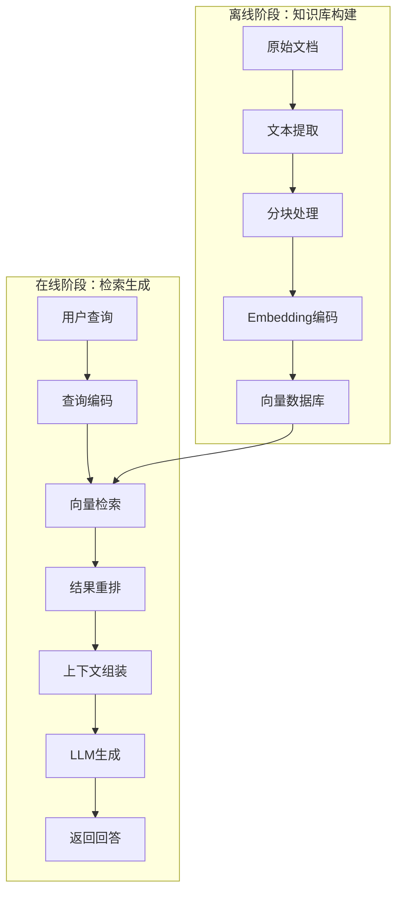

### 6.4 性能优化要点

在实际部署中，我们需要关注以下性能优化点：

| 优化方向 | 具体措施 | 效果 |
|---------|---------|------|
| 检索速度 | 使用HNSW索引、缓存热门查询 | 毫秒级响应 |
| 生成质量 | 多路召回融合、查询改写 | 提升准确率 |
| 成本控制 | 选择合适的模型、控制上下文长度 | 降低API费用 |
| 并发能力 | 向量数据库集群、模型推理加速 | 支持高并发 |

通过合理设计离线准备和在线服务的流程，我们可以搭建一个既准确又高效的RAG系统。

## 7. 技术栈组成

搭建RAG系统就像组装一台电脑，需要选择合适的「硬件」和「软件」组件。我们将RAG技术栈分为五层：开发框架层、嵌入模型层、向量数据库层、大语言模型层、部署运维层。

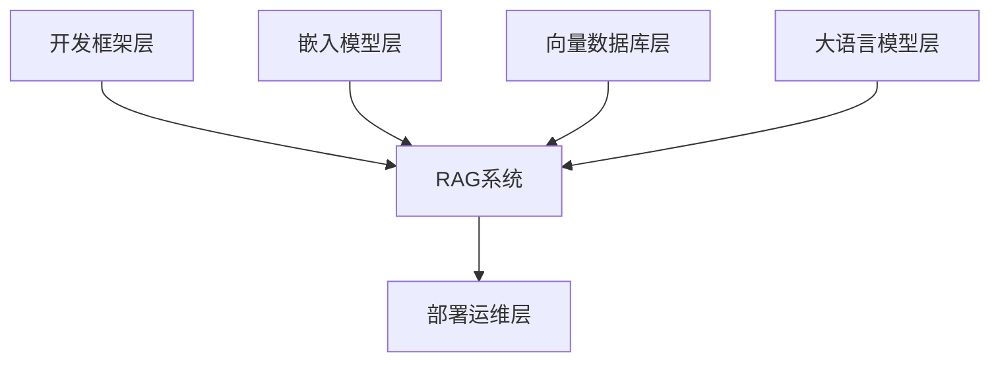

### 7.1 开发框架层

开发框架是RAG系统的「脚手架」，帮我们快速搭建应用骨架，避免从零写代码。

**主流框架对比**：

| 框架 | 定位 | 特点 | 适用场景 |
|-----|------|------|---------|
| LangChain | 通用LLM应用框架 | 生态最完善，组件丰富，像「瑞士军刀」 | 复杂工作流、Agent应用 |
| LlamaIndex | 专注数据索引与检索 | 数据处理能力强，索引策略灵活 | 企业知识库、文档检索 |
| Haystack | 端到端RAG框架 | 问答系统友好，可视化Pipeline | 搜索应用、问答机器人 |
| Dify | 低代码开发平台 | 界面友好，开箱即用 | 快速原型、业务人员使用 |

**选型建议**：
- 追求灵活性和生态 → LangChain
- 数据复杂、检索要求高 → LlamaIndex
- 快速上线、不想写代码 → Dify

### 7.2 嵌入模型层

嵌入模型负责把文本变成向量，是RAG的「翻译官」。

**主流模型对比**：

| 模型 | 维度 | 特点 | 适用场景 |
|-----|------|------|---------|
| text-embedding-3 (OpenAI) | 1536 | 精度高，API稳定 | 英文场景、追求效果 |
| bge-large-zh (BAAI) | 1024 | 中文优化，开源免费 | 中文RAG、成本敏感 |
| m3e-base (Moka) | 768 | 轻量快速 | 实时检索、资源受限 |
| GTE (Alibaba) | 768 | 多语言支持 | 多语言混合场景 |

**选型建议**：
- 中文业务首选 bge 系列，效果接近OpenAI但免费
- 高并发场景选择轻量级模型（768维）
- 多语言需求选择 GTE 或 text-embedding-3

### 7.3 向量数据库层

向量数据库是RAG的「记忆仓库」，存储和检索海量向量。

| 数据库 | 架构 | 特点 | 适用规模 |
|-------|------|------|---------|
| Milvus | 分布式 | 企业级，支持十亿级 | 大规模生产环境 |
| Qdrant | 云原生 | Rust编写，高性能 | 高并发实时应用 |
| Chroma | 嵌入式 | 轻量，易集成 | 原型开发、小规模 |
| pgvector | 插件式 | PostgreSQL扩展 | 已有PG基础设施 |
| Pinecone | SaaS | 全托管，零运维 | 快速上线、无运维团队 |

**选型建议**：
- 千万级以上数据 → Milvus
- 开发测试阶段 → Chroma
- 已有PostgreSQL → pgvector
- 不想运维 → Pinecone

### 7.4 大语言模型层

大语言模型是RAG的「大脑」，负责理解并生成回答。

| 模型 | 类型 | 特点 | 成本 |
|-----|------|------|------|
| GPT-4o | 闭源 | 综合能力最强 | 高 |
| Claude 3.7 | 闭源 | 长文本处理优秀 | 高 |
| Llama 3 | 开源 | 可私有化部署 | 低（自有算力） |
| Qwen2.5 | 开源 | 中文能力强 | 低 |
| DeepSeek | 开源 | 代码和推理强 | 低 |

**选型建议**：
- 追求最佳效果、预算充足 → GPT-4o / Claude
- 数据敏感、需本地化 → Llama 3 / Qwen
- 中文业务 → Qwen2.5 / DeepSeek
- 成本敏感 → GPT-4o-mini / 开源模型

### 7.5 部署运维层

部署运维工具保障RAG系统稳定运行。

| 工具类型 | 代表工具 | 作用 |
|---------|---------|------|
| 模型推理 | vLLM、TGI、SGLang | 加速LLM推理，提升吞吐 |
| 模型服务 | Ollama、Xinference | 本地模型部署管理 |
| 监控观测 | LangSmith、Langfuse | 追踪调用链路，评估效果 |
| API网关 | Kong、Nginx | 负载均衡，限流熔断 |

**完整技术栈示例**：

| 层级 | 技术选型 | 理由 |
|-----|---------|------|
| 开发框架 | LangChain | 生态完善，组件丰富 |
| 嵌入模型 | bge-large-zh | 中文优化，开源免费 |
| 向量数据库 | Milvus | 支持大规模，性能稳定 |
| 大语言模型 | GPT-4o + Qwen2.5 | 主用GPT-4o，敏感数据用Qwen |
| 部署运维 | vLLM + LangSmith | 高性能推理 + 效果监控 |

根据实际业务需求、预算和技术能力，我们可以灵活组合这些组件，搭建适合自己的RAG系统。

## 8. RAG演进范式

RAG技术不是一蹴而就的，而是经历了从简单到复杂、从固定到灵活的演进过程。我们可以把这三个范式理解为「手动挡汽车」的升级之路：Naive RAG 是「基础款」，能开但体验一般；Advanced RAG 是「升级版」，加了各种辅助功能；Modular RAG 则是「智能车」，可按需组装配置。

### 8.1 Naive RAG

Naive RAG（朴素RAG）是最基础的实现方式，就像「直来直去的问答」——用户提问，系统检索，然后直接生成答案。

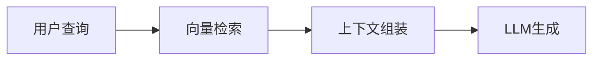

**核心流程**：
1. **索引阶段**：将文档分块、向量化、存入向量库
2. **检索阶段**：用用户查询匹配最相似的文档片段
3. **生成阶段**：把检索结果和查询拼在一起，丢给大模型生成答案

**优点**：
- 实现简单，代码量少，快速上线
- 架构清晰，易于理解和调试

**局限性**：
- 检索质量完全依赖向量相似度，容易「答非所问」
- 没有考虑查询理解、结果精排等环节
- 遇到复杂问题时，召回的上下文可能不够准确

**适用场景**：快速原型验证、简单问答场景、数据质量较高的知识库

### 8.2 Advanced RAG

Advanced RAG（高级RAG）在朴素RAG的基础上，增加了「检索前优化」和「检索后优化」两大环节。就像给汽车加了导航系统和自动驾驶辅助，开起来更稳更准。

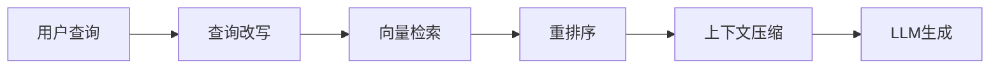

**检索前优化**：

| 技术 | 作用 | 通俗解释 |
|-----|------|---------|
| 查询改写 | 优化用户原始查询 | 把「怎么用」改成「使用教程和步骤」 |
| 查询扩展 | 生成多个相关查询 | 一个问题变三个，提高召回率 |
| 假设文档嵌入 | 让模型先生成答案再检索 | 「我猜答案是…，帮我找相关资料」 |

**检索后优化**：

| 技术 | 作用 | 通俗解释 |
|-----|------|---------|
| 重排序（Rerank） | 对召回结果二次精排 | 从100个里挑出最相关的10个 |
| 上下文压缩 | 去除冗余信息 | 把长文档浓缩成精华摘要 |
| 多路召回融合 | 结合多种检索方式 | 向量检索+关键词检索+知识图谱 |

**Advanced RAG 的核心价值**：
- **提高召回率**：查询改写和扩展能找到更多相关资料
- **提高准确率**：重排序和压缩确保送入模型的都是高质量内容
- **降低幻觉**：更好的上下文意味着更可靠的回答

### 8.3 Modular RAG

Modular RAG（模块化RAG）是当前最先进的范式，它将整个RAG系统拆分为独立的「功能模块」，像搭积木一样按需组合。就像智能手机的App，想用哪个功能就装哪个App，灵活定制。

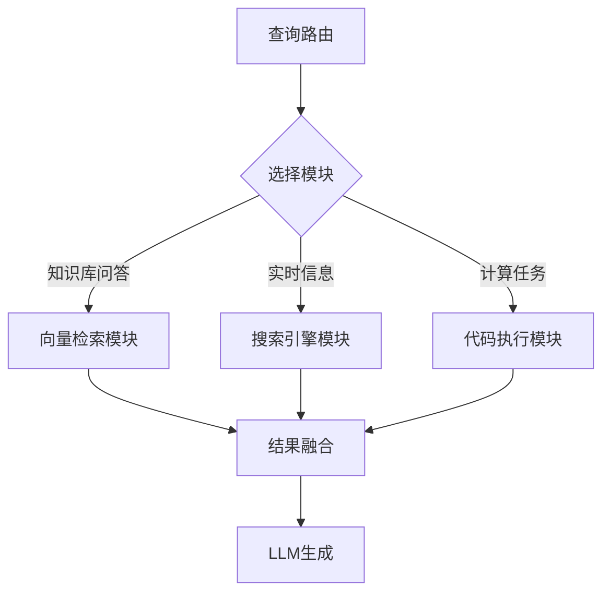

**Modular RAG 的核心特点**：

| 特点 | 说明 | 优势 |
|-----|------|------|
| 模块解耦 | 检索、生成、路由等独立成模块 | 易于替换和升级单个组件 |
| 动态路由 | 根据查询类型选择不同处理路径 | 复杂问题用多模块协作 |
| 递归迭代 | 支持多轮检索-生成循环 | 逐步逼近正确答案 |
| 工具调用 | 可调用外部API、数据库、搜索引擎 | 突破知识库边界 |

**三种范式对比**：

| 维度 | Naive RAG | Advanced RAG | Modular RAG |
|-----|-----------|--------------|-------------|
| 架构复杂度 | 简单 | 中等 | 复杂 |
| 检索策略 | 单次向量检索 | 多策略优化 | 动态路由选择 |
| 适用场景 | 简单问答 | 企业知识库 | 复杂Agent应用 |
| 开发成本 | 低 | 中 | 高 |
| 效果上限 | 有限 | 较好 | 最高 |

**演进趋势**：
- **2022-2023**：Naive RAG 为主，快速验证概念
- **2023-2024**：Advanced RAG 普及，检索质量大幅提升
- **2024-2025**：Modular RAG + Agentic RAG 兴起，向自主智能体演进

我们可以根据业务复杂度选择合适的范式：
- **MVP阶段** → Naive RAG，快速验证
- **生产阶段** → Advanced RAG，平衡效果与成本
- **复杂场景** → Modular RAG，追求极致体验

## 9. 总结

通过本文的学习，我们建立了RAG技术的完整认知框架。RAG的本质是「检索+生成」的协同：检索模块负责从知识库中找到相关信息，生成模块负责基于这些信息产生准确回答。

我们需要掌握三个核心要点：
- **原理层面**：理解向量化、相似度计算、检索策略的技术基础
- **架构层面**：熟悉检索模块、生成模块、融合机制的职责分工
- **实践层面**：能够根据场景选择合适的技术栈和演进范式

RAG技术正在从简单的检索增强向模块化、智能化的方向演进。掌握这些核心概念和架构设计，是我们构建企业级AI应用的基础能力。
