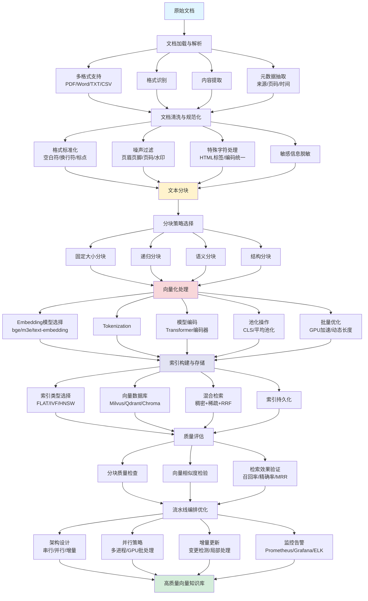

# 03-数据预处理流水线

## 1. 概述

本文系统讲解 RAG 数据预处理全流程，涵盖文档加载解析、清洗规范化、文本分块、向量化处理、索引构建及流水线优化等核心技术，助你构建高质量知识库。

本文档比较注重**概念原理的讲解和设计思路的分析**，通过伪代码和对比表格帮助你理解各环节的技术选型；后续文档将提供**可运行的实战代码和完整项目案例**，带你从理论走向落地。

### 1.1 数据预处理流水线全景图



**本文档将围绕上述流程图，从上游到下游逐步拆解每个环节的核心技术和最佳实践。** 我们将一起学习如何：
- 从 PDF、Word、HTML 等多种格式中准确提取内容
- 清洗噪声数据，保留有效语义信息
- 选择合适的分块策略，平衡检索精度与上下文完整性
- 利用 Embedding 模型将文本转为语义向量
- 构建高效的向量索引，实现毫秒级检索
- 设计可扩展的流水线架构，支持增量更新和监控告警

建议你在阅读时，**对照流程图定位当前学习阶段**，这将帮助你建立清晰的全局视野，理解各环节之间的依赖关系和数据流转逻辑。

## 2. 文档加载与解析

### 2.1 多源文档加载

在 RAG 实践中，我们需要处理多种格式的文档，常见文档类型包括：

| 文档类型 | 常用 Loader | 特点 |
|----------|-------------|------|
| PDF | PyPDFLoader、PDFPlumber | 支持文本提取，部分支持表格 |
| Word | Docx2txtLoader、UnstructuredWordLoader | 保留段落结构，支持元素模式 |
| 文本 | TextLoader | 简单文本，需指定编码 |
| CSV | CSVLoader | 按行或按列加载 |
| Markdown | UnstructuredMarkdownLoader | 保留标题层级结构 |
| HTML | UnstructuredHTMLLoader、BS4Loader | 需过滤标签和脚本 |

### 2.2 文档格式解析

我们需要理解，文档解析的核心是将不同格式的文件转换为统一的 Document 对象，包含 `page_content`（文本内容）和 `metadata`（元数据）。

**元数据（Metadata）** 是描述文档本身的附加信息，在 RAG 中用于增强检索的上下文相关性。常见元数据包括：

- **来源信息**：文件路径、URL、文档标题
- **位置信息**：页码、段落编号、章节标识
- **时间信息**：创建时间、更新时间
- **作者信息**：文档作者、发布者
- **类型标记**：文档类别、语言、格式

**解析流程：**

1. 识别文档格式，选择对应的 Loader
2. 调用 Loader 的 `load()` 方法解析文档
3. 对于大文件使用 `lazy_load()` 惰性加载，避免内存溢出
4. 提取文本内容和元数据（来源、页码、标题等）

### 2.3 内容提取与结构化

解析后的 Document 对象需要进一步结构化处理：

- **内容清洗**：去除页眉页脚、页码、水印等干扰信息
- **元数据补充**：添加文档来源、创建时间、作者等上下文信息
- **语义标记**：识别标题、段落、列表等结构元素
- **多模态处理**：对于包含图片的文档，提取图片 OCR 结果或描述

**伪代码示例：**

```python
def load_documents(file_path):
    """加载文档并提取元数据"""
    # 1. 识别文件类型
    file_type = detect_file_type(file_path)

    # 2. 选择对应 Loader
    loader = get_loader_by_type(file_type)

    # 3. 解析文档（大文件使用惰性加载）
    if file_size > threshold:
        documents = loader.lazy_load(file_path)
    else:
        documents = loader.load(file_path)

    # 4. 提取并增强元数据
    for doc in documents:
        doc.metadata["source"] = file_path
        doc.metadata["page"] = extract_page_number(doc)
        doc.metadata["file_type"] = file_type

    return documents
```

## 3. 文档清洗与规范化

### 3.1 格式标准化处理

我们需要将不同来源的文档统一到一致的格式规范，便于后续处理。

**主要标准化操作：**

| 操作 | 说明 | 示例 |
|------|------|------|
| **空白符规范化** | 将多个连续空格、制表符合并为单个空格 | `"  你好   世界"` → `"你好 世界"` |
| **换行符统一** | 将不同系统的换行符统一为 `\n` | `\r\n`、 `\r` → `\n` |
| **大小写转换** | 根据需求统一大小写 | `"Hello World"` → `"hello world"` |
| **标点规范化** | 统一全角/半角标点符号 | `"你好！"` → `"你好!"` |

### 3.2 噪声数据过滤

噪声数据会干扰我们对有效信息的提取，需要进行系统过滤。

**常见噪声类型及处理方法：**

| 噪声类型 | 识别特征 | 处理方法 |
|----------|----------|----------|
| **页眉页脚** | 每页重复出现的固定文本 | 正则匹配或位置识别后删除 |
| **页码** | 数字序列，通常位于页底 | 正则表达式 `^\d+$` 匹配移除 |
| **水印** | 半透明重复文字（如"样章"、"机密"） | OCR置信度过滤或模板匹配 |
| **广告信息** | 固定格式的推广文本 | 关键词匹配或分类模型识别 |
| **重复段落** | 文档内完全重复的内容块 | 哈希去重或相似度检测 |

### 3.3 特殊字符与编码处理

我们需要关注特殊字符和编码问题，因为它们会导致解析错误或信息丢失。

**处理策略：**

| 问题类型 | 处理方案 |
|----------|----------|
| **HTML标签** | 使用正则或 BeautifulSoup 提取纯文本 |
| **URL链接** | 保留或替换为占位符 `[URL]` |
| **表情符号** | 根据需求保留或移除（Unicode范围 `U+1F600-U+1F64F`） |
| **控制字符** | 删除不可打印字符（`\x00-\x1F`，保留 `\n\t`） |
| **编码统一** | 统一转换为同一种编码，通常是 UTF-8，同时处理 BOM 头 |

**编码规范化流程：**

1. **检测编码**：使用 `chardet` 等库检测原始编码
2. **解码转码**：按检测到的编码解码，再编码为 UTF-8
3. **BOM处理**：移除 UTF-8 BOM 头（`\xef\xbb\xbf`）
4. **Unicode规范化**：使用 NFC 形式统一字符表示

> **BOM（Byte Order Mark，字节顺序标记）** 是放置在文本文件开头的特殊字符序列（UTF-8 中为 `\xef\xbb\xbf`），用于标识文件的编码格式和字节序。部分 Windows 编辑器会在保存 UTF-8 文件时自动添加 BOM，但这可能导致某些解析器识别错误，因此我们通常需要移除。
>
> **不可打印字符** 是指在文本中无法直接显示为可见符号的字符，主要包括 ASCII 控制字符（0-31）和部分扩展字符。常见的有换行（`\n`）、回车（`\r`）、制表符（`\t`）、空字符（`\x00`）等。这些字符用于控制格式或设备行为，而非显示文本内容。

### 3.4 元数据提取与保留

我们在清洗过程中需要保留和补充文档的元数据信息。

**元数据清洗原则：**

- **完整性检查**：确保关键字段（来源、页码）不缺失
- **格式校验**：日期格式统一，通常为 ISO 8601（`YYYY-MM-DD`）
- **一致性校验**：文档总页数与实际提取页数核对
- **敏感信息过滤**：去除个人隐私信息（手机号、身份证号）

**伪代码示例：**

```python
def clean_document(doc):
    """文档清洗主函数"""
    text = doc.page_content
    metadata = doc.metadata

    # 1. 格式标准化
    text = normalize_whitespace(text)      # 空白符规范化
    text = unify_line_breaks(text)         # 换行符统一
    text = normalize_punctuation(text)     # 标点规范化

    # 2. 噪声过滤
    text = remove_headers_footers(text, metadata.get("page"))  # 去除页眉页脚
    text = remove_page_numbers(text)       # 去除页码
    text = remove_urls(text, replace="[URL]")  # URL处理

    # 3. 特殊字符处理
    text = strip_html_tags(text)           # 去除HTML标签
    text = remove_control_chars(text)      # 去除控制字符
    text = normalize_unicode(text, form="NFC")  # Unicode规范化

    # 4. 元数据更新
    metadata["cleaned"] = True
    metadata["char_count"] = len(text)
    metadata["word_count"] = len(text.split())

    return Document(page_content=text, metadata=metadata)
```

## 4. 文本分块策略

### 4.1 为什么要文档分块

我们需要理解，文档分块是将长文档切分为适当大小的文本片段的过程，这是 RAG 系统的关键环节。

**分块的必要性：**

| 限制因素 | 说明 |
|----------|------|
| **Embedding 模型输入限制** | 大多数 Embedding 模型有最大输入长度（如 512 tokens），超长文本会被截断 |
| **向量检索精度** | 长文档的向量表示会稀释关键信息，导致检索时匹配度下降 |
| **上下文窗口限制** | LLM 的上下文长度有限，需要将最相关的片段送入模型 |
| **检索粒度** | 细粒度分块能精准定位答案所在片段，避免无关信息干扰 |

**我们的核心目标**：在保证语义完整性的前提下，将文档切分为大小适中、信息密度高的片段，使检索系统能够精准召回我们需要的上下文。

### 4.2 固定大小分块

我们将学习固定大小分块，这是最直观的方法，按预定义的字符数或 Token 数切分文本，相邻块之间保留重叠部分。

**为什么需要重叠部分？**

当文本在块的边界处被切断时，跨越边界的关键信息可能会丢失。例如，如果问题涉及的内容恰好在两个块的交界附近，没有重叠会导致检索时只召回一个片段，上下文不完整。通过设置重叠区域（如前块的末尾与后块的开头共享部分内容），我们可以确保关键信息在至少一个块中保持完整。

**实现方式：**

| 参数 | 说明 | 典型值 |
|------|------|--------|
| chunk_size | 每个块的最大字符数 | 500-1000 |
| chunk_overlap | 相邻块重叠字符数 | 50-100（约10%-20%） |

**优点：**
- 实现简单，批量处理效率高
- 块大小一致，便于向量化批处理

**缺点：**
- 可能切断句子或语义单元
- 关键信息可能分散在不同块中

### 4.3 递归分块

我们将使用递归分块，它通过分层分隔符进行迭代分割，优先保留文本结构。

**分隔符优先级（从高到低）：**

```
段落分隔（\n\n）→ 换行（\n）→ 句子（。！？）→ 空格 → 字符
```

**分块流程：**

1. 先用高优先级分隔符（如段落）分割
2. 若块大小超过限制，使用次优先级分隔符继续分割
3. 重复直到所有块符合大小要求

**优点：**
- 优先保持段落、句子边界
- 适应不同结构层级的文档

### 4.4 语义分块

我们将学习语义分块，它根据文本语义相似度动态确定分块边界，而非固定长度。

**实现原理：**

1. 将文本按句子或语义单元预分割
2. 计算相邻单元的 Embedding 向量余弦相似度
3. 当相似度低于阈值时，创建新分块边界

**关键参数：**

| 参数 | 说明 | 典型值 |
|------|------|--------|
| similarity_threshold | 相似度阈值 | 0.7-0.85 |
| max_chunk_size | 最大块大小限制 | 1000-2000 |

**优点：**
- 分块边界符合语义变化
- 检索时上下文相关性更高

**缺点：**
- 需要多次调用 Embedding 模型，计算成本高
- 处理速度较慢

### 4.5 基于文档结构的分块

我们需要利用文档内在结构（标题、章节、段落）进行分块，这适合结构化文档。

**适用场景：**

| 文档类型 | 分块依据 | 示例 |
|----------|----------|------|
| Markdown | 标题层级（# ## ###） | 按二级标题分块 |
| HTML | 标签结构（`<h1>` `<section>`） | 按 section 分块 |
| JSON | 对象或数组元素 | 按顶层 key 分块 |
| 代码文件 | 函数、类定义 | 按函数/类分块 |

**优点：**
- 保留文档逻辑结构
- 元数据可直接提取（标题作为摘要）

### 4.6 分块大小与重叠度优化

我们需要理解，分块大小直接影响检索质量和生成效果。

**分块大小的影响：**

| 块大小 | 检索效果 | 生成效果 | 适用场景 |
|--------|----------|----------|----------|
| 小（<300） | 精准度高 | 上下文不足 | 事实性问答 |
| 中（300-800） | 平衡 | 平衡 | 通用场景 |
| 大（>800） | 精准度低 | 上下文丰富 | 摘要、长文档理解 |

**重叠度设置原则：**

- **作用**：保持块间上下文连续性，避免信息割裂
- **推荐值**：块大小的 10%-20%
- **注意事项**：过大会增加存储成本和冗余

**伪代码示例：**

```python
def recursive_split(text, separators=["\n\n", "\n", "。", " "], chunk_size=500, overlap=50):
    """递归分块实现"""
    # 优先尝试高优先级分隔符
    for sep in separators:
        chunks = text.split(sep)
        
        # 合并小片段
        result = []
        current = ""
        for chunk in chunks:
            if len(current) + len(chunk) < chunk_size:
                current += sep + chunk if current else chunk
            else:
                if current:
                    result.append(current)
                current = chunk
        if current:
            result.append(current)
        
        # 检查是否所有块都符合大小要求
        if all(len(c) <= chunk_size for c in result):
            return add_overlap(result, overlap)
    
    # 最后手段：强制切分
    return fixed_size_split(text, chunk_size, overlap)


def semantic_split(sentences, embedder, threshold=0.8):
    """语义分块实现"""
    chunks = []
    current_chunk = [sentences[0]]
    
    for i in range(1, len(sentences)):
        # 计算相邻句子相似度
        prev_vec = embedder.encode(sentences[i-1])
        curr_vec = embedder.encode(sentences[i])
        similarity = cosine_similarity(prev_vec, curr_vec)
        
        if similarity < threshold:
            # 相似度低于阈值，开始新块
            chunks.append(" ".join(current_chunk))
            current_chunk = [sentences[i]]
        else:
            current_chunk.append(sentences[i])
    
    if current_chunk:
        chunks.append(" ".join(current_chunk))
    
    return chunks
```

### 4.7 分块策略选择指南

| 场景 | 推荐策略 | 理由 |
|------|----------|------|
| 快速验证/MVP | 固定大小分块 | 实现简单，无需调参 |
| 结构化文档（论文、报告） | 递归分块 | 保持段落和句子边界 |
| 高质量检索要求 | 语义分块 | 语义边界准确，检索精准 |
| 代码仓库 | 基于结构分块 | 按函数/类组织，逻辑清晰 |
| 多类型混合数据 | 分层策略 | 根据文档类型动态选择 |

## 5. 向量化处理

在进入具体技术之前，我们需要理解什么是 Embedding 模型以及为什么要使用它。

**什么是 Embedding 模型？**

Embedding 模型是一种"翻译官"，它将人类可读的文本转换为计算机能理解的数字向量。我们可以把它想象成一个"语义地图"——在这个地图上，意义相近的词会被放置在相近的位置。例如，"机器学习"和"人工智能"的向量距离很近，而"机器学习"和"苹果"的距离很远。

**为什么需要使用 Embedding？**

| 原因 | 说明 |
|------|------|
| **计算机只能处理数字** | 计算机无法直接理解文字，必须将文本转换为数值形式才能进行计算 |
| **捕捉语义关系** | 向量可以表达词语间的语义相似性，如"国王-男人+女人≈女王" |
| **支持相似度计算** | 通过计算向量距离（如余弦相似度），我们可以量化文本间的相似程度 |
| **高效检索** | 将文档和查询都转为向量后，可以在高维空间中快速找到最相似的文档 |

在 RAG 系统中，Embedding 是连接用户查询与知识库的桥梁——只有将两者都转换为同一向量空间中的表示，我们才能实现语义检索。

### 5.1 Embedding 模型选择

我们需要根据场景选择合适的 Embedding 模型，将文本转换为向量表示。

**主流模型对比：**

| 模型 | 维度 | 最大长度 | 特点 | 适用场景 |
|------|------|----------|------|----------|
| bge-large-zh | 1024 | 512 tokens | 中文优化，开源免费 | 中文 RAG 首选 |
| m3e-base | 768 | 512 tokens | 轻量快速 | 高并发、资源受限 |
| text-embedding-3 | 1536 | 8192 tokens | 多语言，精度高 | 英文、多语言场景 |
| GTE | 768 | 512 tokens | 阿里出品，中文友好 | 中英文混合 |

**选型建议：**
- 中文业务首选 bge-large-zh，效果接近 OpenAI 且免费
- 高并发场景选择 768 维轻量模型（m3e、GTE）
- 长文档处理选择支持长上下文的模型（text-embedding-3）

### 5.2 文本向量化方法

我们将学习如何将文本块转换为向量。

**向量化流程：**

1. **文本预处理**：添加指令前缀（部分模型需要，如 `"Represent this sentence for retrieval: {text}"`）
2. **Tokenization**：将文本切分为模型可识别的 token（词或子词）。例如 "机器学习" 可能被切分为 `["机器", "学习"]` 或 `["机", "器", "学", "习"]`

   > **为什么需要切分？** 模型有固定的词汇表（如 30,000 个 token），无法直接处理任意文字。通过切分，我们将文本映射为词汇表中的索引，模型才能进行计算。
   >
   > **子词切分的好处**：平衡词汇表大小和表达能力。例如 "机器学习" 和 "深度学习" 都包含 "学习"，子词切分能让模型理解它们的关联性；而纯字符切分会丢失语义，纯词语切分会导致词汇表过大。
3. **模型编码**：通过 Transformer 编码器生成向量表示。我们可以把 Transformer 想象成一位"阅读理解专家"，它读取切分后的每个 token，理解词义以及词与词之间的关系（如"机器学习"中"机器"和"学习"的关联）。最终，每个词都会被转换成对应的向量。

   **向量是什么样的？** 每个向量是一个由实数构成的数组（如 bge-large 模型生成 1024 维向量），数值通常在 -1 到 1 之间。例如：
   ```
   "机器" → [0.23, -0.56, 0.89, ..., 0.12]  （共1024个数字）
   "学习" → [0.45, -0.12, 0.67, ..., -0.34] （共1024个数字）
   ```

   **向量之间的关联**：语义相近的词，其向量在空间中距离更近。例如"机器"和"设备"的向量相似度（余弦相似度）可能为 0.85，而"机器"和"苹果"的相似度可能只有 0.12。

4. **池化操作**：将多个词向量合并为一个句子向量。上一步我们得到的是一组向量（每个词一个），但我们需要用一个向量表示整句话。常用的合并方法：
   - **CLS token**：在句子开头放一个特殊标记 `[CLS]`（意思是 Classification，分类标记），模型经过训练后会理解这个标记需要"总结整句话的意思"。最终我们直接取 `[CLS]` 对应的向量作为句子表示，就像让这个特殊标记"代表"整句话

  **示例**：句子 "机器学习很神奇"
  
  Token 序列：`[CLS]` `机器` `学习` `很` `神奇`
  
  对应向量：　`[0.2, -0.5, ...]` `[0.3, 0.1, ...]` `[0.5, -0.2, ...]` ...
  
  取 `[CLS]` 的向量 `[0.2, -0.5, ...]` 作为整句话的表示
   - **平均池化**：将所有词的向量取平均，得到句子向量

  **示例**：句子 "机器学习"

  Token 向量：
  - `机器` → `[0.2, 0.4, 0.6]`
  - `学习` → `[0.3, 0.5, 0.7]`

  平均池化计算：
  - 第1维：(0.2 + 0.3) / 2 = **0.25**
  - 第2维：(0.4 + 0.5) / 2 = **0.45**
  - 第3维：(0.6 + 0.7) / 2 = **0.65**

  句子向量：`[0.25, 0.45, 0.65]`

**两种方法对比：**

| 方法 | 优点 | 缺点 | 适用场景 |
|------|------|------|----------|
| **CLS token** | 模型专门训练用于总结句子，效果稳定 | 依赖训练目标，对长文本可能效果下降 | 短文本、分类任务 |
| **平均池化** | 简单有效，利用所有词信息，对长文本友好 | 所有词权重相同，可能受噪声词影响 | 通用场景，长文本 |

实际应用中，平均池化通常表现更好，因为它利用了全部词的信息，而 CLS token 只是一个"总结者"。

**相似度计算方法：**

| 方法 | 公式 | 适用场景 |
|------|------|----------|
| 余弦相似度 | 向量夹角余弦值 | 通用，关注语义方向 |
| 点积 | 向量对应位置相乘求和 | 已归一化向量，计算更快 |

### 5.3 批量向量化优化

我们需要对大量文本进行向量化时，批量处理能显著提升效率。

**优化策略：**

| 策略 | 说明 | 效果 |
|------|------|------|
| **批处理** | 单次处理 32-64 条文本 | 减少 GPU 启动开销，提升吞吐 |
| **动态长度** | 按长度分组，减少填充 | 避免短句被填充到最大长度 |
| **GPU 加速** | 使用 CUDA 推理 | 比 CPU 快 10-50 倍 |
| **模型量化** | 使用 FP16 或 INT8 | 减少显存占用，速度提升 |

**伪代码示例：**

```python
def batch_embed(chunks, batch_size=32):
    """批量向量化"""
    model = load_embedding_model()
    embeddings = []
    
    for i in range(0, len(chunks), batch_size):
        batch = chunks[i:i + batch_size]
        
        # 添加指令前缀（如模型需要）
        texts = [f"Represent: {text}" for text in batch]
        
        # 批量编码
        vectors = model.encode(texts, convert_to_tensor=True)
        embeddings.extend(vectors)
    
    return embeddings
```

### 5.4 向量维度与精度权衡

我们需要在向量维度和计算资源之间做权衡。

**维度的影响：**

| 维度 | 特点 | 适用场景 |
|------|------|----------|
| 低维（<512） | 存储小、速度快，但区分能力弱 | 内存敏感、实时性要求高 |
| 中维（512-1024） | 平衡选择 | 大多数 RAG 场景 |
| 高维（>1024） | 区分能力强，但存储和计算成本高 | 高精度要求、复杂语义匹配 |

**精度优化：**

- **向量归一化**：将向量长度归一化为 1，使点积等价于余弦相似度。我们需要归一化，是因为向量的"长度"（模长）会干扰相似度判断——一个很长的向量和一个很短的向量可能方向完全相同（语义相似），但点积结果却差异很大。归一化后，我们只看"方向"（语义），不看"长度"（词的数量）。
- **量化存储**：使用 FP16 替代 FP32，存储减少 50%，精度损失微小
- **降维**：使用 PCA（Principal Component Analysis，主成分分析）将高维向量压缩到低维（如 1024→256）。PCA 是一种"提取主要成分"的降维方法——它找到数据中变化最大的方向（主成分），只保留这些关键信息，舍弃次要细节。就像把一张 3D 照片投影到 2D 平面上，我们丢失了深度，但保留了主要视觉信息。适用于大规模检索场景，可显著减少存储和计算开销。

## 6. 索引构建与存储

### 6.1 为什么需要索引

在向量化之后，我们需要解决一个关键问题：**如何快速从海量向量中找到最相似的向量？**

假设我们有 100 万个文档向量，要找到与查询向量最相似的 10 个。如果没有索引，我们需要计算查询向量与这 100 万个向量的相似度，然后排序取前 10——这就像在一本没有目录的书中找一个知识点，必须逐页翻阅，时间复杂度为 O(n)。

**索引的作用**就像书的目录，它能让我们快速定位到可能相关的区域，而无需遍历全部数据。通过构建特殊的数据结构（如 HNSW 图结构或 IVF 倒排索引），我们可以将查询时间从线性降低到对数甚至常数级别，同时保证较高的准确率。

### 6.2 向量索引类型选择

我们需要根据数据规模和性能要求选择合适的索引类型。

| 索引类型 | 原理 | 优点 | 缺点 | 适用场景 |
|----------|------|------|------|----------|
| **FLAT** | 暴力搜索，遍历所有向量计算相似度 | 精度100%，实现简单 | 数据量大时检索慢 | 数据量小（<1万）、精度要求极高 |
| **IVF** | 倒排文件，将向量空间划分为多个簇，先找最近簇再搜索 | 平衡速度和精度 | 需要调参，可能遗漏跨簇相似向量 | 中等规模数据（1万-100万） |
| **HNSW** | 分层图结构，上层粗筛、下层精确定位 | 查询速度快，精度高 | 内存占用大，构建较慢 | 大规模数据（>10万）、高并发 |

**选型建议：**
- 原型验证阶段 → FLAT
- 生产环境中等规模 → IVF
- 大规模高并发 → HNSW

### 6.2 索引构建流程

**构建步骤：**

1. **数据准备**：整理向量数据和对应元数据
2. **选择索引类型**：根据数据规模和查询需求选择
3. **参数配置**：设置维度、距离度量方式、索引参数（如 HNSW 的 M、efConstruction）
4. **批量插入**：将向量批量写入索引
5. **索引持久化**：保存到磁盘，便于重启后加载

**伪代码示例：**

```python
def build_index(vectors, metadata, index_type="HNSW"):
    """构建向量索引"""
    # 1. 创建索引
    if index_type == "HNSW":
        index = create_hnsw_index(dim=1024, M=16, efConstruction=200)
    elif index_type == "IVF":
        index = create_ivf_index(dim=1024, nlist=100)
    else:
        index = create_flat_index(dim=1024)
    
    # 2. 批量添加向量
    index.add(vectors)
    
    # 3. 保存索引和元数据
    index.save("vectors.index")
    save_metadata(metadata, "metadata.json")
    
    return index
```

### 6.3 向量数据库选型

我们需要根据业务场景选择合适的向量数据库。

| 数据库 | 架构 | 索引支持 | 适用规模 | 特点 |
|--------|------|----------|----------|------|
| **Milvus** | 分布式 | HNSW/IVF/FLAT | 十亿级 | 企业级，功能全面 |
| **Qdrant** | 云原生 | HNSW | 千万级 | Rust编写，高性能 |
| **Chroma** | 嵌入式 | 内存索引 | 十万级 | 轻量，易集成 |
| **pgvector** | PostgreSQL扩展 | HNSW/IVF | 百万级 | 已有PG基础设施首选 |

**选型建议：**
- 大规模生产环境 → Milvus
- 快速原型开发 → Chroma
- 已有PostgreSQL → pgvector

### 6.4 混合检索策略

单一检索方式往往有局限，我们需要结合多种策略提升效果。

**稠密检索 vs 稀疏检索：**

我们可以把两种检索方式想象成两种不同的"图书管理员"：

| 检索方式 | 工作方式 | 优点 | 缺点 | 通俗类比 |
|----------|----------|------|------|----------|
| **稠密检索** | 把文档和查询都转成向量，计算向量相似度 | 理解语义，"苹果"能找到"iPhone" | 对精确词匹配不敏感，可能漏掉特定术语 | 理解型管理员：你问"怎么学习人工智能"，它还能找到讲"机器学习"的书 |
| **稀疏检索** | 基于关键词匹配（如 BM25），统计词频 | 精确匹配，一字不差 | 无法理解同义词，搜"AI"找不到"人工智能" | 严格型管理员：你搜"人工智能"，它只找包含这四个字的，多一字少一字都不行 |

**混合策略实现：**

1. **多路召回**：同时进行向量检索和关键词检索，取并集
2. **重排序融合**：用 RRF（Reciprocal Rank Fusion，倒数排名融合）融合多路结果。RRF 的核心思想是：一个文档在多个检索方式中都排名靠前，它就应该获得更高的最终分数。计算公式为 `分数 = 1/(k + 排名)`，其中 k 是常数（通常取 60）。
3. **权重调整**：根据场景调整稠密检索和稀疏检索的权重

**伪代码示例：**

```python
def hybrid_search(query, dense_index, sparse_index, top_k=10):
    """混合检索"""
    # 1. 查询向量化
    query_vec = embedder.encode(query)
    
    # 2. 稠密检索
    dense_results = dense_index.search(query_vec, top_k=20)
    
    # 3. 稀疏检索（关键词匹配）
    sparse_results = sparse_index.search(query, top_k=20)
    
    # 4. 结果融合（RRF）
    fused_results = reciprocal_rank_fusion(dense_results, sparse_results, k=60)
    
    return fused_results[:top_k]
```

## 7. 数据质量评估

### 7.1 分块质量评估指标

我们需要评估文本分块的质量，确保分块后的片段既完整又准确。

| 指标 | 说明 | 评估方法 |
|------|------|----------|
| **语义完整性** | 分块是否包含完整的语义单元 | 人工抽查或自动检测句子边界 |
| **信息密度** | 分块中有效信息的比例 | 计算停用词占比，过滤低质量片段 |
| **块大小分布** | 各分块长度是否均匀 | 统计分块长度的均值、方差 |
| **重叠合理性** | 相邻块重叠部分是否恰当 | 检查重叠区是否包含完整句子 |

### 7.2 向量相似度检验

我们需要验证向量化的质量，确保相似文本的向量距离确实较近。

**检验方法：**

1. **语义相似度测试**：准备已知语义相似的文本对（如"机器学习"和"深度学习"），验证它们的向量余弦相似度是否大于 0.8
2. **语义相异度测试**：准备已知语义无关的文本对（如"苹果"和"汽车"），验证它们的相似度是否小于 0.3
3. **自一致性测试**：同一文本多次向量化，结果向量应几乎相同（相似度 > 0.99）

### 7.3 检索效果验证

我们需要评估端到端的检索效果，确保系统能召回相关文档。

| 指标 | 公式 | 含义 |
|------|------|------|
| **召回率** | 检索到的相关文档 / 所有相关文档 | 衡量检索的全面性 |
| **精确率** | 检索到的相关文档 / 检索到的总文档 | 衡量检索的准确性 |
| **MRR** | 首个相关文档排名的倒数均值 | 衡量最佳结果的排序位置 |
| **命中率@K** | Top-K 中是否包含相关文档的比例 | 衡量前 K 个结果的质量 |

**验证流程：**

1. 准备测试集：包含查询 query 和标注的相关文档
2. 执行检索：对每个 query 检索 Top-K 结果
3. 计算指标：对比检索结果与标注，计算上述指标
4. 阈值判断：召回率 > 80%、精确率 > 70% 视为合格

## 8. 流水线编排与优化

### 8.1 流水线架构设计

我们需要设计合理的数据流水线架构，确保各环节高效协同。

**常见架构模式：**

| 模式 | 特点 | 适用场景 |
|------|------|----------|
| **串行流水线** | 按固定顺序执行：加载→清洗→分块→向量化→存储 | 小规模数据，流程简单 |
| **并行流水线** | 多个文档同时处理，提升吞吐 | 大规模数据，多核/GPU环境 |
| **增量流水线** | 只处理新增或变更的数据 | 持续更新场景 |
| **分布式流水线** | 多节点协作，水平扩展 | 超大规模数据 |

**推荐架构：**

对于中等规模（百万级文档）的 RAG 系统，推荐采用**并行+增量**的混合架构：

1. **主控节点**：负责任务调度、状态管理
2. **工作节点**：并行执行文档处理任务
3. **消息队列**：缓冲待处理任务，削峰填谷

### 8.2 并行化处理策略

我们需要充分利用多核 CPU 和 GPU 提升处理效率。

**并行策略：**

| 层级 | 并行方式 | 实现方式 |
|------|----------|----------|
| **文档级并行** | 多个文档同时处理 | 多进程/线程池 |
| **批次级并行** | 向量化时批量处理 | GPU 批处理 |
| **流水线并行** | 不同阶段的任务重叠执行 | 生产者-消费者模型 |

**注意事项：**

- **内存控制**：并行度不是越高越好，需根据可用内存调整
- **IO 瓶颈**：文档加载通常是 IO 密集型，可适当增加并行度
- **GPU 显存**：向量化时避免显存溢出，控制 batch size

### 8.3 增量更新机制

我们需要支持数据源的持续更新，避免全量重建索引。

**增量更新流程：**

1. **变更检测**：扫描数据源，识别新增、修改、删除的文件
2. **局部处理**：仅处理变更的文档
3. **索引更新**：向量库支持删除旧向量、插入新向量
4. **版本控制**：保留历史版本，支持回滚

**实现方案：**

- **文件级**：记录文件哈希，检测内容变更
- **时间戳级**：根据文件修改时间判断
- **事件驱动**：监听文件系统事件（如 inotify）

**伪代码示例：**

```python
def incremental_update(source_dir, pipeline, vector_store):
    """增量更新"""
    # 1. 扫描当前文件状态
    current_files = scan_with_hash(source_dir)
    
    # 2. 获取已索引文件状态
    indexed_files = vector_store.get_indexed_files()
    
    # 3. 计算差异
    to_add = current_files - indexed_files      # 新增
    to_update = detect_changed(current_files, indexed_files)  # 修改
    to_delete = indexed_files - current_files    # 删除
    
    # 4. 执行更新
    for file in to_delete:
        vector_store.delete_by_source(file)
    
    for file in to_add + to_update:
        chunks = pipeline.process(file)
        vector_store.insert(chunks)
```

### 8.4 监控与日志记录

我们需要建立完善的监控体系，及时发现和定位问题。

**监控指标：**

| 类别 | 指标 | 告警阈值 |
|------|------|----------|
| **性能** | 文档处理速度（docs/s）、向量化延迟 | 低于基线 20% |
| **资源** | CPU 使用率、内存占用、GPU 显存 | CPU > 90%，内存 > 80% |
| **质量** | 分块成功率、向量化失败率 | 失败率 > 1% |
| **数据** | 索引文档数、向量总数 | 异常波动 |

**日志规范：**

- **结构化日志**：使用 JSON 格式，便于分析
- **关键事件**：记录文档处理开始/结束、错误信息
- **追踪 ID**：为每个文档生成唯一 ID，便于全链路追踪

**常用工具：**

- **监控**：Prometheus + Grafana
- **日志**：ELK（Elasticsearch + Logstash + Kibana）
- **告警**：AlertManager

## 9. 总结

通过本章的学习，我们已经系统掌握了 RAG 数据预处理流水线的完整知识体系。让我们回顾这趟学习之旅的核心要点：

### 9.1 核心流程回顾

数据预处理流水线是连接原始数据与 RAG 系统的桥梁，我们将整个流程比喻为一条**"文档加工生产线"**：

| 阶段 | 作用 | 类比 |
|------|------|------|
| **文档加载** | 从多种格式中提取原始内容 | 原材料入库，识别并分类 |
| **文档清洗** | 去除噪声、统一格式 | 原材料去污、标准化处理 |
| **文本分块** | 将长文档切分为合适大小的片段 | 将大块原材料切割成标准件 |
| **向量化** | 将文本转换为计算机可理解的向量 | 给每个零件打上"数字身份标签" |
| **索引构建** | 建立高效检索的数据结构 | 建立仓库货架和目录系统 |

### 9.2 关键技术决策点

在实际项目中，我们需要根据场景做出明智选择：

**分块策略选择**：
- 快速原型 → 固定大小分块
- 结构化文档 → 递归分块
- 高质量检索 → 语义分块

**Embedding 模型选择**：
- 中文场景首选 **bge-large-zh**
- 高并发场景选择 **m3e** 或 **GTE**
- 长文档处理选择 **text-embedding-3**

**索引类型选择**：
- 原型验证 → FLAT
- 中等规模 → IVF
- 大规模生产 → HNSW

### 9.3 核心原则

经过本章的学习，我们应当牢记以下核心原则：

1. **质量优先**：数据质量决定 RAG 系统上限，预处理阶段投入再多精力都是值得的

2. **语义完整**：分块时要保证语义单元的完整性，避免在句子中间切断关键信息

3. **权衡取舍**：没有完美的方案，只有适合场景的方案。小分块检索精准但上下文不足，大分块上下文丰富但检索精度下降

4. **监控闭环**：建立完善的监控体系，用数据驱动优化，而非凭感觉调参

5. **迭代演进**：从简单方案开始，根据实际效果逐步优化，避免过度设计

### 9.4 后续学习路线

当前我们完成的**数据预处理流水线**只是 RAG 学习路线的第 2 步。在本专栏的后续文档中，我们将继续深入探索：

| 序号 | 文档主题 | 核心内容 |
|------|----------|----------|
| 3 | **智能文档解析技术** | PDF/Word 复杂布局解析、OCR 文字识别、表格提取技术 |
| 4 | **文本分块策略设计** | 更深入的语义分块、滑动窗口、自适应分块策略 |
| 5 | **Embedding 模型与向量化** | 模型微调、领域适配、多语言 Embedding 技术 |
| 6 | **向量数据库构建与优化** | FAISS 实战、Milvus 集群部署、索引优化技巧 |
| 7 | **检索算法与策略** | 稠密检索、稀疏检索、混合检索、多路召回策略 |
| 8 | **检索结果重排序** | Cross-Encoder 重排、RRF 融合算法、重排序模型微调 |
| 9 | **提示词工程与上下文组装** | RAG 专用提示模板、上下文压缩、Token 优化 |
| 10 | **生成模型调用与输出优化** | GPT/Claude/Llama API 调用、流式输出、输出格式化 |
| 11 | **RAG 系统评估体系** | 检索准确率、生成质量评估、端到端效果测试 |
| 12 | **高级优化技术** | 查询重写、假设文档嵌入、Self-RAG、多跳检索 |
| 13 | **生产环境部署与运维** | Docker 容器化、K8s 编排、监控告警、性能优化 |
| 14 | **完整项目实战** | 企业知识库、智能客服、法律助手等真实场景实战 |

记住，**好的数据预处理是 RAG 成功的一半**。当我们把原始数据转化为高质量、易检索的向量知识库时，就已经为后续的检索和生成奠定了坚实的基础。

希望本章的内容能够帮助你在实际项目中构建出高效、稳定的数据预处理流水线！请继续关注我们专栏的后续更新，一起完整掌握 RAG 技术体系。

