# 04. 智能文档解析技术

## 1. 概述

### 1.1 文档简介

本文档系统讲解智能文档解析技术——从传统规则到深度学习，涵盖版面分析、表格提取、复杂版式处理与多模态理解，助你掌握从PDF/图片到结构化数据的完整技术栈。

### 1.2 内容范围与前置知识

**本文档涉及的内容范围**

本文档内容涵盖广泛，横跨多个技术领域：

| 领域 | 涉及内容 | 难度 |
|------|----------|------|
| **计算机视觉** | 图像预处理、目标检测、语义分割、OCR | 中等 |
| **深度学习** | CNN、Transformer、多模态融合、预训练模型 | 较高 |
| **自然语言处理** | 文档理解、文本提取、LayoutLM | 中等 |
| **工程实践** | Python编程、开源工具使用、流水线搭建 | 入门 |

从传统基于规则的解析方法到现代深度学习方案，从单栏简单文档到复杂多栏混排，从纯文本提取到多模态视觉-语言融合——本文档试图为读者呈现智能文档解析技术的完整图景。

**建议读者具备的前置知识**

为充分理解本文档内容，建议读者具备以下基础：

| 知识领域 | 具体要求 | 重要性 |
|----------|----------|--------|
| **Python编程** | 熟悉基础语法、能阅读代码示例、了解NumPy/OpenCV基本操作 | ⭐⭐⭐ 必需 |
| **深度学习基础** | 了解神经网络、卷积、注意力机制等基本概念 | ⭐⭐⭐ 必需 |
| **PyTorch/TensorFlow** | 有简单的模型使用经验，能加载预训练模型进行推理 | ⭐⭐ 推荐 |
| **NLP基础** | 了解文本分词、嵌入向量、Transformer架构 | ⭐⭐ 推荐 |
| **计算机视觉** | 了解图像基本操作（灰度化、二值化、边缘检测等） | ⭐ 加分 |

**学习路径建议**

如果你发现部分内容难以理解，可以按以下顺序补充学习：

1. **基础薄弱**：先学习Python编程和深度学习入门（如吴恩达深度学习课程）
2. **CV不熟悉**：重点阅读第6章的图像预处理部分，同时学习OpenCV基础
3. **NLP不了解**：关注第6章的多模态融合概念，理解文本+视觉的联合建模思想
4. **工程经验少**：从第7章的开源工具实战开始，边用边学

本文档假设读者是希望构建RAG系统的开发者，文档解析是整个RAG流水线的第3步（见《01-RAG学习路线.md》）。如果你已经阅读了前两步的内容（RAG核心概念、数据预处理），将更容易理解本文档中技术选择的背景。

---

## 2. 文档解析技术演进

### 2.1 传统解析方法的局限

我们先回顾传统文档解析方法，理解其为何难以满足现代需求。

**基于规则的解析方式**：

传统工具（如 pdfminer、PyPDF2）依赖固定的坐标规则和启发式算法提取文本。它们假设文档具有简单的线性结构，按阅读顺序逐行读取。这种方式面对**复杂版式**（多栏混排、图文穿插）时，往往产生混乱的输出——文字顺序错乱、表格被拆碎、图片说明丢失。

**主要局限**：

| 局限 | 说明 | 典型失败场景 |
|------|------|--------------|
| **无版式理解** | 仅能提取文字，无法识别标题、段落、表格等元素类型 | 无法区分正文与页眉页脚 |
| **阅读顺序错乱** | 按存储顺序而非视觉顺序提取 | 双栏论文的左右栏内容混杂 |
| **表格解析困难** | 将表格简单转为文本，丢失结构信息 | 合并单元格被错误拆分 |
| **跨页处理弱** | 无法识别跨页表格或段落的连续性 | 表格跨页后被当作两个独立表 |

### 2.2 智能解析的核心能力

而随着深度学习技术的引入，使文档解析从**字符提取**跃升为**版式理解**。

**智能解析的四大核心能力**：

1. **版面元素检测**：识别页面中的标题、正文、图片、表格、页眉页脚等区域（目标检测任务）
2. **阅读顺序恢复**：基于视觉位置和语义逻辑重建正确的阅读流
3. **结构关系建模**：理解元素间的层级关系（如标题-正文-子标题）
4. **跨页语义关联**：识别跨页表格、连续段落的完整性

**技术对比**：

| 维度 | 传统解析 | 智能解析 |
|------|----------|----------|
| 核心方法 | 规则匹配 + 启发式算法 | 深度学习模型（CNN/Transformer） |
| 版式理解 | 无 | 精准识别元素类型和位置 |
| 复杂版式 | 容易失败 | 稳定处理多栏、图文混排 |
| 泛化能力 | 差（需针对每种版式调参） | 强（模型学习通用视觉特征） |

### 2.3 技术架构概览

现代智能文档解析系统通常采用**多阶段流水线**架构：


**关键技术栈**：

| 阶段 | 技术方案 | 代表模型/工具 | 作用说明 |
|------|----------|---------------|----------|
| **版面检测** | 目标检测 | Faster R-CNN、YOLO、Detectron2 | 像"框选工具"一样，在页面中定位标题、段落、图片、表格等元素的边界框 |
| **元素分类** | 图像分类 | ResNet、Vision Transformer | 判断每个检测到的区域是什么类型（是标题？还是正文？或是表格？） |
| **结构理解** | 图神经网络 / Transformer | LayoutLM、DocFormer | 理解元素间的层级关系，如"这个标题属于哪个章节"、"这段文字是哪个表格的说明" |
| **文本提取** | OCR | PaddleOCR、Tesseract、云端API | 将图像区域的文字转换为可编辑文本，或提取已有文本层的内容 |

**各阶段如何配合工作？**

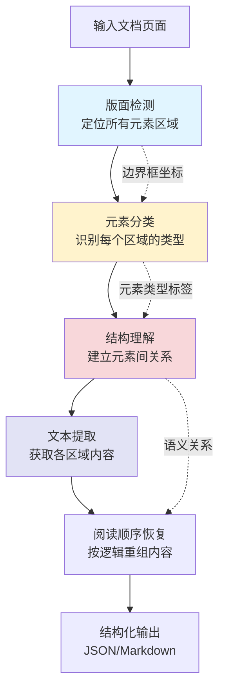

**配合示例**：

假设处理一篇学术论文页面：
1. **版面检测**发现3个区域：顶部矩形、中部大矩形、右下角矩形
2. **元素分类**判断：顶部是"标题"、中部是"正文段落"、右下角是"图表"
3. **结构理解**确定：标题是章节标题，正文属于该章节，图表是正文引用
4. **文本提取**读取各区域文字内容
5. **阅读顺序恢复**按"标题→正文→图表"逻辑重组，而非存储顺序

**主流开源框架**：

- **LayoutParser**：基于 Detectron2 的版面分析工具包
- **DocFormer**：融合视觉和文本的多模态预训练模型
- **PP-Structure**：PaddleOCR 的文档结构化套件

## 3. 文档布局分析技术

在上一章中，我们了解了智能文档解析的核心能力在于**版面理解**。本章我们将深入探讨如何实现这一能力——通过文档布局分析技术，让机器像人类一样"看懂"页面的结构。

### 3.1 布局分析的核心任务

我们可以把文档页面想象成一张复杂的拼图。布局分析先把碎片按类别整理好——这里是标题块，那里是正文区，还有图片和表格——然后再按正确顺序组装起来。

**三大核心任务**：

| 任务 | 说明 | 类比 |
|------|------|------|
| **区域定位** | 找出每个内容块的位置和边界 | 用画框工具圈出各个区域 |
| **类型识别** | 判断区域是什么元素（标题/正文/图片/表格） | 给每个框贴上标签 |
| **阅读顺序恢复** | 按视觉逻辑重组元素顺序 | 理清"先读什么后读什么" |

接下来，我们将依次学习完成这三个任务的关键技术和工具：首先介绍开箱即用的 **LayoutParser 框架**（3.2节），它集成了多种深度学习模型，帮助我们快速实现区域定位和类型识别；然后深入讲解**布局检测的技术原理**（3.3节），理解模型是如何"看懂"页面结构的；最后探讨**阅读顺序恢复算法**（3.4节），确保解析后的内容符合人类阅读逻辑。这三个环节环环相扣：先用 LayoutParser 检测出页面元素（3.2），理解其背后的深度学习机制（3.3），最后按正确顺序重组这些元素（3.4）。

### 3.2 LayoutParser 框架

**LayoutParser** 是一个开源的深度学习文档布局分析工具包，提供 PubLayNet 等预训练模型。

**📖 安装参考**：详细的安装步骤和平台适配方案，请参考：
- 《[LayoutParser 安装指南](https://blog.csdn.net/2301_79239314/article/details/158045300)》（CSDN）
- 《[LayoutParser 安装与配置详解](https://juejin.cn/post/7606136581062262811)》（掘金）

**⚠️ 注意**：LayoutParser 安装配置较为复杂，涉及 PyTorch、Detectron2 等深度学习框架的依赖。如果你想运行上述代码，建议先阅读安装指南完成环境配置。

**快速上手**：

```python
from layoutparser import LayoutParser

# 初始化 LayoutParser
lp = LayoutParser()

# 加载预训练模型（COCO 布局模型）
layout = lp.load_model("pretrained_models/coco_layout")

# 检测图像中的布局元素
elements = layout.detect_from_image("path_to_your_image.jpg")

# 打印检测结果
for element in elements:
    print(f"类型: {element.type}, 内容: {element.text}")
```

**支持的元素类型**：`Text`（正文）、`Title`（标题）、`List`（列表）、`Table`（表格）、`Figure`（图片）

### 3.3 基于深度学习的布局检测

布局检测本质上是**目标检测**任务——在图像中定位并分类多个对象。

**技术演进**：

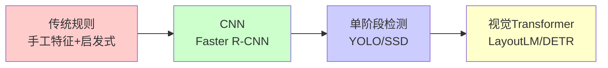

**主流模型对比**：

| 模型 | 特点 | 适用场景 |
|------|------|----------|
| **Faster R-CNN** | 精度高，速度较慢 | 高质量要求场景 |
| **YOLO** | 速度快，精度略低 | 实时处理需求 |
| **LayoutLM** | 融合文本+视觉信息 | 复杂语义理解 |

**关键数据集**：PubLayNet（学术论文）、DocBank（多样化文档）、CDLA（中文文档）

### 3.4 阅读顺序恢复

**核心问题**：文档的存储顺序往往与视觉阅读顺序不一致。例如双栏论文的存储可能是"左栏第一段 → 右栏第一段"，而正确顺序应该是先读完左栏再读右栏。

**恢复策略**：


**实践建议**：
- 单栏：按从上到下排序
- 双栏/多栏：先检测栏位分割，再按栏内顺序读取
- 图文混排：遵循"标题→正文→图表→说明"的逻辑顺序

## 4. 表格智能提取

文档中的表格承载着大量结构化信息，但传统 OCR 只能提取文字，无法还原表格的行列关系。本章我们将学习如何智能识别表格结构，将图片表格转换为可编辑的数据。

### 4.1 表格检测技术

表格检测的目标是**在页面中定位表格区域**，判断哪里是表格、哪里不是。

**技术演进**：

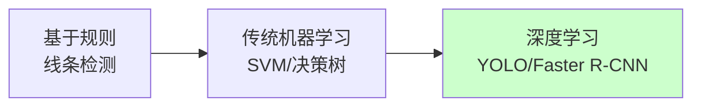

**深度学习方法**：

**深度学习方法对比**：

| 方法 | 原理 | 优点 | 示例 | 说明 |
|------|------|------|------|------|
| **目标检测** | 将表格视为目标物体，检测边界框 | 速度快，适合复杂版面 |  | 示例图为通用目标检测效果，非表格检测 |
| **语义分割** | 像素级分类，标记表格区域 | 精度高，适合不规则表格 |  | 示例图为通用语义分割效果，非表格分割 |

**目标检测方法示例（LayoutParser）**：

```python
from layoutparser import LayoutParser

# 初始化并加载预训练模型（基于目标检测）
lp = LayoutParser()
layout = lp.load_model("pretrained_models/coco_layout")

# 检测图像中的布局元素
# 返回的是边界框列表，每个框包含位置和类型信息
elements = layout.detect_from_image("document.jpg")

# 从检测结果中筛选出表格区域
table_blocks = [b for b in elements if b.type == "Table"]
```

**语义分割方法示例（PP-Structure + DBNet）**：

```python
import cv2
import numpy as np
from paddleocr import PPStructure

# 初始化 PP-Structure（使用 DBNet 进行语义分割）
# 返回像素级的表格区域掩码
table_engine = PPStructure(
    table=True,           # 启用表格识别
    ocr=False,            # 关闭 OCR，只获取表格结构
    show_log=True
)

# 读取图像
img = cv2.imread("document.jpg")

# 执行表格检测（基于语义分割）
# DBNet 会生成像素级的表格区域概率图
result = table_engine(img)

# 处理结果：result 包含表格区域的掩码和边界信息
for region in result:
    if region['type'] == 'table':
        # 获取表格区域的像素掩码（语义分割输出）
        mask = region['res']['mask']
        # 通过轮廓提取获取精确的表格边界
        # cv2.findContours: 从二值图像中提取轮廓
        # 参数说明:
        #   - mask.astype(np.uint8): 输入的二值图像（语义分割输出的掩码）
        #   - cv2.RETR_EXTERNAL: 只检测最外层轮廓，忽略内部嵌套轮廓（适合提取表格整体边界）
        #   - cv2.CHAIN_APPROX_SIMPLE: 压缩轮廓点，只保留端点（如矩形只保留4个角点，节省内存）
        # 返回值:
        #   - contours: 轮廓列表，每个轮廓是点的坐标数组
        #   - _: 轮廓的层次结构（此处不需要使用）
        contours, _ = cv2.findContours(
            mask.astype(np.uint8), 
            cv2.RETR_EXTERNAL, 
            cv2.CHAIN_APPROX_SIMPLE
        )
        for contour in contours:
            # 获取表格边界框坐标
            x, y, w, h = cv2.boundingRect(contour)
            print(f"表格区域: ({x}, {y}, {w}, {h})")
```

**两种方法对比**：

| 对比项 | 目标检测（LayoutParser） | 语义分割（PP-Structure） |
|--------|------------------------|------------------------|
| **输出形式** | 边界框坐标 (x, y, w, h) | 像素级掩码 (Mask) |
| **适用场景** | 表格整体定位 | 复杂表格结构解析 |
| **后处理** | 简单，直接筛选类型 | 需要轮廓提取等处理 |
| **精度** | 适合规则表格 | 适合不规则/倾斜表格 |

### 4.2 表格结构识别

检测到表格后，我们需要**解析内部结构**——识别行、列、单元格，以及它们之间的关系。

**核心任务**：

| 任务 | 说明 | 输出 |
|------|------|------|
| **行/列检测** | 识别表格的水平和垂直分隔线 | 行数、列数 |
| **单元格定位** | 确定每个单元格的位置和大小 | 单元格坐标矩阵 |
| **内容提取** | 提取单元格内的文字或图像 | 结构化数据 |

**技术方案对比**：

| 方案 | 适用场景 | 局限 |
|------|----------|------|
| **基于线条检测** | 有线表格（ borders 清晰） | 无线表格失效 |
| **基于文本对齐** | 无线表格（通过空格对齐） | 对齐不规律时失效 |
| **端到端深度学习** | 各种复杂表格 | 需要大量训练数据 |

**推荐工具**：

- **PP-Structure**：PaddleOCR 的表格识别模块，支持有线/无线表格
- **Table Transformer**：基于 DETR 的端到端表格识别模型
- **Camelot**：Python 库，专注于 PDF 表格提取

### 4.3 跨页表格处理

**问题**：长表格可能跨多个页面，如何识别它们是同一个表格？

**判断依据**：

1. **表头重复**：下一页顶部是否有相同表头
2. **内容连续**：页尾和页首的数据是否连续
3. **边框对齐**：表格边框位置是否一致

**处理策略**：

```python
# 伪代码：跨页表格合并
def merge_cross_page_tables(tables):
    result = [tables[0]]
    for current in tables[1:]:
        last = result[-1]
        if is_same_table(last, current):  # 判断是否为同一表格
            last.merge(current)           # 合并内容
        else:
            result.append(current)
    return result
```

### 4.4 复杂表格场景

**合并单元格处理**：

| 类型 | 识别方法 | 标记方式 |
|------|----------|----------|
| **行合并** | 检测垂直方向跨越多个行的单元格 | rowspan |
| **列合并** | 检测水平方向跨越多个列的单元格 | colspan |

**嵌套表格处理**：

单元格内又包含表格的情况，需要**递归解析**：

1. 先识别外层表格结构
2. 对每个单元格内容再次进行表格检测
3. 递归直到没有检测到新表格

**实际建议**：

- 对于复杂表格，**深度学习方案**（如 Table Transformer）优于传统规则
- 识别后务必**人工校验**合并单元格的正确性
- 导出时保留**HTML 或 Markdown 格式**，保留结构信息

## 5. 多栏与复杂版式解析

在前面第四章中，我们学习了如何提取表格这一特定类型的文档元素。但真实世界的文档往往更加复杂——学术论文的双栏排版、杂志的图文混排、书籍的页眉页脚等，都给文档解析带来了挑战。本章我们将学习如何处理这些复杂版式，让解析系统能够像人类一样正确理解文档结构。

### 5.1 多栏布局检测

**核心问题**：文档可能采用单栏、双栏甚至多栏布局，如何自动识别并正确处理？

**检测方法**：


**基于投影的多栏检测算法**：

```python
import cv2
import numpy as np

def detect_columns(image, min_column_width=100):
    """
    基于水平投影的多栏布局检测
    适用于背景为白色、文本为深色的文档图像
    """
    # 1. 将图像转为灰度并二值化
    gray = cv2.cvtColor(image, cv2.COLOR_BGR2GRAY)
    _, binary = cv2.threshold(gray, 0, 255, cv2.THRESH_BINARY_INV + cv2.THRESH_OTSU)
    
    # 2. 计算垂直投影（统计每列的像素值）
    vertical_proj = np.sum(binary, axis=0)
    
    # 3. 识别文本区域（投影值高的区域）和间隙（投影值接近0的区域）
    text_regions = vertical_proj > np.mean(vertical_proj) * 0.1
    
    # 4. 寻找连续的间隙区域作为栏分隔
    gaps = []
    in_gap = False
    gap_start = 0
    
    for i, is_text in enumerate(text_regions):
        if not is_text and not in_gap:
            # 进入间隙区域
            in_gap = True
            gap_start = i
        elif is_text and in_gap:
            # 离开间隙区域
            in_gap = False
            gap_width = i - gap_start
            if gap_width > min_column_width:
                gaps.append((gap_start, i))
    
    # 5. 根据间隙位置确定栏位边界
    columns = []
    prev_end = 0
    for gap_start, gap_end in gaps:
        columns.append((prev_end, gap_start))
        prev_end = gap_end
    columns.append((prev_end, len(vertical_proj)))
    
    return columns
```

**多栏类型对比**：

| 栏数 | 典型场景 | 检测难点 | 处理策略 |
|------|----------|----------|----------|
| **单栏** | 普通文章、小说 | 无需分栏 | 直接按从上到下顺序读取 |
| **双栏** | 学术论文、期刊 | 栏间内容关联 | 先读左栏再读右栏 |
| **三栏+** | 报纸、杂志 | 栏宽不一致 | 动态识别栏边界 |
| **混合栏** | 标题单栏+正文双栏 | 栏数变化 | 分段处理 |

### 5.2 图文混排处理

**核心问题**：文档中图片和文字交织排列，如何正确识别它们的相对位置和引用关系？

**处理流程**：

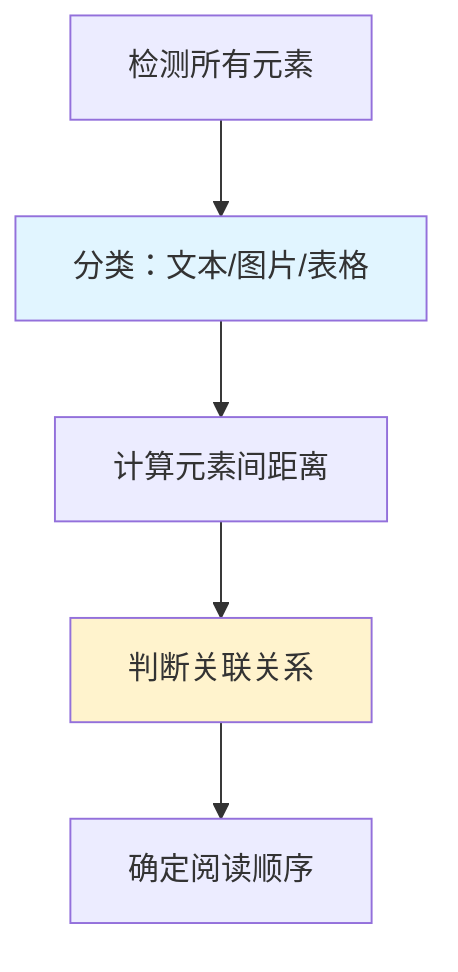

**图文关联判断规则**：

| 规则 | 说明 | 示例 |
|------|------|------|
| **距离最近** | 图片与最近的文本块关联 | 图片下方的说明文字 |
| **位置关系** | 上方/下方/左侧/右侧 | 正文中的插图 |
| **语义提示** | 包含"图1"、"如图"等关键词 | "如图2所示..." |
| **对齐方式** | 居中对齐的图片通常独立 | 章节配图 |

**Python实现示例**：

```python
def associate_figures_with_text(elements, max_distance=50):
    """
    关联图片与文本说明
    基于距离和位置关系判断
    """
    figures = [e for e in elements if e.type == 'Figure']
    texts = [e for e in elements if e.type == 'Text']
    
    associations = []
    
    for figure in figures:
        # 寻找距离最近的文本块
        nearest_text = None
        min_distance = float('inf')
        
        for text in texts:
            # 计算中心点距离
            dist = calculate_center_distance(figure, text)
            if dist < min_distance and dist < max_distance:
                min_distance = dist
                nearest_text = text
        
        # 判断关联关系
        if nearest_text:
            # 根据相对位置判断是标题还是说明
            if nearest_text.y < figure.y:
                relation = "标题"
            else:
                relation = "说明"
            
            associations.append({
                'figure': figure,
                'text': nearest_text,
                'relation': relation,
                'distance': min_distance
            })
    
    return associations
```

### 5.3 页眉页脚识别与过滤

**核心问题**：同一文档的每一页都有相同的页眉（如章节标题）和页脚（如页码）。如果解析时不把它们识别出来并过滤掉，这些内容会在每页都被提取，导致最终文本中重复出现多次，影响阅读和分析。

**识别策略**：


**基于重复模式的识别算法**：

```python
def detect_headers_footers(pages, similarity_threshold=0.8):
    """
    通过多页对比识别页眉页脚
    基于内容相似度和位置信息
    """
    if len(pages) < 2:
        return [], []
    
    headers = []
    footers = []
    
    # 提取每页顶部和底部区域（假设页眉页脚各占页面高度的10%）
    page_height = pages[0].shape[0]
    header_region_height = int(page_height * 0.1)
    footer_region_height = int(page_height * 0.1)
    
    # 提取顶部区域
    top_regions = [page[:header_region_height, :] for page in pages]
    # 提取底部区域
    bottom_regions = [page[-footer_region_height:, :] for page in pages]
    
    # 检测重复的顶部内容（页眉）
    if are_regions_similar(top_regions, similarity_threshold):
        headers.append({
            'region': 'top',
            'height': header_region_height,
            'content': extract_text_from_region(top_regions[0])
        })
    
    # 检测重复的底部内容（页脚）
    if are_regions_similar(bottom_regions, similarity_threshold):
        footers.append({
            'region': 'bottom',
            'height': footer_region_height,
            'content': extract_text_from_region(bottom_regions[0])
        })
    
    return headers, footers


def are_regions_similar(regions, threshold=0.8):
    """
    判断多个区域是否内容相似
    使用简单的像素对比或哈希算法
    """
    if len(regions) < 2:
        return False
    
    # 使用感知哈希或特征匹配判断相似度
    # 这里简化为比较第一页和其他页的相似度
    base_hash = compute_image_hash(regions[0])
    
    similar_count = 1
    for region in regions[1:]:
        region_hash = compute_image_hash(region)
        similarity = compare_hashes(base_hash, region_hash)
        if similarity > threshold:
            similar_count += 1
    
    # 如果超过80%的页面都有相似区域，认为是页眉页脚
    return similar_count / len(regions) > 0.8
```

**页眉页脚类型**：

| 类型 | 常见内容 | 处理方式 |
|------|----------|----------|
| **页眉** | 章节标题、文档名称 | 提取用于文档结构分析 |
| **页脚** | 页码、版权信息 | 过滤，不参与正文分析 |
| **页边注** | 注释、引用 | 单独提取，建立关联 |

### 5.4 复杂版式恢复策略

前面我们学习了如何处理多栏布局、图文混排和页眉页脚。现在我们将把这些技术整合起来，形成一套完整的复杂版式恢复策略，应对真实场景中的多样化文档。

**恢复流程**：

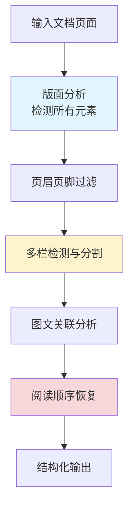

**关键策略**：

| 策略 | 适用场景 | 实现要点 |
|------|----------|----------|
| **分层处理** | 文档结构复杂 | 先处理页级元素（页眉页脚），再处理栏级，最后处理块级 |
| **迭代优化** | 初次分析不准确 | 根据上下文信息修正元素类型和边界 |
| **规则+模型结合** | 版式有规律但部分变化 | 规则处理标准部分，模型处理变化部分 |
| **人工校验点** | 精度要求高的场景 | 在关键节点（如表格跨页）设置人工确认机制 |

**实践建议**：

- 对于**学术论文**，重点关注双栏布局和图表引用关系
- 对于**财报文档**，优先保证表格和数字的准确性
- 对于**书籍扫描件**，注意处理页眉页脚和章节标题的层级关系

通过这一章的学习，我们掌握了处理复杂版式文档的完整方法论。接下来，我们将进入第六章，探讨多模态文档理解技术，结合视觉和语言信息实现更深层次的文档理解。

## 6. 多模态文档理解

在前面第五章中，我们学习了如何处理复杂版式文档的结构解析。但文档理解不仅仅是提取文字和布局信息——我们还需要理解文档的视觉内容（如图片、图表、字体样式）与文本之间的关联。本章我们将学习多模态文档理解技术，融合视觉和语言信息，实现更深层次的文档智能。

### 6.1 文档图像预处理

**为什么需要预处理？**

扫描或拍摄的文档图像往往存在噪声、倾斜、光照不均等问题，直接影响后续的分析和识别效果。我们需要在送入模型前对图像进行标准化处理。

**预处理流程**：


**关键技术**：

| 技术 | 作用 | 常用方法 |
|------|------|----------|
| **去噪** | 消除扫描/拍摄产生的噪点 | 中值滤波、高斯滤波、形态学开闭运算 |
| **倾斜校正** | 纠正文档旋转角度 | 投影法、Hough变换、基于文本行的方法 |
| **二值化** | 将灰度图转为黑白图 | OTSU自适应阈值、局部阈值法 |
| **图像增强** | 提升文字清晰度 | 对比度增强、锐化、超分辨率 |

**倾斜校正算法示例**：

```python
import cv2
import numpy as np

def deskew_image(image, max_angle=15):
    """
    基于投影的文档图像倾斜校正
    适用于文本行基本水平的文档
    
    原理：通过形态学操作连接同一文本行的文字，
          然后拟合最小外接矩形计算文本行倾斜角度
    
    参数:
        image: 输入的BGR格式文档图像（numpy数组）
        max_angle: 最大校正角度限制，防止过度校正（默认15度）
    
    返回:
        rotated: 校正后的图像
        angle: 检测到的倾斜角度（度）
    """
    # 步骤1: 转换为灰度图
    # cv2.cvtColor: 颜色空间转换
    # COLOR_BGR2GRAY: 从BGR彩色转为灰度，减少计算量
    gray = cv2.cvtColor(image, cv2.COLOR_BGR2GRAY)
    
    # 步骤2: 二值化处理
    # cv2.threshold: 将灰度图转为黑白二值图
    # THRESH_BINARY_INV: 反转二值化（文字变白，背景变黑），便于后续处理
    # THRESH_OTSU: 自动计算最优阈值，适应不同光照条件
    _, binary = cv2.threshold(gray, 0, 255, cv2.THRESH_BINARY_INV + cv2.THRESH_OTSU)
    
    # 步骤3: 使用形态学操作连接文本行
    # 目的：将同一行的分散文字连接成连续区域，便于检测文本行方向
    # cv2.getStructuringElement: 创建形态学核（结构元素）
    #   MORPH_RECT: 矩形核
    #   (30, 5): 宽度30像素（水平方向，连接同行文字），高度5像素（垂直方向）
    kernel = cv2.getStructuringElement(cv2.MORPH_RECT, (30, 5))
    # cv2.dilate: 膨胀操作，将白色区域（文字）向外扩展
    # iterations=2: 执行2次膨胀，确保同行文字充分连接
    dilated = cv2.dilate(binary, kernel, iterations=2)
    
    # 步骤4: 检测轮廓并计算倾斜角度
    # np.where(dilated > 0): 获取所有白色像素（文字区域）的坐标
    # np.column_stack: 将行坐标和列坐标组合成 (N, 2) 的坐标数组
    coords = np.column_stack(np.where(dilated > 0))
    
    # cv2.minAreaRect: 计算包围所有坐标点的最小面积旋转矩形
    # 返回值包含: (中心点, 宽高, 旋转角度)
    # 角度范围: [-90, 0)，表示矩形相对于水平线的旋转
    angle = cv2.minAreaRect(coords)[-1]
    
    # 步骤5: 校正角度值
    # OpenCV的minAreaRect返回的角度需要转换才能得到真实的文本倾斜角
    # 原因：OpenCV将长边作为矩形的"宽"，当文本倾斜超过45度时，宽高会互换
    if angle < -45:
        # 当角度小于-45度时，说明矩形被判定为竖直方向
        # 需要加90度转换为水平方向的倾斜角
        angle = 90 + angle
    angle = -angle  # 反转符号，得到正确的旋转方向（逆时针为正）
    
    # 安全检查：限制最大校正角度
    # 如果检测到的角度过大，可能是检测错误（如图片中有竖排文字）
    # 此时放弃校正，避免图像被错误旋转
    if abs(angle) > max_angle:
        angle = 0
    
    # 步骤6: 执行旋转校正
    # 获取图像尺寸
    (h, w) = image.shape[:2]
    # 计算旋转中心点（图像中心）
    center = (w // 2, h // 2)
    
    # cv2.getRotationMatrix2D: 生成2D旋转矩阵
    # 参数: (旋转中心, 旋转角度, 缩放比例)
    M = cv2.getRotationMatrix2D(center, angle, 1.0)
    
    # cv2.warpAffine: 应用仿射变换（旋转）
    # 参数说明:
    #   - image: 输入图像
    #   - M: 变换矩阵
    #   - (w, h): 输出图像尺寸
    #   - flags=INTER_CUBIC: 使用双三次插值，旋转后图像质量更高
    #   - borderMode=BORDER_REPLICATE: 边缘像素复制填充，避免黑边
    rotated = cv2.warpAffine(image, M, (w, h), 
                             flags=cv2.INTER_CUBIC, 
                             borderMode=cv2.BORDER_REPLICATE)
    
    return rotated, angle
```

### 6.2 视觉-语言联合建模

**为什么要融合文本和视觉信息？**

想象一下，如果你只看到一段文字"重要通知"，你可能不知道它有多重要。但如果这段文字是**红色加粗**的，还放在页面**顶部居中**位置，你立刻就能意识到它的重要性。这就是视觉信息（颜色、字体、位置）对理解文本含义的帮助。

**单一模态的局限**：

| 只看文本 | 只看视觉 | 文本+视觉 |
|----------|----------|-----------|
| 知道写了什么字 | 知道哪里是标题、哪里是正文 | 理解标题和正文的层级关系 |
| 无法判断重要性 | 无法知道具体内容 | 准确理解文档结构和语义 |

**融合的三大优势**：

1. **信息互补**：文本告诉你"是什么"，视觉告诉你"有多重要"
   - 例：发票中的"总金额"三个字本身不重要，但红色加粗显示时就需要重点关注

2. **提高准确性**：有些信息必须结合两种模态才能理解
   - 例：表格中的数字，需要知道它在哪一行哪一列（视觉位置）才能确定含义

3. **更接近人类阅读方式**：人类看文档时，眼睛会同时关注文字内容和排版样式
   - 例：看到大字居中就知道是标题，看到小字分段就知道是正文

**核心思想**：文档理解需要同时考虑文本内容（What）和视觉布局（Where）。传统的 NLP 模型只处理文本，而多模态模型将视觉信息（字体、颜色、位置）与语义信息融合，实现更准确的文档理解。

**LayoutLM 系列模型演进**：

我们可以把 LayoutLM 的演进想象成一个人学习阅读文档的能力提升过程：

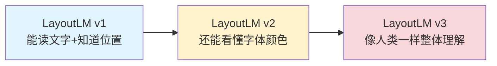

- **LayoutLM v1**：像刚学会阅读的小学生，能认字也知道字在页面的哪个位置
- **LayoutLM v2**：像有了一定经验的读者，除了文字和位置，还能看懂字体样式、颜色、图片等视觉信息
- **LayoutLM v3**：像专业的文档分析师，能够像人类一样整体理解文档，通过统一的预训练方式同时学习文本、布局和视觉信息

**多模态特征融合策略**：

想象我们要做一道菜（文档理解），需要把文本和视觉两种"食材"融合在一起。有三种不同的烹饪方法：

| 策略 | 比喻 | 技术说明 | 代表模型 |
|------|------|----------|----------|
| **早期融合** | 把食材切碎后一起下锅 | 在输入阶段就把文本和视觉信息混合，一起送入模型学习 | LayoutLM v1/v2 |
| **中期融合** | 分别炒到半熟再混合调味 | 文本和视觉先分别编码，然后在模型中间层通过注意力机制交互融合 | DocFormer |
| **晚期融合** | 分别炒熟后装盘再拼在一起 | 文本和视觉各自独立编码到输出层，最后才合并结果 | ERNIE-Layout |

**三种策略的优缺点**：

- **早期融合**：信息融合最充分，但计算量大，两种模态必须同步处理
- **中期融合**：平衡了融合效果和灵活性，可以处理不同长度的输入
- **晚期融合**：灵活性最高，文本和视觉可以独立优化，但融合可能不够深入

**LayoutLM 输入表示**：

```python
# LayoutLM 的输入包含三个模态：
# 1. 文本嵌入（Text Embedding）：词向量
# 2. 布局嵌入（Layout Embedding）：边界框坐标 (x0, y0, x1, y1)
# 3. 图像嵌入（Image Embedding）：文档图像的视觉特征（v2/v3）

from transformers import LayoutLMTokenizer, LayoutLMModel

tokenizer = LayoutLMTokenizer.from_pretrained("microsoft/layoutlm-base-uncased")

# 准备输入：文本 + 布局信息（从 OCR 获取）
# 注意：words 和 bboxes 必须一一对应，即第 i 个单词对应第 i 个边界框
text = "Invoice Number: 12345"
words = ["Invoice", "Number:", "12345"]
# 每个边界框格式：[左上角x, 左上角y, 右下角x, 右下角y]
# 对应关系：
#   words[0]="Invoice"  ->  bboxes[0]=[100, 50, 200, 80]  （位于页面左侧）
#   words[1]="Number:"  ->  bboxes[1]=[210, 50, 300, 80]  （位于中间）
#   words[2]="12345"    ->  bboxes[2]=[310, 50, 400, 80]  （位于右侧）
bboxes = [[100, 50, 200, 80], [210, 50, 300, 80], [310, 50, 400, 80]]

# 编码输入
encoding = tokenizer(
    text,
    return_tensors="pt",  # 返回 PyTorch 张量格式（"pt"=PyTorch，"tf"=TensorFlow）
    padding=True,         # 自动填充到相同长度（短句补0）
    truncation=True       # 超长文本自动截断
)

# 添加布局信息（与 tokenizer 输出的 token 对齐）
encoding["bbox"] = torch.tensor([bboxes])

# 送入模型
model = LayoutLMModel.from_pretrained("microsoft/layoutlm-base-uncased")
outputs = model(**encoding)

# 模型输出说明：
# outputs.last_hidden_state: 形状为 [batch_size, seq_len, hidden_dim]
#   - batch_size: 同时处理多少张文档（如 8 表示一次处理 8 页）
#   - seq_len: 文档被分成多少个 token（如 512 表示最多 512 个词）
#   - hidden_dim: 每个 token 用多少维向量表示（如 768 维）
#   - 简单说：每个词都被表示成一个 768 维的数字向量，融合了文本+布局+图像信息
#   - 可用于下游任务：文档分类、实体识别、问答等
#
# outputs.pooler_output: 形状为 [batch_size, hidden_dim]
#   - 整个文档的汇总表示（类似 BERT 的 [CLS] token）
#   - 把整页文档压缩成一个 768 维的向量
#   - 可用于文档级分类任务（如判断这是发票还是合同）
```

**模型输出能做什么？**

LayoutLM 的输出是融合了文本和布局信息的特征向量，需要接下游任务头才能产生具体结果：

| 下游任务 | 输出层 | 应用场景 |
|----------|--------|----------|
| **文档分类** | 在 `pooler_output` 上加分类器 | 判断文档类型（发票/合同/简历） |
| **实体识别** | 在 `last_hidden_state` 上加分类头 | 提取关键信息（金额、日期、姓名） |
| **文档问答** | 在文档中定位答案的位置（从哪个词开始到哪个词结束） | 问："总金额是多少？" → 在文档中找到"总金额：￥1000"这段文字的起止位置 |
| **表格理解** | 识别表格的行列结构，输出每个单元格的内容和位置 | 把图片中的表格转换成 Excel 格式的数据 |

**数据对应关系说明**：

在 LayoutLM 中，文本和布局信息必须严格一一对应：

| 索引 | 单词 (Word) | 边界框 (BBox) | 位置说明 |
|------|-------------|---------------|----------|
| 0 | Invoice | [100, 50, 200, 80] | 页面左侧，y坐标50，宽度100 |
| 1 | Number: | [210, 50, 300, 80] | 页面中间，与Invoice同一行 |
| 2 | 12345 | [310, 50, 400, 80] | 页面右侧，与Invoice同一行 |

**边界框坐标含义**：`[x0, y0, x1, y1]`
- `x0, y0`：单词左上角在页面中的坐标（像素值）
- `x1, y1`：单词右下角在页面中的坐标（像素值）
- 坐标通常归一化到 0-1000 范围，与页面尺寸无关

### 6.3 文档问答（DocVQA）技术

**什么是 DocVQA？**：文档视觉问答（Document Visual Question Answering）是指让模型回答关于文档内容的问题，需要同时理解文档的视觉布局和文本语义。

**应用场景**：

- 询问"发票的总金额是多少？"，模型需要定位到金额区域并提取数值
- 询问"合同签署日期是哪天？"，模型需要找到日期字段

**技术架构**：

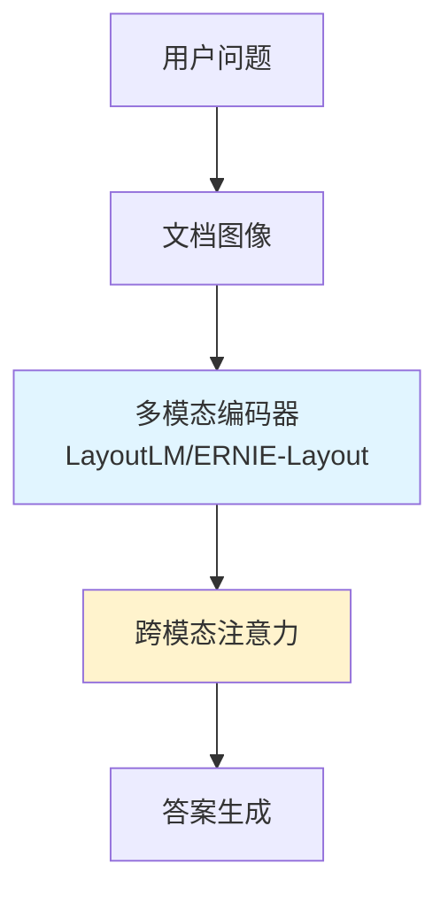

**DocVQA 处理流程**：

| 步骤 | 说明 | 关键技术 |
|------|------|----------|
| **问题编码** | 将自然语言问题转为向量（让计算机能理解的数字表示） | BERT/RoBERTa 编码器 |
| **文档编码** | 提取文档的多模态特征 | LayoutLM 系列模型 |
| **跨模态对齐** | 关联问题中的关键词与文档区域 | 注意力机制 |
| **答案定位** | 在文档中找到答案所在区域 | 跨度预测（Span Prediction） |
| **答案生成** | 提取或生成最终答案 | 抽取式/生成式 |

**简单示例**：

```python
from transformers import LayoutLMv2ForQuestionAnswering, LayoutLMv2Tokenizer

# 加载 DocVQA 模型
model = LayoutLMv2ForQuestionAnswering.from_pretrained("microsoft/layoutlmv2-base-uncased")
tokenizer = LayoutLMv2Tokenizer.from_pretrained("microsoft/layoutlmv2-base-uncased")

# 准备输入
question = "What is the total amount?"
image = load_document_image("invoice.jpg")  # 文档图像
words, boxes = extract_ocr_results(image)   # OCR 提取文本和位置

# 编码并预测答案
encoding = tokenizer(
    question,             # 用户的问题
    words,                # OCR 提取的单词列表
    boxes=boxes,          # 每个单词对应的边界框坐标
    return_tensors="pt"   # 返回 PyTorch 张量格式
)

outputs = model(**encoding)

# 从模型输出中提取答案位置
# start_logits: 模型预测答案起始位置的概率分布（每个位置一个分数）
# argmax(): 取分数最高的位置作为答案起点
answer_start = outputs.start_logits.argmax()

# end_logits: 模型预测答案结束位置的概率分布
# argmax(): 取分数最高的位置作为答案终点
answer_end = outputs.end_logits.argmax()

# 根据起止位置从输入文本中提取答案
# encoding.input_ids[0]: 输入文本的 token 编号列表
# [answer_start:answer_end+1]: 切片获取从起点到终点的 token
# tokenizer.decode(): 将 token 编号转换回文字
answer = tokenizer.decode(encoding.input_ids[0][answer_start:answer_end+1])
```

通过这一章的学习，我们了解了多模态文档理解的核心技术——从图像预处理到视觉-语言联合建模，再到文档问答。这些技术让机器不仅能"看懂"文档的文字，还能理解其视觉呈现和语义关联。在下一章中，我们将整合前面所有知识，搭建完整的智能文档解析流水线。

## 7. 开源工具与框架实战

在前面第六章中，我们学习了多模态文档理解的理论基础。现在我们将进入实战环节——了解主流的开源工具，搭建完整的智能文档解析流水线，并掌握性能优化的技巧。

### 7.1 主流工具对比

**工具选型全景图**：

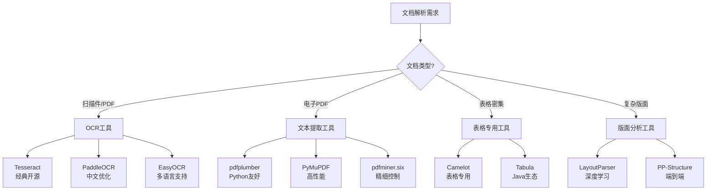

**主流工具对比表**：

| 工具 | 核心能力 | 优势 | 局限 | 适用场景 |
|------|----------|------|------|----------|
| **Tesseract** | OCR文字识别 | 开源免费、多语言支持、社区活跃 | 对复杂版面效果一般、中文需训练 | 简单文档、多语言需求 |
| **PaddleOCR** | OCR+版面分析 | 中文识别强、PP-Structure集成 | 模型较大、GPU依赖 | 中文文档、表格识别 |
| **LayoutParser** | 版面分析 | 基于深度学习、可自定义训练 | 安装复杂、需GPU | 复杂版面、科研场景 |
| **pdfplumber** | PDF文本提取 | Python友好、保留布局信息 | 仅支持电子PDF | 结构化PDF处理 |
| **Camelot** | 表格提取 | 专注表格、支持多种格式 | 对无线表格效果差 | 有线表格密集文档 |
| **Unstructured** | 通用文档解析 | 一站式处理、支持多种格式 | 依赖较多、配置复杂 | 企业级文档处理 |

**选型建议**：

- **快速上手**：PaddleOCR（中文）或 Tesseract（英文）
- **复杂版面**：LayoutParser + 自定义训练
- **表格密集**：PP-Structure 或 Camelot
- **企业应用**：Unstructured 或自研流水线

### 7.2 智能解析流水线搭建

我们将整合前面学到的技术，搭建一个完整的文档解析流水线。

**流水线架构**：

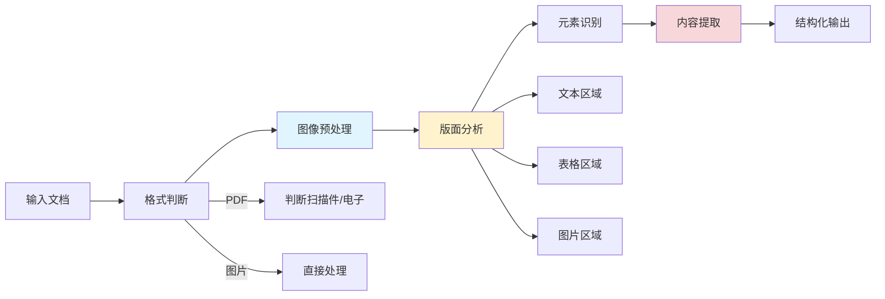

**流水线核心模块**：

一个完整的智能解析流水线通常包含以下模块：

| 模块 | 功能 | 推荐工具 |
|------|------|----------|
| **输入处理** | 支持多种格式（PDF/图片）、判断文档类型 | pdfplumber、Pillow |
| **图像预处理** | 倾斜校正、去噪、缩放 | OpenCV、自定义算法 |
| **版面分析** | 检测文本/表格/图片区域 | PP-Structure、LayoutParser |
| **内容识别** | OCR文字识别、表格结构化 | PaddleOCR、Tesseract |
| **后处理** | 阅读顺序恢复、结果结构化 | 自定义规则 |
| **输出格式化** | 导出为 JSON/Markdown/Excel | pandas、json |

**流水线设计要点**：

1. **模块化设计**：每个阶段独立，便于替换和升级
2. **错误处理**：每个模块都要有异常捕获，避免单点故障
3. **配置化**：关键参数（如DPI、模型路径）通过配置文件管理
4. **日志记录**：记录处理时间、识别置信度，便于问题排查

### 7.3 性能与效果优化

**性能瓶颈分析**：

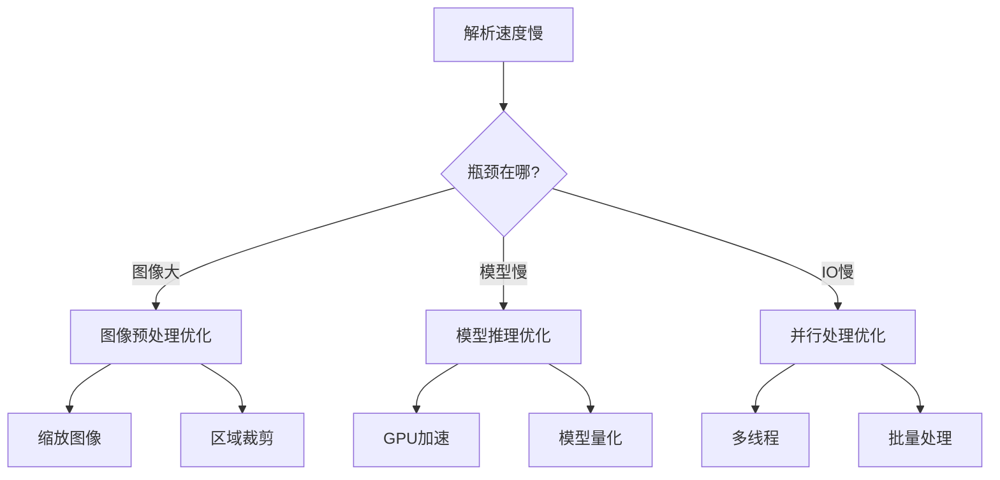

**优化策略对比**：

| 优化方向 | 策略 | 效果 | 代价 |
|----------|------|------|------|
| **图像预处理** | 缩放至 150-200 DPI | 速度提升 2-3 倍 | 可能影响小字识别 |
| **模型推理** | 使用 GPU 加速 | 速度提升 5-10 倍 | 需要 GPU 硬件 |
| **模型轻量化** | 使用量化模型 | 速度提升 2 倍 | 精度轻微下降 |
| **并行处理** | 多页并行解析 | 速度提升 N 倍（N=页数） | 内存占用增加 |
| **缓存机制** | 缓存 OCR 结果 | 重复文档秒级响应 | 增加存储空间 |

**效果评估指标**：

| 指标 | 说明 | 计算公式 | 目标值 |
|------|------|----------|--------|
| **准确率** | 提取正确的内容占比 | 正确提取数 / 提取总数 | > 95% |
| **召回率** | 应提取内容的覆盖度 | 正确提取数 / 应提取总数 | > 90% |
| **F1 分数** | 准确率和召回率的调和平均 | 2 × 准确率 × 召回率 / (准确率 + 召回率) | > 0.92 |
| **处理速度** | 单页处理时间 | 总时间 / 页数 | < 2 秒/页 |

**快速优化清单**：

- [ ] 图像预处理：缩放至合适 DPI（150-200）
- [ ] 启用 GPU：检查 CUDA 是否可用
- [ ] 批量处理：多页并行而非串行
- [ ] 结果缓存：避免重复解析相同文档
- [ ] 模型选择：根据场景选择合适模型（精度 vs 速度）

通过这一章的学习，我们掌握了从工具选型到流水线搭建，再到性能优化的完整实战技能。这些知识足以支撑你搭建企业级的智能文档解析系统。

## 8. 总结

经过七章的系统学习，我们从传统解析方法的局限出发，逐步深入到现代智能文档解析的核心技术。现在让我们回顾所学内容，并规划后续的学习方向。

### 8.1 核心要点回顾

**知识体系全景图**：

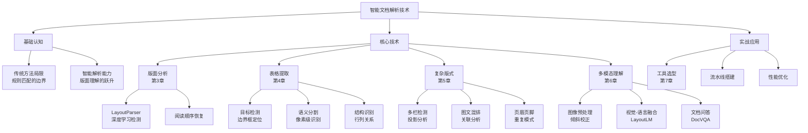

**各章核心要点**：

| 章节 | 核心概念 | 关键技术 | 代表工具/模型 |
|------|----------|----------|---------------|
| **第2章** | 从规则匹配到版面理解 | 目标检测、图像分类、结构建模 | Faster R-CNN、LayoutParser |
| **第3章** | 版面分析 = 定位 + 分类 + 排序 | 深度学习检测、阅读顺序恢复 | PubLayNet、Detectron2 |
| **第4章** | 表格检测 → 结构识别 → 内容提取 | 目标检测 vs 语义分割、跨页合并 | PP-Structure、Camelot |
| **第5章** | 复杂版式的分层处理 | 投影分析、距离计算、重复检测 | OpenCV、自定义算法 |
| **第6章** | 文本 + 视觉 + 布局的融合 | 多模态预训练、早期/中期/晚期融合 | LayoutLM、DocFormer |
| **第7章** | 工具选型与流水线搭建 | 模块化设计、性能优化、效果评估 | PaddleOCR、Tesseract |

**关键技术决策树**：

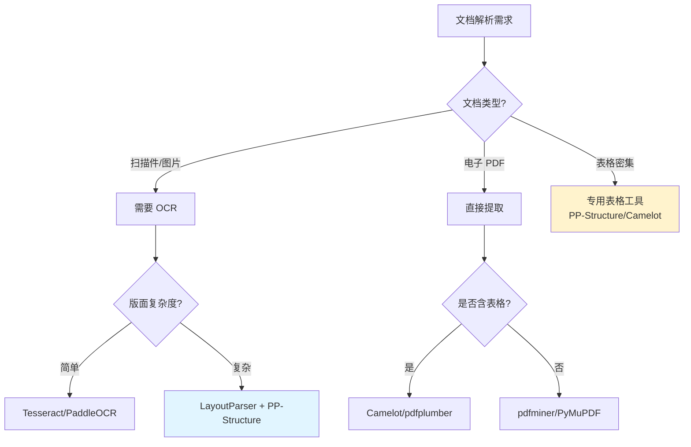

**必须掌握的三个核心能力**：

1. **版面理解能力**：能将文档页面分解为标题、正文、表格、图片等元素，并理解它们之间的关系
2. **工具选型能力**：根据文档类型（扫描件/电子PDF）、语言（中文/英文）、复杂度选择合适的工具组合
3. **问题解决能力**：面对解析失败的情况，能定位问题（图像质量/模型精度/后处理逻辑）并提出优化方案

---

**下一篇文档**：《05-文本分块策略设计》

本文档将解析后的长文本切分成适合检索的小片段。这是 RAG 流水线中的重要环节——只有将文本合理分块，才能既保证检索精度，又保留足够的上下文信息供大模型理解。


