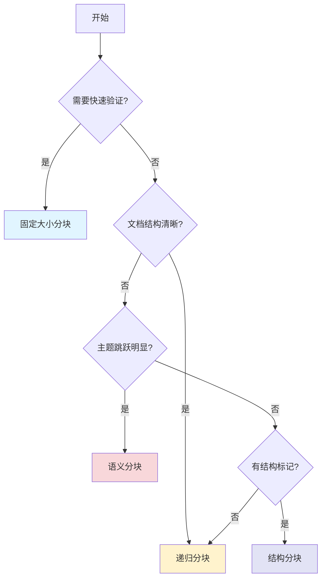

# 05. 文本分块策略设计

## 1. 概述

本文档讲解文本分块策略——将长文本切分成适合检索的小片段。涵盖固定大小、递归、语义、结构四种分块方法，助你根据场景选择最优方案，提升RAG检索质量。

## 2. 为什么分块很重要

想象你在图书馆找资料：如果一本书没有目录和章节，你只能从头到尾翻阅。分块就是为文档创建"章节"，让检索系统能快速定位相关内容。

**分块的核心作用**：

| 作用 | 不分块的后果 | 分块的优势 |
|------|--------------|------------|
| **适配模型限制** | 只能将整篇文档直接输入模型。但大模型有上下文长度限制（如4096 tokens），超长部分会被截断丢弃，导致关键信息丢失 | 将长文档切分成小块，检索时只将最相关的块输入模型，既满足长度限制又保留关键信息 |
| **提高检索精度** | 大块内容会导致"Lost in the Middle"效应——关键信息淹没在长文本中，模型难以聚焦，检索准确率低 | 小块内容主题聚焦，向量表示更精确，能精准匹配用户查询，检索准确率高 |
| **保留上下文** | 任意切分可能切断句子或段落，破坏语义连贯性，导致理解偏差 | 按自然边界（段落、句子）切分，保持语义完整性，LLM能做出有意义的推理 |

通过上面的分析，我们明白了分块的重要性。接下来，我们将从第3章开始，依次学习四种主流的分块策略：固定大小分块、递归分块、语义分块和基于文档结构的分块。每种策略都有其适用场景和优缺点，掌握它们能让你根据实际需求选择最合适的方案。

## 3. 固定大小分块

最直观的方法：按固定字符数或 Token 数切分。

```python
# 示例：每 50 字符一块，重叠 10 字符
chunk_size = 50
chunk_overlap = 10

# 原始文本：关于Python装饰器的知识点
text = """
    Python装饰器是一种用于修改函数或方法行为的高级特性。
    它本质上是一个接受函数作为参数并返回新函数的函数。
    使用@语法糖可以让代码更加简洁优雅。
    装饰器常用于日志记录、权限验证、性能监控等场景。
    理解装饰器需要掌握闭包和函数作为一等公民的概念。
    """

# 固定大小分块实现
def fixed_size_split(text: str, chunk_size: int, chunk_overlap: int) -> list[str]:
    """
    将文本按固定大小切分，相邻块之间有重叠
    
    参数:
        text: 原始文本
        chunk_size: 每块最大字符数
        chunk_overlap: 相邻块之间的重叠字符数
    
    返回:
        切分后的文本块列表
    """
    chunks = []
    start = 0
    while start < len(text):
        # 截取当前块
        end = start + chunk_size
        chunk = text[start:end]
        # 去除换行符并添加到结果
        chunks.append(chunk.replace('\n', ''))
        # 下一个块的起始位置（考虑重叠）
        start = end - chunk_overlap
    return chunks

def main() -> None:
    # 执行切分
    chunks = fixed_size_split(text, chunk_size, chunk_overlap)
    
    # 打印切分结果
    for i, chunk in enumerate(chunks):
        print(f"第{i+1}块：{chunk}")

if __name__ == "__main__":
    main()

# 输出结果：
# 第1块：    Python装饰器是一种用于修改函数或方法行为的高级特性。    它本质上是一个接受函数
# 第2块：本质上是一个接受函数作为参数并返回新函数的函数。    使用@语法糖可以让代码更加简洁优雅。  
# 第3块：更加简洁优雅。    装饰器常用于日志记录、权限验证、性能监控等场景。    理解装饰器需要掌握
# 第4块： 理解装饰器需要掌握闭包和函数作为一等公民的概念。
```

**优缺点**：

| 优点 | 缺点 |
|------|------|
| 实现简单，速度快 | 可能切断句子，破坏语义 |
| 不依赖外部模型 | 重要信息可能分散在不同块中 |

## 4. 递归分块策略

递归分块是一种更符合人类阅读习惯的智能切分方式。它不像固定大小分块那样"一刀切"，而是优先尊重文档的自然结构。

**核心思想**：按优先级顺序（段落 → 句子 → 词）层层拆分，尽可能保持语义完整性。

**工作原理**：

```
第1步：按段落切分
    ↓ 段落超长？
第2步：按句子切分  
    ↓ 句子仍超长？
第3步：按固定大小切分
```

**为什么更容易理解**：

递归分块符合我们阅读文档的直觉——先看段落，段落太长就看句子，句子还长才被迫断开。这种方式最大程度保留了文档的层级结构，不会出现一句话被拦腰切断的尴尬情况。

**适用场景**：
- 结构清晰的文档（论文、报告、书籍）
- 需要保留段落完整性的场景
- 对语义连贯性要求较高的应用

由于递归分块的实现涉及分层逻辑和多种分隔符处理，代码相对复杂。在实际项目中，建议直接使用 LangChain 的 `RecursiveCharacterTextSplitter`，它已经为我们封装好了完整的递归切分逻辑。

## 5. 语义分块

按语义相似度切分：当相邻内容的向量相似度低于阈值时，在此处分割。

**核心思想**：让同一个块内的句子主题高度相关。

**优缺点**：

| 优点 | 缺点 |
|------|------|
| 语义连贯性最好 | 需要调用 Embedding 模型，计算成本高 |
| 适合主题跳跃的文档 | 阈值选择需要经验 |

## 6. 基于文档结构的分块

利用文档本身的结构信息（标题层级、列表、表格）进行切分。

**适用场景**：Markdown、HTML、PDF 等有明确结构标记的文档。

## 7. 分块策略选型指南

| 场景 | 推荐策略 | 原因 |
|------|----------|------|
| 快速原型验证 | 固定大小 | 简单直接，无需调参 |
| 结构化文档（论文、报告） | 递归分块 | 保留段落和句子完整性 |
| 主题跳跃明显的内容 | 语义分块 | 确保块内主题一致 |
| HTML/Markdown | 结构分块 | 利用天然结构边界 |

## 8. 总结

经过七章的学习，我们系统掌握了文本分块的核心技术。从理解分块的重要性，到四种主流策略的原理与选型，你现在能够根据实际需求选择最合适的分块方案。

**核心要点回顾**：

| 策略 | 核心思想 | 适用场景 | 关键权衡 |
|------|----------|----------|----------|
| **固定大小分块** | 按固定字符数切分，相邻块重叠 | 快速原型、简单文档 | 速度 vs 语义完整性 |
| **递归分块** | 按段落→句子→词层层拆分 | 结构化文档、论文报告 | 保留层级结构 |
| **语义分块** | 按向量相似度切分 | 主题跳跃内容 | 精度 vs 计算成本 |
| **结构分块** | 利用文档自带标记 | Markdown/HTML/PDF | 依赖文档格式 |

**选型决策树**：



**关键认知**：

1. **分块是RAG的质量瓶颈**：行业说法"分块决定RAG质量的70%"并不夸张
2. **没有万能策略**：不同文档类型、不同查询场景需要不同的分块方案
3. **重叠很重要**：适当的重叠能避免边界信息丢失，一般建议10%-20%的重叠比例

通过本文档的学习，你已经掌握了将长文本切分成适合检索片段的完整方法论。接下来，我们将进入第5章《Embedding模型与向量化》，学习如何将分块后的文本转换为语义向量，这是实现语义检索的核心技术。

---

**下一篇文档**：《06-Embedding模型与向量化》

学习如何将分块后的文本转换为语义向量，这是实现语义检索的核心技术。
