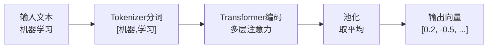
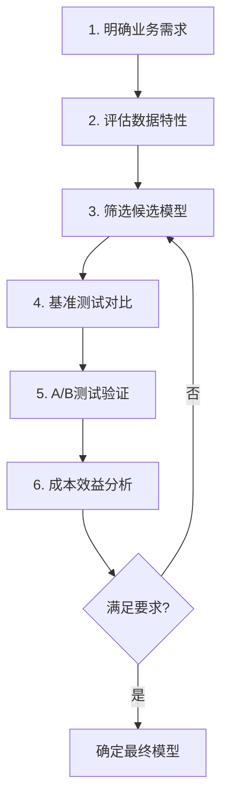
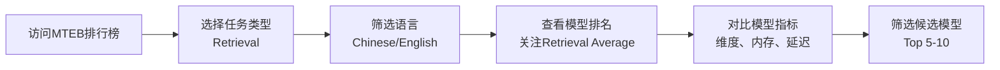
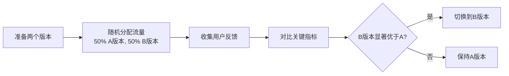
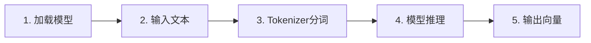
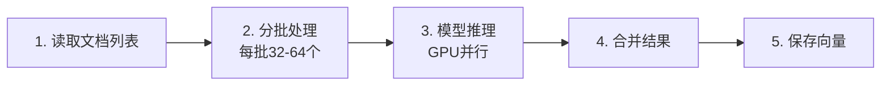

# 06. Embedding模型与向量化

## 1. 概述

通过前5篇文档的学习，我们已经完成了RAG流水线的数据准备阶段。现在我们需要将这些文本片段转换为计算机能理解的数学表示。本文档将学习Embedding向量化技术，包括模型原理、主流模型对比、向量相似度计算方法以及模型选型指南，帮助我们构建高效的语义检索系统。

## 2. 为什么需要向量化

**计算机不理解文字，只理解数字。**

我们阅读的文本（如"机器学习"）对人类有意义，但对计算机来说只是一串字符。为了让计算机"理解"文本语义，我们需要将其转换为数值向量。

**向量化后的核心能力**：

| 能力 | 说明 | 应用场景 |
|------|------|----------|
| **语义计算** | 将文本映射到高维空间，语义相似的内容距离近 | "机器学习"和"深度学习"的向量距离很近 |
| **相似度匹配** | 通过向量距离判断文本相关性 | 语义检索、推荐系统 |
| **高效处理** | 将非结构化文本转为结构化向量，便于存储和计算 | 向量数据库索引、批量计算 |

**简单类比**：向量化就像给每本书生成一个"指纹"——内容相似的书指纹相近，计算机只需比较指纹就能快速找到相关书籍，而不必逐字阅读理解。

通过向量化，我们将文本的语义信息编码为计算机可计算的数学表示，这是实现语义检索的技术基础。

## 3. Embedding基础概念

**什么是Embedding？**

Embedding（嵌入）是将离散的文本数据（如单词、句子）映射为**低维稠密向量**的技术。简单来说，它给每个文本片段分配一个"坐标"，让语义相似的内容在向量空间中靠得更近。

**核心特点对比**：

| 特性 | One-Hot表示 | One-Hot利弊 | Embedding表示 | Embedding利弊 |
|------|-------------|-------------|---------------|---------------|
| **维度** | 高维（如有5万个词就是5万维） | ❌ 维度随词汇表膨胀 | 低维（固定768或1024个数字） | ✅ 维度固定可控 |
| **存储** | 稀疏（只有一个1，其余都是0） | ❌ 浪费存储空间 | 稠密（每个位置都有值） | ✅ 存储高效 |
| **语义** | 无（所有词距离相同） | ❌ 无法表示词间关系 | 有（相似词语义距离近） | ✅ 能捕捉语义相似性 |
| **计算** | 慢（高维稀疏运算） | ❌ 计算代价大 | 快（低维稠密运算） | ✅ 计算速度快 |
| **实现** | 简单直观，无需训练 | ✅ 易于理解和实现 | 需要预训练模型 | ❌ 模型黑盒不易解释 |

**为什么Embedding可以低维？**

One-Hot给每个词分配一个独立维度（如5万词=5万维），每个维度只表示"是不是这个词"，大量维度被浪费。

Embedding通过**神经网络训练学习压缩表示**：
- 把词的语义特征（如性别、颜色、抽象/具体等）编码到768个连续数值中
- 每个维度都承载多个语义信息，空间被充分利用
- 相似的词共享相似的特征组合，自然在向量空间中靠近

**示例对比**：

假设词汇表有5万个词，对比"苹果"的两种表示：

```
One-Hot（5万维）：
[0, 0, 0, ..., 1, ..., 0]  ← 只有第9527位是1，其余都是0
                    ↑
                 第9527位

Embedding（4维示例）：
[0.2, 0.8, -0.3, 0.5]  ← 4个数字分别表示：
                          0.2=水果类别, 0.8=可食用
                         -0.3=红色, 0.5=甜味
```

Embedding的4个数字承载了丰富的语义信息，而One-Hot的5万个数字只有1个有用。

就像用768个"旋钮"组合出无数种语义，而不是用5万个"开关"各表示一个词。

**向量维度说明**：

Embedding向量通常有768、1024或1536维。维度越高，表达能力越强，但计算成本也越高。例如：
- BGE模型：1024维（中文优化）
- OpenAI Embedding：1536维（多语言通用）

**编码过程**：



通过Embedding，我们将文本的语义信息压缩成一个固定长度的数值向量，为后续的相似度计算和检索打下基础。

## 4. 主流Embedding模型

选择合适的Embedding模型直接影响RAG系统的检索质量。我们将对比当前主流的开源和商业模型。

**开源模型对比**：

| 模型 | 维度 | 特点 | 适用场景 | 硬件要求 |
|------|------|------|----------|----------|
| **BGE-M3** | 1024 | 多语言支持（194种）、长文本（8K tokens）、混合检索 | 跨语言文档、企业RAG | 显存6.8GB+ |
| **M3E** | 768 | 中文优化、轻量级、边缘部署友好 | 中文问答、资源受限环境 | 内存3.2GB |
| **GTE** | 768 | 阿里巴巴出品、参数少性能高、代码检索强 | 中文语义检索、代码场景 | 中等 |
| **Nomic-Embed** | 768 | 完全开源可审计、支持32K超长文本 | 科研、长文档处理 | 较高 |

**商业模型对比**：

| 模型 | 维度 | 特点 | 适用场景 | 成本 |
|------|------|------|----------|------|
| **OpenAI text-embedding-3-small** | 1536 | 性价比高、多语言通用 | 快速原型、多语言应用 | 低 |
| **OpenAI text-embedding-3-large** | 3072 | 精度最高、256K上下文 | 高精度要求场景 | 高 |

**选型建议**：

| 场景 | 推荐模型 | 理由 |
|------|----------|------|
| 中文企业知识库 | BGE-M3 / M3E | 中文优化好，开源免费 |
| 英文/多语言 | OpenAI / BGE-M3 | 多语言能力强 |
| 长文档处理 | BGE-M3 / Nomic | 支持8K-32K长文本 |
| 私有化部署 | M3E / GTE | 轻量易部署 |
| 高精度要求 | OpenAI large / BGE-M3 | 检索准确率高 |

**实际测试数据**（中文问答场景）：

| 模型 | 召回率 | 响应延迟 | 显存占用 |
|------|--------|----------|----------|
| M3E | 82% | 45ms | 3.2GB |
| BGE-M3 | 89% | 68ms | 6.8GB |
| OpenAI-small | 85% | 120ms | API调用 |
| GTE | 80% | 52ms | 4.1GB |

我们在选择模型时需要权衡精度、速度和成本。对于大多数中文RAG应用，**BGE-M3**是首选；如果资源受限，**M3E**是性价比之选。

## 5. 向量相似度计算

将文本转为向量后，我们需要计算向量之间的相似度来判断文本语义是否相近。这是检索模块的核心算法。

**三种常用计算方法**：

| 方法 | 计算方式 | 特点 | 适用场景 |
|------|----------|------|----------|
| **余弦相似度** | 计算向量夹角的余弦值 | 忽略长度，只关注方向；取值[-1,1] | 文本语义匹配（最常用） |
| **点积** | 对应位置相乘后求和 | 简单快速，兼顾方向和长度 | 已归一化向量的快速计算 |
| **欧氏距离** | 计算空间直线距离 | 反映绝对距离，对长度敏感 | 需要区分强度差异的场景 |

**为什么RAG首选余弦相似度？**

余弦相似度只关注两个文本的"语义方向"是否一致，而不关心文本长度。例如：
- "机器学习"和"深度学习" → 方向相近 → 相似度0.85（高）
- "机器学习"和"苹果" → 方向远离 → 相似度0.12（低）

这种特性非常适合语义检索——我们只关心内容是否相关，不关心文本长短。

**计算公式示例**：

假设有两个二维向量 A=[1, 2] 和 B=[2, 4]：

```
余弦相似度 = (1×2 + 2×4) / (√(1²+2²) × √(2²+4²)) = 10 / (√5 × √20) ≈ 1.0

点积 = 1×2 + 2×4 = 10

欧氏距离 = √((1-2)² + (2-4)²) = √5 ≈ 2.24
```

在RAG实践中，我们通常直接使用向量数据库提供的相似度计算（内部已优化），无需手动实现。

## 6. 模型选型指南

前面我们了解了主流Embedding模型的特性对比，但这些信息只是选型的起点。在实际项目中，我们需要一套系统化的选型方法论，综合考虑业务需求、性能指标、成本预算等多个维度。本章将讲解如何科学地选择最适合你场景的Embedding模型。

### 6.1 选型决策流程

模型选型不是凭感觉选择，而是一个系统的决策过程。我们需要按照清晰的流程，从需求分析到最终验证，逐步缩小选择范围。

**选型决策流程**：



**第一步：明确业务需求**

在选型之前，我们需要先回答几个关键问题：

| 考量维度 | 关键问题 | 典型答案示例 |
|----------|----------|--------------|
| **任务类型** | 主要用于什么场景？ | 语义检索、文本分类、推荐系统 |
| **语言需求** | 处理哪些语言？ | 仅中文、中英双语、多语言 |
| **领域特性** | 是否有专业术语？ | 通用、医疗、法律、金融 |
| **性能要求** | 对准确率的要求？ | 85%以上、90%以上、越高越好 |
| **延迟要求** | 实时性要求如何？ | <100ms、<500ms、无严格要求 |
| **成本预算** | 可接受的成本范围？ | 开源免费、低成本API、高成本无限制 |

**第二步：评估数据特性**

了解我们的数据特点，有助于选择更匹配的模型：

| 数据特性 | 说明 | 选型建议 |
|----------|------|----------|
| **文本长度** | 平均每个文档的token数量 | 长文档选8K+窗口模型，短文本可选小模型 |
| **专业术语** | 是否包含大量领域专有词汇 | 专业领域优先选领域模型或子词分词模型 |
| **数据规模** | 文档数量和总token量 | 大规模数据优先考虑推理速度和成本 |
| **更新频率** | 数据更新是否频繁 | 频繁更新需要考虑批量向量化效率 |

**为什么更新频率重要？**

如果数据更新频繁，每次更新都需要重新向量化所有文档。如果模型推理速度慢，批量处理10万篇文档可能需要数小时，严重影响数据时效性。因此需要选择支持GPU加速、批量处理效率高的模型。

**不同更新频率的选型建议**：

| 场景 | 更新频率 | 选型建议 | 理由 |
|------|----------|----------|------|
| **公司规章制度** | 低（每月更新） | 可选择精度高但速度慢的模型 | 时效性要求不高，优先保证检索质量 |
| **产品文档** | 中（每周更新） | 需要平衡精度和批量处理效率 | 兼顾时效性和准确性 |
| **新闻资讯** | 高（每小时更新） | 必须选择批量向量化效率高的模型 | 时效性是核心要求，速度优先 |

**批量向量化效率对比**（处理10万篇文档）：

| 模型 | 单文档耗时 | 批量处理总耗时 | 适用场景 |
|------|------------|----------------|----------|
| M3E | 15ms | 约25分钟 | 中低频更新 |
| BGE-M3 | 25ms | 约42分钟 | 中低频更新 |
| 大型LLM-based模型 | 100ms+ | 约3小时+ | 低频更新或离线处理 |

### 6.2 使用MTEB排行榜

MTEB（Massive Text Embedding Benchmark，大规模文本嵌入基准）是Hugging Face维护的权威评测体系，为我们提供了模型性能的客观参考。

**官方链接**：https://huggingface.co/spaces/mteb/leaderboard

**MTEB排行榜使用方法**：



**关键指标解读**：

| 指标 | 说明 | 选型参考 |
|------|------|----------|
| **Retrieval Average** | 检索任务平均得分 | 越高越好，RAG场景重点关注 |
| **Embedding维度** | 向量长度 | 影响存储和计算，768-1024较平衡 |
| **模型参数量** | 模型大小 | 影响显存占用和推理速度 |
| **最大Token数** | 上下文窗口 | 长文档需要8K+，短文本2K足够 |
| **推理速度** | 单次请求延迟 | 实时场景需<100ms |

**注意事项**：

- MTEB得分仅供参考，实际表现可能因数据特性而异
- 新模型可能因训练数据泄露导致评分虚高
- 优先选择知名机构或公司发布的模型
- 必须在自己的数据集上进行实际测试

### 6.3 多维度考量因素

选型时需要从多个维度综合评估，不能只看单一指标。

**性能维度**：

| 指标 | 说明 | 评估方法 |
|------|------|----------|
| **准确率** | 检索结果中相关文档的比例 | 人工标注测试集，计算Top-K准确率 |
| **召回率** | 相关文档被检索到的比例 | 统计测试集中相关文档的召回情况 |
| **MRR** | 平均倒数排名，反映排序质量 | 计算相关文档在结果中的平均排名 |
| **延迟** | 单次向量化或检索的响应时间 | 实际测试平均响应时间 |

**成本维度**：

| 成本类型 | 说明 | 计算方式 |
|----------|------|----------|
| **API调用成本** | 商业模型的按次计费 | 单次价格 × 调用次数 |
| **硬件成本** | 自部署的GPU/服务器成本 | 设备折旧 + 电费 + 维护 |
| **存储成本** | 向量数据库的存储费用 | 向量维度 × 文档数量 × 单价 |
| **带宽成本** | API调用的网络传输费用 | 数据量 × 传输单价 |

**成本效益权衡示例**：

假设每天处理10万次查询，对比三种方案：

| 方案 | 单次成本 | 日成本 | 月成本 | 准确率 |
|------|----------|--------|--------|--------|
| M3E自部署 | 0.001元（硬件折旧） | 100元 | 3000元 | 82% |
| BGE-M3自部署 | 0.002元（硬件折旧） | 200元 | 6000元 | 89% |
| OpenAI API | 0.01元 | 1000元 | 30000元 | 85% |

从表中可以看出，BGE-M3在准确率和成本之间取得了最佳平衡。

### 6.4 性能评估方法

选定候选模型后，我们需要通过科学的评估方法来验证实际效果。

**构建测试数据集**：


**评估指标计算**：

假设测试集有100个问题，每个问题标注了5个相关文档：

| 指标 | 计算公式 | 示例 |
|------|----------|------|
| **Top-1准确率** | 第1个结果相关的比例 | 75/100 = 75% |
| **Top-5准确率** | 前5个结果中至少1个相关的比例 | 92/100 = 92% |
| **召回率@5** | 前5个结果召回的相关文档比例 | 320/500 = 64% |
| **MRR** | 相关文档排名倒数的平均值 | 0.68 |

**A/B测试方法**：

A/B测试是验证模型效果的最佳实践，具体步骤如下：



**关键指标对比**：

| 指标 | A版本（M3E） | B版本（BGE-M3） | 提升 |
|------|--------------|----------------|------|
| 用户满意度 | 78% | 86% | +8% |
| 平均查询次数 | 2.3次 | 1.8次 | -0.5次 |
| 问题解决率 | 72% | 81% | +9% |

### 6.5 常见选型误区

在实际选型过程中，我们容易陷入一些误区，需要特别注意。

| 误区 | 问题表现 | 正确做法 |
|------|----------|----------|
| **只看MTEB得分** | 认为得分越高越好，忽略实际场景 | 结合自己的数据集进行测试 |
| **追求最大模型** | 认为参数量越大效果越好 | 权衡性能与成本，选择合适规模 |
| **忽略延迟要求** | 只关注准确率，不关心响应速度 | 根据业务场景设定延迟阈值 |
| **忽视领域适配** | 通用模型直接用于专业领域 | 优先选择领域模型或微调 |
| **过度依赖基准测试** | 认为基准测试结果等于实际效果 | 基准测试仅供参考，必须实测 |
| **忽略长期成本** | 只考虑初期部署成本 | 综合考虑硬件、维护、升级成本 |

**典型案例**：

某企业选择了MTEB排名第一的模型，但在实际使用中发现：
- 该模型推理延迟高达500ms，远超用户可接受的100ms阈值
- 显存占用12GB，现有GPU无法部署，需要额外采购硬件
- 虽然准确率提升了3%，但用户体验因延迟大幅下降

最终该企业改用排名稍低但延迟更低的模型，虽然准确率略有下降，但整体用户满意度提升了15%。

### 6.6 选型总结

通过本章的学习，我们掌握了系统化的Embedding模型选型方法。核心要点如下：

| 要点 | 说明 |
|------|------|
| **需求优先** | 先明确业务需求，再筛选候选模型 |
| **多维评估** | 综合考虑性能、成本、延迟、可维护性 |
| **实测验证** | MTEB仅供参考，必须在自己的数据上测试 |
| **持续优化** | 选型不是一次性的，需要根据效果持续调整 |

接下来，我们将进入实践环节，学习如何使用代码实现文本向量化，将理论转化为实际应用。

## 7. 实践：文本向量化实现

前面我们学习了Embedding模型的理论知识和选型方法，现在让我们动手实践，将文本转换为向量。我们将从环境准备开始，逐步实现基础的文本向量化、批量处理和性能优化，最终构建一个可用的向量化系统。

### 7.1 环境准备

在开始编写代码之前，我们需要先准备好开发环境。我们将使用Python作为主要开发语言，因为它拥有丰富的机器学习库和良好的跨平台支持。

**Windows用户参考**：如果你使用Windows系统，可以参考这篇详细的[Windows Python环境配置指南](https://blog.csdn.net/2301_79239314/article/details/151971016)，了解如何正确安装Python和配置开发环境。

**安装依赖库**：

```bash
pip install sentence-transformers
```

**依赖库说明**：

| 库名 | 作用 | 版本要求 |
|------|------|----------|
| **sentence-transformers** | 提供预训练的Embedding模型（如M3E） | >=5.2.3 |

**注意**：sentence-transformers会自动安装其依赖的numpy、torch等库，无需手动安装。

### 7.2 基础向量化实现

**版本说明**：本文档中的代码示例基于Python 3.13和sentence-transformers 5.2.3测试通过。

我们先从最简单的单文本向量化开始，理解整个流程。

**向量化流程**：



**代码实现**：

```python
from sentence_transformers import SentenceTransformer

# 加载预训练模型
model = SentenceTransformer('all-MiniLM-L6-v2')

# 定义待向量化的文本
text = "机器学习是人工智能的一个重要分支"

# 生成向量
embedding = model.encode(text)

# 输出结果
print(f"文本: {text}")
print(f"向量维度: {len(embedding)}")
print(f"向量前5维: {embedding[:5]}")
```

**输出示例**：

```
文本: 机器学习是人工智能的一个重要分支
向量维度: 384
向量前5维: [ 0.05798635  0.12661129  0.00320048 -0.01620212 -0.01167927]
```

**代码说明**：

- `SentenceTransformer`：sentence-transformers库的核心类，用于加载和使用预训练模型
- `model.encode()`：将文本转换为向量的核心方法，返回一个numpy数组
- `all-MiniLM-L6-v2`：一个轻量级的英文模型，虽然可以处理中文但非专项优化，适合快速测试

### 7.3 主流模型调用

在实际项目中，我们需要根据场景选择合适的模型。下面我们演示如何调用主流的中文Embedding模型。

**模型对比与选择**：

| 模型 | 加载方式 | 特点 | 适用场景 |
|------|----------|------|----------|
| **M3E-base** | `moka-ai/m3e-base` | 中文优化、轻量级 | 中文问答、资源受限环境 |
| **BGE-M3** | `BAAI/bge-m3` | 多语言、长文本支持 | 企业RAG、跨语言文档 |
| **Qwen3-Embedding** | `Qwen/Qwen3-Embedding-4B` | 性能强劲、支持32K | 高精度要求场景 |

**M3E模型调用示例**：

```python
from sentence_transformers import SentenceTransformer

# 加载M3E中文模型
model = SentenceTransformer('moka-ai/m3e-base')

# 定义多个文本
texts = [
    "机器学习是人工智能的核心技术",
    "深度学习是机器学习的重要分支",
    "今天天气真不错"
]

# 批量生成向量
embeddings = model.encode(texts)

# 计算文本间的相似度
from sklearn.metrics.pairwise import cosine_similarity

similarity_matrix = cosine_similarity(embeddings)

print("文本相似度矩阵：")
for i, text in enumerate(texts):
    print(f"\n文本{i+1}: {text}")
    for j in range(len(texts)):
        if i != j:
            print(f"  与文本{j+1}的相似度: {similarity_matrix[i][j]:.4f}")
```

**输出示例**：

```
文本相似度矩阵：

文本1: 机器学习是人工智能的核心技术
  与文本2的相似度: 0.8612
  与文本3的相似度: 0.6313

文本2: 深度学习是机器学习的重要分支
  与文本1的相似度: 0.8612
  与文本3的相似度: 0.6160

文本3: 今天天气真不错
  与文本1的相似度: 0.6313
  与文本2的相似度: 0.6160
```

### 7.4 批量向量化

在实际应用中，我们通常需要处理大量文档。批量向量化可以显著提高处理效率。

**批量处理流程**：



**批量向量化代码**：

```python
from sentence_transformers import SentenceTransformer
import numpy as np
from typing import List

class TextEmbedder:
    def __init__(self, model_name: str = 'moka-ai/m3e-base', batch_size: int = 32):
        """
        初始化文本向量化器
        
        参数:
            model_name: 模型名称
            batch_size: 批处理大小
        """
        self.model = SentenceTransformer(model_name)
        self.batch_size = batch_size
    
    def encode_batch(self, texts: List[str]) -> np.ndarray:
        """
        批量将文本转换为向量
        
        参数:
            texts: 文本列表
            
        返回:
            向量数组
        """
        embeddings = self.model.encode(
            texts,
            batch_size=self.batch_size,
            show_progress_bar=True,
            convert_to_numpy=True
        )
        return embeddings
    
    def save_embeddings(self, embeddings: np.ndarray, filepath: str):
        """
        保存向量到文件
        
        参数:
            embeddings: 向量数组
            filepath: 保存路径
        """
        np.save(filepath, embeddings)
        print(f"向量已保存到: {filepath}")

# 使用示例
if __name__ == "__main__":
    # 模拟1000篇文档
    documents = [f"这是第{i}篇文档的内容" for i in range(1000)]
    
    # 创建向量化器
    embedder = TextEmbedder(model_name='moka-ai/m3e-base', batch_size=64)
    
    # 批量向量化
    embeddings = embedder.encode_batch(documents)
    
    # 保存结果
    embedder.save_embeddings(embeddings, 'embeddings.npy')
    
    print(f"\n处理完成！")
    print(f"文档数量: {len(documents)}")
    print(f"向量维度: {embeddings.shape[1]}")
    print(f"向量形状: {embeddings.shape}")
```

**批处理大小选择建议**：

| GPU显存 | 推荐批处理大小 | 说明 |
|----------|----------------|------|
| 4GB | 8-16 | 适合轻量级模型，如M3E-base |
| 8GB | 16-32 | 适合中等规模模型 |
| 16GB+ | 32-64 | 适合大型模型或长文本 |
| 无GPU | 4-8 | CPU模式建议小批次 |

**注意事项**：

- 批处理大小取决于模型参数量、文本长度和GPU显存
- 建议从小批次开始测试（如8），逐步增加直到接近显存上限
- 使用FP16量化可减少50%显存占用，允许更大的批处理大小
- 不同模型的批处理大小可能差异很大，需要实际测试确定

### 7.5 性能优化

在生产环境中，性能优化至关重要。我们将从多个角度提升向量化的效率。

**优化策略对比**：

| 优化方法 | 性能提升 | 实现难度 | 适用场景 |
|----------|----------|----------|----------|
| **GPU加速** | 5-10倍 | 低 | 有GPU的环境 |
| **FP16量化** | 2-3倍 | 低 | 显存受限场景 |
| **批处理优化** | 1.5-2倍 | 低 | 大规模数据处理 |
| **模型蒸馏** | 1.2-1.5倍 | 高 | 对精度要求不高的场景 |

**GPU加速实现**：

```python
import torch
from sentence_transformers import SentenceTransformer

# 检查CUDA是否可用
device = 'cuda' if torch.cuda.is_available() else 'cpu'
print(f"使用设备: {device}")

# 加载模型并指定设备
model = SentenceTransformer('moka-ai/m3e-base', device=device)

# 测试向量化速度
import time

texts = ["测试文本"] * 1000

start_time = time.time()
embeddings = model.encode(texts, batch_size=64)
end_time = time.time()

print(f"处理1000个文本耗时: {end_time - start_time:.2f}秒")
print(f"平均每个文本: {(end_time - start_time) / 1000 * 1000:.2f}毫秒")
```

**FP16量化实现**：

```python
from sentence_transformers import SentenceTransformer
import torch

# 加载模型并使用FP16精度
model = SentenceTransformer(
    'BAAI/bge-m3',
    device='cuda',
    model_kwargs={'torch_dtype': torch.float16}
)

# 验证模型精度
model.eval()
print(f"模型精度: {model[0].dtype}")
```

**性能对比测试**：

| 配置 | 处理1000个文本耗时 | 显存占用 |
|------|-------------------|----------|
| CPU + FP32 | 45秒 | 0MB |
| GPU + FP32 | 8秒 | 6.8GB |
| GPU + FP16 | 4秒 | 3.4GB |

### 7.6 实践总结

通过本章的实践，我们掌握了文本向量化的完整流程。核心要点如下：

| 要点 | 关键内容 |
|------|----------|
| **环境准备** | 安装sentence-transformers、numpy、torch等依赖库 |
| **基础实现** | 使用model.encode()方法将文本转换为向量 |
| **模型选择** | 根据场景选择M3E、BGE-M3等合适的模型 |
| **批量处理** | 合理设置batch_size，提高处理效率 |
| **性能优化** | 使用GPU加速、FP16量化等技术提升速度 |

**最佳实践建议**：

- 开发阶段使用小模型快速迭代，生产环境根据性能需求选择合适模型
- 批处理大小根据GPU显存和模型大小动态调整
- 优先使用GPU加速，显存不足时考虑FP16量化
- 定期监控向量化性能，及时发现和解决问题

接下来，我们将总结本文档的核心内容，回顾Embedding模型与向量化的关键知识点。

## 8. 总结

通过本文档的学习，我们系统地掌握了Embedding模型与向量化的核心知识，从理论原理到实践应用，完成了从"为什么需要向量化"到"如何实现向量化"的完整学习路径。

**核心知识点回顾**：

| 知识模块 | 核心内容 | 关键要点 |
|----------|----------|----------|
| **向量化原理** | 将文本转换为数值向量 | 语义相似的内容在向量空间中距离近 |
| **Embedding基础** | 低维稠密向量表示 | 相比One-Hot更高效、更智能 |
| **主流模型** | BGE-M3、M3E等模型对比 | 根据场景选择合适的模型 |
| **相似度计算** | 余弦相似度等计算方法 | RAG首选余弦相似度 |
| **模型选型** | 系统化选型方法论 | 需求分析→候选筛选→实测验证 |
| **实践实现** | 文本向量化代码实现 | 从单文本到批量处理 |

**我的学习体会**：

Embedding技术就像给文本赋予"数学身份证"，让计算机能够理解和比较文本的语义。通过向量化，我们将非结构化的文本转化为结构化的向量，为后续的语义检索打下了坚实基础。在实际应用中，我发现模型选型不是简单的"选最好的"，而是需要综合考虑业务需求、性能指标、成本预算等多个维度，找到最适合自己场景的方案。

**关键实践建议**：

- **从简单开始**：先用轻量级模型快速验证方案，再根据需求升级
- **实测为王**：MTEB排行榜仅供参考，必须在自己的数据上测试
- **持续优化**：选型不是一次性的，需要根据效果持续调整
- **关注成本**：不仅要考虑初期部署成本，还要考虑长期维护成本

**下一步学习方向**：

掌握了文本向量化技术后，我们已经完成了RAG流水线的数据准备和向量化环节。接下来我们将学习如何将向量存储到向量数据库中，实现高效的相似度检索。这是RAG系统的另一个核心组件，我们将学习向量数据库的原理、主流产品对比，以及如何构建可扩展的向量检索系统。

通过本文档的学习，我们不仅理解了Embedding技术的原理，还掌握了实际的代码实现能力。现在我们已经具备了构建RAG系统向量化模块的完整知识储备，可以开始下一步的学习和实践了。

