# 07. 向量数据库构建与优化

## 1. 概述

我们将学习向量数据库的核心概念、主流产品对比、索引技术以及实践构建方法，掌握如何选择和优化向量数据库以支持RAG系统的语义检索需求。

## 2. 为什么需要向量数据库

通过上一文档的学习，我们已经掌握了如何将文本转换为向量。但有了向量还不够，我们还需要一个高效的存储和检索系统——这就是向量数据库存在的意义。

**上一篇文档参考**：
- [06. Embedding模型与向量化 - 掘金](https://juejin.cn/post/7608760065668137010)
- [06. Embedding模型与向量化 - CSDN](https://blog.csdn.net/2301_79239314/article/details/158289587)

**传统数据库的局限性**：

传统数据库（如MySQL、PostgreSQL）擅长处理结构化数据，但在语义检索方面存在天然短板。当我们搜索"令人兴奋的电影"时，传统数据库只能匹配包含"令人兴奋"这几个字的记录，而无法理解"激动人心"、"精彩绝伦"等同义词的语义相似性。

**传统数据库 vs 向量数据库对比**：

| 对比维度 | 传统数据库 | 向量数据库 |
|----------|------------|------------|
| **索引结构** | B树、哈希索引 | HNSW（分层图结构，顶层稀疏快速导航，底层稠密精确查找）、IVF（聚类划分，仅搜索最近簇）等高维向量索引 |
| **检索逻辑** | 关键词精确匹配 | 语义相似度计算 |
| **核心能力** | 字面匹配，无法理解语义 | 语义召回，理解"火锅做法"可召回"麻辣烫锅底" |
| **性能表现** | 语义检索效率低下，O(N)线性扫描 | 毫秒级检索亿级向量，对数级时间复杂度 |
| **适用场景** | 结构化数据事务处理 | AI运算、语义检索场景 |
| **数据规模** | 千万级已是大流量 | 支持千万级、亿级甚至更大规模 |

**简单类比**：

想象一个图书馆，传统数据库就像按书名排列的图书管理员，你只能通过书名或作者名查找书籍。而向量数据库就像按内容主题相似性成簇分布的智能管理员，当你问"有没有关于人工智能伦理的深入探讨"时，它能迅速找到"AI道德指南"、"机器学习伦理"等思想相近的书籍，即使书名中完全没有"人工智能"或"伦理"这些词。

**RAG系统的核心需求**：

在RAG（Retrieval-Augmented Generation，检索增强生成）系统中，我们需要解决一个关键问题：如何在知识库中找到"真正相关"的内容？

| 搜索方式 | 用户问题 | 传统关键词搜索结果 | 理想的语义搜索结果 |
|----------|----------|-------------------|-------------------|
| **关键词搜索** | "AI是什么？" | 只能找到包含"AI"两个字母的文档 | 能找到"人工智能"、"机器学习"相关内容 |
| **语义搜索** | "我喜欢吃火锅" | 只能找到包含"火锅"的文档 | 能找到"我爱吃麻辣烫"、"喜欢川菜"等语义相关内容 |

RAG系统的工作流程是：用户问题 → 在知识库中找到相关内容 → 把内容给LLM → 生成答案。中间那步"在知识库中找到相关内容"正是向量数据库的核心价值所在。

**向量数据库的核心价值**：

- **解锁非结构化数据价值**：将文本、图像等转化为向量，使得计算机可以基于"含义"进行检索
- **高效的相似性搜索**：专为ANN（Approximate Nearest Neighbor，近似最近邻）优化，能在毫秒级从百万甚至十亿级数据中找出最相似项
- **AI原生**：是大语言模型（LLM）的"长期记忆体"，通过RAG提供精准、最新的外部知识，减少幻觉
- **灵活的语义检索**：支持跨模态检索，例如用"一只在草地上奔跑的狗"的文字描述找到相关图片。原理是将图片和文字都转换成向量，通过计算向量相似度来匹配，即使图片没有手动打标签也能被检索出来
- **高可扩展性**：通常设计为分布式架构，易于水平扩展以处理海量向量数据

**重要说明**：

向量数据库并非要取代传统数据库，而是与之协同工作，解决传统数据库无法解决的新问题。典型协作架构是：原始数据存储在传统数据库（如PostgreSQL）中，保证业务逻辑和事务安全；通过嵌入模型将需要搜索的非结构化内容转换为向量；向量和指向原始数据的ID（主键）存储在向量数据库中。当用户发起一个语义查询时，先将查询文本转换为向量，在向量数据库中找到最相似的向量，再通过ID从传统数据库中获取完整的原始数据。

**数据写入流程**：

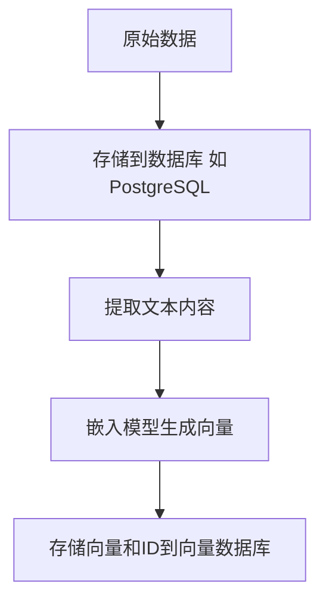

**查询流程**：

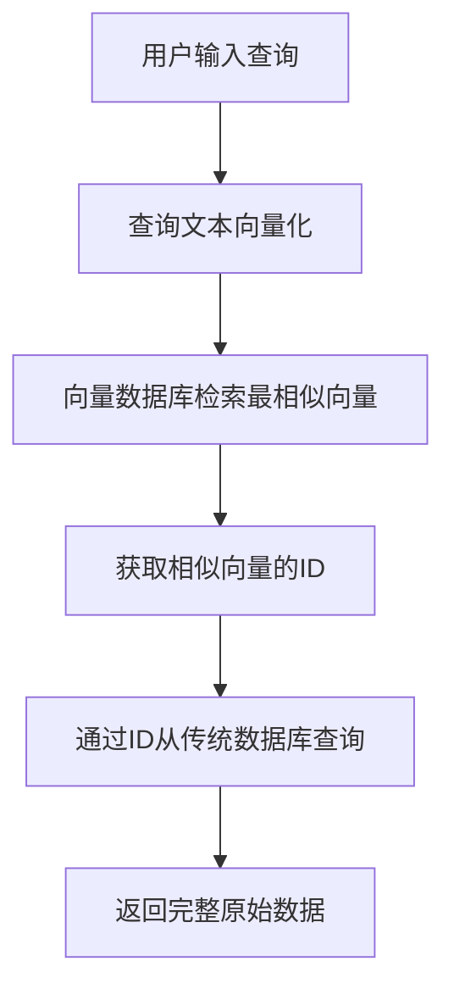

接下来我们将学习向量数据库的基础概念，深入理解其核心原理。

## 3. 向量数据库基础概念

通过上一章的学习，我们已经理解了为什么需要向量数据库。现在我们将深入探讨向量数据库的核心概念，理解它的工作原理和关键特性。

### 3.1 什么是向量数据库

向量数据库是专门用于存储、索引和查询高维向量数据的数据库系统。与传统数据库存储结构化数据（如数字、字符串）不同，向量数据库存储的是通过嵌入模型生成的向量，这些向量代表了文本、图像、音频等非结构化数据的语义信息。

**核心特点**：

| 特性 | 说明 |
|------|------|
| **高维向量存储** | 存储768、1024、1536维等高维向量数据 |
| **语义相似性检索** | 基于向量距离判断语义相似度，而非关键词匹配 |
| **近似最近邻搜索** | 使用ANN（Approximate Nearest Neighbor，近似最近邻）算法，在毫秒级从海量数据中找到最相似的向量 |
| **可扩展性** | 支持百万级、亿级甚至更大规模的向量数据 |
| **实时性** | 支持实时数据插入和查询 |

**简单类比**：

向量数据库就像一个"智能图书馆"。传统图书馆按书名或作者分类，你需要知道书名才能找到书。而向量图书馆按"内容主题"分类，当你描述"一本关于人工智能伦理的书"时，它能快速找到"AI道德指南"、"机器学习伦理"等主题相近的书籍，即使书名完全不同。

### 3.2 向量数据库的核心工作原理

向量数据库的工作流程可以分为三个核心步骤：

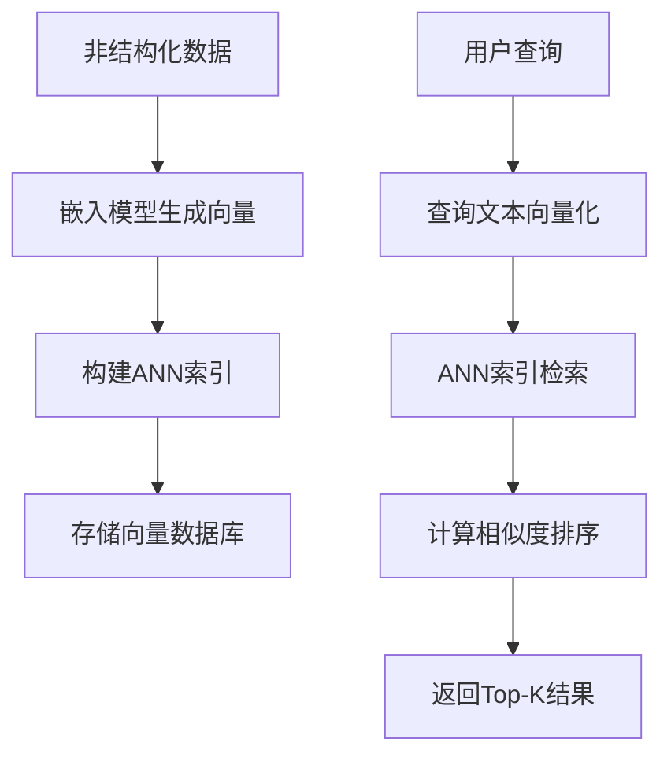

**步骤1：嵌入（Embedding）**

将非结构化数据（文本、图像等）通过嵌入模型转换为高维向量。向量的每个维度代表数据的一个特征，例如文本的"情感倾向"、"主题分类"等。

**步骤2：索引（Indexing）**

使用ANN算法构建高效的索引结构，如HNSW（分层导航小世界）、IVF（倒排文件索引）等。索引的作用是将高维向量组织成便于快速检索的结构。

**步骤3：检索（Retrieval）**

当用户发起查询时，先将查询文本转换为向量，然后在索引中快速找到最相似的向量，最后返回Top-K个最相似的结果。

### 3.3 向量数据库的关键特性

向量数据库具有以下关键特性，这些特性使其成为AI应用的理想选择：

| 特性 | 说明 | 应用场景 |
|------|------|----------|
| **ANN搜索** | 通过牺牲少量精度换取高效性能，实现毫秒级检索 | 实时推荐、语义搜索 |
| **高维向量支持** | 支持768维、1024维、1536维等高维向量 | 文本、图像、音频等多模态数据 |
| **相似度计算** | 支持余弦相似度、欧几里得距离、点积等多种距离度量 | 不同场景选择不同的相似度计算方法 |
| **可扩展性** | 支持水平扩展，处理海量数据 | 企业级知识库、大规模推荐系统 |
| **实时更新** | 支持实时数据插入和索引更新 | 动态内容推荐、实时搜索 |
| **元数据过滤** | 支持结合元数据进行过滤查询 | 多条件组合查询 |

### 3.4 向量数据库的核心组件

一个完整的向量数据库通常包含以下核心组件：

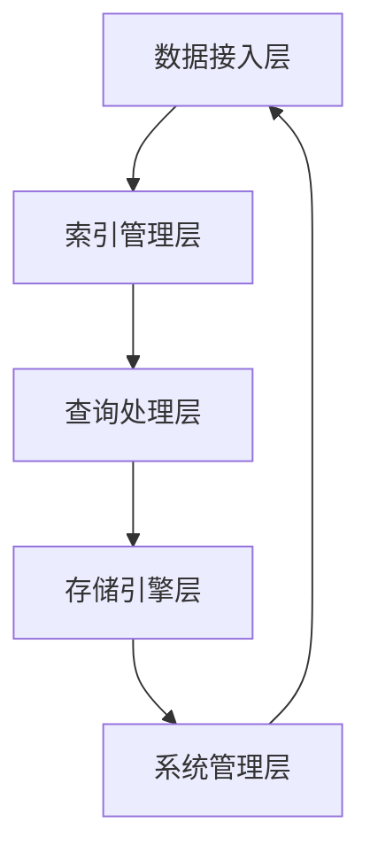

**组件说明**：

| 组件 | 职责 | 关键技术 |
|------|------|----------|
| **数据接入层** | 接收和预处理向量数据 | 数据验证、格式转换、批量导入 |
| **索引管理层** | 构建和维护高效的向量索引结构 | HNSW、IVF、LSH等ANN算法 |
| **查询处理层** | 处理相似度搜索请求并返回结果 | 查询优化、结果排序、Top-K选择 |
| **存储引擎层** | 持久化存储向量数据和索引结构 | 内存存储、磁盘持久化、数据压缩 |
| **系统管理层** | 监控、优化和维持系统运行 | 性能监控、负载均衡、容错恢复 |

### 3.5 向量相似度计算方法

向量相似度计算是向量数据库的核心，不同的距离度量方法适用于不同的场景：

| 距离度量 | 计算公式 | 特点 | 适用场景 |
|----------|----------|------|----------|
| **余弦相似度** | cos(θ) = (A·B) / (\|A\|·\|B\|) | 关注方向，忽略长度 | 文本语义相似度、推荐系统 |
| **欧几里得距离** | d(A,B) = √Σ(ai-bi)² | 关注绝对距离 | 图像相似度、空间位置 |
| **点积** | A·B = Σai·bi | 计算简单，速度快 | 归一化向量的相似度计算 |
| **曼哈顿距离** | d(A,B) = Σ\|ai-bi\| | 对异常值不敏感 | 高维稀疏向量 |

**选择建议**：

- **文本语义检索**：优先使用余弦相似度，因为它关注向量的方向而非长度，更能反映语义相似性
- **图像检索**：可以使用欧几里得距离，因为它关注绝对距离
- **性能优先**：如果向量已经归一化，可以使用点积，计算速度更快

接下来我们将学习主流向量数据库的对比，了解不同向量数据库的特点和适用场景。

## 4. 主流向量数据库对比

通过前面的学习，我们已经理解了向量数据库的核心概念。现在我们将对比当前主流的向量数据库产品，帮助我们选择最适合自己场景的方案。

### 4.1 开源向量数据库对比

开源向量数据库适合需要自主可控、成本敏感的场景。我们将对比几款主流的开源向量数据库。

| 数据库 | 开发语言 | 核心特点 | 适用场景 | 部署难度 |
|--------|----------|----------|----------|----------|
| **Milvus** | Go | 企业级、支持亿级向量、分布式架构、多索引类型 | 大规模企业应用、高性能检索 | 中等 |
| **Chroma** | Python | 轻量级、易用性强、快速集成、适合原型开发 | 快速原型、小规模应用、学习研究 | 简单 |
| **Qdrant** | Rust | 高性能、内存效率高、支持过滤查询、API友好 | 中等规模应用、需要高性能的场景 | 中等 |
| **Weaviate** | Go | 支持GraphQL、模块化架构、多模态支持 | 需要GraphQL查询、多模态检索 | 中等 |
| **FAISS** | C++ | Facebook开源、本地库、高性能、无完整数据库功能 | 本地检索、科研实验、嵌入式场景 | 复杂 |

**Milvus详细介绍**：

Milvus是一个开源的企业级向量数据库，它支持亿级向量的存储和检索。Milvus采用分布式架构，可以水平扩展以应对大规模数据需求。它支持多种索引类型，包括HNSW、IVF等，可以根据场景选择最适合的索引算法。Milvus适合企业级应用，特别是需要处理海量数据的场景。

**Chroma详细介绍**：

Chroma是一个轻量级的向量数据库，它使用Python编写，非常容易上手。Chroma的设计目标是快速集成和开发，它提供了简洁的API，开发者可以在几分钟内搭建起向量检索系统。Chroma适合小规模应用和快速原型开发，也适合学习和研究使用。

**Qdrant详细介绍**：

Qdrant使用Rust语言编写，这使它具有很高的性能和内存效率。Qdrant支持过滤查询，可以结合元数据进行精确筛选。它的API设计友好，开发者可以轻松集成。Qdrant适合中等规模的应用，特别是对性能有较高要求的场景。

### 4.2 云服务向量数据库对比

云服务向量数据库提供托管服务，无需自己部署和维护。我们将对比几款主流的云服务。

| 数据库 | 服务模式 | 核心特点 | 适用场景 | 成本 |
|--------|----------|----------|----------|------|
| **Pinecone** | 全托管SaaS | 即开即用、自动扩展、API简单、性能稳定 | 快速上线、不想运维、中小规模 | 较高 |
| **Zilliz Cloud** | Milvus云服务 | 企业级、高性能、多区域部署、专业支持 | 企业级应用、需要专业支持 | 中等 |
| **Weaviate Cloud** | Weaviate云服务 | 支持GraphQL、多模态、自动扩展 | 需要GraphQL、多模态检索 | 中等 |
| **Qdrant Cloud** | Qdrant云服务 | 高性能、易用性强、支持过滤 | 快速上线、需要高性能 | 中等 |

**Pinecone详细介绍**：

Pinecone是一个全托管的向量数据库服务，用户无需自己部署和维护基础设施。Pinecone提供简单的API，开发者可以快速集成。它支持自动扩展，可以根据数据量和查询量自动调整资源。Pinecone适合不想运维基础设施的团队，特别是需要快速上线的项目。

### 4.3 传统数据库向量扩展对比

一些传统数据库通过插件或扩展增加了向量检索能力，这样可以复用现有的数据库基础设施。

| 数据库 | 扩展方式 | 核心特点 | 适用场景 | 优势 |
|--------|----------|----------|----------|------|
| **PostgreSQL** | pgvector扩展 | 成熟稳定、支持ACID事务、SQL生态完善 | 已有PostgreSQL、需要事务支持 | 无需额外数据库 |
| **MySQL** | MySQL 8.4+原生支持 | 原生向量类型、HNSW索引、SQL生态 | 已有MySQL、需要原生支持 | 无需额外数据库 |
| **Elasticsearch** | 向量字段 | 全文检索+向量检索、分布式、成熟稳定 | 需要混合检索、已有ES | 混合检索能力强 |
| **Redis** | Redis Stack | 内存存储、高性能、缓存+向量 | 需要缓存+向量、高性能场景 | 性能极高 |

**PostgreSQL + pgvector详细介绍**：

PostgreSQL通过pgvector扩展增加了向量检索能力。这种方式的优势是可以复用现有的PostgreSQL数据库，无需部署额外的向量数据库。PostgreSQL支持ACID事务，可以保证数据的一致性。它的SQL生态非常完善，开发者可以使用熟悉的SQL语言进行查询。这种方式适合已经使用PostgreSQL的团队，特别是需要事务支持的场景。

**Elasticsearch详细介绍**：

Elasticsearch通过向量字段支持向量检索。它的优势是同时支持全文检索和向量检索，可以实现混合检索。Elasticsearch是分布式架构，可以处理大规模数据。它非常成熟稳定，有完善的监控和管理工具。这种方式适合需要混合检索的场景，比如同时需要关键词搜索和语义搜索。

### 4.4 选型建议

根据不同的应用场景，我们给出以下选型建议：

| 场景 | 推荐方案 | 理由 |
|------|----------|------|
| **企业级大规模应用** | Milvus | 支持亿级向量、分布式架构、企业级功能 |
| **快速原型开发** | Chroma | 轻量级、易用性强、快速集成 |
| **不想运维基础设施** | Pinecone | 全托管、即开即用、自动扩展 |
| **已有PostgreSQL** | pgvector | 复用现有数据库、支持事务、SQL生态 |
| **需要混合检索** | Elasticsearch | 全文检索+向量检索、成熟稳定 |
| **高性能需求** | Qdrant | Rust编写、内存效率高、性能优异 |
| **科研实验** | FAISS | 本地库、高性能、灵活可控 |

接下来我们将学习索引技术详解，深入了解HNSW、IVF等核心索引算法的原理。

## 5. 索引技术详解

通过前面的学习，我们已经了解了主流向量数据库的特点。现在我们将深入探讨向量数据库的核心技术——索引技术，这是向量数据库能够实现毫秒级检索的关键。

### 5.1 索引技术概述

向量索引是一种专门用于加速高维向量相似性搜索的数据结构。与传统数据库的B树索引不同，向量索引需要处理高维空间中的近似最近邻搜索问题。

**核心挑战**：

| 挑战 | 说明 |
|------|------|
| **维度灾难** | 高维空间中距离计算复杂度指数级增长 |
| **搜索效率** | 暴力搜索（Brute-force）的时间复杂度为O(N)，无法处理大规模数据 |
| **存储开销** | 高维向量占用大量存储空间 |
| **实时更新** | 动态数据场景下索引的实时维护 |

**主流索引算法**：

| 算法 | 类型 | 核心思想 | 适用场景 |
|------|------|----------|----------|
| **HNSW** | 图结构 | 分层导航小世界，通过多层图结构加速搜索 | 高精度、高性能场景 |
| **IVF** | 聚类索引 | 倒排文件索引，通过聚类减少搜索范围 | 大规模数据、平衡精度与性能 |
| **LSH** | 哈希索引 | 局部敏感哈希，将相似向量映射到相同哈希桶 | 高维稀疏向量、内存受限场景 |
| **PQ** | 压缩索引 | 乘积量化，压缩向量减少存储和计算开销 | 内存受限、需要压缩的场景 |

### 5.2 HNSW索引详解

HNSW（Hierarchical Navigable Small World，分层可导航小世界）是目前性能最好的向量索引算法之一，被广泛应用于主流向量数据库。

**核心原理**：

HNSW通过构建多层导航图来加速搜索。它的设计灵感来源于小世界网络和跳表（Skip List）。

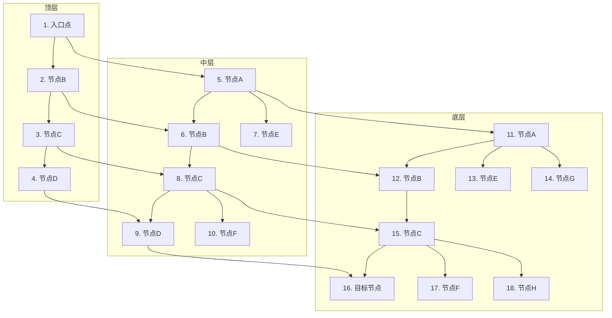

**构建过程**：

1. **分层策略**：使用几何分布随机选择插入层，顶层包含最少节点
2. **逐层插入**：从顶层开始搜索，找到最近邻节点后向下层传播
3. **连接优化**：使用启发式方法选择最优邻居，避免过度连接

**搜索过程**：

HNSW的搜索过程就像从城市的高空俯瞰开始，然后逐渐缩小范围，最终精确定位目标。具体步骤如下：

1. **顶层开始**：从顶层的入口点开始搜索。这相当于从飞机上俯瞰整个城市，看到的是主要的交通干道。

2. **贪婪搜索**：在每一层，算法会计算查询向量与当前节点所有邻居的距离，然后移动到距离最近的邻居节点。如果找不到更近的节点，就停止在当前层的搜索。

3. **逐层下降**：当在当前层无法找到更近的节点时，算法会下降到下一层，并以当前找到的最近邻节点作为下一层的起始点。这相当于从高空降到地面，从主干道转向次干道，再转向小路。

4. **底层精确**：当算法下降到最底层时，会在这一层进行更详细的搜索，找到距离查询向量最近的K个节点，作为最终的搜索结果。这相当于在小路上精确定位到具体的建筑物。

**搜索示例**：

假设我们要搜索一个与"人工智能伦理"相关的文档向量：

1. 搜索从顶层入口点开始，找到与"人工智能伦理"最相关的主题区域
2. 下降到中层，在这个主题区域内找到更具体的子主题
3. 下降到底层，在子主题中找到最相关的具体文档
4. 返回Top-K个最相关的文档作为搜索结果

HNSW的这种分层搜索策略，使得搜索时间复杂度降低到O(log n)，能够在毫秒级从亿级数据中找到最相似的向量。

**关键参数**：

| 参数 | 说明 | 推荐值 | 影响 |
|------|------|--------|------|
| **M** | 每个节点的最大连接数 | 16-64 | M越大，精度越高，但内存消耗越大 |
| **efConstruction** | 构建时的搜索范围 | 200-400 | 值越大，索引质量越高，但构建时间越长 |
| **efSearch** | 查询时的搜索范围 | 50-100 | 值越大，查询精度越高，但查询时间越长 |

**HNSW的优缺点**：

| 优势 | 劣势 |
|------|------|
| 搜索速度快（O(log n)复杂度） | 内存消耗较大 |
| 支持动态数据插入 | 构建时间较长 |
| 精度高，接近暴力搜索 | 参数调优复杂 |
| 可扩展性好 | 高维向量性能下降 |

### 5.3 IVF索引详解

IVF（Inverted File Index，倒排文件索引）是一种基于聚类的索引算法，通过减少搜索范围来提高性能。

**核心原理**：

IVF先对向量进行聚类，将向量空间划分为多个单元格（聚类中心）。查询时，只搜索最近的几个聚类中心中的向量，从而减少计算量。

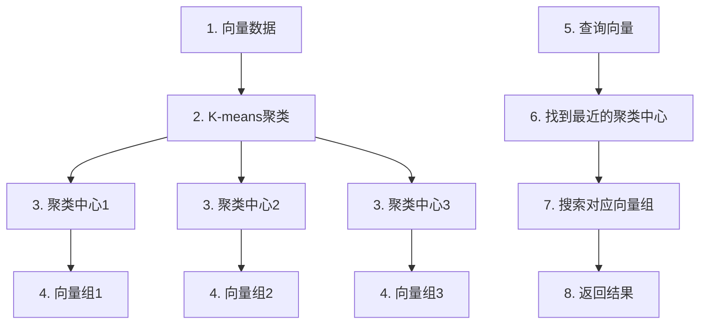

**构建过程**：

1. **聚类**：使用K-means算法对向量进行聚类，得到nlist个聚类中心。这些聚类中心就像是不同社区的中心点，每个中心点代表一个向量的聚集区域。

2. **分配**：将每个向量分配到最近的聚类中心。我们计算每个向量与所有聚类中心的距离，然后将向量归入距离最近的那个聚类中心的“社区”。

3. **存储**：为每个聚类中心创建一个倒排列表（Inverted List），存储属于该聚类的向量。

**倒排列表详解**：

倒排列表是IVF索引的核心数据结构，它的概念来源于传统的文本搜索引擎。在文本搜索中，倒排列表是从词语到文档的映射；在向量搜索中，倒排列表是从聚类中心到向量的映射。

**为什么使用倒排列表**：

| 原因 | 说明 |
|------|------|
| **减少搜索范围** | 搜索时只需访问少数几个相关的倒排列表，而不是整个数据集 |
| **提高搜索效率** | 通过聚类中心的预筛选，避免了暴力搜索的O(N)复杂度 |
| **支持动态更新** | 新向量只需分配到对应的倒排列表，无需重建整个索引 |
| **内存友好** | 每个倒排列表可以独立加载，适合处理大规模数据 |

**倒排列表示例**：

假设我们有以下向量数据：

| 向量ID | 内容 | 聚类中心 |
|--------|------|----------|
| V1 | 人工智能伦理 | 中心1（AI主题） |
| V2 | 机器学习算法 | 中心1（AI主题） |
| V3 | 数据结构与算法 | 中心2（计算机科学） |
| V4 | 数据库设计 | 中心2（计算机科学） |
| V5 | 网络安全 | 中心3（网络技术） |

构建的倒排列表如下：

- 中心1（AI主题）：[V1, V2]
- 中心2（计算机科学）：[V3, V4]
- 中心3（网络技术）：[V5]

当搜索“人工智能”相关内容时，我们只需访问中心1对应的倒排列表，大大减少了搜索范围。

**搜索过程**：

1. **找到最近的聚类中心**：计算查询向量与所有聚类中心的距离
2. **选择最近的nprobe个聚类**：通常nprobe=1-10
3. **搜索这些聚类中的向量**：计算查询向量与这些聚类中所有向量的距离
4. **排序返回**：按距离排序，返回Top-K结果

**关键参数**：

| 参数 | 说明 | 推荐值 | 影响 |
|------|------|--------|------|
| **nlist** | 聚类中心数量 | 4*sqrt(N) | nlist越大，聚类越精细，但内存消耗越大 |
| **nprobe** | 查询时搜索的聚类数量 | 1-10 | nprobe越大，精度越高，但查询时间越长 |

**IVF的优缺点**：

| 优势 | 劣势 |
|------|------|
| 内存消耗相对较小 | 精度低于HNSW |
| 构建速度快 | 对高维向量效果不佳 |
| 支持大规模数据 | 参数调优敏感 |

### 5.4 LSH索引详解

LSH（Locality-Sensitive Hashing，局部敏感哈希）是一种基于哈希的索引算法，通过将相似向量映射到相同的哈希桶来加速搜索。

**核心原理**：

LSH使用一组哈希函数，使得相似向量有很高的概率被映射到相同的哈希桶，而不相似的向量被映射到不同哈希桶的概率很高。

**构建过程**：

1. **选择哈希函数**：选择合适的局部敏感哈希函数
2. **构建哈希表**：将向量映射到哈希桶，构建哈希表
3. **存储**：将向量和其哈希值存储在哈希表中

**搜索过程**：

1. **计算查询向量的哈希值**：使用相同的哈希函数
2. **查找对应哈希桶**：找到与查询向量哈希值相同的桶
3. **计算相似度**：计算查询向量与哈希桶中所有向量的相似度
4. **排序返回**：按相似度排序，返回Top-K结果

**LSH的优缺点**：

| 优势 | 劣势 |
|------|------|
| 内存消耗小 | 精度较低 |
| 构建速度快 | 对高维向量效果不佳 |
| 支持高维稀疏向量 | 参数调优复杂 |

### 5.5 PQ索引详解

PQ（Product Quantization，乘积量化）是一种压缩索引算法，通过减少向量的存储和计算开销来提高性能。

**核心原理**：

PQ将高维向量分解为多个低维子向量，对每个子向量进行量化，用码字索引代替原始向量，从而减少存储和计算开销。

**构建过程**：

1. **分块**：将d维向量分解为m个d/m维的子向量
2. **聚类**：对每个子向量空间独立进行K-means聚类，得到k个码字
3. **量化**：将每个子向量替换为最近的码字索引
4. **存储**：存储码字和向量的量化表示

**搜索过程**：

1. **分块**：将查询向量分解为m个低维子向量
2. **距离计算**：使用预计算的距离表快速计算距离
3. **排序返回**：按距离排序，返回Top-K结果

**PQ的优缺点**：

| 优势 | 劣势 |
|------|------|
| 存储开销小 | 精度损失 |
| 计算速度快 | 构建时间长 |
| 适用于内存受限场景 | 对某些距离度量不友好 |

### 5.6 索引算法对比

| 算法 | 搜索速度 | 内存消耗 | 构建速度 | 精度 | 动态更新 | 适用场景 |
|------|----------|----------|----------|------|----------|----------|
| **HNSW** | 极快 | 高 | 慢 | 极高 | 支持 | 高精度、高性能场景 |
| **IVF** | 快 | 中 | 快 | 中 | 支持 | 大规模数据、平衡精度与性能 |
| **LSH** | 中 | 低 | 快 | 低 | 支持 | 高维稀疏向量、内存受限场景 |
| **PQ** | 快 | 极低 | 慢 | 中低 | 支持 | 内存受限、需要压缩的场景 |

### 5.7 索引选择指南

根据不同的应用场景，我们给出以下索引选择建议：

| 场景 | 推荐索引 | 理由 |
|------|----------|------|
| **高精度要求** | HNSW | 精度接近暴力搜索，性能最佳 |
| **大规模数据** | IVF | 平衡精度与性能，支持大规模数据 |
| **内存受限** | PQ | 压缩向量，大幅减少内存消耗 |
| **高维稀疏向量** | LSH | 对高维稀疏向量效果较好 |
| **混合场景** | HNSW+PQ | 结合HNSW的性能和PQ的压缩能力 |

### 5.8 索引调优最佳实践

**HNSW调优**：

1. **M参数**：根据向量维度和内存限制调整，一般为16-64
2. **efConstruction**：构建时的搜索范围，推荐值为200-400
3. **efSearch**：查询时的搜索范围，推荐值为50-100
4. **向量归一化**：对向量进行L2归一化，提高搜索精度

**IVF调优**：

1. **nlist**：聚类中心数量，推荐值为4*sqrt(N)
2. **nprobe**：查询时搜索的聚类数量，根据精度要求调整
3. **结合PQ**：使用IVF-PQ组合索引，进一步提高性能

**PQ调优**：

1. **M参数**：子向量数量，根据向量维度调整
2. **K参数**：每个子向量空间的码字数量，推荐值为256

**通用调优建议**：

1. **数据预处理**：对向量进行归一化处理
2. **批量插入**：使用批量插入提高构建速度
3. **定期重建**：对于动态数据，定期重建索引以保持性能
4. **监控指标**：关注索引大小、构建时间、查询延迟等指标

**调优流程**：

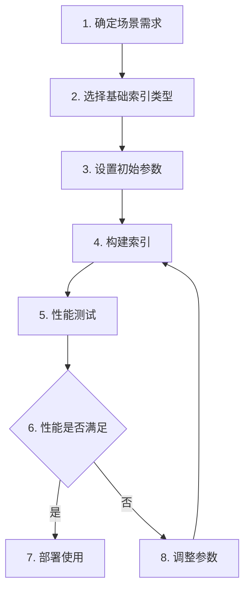

通过合理选择和调优索引算法，我们可以显著提高向量数据库的检索性能，满足不同场景的需求。

接下来我们将学习向量数据库选型指南，帮助我们根据具体场景选择最适合的向量数据库产品。

## 6. 向量数据库选型指南

在构建向量数据库时，选择合适的产品是成功的关键。我们需要考虑多个因素，包括性能、功能、扩展性、成本和生态集成等。下面我们将详细介绍向量数据库的选型指南。

### 6.1 选型考虑因素

选择向量数据库时，我们需要综合考虑以下几个关键因素：

| 因素 | 说明 | 评估要点 |
|------|------|----------|
| **性能** | 搜索速度和响应时间 | 查询延迟、QPS、Top-K搜索性能 |
| **功能** | 支持的索引类型、查询能力等 | 索引类型丰富度、过滤条件支持、批量操作能力 |
| **扩展性** | 处理数据量增长的能力 | 水平扩展能力、分片策略、高可用性 |
| **成本** | 部署和运行成本 | 硬件要求、云服务费用、维护成本 |
| **生态集成** | 与现有系统的集成能力 | 编程语言支持、框架集成、API友好性 |
| **可靠性** | 数据安全性和稳定性 | 数据备份、容灾能力、一致性保证 |
| **易用性** | 部署和管理的便捷程度 | 安装复杂度、文档质量、社区支持 |

### 6.2 主流向量数据库对比

市场上有多种向量数据库可供选择，我们对主流产品进行了详细对比：

| 产品类型 | 产品名称 | 部署方式 | 搜索性能 | 内存消耗 | 生态集成 | 适用场景 |
|----------|----------|----------|----------|----------|----------|----------|
| **开源专业向量数据库** | Milvus | 自托管/云服务 | 极高 | 高 | 丰富 | 企业级大规模应用 |
| | Qdrant | 自托管/云服务 | 高 | 中 | 良好 | 平衡性能与灵活性 |
| | Weaviate | 自托管/云服务 | 高 | 中 | 良好 | 语义搜索、知识图谱 |
| | Chroma | 自托管 | 中 | 低 | 良好 | 快速原型开发 |
| | LanceDB | 自托管 | 中 | 低 | 良好 | 数据科学工作流 |
| **云托管向量数据库** | Pinecone | 云服务 | 高 | - | 良好 | 无需运维的生产环境 |
| | 腾讯云向量数据库 | 云服务 | 高 | - | 丰富 | 国内企业级应用 |
| | 阿里云向量数据库 | 云服务 | 高 | - | 丰富 | 国内企业级应用 |
| **传统数据库扩展** | PostgreSQL + pgvector | 自托管 | 中 | 中 | 丰富 | 已有PostgreSQL部署 |
| | MySQL 8.4+ | 自托管 | 中 | 低 | 丰富 | 已有MySQL部署 |
| **搜索引擎扩展** | Elasticsearch | 自托管/云服务 | 中 | 高 | 丰富 | 混合搜索场景 |

### 6.3 场景化选型指南

根据不同的应用场景，我们推荐以下向量数据库：

| 场景 | 推荐产品 | 推荐理由 |
|------|----------|----------|
| **企业级大规模应用** | Milvus | 高性能、高扩展性，支持亿级向量数据 |
| **快速原型开发** | Chroma | 安装简单，API友好，适合小数据集测试 |
| **无需运维的生产环境** | Pinecone | 全托管服务，运维成本低，性能稳定 |
| **国内企业应用** | 腾讯云向量数据库 | 符合国内法规，本地化支持好 |
| **已有PostgreSQL部署** | PostgreSQL + pgvector | 无缝集成现有系统，降低迁移成本 |
| **混合搜索场景** | Elasticsearch | 同时支持向量搜索和文本搜索 |
| **知识图谱集成** | Weaviate | 原生支持知识图谱，语义理解能力强 |
| **数据科学工作流** | LanceDB | 与Python生态集成良好，适合数据科学家 |

### 6.4 选型流程

选择向量数据库的流程如下：

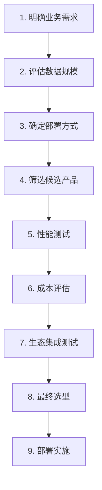

### 6.5 选型实战建议

在实际选型过程中，我们建议：

1. **先进行小规模测试**：使用真实数据集的子集进行性能测试，评估不同产品的表现

2. **考虑长期演进**：选择具有良好社区支持和持续发展的产品，避免技术债务

3. **平衡性能与成本**：根据实际需求选择合适的配置，避免过度投资

4. **关注生态系统**：选择与现有技术栈集成良好的产品，降低开发和维护成本

5. **制定迁移策略**：如果从现有系统迁移，需要制定详细的迁移计划，确保数据安全

通过以上指南，我们可以选择最适合自己业务场景的向量数据库，为RAG系统提供高效、可靠的向量存储和检索能力。

接下来我们将进入实践环节，学习如何构建和部署向量数据库。

## 7. 实践：向量数据库构建

理论学习是基础，实际操作是关键。在本节中，我们将以Milvus为例，详细介绍向量数据库的构建过程，包括安装部署、数据模型设计、索引创建、数据导入和查询测试等环节。

### 7.1 Milvus安装与部署

Milvus支持多种部署方式，我们推荐使用Docker容器化部署，这样可以快速搭建环境并确保一致性。

**Docker部署步骤**：

1. **安装Docker**：确保系统已安装Docker和Docker Compose

2. **创建docker-compose.yml文件**：

```yaml
version: '3.5'

services:
  etcd:
    container_name: milvus-etcd
    image: quay.io/coreos/etcd:v3.5.5
    environment:
      - ETCD_AUTO_COMPACTION_MODE=revision
      - ETCD_AUTO_COMPACTION_RETENTION=1000
      - ETCD_QUOTA_BACKEND_BYTES=4294967296
      - ETCD_SNAPSHOT_COUNT=50000
    volumes:
      - ./volumes/etcd:/etcd
    command: etcd -advertise-client-urls=http://127.0.0.1:2379 -listen-client-urls http://0.0.0.0:2379 --data-dir /etcd


  minio:
    container_name: milvus-minio
    image: minio/minio:RELEASE.2023-03-20T20-16-18Z
    environment:
      MINIO_ACCESS_KEY: minioadmin
      MINIO_SECRET_KEY: minioadmin
    volumes:
      - ./volumes/minio:/minio_data
    command: minio server /minio_data
    healthcheck:
      test: ["CMD", "curl", "-f", "http://localhost:9000/minio/health/live"]
      interval: 30s
      timeout: 20s
      retries: 3

  milvus:
    container_name: milvus-standalone
    image: milvusdb/milvus:v2.2.11
    environment:
      - ETCD_ENDPOINTS=etcd:2379
      - MINIO_ADDRESS=minio:9000
      - MINIO_ACCESS_KEY=minioadmin
      - MINIO_SECRET_KEY=minioadmin
    volumes:
      - ./volumes/milvus:/var/lib/milvus
    ports:
      - "19530:19530"
      - "9091:9091"
    depends_on:
      - etcd
      - minio
    command: ["milvus", "run", "standalone"]
```

3. **启动Milvus**：

```bash
docker-compose up -d
```

4. **验证部署**：

在 Linux/Mac 终端中执行：

```bash
docker ps | grep milvus
```

在 Windows PowerShell 中执行：

```powershell
docker ps | Select-String "milvus"
# 或者
# docker ps | findstr "milvus"
```

如果看到Milvus容器正在运行，说明部署成功。

### 7.2 数据模型设计

在Milvus中，数据模型主要包括Collection（集合）、Field（字段）和Entity（实体）三个概念：

- **Collection**：相当于关系型数据库中的表
- **Field**：相当于表中的列
- **Entity**：相当于表中的行

**设计数据模型**：

我们以文档检索为例，设计一个包含文档ID、标题、内容和向量的集合：

| 字段名 | 字段类型 | 描述 | 是否主键 |
|--------|----------|------|----------|
| doc_id | INT64 | 文档ID | 是 |
| title | VARCHAR | 文档标题 | 否 |
| content | VARCHAR | 文档内容 | 否 |
| embedding | FLOAT_VECTOR | 文档向量 | 否 |

**创建集合代码**：

```python
from pymilvus import connections, CollectionSchema, FieldSchema, Collection, DataType

# 连接Milvus
connections.connect("default", host="localhost", port="19530")

# 定义字段
doc_id = FieldSchema(
    name="doc_id",
    dtype=DataType.INT64,
    is_primary=True,
    auto_id=False
)
title = FieldSchema(
    name="title",
    dtype=DataType.VARCHAR,
    max_length=512
)
content = FieldSchema(
    name="content",
    dtype=DataType.VARCHAR,
    max_length=4096
)
embedding = FieldSchema(
    name="embedding",
    dtype=DataType.FLOAT_VECTOR,
    dim=384  # 向量维度，根据Embedding模型调整
)

# 定义集合schema
schema = CollectionSchema(
    fields=[doc_id, title, content, embedding],
    description="文档检索集合"
)

# 创建集合
collection = Collection(
    name="document_collection",
    schema=schema,
    using="default"
)

print("集合创建成功！")
```

### 7.3 索引创建

为了提高搜索性能，我们需要为向量字段创建索引。Milvus支持多种索引类型，我们选择HNSW索引：

**创建索引代码**：

```python
# 定义索引参数
index_params = {
    "index_type": "HNSW",
    "metric_type": "L2",  # 距离度量方式：L2欧氏距离
    "params": {
        "M": 16,  # 每个节点的最大连接数
        "efConstruction": 200  # 构建时的搜索范围
    }
}

# 创建索引
collection.create_index(
    field_name="embedding",
    index_params=index_params
)

print("索引创建成功！")

# 加载集合到内存
collection.load()
print("集合加载成功！")
```

### 7.4 数据导入

数据导入是向量数据库构建的重要环节，我们需要将文档转换为向量并导入到Milvus中：

**数据导入流程**：

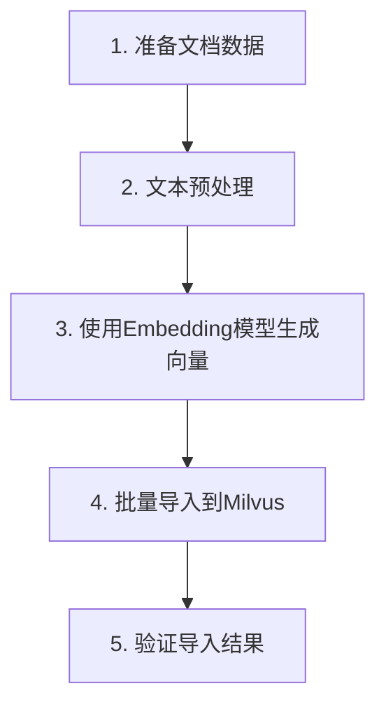

**数据导入代码**：

```python
from sentence_transformers import SentenceTransformer

# 加载Embedding模型
model = SentenceTransformer('paraphrase-multilingual-MiniLM-L12-v2')

# 准备文档数据
documents = [
    {
        "doc_id": 1,
        "title": "人工智能伦理",
        "content": "人工智能伦理是研究人工智能系统设计和应用中的道德问题的学科。"
    },
    {
        "doc_id": 2,
        "title": "机器学习算法",
        "content": "机器学习算法是一类从数据中学习规律并用于预测的算法。"
    },
    {
        "doc_id": 3,
        "title": "数据结构与算法",
        "content": "数据结构与算法是计算机科学的基础，研究数据的组织和处理方法。"
    },
    {
        "doc_id": 4,
        "title": "数据库设计",
        "content": "数据库设计是指设计数据库的结构和关系，确保数据的高效存储和检索。"
    },
    {
        "doc_id": 5,
        "title": "网络安全",
        "content": "网络安全是保护计算机网络免受未经授权的访问和攻击的技术。"
    }
]

# 生成向量
embeddings = [model.encode(doc["content"]).tolist() for doc in documents]

# 准备插入数据 - 列式插入
insert_data = [
    [doc["doc_id"] for doc in documents],  # doc_id字段
    [doc["title"] for doc in documents],   # title字段
    [doc["content"] for doc in documents], # content字段
    embeddings  # embedding字段
]

# 批量导入数据
collection.insert(insert_data)

# 刷新数据到磁盘
flush_result = collection.flush()
print(f"成功导入 {len(documents)} 条数据！")

# 查看集合统计信息
collection_stats = collection.num_entities
print(f"集合中共有 {collection_stats} 条数据！")
```

### 7.5 查询测试

数据导入完成后，我们需要进行查询测试，验证向量数据库的搜索性能：

**查询测试代码**：

```python
# 定义查询向量
query_text = "人工智能相关的道德问题"
query_vector = model.encode(query_text).tolist()

# 定义查询参数
search_params = {
    "metric_type": "L2",
    "params": {
        "ef": 50  # 查询时的搜索范围
    }
}

# 执行查询
results = collection.search(
    data=[query_vector],
    anns_field="embedding",
    param=search_params,
    limit=3,  # 返回Top-3结果
    expr=None,  # 过滤条件
    output_fields=["doc_id", "title", "content"]  # 返回的字段
)

# 打印查询结果
print(f"查询文本: {query_text}")
print("\n搜索结果:")

for i, result in enumerate(results[0]):
    print(f"\n排名 {i+1}:")
    print(f"文档ID: {result.id}")
    print(f"标题: {result.entity.get('title')}")
    print(f"内容: {result.entity.get('content')}")
    print(f"距离: {result.distance:.4f}")
```

**查询结果示例**：

```
查询文本: 人工智能相关的道德问题

搜索结果:

排名 1:
文档ID: 1
标题: 人工智能伦理
内容: 人工智能伦理是研究人工智能系统设计和应用中的道德问题的学科。
距离: 6.4374

排名 2:
文档ID: 3
标题: 数据结构与算法
内容: 数据结构与算法是计算机科学的基础，研究数据的组织和处理方法。
距离: 27.0915

排名 3:
文档ID: 2
标题: 机器学习算法
内容: 机器学习算法是一类从数据中学习规律并用于预测的算法。
距离: 29.6391
```

### 7.6 性能优化

在实际应用中，我们需要对向量数据库进行性能优化，以满足业务需求：

**优化建议**：

1. **批量操作**：使用批量插入和批量查询，减少网络开销

2. **索引调优**：根据数据特点调整索引参数，如HNSW的M和efConstruction

3. **向量归一化**：对向量进行L2归一化，提高搜索精度

4. **过滤条件**：使用表达式过滤减少搜索范围，如：

```python
expr = "title like '%人工智能%'"
results = collection.search(
    data=[query_vector],
    anns_field="embedding",
    param=search_params,
    limit=3,
    expr=expr,
    output_fields=["doc_id", "title", "content"]
)
```

5. **缓存策略**：合理使用Milvus的缓存机制，提高热点数据的访问速度

通过以上实践步骤，我们成功构建了一个基于Milvus的向量数据库，并验证了其搜索性能。在实际应用中，我们需要根据具体场景进行调整和优化，以获得最佳的性能表现。

接下来我们将总结向量数据库构建与优化的关键要点。

## 8. 总结

通过前面的学习，我们已经掌握了向量数据库的核心概念、主流产品对比、索引技术详解以及实践操作。现在我们将总结向量数据库构建与优化的关键要点，帮助我们在实际应用中做出更好的决策。

### 8.1 核心技术要点回顾

向量数据库作为RAG系统的核心组件，我们需要掌握以下几个关键技术要点：

**核心价值**：

向量数据库通过存储和检索高维向量，实现了基于语义相似度的智能检索。它解决了传统数据库无法理解语义的问题，让计算机能够像人类一样理解"火锅做法"和"麻辣烫锅底"之间的语义关联。

**关键技术**：

| 技术要点 | 核心内容 | 应用价值 |
|----------|----------|----------|
| **向量存储** | 存储768、1024、1536维等高维向量数据 | 保留文本、图像等非结构化数据的语义信息 |
| **ANN索引** | 使用HNSW、IVF等近似最近邻算法加速检索 | 从海量数据中毫秒级找到最相似向量 |
| **相似度计算** | 支持余弦相似度、欧几里得距离等多种度量 | 根据场景选择最合适的相似度计算方法 |
| **分布式架构** | 支持水平扩展，处理亿级向量数据 | 满足企业级大规模应用需求 |

**索引算法选择**：

我们学习了四种主流索引算法，它们各有优劣，适用于不同场景：

| 索引算法 | 核心优势 | 适用场景 | 注意事项 |
|----------|----------|----------|----------|
| **HNSW** | 高精度、高性能 | 对精度要求高的场景 | 内存占用较大 |
| **IVF** | 平衡精度与性能 | 大规模数据场景 | 需要调整nlist参数 |
| **LSH** | 内存效率高 | 高维稀疏向量场景 | 精度相对较低 |
| **PQ** | 压缩存储 | 内存受限场景 | 会损失一定精度 |

### 8.2 最佳实践总结

在实际应用中，我们需要遵循以下最佳实践，以确保向量数据库的高效运行：

**数据模型设计**：

我们需要合理设计数据模型，平衡存储效率和查询性能。例如，在文档检索场景中，我们设计了包含文档ID、标题、内容和向量的集合，既保证了业务逻辑的完整性，又实现了高效的语义检索。

**索引参数调优**：

索引参数的选择直接影响查询性能和召回率。我们需要根据数据特点进行调整：

| 参数 | HNSW | IVF | 调优建议 |
|------|------|-----|----------|
| **M** | 每个节点的最大连接数 | - | 通常设置为16-64，值越大精度越高但内存占用越大 |
| **efConstruction** | 构建时的搜索范围 | - | 通常设置为200-400，值越大索引质量越好但构建时间越长 |
| **nlist** | - | 聚类中心数量 | 根据数据量设置，通常为√N（N为数据量） |
| **ef** | 查询时的搜索范围 | 查询时的搜索范围 | 通常设置为top-k的10-50倍，值越大召回率越高但查询越慢 |

**性能优化策略**：

我们需要从多个维度进行性能优化，以满足业务需求：

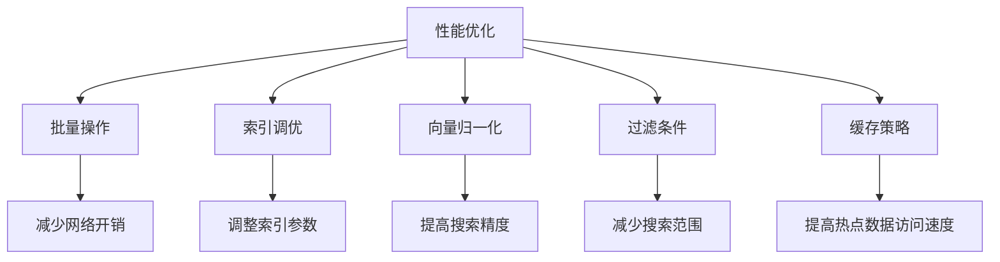

**批量操作**：使用批量插入和批量查询，减少网络开销。例如，一次插入1000条数据比插入1000次每次1条数据效率高得多。

**索引调优**：根据数据特点调整索引参数。例如，对于数据量较小的场景，可以适当降低HNSW的M值以减少内存占用；对于对召回率要求高的场景，可以增加ef值以提高召回率。

**向量归一化**：对向量进行L2归一化，提高搜索精度。归一化后的向量长度为1，可以避免向量长度对相似度计算的影响。

**过滤条件**：使用表达式过滤减少搜索范围。例如，我们可以先通过标题过滤找到包含"人工智能"的文档，再在这些文档中进行向量检索，这样可以大幅减少搜索范围，提高查询效率。

**缓存策略**：合理使用缓存机制，提高热点数据的访问速度。例如，我们可以将热门查询的结果缓存到Redis中，下次查询相同内容时直接从缓存中获取，避免重复计算。

### 8.3 未来发展趋势

向量数据库作为AI应用的核心基础设施，其发展势头强劲。根据Forrester的预测，到2026年，大多数组织都将在生产环境中使用向量数据库。

**技术演进方向**：

| 发展方向 | 核心内容 | 应用价值 |
|----------|----------|----------|
| **多模态融合** | 同时处理文本、图像、音频、视频等多种类型的数据 | 实现跨模态的语义检索，例如用文字描述搜索图片 |
| **智能化索引** | 自动感知数据特征、动态选择最优索引算法 | 摆脱人工调参的依赖，降低使用门槛 |
| **混合检索** | 结合向量搜索与传统关键词搜索 | 提供更全面的检索能力，兼顾语义和字面匹配 |
| **分布式优化** | 提升大规模数据处理能力和高并发支持 | 满足企业级亿级向量数据的处理需求 |

**市场应用拓展**：

向量数据库的应用正在从AI领域向传统领域渗透。除了作为RAG系统的核心组件，它还被广泛应用于推荐系统、安防监控、医疗诊断、金融风控等多个领域。

例如，在推荐系统中，QQ音乐通过向量检索提升人均听歌时长3.2%；在医疗领域，AI智能体能够结合X光图像、医生笔记和实验室结果，为医务人员提供精准的临床建议；在金融风控领域，PayPal利用向量相似性搜索识别欺诈交易，响应时间降至毫秒级。

**挑战与机遇**：

随着向量数据库的普及，我们也面临着一些挑战。数据隐私和合规性问题日益凸显，我们需要实施角色访问控制、数据加密等安全措施，防止向量数据库成为系统的薄弱环节。

同时，向量数据库也带来了巨大的机遇。它将成为构建AI智能体的关键基础设施，帮助企业在数字化转型中获得竞争优势。

### 8.4 学习路径建议

为了更好地掌握向量数据库，我们建议按照以下路径进行学习：

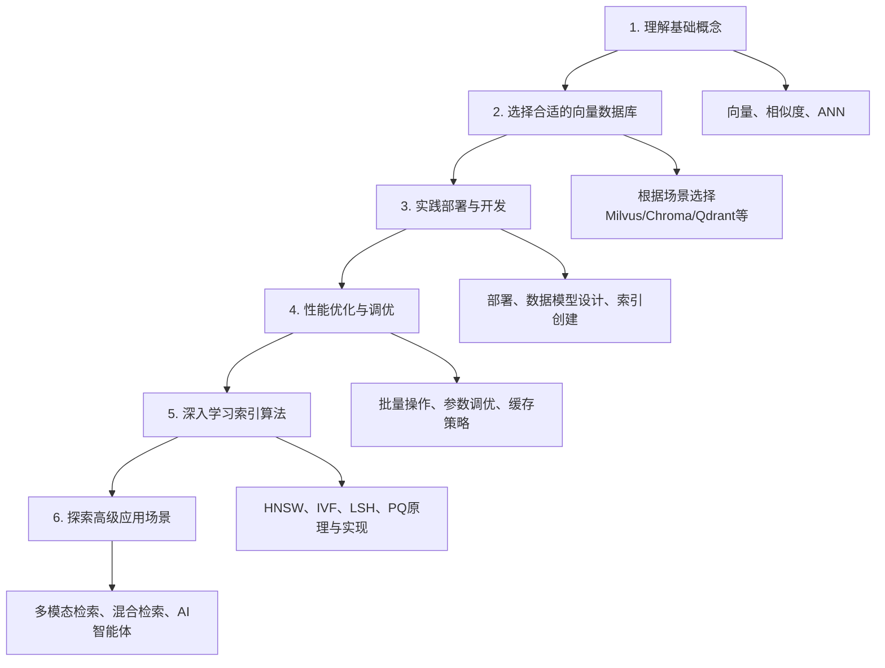

通过本章的学习，我们已经掌握了向量数据库的核心技术和最佳实践。向量数据库作为RAG系统的核心组件，为我们提供了强大的语义检索能力。在实际应用中，我们需要根据具体场景选择合适的向量数据库和索引算法，并进行合理的性能优化，以获得最佳的应用效果。

接下来，我们将学习检索算法与策略，了解如何从向量数据库中高效地检索相关文档，包括稠密检索、稀疏检索、混合检索等多种检索方式。