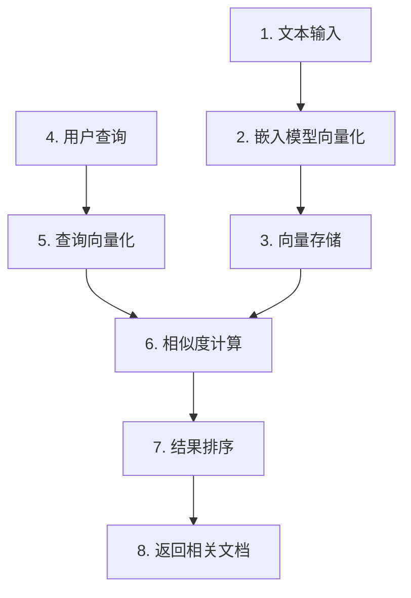
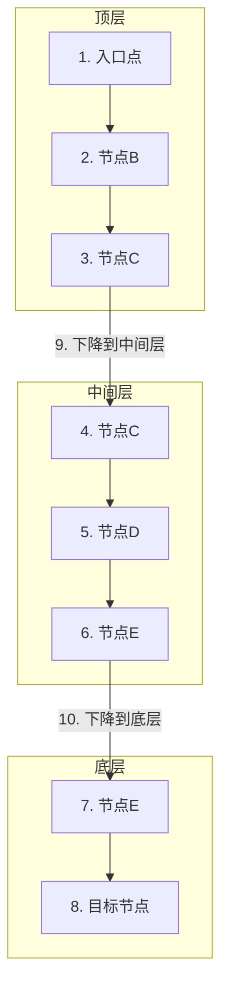
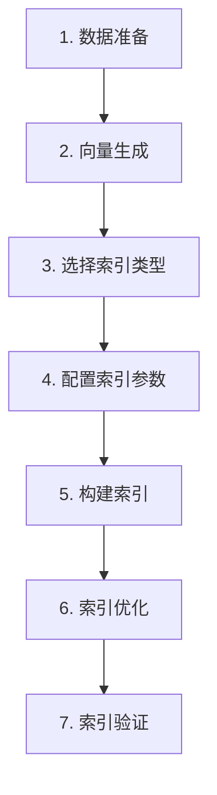
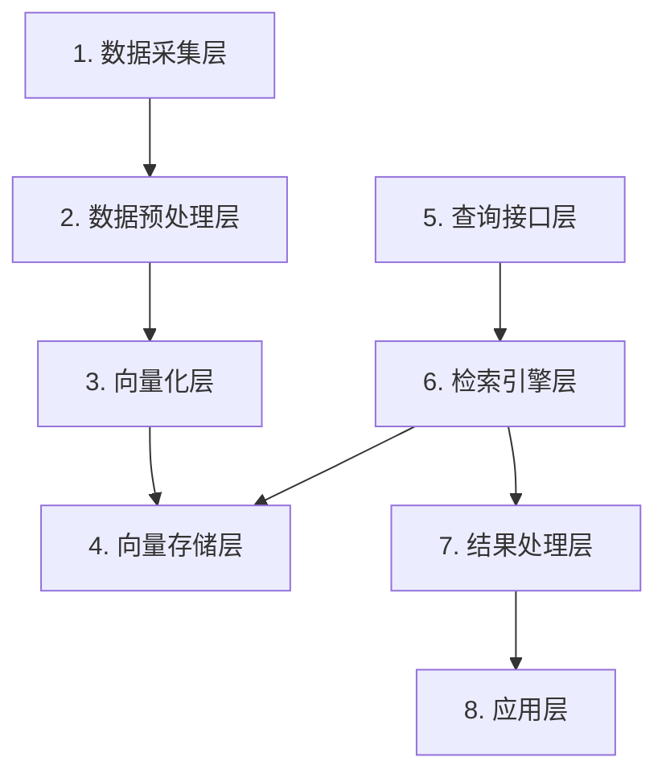
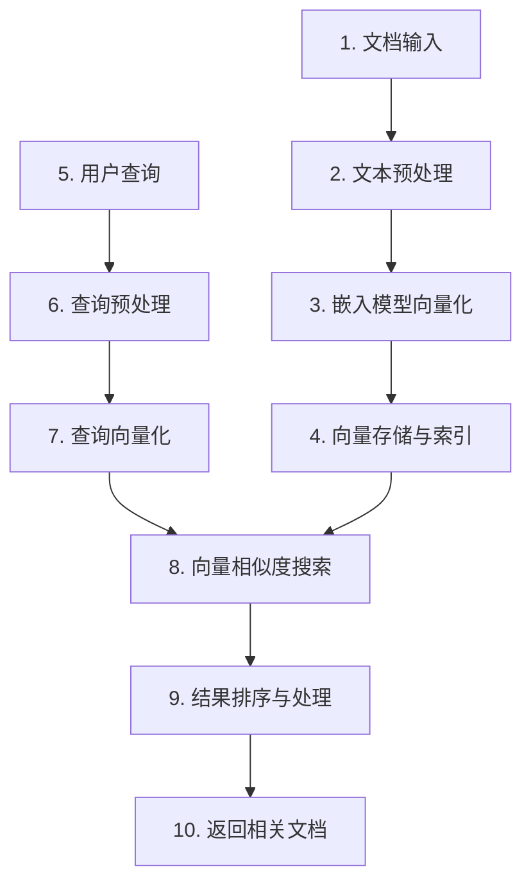

# 08a. 检索算法与策略-稠密检索技术

## 1. 概述

我们将学习稠密检索技术的核心原理和实践方法，掌握向量相似度计算、近似最近邻搜索算法和向量索引技术，构建高效的语义检索系统，为RAG应用提供准确的检索能力。

## 2. 稠密检索基础概念

### 2.1 什么是稠密检索

我们所说的稠密检索，是一种使用向量嵌入（Embedding）技术来实现语义搜索的方法。它的核心思想是把文本、图像等非结构化数据转换成低维的稠密向量，然后通过计算向量之间的相似度来找到相关内容。

简单来说，稠密检索就像给每个文档和查询都分配一个数字指纹，这个指纹能够反映它们的语义信息。当我们搜索时，系统会找到指纹最相似的文档。

### 2.2 稠密检索的核心原理

稠密检索的工作原理可以分为三个步骤：

1. **向量化**：使用嵌入模型（如BERT、BGE等）将查询和文档转换为固定维度的向量
2. **相似度计算**：计算查询向量与文档向量之间的相似度
3. **排序**：根据相似度得分对文档进行排序，返回最相关的结果



### 2.3 稠密检索与稀疏检索的对比

| 对比维度 | 稠密检索 | 稀疏检索 |
|----------|----------|----------|
| **技术原理** | 基于向量嵌入，捕捉语义信息 | 基于关键词匹配，如TF-IDF、BM25 |
| **表示方式** | 低维稠密向量 | 高维稀疏向量 |
| **语义理解** | 能够理解同义词、上下文语义 | 只能匹配字面关键词 |
| **计算复杂度** | 向量相似度计算 | 词频统计和权重计算 |
| **适用场景** | 语义检索、跨语言搜索 | 精确关键词匹配 |

### 2.4 稠密检索的优势

- **语义理解能力强**：能够理解"猫科宠物"和"猫咪"这样的语义相似性
- **跨语言检索**：不同语言的文本如果语义相似，向量也会相近
- **泛化能力好**：即使查询中包含文档中没有的词汇，也能找到相关内容
- **可扩展性强**：通过向量数据库可以高效处理大规模数据

### 2.5 稠密检索的应用场景

- **智能客服**：理解用户的自然语言问题，找到相关的知识文档
- **内容推荐**：根据用户兴趣向量推荐相似的内容
- **跨模态检索**：用文字描述搜索相关图片，或用图片搜索相关文字
- **学术文献检索**：找到主题相关的论文，即使关键词不完全匹配

通过了解这些基础概念，我们可以更好地理解稠密检索的工作原理，为后续的算法学习和实践做好准备。

## 3. 向量相似度计算

### 3.1 基本概念

我们所说的向量相似度计算，是指在向量空间中衡量两个向量之间相似程度的方法。在稠密检索中，这是核心步骤之一，直接影响检索结果的质量。

简单来说，向量相似度计算就像比较两个物品的相似程度。比如比较两个水果，我们会看它们的颜色、形状、味道等特征，向量相似度计算就是通过数学方法来量化这种相似性。

### 3.2 常用相似度计算方法

#### 3.2.1 余弦相似度（Cosine Similarity）

余弦相似度是最常用的向量相似度计算方法，它衡量的是两个向量在方向上的相似性。

**计算公式**：

```
cosine_similarity = (A · B) / (||A|| × ||B||)
```

其中：
- A · B 是向量A和向量B的点积
- ||A|| 是向量A的模长
- ||B|| 是向量B的模长

**特点**：
- 取值范围：[-1, 1]
- 值越接近1，表示两个向量方向越相似
- 值越接近-1，表示两个向量方向越相反
- 不受向量长度影响，只关注方向

**适用场景**：
- 文本相似度计算
- 推荐系统
- 图像检索

#### 3.2.2 欧几里得距离（Euclidean Distance）

欧几里得距离是计算两个向量在空间中直线距离的方法。

**计算公式**：

```
Euclidean_distance = √(Σ(Ai - Bi)²)
```

其中：
- Ai 和 Bi 分别是向量A和向量B的第i个元素
- Σ 表示对所有元素求和

**特点**：
- 取值范围：[0, ∞)
- 值越小，表示两个向量越相似
- 受向量长度影响

**适用场景**：
- 聚类分析
- 异常检测
- 低维空间的相似度计算

#### 3.2.3 点积（Dot Product）

点积是两个向量对应元素乘积的和，也是一种常用的相似度度量方法。

**计算公式**：

```
dot_product = A · B = Σ(Ai × Bi)
```

**特点**：
- 取值范围：(-∞, ∞)
- 当向量被归一化时，点积等同于余弦相似度
- 计算速度快

**适用场景**：
- 大规模向量检索
- 推荐系统中的快速排序

### 3.3 相似度计算方法对比

| 方法 | 计算复杂度 | 取值范围 | 对向量长度的敏感性 | 适用场景 |
|------|----------|----------|------------------|----------|
| **余弦相似度** | O(d) | [-1, 1] | 不敏感 | 文本、图像等语义相似度 |
| **欧几里得距离** | O(d) | [0, ∞) | 敏感 | 低维空间、聚类分析 |
| **点积** | O(d) | (-∞, ∞) | 敏感 | 归一化向量的快速计算 |

注：d 是向量的维度

### 3.4 相似度计算的应用场景

- **文本检索**：计算查询向量与文档向量的相似度，找到最相关的文档
- **推荐系统**：计算用户向量与物品向量的相似度，推荐相似的物品
- **图像搜索**：计算查询图像向量与数据库中图像向量的相似度
- **聚类分析**：根据向量相似度对数据进行分组

### 3.5 实现示例

以下是使用Python计算向量相似度的示例：

```python
import numpy as np

# 定义两个向量
vector_a = np.array([0.2, 0.5, 0.3])
vector_b = np.array([0.1, 0.6, 0.3])

# 计算余弦相似度
def cosine_similarity(a, b):
    dot_product = np.dot(a, b)
    norm_a = np.linalg.norm(a)
    norm_b = np.linalg.norm(b)
    return dot_product / (norm_a * norm_b)

# 计算欧几里得距离
def euclidean_distance(a, b):
    return np.sqrt(np.sum(np.square(a - b)))

# 计算点积
def dot_product(a, b):
    return np.dot(a, b)

# 计算并打印结果
print("余弦相似度:", cosine_similarity(vector_a, vector_b))  # 输出: 0.9806479901316268
print("欧几里得距离:", euclidean_distance(vector_a, vector_b))  # 输出: 0.1414213562373095
print("点积:", dot_product(vector_a, vector_b))  # 输出: 0.41000000000000003
```

### 3.6 选择合适的相似度计算方法

在实际应用中，我们需要根据具体场景选择合适的相似度计算方法：

- 如果关注向量的方向而非长度，选择余弦相似度
- 如果数据维度较低且关注绝对距离，选择欧几里得距离
- 如果向量已经归一化且需要快速计算，选择点积

通过了解这些向量相似度计算方法，我们可以更好地理解稠密检索的核心原理，为后续的算法学习和实践做好准备。

## 4. 近似最近邻搜索算法

### 4.1 基本概念

我们所说的近似最近邻搜索（Approximate Nearest Neighbor Search，简称ANNS），是一种在高维向量空间中快速找到与查询向量相近的向量的技术。

在稠密检索中，当向量数量非常大时，精确的最近邻搜索（Exact Nearest Neighbor Search）会变得非常缓慢，因为它需要计算查询向量与所有向量的相似度。近似最近邻搜索通过牺牲一定的精度来换取速度，是大规模向量检索的关键技术。

### 4.2 常见的近似最近邻搜索算法

#### 4.2.1 HNSW（Hierarchical Navigable Small World）

HNSW是一种基于图结构的近似最近邻搜索算法，它通过构建分层的导航小世界图来加速搜索。

**核心原理**：
1. 构建多层图结构，每一层都是一个导航小世界图
2. 搜索时从顶层开始，找到当前层的近似最近邻
3. 逐层向下搜索，不断优化结果
4. 在最底层找到最终的近似最近邻



**特点**：
- 搜索速度快，特别适合大规模数据集
- 内存消耗较大
- 构建索引的时间较长
- 精度高，接近精确搜索

**适用场景**：
- 大规模向量检索
- 对搜索速度要求较高的场景
- 内存资源充足的环境

#### 4.2.2 IVF（Inverted File）

IVF是一种基于聚类的近似最近邻搜索算法，它通过将向量空间划分为多个聚类来减少搜索范围。

**核心原理**：
1. 使用K-means算法对向量进行聚类，得到多个聚类中心
2. 为每个聚类中心创建一个倒排列表，存储属于该聚类的向量
3. 搜索时，先找到与查询向量最近的k个聚类中心
4. 只在这k个聚类的倒排列表中搜索最近邻

**特点**：
- 构建索引速度快
- 内存消耗适中
- 搜索速度与聚类数量相关
- 精度取决于搜索的聚类数量

**适用场景**：
- 中等规模的向量检索
- 对索引构建速度有要求的场景
- 内存资源有限的环境

#### 4.2.3 LSH（Locality-Sensitive Hashing）

LSH是一种基于哈希的近似最近邻搜索算法，它通过哈希函数将相似的向量映射到相同的桶中。

**核心原理**：
1. 设计多个局部敏感哈希函数
2. 将向量通过哈希函数映射到不同的桶中
3. 搜索时，只在与查询向量哈希到相同桶的向量中寻找最近邻

**特点**：
- 内存消耗小
- 搜索速度快
- 精度较低
- 对高维数据效果较好

**适用场景**：
- 大规模高维向量检索
- 对内存消耗有严格限制的场景
- 对搜索精度要求不高的场景

#### 4.2.4 PQ（Product Quantization）

PQ是一种基于向量压缩的近似最近邻搜索算法，它通过将高维向量分解为多个子向量并分别量化来减少内存消耗。

**核心原理**：
1. 将高维向量分解为多个低维子向量
2. 对每个子向量进行量化，用码字表示
3. 存储量化后的码字，减少内存消耗
4. 搜索时，使用距离表快速计算近似距离

**特点**：
- 内存消耗非常小
- 搜索速度快
- 精度取决于量化的位数
- 适合高维向量

**适用场景**：
- 内存资源非常有限的场景
- 高维向量检索
- 对搜索速度要求较高的场景

### 4.3 近似最近邻搜索算法对比

| 算法 | 搜索速度 | 内存消耗 | 索引构建速度 | 精度 | 适用场景 |
|------|----------|----------|--------------|------|----------|
| **HNSW** | 极快 | 高 | 慢 | 极高 | 大规模向量检索 |
| **IVF** | 快 | 中 | 快 | 中高 | 中等规模向量检索 |
| **LSH** | 快 | 低 | 快 | 中 | 大规模高维向量检索 |
| **PQ** | 极快 | 极低 | 中 | 中 | 内存受限的高维向量检索 |

### 4.4 算法选择指南

在实际应用中，我们需要根据具体场景选择合适的近似最近邻搜索算法：

- **如果追求最高精度**：选择HNSW
- **如果内存资源有限**：选择PQ或LSH
- **如果需要快速构建索引**：选择IVF或LSH
- **如果向量维度很高**：选择LSH或PQ
- **如果数据集非常大**：选择HNSW或IVF

### 4.5 实践中的调优策略

- **HNSW调优**：调整M（每个节点的最大邻居数）和efConstruction（构建时的搜索宽度）参数
- **IVF调优**：调整nlist（聚类中心数量）和nprobe（搜索时检查的聚类数量）参数
- **LSH调优**：调整哈希函数数量和桶的大小
- **PQ调优**：调整子向量的数量和量化位数

### 4.6 实现示例

以下是使用Python和FAISS库实现近似最近邻搜索的示例：

```python
import numpy as np
import faiss

# 生成随机向量数据
dim = 128  # 向量维度
n = 10000  # 向量数量
x = np.random.random((n, dim)).astype('float32')

# 构建HNSW索引
index = faiss.IndexHNSWFlat(dim, 16)  # 16是每个节点的最大邻居数
index.add(x)

# 生成查询向量
query = np.random.random((1, dim)).astype('float32')

# 搜索k个最近邻
k = 5
distances, indices = index.search(query, k)

print("搜索结果:")
for i in range(k):
    print(f"第{i+1}近的向量: 索引={indices[0][i]}, 距离={distances[0][i]}")

# 输出示例:
# 搜索结果:
# 第1近的向量: 索引=5137, 距离=13.843911170959473
# 第2近的向量: 索引=4631, 距离=14.077919960021973
# 第3近的向量: 索引=9071, 距离=14.14140510559082
# 第4近的向量: 索引=7561, 距离=14.166242599487305
# 第5近的向量: 索引=5829, 距离=14.173811912536621
```

通过了解这些近似最近邻搜索算法，我们可以根据具体场景选择合适的算法，为稠密检索系统提供高效的向量搜索能力。

## 5. 向量索引技术

### 5.1 基本概念

我们所说的向量索引，是一种专门为高维向量数据设计的数据结构，它能够加速向量相似度搜索的过程。在稠密检索中，向量索引是实现高效检索的关键。

简单来说，向量索引就像图书馆的分类系统，它通过特定的组织方式，让我们能够快速找到需要的书籍（向量），而不需要遍历整个图书馆（向量集合）。

### 5.2 常见的向量索引类型

#### 5.2.1 基于图的索引

基于图的索引是通过构建图结构来组织向量数据，其中每个节点代表一个向量，边代表向量之间的相似关系。

**HNSW索引**：
- **核心原理**：构建多层导航小世界图，通过分层搜索提高效率
- **特点**：搜索速度快，精度高，但内存消耗大
- **适用场景**：对搜索速度和精度要求较高的场景

#### 5.2.2 基于聚类的索引

基于聚类的索引是通过将向量空间划分为多个聚类来减少搜索范围。

**IVF索引**：
- **核心原理**：使用K-means算法对向量进行聚类，搜索时只在相关聚类中查找
- **特点**：构建速度快，内存消耗适中
- **适用场景**：中等规模的向量检索

#### 5.2.3 基于哈希的索引

基于哈希的索引是通过哈希函数将相似的向量映射到相同的桶中。

**LSH索引**：
- **核心原理**：设计局部敏感哈希函数，将相似向量映射到相同桶
- **特点**：内存消耗小，搜索速度快，但精度较低
- **适用场景**：大规模高维向量检索

#### 5.2.4 基于压缩的索引

基于压缩的索引是通过向量压缩技术来减少内存消耗。

**PQ索引**：
- **核心原理**：将高维向量分解为多个子向量并量化
- **特点**：内存消耗极小，搜索速度快
- **适用场景**：内存资源有限的场景

### 5.3 索引构建与维护

#### 5.3.1 索引构建流程



#### 5.3.2 索引维护策略

- **增量更新**：当有新向量加入时，动态更新索引
- **定期重建**：当数据量变化较大时，重新构建索引
- **碎片整理**：定期清理索引中的碎片数据
- **备份与恢复**：定期备份索引，确保数据安全

### 5.4 索引参数调优

#### 5.4.1 HNSW索引调优

| 参数 | 描述 | 调优建议 |
|------|------|----------|
| M | 每个节点的最大邻居数 | 16-64，值越大搜索精度越高，但内存消耗也越大 |
| efConstruction | 构建时的搜索宽度 | 100-200，值越大索引质量越高，但构建时间越长 |
| efSearch | 搜索时的搜索宽度 | 50-100，值越大搜索精度越高，但搜索时间越长 |

#### 5.4.2 IVF索引调优

| 参数 | 描述 | 调优建议 |
|------|------|----------|
| nlist | 聚类中心数量 | 数据量的平方根左右，如10000条数据设为100 |
| nprobe | 搜索时检查的聚类数量 | 5-100，值越大搜索精度越高，但搜索时间越长 |

#### 5.4.3 PQ索引调优

| 参数 | 描述 | 调优建议 |
|------|------|----------|
| nsubq | 子向量数量 | 8-16，值越大精度越高，但内存消耗也越大 |
| nbits | 每个子向量的量化位数 | 8-12，值越大精度越高，但压缩率越低 |

### 5.5 索引选择策略

在实际应用中，我们需要根据具体场景选择合适的索引类型：

- **如果追求最高搜索性能**：选择HNSW索引
- **如果内存资源有限**：选择PQ或LSH索引
- **如果需要快速构建索引**：选择IVF索引
- **如果向量维度很高**：选择LSH或PQ索引
- **如果数据集经常更新**：选择支持增量更新的索引

### 5.6 实践示例

**注意**：使用Docker创建和部署Milvus的详细步骤，请参考《07-向量数据库构建与优化.md》的第7.1节"Milvus安装与部署"。

对应链接：
- 掘金：https://juejin.cn/post/7610421035330961450
- CSDN：https://blog.csdn.net/2301_79239314/article/details/158369377

以下是使用Milvus向量数据库创建和使用HNSW索引的示例：

```python
from pymilvus import connections, FieldSchema, CollectionSchema, DataType, Collection, utility

# 连接到Milvus
connections.connect("default", host="localhost", port="19530")

# 定义集合结构
fields = [
    FieldSchema(name="id", dtype=DataType.INT64, is_primary=True),
    FieldSchema(name="title", dtype=DataType.VARCHAR, max_length=256),
    FieldSchema(name="content", dtype=DataType.VARCHAR, max_length=1024),
    FieldSchema(name="embedding", dtype=DataType.FLOAT_VECTOR, dim=384)
]
schema = CollectionSchema(fields, "文档集合")

# 创建集合
collection_name = "document_collection"
if utility.has_collection(collection_name):
    utility.drop_collection(collection_name)
collection = Collection(name=collection_name, schema=schema)

# 创建HNSW索引
index_params = {
    "index_type": "HNSW",
    "metric_type": "L2",
    "params": {
        "M": 16,
        "efConstruction": 200
    }
}
collection.create_index("embedding", index_params)

# 加载集合到内存
collection.load()

print("索引创建成功！")
```

### 5.7 向量索引的未来发展

- **多模态索引**：支持文本、图像、音频等多种模态的向量索引
- **自适应索引**：根据数据分布自动调整索引参数
- **分布式索引**：支持大规模分布式向量检索
- **实时索引**：支持实时数据更新和检索

通过了解这些向量索引技术，我们可以根据具体场景选择合适的索引类型和参数，为稠密检索系统提供高效的向量搜索能力。

## 6. 稠密检索性能优化

在前面的章节中，我们学习了稠密检索的基础概念、向量相似度计算、近似最近邻搜索算法和向量索引技术。现在，我们需要关注如何优化稠密检索的性能，以确保在处理大规模数据时能够快速响应。

### 6.1 性能优化的基本原则

我们在优化稠密检索性能时，需要遵循以下基本原则：

- **平衡精度与速度**：近似最近邻搜索算法通过牺牲一定的精度来换取速度，我们需要根据具体场景找到最佳平衡点
- **合理选择索引类型**：不同的索引类型适用于不同的场景，需要根据数据规模、查询频率等因素选择合适的索引
- **优化向量维度**：过高的向量维度会增加计算复杂度，过低的维度会影响检索精度，需要找到合适的维度
- **系统资源配置**：合理配置CPU、内存和存储资源，确保系统能够高效运行

### 6.2 索引优化

#### 6.2.1 索引类型选择

| 索引类型 | 适用场景 | 优势 | 劣势 |
|---------|---------|------|------|
| **HNSW** | 大规模数据，对搜索速度要求高 | 搜索速度快，精度高 | 内存消耗大，构建时间长 |
| **IVF** | 中等规模数据，需要平衡速度和内存 | 构建速度快，内存消耗适中 | 搜索精度相对较低 |
| **PQ** | 内存资源有限，高维向量 | 内存消耗极小，搜索速度快 | 精度取决于量化质量 |
| **LSH** | 大规模高维数据 | 内存消耗小，搜索速度快 | 精度较低 |

#### 6.2.2 索引参数调优

**HNSW索引调优**：
- **M**：每个节点的最大邻居数，建议值16-64，值越大搜索精度越高，但内存消耗也越大
- **efConstruction**：构建时的搜索宽度，建议值100-200，值越大索引质量越高，但构建时间越长
- **efSearch**：搜索时的搜索宽度，建议值50-100，值越大搜索精度越高，但搜索时间越长

**IVF索引调优**：
- **nlist**：聚类中心数量，建议值为数据量的平方根左右
- **nprobe**：搜索时检查的聚类数量，建议值5-100，值越大搜索精度越高，但搜索时间越长

### 6.3 向量计算优化

#### 6.3.1 向量维度优化

- **维度压缩**：使用PCA等降维技术减少向量维度，降低计算复杂度
- **向量量化**：使用PQ等量化技术减少向量存储空间，加速相似度计算
- **批量计算**：使用批量处理技术，一次性计算多个向量的相似度

#### 6.3.2 计算方法优化

- **选择合适的相似度计算方法**：根据向量特性选择合适的相似度计算方法
- **使用GPU加速**：对于大规模向量计算，使用GPU加速相似度计算
- **并行计算**：利用多线程或分布式计算技术加速向量计算

### 6.4 系统级优化

#### 6.4.1 硬件优化

- **CPU选择**：选择高主频、多核心的CPU，适合并行计算
- **内存配置**：配置足够的内存，确保索引能够完全加载到内存中
- **存储选择**：使用SSD存储，提高数据读写速度

#### 6.4.2 软件优化

- **缓存策略**：实现查询结果缓存，减少重复计算
- **批量处理**：批量处理查询请求，提高系统吞吐量
- **负载均衡**：使用负载均衡技术，分散查询压力

### 6.5 实践示例

以下是使用FAISS库优化HNSW索引性能的示例：

```python
import numpy as np
import faiss

# 生成随机向量数据
dim = 128  # 向量维度
n = 100000  # 向量数量
x = np.random.random((n, dim)).astype('float32')

# 优化HNSW索引参数
M = 16  # 每个节点的最大邻居数
efConstruction = 200  # 构建时的搜索宽度
efSearch = 100  # 搜索时的搜索宽度

# 构建优化后的HNSW索引
index = faiss.IndexHNSWFlat(dim, M)
index.hnsw.efConstruction = efConstruction
index.hnsw.efSearch = efSearch
index.add(x)

# 生成查询向量
query = np.random.random((1, dim)).astype('float32')

# 搜索k个最近邻
k = 5
distances, indices = index.search(query, k)

print("搜索结果:")
for i in range(k):
    print(f"第{i+1}近的向量: 索引={indices[0][i]}, 距离={distances[0][i]}")

# 输出示例:
# 搜索结果:
# 第1近的向量: 索引=33707, 距离=11.812564849853516
# 第2近的向量: 索引=79429, 距离=13.18735408782959
# 第3近的向量: 索引=654, 距离=13.475223541259766
# 第4近的向量: 索引=518, 距离=13.479194641113281
# 第5近的向量: 索引=27289, 距离=13.546560287475586
```

### 6.6 性能评估方法

我们需要建立一套性能评估体系，来衡量稠密检索系统的性能：

- **搜索延迟**：从查询开始到返回结果的时间
- **吞吐量**：单位时间内处理的查询数量
- **召回率**：返回的相关结果占总相关结果的比例
- **准确率**：返回结果中相关结果的比例
- **内存消耗**：系统运行时的内存使用情况

### 6.7 性能优化最佳实践

1. **数据预处理**：对原始数据进行清洗和预处理，提高向量质量
2. **批量索引**：批量添加向量到索引中，减少索引构建时间
3. **定期维护**：定期重建索引，确保索引质量
4. **监控系统**：实时监控系统性能，及时发现问题
5. **持续调优**：根据实际使用情况，持续优化系统参数

### 6.8 个人经验：小批量测试策略

在实际项目中，我们发现采用小批量数据进行多次测试是一种非常有效的性能优化方法。通过这种方法，我们可以快速验证不同方案的性能表现，找到最佳的参数组合。

**小批量测试的优势**：
- **快速验证**：在短时间内完成测试，快速评估不同方案的效果
- **资源节省**：不需要使用完整的大规模数据集，减少计算资源消耗
- **参数调优**：通过小批量测试可以快速调整索引参数（如HNSW的M值、efConstruction值等）
- **场景模拟**：可以针对不同的查询场景进行测试，找到最适合特定场景的方案
- **风险降低**：在小批量数据上测试新方案，避免对生产环境造成影响

**小批量测试的实施步骤**：
1. **数据选择**：选择具有代表性的小批量数据，包含各种类型的查询场景
2. **方案测试**：测试不同索引类型和参数组合的性能表现
3. **多指标评估**：同时关注搜索速度、召回率和准确率等多个指标
4. **结果分析**：记录每次测试的结果，进行详细的对比分析
5. **规模验证**：在小批量测试找到最佳方案后，再在更大规模的数据上验证

这种方法不仅适用于向量检索系统的性能优化，也是许多工程实践中的通用策略。通过小批量测试，我们可以在保证系统性能的同时，大大减少优化过程中的资源消耗和时间成本。

通过以上优化策略，我们可以显著提升稠密检索系统的性能，为用户提供更快、更准确的搜索体验。

接下来，我们将通过实践来构建一个完整的稠密检索系统，将理论知识应用到实际项目中。

## 7. 实践：稠密检索系统构建

前面我们学习了稠密检索的理论知识和性能优化策略，现在我们将通过实践来构建一个完整的稠密检索系统。我们将从系统架构设计开始，逐步实现数据预处理、向量生成、存储和检索等核心功能。

### 7.1 系统架构设计

一个完整的稠密检索系统通常包含以下组件：



**各组件的功能**：
- **数据采集层**：负责收集和获取原始数据，如文档、网页、数据库等
- **数据预处理层**：对原始数据进行清洗、分块和格式化处理
- **向量化层**：使用嵌入模型将文本转换为向量
- **向量存储层**：使用向量数据库存储向量数据
- **查询接口层**：提供用户查询的入口
- **检索引擎层**：执行向量相似度搜索
- **结果处理层**：处理和排序检索结果
- **应用层**：将检索结果应用到具体场景

### 7.2 数据预处理流程

数据预处理是稠密检索系统的重要环节，直接影响检索质量。关于数据预处理的详细步骤和文档分块策略，请参考以下文档：

- **数据预处理步骤**：请参考《03-数据预处理流水线.md》
  - 掘金：[03-数据预处理流水线](https://juejin.cn/post/7605042079669927951)
  - CSDN：[03-数据预处理流水线](https://blog.csdn.net/2301_79239314/article/details/157974263)
- **文档分块策略**：请参考《05-文本分块策略设计.md》
  - 掘金：[05. 文本分块策略设计](https://juejin.cn/post/7606589625743130674)
  - CSDN：[05. 文本分块策略设计](https://blog.csdn.net/2301_79239314/article/details/158156489)

### 7.3 向量生成与存储

#### 7.3.1 嵌入模型选择

关于嵌入模型的详细介绍和选择指南，请参考《06-Embedding模型与向量化.md》：
- 掘金：[06. Embedding模型与向量化](https://juejin.cn/post/7608760065668137010)
- CSDN：[06. Embedding模型与向量化](https://blog.csdn.net/2301_79239314/article/details/158289587)

#### 7.3.2 向量存储方案

关于向量数据库的详细对比和选择指南，请参考《07-向量数据库构建与优化.md》：
- 掘金：[07. 向量数据库构建与优化](https://juejin.cn/post/7610421035330961450)
- CSDN：[07. 向量数据库构建与优化](https://blog.csdn.net/2301_79239314/article/details/158369377)

### 7.4 检索系统实现

稠密检索系统的各个模块之间的工作流程如下：



**各模块的功能说明**：
1. **文档输入**：收集和获取原始文档数据
2. **文本预处理**：清洗、分块和格式化文本
3. **嵌入模型向量化**：使用嵌入模型将文本转换为向量
4. **向量存储与索引**：将向量存储到向量数据库并构建索引
5. **用户查询**：接收用户的搜索查询
6. **查询预处理**：对查询进行清洗和格式化
7. **查询向量化**：将查询转换为向量
8. **向量相似度搜索**：在向量数据库中搜索相似向量
9. **结果排序与处理**：根据相似度对结果进行排序和处理
10. **返回相关文档**：将最相关的文档返回给用户

接下来，我们将实现图表中的核心步骤（步骤3-4和步骤7-10），使用Python和FAISS构建一个完整的稠密检索系统：

以下是使用Python和FAISS实现的简单稠密检索系统示例：

```python
import numpy as np  # 用于数值计算和数组操作
import faiss  # 用于高效的向量相似度搜索
from sentence_transformers import SentenceTransformer  # 用于文本向量化

class DenseRetrievalSystem: 
    """稠密检索系统类，实现文本的向量检索功能"""
    
    def __init__(self, embedding_model_name="BAAI/bge-small-en-v1.5"): 
        """初始化检索系统
        
        Args:
            embedding_model_name (str): 嵌入模型名称，默认使用BAAI的bge-small-en-v1.5模型
        """
        # 初始化嵌入模型，用于将文本转换为向量
        self.model = SentenceTransformer(embedding_model_name) 
        # 初始化向量索引，用于存储和搜索向量
        self.index = None 
        # 存储原始文档，用于返回搜索结果
        self.documents = [] 
    
    def add_documents(self, documents): 
        """添加文档到检索系统
        
        Args:
            documents (list): 文档列表，每个元素是一个字符串
        """
        # 生成文档向量 - 实现图表中的步骤3：嵌入模型向量化
        embeddings = self.model.encode(documents) 
        
        # 转换为float32格式，FAISS要求的格式
        embeddings = np.array(embeddings, dtype=np.float32) 
        
        # 构建HNSW索引 - 实现图表中的步骤4：向量存储与索引
        dim = embeddings.shape[1]  # 获取向量维度
        if self.index is None: 
            # 创建HNSW索引，16是每个节点的最大邻居数
            self.index = faiss.IndexHNSWFlat(dim, 16) 
        
        # 添加向量到索引
        self.index.add(embeddings) 
        # 存储原始文档，用于后续返回搜索结果
        self.documents.extend(documents) 
        
        print(f"添加了 {len(documents)} 个文档，当前索引大小: {len(self.documents)}") 
    
    def search(self, query, k=5): 
        """搜索相关文档
        
        Args:
            query (str): 查询文本
            k (int): 返回的结果数量，默认返回5个
            
        Returns:
            list: 搜索结果列表，每个元素包含文档内容、距离和相似度
        """
        # 生成查询向量 - 实现图表中的步骤7：查询向量化
        query_embedding = self.model.encode([query]) 
        query_embedding = np.array(query_embedding, dtype=np.float32) 
        
        # 搜索相似向量 - 实现图表中的步骤8：向量相似度搜索
        distances, indices = self.index.search(query_embedding, k) 
        
        # 处理搜索结果 - 实现图表中的步骤9：结果排序与处理
        results = [] 
        for i, idx in enumerate(indices[0]): 
            # 计算相似度（距离越小相似度越高）
            similarity = 1 / (1 + distances[0][i]) 
            results.append({ 
                "document": self.documents[idx],  # 原始文档内容
                "distance": distances[0][i],  # 欧几里得距离
                "similarity": similarity  # 转换后的相似度
            }) 
        
        return results  # 实现图表中的步骤10：返回相关文档

# 使用示例 
if __name__ == "__main__": 
    # 初始化检索系统 
    system = DenseRetrievalSystem() 
    
    # 添加示例文档 - 实现图表中的步骤1：文档输入
    sample_documents = [ 
        "人工智能是研究、开发用于模拟、延伸和扩展人的智能的理论、方法、技术及应用系统的一门新的技术科学。", 
        "机器学习是人工智能的一个分支，它使计算机系统能够从数据中学习并改进性能，而不需要明确的编程。", 
        "深度学习是机器学习的一个分支，它使用多层神经网络来模拟人脑的学习过程。", 
        "自然语言处理是人工智能的一个领域，它使计算机能够理解、解释和生成人类语言。", 
        "计算机视觉是人工智能的一个领域，它使计算机能够从图像或视频中提取有意义的信息。" 
    ] 
    
    system.add_documents(sample_documents) 
    
    # 测试搜索 - 实现图表中的步骤5：用户查询
    query = "什么是深度学习？" 
    results = system.search(query, k=3) 
    
    # 打印搜索结果
    print(f"查询: {query}") 
    print("搜索结果:") 
    for i, result in enumerate(results): 
        print(f"{i+1}. 相似度: {result['similarity']:.4f}") 
        print(f"   内容: {result['document']}") 
        print()

# 输出示例:
# 添加了 5 个文档，当前索引大小: 5
# 查询: 什么是深度学习？
# 搜索结果:
# 1. 相似度: 0.7990
#    内容: 深度学习是机器学习的一个分支，它使用多层神经网络来模拟人脑的学习过程。
# 
# 2. 相似度: 0.7616
#    内容: 机器学习是人工智能的一个分支，它使计算机系统能够从数据中学习并改进性能，而不需要明确的编程。
# 
# 3. 相似度: 0.7126
#    内容: 人工智能是研究、开发用于模拟、延伸和扩展人的智能的理论、方法、技术及应用系统的一门新的技术科学。
```


### 7.5 系统优化与部署

#### 7.5.1 性能优化

- **批量处理**：批量处理文档和查询，减少网络开销
- **缓存策略**：缓存热门查询的结果
- **索引优化**：根据数据特点选择合适的索引类型和参数
- **硬件加速**：使用GPU加速向量计算

#### 7.5.2 部署方案

- **本地部署**：适合小规模应用，部署简单
- **容器化部署**：使用Docker容器化，便于管理和扩展
- **云服务部署**：使用云服务提供商的托管服务，减少运维成本

### 7.6 完整案例实现

在前面的章节中，我们学习了稠密检索系统的各个组件。现在，我们将实现一个完整的稠密检索系统，包含数据预处理、向量化、存储和检索的完整流程。

```python
import re
import json
import numpy as np
import faiss
from sentence_transformers import SentenceTransformer

class CompleteDenseRetrievalSystem:
    """完整的稠密检索系统，支持文档管理、向量化和语义搜索"""
    
    def __init__(self, embedding_model_name="BAAI/bge-small-en-v1.5"):
        """初始化检索系统
        
        Args:
            embedding_model_name (str): 嵌入模型名称，默认使用BAAI的bge-small-en-v1.5模型
        """
        # 初始化嵌入模型
        self.model = SentenceTransformer(embedding_model_name)
        # 向量索引
        self.index = None
        # 存储原始文档
        self.documents = []
        # 存储文档元数据
        self.metadata = []
        # 向量维度
        self.dim = None
    
    def preprocess_text(self, text):
        """预处理文本
        
        Args:
            text (str): 原始文本
            
        Returns:
            str: 预处理后的文本
        """
        # 去除多余空白字符
        text = re.sub(r'\s+', ' ', text)
        # 去除特殊字符，保留中英文和常用标点
        text = re.sub(r'[^\w\s\u4e00-\u9fff，。！？；：、（）【】《》]', '', text)
        # 去除首尾空白
        text = text.strip()
        return text
    
    def chunk_text(self, text, chunk_size=200, overlap=50):
        """将长文本分割成小块
        
        Args:
            text (str): 原始文本
            chunk_size (int): 每个文本块的最大字符数
            overlap (int): 相邻文本块之间的重叠字符数
            
        Returns:
            list: 文本块列表
        """
        chunks = []
        start = 0
        while start < len(text):
            # 获取文本块
            end = start + chunk_size
            chunk = text[start:end]
            # 如果不是最后一块，尝试在句号处分割
            if end < len(text):
                last_period = chunk.rfind('。')
                if last_period > chunk_size // 2:
                    chunk = chunk[:last_period + 1]
                    end = start + last_period + 1
            chunks.append(chunk)
            # 移动到下一个块的起始位置
            start = end - overlap
        return chunks
    
    def add_document(self, doc_id, title, content, metadata=None):
        """添加单个文档到检索系统
        
        Args:
            doc_id (str): 文档ID
            title (str): 文档标题
            content (str): 文档内容
            metadata (dict): 文档元数据
        """
        # 预处理文本
        processed_content = self.preprocess_text(content)
        # 分块处理
        chunks = self.chunk_text(processed_content)
        
        # 为每个文本块生成向量并添加到索引
        for i, chunk in enumerate(chunks):
            # 生成向量
            embedding = self.model.encode([chunk])
            embedding = np.array(embedding, dtype=np.float32)
            
            # 初始化索引
            if self.index is None:
                self.dim = embedding.shape[1]
                self.index = faiss.IndexHNSWFlat(self.dim, 16)
            
            # 添加向量到索引
            self.index.add(embedding)
            
            # 存储文档信息
            self.documents.append({
                'doc_id': doc_id,
                'title': title,
                'chunk_id': i,
                'content': chunk
            })
            
            # 存储元数据
            if metadata:
                self.metadata.append(metadata)
            else:
                self.metadata.append({})
    
    def add_documents_from_file(self, file_path):
        """从JSON文件批量添加文档
        
        Args:
            file_path (str): JSON文件路径
        """
        with open(file_path, 'r', encoding='utf-8') as f:
            documents = json.load(f)
        
        for doc in documents:
            self.add_document(
                doc_id=doc.get('id'),
                title=doc.get('title'),
                content=doc.get('content'),
                metadata=doc.get('metadata')
            )
        
        print(f"成功添加 {len(documents)} 个文档，共 {len(self.documents)} 个文本块")
    
    def search(self, query, k=5, threshold=0.5):
        """搜索相关文档
        
        Args:
            query (str): 查询文本
            k (int): 返回的结果数量
            threshold (float): 相似度阈值，低于此值的结果将被过滤
            
        Returns:
            list: 搜索结果列表
        """
        # 预处理查询
        processed_query = self.preprocess_text(query)
        
        # 生成查询向量
        query_embedding = self.model.encode([processed_query])
        query_embedding = np.array(query_embedding, dtype=np.float32)
        
        # 搜索相似向量
        distances, indices = self.index.search(query_embedding, k)
        
        # 处理搜索结果
        results = []
        for i, idx in enumerate(indices[0]):
            # 计算相似度
            similarity = 1 / (1 + distances[0][i])
            
            # 过滤低相似度结果
            if similarity < threshold:
                continue
            
            results.append({
                'doc_id': self.documents[idx]['doc_id'],
                'title': self.documents[idx]['title'],
                'content': self.documents[idx]['content'],
                'chunk_id': self.documents[idx]['chunk_id'],
                'similarity': similarity,
                'distance': distances[0][i]
            })
        
        return results
    
    def save_index(self, file_path):
        """保存索引到文件
        
        Args:
            file_path (str): 保存路径
        """
        faiss.write_index(self.index, file_path)
        print(f"索引已保存到: {file_path}")
    
    def load_index(self, file_path):
        """从文件加载索引
        
        Args:
            file_path (str): 索引文件路径
        """
        self.index = faiss.read_index(file_path)
        print(f"索引已从 {file_path} 加载")


# 使用示例
if __name__ == "__main__":
    # 初始化检索系统
    system = CompleteDenseRetrievalSystem()
    
    # 添加示例文档
    sample_documents = [
        {
            "id": "doc_001",
            "title": "人工智能概述",
            "content": "人工智能是研究、开发用于模拟、延伸和扩展人的智能的理论、方法、技术及应用系统的一门新的技术科学。人工智能的研究领域包括机器学习、深度学习、自然语言处理、计算机视觉等多个方向。",
            "metadata": {"category": "AI基础", "author": "张三"}
        },
        {
            "id": "doc_002",
            "title": "机器学习基础",
            "content": "机器学习是人工智能的一个分支，它使计算机系统能够从数据中学习并改进性能，而不需要明确的编程。机器学习的主要方法包括监督学习、无监督学习和强化学习。",
            "metadata": {"category": "AI基础", "author": "李四"}
        },
        {
            "id": "doc_003",
            "title": "深度学习技术",
            "content": "深度学习是机器学习的一个分支，它使用多层神经网络来模拟人脑的学习过程。深度学习在图像识别、语音识别、自然语言处理等领域取得了突破性进展。",
            "metadata": {"category": "AI技术", "author": "王五"}
        }
    ]
    
    # 添加文档到系统
    for doc in sample_documents:
        system.add_document(
            doc_id=doc["id"],
            title=doc["title"],
            content=doc["content"],
            metadata=doc["metadata"]
        )
    
    print(f"文档添加完成，共 {len(system.documents)} 个文本块")
    
    # 测试搜索
    query = "什么是深度学习？"
    results = system.search(query, k=3)
    
    print(f"\n查询: {query}")
    print("搜索结果:")
    for i, result in enumerate(results):
        print(f"\n{i+1}. 文档ID: {result['doc_id']}")
        print(f"   标题: {result['title']}")
        print(f"   相似度: {result['similarity']:.4f}")
        print(f"   内容: {result['content']}")

# 输出示例:
# 文档添加完成，共 3 个文本块
# 
# 查询: 什么是深度学习？
# 搜索结果:
# 
# 1. 文档ID: doc_003
#    标题: 深度学习技术
#    相似度: 0.8041
#    内容: 深度学习是机器学习的一个分支，它使用多层神经网络来模拟人脑的学习过程。深度学习在图像识别、语音识别、自然语言处理等领域取得了突破性进展。
# 
# 2. 文档ID: doc_002
#    标题: 机器学习基础
#    相似度: 0.7589
#    内容: 机器学习是人工智能的一个分支，它使计算机系统能够从数据中学习并改进性能，而不需要明确的编程。机器学习的主要方法包括监督学习、无监督学习和强化学习。
# 
# 3. 文档ID: doc_001
#    标题: 人工智能概述
#    相似度: 0.7155
#    内容: 人工智能是研究、开发用于模拟、延伸和扩展人的智能的理论、方法、技术及应用系统的一门新的技术科学。人工智能的研究领域包括机器学习、深度学习、自然语言处理、计算机视觉等多个方向。
```

这个完整案例实现了以下功能：

1. **文本预处理**：去除多余空白、特殊字符，保留中英文和常用标点
2. **文本分块**：将长文本分割成合适大小的块，支持重叠分割
3. **文档管理**：支持单个文档添加和批量添加
4. **向量检索**：使用FAISS HNSW索引进行高效检索
5. **结果过滤**：支持相似度阈值过滤
6. **索引持久化**：支持索引的保存和加载

通过这个完整案例，我们可以看到稠密检索系统从数据预处理到结果返回的完整流程，为实际应用提供了可参考的实现方案。

## 8. 总结

通过本文档的学习，我们已经全面了解了稠密检索技术的核心原理和实践方法。我们将这些知识进行系统性的回顾和总结。

### 8.1 核心知识点回顾

我们在本文档中学习了以下核心内容：

**稠密检索基础**：我们了解了稠密检索是一种使用向量嵌入技术实现语义搜索的方法。它将文本转换为低维稠密向量，通过计算向量相似度来找到相关内容。这种方法能够理解语义相似性，支持跨语言检索，是RAG系统的核心技术之一。

**向量相似度计算**：我们掌握了三种主要的相似度计算方法。余弦相似度关注向量方向，适合文本语义比较。欧几里得距离关注绝对距离，适合聚类分析。点积计算速度快，适合归一化向量的大规模检索。

**近似最近邻搜索**：我们学习了HNSW、IVF、LSH和PQ四种算法。HNSW精度高但内存消耗大，IVF构建速度快，LSH适合高维数据，PQ内存消耗极小。我们需要根据具体场景选择合适的算法。

**向量索引技术**：我们了解了基于图、聚类、哈希和压缩的索引类型。每种索引都有其特点和适用场景，我们需要根据数据规模、查询频率和内存限制来选择。

**性能优化策略**：我们掌握了索引参数调优、向量计算优化和系统级优化的方法。通过小批量测试可以找到最佳的参数组合，平衡搜索速度和精度。

### 8.2 稠密检索的应用价值

稠密检索技术在多个领域展现出重要价值：

| 应用领域 | 具体场景 | 核心价值 |
|---------|---------|---------|
| **智能客服** | 理解用户问题，检索知识库 | 提升回答准确性和用户体验 |
| **内容推荐** | 根据用户兴趣推荐内容 | 提高推荐的相关性和转化率 |
| **学术检索** | 查找主题相关论文 | 突破关键词限制，发现更多相关研究 |
| **企业知识库** | 内部文档检索 | 提高信息查找效率 |
| **跨模态搜索** | 图文互搜 | 实现多模态内容检索 |

### 8.3 实践建议

基于我们的学习经验，我们给出以下实践建议：

**模型选择**：对于通用场景，我们选择BGE、Sentence-BERT等通用模型。对于专业领域，我们考虑使用领域特定的嵌入模型。对于实时性要求高的场景，我们选择轻量级模型。

**索引构建**：我们在构建索引前，先用小批量数据测试不同索引类型和参数。我们根据数据规模选择合适的索引，大规模数据用HNSW，中等规模用IVF，内存受限用PQ。

**系统部署**：我们在生产环境中使用向量数据库如Milvus、FAISS等。我们实现索引的定期更新和维护机制。我们监控系统的搜索延迟、召回率和内存使用情况。

### 8.4 未来发展趋势

稠密检索技术正在快速发展，我们关注以下趋势：

**多模态融合**：未来的检索系统将支持文本、图像、音频、视频等多种模态的统一检索。我们能够用文字搜索图片，用图片搜索视频，实现真正的跨模态理解。

**实时检索**：随着流式计算技术的发展，我们将能够实现毫秒级的实时索引更新和检索。这对于新闻、社交媒体等时效性强的场景非常重要。

**个性化检索**：检索系统将能够根据用户的历史行为和偏好，提供个性化的搜索结果。每个人的搜索结果都将根据其兴趣进行定制。

**与LLM深度融合**：稠密检索将与大语言模型更紧密地结合。检索结果不仅用于提供上下文，还将用于指导模型的生成过程，实现检索增强生成（RAG）的进一步优化。


通过本文档的学习，我们已经具备了构建和优化稠密检索系统的基础能力。希望这些知识能够帮助我们在实际项目中构建高效的语义检索系统，为AI应用提供强大的检索支持。
