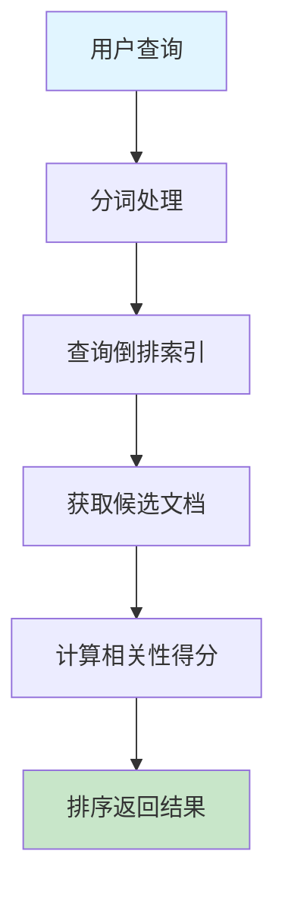
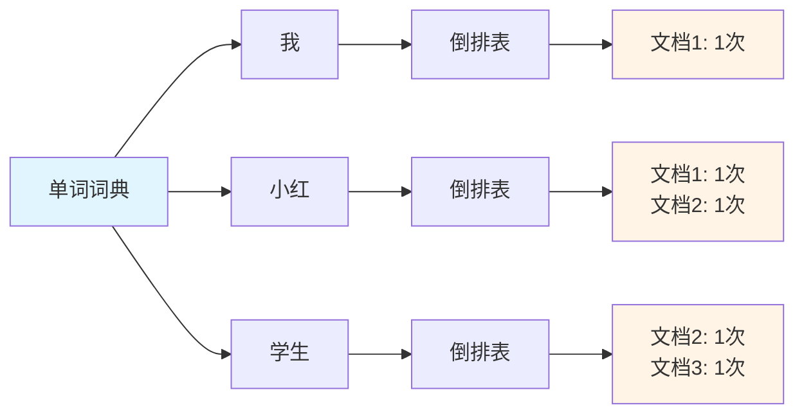
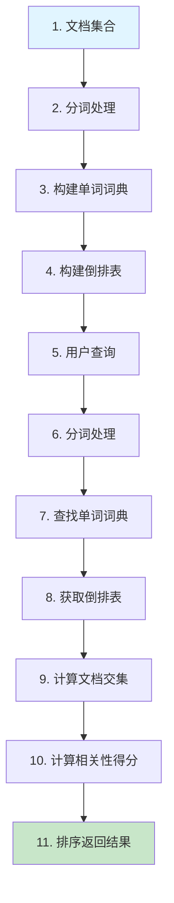
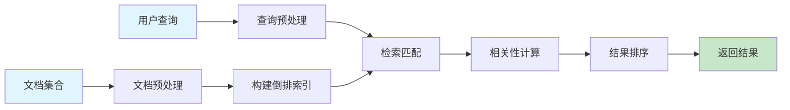
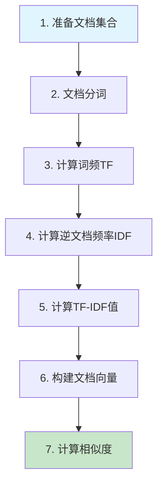

# 08b. 检索算法与策略-稀疏检索

## 1. 概述

我们将学习稀疏检索技术的核心原理和实践方法，掌握TF-IDF和BM25等经典算法，了解稀疏检索的适用场景和局限性，为RAG系统构建高效的关键词检索能力。

**上一篇文档：** [08a. 检索算法与策略-稠密检索技术](https://juejin.cn/post/7611179521161248822)（掘金） / [08a. 检索算法与策略-稠密检索技术](https://blog.csdn.net/2301_79239314/article/details/158469913)（CSDN）

## 2. 为什么需要稀疏检索

通过上篇文档我们学习了稠密检索技术，它能够通过向量嵌入捕捉文本的语义信息，实现跨语言、同义词等智能检索。但在实际应用中，我们仍然需要稀疏检索技术，因为稠密检索虽然语义理解能力强，但在某些场景下却存在明显的局限性。稀疏检索基于关键词匹配，能够精确匹配用户查询中的特定词汇，这在处理产品型号、专有名词、技术术语等精确匹配场景时表现出色。此外，稀疏检索算法成熟、计算效率高、可解释性强，是传统搜索引擎的核心技术。在RAG系统中，稀疏检索和稠密检索往往需要结合使用，形成混合检索策略，以兼顾精确匹配和语义理解的双重需求。

### 2.1 稠密检索的局限性

虽然稠密检索在语义理解方面表现出色，但它也存在一些固有的局限性，这些局限性正是我们需要稀疏检索技术的原因。

#### 2.1.1 语义偏差问题

稠密检索依赖向量嵌入模型，模型在训练过程中可能会产生语义偏差。例如，当用户查询"如何购买iPhone 15 Pro Max"时，稠密检索可能会返回关于iPhone 15 Pro Max的评测文章，而不是购买渠道信息，因为向量模型认为这两者在语义上很接近。这种情况下，用户真正需要的是精确匹配"购买"这个关键词的相关内容。

#### 2.1.2 术语匹配不精确

稠密检索在处理专业术语、产品型号、代码片段等精确匹配需求时表现不佳。例如，查询"Python 3.12.0安装教程"时，稠密检索可能会返回Python 3.11或3.13的安装教程，因为向量模型认为这些版本在语义上相似。但对于用户来说，版本号的精确匹配至关重要。

#### 2.1.3 长尾词汇处理困难

对于出现频率较低的词汇（长尾词汇），向量嵌入模型可能无法很好地学习其语义表示，导致检索效果不佳。而稀疏检索通过词频统计，能够有效处理这些长尾词汇。

#### 2.1.4 可解释性较差

稠密检索的向量空间难以解释，当检索结果不符合预期时，很难定位问题所在。而稀疏检索基于关键词匹配，我们可以清楚地看到哪些关键词匹配上了，便于调试和优化。

### 2.2 稀疏检索的独特优势

稀疏检索技术虽然在语义理解方面不如稠密检索，但它具有一些稠密检索无法替代的独特优势。

#### 2.2.1 精确关键词匹配

稀疏检索的核心优势在于能够精确匹配用户查询中的关键词。当用户查询包含特定的产品型号、技术参数、专有名词时，稀疏检索能够准确返回包含这些词汇的文档。

| 查询类型 | 稠密检索表现 | 稀疏检索表现 |
|----------|--------------|--------------|
| 产品型号查询（如"iPhone 15 Pro Max"） | 可能返回相关但不精确的型号 | 精确匹配型号 |
| 技术参数查询（如"RTX 4090显存大小"） | 可能返回显卡相关内容 | 精确匹配参数 |
| 代码片段查询（如"import numpy as np"） | 可能返回Python相关内容 | 精确匹配代码 |
| 专有名词查询（如"BERT模型架构"） | 可能返回模型相关内容 | 精确匹配专有名词 |

#### 2.2.2 算法成熟稳定

稀疏检索技术已经发展了几十年，算法非常成熟稳定。TF-IDF（Term Frequency-Inverse Document Frequency，词频-逆文档频率）和BM25等算法经过了大量实践检验，在各种场景下都有稳定的表现。

#### 2.2.3 计算效率高

稀疏检索基于倒排索引（Inverted Index，一种将词映射到包含该词的文档列表的数据结构），查询速度非常快。对于大规模文档库，稀疏检索能够在毫秒级别返回结果。



#### 2.2.4 可解释性强

稀疏检索的结果可以清楚地解释为什么某个文档被检索到。我们可以看到查询中的哪些关键词与文档匹配，匹配的频率如何，权重是多少。这种可解释性对于调试检索系统、优化检索效果非常重要。

#### 2.2.5 无需训练模型

稀疏检索不需要训练向量嵌入模型，只需要统计词频和文档频率即可。这意味着我们不需要大量的训练数据，也不需要考虑模型训练的计算成本和时间成本。

### 2.3 稀疏检索的实际应用场景

稀疏检索在多个领域发挥着重要作用：

- **电商搜索**：精确匹配产品型号、品牌名称和规格参数，如"Nike Air Jordan 1 High OG"
- **技术文档搜索**：准确匹配专业术语、API名称和函数签名，如"numpy.array"
- **代码搜索**：精确定位函数名、变量名和类名等标识符
- **法律文档检索**：精准匹配法律条文编号、案例名称和专有名词，如"《民法典》第123条"

### 2.4 稀疏检索在RAG系统中的重要性

在RAG（Retrieval-Augmented Generation，检索增强生成）系统中，稀疏检索扮演着重要的角色。

#### 2.4.1 提高检索准确性

RAG系统的检索质量直接影响生成答案的质量。稀疏检索能够确保检索到的文档包含用户查询中的关键信息，避免因为语义偏差导致的检索错误。

#### 2.4.2 支持多轮对话

在多轮对话中，用户可能会提到之前对话中的特定词汇。稀疏检索能够准确匹配这些词汇，确保对话的连贯性。

#### 2.4.3 处理领域特定词汇

在特定领域（如医疗、法律、金融）中，存在大量的专业术语。稀疏检索能够精确匹配这些术语，确保检索结果的专业性和准确性。

接下来我们将学习稀疏检索的基础概念，深入了解稀疏检索的核心原理和技术细节。

## 3. 稀疏检索基础概念

前面我们了解了为什么需要稀疏检索，现在我们将深入学习稀疏检索的基础概念，包括其核心原理、数据表示方式和工作流程。

### 3.1 什么是稀疏检索

我们所说的稀疏检索（Sparse Retrieval），是一种基于关键词匹配的信息检索方法。它的核心思想是将文档和查询表示为高维但稀疏的向量，通过计算向量之间的相似度来找到相关文档。

简单来说，稀疏检索就像在图书馆中通过索引卡查找书籍，每张索引卡上记录了书籍中的关键词，我们可以通过关键词快速找到相关的书籍。

### 3.2 词袋模型

词袋模型（Bag of Words，BoW）是稀疏检索的基础数据表示方法。它将文本视为词语的集合，不考虑词语的顺序和语法结构，只关注词语的出现频率。

**词袋模型的基本思想：**
- 将文档中的所有词语视为一个集合
- 统计每个词语在文档中出现的频率
- 用词语频率向量表示文档

**词袋模型的优缺点：**

| 优点 | 缺点 |
|------|------|
| 简单直观，易于实现 | 忽略词语顺序和语法结构 |
| 计算效率高 | 无法捕捉词语之间的语义关系 |
| 适合精确关键词匹配 | 对同义词和多义词处理能力弱 |

### 3.3 倒排索引

倒排索引（Inverted Index）是稀疏检索的核心数据结构，它能够高效地支持关键词查询。

#### 3.3.1 什么是倒排索引

倒排索引就像书籍后面的关键词索引页。当我们想找某个主题时，我们不会从第一页开始翻到最后一页，而是直接去索引页查找关键词，然后跳到对应的页码。

**正排索引 vs 倒排索引：**

| 索引类型 | 类比 | 查询方式 | 适用场景 |
|----------|------|----------|----------|
| 正排索引 | 书籍目录（章节→页码） | 通过文档ID查找内容 | 已知文档ID，需要获取文档内容 |
| 倒排索引 | 书籍索引（关键词→页码） | 通过关键词查找文档 | 已知关键词，需要找到包含该关键词的文档 |

**生活中的例子：**

想象一下图书馆的借阅系统：

- **正排索引**：图书馆管理员知道每本书被谁借走了（书→借阅者）。如果我们想知道某本书在哪里，管理员可以马上告诉我们。

- **倒排索引**：借阅者知道自己借了哪些书（借阅者→书）。如果我们想知道谁借了某本书，我们需要问所有借阅者，效率很低。

在搜索引擎中，我们使用倒排索引，因为用户是通过关键词搜索的，而不是通过文档ID搜索的。

#### 3.3.2 倒排索引的具体示例

假设我们有以下三篇文档：

- 文档1：我爱小红
- 文档2：小红是学生
- 文档3：学生喜欢学习

**构建倒排索引的过程：**

**步骤1：分词处理**

| 文档ID | 文档内容 | 分词结果 |
|--------|----------|----------|
| 1 | 我爱小红 | 我、爱、小红 |
| 2 | 小红是学生 | 小红、是、学生 |
| 3 | 学生喜欢学习 | 学生、喜欢、学习 |

**步骤2：构建倒排索引**

| 词条 | 文档列表 | 出现频率 |
|------|----------|----------|
| 我 | [1] | 1 |
| 爱 | [1] | 1 |
| 小红 | [1, 2] | 2 |
| 是 | [2] | 1 |
| 学生 | [2, 3] | 2 |
| 喜欢 | [3] | 1 |
| 学习 | [3] | 1 |

**步骤3：查询示例**

当用户搜索"小红学生"时：

1. 分词：小红、学生
2. 查找倒排索引：
   - "小红" → 文档[1, 2]
   - "学生" → 文档[2, 3]
3. 计算交集：文档[2]同时包含"小红"和"学生"
4. 返回结果：文档2（小红是学生）

#### 3.3.3 倒排索引的基本结构

倒排索引主要由两个部分组成：

**1. 单词词典（Term Dictionary）**
- 存储所有出现过的词语
- 每个词语都有唯一的编号
- 通常按字母顺序排列，便于快速查找

**2. 倒排表（Posting List）**
- 记录包含某个词语的文档列表
- 每个文档记录包含文档ID、词频、位置等信息

**倒排索引的结构示例：**



#### 3.3.4 倒排索引的工作原理



#### 3.3.5 倒排索引的优势

- **快速定位**：通过关键词快速找到包含该关键词的文档，不需要遍历所有文档
- **支持布尔查询**：可以方便地实现AND、OR、NOT等布尔查询
- **存储空间相对较小**：只存储非零元素，节省存储空间
- **适合处理大规模文档集合**：即使有百万级文档，也能快速检索
- **可扩展性强**：新增文档时，只需要更新倒排索引即可

### 3.4 稀疏向量表示

在稀疏检索中，文档和查询都被表示为稀疏向量。

**稀疏向量的特点：**
- 高维：向量维度等于词汇表大小
- 稀疏：大多数元素为0，只有少数元素非零
- 权重：非零元素表示词语的重要性

**稀疏向量的权重计算方法：**

**1. 词频（Term Frequency，TF）**

词频表示词语在文档中出现的频率。如果一个词语在文档中出现多次，说明这个词语对文档的重要性较高。

计算公式：
```
TF(t, d) = (词语t在文档d中出现的次数) / (文档d中所有词语的总次数)
```

**2. 逆文档频率（Inverse Document Frequency，IDF）**

逆文档频率表示词语在整个文档集合中的稀有程度。如果一个词语在很少的文档中出现，说明这个词语具有很强的区分能力，应该给予更高的权重。

计算公式：
```
IDF(t, D) = log(总文档数N / (包含词语t的文档数n_t + 1))
```

其中：
- N：文档集合中的总文档数
- n_t：包含词语t的文档数
- +1：为了防止分母为0的情况
- log：对数函数，用于压缩数值范围

**IDF计算示例：**

假设我们有100篇文档，分析几个词语的IDF值：

| 词语 | 包含该词语的文档数 | IDF计算 | IDF值 |
|------|-------------------|---------|-------|
| "的" | 95 | log(100/(95+1)) | 0.018 |
| "计算机" | 20 | log(100/(20+1)) | 0.678 |
| "量子计算" | 3 | log(100/(3+1)) | 1.398 |
| "稀疏检索" | 1 | log(100/(1+1)) | 1.699 |

从表中可以看出：
- "的"这个词在几乎所有文档中都出现，IDF值很低，说明区分能力弱
- "稀疏检索"这个词只在少数文档中出现，IDF值很高，说明区分能力强

**3. TF-IDF**

TF-IDF是词频和逆文档频率的乘积，综合考虑了词语在文档中的重要性和在整个文档集合中的区分能力。

计算公式：
```
TF-IDF(t, d, D) = TF(t, d) × IDF(t, D)
```

**TF-IDF计算示例：**

假设文档d中"机器学习"这个词出现了5次，文档总共有100个词，该词在1000篇文档中有20篇包含：

- TF = 5/100 = 0.05
- IDF = log(1000/(20+1)) = log(47.6) ≈ 1.678
- TF-IDF = 0.05 × 1.678 ≈ 0.084

这个值越高，说明"机器学习"这个词对这篇文档的重要性越高。

**稀疏向量与稠密向量的对比：**

| 对比维度 | 稀疏向量 | 稠密向量 |
|----------|----------|----------|
| 维度 | 高维（词汇表大小） | 低维（通常几百到几千） |
| 稀疏性 | 大多数元素为0 | 所有元素非零 |
| 表示方式 | 基于关键词 | 基于语义 |
| 计算复杂度 | 低（只处理非零元素） | 高（处理所有元素） |
| 存储方式 | 倒排索引 | 向量数据库 |

### 3.5 稀疏检索的工作流程

稀疏检索的完整工作流程包括以下步骤：

1. **文档预处理**：对文档进行分词、去停用词、词干提取等处理
2. **构建倒排索引**：为处理后的文档创建倒排索引
3. **查询处理**：对用户查询进行同样的预处理
4. **检索匹配**：通过倒排索引快速找到包含查询关键词的文档
5. **相关性计算**：使用TF-IDF、BM25等算法计算文档与查询的相关性得分
6. **结果排序**：根据相关性得分对文档进行排序
7. **返回结果**：返回排序后的相关文档



### 3.6 稀疏检索的核心组件

**1. 分词器（Tokenizer）**
- 将文本分割成词语或词条
- 支持不同语言的分词规则
- 处理标点符号和特殊字符

**2. 停用词过滤器（Stopword Filter）**
- 移除常见的无意义词语（如"的"、"是"、"the"、"is"等）
- 减少索引大小和噪声

**3. 词干提取器（Stemmer）**
- 将词语还原为词干形式（如"running"→"run"）
- 提高检索的召回率

**4. 排序器（Ranking Engine）**
- 根据相关性算法计算文档得分
- 对文档进行排序

接下来我们将学习TF-IDF算法原理，了解稀疏检索中最基础的相关性计算方法。

## 4. TF-IDF算法原理

前面我们学习了稀疏检索的基础概念，了解了词袋模型、倒排索引和稀疏向量表示。现在我们将深入学习TF-IDF算法原理，这是稀疏检索中最基础和最重要的相关性计算方法。

### 4.1 TF-IDF算法概述

TF-IDF（Term Frequency-Inverse Document Frequency，词频-逆文档频率）是一种用于信息检索和文本挖掘的统计方法。它的主要思想是评估一个词语对于文档集合中的某份文档的重要程度。

**TF-IDF的核心思想：**

如果一个词语在某篇文档中出现的频率很高（TF高），并且在其他文档中出现的频率很低（IDF高），那么这个词语对于这篇文档来说非常重要，具有很强的区分能力。

**TF-IDF的直观理解：**

想象我们在写论文时，论文的关键词会频繁出现，但在其他论文中很少出现。这些词语就是论文的核心内容，能够帮助我们准确找到这篇论文。

### 4.2 TF-IDF的计算步骤

TF-IDF的计算可以分为以下几个步骤：



#### 4.2.1 步骤1：准备文档集合

首先我们需要准备一个文档集合，这个集合包含了所有需要检索的文档。

**示例文档集合：**

- 文档1：机器学习是人工智能的重要分支
- 文档2：深度学习是机器学习的一种
- 文档3：人工智能和机器学习发展迅速

#### 4.2.2 步骤2：文档分词

对每篇文档进行分词处理，将文档分割成词语。

**分词结果：**

| 文档ID | 分词结果 |
|--------|----------|
| 1 | 机器、学习、是、人工智能、的、重要、分支 |
| 2 | 深度、学习、是、机器、学习、的、一种 |
| 3 | 人工智能、和、机器、学习、发展、迅速 |

#### 4.2.3 步骤3：计算词频TF

计算每个词语在每篇文档中出现的频率。

**词频计算：**

```
TF(t, d) = (词语t在文档d中出现的次数) / (文档d中所有词语的总次数)
```

**词频计算结果：**

| 词语 | 文档1 | 文档2 | 文档3 |
|------|--------|--------|--------|
| 机器 | 1/7 ≈ 0.143 | 1/7 ≈ 0.143 | 1/6 ≈ 0.167 |
| 学习 | 1/7 ≈ 0.143 | 2/7 ≈ 0.286 | 1/6 ≈ 0.167 |
| 人工智能 | 1/7 ≈ 0.143 | 0 | 1/6 ≈ 0.167 |
| 深度 | 0 | 1/7 ≈ 0.143 | 0 |

#### 4.2.4 步骤4：计算逆文档频率IDF

计算每个词语在整个文档集合中的逆文档频率。

**IDF计算：**

```
IDF(t, D) = log(总文档数N / (包含词语t的文档数n_t + 1))
```

**IDF计算结果：**

| 词语 | 包含该词语的文档数 | IDF计算 | IDF值 |
|------|-------------------|---------|-------|
| 机器 | 3 | log(3/(3+1)) | log(0.75) ≈ -0.125 |
| 学习 | 3 | log(3/(3+1)) | log(0.75) ≈ -0.125 |
| 人工智能 | 2 | log(3/(2+1)) | log(1) = 0 |
| 深度 | 1 | log(3/(1+1)) | log(1.5) ≈ 0.176 |

注意：这里使用的是自然对数，实际应用中通常使用以10为底的对数。

#### 4.2.5 步骤5：计算TF-IDF值

将TF和IDF相乘，得到每个词语的TF-IDF值。

**TF-IDF计算：**

```
TF-IDF(t, d, D) = TF(t, d) × IDF(t, D)
```

**TF-IDF计算结果（文档1）：**

| 词语 | TF | IDF | TF-IDF |
|------|-----|-----|--------|
| 机器 | 0.143 | -0.125 | -0.018 |
| 学习 | 0.143 | -0.125 | -0.018 |
| 人工智能 | 0.143 | 0 | 0 |

### 4.3 TF-IDF的Python实现

我们可以使用Python的scikit-learn库来实现TF-IDF算法。scikit-learn是一个跨平台的机器学习库，在Windows、Linux和Mac上都可以运行。

#### 4.3.1 使用TfidfVectorizer

scikit-learn提供了TfidfVectorizer类，可以方便地计算TF-IDF值。对于中文文本，我们需要使用jieba进行分词。

```python
from sklearn.feature_extraction.text import TfidfVectorizer
import jieba

# 准备文档集合
documents = [
    "机器学习是人工智能的重要分支",
    "深度学习是机器学习的一种",
    "人工智能和机器学习发展迅速"
]

# 使用jieba进行中文分词
def chinese_tokenizer(text):
    return list(jieba.cut(text))

# 创建TfidfVectorizer对象，使用自定义分词器
vectorizer = TfidfVectorizer(tokenizer=chinese_tokenizer)

# 计算TF-IDF矩阵
tfidf_matrix = vectorizer.fit_transform(documents)

# 获取特征词
feature_names = vectorizer.get_feature_names_out()

# 打印结果
print("特征词：", feature_names)
print("TF-IDF矩阵：")
print(tfidf_matrix.toarray())
```

**输出示例：**

```
特征词： ['一种' '人工智能' '分支' '发展' '和' '学习' '是' '机器' '深度' '的' '迅速' '重要']
TF-IDF矩阵：
[[0.         0.3612204  0.47496141 0.         0.         0.28051986
  0.3612204  0.28051986 0.         0.3612204  0.         0.47496141]
 [0.45171082 0.         0.         0.         0.         0.53357537
  0.34353772 0.26678769 0.45171082 0.34353772 0.         0.        ]
 [0.         0.36778358 0.         0.48359121 0.48359121 0.28561676
  0.         0.28561676 0.         0.         0.48359121 0.        ]]
```

**TF-IDF矩阵的含义：**

我们需要理解这个矩阵中每个值的含义：

- **矩阵的维度**：3行×12列，其中3行对应3篇文档，12列对应12个特征词
- **矩阵的值**：每个值表示对应词语在对应文档中的TF-IDF权重
- **值的范围**：0到1之间，值越大表示该词语对文档的重要性越高

**矩阵解读示例：**

| 特征词 | 文档1 | 文档2 | 文档3 | 含义 |
|--------|-------|-------|-------|------|
| 人工智能 | 0.361 | 0 | 0.368 | 文档1和文档3包含"人工智能"，且重要性相近 |
| 学习 | 0.281 | 0.534 | 0.286 | 文档2中"学习"的重要性最高 |
| 深度 | 0 | 0.452 | 0 | 只有文档2包含"深度" |
| 的 | 0.361 | 0.344 | 0 | "的"是停用词，但在jieba分词中未被过滤 |

**关键观察：**

- **值为0**：表示该文档不包含对应的词语
- **值较高**：表示该词语是文档的重要特征
- **跨文档比较**：可以比较同一词语在不同文档中的重要性

**TF-IDF矩阵的作用：**

1. **文档表示**：将每篇文档表示为一个向量，便于计算机处理
2. **相似度计算**：通过向量运算计算文档之间的相似度
3. **特征提取**：识别文档的关键特征词
4. **分类聚类**：作为机器学习算法的输入特征

#### 4.3.2 查询文档相似度

我们可以使用TF-IDF来计算查询与文档之间的相似度。

```python
from sklearn.feature_extraction.text import TfidfVectorizer
from sklearn.metrics.pairwise import cosine_similarity
import jieba

# 准备文档集合
documents = [
    "机器学习是人工智能的重要分支",
    "深度学习是机器学习的一种",
    "人工智能和机器学习发展迅速"
]

# 使用jieba进行中文分词
def chinese_tokenizer(text):
    return list(jieba.cut(text))

# 创建TfidfVectorizer对象，使用自定义分词器
vectorizer = TfidfVectorizer(tokenizer=chinese_tokenizer)

# 计算TF-IDF矩阵
tfidf_matrix = vectorizer.fit_transform(documents)

# 用户查询
query = "机器学习算法"

# 计算查询的TF-IDF向量
query_vector = vectorizer.transform([query])

# 计算查询与文档的相似度
similarities = cosine_similarity(query_vector, tfidf_matrix)

# 打印相似度结果
for i, similarity in enumerate(similarities[0]):
    print(f"文档{i+1}的相似度：{similarity:.4f}")
```

**输出示例：**

```
Building prefix dict from the default dictionary ...
Loading model from cache C:\Users\zheng\AppData\Local\Temp\jieba.cache
Loading model cost 0.802 seconds.
Prefix dict has been built successfully.
文档1的相似度：0.3967
文档2的相似度：0.5659
文档3的相似度：0.4039
```

**相似度结果分析：**

- **文档2**的相似度最高（0.5659），因为它直接包含了"机器学习"这个关键词，并且在文档中出现了两次
- **文档3**的相似度次之（0.4039），因为它也包含了"机器学习"关键词
- **文档1**的相似度最低（0.3967），虽然也包含"机器学习"，但权重相对较低

这说明TF-IDF和余弦相似度能够正确计算中文文本的相似度，并且能够区分不同文档与查询的相关程度。

### 4.4 TF-IDF算法的优缺点

**优点：**

| 优点 | 说明 |
|------|------|
| 简单易用 | 算法原理简单，易于理解和实现 |
| 计算效率高 | 只需要统计词频和文档频率，计算速度快 |
| 可解释性强 | 可以清楚地看到每个词语对文档的贡献 |
| 适用范围广 | 广泛应用于信息检索、文本分类、聚类等领域 |

**缺点：**

| 缺点 | 说明 |
|------|------|
| 忽略语义 | 无法理解同义词，如"购买"和"采购"被视为不同词语 |
| 忽略词序 | 不考虑词语的顺序，"狗咬人"和"人咬狗"的表示相同 |
| 长文档偏向 | 长文档的词频更高，可能获得更高的TF-IDF值 |
| 稀疏性问题 | 对于大型词汇表，TF-IDF矩阵非常稀疏，浪费存储空间 |

### 4.5 TF-IDF的应用场景

TF-IDF在许多实际应用中发挥着重要作用：

- **搜索引擎**：计算网页与查询的相关性，对搜索结果进行排序
- **文本分类**：将文本转换为TF-IDF向量，作为分类器的输入特征
- **文档聚类**：使用TF-IDF向量计算文档之间的相似度，进行聚类分析
- **关键词提取**：提取文档中TF-IDF值最高的词语作为关键词
- **推荐系统**：根据用户历史记录的TF-IDF特征，推荐相关内容

### 4.6 TF-IDF的改进方向

虽然TF-IDF算法简单有效，但它也存在一些局限性。为了解决这些问题，研究者提出了许多改进方法：

- **BM25算法**：在TF-IDF基础上引入了饱和函数和文档长度归一化
- **TF-IDF变种**：如TF-IDF-S、TF-IDF-L等，针对不同场景进行优化
- **词嵌入方法**：使用Word2Vec、BERT等方法捕捉词语的语义信息
- **混合检索**：结合TF-IDF和向量嵌入，兼顾精确匹配和语义理解

接下来我们将学习BM25算法详解，了解TF-IDF的改进版本和更先进的稀疏检索算法。

## 5. BM25算法详解

前面我们学习了TF-IDF算法，它是稀疏检索的基础算法。现在我们将学习BM25算法，这是TF-IDF的改进版本，也是目前最流行的稀疏检索算法之一。

### 5.1 BM25算法概述

BM25（Best Match 25）是一种基于概率模型的信息检索算法，由Stephen Robertson和Karen Spärck Jones在1970年代提出，并在1994年由他们的团队最终完善。BM25算法可以看作是对TF-IDF算法的改进，它解决了TF-IDF的几个局限性。

**BM25的核心思想：**

- 考虑词频的饱和效应：当词频达到一定程度后，再增加词频对相关性的贡献会逐渐减少
- 考虑文档长度的影响：对长文档和短文档进行归一化处理
- 引入可调参数：通过参数调整算法的行为，适应不同的检索场景

### 5.2 BM25的计算公式

BM25算法的计算公式看起来比较复杂：

```
BM25(D, Q) = Σ [IDF(q) × (TF(q, D) × (k1 + 1)) / (TF(q, D) + k1 × (1 - b + b × |D| / avgdl))]
```

其中：

- **D**：文档
- **Q**：查询
- **q**：查询中的词语
- **TF(q, D)**：词语q在文档D中的词频
- **IDF(q)**：词语q的逆文档频率
- **k1**：控制词频饱和效应的参数（通常取1.2-2.0）
- **b**：控制文档长度归一化的参数（通常取0.75）
- **|D|**：文档D的长度
- **avgdl**：文档集合的平均文档长度

**IDF的计算：**

```
IDF(q) = log((N - nq + 0.5) / (nq + 0.5))
```

其中：
- **N**：文档集合中的总文档数
- **nq**：包含词语q的文档数

**计算公式的简化理解：**

看不懂没关系，看看就好，因为我们只需要知道怎么使用BM25算法即可。核心思想其实很简单：

- **词频影响**：词语在文档中出现的频率越高，相关性得分越高，但有饱和效应
- **稀有度影响**：词语在整个文档集合中出现的频率越低，区分能力越强
- **文档长度影响**：文档长度会影响得分，需要进行归一化处理

在实际应用中，我们通常使用现成的实现，如Elasticsearch中的BM25评分器，或者使用Python库来实现，不需要手动计算这些复杂的公式。

### 5.3 BM25的核心改进

BM25相比TF-IDF的主要改进包括：

#### 5.3.1 词频饱和效应

TF-IDF中的TF部分是线性增长的，而BM25使用了一个饱和度函数，当词频达到一定程度后，再增加词频对相关性的贡献会逐渐减少。

**TF-IDF vs BM25词频处理：**

| 词频 | TF-IDF | BM25 (k1=1.2) |
|------|--------|---------------|
| 1 | 1.0 | 1.1 |
| 2 | 2.0 | 1.7 |
| 5 | 5.0 | 2.6 |
| 10 | 10.0 | 3.4 |
| 20 | 20.0 | 4.0 |

从表中可以看出，TF-IDF的词频权重是线性增长的，而BM25的词频权重增长逐渐放缓，最终趋于饱和。

#### 5.3.2 文档长度归一化

BM25通过参数b控制文档长度的影响，对长文档和短文档进行归一化处理，避免长文档因为包含更多词语而获得更高的得分。

#### 5.3.3 可调参数

BM25引入了k1和b两个可调参数，可以根据不同的检索场景进行调整，以获得最佳性能。

### 5.4 BM25的Python实现

我们可以使用Python来实现BM25算法。以下是一个简单的实现示例：

```python
import math
import jieba

class BM25:
    def __init__(self, documents, k1=1.2, b=0.75):
        self.documents = documents
        self.k1 = k1
        self.b = b
        self.doc_lengths = []
        self.avg_doc_length = 0
        self.word_freq = {}
        self.doc_freq = {}
        self.total_docs = len(documents)
        self._build_vocab()
    
    def _build_vocab(self):
        # 分词并构建词频统计
        total_length = 0
        for i, doc in enumerate(self.documents):
            words = list(jieba.cut(doc))
            self.doc_lengths.append(len(words))
            total_length += len(words)
            
            # 统计词频
            doc_word_set = set()
            word_count = {}
            for word in words:
                if word not in word_count:
                    word_count[word] = 0
                word_count[word] += 1
                doc_word_set.add(word)
            
            # 存储词频
            for word, count in word_count.items():
                if word not in self.word_freq:
                    self.word_freq[word] = {}
                self.word_freq[word][i] = count
            
            # 统计文档频率
            for word in doc_word_set:
                if word not in self.doc_freq:
                    self.doc_freq[word] = 0
                self.doc_freq[word] += 1
        
        # 计算平均文档长度
        self.avg_doc_length = total_length / self.total_docs
    
    def idf(self, word):
        if word not in self.doc_freq:
            return 0
        nq = self.doc_freq[word]
        # 使用标准的BM25 IDF计算公式
        return math.log((self.total_docs - nq + 0.5) / (nq + 0.5) + 1)
    
    def score(self, document, query):
        score = 0
        doc_idx = self.documents.index(document)
        doc_length = self.doc_lengths[doc_idx]
        query_words = list(jieba.cut(query))
        
        for word in query_words:
            if word not in self.word_freq or doc_idx not in self.word_freq[word]:
                continue
            
            # 获取词频
            tf = self.word_freq[word][doc_idx]
            
            # 计算BM25得分
            idf_val = self.idf(word)
            numerator = tf * (self.k1 + 1)
            denominator = tf + self.k1 * (1 - self.b + self.b * doc_length / self.avg_doc_length)
            score += idf_val * (numerator / denominator)
        
        return score
    
    def rank(self, query):
        scores = []
        for i, doc in enumerate(self.documents):
            score = self.score(doc, query)
            scores.append((i, score))
        
        # 按得分排序
        scores.sort(key=lambda x: x[1], reverse=True)
        return scores

# 示例使用
documents = [
    "机器学习是人工智能的重要分支",
    "深度学习是机器学习的一种",
    "人工智能和机器学习发展迅速"
]

bm25 = BM25(documents)
query = "机器学习"

# 计算文档得分
for i, doc in enumerate(documents):
    score = bm25.score(doc, query)
    print(f"文档{i+1}的BM25得分：{score:.4f}")

# 排序结果
print("\n排序结果：")
ranked = bm25.rank(query)
for doc_idx, score in ranked:
    print(f"文档{doc_idx+1}：{documents[doc_idx]} (得分：{score:.4f})")
```

**输出示例：**

```
文档1的BM25得分：0.2617
文档2的BM25得分：0.3119
文档3的BM25得分：0.2785

排序结果：
文档2：深度学习是机器学习的一种 (得分：0.3119)
文档3：人工智能和机器学习发展迅速 (得分：0.2785)
文档1：机器学习是人工智能的重要分支 (得分：0.2617)
```

### 5.5 BM25的优缺点

#### 5.5.1 优点

| 优点 | 说明 |
|------|------|
| 效果卓越 | 在传统关键词匹配的检索任务中，效果非常好，是学术研究和工业界实践的黄金标准 |
| 可解释性强 | 得分由明确的公式计算，可以分析每个词对最终得分的贡献，易于理解和调试 |
| 计算高效 | 可以建立倒排索引进行加速，适合大规模文档集合的快速检索 |
| 非监督学习 | 不需要人工标注的相关性数据即可直接使用，简单高效 |
| 参数可调 | 通过调整k1和b参数，可以适应不同的检索场景 |

#### 5.5.2 缺点

| 缺点 | 说明 |
|------|------|
| 忽略语义 | 无法理解同义词，如"购买"和"采购"被视为不同词语 |
| 忽略词序 | 不考虑词语的顺序，"狗咬人"和"人咬狗"的表示相同 |
| 参数调优 | 需要根据具体场景调整k1和b参数，增加了使用复杂度 |
| 对短查询敏感 | 对于非常短的查询（如单个词），可能不够稳定 |

### 5.6 BM25的应用场景

BM25算法在许多实际应用中发挥着重要作用：

- **搜索引擎**：作为传统搜索引擎的核心排序算法
- **推荐系统**：计算用户查询与物品描述的相关性
- **问答系统**：匹配用户问题与知识库中的答案
- **信息检索**：在大规模文档集合中快速找到相关文档
- **RAG系统**：作为稀疏检索的核心算法，与稠密检索结合使用

### 5.7 BM25与TF-IDF的对比

**BM25 vs TF-IDF：**

| 对比维度 | TF-IDF | BM25 |
|----------|--------|------|
| 词频处理 | 线性增长 | 饱和度函数 |
| 文档长度 | 无归一化 | 有归一化处理 |
| 参数可调 | 无参数 | 有k1和b参数 |
| 计算复杂度 | 低 | 稍高 |
| 检索效果 | 良好 | 更优 |
| 适用场景 | 一般文本检索 | 复杂检索场景 |

### 5.8 BM25的改进版本

为了进一步提高BM25的性能，研究者提出了许多改进版本：

- **BM25F**：考虑文档不同字段的权重，如标题、正文、摘要等
- **BM25L**：对长文档进行更好的归一化处理
- **BM25+**：在BM25基础上添加了一个额外的项，以改善对短文档的处理
- **BM25Okapi**：原始的BM25算法实现

### 5.9 BM25在RAG系统中的应用

在RAG（Retrieval-Augmented Generation）系统中，BM25算法通常与稠密检索算法结合使用，形成混合检索策略：

1. **并行检索**：同时使用BM25和稠密检索，然后融合结果
2. **重排序**：使用BM25作为初步检索，然后使用稠密检索进行重排序
3. **加权融合**：对两种检索结果进行加权融合，平衡精确匹配和语义理解

这种混合检索策略能够兼顾精确关键词匹配和语义理解，提高RAG系统的检索质量。

接下来我们将学习稀疏检索实战，通过实际代码示例掌握稀疏检索技术的应用方法。

## 6. 稀疏检索实战

前面我们学习了BM25算法的原理和Python实现，现在我们将通过实战案例，掌握稀疏检索技术在实际项目中的应用方法。

### 6.1 使用rank_bm25库

rank_bm25是一个专门用于BM25算法的Python库，它提供了简单易用的接口，支持多种BM25变体。

#### 6.1.1 安装rank_bm25

我们可以使用pip安装rank_bm25库：

```bash
pip install rank_bm25
```

#### 6.1.2 基本使用示例

我们使用rank_bm25库来实现BM25检索：

```python
from rank_bm25 import BM25Okapi
import jieba

# 准备文档集合
documents = [
    "机器学习是人工智能的重要分支",
    "深度学习是机器学习的一种",
    "人工智能和机器学习发展迅速",
    "自然语言处理是人工智能的核心技术",
    "计算机视觉在自动驾驶中应用广泛"
]

# 对文档进行分词
tokenized_docs = [list(jieba.cut(doc)) for doc in documents]

# 创建BM25模型
bm25 = BM25Okapi(tokenized_docs)

# 用户查询
query = "人工智能技术"

# 对查询进行分词
tokenized_query = list(jieba.cut(query))

# 获取文档得分
doc_scores = bm25.get_scores(tokenized_query)

# 打印结果
print("查询：", query)
print("\n文档得分：")
for i, score in enumerate(doc_scores):
    print(f"文档{i+1}：{documents[i]} (得分：{score:.4f})")

# 获取Top-K文档
top_k = bm25.get_top_n(tokenized_query, documents, n=3)
print("\nTop-3相关文档：")
for i, doc in enumerate(top_k, 1):
    print(f"{i}. {doc}")
```

**输出示例：**

```
查询： 人工智能技术

文档得分：
文档1：机器学习是人工智能的重要分支 (得分：0.1941)
文档2：深度学习是机器学习的一种 (得分：0.0000)
文档3：人工智能和机器学习发展迅速 (得分：0.2077)
文档4：自然语言处理是人工智能的核心技术 (得分：0.2077)
文档5：计算机视觉在自动驾驶中应用广泛 (得分：0.0000)

Top-3相关文档：
1. 自然语言处理是人工智能的核心技术
2. 人工智能和机器学习发展迅速
3. 机器学习是人工智能的重要分支
```

#### 6.1.3 BM25变体对比

rank_bm25库提供了多种BM25变体，我们可以根据不同场景选择合适的算法：

| 算法名称 | 特点 | 适用场景 |
|----------|------|----------|
| BM25Okapi | 原始BM25算法 | 一般文本检索 |
| BM25L | 改进长文档处理 | 长文档检索 |
| BM25Plus | 改进短文档处理 | 短文档检索 |
| BM25Adpt | 自适应参数调整 | 多样化文档集合 |

### 6.2 使用Whoosh构建搜索引擎

Whoosh是一个纯Python编写的轻量级搜索引擎库，适合中小型项目的全文搜索需求。

#### 6.2.1 Whoosh的优势

- **纯Python实现**：无需安装外部依赖，跨平台兼容性好
- **轻量级**：适合中小型项目，无需复杂的配置
- **功能完整**：支持全文搜索、字段搜索、排序等功能

#### 6.2.2 创建索引和搜索

我们使用Whoosh创建一个简单的文档搜索引擎：

```python
import os
from whoosh.index import create_in, exists_in, open_dir
from whoosh.fields import Schema, TEXT, ID
from whoosh.qparser import QueryParser
import jieba
from whoosh.analysis import Tokenizer, Token

# 自定义中文分词器
class ChineseTokenizer(Tokenizer):
    def __call__(self, text, **kargs):
        words = jieba.cut(text)
        pos = 0
        for word in words:
            if word.strip():
                length = len(word)
                token = Token(text=word, pos=pos, startchar=pos, endchar=pos+length)
                pos += length
                yield token

# 创建索引结构
schema = Schema(
    doc_id=ID(stored=True),
    title=TEXT(stored=True),
    content=TEXT(analyzer=ChineseTokenizer(), stored=True)
)

# 创建索引目录
index_dir = "whoosh_index"
if not os.path.exists(index_dir):
    os.mkdir(index_dir)

# 创建或打开索引
if exists_in(index_dir):
    ix = open_dir(index_dir)
else:
    ix = create_in(index_dir, schema)

# 添加文档到索引
writer = ix.writer()
documents = [
    {"doc_id": "1", "title": "机器学习简介", "content": "机器学习是人工智能的重要分支"},
    {"doc_id": "2", "title": "深度学习概述", "content": "深度学习是机器学习的一种"},
    {"doc_id": "3", "title": "人工智能发展", "content": "人工智能和机器学习发展迅速"},
]

for doc in documents:
    writer.add_document(**doc)
writer.commit()

# 搜索文档
searcher = ix.searcher()
query_parser = QueryParser("content", ix.schema)
query = query_parser.parse("人工智能")

results = searcher.search(query, limit=5)
print(f"找到 {len(results)} 个结果：\n")
for hit in results:
    print(f"文档ID：{hit['doc_id']}")
    print(f"标题：{hit['title']}")
    print(f"内容：{hit['content']}")
    print(f"得分：{hit.score:.4f}\n")

searcher.close()
```

**输出示例：**

```
找到 2 个结果：

文档ID：3
标题：人工智能发展
内容：人工智能和机器学习发展迅速
得分：1.0427

文档ID：1
标题：机器学习简介
内容：机器学习是人工智能的重要分支
得分：0.9800
```

### 6.3 稀疏检索的高级应用

在实际应用中，我们可以通过多种方式增强稀疏检索的效果：

#### 6.3.1 多字段检索

对于结构化文档，我们可以对不同字段赋予不同权重：

```python
from rank_bm25 import BM25Okapi
import jieba

class MultiFieldBM25:
    """多字段BM25检索器
    
    支持对结构化文档的不同字段赋予不同权重进行检索
    适用于包含标题、内容等多个字段的文档集合
    """
    
    def __init__(self, documents, field_weights=None):
        """初始化多字段BM25检索器
        
        Args:
            documents: 文档列表，每个文档是包含多个字段的字典
            field_weights: 字段权重字典，默认为{"title": 2.0, "content": 1.0}
        """
        self.documents = documents
        # 默认标题权重高于内容
        self.field_weights = field_weights or {"title": 2.0, "content": 1.0}
        
        # 为每个字段创建独立的BM25索引
        self.field_indexes = {}
        for field, weight in self.field_weights.items():
            # 提取每个文档的对应字段内容
            field_texts = [doc.get(field, "") for doc in documents]
            # 对每个字段的文本进行分词
            tokenized_texts = [list(jieba.cut(text)) for text in field_texts]
            # 为该字段创建BM25索引
            self.field_indexes[field] = BM25Okapi(tokenized_texts)
    
    def search(self, query, top_k=5):
        """执行多字段检索
        
        Args:
            query: 查询字符串
            top_k: 返回结果数量
            
        Returns:
            排序后的检索结果列表
        """
        # 对查询进行分词
        tokenized_query = list(jieba.cut(query))
        
        # 计算每个文档的综合得分
        scores = {}
        for field, bm25 in self.field_indexes.items():
            # 获取该字段的BM25得分
            field_scores = bm25.get_scores(tokenized_query)
            # 获取该字段的权重
            weight = self.field_weights[field]
            # 计算加权得分
            for i, score in enumerate(field_scores):
                if i not in scores:
                    scores[i] = 0
                scores[i] += score * weight
        
        # 按得分排序并取前top_k个结果
        ranked_indices = sorted(scores.items(), key=lambda x: x[1], reverse=True)[:top_k]
        results = []
        for idx, score in ranked_indices:
            results.append({
                "document": self.documents[idx],
                "score": score
            })
        
        return results

# 使用示例
documents = [
    {"title": "人工智能基础", "content": "机器学习是人工智能的重要分支"},
    {"title": "深度学习入门", "content": "深度学习是机器学习的一种"},
    {"title": "人工智能发展趋势", "content": "人工智能和机器学习发展迅速"}
]

# 创建多字段BM25检索器
retriever = MultiFieldBM25(documents)
# 定义查询
query = "人工智能"
# 执行检索
results = retriever.search(query, top_k=3)

# 打印结果
print(f"查询：{query}\n")
for i, result in enumerate(results, 1):
    print(f"{i}. 标题：{result['document']['title']}")
    print(f"   内容：{result['document']['content']}")
    print(f"   得分：{result['score']:.4f}\n")
```

**输出示例：**

```
查询：人工智能

1. 标题：人工智能基础
   内容：机器学习是人工智能的重要分支
   得分：0.1443

2. 标题：人工智能发展趋势
   内容：人工智能和机器学习发展迅速
   得分：0.1416

3. 标题：深度学习入门
   内容：深度学习是机器学习的一种
   得分：0.0000
```

#### 6.3.2 同义词扩展

通过同义词扩展可以提高检索的召回率：

```python
from rank_bm25 import BM25Okapi
import jieba

class SynonymEnhancedBM25:
    """同义词增强的BM25检索器
    
    通过同义词扩展提高检索的召回率，适用于处理用户查询中的同义词表达
    """
    
    def __init__(self, documents, synonym_dict=None):
        """初始化同义词增强的BM25检索器
        
        Args:
            documents: 文档列表
            synonym_dict: 同义词词典，默认为常用AI领域同义词
        """
        self.documents = documents
        # 默认同义词词典，包含AI领域常见同义词（双向映射）
        self.synonym_dict = synonym_dict or {
            "人工智能": ["AI", "智能", "机器智能"],
            "AI": ["人工智能", "智能", "机器智能"],
            "机器学习": ["ML", "深度学习", "强化学习"],
            "ML": ["机器学习", "深度学习", "强化学习"]
        }
        
        # 构建BM25索引
        tokenized_docs = [list(jieba.cut(doc)) for doc in documents]
        self.bm25 = BM25Okapi(tokenized_docs)
    
    def expand_query(self, query):
        """扩展查询词，添加同义词
        
        Args:
            query: 原始查询字符串
            
        Returns:
            扩展后的查询词列表
        """
        # 对原始查询进行分词
        expanded_terms = set(jieba.cut(query))
        # 为每个词添加同义词
        for term in list(expanded_terms):
            if term in self.synonym_dict:
                expanded_terms.update(self.synonym_dict[term])
        return list(expanded_terms)
    
    def search(self, query, top_k=5):
        """执行同义词增强的检索
        
        Args:
            query: 查询字符串
            top_k: 返回结果数量
            
        Returns:
            排序后的检索结果列表
        """
        # 扩展查询，添加同义词
        expanded_query = self.expand_query(query)
        
        # 使用扩展后的查询进行BM25检索
        scores = self.bm25.get_scores(expanded_query)
        
        # 按得分排序并取前top_k个结果
        ranked_indices = sorted(range(len(scores)), key=lambda i: scores[i], reverse=True)[:top_k]
        results = []
        for idx in ranked_indices:
            results.append({
                "document": self.documents[idx],
                "score": scores[idx]
            })
        
        return results

# 使用示例
documents = [
    "机器学习是人工智能的重要分支",
    "深度学习是机器学习的一种",
    "人工智能和机器学习发展迅速",
    "自然语言处理是人工智能的核心技术",
    "计算机视觉在自动驾驶中应用广泛"
]

# 创建同义词增强的BM25检索器
retriever = SynonymEnhancedBM25(documents)
# 定义查询（包含缩写词AI）
query = "AI技术"
# 执行检索
results = retriever.search(query, top_k=3)

# 打印结果
print(f"原始查询：{query}")
print(f"扩展查询：{retriever.expand_query(query)}\n")
print("检索结果：")
for i, result in enumerate(results, 1):
    print(f"{i}. {result['document']}")
    print(f"   得分：{result['score']:.4f}\n")
```

**输出示例：**

```
原始查询：AI技术
扩展查询：['人工智能', '智能', '技术', '机器智能', 'AI']

检索结果：
1. 人工智能和机器学习发展迅速
   得分：0.2077

2. 自然语言处理是人工智能的核心技术
   得分：0.2077

3. 机器学习是人工智能的重要分支
   得分：0.1941
```

### 6.4 实战注意事项

在实际项目中使用稀疏检索时，我们需要注意以下几点：

#### 6.4.1 分词器的选择

分词器的质量直接影响检索效果。对于中文文本，我们可以选择：

| 分词器 | 特点 | 适用场景 |
|--------|------|----------|
| jieba | 简单易用，支持自定义词典 | 一般中文文本 |
| pkuseg | 准确率高，支持多领域 | 专业领域文本 |
| HanLP | 功能丰富，支持多种NLP任务 | 复杂NLP应用 |
| IK Analyzer | Elasticsearch专用，支持细粒度分词 | Elasticsearch环境 |

#### 6.4.2 参数调优

BM25算法的参数k1和b需要根据实际数据进行调优：

- **k1参数**：控制词频饱和程度，通常取值1.2-2.0
- **b参数**：控制文档长度归一化程度，通常取值0.75

#### 6.4.3 性能优化

对于大规模文档集合，我们可以采用以下优化策略：

- **倒排索引优化**：使用压缩技术减少存储空间
- **查询缓存**：缓存常见查询的结果
- **分布式部署**：使用Elasticsearch等分布式搜索引擎

接下来我们将学习稀疏检索的适用场景与局限性，了解在实际项目中如何选择合适的检索策略。

## 7. 稀疏检索的适用场景与局限性

稀疏检索作为一种传统的检索技术，在特定场景下仍然具有不可替代的优势。我们需要了解它的适用场景和局限性，以便在实际项目中做出正确的选择。

### 7.1 适用场景

#### 7.1.1 大规模文档集合

我们在处理海量文档时，稀疏检索的倒排索引结构能够提供高效的检索性能。即使文档数量达到百万级别，稀疏检索也能在毫秒级内返回结果。

#### 7.1.2 关键词精确匹配场景

当用户查询包含明确的关键词时，稀疏检索能够快速准确地找到包含这些关键词的文档。例如：
- 技术文档检索
- 代码库搜索
- 法律文件查询

#### 7.1.3 资源受限环境

稀疏检索的计算开销远低于稠密检索，适合以下场景：
- 边缘设备
- 低配置服务器
- 实时检索系统

#### 7.1.4 无需训练数据的场景

稀疏检索算法如BM25不需要训练数据，开箱即用，适合：
- 快速原型开发
- 数据标注不足的项目
- 临时性检索需求

### 7.2 局限性

#### 7.2.1 语义理解能力有限

稀疏检索基于词频统计，无法理解词语的语义关系：
- 无法处理同义词（如"购买"和"采购"被视为不同词）
- 无法识别语义相似的表达（如"手机"和"智能手机"）
- 无法理解上下文语境

#### 7.2.2 词序和结构信息丢失

稀疏检索将文档视为词袋模型，忽略了词序和文档结构：
- "苹果手机"和"手机苹果"得分相同
- 无法区分主谓宾结构
- 难以处理复杂的查询意图

#### 7.2.3 跨语言检索困难

稀疏检索依赖于词的精确匹配，难以处理跨语言场景：
- 中英文混合查询效果差
- 无法处理翻译等价词
- 多语言文档集合检索效率低

#### 7.2.4 长文档处理挑战

对于长文档，稀疏检索可能面临：
- 词频饱和问题
- 相关信息被稀释
- 检索精度下降

### 7.3 与稠密检索的对比

| 特性 | 稀疏检索 | 稠密检索 |
|------|----------|----------|
| 原理 | 基于词频统计和倒排索引 | 基于语义嵌入向量 |
| 计算开销 | 低，适合大规模数据 | 高，需要向量计算 |
| 语义理解 | 弱，依赖关键词匹配 | 强，理解语义关系 |
| 跨语言能力 | 弱 | 强 |
| 训练需求 | 无，开箱即用 | 需要大量训练数据 |
| 资源需求 | 低 | 高 |

### 7.4 选择建议

在实际项目中，我们可以根据以下原则选择检索策略：

1. **优先使用稀疏检索的场景**：
   - 关键词明确的查询
   - 大规模文档集合
   - 资源受限环境
   - 对响应速度要求高的系统

2. **考虑使用稠密检索的场景**：
   - 语义相关的查询
   - 跨语言检索需求
   - 长文档理解
   - 复杂查询意图

3. **混合检索策略**：
   - 结合两者优势
   - 先用稀疏检索快速过滤
   - 再用稠密检索精排序

接下来我们将总结稀疏检索的核心要点，帮助我们更好地应用这一技术。

## 8. 总结

通过本文的学习，我们对稀疏检索技术有了全面的了解。我们掌握了以下核心内容：

### 8.1 核心概念

我们了解了稀疏检索的基本原理：基于词频统计和倒排索引的检索方法，通过计算词语在文档中的重要性来排序文档。BM25算法作为稀疏检索的代表，在TF-IDF基础上引入了词频饱和和文档长度归一化，提高了检索精度。

### 8.2 实现方法

我们学习了多种稀疏检索的实现方式：
- **使用rank_bm25库**：快速实现BM25算法
- **使用Whoosh**：构建完整的搜索引擎
- **高级应用**：多字段检索和同义词扩展

### 8.3 适用场景

我们认识到稀疏检索在以下场景中表现出色：
- 大规模文档集合的快速检索
- 关键词精确匹配需求
- 资源受限环境
- 无需训练数据的场景

### 8.4 局限性

我们也了解了稀疏检索的局限性：
- 语义理解能力有限
- 词序和结构信息丢失
- 跨语言检索困难
- 长文档处理挑战

### 8.5 实践建议

在实际项目中，我们应该：
- 根据具体场景选择合适的检索策略
- 合理配置分词器和BM25参数
- 针对大规模数据进行性能优化
- 考虑混合检索策略，结合稀疏检索和稠密检索的优势

### 8.6 未来展望

虽然稠密检索在语义理解方面具有优势，但稀疏检索凭借其高效性和易用性，仍然是检索系统中的重要组成部分。在未来的RAG系统中，稀疏检索将继续发挥重要作用，特别是在需要快速响应和处理大规模数据的场景中。

通过掌握稀疏检索技术，我们能够构建更加高效、准确的信息检索系统，为用户提供更好的搜索体验。