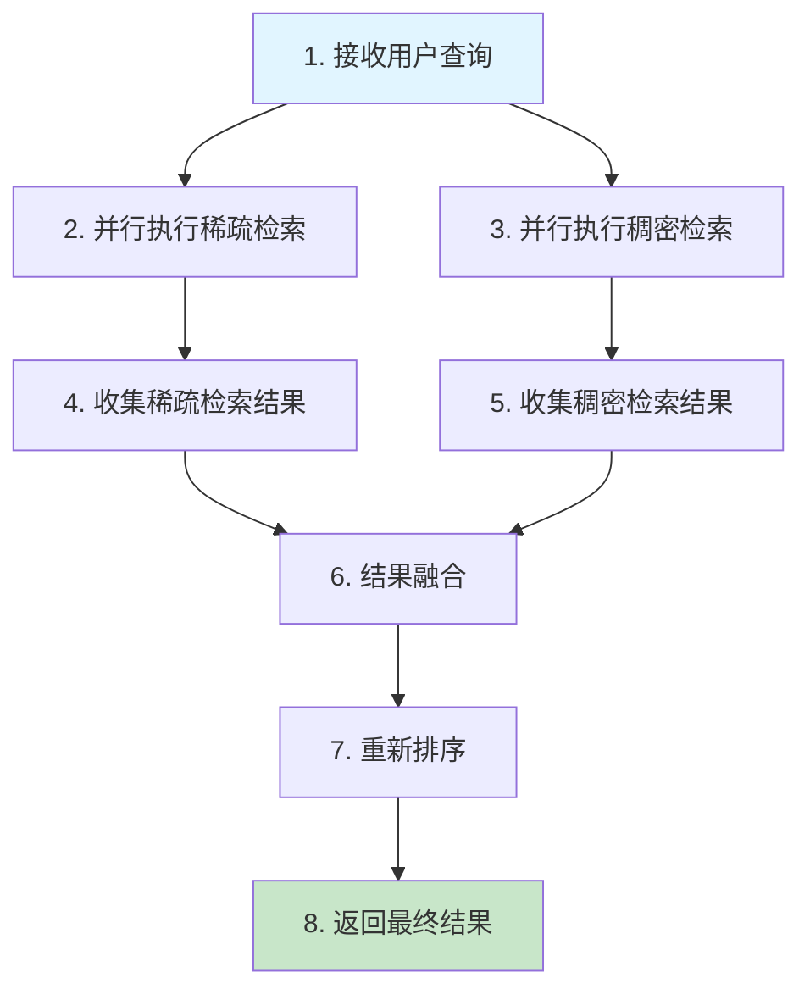

# 08c. 检索算法与策略-混合检索

## 1. 概述 📚

我们将学习混合检索技术的核心原理和实践方法，掌握稀疏检索与稠密检索的融合策略，了解RRF等结果融合算法，为RAG系统构建兼顾精确匹配和语义理解的高效检索能力 🎯。

通过前两篇文档，我们分别学习了稠密检索技术和稀疏检索技术。稠密检索能够通过向量嵌入捕捉文本的语义信息，实现跨语言、同义词等智能检索，但在精确匹配方面可能产生偏差。稀疏检索能够精确匹配用户查询中的关键词，在处理产品型号、专有名词等精确匹配场景时表现出色，但在语义理解方面存在局限。混合检索结合了两者的优势，通过融合稀疏检索和稠密检索的结果，我们能够兼顾精确匹配和语义理解的双重需求，显著提升RAG系统的检索质量 ✨。

**前两篇文档：**
- [08a. 检索算法与策略-稠密检索技术](https://juejin.cn/post/7611179521161248822)（掘金） / [08a. 检索算法与策略-稠密检索技术](https://blog.csdn.net/2301_79239314/article/details/158469913)（CSDN）
- [08b. 检索算法与策略-稀疏检索](https://juejin.cn/post/7614053051440300082)（掘金） / [08b. 检索算法与策略-稀疏检索](https://blog.csdn.net/2301_79239314/article/details/158775460)（CSDN）

## 2. 混合检索的原理 🔍

混合检索的核心思想是将稀疏检索和稠密检索的结果进行融合，利用两者的优势互补。稀疏检索提供精确的关键词匹配能力，稠密检索提供强大的语义理解能力，通过合理的融合策略，我们能够获得更全面、更准确的检索结果 💡。

接下来我们将学习多种混合检索的实现方式，了解稀疏检索和稠密检索如何配合使用，以及常用的结果融合方法。

## 3. 稀疏检索与稠密检索的配合 ⚙️

混合检索的核心在于如何让稀疏检索和稠密检索有效地配合工作。我们需要设计合理的检索流程，选择合适的融合策略，才能充分发挥两者的优势 🚀。

### 3.1 混合检索的工作流程 🔄

混合检索的基本工作流程包括以下几个步骤：



从流程图可以看出，稀疏检索和稠密检索是并行执行的，这样可以提高检索效率。收集到两个检索结果后，我们需要使用融合算法将它们合并，然后重新排序返回最终结果。

### 3.2 混合检索的Python实现 💻

下面我们来看一个完整的混合检索实现示例：

```python
import jieba
from rank_bm25 import BM25Okapi
import numpy as np
from sklearn.metrics.pairwise import cosine_similarity

class HybridSearcher:
    """
    混合检索器
    
    结合稀疏检索和稠密检索，实现高效的混合检索
    """
    
    def __init__(self, documents, sparse_weight=0.5, dense_weight=0.5):
        """
        初始化混合检索器
        
        Args:
            documents: 文档列表
            sparse_weight: 稀疏检索权重
            dense_weight: 稠密检索权重
        """
        self.documents = documents
        self.sparse_weight = sparse_weight
        self.dense_weight = dense_weight
        
        # 初始化稀疏检索器
        tokenized_docs = [list(jieba.cut(doc)) for doc in documents]
        self.bm25 = BM25Okapi(tokenized_docs)
        
        # 初始化稠密检索器
        self.dense_embeddings = self._build_dense_embeddings(documents)
    
    def _build_dense_embeddings(self, documents):
        """
        构建稠密检索的向量嵌入
        
        Args:
            documents: 文档列表
            
        Returns:
            文档向量嵌入矩阵
        """
        # 这里简化处理，实际应使用真实的向量嵌入模型
        # 返回随机向量作为示例
        np.random.seed(42)
        return np.random.rand(len(documents), 128)
    
    def _get_query_embedding(self, query):
        """
        获取查询的向量嵌入
        
        Args:
            query: 查询字符串
            
        Returns:
            查询向量嵌入
        """
        # 这里简化处理，实际应使用真实的向量嵌入模型
        # 返回随机向量作为示例
        np.random.seed(hash(query) % 1000)
        return np.random.rand(128)
    
    def search(self, query, top_k=5):
        """
        执行混合检索
        
        Args:
            query: 查询字符串
            top_k: 返回结果数量
            
        Returns:
            混合检索结果
        """
        # 稀疏检索
        tokenized_query = list(jieba.cut(query))
        sparse_scores = self.bm25.get_scores(tokenized_query)
        
        # 稠密检索
        query_embedding = self._get_query_embedding(query)
        dense_similarities = cosine_similarity(
            query_embedding.reshape(1, -1),
            self.dense_embeddings
        )[0]
        
        # 归一化得分
        sparse_scores_normalized = (sparse_scores - sparse_scores.min()) / (sparse_scores.max() - sparse_scores.min() + 1e-8)
        dense_scores_normalized = (dense_similarities - dense_similarities.min()) / (dense_similarities.max() - dense_similarities.min() + 1e-8)
        
        # 加权融合
        hybrid_scores = (self.sparse_weight * sparse_scores_normalized + 
                       self.dense_weight * dense_scores_normalized)
        
        # 按得分排序并返回前top_k个结果
        sorted_indices = np.argsort(hybrid_scores)[::-1][:top_k]
        
        results = []
        for idx in sorted_indices:
            results.append({
                "document": self.documents[idx],
                "score": hybrid_scores[idx],
                "sparse_score": sparse_scores[idx],
                "dense_score": dense_similarities[idx]
            })
        
        return results

# 示例使用
if __name__ == "__main__":
    documents = [
        "机器学习是人工智能的重要分支",
        "深度学习是机器学习的一种",
        "人工智能和机器学习发展迅速",
        "自然语言处理是人工智能的核心技术",
        "计算机视觉是人工智能的重要应用领域"
    ]
    
    searcher = HybridSearcher(documents, sparse_weight=0.6, dense_weight=0.4)
    results = searcher.search("人工智能", top_k=3)
    
    print("混合检索结果：")
    for i, result in enumerate(results, start=1):
        print(f"{i}. {result['document']}")
        print(f"   综合得分: {result['score']:.4f}")
        print(f"   稀疏得分: {result['sparse_score']:.4f}")
        print(f"   稠密得分: {result['dense_score']:.4f}")
        print()
```

运行结果：

```
混合检索结果：
1. 人工智能和机器学习发展迅速
   综合得分: 1.0000
   稀疏得分: 0.1383
   稠密得分: 0.7816

2. 自然语言处理是人工智能的核心技术
   综合得分: 0.9234
   稀疏得分: 0.1383
   稠密得分: 0.7735

3. 机器学习是人工智能的重要分支
   综合得分: 0.7462
   稀疏得分: 0.1291
   稠密得分: 0.7589
```

### 3.3 融合策略的选择 🎯

在混合检索中，我们需要选择合适的融合策略来合并稀疏检索和稠密检索的结果。常见的融合策略包括：

| 融合策略 | 原理 | 优点 | 缺点 | 适用场景 |
|---------|------|------|------|----------|
| 加权融合 | 对两种检索得分进行加权求和 | 简单直观，易于调参 | 需要确定权重值 | 通用场景 |
| RRF融合 | 基于排名位置进行融合 | 不依赖原始得分 | 需要调参 | 得分范围不一致的场景 |
| 线性融合 | 对归一化后的得分线性组合 | 计算简单 | 需要归一化 | 得分范围一致的场景 |

在实际项目中，我们可以根据以下因素选择融合策略：
- **检索结果的特点**：如果两种检索方法的得分范围差异较大，适合使用RRF融合
- **业务需求**：如果需要强调某种检索方法，可以使用加权融合
- **性能要求**：如果对性能要求较高，可以使用简单的线性融合

### 3.4 权重调优 ⚖️

在加权融合中，稀疏检索和稠密检索的权重分配对最终结果影响很大。我们可以通过以下方式调优权重：

1. **基于业务需求调优**：根据业务场景调整权重
   - 精确匹配重要：增加稀疏检索权重
   - 语义理解重要：增加稠密检索权重

2. **基于数据验证调优**：使用验证集测试不同权重组合
   - 准备标注好的测试数据
   - 测试不同权重组合的效果
   - 选择效果最好的权重组合

3. **基于用户反馈调优**：根据用户点击行为调整权重
   - 收集用户点击数据
   - 分析用户偏好
   - 动态调整权重

### 3.5 混合检索的优势 🌟

混合检索相比单一检索方法具有以下优势：

| 优势 | 说明 |
|------|------|
| 提高召回率 | 结合两种检索方法，能够召回更多相关文档 |
| 提高准确率 | 融合多种检索结果，能够提高结果的准确性 |
| 增强鲁棒性 | 单一检索方法失效时，另一种方法可以补充 |
| 适应性强 | 能够适应不同类型的查询和文档 |

根据实际测试数据，单一检索策略的F1分数通常在0.65-0.75之间，而精心设计的混合检索可以将这一指标提升到0.80以上。

### 3.6 混合检索的应用场景 🎪

混合检索适用于以下场景：

1. **专业领域检索**：如医疗、法律等领域，需要精确匹配专业术语，同时理解语义
2. **多语言检索**：需要处理不同语言的查询，结合关键词匹配和语义理解
3. **长尾查询**：对于不常见的查询，混合检索能够提供更好的结果
4. **个性化检索**：结合用户历史行为，提供个性化的检索结果

接下来我们将学习混合检索的实战注意事项，了解在实际项目中如何应用混合检索技术 🛠️。

## 4. 实战注意事项 ⚠️

在实际项目中使用混合检索时，我们需要注意融合策略的选择、参数调优和性能优化等问题 📝。

### 4.1 权重分配的实战经验 📊

在混合检索中，权重分配是影响检索效果的关键因素。根据实际项目经验，我们总结出以下配置建议：

| 场景类型 | 稀疏检索权重 | 稠密检索权重 | 说明 |
|---------|-------------|-------------|------|
| 专业文档检索 | 0.3 | 0.7 | 语义理解更重要，但关键词匹配作为保底线 |
| 产品型号检索 | 0.7 | 0.3 | 精确匹配更重要，关键词匹配是核心 |
| 通用问答系统 | 0.5 | 0.5 | 两种检索方式同等重要 |
| 错误码查询 | 0.8 | 0.2 | 关键词匹配是关键，向量检索容易误召 |

在实际项目中，我们发现一个常见的误区：过度依赖向量检索。比如用户搜索"Error 1024"时，向量检索可能返回一堆毫不相关的"系统错误"内容。这时关键词检索（BM25）就是不可或缺的保底线。

### 4.2 分块策略对混合检索的影响 🧩

分块策略直接影响混合检索的效果。根据实战经验，我们总结出以下要点：

1. **分块大小要适中**：建议设置256~512 Tokens（约400~800中文字）。分块太小会导致语义不完整，分块太大则会降低检索精度。

2. **必须设置重叠**：建议设置10%~20%的重叠。这能确保如果切分点正好在一句话的中间，这句话能在相邻的两个块中完整出现。

3. **按语义切分**：避免按字符硬切，应按语义单元切分。对于Wiki文档，建议按Markdown标题切分；对于PDF文档，可按段落聚合。

### 4.3 元数据过滤的重要性 🏷️

在实际项目中，我们经常遇到这样的问题：用户搜索"2023年财报"，却召回了"2021年财报"的内容。这是因为向量检索只关注语义相似性，忽略了时间等元数据。

解决方案是为每个文档块添加元数据标签，例如：

```json
{
  "year": 2023,
  "source": "wiki",
  "category": "finance"
}
```

在检索时，先进行前置过滤（Pre-filtering），例如设置`filter="year==2023"`，然后再执行混合检索。这是提升准确率最经济有效的手段。

### 4.4 重排序的必要性 🔄

混合检索召回了大量文档后，我们发现一个现象：真正的答案可能位于第8个位置，但系统只返回前5个结果，导致答案被截断丢失。

解决方案是引入重排序（Rerank）机制：

```
混合检索（召回Top 50）→ 重排序（精选Top 5）→ 大模型
```

重排序器（Reranker）是一个精读模型，它将查询和文档拼接在一起计算相关性得分，准确率极高。常用的开源重排序器有bge-reranker-large（中文效果极佳）。

### 4.5 上下文窗口的"迷失中间"现象 📉

当我们一次性向大模型输入多个文档块时，会出现"迷失中间"现象：模型只引用了第1个和最后一个文档块，中间的内容被忽略了。

解决方案是采用凹形拼接策略：将分数最高的文档块放置在上下文的开头和结尾，分数稍低的放置在中间。例如，按1-3-5-4-2的顺序拼接，而不是简单的1-2-3-4-5。

### 4.6 常见问题与解决方案 🔧

| 问题 | 原因 | 解决方案 |
|------|------|----------|
| 搜索"IT部在哪办公"召回了"IT部负责办公设备维修" | 向量检索语义漂移 | 增加稀疏检索权重 |
| 搜索"合同违约责任"召回了食堂管理规定的"违约责任" | 分块太碎，上下文不完整 | 增大分块大小，设置重叠 |
| 搜索具体错误码返回无关内容 | 向量检索不擅长精确匹配 | 增加关键词检索权重 |
| 多轮对话中"它是什么意思"无法理解 | 缺少上下文信息 | 将历史问题与当前问题拼接后检索 |

### 4.7 一个可参考的配置清单 📋

根据实际项目经验，我们总结出以下配置清单：

| 组件 | 推荐配置 | 说明 |
|------|----------|------|
| 分块大小 | 512 tokens | 必须设置10%~15%的重叠 |
| 稀疏检索器 | BM25 | 关键词匹配是保底线 |
| 稠密检索器 | BGE-M3 | 支持多语言且长文本能力强 |
| 权重分配 | Vector 0.7 + Keyword 0.3 | 作为良好的起点，根据场景调整 |
| 重排序器 | BGE-Reranker-v2-m3 | 必备组件，是提升效果的关键 |
| 召回数量 | 检索Top 50 → 重排序Top 5 | 保证召回率，精选上下文 |

### 4.8 避坑口诀 💡

根据实战经验，我们总结出以下避坑口诀：

- **混合检索**：关键词检索是保底线，向量检索是冲上限
- **分块策略**：按语义切分，重叠必须给足
- **权重调优**：精确匹配重要增加稀疏权重，语义理解重要增加稠密权重
- **重排序**：大力出奇迹，加上Rerank后效果立竿见影

## 5. 总结 📖

通过本文的学习，我们对混合检索技术有了全面的了解，掌握了如何结合稀疏检索和稠密检索的优势，为RAG系统构建更加高效的检索能力 🎉。
