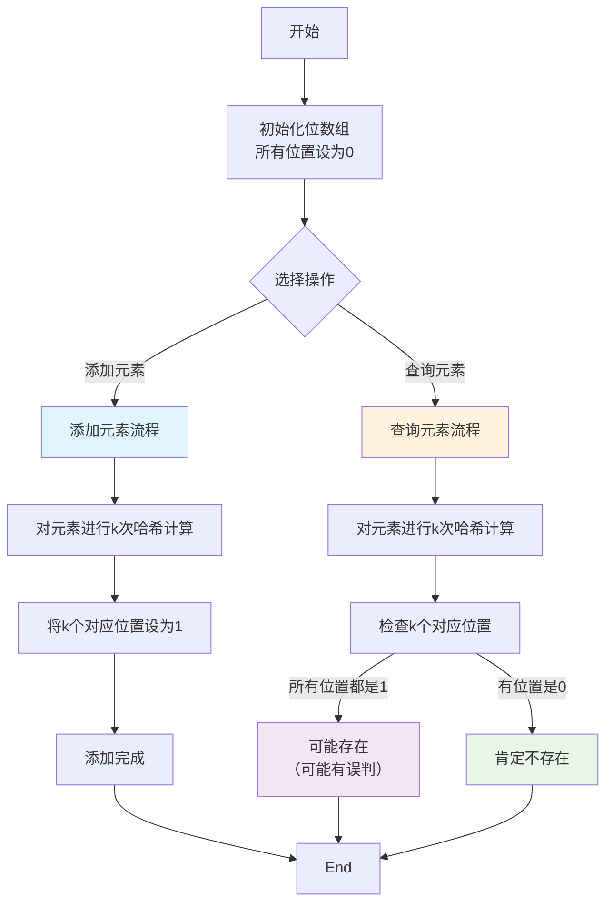

# 8d-布隆过滤器是什么？

## 📋 文档概述

通过上篇文档[08c. 检索算法与策略-混合检索](https://juejin.cn/post/7614084911990915110)的学习，我们掌握了多种检索技术的组合应用。现在让我们来了解一个在数据处理中非常实用的数据结构——布隆过滤器（Bloom Filter），它就像是一个"快速检查员"，能帮我们高效判断元素是否存在。

### 1. 布隆过滤器到底是什么？ 🤔

布隆过滤器（Bloom Filter）是一种超级节省空间的数据结构，专门用来快速判断一个元素是否在集合里。它就像一个"快速检查员"，能告诉你"这个元素可能在里面"或者"这个元素肯定不在里面"。

#### 1.1 布隆过滤器的基本概念 🎯

布隆过滤器其实就是一个超级节省空间的数据结构，它由**位数组**和**多个哈希函数**组成。咱们可以把它想象成一个专门用来快速判断元素是否存在的"快速检查员"。

这种数据结构最大的特点就是**空间效率极高**，但有个小缺点就是存在一定的误判率。也就是说，它可能会误报元素存在，但绝对不会漏报元素不存在。

那为什么我们需要这种数据结构呢？主要是因为传统哈希表需要存储所有元素，占用空间太大了。而布隆过滤器只需要一个位数组，超级节省内存，特别适合海量数据的快速查询场景。

跟哈希表比起来，布隆过滤器最大的区别就是不存储具体元素，只记录存在状态。哈希表查询准确率是100%，但布隆过滤器可能有误判。不过从空间效率来看，布隆过滤器比哈希表节省几十倍甚至几百倍空间，这个优势还是很明显的。

#### 1.2 布隆过滤器的工作原理 ⚙️

**位数组和哈希函数的组合**
- **位数组**：就是一个很长的0和1组成的数组
- **哈希函数**：用来计算元素在位数组中的位置
- **多个哈希函数**：通常使用3-5个不同的哈希函数

**添加元素的流程**
1. 对元素进行多个哈希计算
2. 得到多个位置索引
3. 将这些位置设为1
4. 完成元素"添加"

**查询元素的判断逻辑**
1. 对查询元素进行同样的哈希计算
2. 检查所有对应位置是否都是1
3. **如果都是1** → "可能存在"
4. **如果有任何一个位置是0** → "肯定不存在"

#### 1.3 布隆过滤器的核心特性 ✨

**空间效率极高的优势**
- 只需要一个位数组，不存储实际元素
- 适合处理海量数据
- 内存占用极小，查询速度极快

**概率性判断的特点**
- 判断结果不是100%准确
- 可能存在**假阳性**（误判存在）
- 但**不会出现假阴性**（不会漏判存在）

**误判率的存在原因**
- 不同元素可能哈希到相同位置
- 随着元素增多，误判率会上升
- 可以通过调整参数来控制误判率

### 2. 布隆过滤器怎么工作的？ 🔧

布隆过滤器的工作原理基于位数组和多个哈希函数的组合。让我们通过一个具体的流程图来理解它的工作过程：

#### 2.1 数据结构组成 🧩

**位数组的设计原理**
- **位数组**：一个很长的二进制数组，每个位置只能是0或1
- **长度m**：位数组的大小，决定了能存储的信息量
- **初始化**：开始时所有位置都是0（表示空）

**哈希函数的选择策略**
- **哈希函数**：将任意长度的输入映射到固定范围的输出
- **数量k**：通常使用3-5个不同的哈希函数
- **独立性**：每个哈希函数应该有不同的映射规则
- **常用函数**：MurmurHash、FNV、MD5等

**参数配置的影响**
- **m（位数组大小）**：越大越准确，但内存占用越多
- **k（哈希函数数量）**：越多越均匀，但计算时间越长
- **n（预期元素数量）**：影响位数组大小的选择

#### 2.2 操作流程详解 📊

**添加元素的完整步骤**
1. 对要添加的元素进行k次哈希计算
2. 得到k个位置索引（0到m-1之间的整数）
3. 将这k个位置的值设为1
4. 完成元素的"添加"操作

**查询元素的判断过程**
1. 对查询元素进行同样的k次哈希计算
2. 检查这k个位置的值
3. **判断逻辑**：
   - 如果所有位置都是1 → "元素可能存在"
   - 如果有任何一个位置是0 → "元素肯定不存在"

**误判率的计算方式**
- **公式**：误判率 ≈ (1 - e^(-kn/m))^k
- **影响因素**：
  - 元素数量n：越多误判率越高
  - 位数组大小m：越大误判率越低
  - 哈希函数数量k：存在最优值

#### 2.3 性能优化策略 🚀

**如何降低误判率？**
- **增大位数组**：增加m的值
- **优化哈希函数**：选择更好的哈希算法
- **控制元素数量**：避免超过预期容量
- **参数调优**：根据业务需求调整k和m

**空间与时间的权衡**
- **空间换准确率**：位数组越大，误判率越低
- **时间换准确率**：哈希函数越多，计算越准确但耗时
- **最佳平衡点**：需要根据具体场景选择

**最佳参数配置建议**
- **通用配置**：k=3-5，m=10n
- **高精度场景**：m=20n，k=7-8
- **内存敏感场景**：m=5n，k=2-3
- **动态调整**：根据实际使用情况优化参数

### 3. 布隆过滤器有什么优缺点？ ⚖️

布隆过滤器就像是一个优缺点都很鲜明的技术工具，咱们来仔细看看它到底有哪些优势和不足。

#### 3.1 主要优势亮点 🌟

布隆过滤器最大的优势就是**空间效率极高**，这个特点让它在大数据场景下特别受欢迎。咱们可以把它想象成一个超级节省内存的"快速检查员"，只需要一个位数组就能处理海量数据。

查询速度也特别快，基本上就是O(k)的时间复杂度，k是哈希函数的数量。这意味着不管数据量多大，查询时间都差不多，这个特性在处理海量数据时特别有用。

还有一个很重要的优势就是它**绝对不会漏判**。也就是说，如果布隆过滤器说某个元素不存在，那这个元素就肯定不存在。这个特性在很多场景下都是至关重要的，比如缓存穿透防护。

#### 3.2 主要缺点限制 ⚠️

当然啦，布隆过滤器也不是完美的，它最大的缺点就是存在**误判率**。也就是说，它可能会误报元素存在，虽然这种情况的概率可以通过参数调优来控制，但始终无法完全避免。

另一个比较麻烦的限制是**不支持删除操作**。因为布隆过滤器中的每个位可能被多个元素共享，如果删除一个元素，可能会影响到其他元素的判断结果，导致误判率大幅上升。

还有就是它**只能判断存在性**，不能获取具体的元素信息。也就是说，它只能告诉你"这个元素可能在集合里"，但不能告诉你这个元素具体是什么，也不能进行范围查询或者其他复杂操作。

#### 3.3 与其他技术的对比 📈

跟传统哈希表比起来，布隆过滤器最大的优势就是空间效率。哈希表需要存储所有元素，占用空间大，而布隆过滤器只需要一个位数组，能节省几十倍甚至几百倍的空间。

不过哈希表的查询准确率是100%，而布隆过滤器有误判的可能。所以在对准确性要求极高的场景下，还是得用哈希表。

布谷鸟过滤器是布隆过滤器的一个改进版本，它最大的优势就是支持删除操作。但是布谷鸟过滤器的实现相对复杂一些，而且在某些情况下性能可能不如布隆过滤器稳定。

选择使用哪种技术，主要还是看具体的业务需求。如果对空间效率要求高，能接受一定的误判率，而且不需要删除操作，那布隆过滤器就是个不错的选择。如果需要支持删除，或者对准确性要求极高，那可能就需要考虑其他方案了。

### 4. 布隆过滤器的变种和改进 🔄

布隆过滤器虽然已经很优秀了，但研究人员们还在不断改进它，推出了各种变种版本来解决特定的问题。咱们来看看这些改进版本都有什么特点。

#### 4.1 计数布隆过滤器 🔢

计数布隆过滤器是传统布隆过滤器的一个重要改进，它最大的突破就是**支持删除操作**。这个功能在很多实际应用场景中都非常重要。

它的实现原理其实挺巧妙的，就是把原来的位数组改成了**计数器数组**。每个位置不再只是0或1，而是可以存储一个计数值。添加元素时，对应的位置计数器加1；删除元素时，对应的位置计数器减1。

不过计数布隆过滤器也有个小缺点，就是**空间占用会更大**。因为每个位置需要存储计数值，而不是单个比特，所以内存消耗会比传统布隆过滤器大一些。

适用场景主要是在需要频繁添加和删除元素的场景，比如缓存系统、会话管理等。在这些场景下，虽然空间占用大了点，但支持删除的功能带来的便利性更重要。

#### 4.2 可扩展布隆过滤器 📈

可扩展布隆过滤器解决了传统布隆过滤器的一个痛点：**无法动态扩容**。传统版本一旦位数组大小确定了，如果后续数据量超出预期，误判率就会急剧上升。

可扩展版本的机制很聪明，它采用**分层设计**。当第一层布隆过滤器快满的时候，就自动创建第二层，然后继续使用。查询的时候需要检查所有层，只要任何一层认为元素存在，就返回可能存在。

这种设计让布隆过滤器能够**适应数据量的动态变化**，特别适合那些数据量难以预估的场景。比如在分布式系统中，数据量可能会随着业务发展快速增长，可扩展版本就能很好地应对这种情况。

#### 4.3 其他改进版本 🛠️

除了上面两个主要的变种，还有一些其他的改进版本也很有意思。

**分块布隆过滤器**把大的位数组分成多个小块，每个块可以独立操作。这样做的好处是**提高了并行性**，在多线程环境下性能更好，而且可以按需加载部分数据，减少内存压力。

**压缩布隆过滤器**则是在存储和传输时对位数组进行压缩，进一步**减少空间占用**。虽然压缩和解压缩需要额外的计算开销，但在网络传输或者存储空间极其有限的场景下，这个代价是值得的。

**分层布隆过滤器**则是在可扩展版本的基础上进一步优化，通过多层过滤来**提高查询效率**。常用的元素会在上层过滤器中，不常用的在下层，这样大部分查询都能在上层快速完成。

这些改进版本各有特色，选择哪个主要看具体的应用需求。如果对空间要求极高，就用传统版本；如果需要支持删除，就用计数版本；如果数据量不确定，就用可扩展版本。

---

最后更新时间：2026-03-18