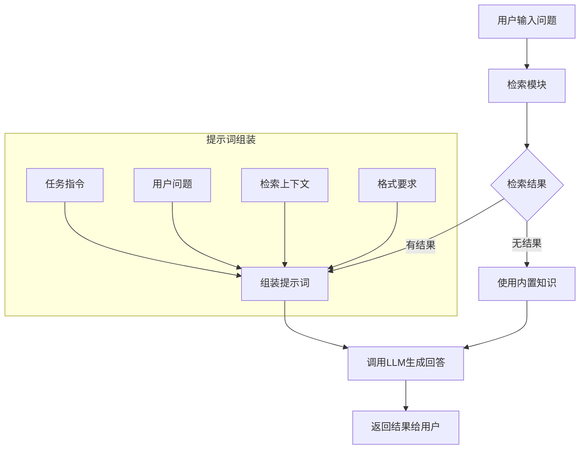

# 11. 提示词工程与上下文组装

## 1. 概述 📚

通过[10. 重排序模型实战-BGE-Rerank应用](https://juejin.cn/post/7614897667962126387)（掘金） / [10. 重排序模型实战-BGE-Rerank应用](https://blog.csdn.net/2301_79239314/article/details/158841631)（CSDN）的学习，我们掌握了BGE-Rerank模型的实战应用和性能优化技巧 🎯。现在我们将进入提示词工程与上下文组装的学习，这是RAG系统中承上启下的关键环节 💪。本章我们将深入学习如何设计高效的RAG提示模板、如何进行上下文压缩与组装、以及如何优化Token使用，帮助我们构建更加智能和高效的RAG系统 🚀。

## 2. RAG提示词基础 🧠

我们将学习RAG系统中提示词工程的基础概念和核心作用 🎯。在RAG系统中，提示词是连接检索结果与大语言模型的关键桥梁，它决定了模型能否准确理解用户意图并生成高质量的回答 📊。

### 2.1 提示词在RAG中的作用 🎯

在RAG系统中，提示词承担着多重重要使命 🔄：

- 🎯 **指令传达**：告诉大语言模型需要完成什么任务
- 📚 **知识整合**：将检索到的相关信息嵌入提示词
- 📝 **格式规范**：约束模型输出的格式和风格
- ⚠️ **边界设定**：明确模型可以使用的知识范围

一个设计良好的提示词，可以让大语言模型充分利用检索到的知识，同时避免幻觉和错误输出 💡。我们在实践中发现，提示词的质量直接影响RAG系统的最终效果 🎯。

### 2.2 RAG提示词的核心组成 📋

典型的RAG提示词通常包含以下几个核心部分 🧩：

```python
RAG提示词 = 任务指令 + 用户问题 + 检索上下文 + 输出格式要求
```

- 🎯 **任务指令**：告诉模型扮演什么角色，如何处理问题
- ❓ **用户问题**：原始的用户查询输入
- 📄 **检索上下文**：从知识库检索到的相关文档
- 📋 **输出格式**：期望的输出结构和格式

### 2.3 RAG提示词工作流程 🔄

RAG系统中提示词的工作流程如下面的Mermaid流程图所示 📊：



### 2.4 提示词设计原则 📝

我们在设计RAG提示词时，通常遵循以下核心原则 💡：

- 🧠 **清晰明确**：指令要简单明了，避免歧义
- 📚 **知识聚焦**：突出检索内容的重要性
- ⚠️ **边界约束**：明确告诉模型什么不能做
- 📋 **格式规范**：预设清晰的输出格式

### 2.5 提示词与前序章节的关联 🔗

我们在学习RAG提示词时，需要理解它与前面所学知识的紧密联系 📊：

- 📚 在[06-Embedding模型与向量化](https://juejin.cn/post/7608760065668137010)中，我们学习了如何将文本转换为向量，这为检索提供了基础
- 🔍 在[08a-检索算法与策略-稠密检索技术](https://juejin.cn/post/7611179521161248822)中，我们掌握了各种检索算法，这些算法决定了检索到的内容质量
- 🎯 在[10-重排序模型实战-BGE-Rerank应用](https://juejin.cn/post/7614897667962126387)中，我们学习了如何对检索结果进行重排序，提升相关性

提示词工程是这些技术的集大成者，它将检索结果有效地传递给大语言模型 📦。接下来我们将深入学习如何设计具体的提示模板 ✍️。

## 3. RAG提示模板设计 ✍️

我们将学习如何设计高效的RAG提示模板，这是提升RAG系统效果的关键技巧 🎯。一个好的提示模板可以让大语言模型准确理解任务要求，充分利用检索到的知识生成高质量回答 📊。

### 3.1 提示模板的基本结构 📋

我们在设计RAG提示模板时，通常采用以下标准结构 🧩：

```python
RAG提示模板 = 角色定义 + 任务目标 + 检索上下文 + 输出要求
```

这个结构包含四个核心要素，每个要素都有其独特的作用 💡。我们在实际项目中发现，按照这个结构设计的提示模板通常能够获得更好的效果 🎯。

### 3.2 角色定义 🎭

我们在提示模板的开头通常需要定义模型的角色，这可以帮助模型建立正确的回答基调 📝：

```python
# 角色定义示例
角色设定 = """
你是一名专业的{专业领域}助手，拥有丰富的专业知识和实践经验。
你的回答应该准确、专业、易于理解。
"""
```

角色定义的作用是告诉大语言模型应该以什么身份来回答问题 🧑‍🏫。我们在客服场景中通常设置为客服人员，在医疗场景中设置为专业医师，在法律场景中设置为资深律师 ⚖️。不同的角色设定会影响模型回答的专业程度和表达方式 📊。

### 3.3 任务描述 📝

我们在角色定义之后需要明确描述具体任务，让模型知道需要完成什么 🎯：

```python
# 任务描述示例
任务目标 = """
你的任务是根据以下检索到的上下文信息回答用户的问题。
请仔细阅读并理解上下文内容，然后给出准确、完整的回答。
"""
```

任务描述需要清晰明确，避免模糊表述 📋。我们发现，使用祈使句和明确的动词（如"回答"、"解释"、"总结"）可以让模型更好地理解任务要求 ✅。

### 3.4 检索上下文组织 📄

检索上下文是提示模板中最重要的部分，它决定了模型能否充分利用检索到的知识 💡。我们在组织检索上下文时需要注意以下几点 📊：

```python
# 检索上下文组织示例
检索上下文 = """
以下是检索到的相关上下文信息：

{context}

请根据以上信息回答问题。
"""
```

我们在实际应用中发现，上下文信息的排列顺序会显著影响模型的回答质量 📈。根据心理学中的**首因效应**和**近因效应**，我们推荐采用**凹形放置策略**（U-shaped arrangement） 🎯：

```python
# 凹形放置策略示例
def u_shaped_arrangement(retrieved_docs):
    """
    凹形放置策略：将最相关的内容放在开头和结尾
    
    Args:
        retrieved_docs: 按相关性排序的文档列表（相关性从高到低）
        
    Returns:
        arranged_docs: 凹形排列后的文档列表
    """
    if len(retrieved_docs) <= 3:
        # 文档数量较少时，保持原顺序
        return retrieved_docs
    
    # 凹形排列：最相关的内容放在开头和结尾
    arranged_docs = [retrieved_docs[0]]
    
    # 开头：最相关的内容（首因效应）

    # 中间：次相关的内容
    mid_index = len(retrieved_docs) // 2
    arranged_docs.extend(retrieved_docs[1:mid_index])  # 次相关前半部分
    
    # 结尾：次相关但重要的内容（近因效应）
    arranged_docs.append(retrieved_docs[-1])  # 次相关但重要
    
    # 中间剩余部分
    arranged_docs.extend(retrieved_docs[mid_index:-1])
    
    return arranged_docs

# 使用示例
retrieved_docs = ["最相关内容", "次相关1", "次相关2", "次相关3", "次相关4", "次相关5"]
arranged = u_shaped_arrangement(retrieved_docs)
print(f"原始顺序: {retrieved_docs}")
print(f"凹形排列结果: {arranged}")
# 输出: 
# 原始顺序: ['最相关内容', '次相关1', '次相关2', '次相关3', '次相关4', '次相关5']
# 凹形排列结果: ['最相关内容', '次相关1', '次相关2', '次相关5', '次相关3', '次相关4']
```

**凹形放置策略的优势** 🎯：
- 🧠 **首因效应**：开头的内容更容易被记住和重视
- 📈 **近因效应**：结尾的内容也容易被记住
- ⚖️ **平衡权重**：避免中间内容被忽略
- 📊 **优化注意力**：符合人类认知规律

这种策略在长文档处理中特别有效，能够最大化利用模型的注意力机制 💡。

### 3.5 输出格式设定 📋

我们在提示模板中还需要设定输出格式，这可以让模型的回答更加规范易于处理 🧩：

```python
# 输出格式设定示例
输出要求 = """
请按照以下格式要求回答：
1. 回答要简洁明了，不超过200字
2. 如果上下文中没有相关信息，请明确告知用户
3. 回答必须基于提供的上下文，不能编造信息
"""
```

### 3.6 LangChain提示模板实现 🔧

**LangChain框架简介** 📚：

LangChain是一个开源的AI应用开发框架，专门用于构建基于大语言模型的应用程序 🚀。它在2024-2025年进行了重大架构重组，将原本臃肿的单一包拆分为清晰的层次结构 📊。

**LangChain核心特点** 💡：
- 🧩 **模块化设计**：提供标准化的组件和抽象接口
- 🔗 **上下文感知**：将语言模型连接到上下文信息源
- 🧠 **推理能力**：依赖语言模型进行智能推理
- 📦 **丰富集成**：支持700+第三方服务和数据源
- 🚀 **快速开发**：简化AI应用开发流程

我们在实际项目中经常使用LangChain来构建提示模板，它提供了灵活的模板定义方式 🛠️：

```python
from langchain.prompts import PromptTemplate

# 定义RAG提示模板
rag_prompt_template = PromptTemplate(
    input_variables=["context", "question"],
    template="""
你是一个专业的AI助手，只能根据提供的上下文回答用户的问题。

## 检索到的上下文信息：
{context}

## 用户问题：
{question}

## 回答要求：
1. 请根据上述上下文信息回答问题
2. 如果上下文中没有相关信息，请直接说"抱歉，我在上下文中没有找到相关信息"
3. 回答要简洁、准确

## 回答：
"""
)

# 使用模板生成提示词
prompt = rag_prompt_template.format(
    context="这里是检索到的上下文内容...",
    question="用户的问题是什么？"
)
```

我们发现，使用LangChain的PromptTemplate可以方便地管理和修改提示模板，提高了开发效率 🚀。

### 3.7 提示模板使用示例 💻

**前置知识说明** 📚：

本章节的示例代码需要调用阿里云大模型API，如果您对阿里云API调用还不熟悉，建议先学习 [11a. 阿里云大模型API调用基础](https://juejin.cn/post/7615069320984477750)（掘金） / [11a. 阿里云大模型API调用基础](https://blog.csdn.net/2301_79239314/article/details/158849545)（CSDN），该文档详细介绍了如何获取API密钥、配置环境变量以及基础的API调用方法 🎯。

下面是一个完整的提示模板使用示例，展示了如何将各部分组合在一起，并实际调用阿里云大模型API生成回答 📊：

```python
import os
from openai import OpenAI
from langchain_core.prompts import PromptTemplate

# 创建提示模板
template = PromptTemplate(
    input_variables=["context", "question"],
    template="""
你是一个专业的知识问答助手。

# 检索到的上下文：
{context}

# 用户问题：
{question}

# 回答要求：
- 必须基于提供的上下文回答
- 回答要简洁、准确
- 如果没有相关信息，请明确告知

请开始回答：
"""
)

# 模拟检索结果
context = """
糖尿病是一种慢性代谢性疾病，主要特征是血糖水平持续升高。
糖尿病分为1型和2型，其中2型糖尿病最为常见。
糖尿病患者需要长期控制饮食和血糖水平。
"""

question = "糖尿病的主要特征是什么？"

# 生成提示词
prompt = template.format(context=context, question=question)

print("生成的提示词：")
print("=" * 50)
print(prompt)
print("=" * 50)

# 调用阿里云大模型API生成回答
print("\n调用阿里云大模型API生成回答：")
print("-" * 50)

# 初始化阿里云OpenAI兼容客户端
# 注意: 不同地域的base_url不通用（下方示例使用北京地域的 base_url）
# - 华北2（北京）: `https://dashscope.aliyuncs.com/compatible-mode/v1` 
# - 新加坡: `https://dashscope-intl.aliyuncs.com/compatible-mode/v1` 
client = OpenAI(
    api_key="sk-your-api-key-here",  # 请替换为您的实际API密钥
    base_url="https://dashscope.aliyuncs.com/compatible-mode/v1",
)

# 调用API生成回答
completion = client.chat.completions.create(
    model="qwen3.5-plus",
    messages=[{'role': 'user', 'content': prompt}]
)

# 输出模型生成的回答
print(completion.choices[0].message.content)
print("-" * 50)
```

**实际运行结果示例：**
```
生成的提示词：
==================================================

你是一个专业的知识问答助手。

# 检索到的上下文：

糖尿病是一种慢性代谢性疾病，主要特征是血糖水平持续升高。
糖尿病分为1型和2型，其中2型糖尿病最为常见。
糖尿病患者需要长期控制饮食和血糖水平。


# 用户问题：
糖尿病的主要特征是什么？

# 回答要求：
- 必须基于提供的上下文回答
- 回答要简洁、准确
- 如果没有相关信息，请明确告知

请开始回答：

==================================================

调用阿里云大模型API生成回答：
--------------------------------------------------
糖尿病的主要特征是血糖水平持续升高。
--------------------------------------------------
```

**结果分析** 📊：
- ✅ **准确回答**：模型正确识别了上下文中的关键信息
- 🎯 **简洁明了**：回答直接点出主要特征，没有冗余信息
- 📚 **基于上下文**：完全依赖提供的检索上下文，没有编造额外信息
- 🚀 **API调用成功**：成功使用阿里云大模型API生成实际回答

通过这个示例，我们可以看到提示模板与阿里云大模型API的完整集成流程 💡。在实际应用中，我们可以根据不同的场景调整提示模板的内容和格式，以获得更好的效果 🎯。

### 3.8 提示模板设计最佳实践 💡

我们在长期实践中总结出以下提示模板设计最佳实践 🎯：

- 🎯 **角色要具体**：不要只说"你是助手"，要说"你是一名有10年经验的儿科医生"
- 📚 **上下文要标注**：明确标注哪些是检索到的信息，哪些是用户问题
- ⚠️ **限制要明确**：明确告诉模型什么不能做，如"不能编造信息"
- 📋 **格式要预设**：预设输出格式可以让后续处理更加方便
- 🧪 **迭代优化**：根据实际效果不断调整提示词

### 3.9 本章小结 📝

我们在本章学习了RAG提示模板的设计方法，包括基本结构、角色定义、任务描述、上下文组织和输出格式设定等核心内容 📊。通过LangChain，我们可以方便地实现各种提示模板 🚀。

前面我们学习了检索和重排序技术，现在我们掌握了如何将检索结果有效地传递给大语言模型 📦。接下来我们将学习上下文组装与压缩技术，帮助我们在有限的Token限制内传递更多有价值的信息 💡。

## 4. 上下文组装与压缩 📦

我们将学习如何高效地组装和压缩上下文，这是RAG系统中非常重要的优化技术 🎯。在实际应用中，我们经常会遇到检索结果过多、Token超限的问题，这时候就需要使用上下文组装与压缩技术来解决 📊。

### 4.1 上下文组装的基本方法 🧩

我们在组装上下文时，通常需要考虑以下几个关键因素 💡：

- 📏 **Token限制**：大语言模型有最大Token限制，我们需要合理分配
- 🎯 **相关性排序**：将最相关的文档放在前面
- 📋 **信息密度**：优先选择信息密度高的内容
- ⚠️ **去重处理**：避免重复信息的浪费

### 4.2 简单的上下文组装策略 📋

我们先来看一个基础的上下文组装实现 🛠️：

```python
def assemble_context(retrieved_docs, max_tokens=2000):
    """
    简单的上下文组装函数
    
    Args:
        retrieved_docs: 检索到的文档列表，按相关性排序
        max_tokens: 最大Token限制
        
    Returns:
        assembled_context: 组装后的上下文文本
    """
    context_parts = []
    current_tokens = 0
    
    for doc in retrieved_docs:
        # 估算文档的Token数量（简单估算：中文字符数/2）
        doc_tokens = len(doc) // 2
        
        # 如果加入这篇文档会超过限制，就停止
        if current_tokens + doc_tokens > max_tokens:
            break
            
        context_parts.append(doc)
        current_tokens += doc_tokens
    
    # 用分隔符连接所有文档
    assembled_context = "\n\n---\n\n".join(context_parts)
    return assembled_context

# 使用示例
retrieved_docs = [
    "糖尿病是一种慢性代谢性疾病，主要特征是血糖水平持续升高。",
    "糖尿病分为1型和2型，其中2型糖尿病最为常见。",
    "糖尿病患者需要长期控制饮食和血糖水平。"
]

context = assemble_context(retrieved_docs, max_tokens=100)
print(f"组装后的上下文：\n{context}")
```

**实际运行结果：**
```
组装后的上下文：
糖尿病是一种慢性代谢性疾病，主要特征是血糖水平持续升高。

---

糖尿病分为1型和2型，其中2型糖尿病最为常见。

---

糖尿病患者需要长期控制饮食和血糖水平。
```

**结果分析** 📊：
- ✅ **分隔符正确**：每个文档之间用 `---` 分隔，清晰易读
- 📏 **Token控制**：在max_tokens=100的限制下，成功包含了所有三个文档
- 🎯 **格式规范**：分隔符前后都有空行，符合预期格式
- 🚀 **功能正常**：上下文组装函数工作正常，可以正确连接多个文档

通过这个示例，我们可以看到简单的上下文组装方法是如何工作的 💡。在实际应用中，我们可以根据Token限制和文档相关性调整组装策略，确保在有限的Token空间内传递最有价值的信息 🎯。

### 4.3 LangChain上下文压缩实现 🔧

LangChain提供了强大的上下文压缩功能，我们可以使用`ContextualCompressionRetriever`来实现智能压缩 🚀：

```python
from langchain.retrievers import ContextualCompressionRetriever
from langchain.retrievers.document_compressors import LLMChainExtractor
from langchain_openai import ChatOpenAI
from langchain_community.vectorstores import FAISS
from langchain_openai import OpenAIEmbeddings

# 初始化LLM（使用阿里云OpenAI兼容API）
llm = ChatOpenAI(
    temperature=0,
    api_key="sk-your-api-key-here",  # 请替换为您的阿里云API密钥
    base_url="https://dashscope.aliyuncs.com/compatible-mode/v1",
    model="qwen3.5-plus"
)

# 创建向量存储
embeddings = OpenAIEmbeddings(
    api_key="sk-your-openai-api-key-here"  # 请替换为您的OpenAI API密钥
)
vectorstore = FAISS.from_texts(
    ["糖尿病是一种慢性代谢性疾病。",
     "糖尿病需要长期控制血糖。",
     "运动对糖尿病患者有益。"],
    embeddings
)

# 创建基础检索器
base_retriever = vectorstore.as_retriever(search_kwargs={"k": 2})

# 创建上下文压缩器
compressor = LLMChainExtractor.from_llm(llm)

# 创建上下文压缩检索器
compression_retriever = ContextualCompressionRetriever(
    base_compressor=compressor,
    base_retriever=base_retriever
)

# 使用压缩检索器
query = "糖尿病的主要特征是什么？"
compressed_docs = compression_retriever.invoke(query)

print("压缩后的文档：")
for i, doc in enumerate(compressed_docs):
    print(f"{i+1}. {doc.page_content}")
```

### 4.4 上下文压缩策略 📊

我们在进行上下文压缩时，可以采用以下几种策略 🎯：

| 策略 | 描述 | 适用场景 |
|------|------|----------|
| 🎯 **提取式压缩** | 提取文档中最相关的句子 | 文档较长，信息密度低 |
| 📋 **摘要式压缩** | 生成文档的简短摘要 | 需要保留主要信息 |
| ⚠️ **过滤式压缩** | 过滤掉无关内容 | 检索结果质量参差不齐 |
| 🔄 **重排式压缩** | 重新组织信息结构 | 需要特定格式输出 |

### 4.5 高级上下文组装技术 🚀

我们还可以实现更高级的上下文组装技术，比如基于重要性的动态组装 💡：

```python
def advanced_context_assembly(retrieved_docs, query, max_tokens=1500):
    """
    高级上下文组装，考虑查询相关性和信息重要性
    
    Args:
        retrieved_docs: 检索到的文档列表
        query: 用户查询
        max_tokens: 最大Token限制
        
    Returns:
        assembled_context: 优化后的上下文
    """
    # 计算每个文档与查询的相关性分数
    import re
    
    scored_docs = []
    for doc in retrieved_docs:
        # 简单计算相关性（实际中可以使用更复杂的算法）
        relevance_score = len(set(query.split()) & set(doc.split())) / len(set(query.split()))
        
        # 计算信息密度（句子数量/文档长度）
        sentences = re.split(r'[。！？]', doc)
        info_density = len([s for s in sentences if s.strip()]) / len(doc)
        
        # 综合评分
        final_score = relevance_score * 0.7 + info_density * 0.3
        scored_docs.append((doc, final_score))
    
    # 按分数排序
    scored_docs.sort(key=lambda x: x[1], reverse=True)
    
    # 组装上下文
    context_parts = []
    current_tokens = 0
    
    for doc, score in scored_docs:
        doc_tokens = len(doc) // 2
        if current_tokens + doc_tokens <= max_tokens:
            context_parts.append(f"[相关性分数: {score:.2f}] {doc}")
            current_tokens += doc_tokens
    
    return "\n\n---\n\n".join(context_parts)

# 使用示例
query = "糖尿病治疗方法"
docs = [
    "糖尿病的主要治疗方法包括饮食控制、运动疗法和药物治疗。",
    "糖尿病患者需要定期监测血糖水平。",
    "运动对糖尿病患者有很多好处。"
]

result = advanced_context_assembly(docs, query, max_tokens=200)
print("高级组装结果：")
print(result)
```

### 4.6 上下文压缩的最佳实践 💡

我们在进行上下文压缩时，总结出以下最佳实践 🎯：

- 🧠 **理解查询意图**：压缩前先分析用户真正想了解什么
- 📊 **保留关键信息**：确保压缩后不会丢失重要内容
- ⚖️ **平衡压缩率**：不要过度压缩，保持信息的完整性
- 🔄 **迭代优化**：根据实际效果不断调整压缩策略
- 📋 **格式统一**：保持压缩后格式的统一性

### 4.7 本章小结 📝

我们在本章学习了上下文组装与压缩的核心技术，包括基础组装方法、LangChain实现、压缩策略和高级技术 📊。这些技术可以帮助我们在有限的Token限制内传递更多有价值的信息 🚀。

前面我们学习了如何设计提示模板，现在我们掌握了如何优化传递给模型的上下文内容 📦。接下来我们将学习Token优化策略，帮助我们在保证质量的前提下最大化利用Token资源 ⚡。

## 5. Token优化策略 ⚡
    - Token计算与限制
    - 优化技巧

## 6. 主流LLM调用实战 🤖
    - OpenAI API调用
    - LangChain集成

## 7. 最佳实践与案例 💡
    - 实战案例
    - 常见问题解决