# S0-SQL学习路线完全指南-从零基础到精通的数据库技能养成计划

## 📝 摘要

SQL 完整学习路线涵盖增删改查全流程，通过六阶段循序渐进：基础语法、数据操作、查询优化、高级特性、实战项目、性能调优。系统掌握 SQL 技能，全面提升数据库能力。

## 🗺️ SQL 完整学习路线图

```mermaid
graph TD
    Start["SQL 学习路线图"]
    
    P1["第一阶段：基础语法<br/>(7-10天)"]
    P1A["了解数据库、表、记录等基本概念"]
    P1B["学习基本数据类型（整数、字符串、日期等）"]
    P1C["掌握 SELECT 查询语句"]
    P1D["学习 WHERE 条件筛选"]
    P1E["掌握 ORDER BY 排序"]
    P1F["学习 LIMIT 限制结果集"]
    
    P2["第二阶段：数据操作<br/>(5-7天)"]
    P2A["学习 INSERT 插入数据"]
    P2B["学习 UPDATE 更新数据"]
    P2C["学习 DELETE 删除数据"]
    P2D["了解事务（COMMIT、ROLLBACK）"]
    P2E["学习数据完整性约束"]
    
    P3["第三阶段：查询优化<br/>(7-10天)"]
    P3A["学习多表连接 JOIN"]
    P3B["了解子查询 Subquery"]
    P3C["学习窗口函数 WINDOW"]
    P3D["掌握索引 Index 的使用"]
    P3E["了解查询执行计划 EXPLAIN"]
    
    P4["第四阶段：高级特性<br/>(7-10天)"]
    P4A["学习存储过程 PROCEDURE"]
    P4B["学习触发器 TRIGGER"]
    P4C["了解游标 Cursor"]
    P4D["学习视图 View"]
    P4E["了解权限管理 GRANT"]
    
    P5["第五阶段：实战项目<br/>(10-15天)"]
    P5A["设计并实现小型数据库项目"]
    P5B["优化项目中的查询性能"]
    P5C["应用事务和并发控制"]
    P5D["实现数据备份和恢复"]
    
    P6["第六阶段：性能调优<br/>(7-10天)"]
    P6A["深入学习索引优化"]
    P6B["了解数据库锁机制"]
    P6C["学习分区技术 PARTITION"]
    P6D["了解数据库集群"]
    
    Start --> P1
    P1 --> P1A --> P1B --> P1C --> P1D --> P1E --> P1F
    P1F --> P2
    P2 --> P2A --> P2B --> P2C --> P2D --> P2E
    P2E --> P3
    P3 --> P3A --> P3B --> P3C --> P3D --> P3E
    P3E --> P4
    P4 --> P4A --> P4B --> P4C --> P4D --> P4E
    P4E --> P5
    P5 --> P5A --> P5B --> P5C --> P5D
    P5D --> P6
    P6 --> P6A --> P6B --> P6C --> P6D
    
    style Start fill:#e3f2fd,stroke:#1976d2,stroke-width:3px
    style P1 fill:#e1f5fe,stroke:#0288d1
    style P2 fill:#e8f5e9,stroke:#388e3c
    style P3 fill:#fff3e0,stroke:#f57c00
    style P4 fill:#f3e5f5,stroke:#7b1fa2
    style P5 fill:#fce4ec,stroke:#c2185b
    style P6 fill:#ffebee,stroke:#d32f2f
```

## 📚 参考资料

### 第一阶段：基础语法

**官方文档**：
- MySQL 官方文档：https://dev.mysql.com/doc/
- PostgreSQL 官方文档：https://www.postgresql.org/docs/
- SQL Server 官方文档：https://docs.microsoft.com/sql/

**在线教程**：
- W3Schools SQL 教程：https://www.w3schools.com/sql/
- SQL 教程 - 菜鸟教程：https://www.runoob.com/sql/sql-tutorial.html
- SQL 入门教程 - 廖雪峰：https://www.liaoxuefeng.com/wiki/1177760294764384

**在线练习**：
- SQLBolt：https://sqlbolt.com/
- HackerRank SQL：https://www.hackerrank.com/domains/sql

**推荐书籍**：
- 《SQL 必知必会》- Ben Forta（适合零基础）
- 《SQL 基础教程》- 佐藤宣明

---

### 第二阶段：数据操作

**官方文档**：
- MySQL DML 文档：https://dev.mysql.com/doc/refman/8.0/en/sql-data-manipulation-statements.html
- PostgreSQL DML 文档：https://www.postgresql.org/docs/current/dml.html

**推荐书籍**：
- 《高性能 MySQL》- Baron Schwartz
- 《MySQL 技术内幕：SQL 编程》- 姜承尧

---

### 第三阶段：查询优化

**官方文档**：
- MySQL 查询优化：https://dev.mysql.com/doc/refman/8.0/en/optimization.html
- PostgreSQL 性能调优：https://www.postgresql.org/docs/current/performance-tips.html

**推荐书籍**：
- 《SQL 性能优化》- SQL Performance Explained
- 《数据库索引设计与优化》- Tapio Lahdenmaki

**在线工具**：
- MySQL Query Analyzer
- PostgreSQL EXPLAIN 工具

---

### 第四阶段：高级特性

**官方文档**：
- MySQL 存储过程：https://dev.mysql.com/doc/refman/8.0/en/stored-programs-views.html
- MySQL 触发器：https://dev.mysql.com/doc/refman/8.0/en/triggers.html

**推荐书籍**：
- 《SQL 进阶教程》- ミック
- 《MySQL 技术内幕：InnoDB 存储引擎》- 姜承尧

---

### 第五阶段：实战项目

**项目平台**：
- GitHub 数据库项目：https://github.com/topics/database
- LeetCode 数据库题目：https://leetcode.cn/problemset/database/

**推荐书籍**：
- 《数据库系统概念》- Abraham Silberschatz
- 《数据库设计理论与实践》- David C. Howe

**实战案例**：
- 学生管理系统
- 电商订单系统
- 银行转账系统
- 企业管理系统

---

### 第六阶段：性能调优

**官方文档**：
- MySQL 性能调优：https://dev.mysql.com/doc/refman/8.0/en/optimization.html
- PostgreSQL 性能调优：https://www.postgresql.org/docs/current/performance-tips.html

**推荐书籍**：
- 《高性能 MySQL》- Baron Schwartz
- 《MySQL DBA 实战指南》- 罗炳森

**工具推荐**：
- MySQL Workbench
- pgAdmin
- 数据库监控工具（Prometheus、Grafana）

---

**厦门工学院人工智能创作坊 -- 郑恩赐**  
**2025 年 10 月 28 日**
