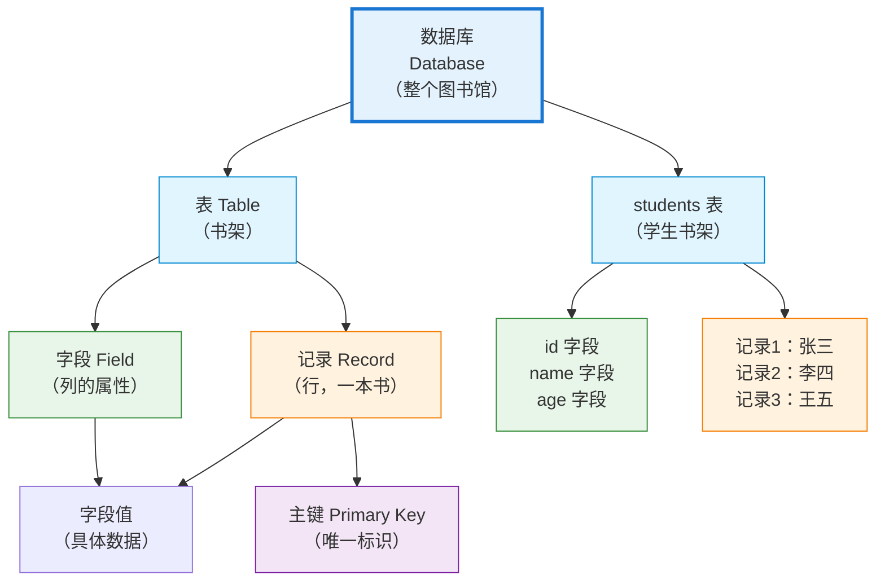

# S1A-SQL数据库基本概念-什么是数据库和表？为什么程序员都在用数据库存储数据？怎么理解记录和字段的关系？

## 📝 摘要

数据库（Database）是什么？表（Table）和记录（Record）有什么关系？零基础也能轻松理解！本文档用生活化比喻解析数据库核心概念，帮你快速理解数据存储的基本原理，为 SQL 学习打下坚实基础。

---

## 目录

- [1. 前置知识点](#1-前置知识点)
- [2. 什么是数据库？](#2-什么是数据库)
- [3. 什么是表（Table）？](#3-什么是表table)
- [4. 什么是记录（Record）和字段（Field）？](#4-什么是记录record和字段field)
- [5. 什么是主键（Primary Key）？](#5-什么是主键primary-key)
- [6. 数据库核心概念关系图](#6-数据库核心概念关系图)
- [7. 实际应用场景](#7-实际应用场景)
- [8. 常见问题与解答](#8-常见问题与解答)
- [9. 学习建议](#9-学习建议)
- [10. 总结与展望](#10-总结与展望)
- [11. 📚 参考资料与学习资源](#11-参考资料与学习资源)

---

## 1. 前置知识点

### 基础知识点（必须了解）

在学习数据库基本概念之前，你不需要任何编程基础。本指南专为零基础读者设计。

#### 🔰 **本指南将帮助你了解**

- 数据库（Database）是什么
- 表（Table）、记录（Record）、字段（Field）的概念和关系
- 主键（Primary Key）的作用
- 为什么需要使用数据库存储数据
- 数据库与 Excel 表格的区别

### 🎯 **学习建议**

- **零基础小白**：建议通读全文，重点理解每个概念的生活化比喻
- **有基础读者**：可以快速浏览，重点关注概念之间的关系

---

## 2. 什么是数据库？

### 2.1 数据库的基本定义

**数据库（Database（数据库））**是按照一定结构组织、存储和管理数据的集合。它提供了高效的数据存取和管理方式，确保数据的**完整性（Integrity（完整性））**和**安全性（Security（安全性））**。

**数据库的特点**：
- **结构化存储**：数据按照一定的结构组织存储
- **高效查询**：通过 SQL（Structured Query Language（结构化查询语言））快速查询数据
- **数据共享**：支持多用户同时访问和操作
- **数据安全**：提供权限控制和数据备份机制
- **数据一致性**：确保数据的准确性和完整性

### 2.2 生活化比喻

**生活化比喻**：数据库就像 **图书馆**。

想象一下图书馆：
- **数据库（Database）** = 整个图书馆（存放所有书籍的地方）
- **表（Table）** = 书架（存放某一类书籍）
- **记录（Record）** = 书架上的书（每本书是一个实体）
- **字段（Field）** = 书籍的属性（书名、作者、ISBN 等）

**另一个比喻**：
- **数据库** = 公司的档案室
- **表** = 不同的档案柜（人事档案柜、财务档案柜等）
- **记录** = 档案袋中的一份档案
- **字段** = 档案中的各个信息项（姓名、工号、部门等）

### 2.3 为什么需要使用数据库？

**问题场景**：为什么不用 Excel 表格或文本文件存储数据？

**使用数据库的优势**：

| 优势 | 说明 | 实际意义 |
|------|------|---------|
| **存储大量数据** | 可以存储百万、千万甚至亿级数据 | Excel 最多支持 100 万行，数据库无限制 |
| **快速查询** | 通过索引（Index）和 SQL 语句快速查询 | 从百万条数据中找到需要的数据只需几毫秒 |
| **数据一致性** | 保证数据的准确性和完整性 | 避免数据重复和错误 |
| **并发访问** | 多个用户同时访问和修改数据 | 支持多人同时操作，不会冲突 |
| **数据安全** | 权限控制和数据备份 | 防止数据丢失和被恶意修改 |
| **数据关系** | 通过主键和外键建立表间关系 | 实现复杂的数据关联查询 |

**对比示例**：

**使用 Excel 表格的问题**：
- ❌ 数据量大时打开文件很慢
- ❌ 多人同时编辑容易冲突
- ❌ 难以保证数据的一致性
- ❌ 查询复杂数据需要手动筛选

**使用数据库的优势**：
- ✅ 无论数据量多大，查询都很快
- ✅ 支持多人同时访问，有锁机制保证安全
- ✅ 自动保证数据一致性
- ✅ 通过 SQL 语句轻松查询复杂数据

### 2.4 数据库与 Excel 表格的对比

**对比说明**：下面的表格展示了数据库与 Excel 表格的区别，帮助你理解为什么需要使用数据库。

| 特性 | Excel 表格 | 数据库 |
|------|-----------|--------|
| **适用场景** | 个人数据管理、小型项目 | 应用程序、大型系统 |
| **数据量** | 最多 100 万行 | 无限制（可存储亿级数据） |
| **查询速度** | 数据量大时很慢 | 通过索引快速查询 |
| **多用户访问** | 多人编辑易冲突 | 支持并发访问，有锁机制 |
| **数据关系** | 难以建立表间关系 | 通过主键和外键建立关联 |
| **数据一致性** | 需要手动检查 | 自动保证数据一致性 |
| **数据安全** | 容易误删或损坏 | 权限控制和备份恢复 |
| **编程接口** | 需要通过编程访问 | 提供标准的 SQL 接口 |

**结论**：对于应用程序的数据存储，数据库是更合适的选择。

---

## 3. 什么是表（Table）？

### 3.1 表的基本定义

**表（Table（表））**是数据库中的基本存储结构，用于存储特定类型的数据。每个表由 **行（Row（行））** 和 **列（Column（列））** 组成，类似于 Excel 表格。

**表的特点**：
- 每个表都有一个唯一的表名
- 表由多行多列组成
- 每列有固定的数据类型和名称
- 每行代表一条完整的记录

### 3.2 生活化比喻

**生活化比喻**：表就像 Excel 工作表或学校的花名册。

想象一张 **学生花名册**：
- **表名**：`students`（学生表）
- **列（字段）**：学号、姓名、年龄、班级（每一列是一个属性）
- **行（记录）**：每一行代表一个学生的完整信息

### 3.3 表的结构组成

表的结构由以下部分组成：

| 组成部分 | 说明 | 示例 |
|---------|------|------|
| **表名（Table Name）** | 表的唯一标识 | `students`、`products` |
| **列（Column（列））/ 字段（Field（字段））** | 定义数据的属性 | `id`、`name`、`age` |
| **行（Row（行））/ 记录（Record（记录））** | 表中的一条数据 | 一行数据代表一个实体 |
| **数据类型（Data Type）** | 定义字段的数据类型 | `INT（整数）`、`VARCHAR（字符串）`、`DATE（日期）` |

### 3.4 表的设计原则

设计表时需要遵循以下原则：

1. **一个表存储一种类型的数据**：如学生表只存储学生信息，不要混合存储教师信息
2. **字段名要有意义**：使用清晰的字段名，如 `student_name` 比 `s1` 更好理解
3. **每个表要有主键（Primary Key）**：用于唯一标识每条记录
4. **避免数据冗余**：相同的数据不要重复存储

---


---

## 4. 什么是记录（Record）和字段（Field）？

### 4.1 记录（Record）的基本定义

**记录（Record（记录））**是表中的一行数据，表示一个具体的实体或实例。每条记录由多个 **字段（Field（字段））** 组成，每个字段包含该实体的一个属性值。

**记录的特点**：
- 每条记录代表一个完整的实体
- 记录由多个字段值组成
- 记录之间通过主键（Primary Key）区分

### 4.2 字段（Field）的基本定义

**字段（Field（字段））**是表中的一列，定义了数据的类型和属性。每个字段都有一个名称和数据类型，例如整数、字符串、日期等。

**字段的特点**：
- 字段定义了数据的类型（如整数、字符串）
- 字段名要清晰易懂
- 同一字段的所有记录数据类型必须一致

### 4.3 生活化比喻

**生活化比喻**：记录和字段的关系就像 **身份证**。

想象一下身份证：
- **记录（Record）** = 整张身份证（代表一个人）
- **字段（Field）** = 身份证上的各个信息项
  - 姓名字段：张三
  - 性别字段：男
  - 出生日期字段：1990-01-01
  - 身份证号字段：110101199001011234

**另一个比喻**：
- **表（Table）** = Excel 工作表
- **字段（Field）** = Excel 的列（如 A 列、B 列）
- **记录（Record）** = Excel 的行（如第 2 行、第 3 行）

### 4.4 记录与字段的关系

记录和字段的关系可以通过下表清晰地展示：

| 概念 | 定义 | 在 Excel 中的对应 | 示例 |
|------|------|------------------|------|
| **字段（Field）** | 表中的一列，定义数据的属性 | Excel 的列（A 列、B 列） | `id`、`name`、`age` |
| **记录（Record）** | 表中的一行，代表一个完整实体 | Excel 的行（第 2 行、第 3 行） | 一条学生信息 |
| **字段值** | 记录中某个字段的具体值 | Excel 单元格的值 | `id = 1`、`name = "张三"` |

### 4.5 实际示例分析

**学生表示例**：

假设有一个 `students` 表，结构如下：

| id（学号） | name（姓名） | age（年龄） | class（班级） |
|-----------|------------|------------|--------------|
| 1 | 张三 | 18 | 高三（1）班 |
| 2 | 李四 | 17 | 高二（2）班 |
| 3 | 王五 | 19 | 高三（1）班 |

**分析**：
- **表名**：`students`
- **字段（Field）**：`id`、`name`、`age`、`class`（共 4 个字段）
- **记录（Record）**：表格中的每一行（共 3 条记录）
- **字段值**：如第一条记录中，`id` 字段的值是 `1`，`name` 字段的值是 `"张三"`

**关系说明**：
- 一张表可以有多条记录（多个学生）
- 每条记录包含所有字段的值（每个学生的完整信息）
- 同一个字段在不同记录中的数据类型必须相同（如所有 `age` 字段都是整数）

---


---

## 5. 什么是主键（Primary Key）？

### 5.1 主键的基本定义

**主键（Primary Key（主键））**是表中用于唯一标识每条记录的字段或字段组合。主键的值必须唯一且不能为空（NULL），确保每条记录的唯一性。

**主键的特点**：
- **唯一性（Uniqueness）**：主键值在整个表中必须唯一
- **非空性（Not NULL）**：主键值不能为空
- **不可变性**：主键值一旦确定，通常不建议修改
- **唯一标识**：通过主键可以唯一确定一条记录

### 5.2 生活化比喻

**生活化比喻**：主键就像 **身份证号**。

想象一下：
- **学生表**中的每个学生都有一个唯一的学号（主键）
- 通过学号可以唯一确定一个学生
- 即使有两个学生同名同姓，但学号不同，也能区分他们

**另一个比喻**：
- **主键** = 图书馆中每本书的 **唯一编号**
- 即使书名相同，编号也不同
- 通过编号可以精确找到对应的书

### 5.3 主键的作用和重要性

主键在数据库中的作用非常重要：

| 作用 | 说明 | 实际意义 |
|------|------|---------|
| **唯一标识记录** | 每条记录都有唯一的主键值 | 确保数据不重复 |
| **建立表间关系** | 通过主键和外键建立表之间的关联 | 实现多表关联查询 |
| **提高查询效率** | 主键自动创建索引（Index） | 加快查询速度 |
| **保证数据完整性** | 防止重复数据和空值 | 确保数据质量 |

**对比示例**：

**没有主键的问题**：

| 姓名 | 年龄 | 班级 |
|------|------|------|
| 张三 | 18 | 高三（1）班 |
| 李四 | 17 | 高二（2）班 |
| 张三 | 18 | 高三（1）班 | ← 无法区分这两个"张三" |

**有主键的优势**：

| id（主键） | 姓名 | 年龄 | 班级 |
|-----------|------|------|------|
| 1 | 张三 | 18 | 高三（1）班 |
| 2 | 李四 | 17 | 高二（2）班 |
| 3 | 张三 | 18 | 高三（1）班 | ← 通过 id 可以区分

### 5.4 主键的选择原则

选择主键时需要遵循以下原则：

1. **唯一性**：主键值必须唯一，不能重复
2. **简洁性**：主键值应该简洁，不宜过长
3. **稳定性**：主键值不应该频繁变动
4. **不可为空**：主键值不能为 NULL
5. **常用选择**：自增整数（AUTO_INCREMENT）、UUID（Universally Unique Identifier（通用唯一标识符））等

**常见主键类型**：

| 主键类型 | 说明 | 适用场景 | 示例 |
|---------|------|---------|------|
| **自增整数** | 数据库自动生成的连续数字 | 大多数表 | `id = 1, 2, 3...` |
| **业务主键** | 业务中的唯一标识 | 有业务意义的字段 | `学号 = 2025001` |
| **UUID** | 全局唯一标识符 | 分布式系统 | `uuid = "a1b2c3d4..."` |

---


---

## 6. 数据库核心概念关系图

### 6.1 概念关系流程图

**概念关系说明**：下面的流程图展示了数据库、表、记录、字段之间的关系，帮助你理解它们是如何组织在一起的。



### 6.2 概念对比表格

**核心概念总结对比**：

| 概念 | 英文术语 | 生活化比喻 | 作用 | 示例 |
|------|---------|-----------|------|------|
| **数据库（Database）** | Database | 整个图书馆 | 存储和管理数据的集合 | `school_db`（学校数据库） |
| **表（Table）** | Table | 书架 | 存储特定类型的数据 | `students`（学生表） |
| **字段（Field）** | Field / Column | 书籍的属性 | 定义数据的属性 | `id`、`name`、`age` |
| **记录（Record）** | Record / Row | 书架上的书 | 表示一个完整的实体 | 一条学生信息 |
| **主键（Primary Key）** | Primary Key | 书籍的唯一编号 | 唯一标识每条记录 | `id = 1` |

**概念层级关系**：

```
数据库（Database）
  └── 表（Table）1：students
      ├── 字段（Field）：id, name, age, class
      └── 记录（Record）：
          ├── 记录1：id=1, name="张三", age=18, class="高三（1）班"
          ├── 记录2：id=2, name="李四", age=17, class="高二（2）班"
          └── 记录3：id=3, name="王五", age=19, class="高三（1）班"
  └── 表（Table）2：teachers
      └── ...
```

---

## 7. 实际应用场景

### 7.1 学生管理系统示例

**场景描述**：设计一个学生管理系统，需要存储学生信息。

**数据库设计**：

```
数据库：school_db
  └── 表：students（学生表）
      ├── 字段：
      │   ├── id（INT，主键）← 学号，唯一标识
      │   ├── name（VARCHAR）← 姓名
      │   ├── age（INT）← 年龄
      │   └── class（VARCHAR）← 班级
      └── 记录示例：
          ├── id=1, name="张三", age=18, class="高三（1）班"
          ├── id=2, name="李四", age=17, class="高二（2）班"
          └── id=3, name="王五", age=19, class="高三（1）班"
```

**说明**：
- **数据库** `school_db` 是存储所有数据的容器
- **表** `students` 专门存储学生信息
- **字段** `id`、`name`、`age`、`class` 定义了学生信息的属性
- **记录** 每一行代表一个学生的完整信息
- **主键** `id` 确保每个学生都有唯一标识

### 7.2 电商系统示例

**场景描述**：设计一个电商系统，需要存储商品信息和订单信息。

**数据库设计**：

```
数据库：ecommerce_db
  ├── 表：products（商品表）
  │   ├── 字段：
  │   │   ├── product_id（INT，主键）← 商品编号
  │   │   ├── product_name（VARCHAR）← 商品名称
  │   │   ├── price（DECIMAL）← 价格
  │   │   └── stock（INT）← 库存
  │   └── 记录：每个商品一条记录
  │
  └── 表：orders（订单表）
      ├── 字段：
      │   ├── order_id（INT，主键）← 订单编号
      │   ├── product_id（INT，外键）← 关联商品表
      │   ├── quantity（INT）← 购买数量
      │   └── order_date（DATE）← 订单日期
      └── 记录：每个订单一条记录
```

**说明**：
- **数据库** `ecommerce_db` 存储所有电商相关数据
- **表** `products` 存储商品信息，`orders` 存储订单信息
- **字段** 定义了商品和订单的属性
- **主键** `product_id` 和 `order_id` 唯一标识每个商品和订单
- **外键** `orders.product_id` 关联到 `products.product_id`，建立表间关系

---


---

## 8. 常见问题与解答

### 8.1 数据库和文件存储有什么区别？

**问题**：为什么不用 Excel 或文本文件存储数据，而要用数据库？

**对比说明**：

| 特性 | 文件存储（Excel/文本文件） | 数据库 |
|------|-------------------------|--------|
| **数据量** | 适合小量数据（几万行以内） | 适合大量数据（百万、千万行） |
| **查询效率** | 需要打开文件，逐行查找 | SQL 查询，索引加速 |
| **多用户访问** | 多人同时编辑易冲突 | 支持并发访问，有锁机制 |
| **数据一致性** | 难以保证 | 自动保证数据一致性 |
| **数据关系** | 难以建立表间关系 | 通过外键建立关联 |
| **数据安全** | 容易被误删或损坏 | 权限控制、备份恢复 |

**结论**：对于应用程序的数据存储，数据库是更合适的选择。

### 8.2 一个数据库可以有多少张表？

**答案**：理论上一个数据库可以包含无数张表，但实际使用中：

- **小型项目**：通常 5-20 张表
- **中型项目**：通常 20-100 张表
- **大型项目**：可能 100 张表以上

**设计原则**：
- 每张表存储一种类型的数据
- 表名要有意义，便于理解
- 避免创建过多不必要的表

### 8.3 一条记录必须包含所有字段吗？

**答案**：不一定，取决于字段的定义。

**字段类型**：
- **必填字段（NOT NULL）**：必须提供值，不能为空
- **可选字段（NULL 允许）**：可以为空，不强制要求

**示例**：

```sql
-- 学生表示例
students 表：
  id（主键，必填）← 必须有值
  name（必填）← 必须有值
  age（可选）← 可以为空
  email（可选）← 可以为空
```

**说明**：
- 主键字段必须包含值（不能为空）
- 必填字段（NOT NULL）必须包含值
- 可选字段（NULL 允许）可以不包含值

---


---

## 9. 学习建议

### 9.1 学习顺序建议

1. **理解概念**：先理解数据库、表、记录、字段的概念和关系
2. **掌握比喻**：通过生活化比喻加深理解（图书馆、身份证、Excel 表格）
3. **实际观察**：查看现有的数据库表结构，观察字段和记录
4. **逐步深入**：理解基本概念后，继续学习 SQL 查询语句（参考 S1C 文档）

### 9.2 实践建议

**理解概念**（Won't（了解即可））：
- ✅ 理解数据库、表、记录、字段的概念
- ✅ 掌握主键的作用和重要性
- ✅ 理解数据库与 Excel 表格的区别

**观察实践**（Could（可选实践））：
- ⭐ 打开 MySQL Workbench 或其他数据库工具，查看示例数据库的结构
- ⭐ 尝试设计一个简单的表结构（如学生表、商品表）

**深入学习**（Should（建议实践））：
- 💡 完成本阶段学习后，继续学习 SQL 查询语句（S1C 文档）
- 💡 学习如何创建表和插入数据（参考后续文档）

---


---

## 10. 总结与展望

### 10.1 核心要点回顾

通过本指南的学习，你已经掌握了数据库的基本概念：

1. **数据库（Database）**：存储和管理数据的集合，就像整个图书馆
2. **表（Table）**：数据库中的基本存储结构，就像书架，存储特定类型的数据
3. **字段（Field）**：表中的列，定义数据的属性，就像身份证上的信息项
4. **记录（Record）**：表中的行，代表一个完整的实体，就像一本书或一张身份证
5. **主键（Primary Key）**：唯一标识每条记录的字段，就像身份证号或书籍编号

**核心关系**：
- 一个数据库可以包含多张表
- 一张表包含多个字段和多条记录
- 每条记录由多个字段值组成
- 主键确保每条记录的唯一性

### 10.2 下一步学习方向

完成本阶段的学习后，建议按照以下顺序继续学习：

1. **学习基本数据类型**（S1B，待创建）：了解整数、字符串、日期等数据类型
2. **学习 SELECT 查询语句**（S1C）：掌握如何查询数据
3. **学习 WHERE 条件筛选**（S1D，待创建）：学会筛选需要的数据
4. **学习数据操作**（S2A 等）：掌握插入、更新、删除数据

**学习建议**：
- ✅ **循序渐进**：按照学习路线图顺序学习，不要跳跃
- ✅ **多实践**：理解概念后，尝试观察和设计数据库表结构
- ✅ **多思考**：用生活化比喻加深理解，将抽象概念具体化

### 10.3 鼓励与展望

数据库是现代应用程序的基础，掌握数据库基本概念是学习 SQL 的第一步。通过本指南的学习，你已经理解了数据库的核心概念，这为后续的 SQL 学习打下了坚实的基础。

**记住**：
- 数据库就像图书馆，组织有序、便于查找
- 表就像书架，分类清晰、结构明确
- 记录和字段就像书籍和属性，相互关联、共同组成完整信息

继续加油，你已经迈出了 SQL 学习的重要一步！接下来，你将学习如何使用 SQL 语句操作这些数据，开启真正的数据库之旅！

**继续加油，你离掌握 SQL 又近了一步！** 🚀

---


---

## 11. 📚 参考资料与学习资源

### 11.1 官方文档

**数据库官方文档**：
- [MySQL 官方文档](https://dev.mysql.com/doc/) - MySQL 数据库官方文档
- [PostgreSQL 官方文档](https://www.postgresql.org/docs/) - PostgreSQL 数据库官方文档
- [SQL Server 官方文档](https://docs.microsoft.com/sql/) - Microsoft SQL Server 官方文档

### 11.2 在线教程

**中文教程**：
- [SQL 教程 - 菜鸟教程](https://www.runoob.com/sql/sql-tutorial.html) - 零基础 SQL 入门教程
- [SQL 入门教程 - 廖雪峰](https://www.liaoxuefeng.com/wiki/1177760294764384) - 通俗易懂的 SQL 教程
- [W3Schools SQL 教程](https://www.w3schools.com/sql/) - 全面的 SQL 教程（英文）

**英文教程**：
- [SQL Tutorial - W3Schools](https://www.w3schools.com/sql/) - 全面的 SQL 教程
- [SQLBolt](https://sqlbolt.com/) - 交互式 SQL 学习平台

### 11.3 推荐书籍

**入门书籍**：
- 《SQL 必知必会》- Ben Forta 著（适合零基础，通俗易懂）
- 《SQL 基础教程》- 佐藤宣明 著（日本经典 SQL 入门书籍）

**进阶书籍**：
- 《高性能 MySQL》- Baron Schwartz 著（MySQL 性能优化）
- 《MySQL 技术内幕：SQL 编程》- 姜承尧 著（深入理解 MySQL）

---

**厦门工学院人工智能创作坊 -- 郑恩赐**  
**2025 年 11 月 03 日**

