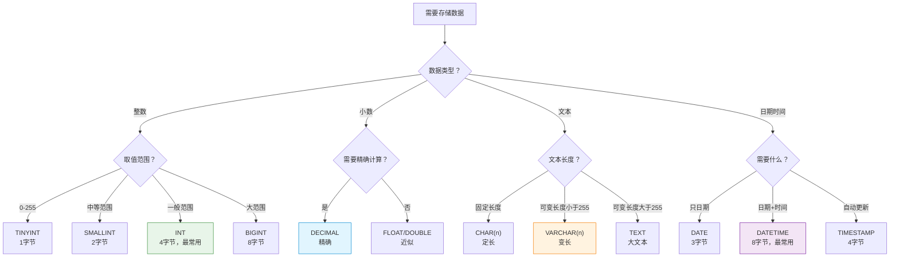

# S1B-SQL基本数据类型-什么是数据类型？为什么需要选择合适的数据类型？怎么快速掌握整数字符串日期类型？

## 📝 摘要

数据类型选择错误导致存储浪费、性能下降？本文档用生活化比喻解析 SQL 整数、字符串、日期等基本数据类型，帮你掌握数据类型选择原则，提升数据库设计和查询性能。

---

## 目录

- [1. 前置知识点](#1-前置知识点)
- [2. 问题描述](#2-问题描述)
- [3. 问题考察点](#3-问题考察点)
- [4. 快速上手（3 分钟）](#4-快速上手3-分钟)
- [5. 什么是数据类型（Data Type）？](#5-什么是数据类型data-type)
- [6. 为什么需要数据类型？](#6-为什么需要数据类型)
- [7. 整数类型（Integer Types）：存储整数值](#7-整数类型integer-types存储整数值)
  - [7.1 整数类型的基本概念](#71-整数类型的基本概念)
  - [7.2 整数类型对比表格](#72-整数类型对比表格)
  - [7.3 整数类型的选择建议](#73-整数类型的选择建议)
  - [7.4 实际应用示例](#74-实际应用示例)
- [8. 浮点数和定点数类型：存储小数值](#8-浮点数和定点数类型存储小数值)
  - [8.1 浮点数类型（FLOAT、DOUBLE）](#81-浮点数类型floatdouble)
  - [8.2 定点数类型（DECIMAL、NUMERIC）](#82-定点数类型decimalnumeric)
  - [8.3 浮点数 vs 定点数对比](#83-浮点数-vs-定点数对比)
  - [8.4 实际应用示例](#84-实际应用示例)
- [9. 字符串类型（String Types）：存储文本数据](#9-字符串类型string-types存储文本数据)
  - [9.1 字符串类型的基本概念](#91-字符串类型的基本概念)
  - [9.2 CHAR vs VARCHAR 对比](#92-char-vs-varchar-对比)
  - [9.3 TEXT 类型：存储大文本](#93-text-类型存储大文本)
  - [9.4 字符串类型选择建议](#94-字符串类型选择建议)
  - [9.5 实际应用示例](#95-实际应用示例)
- [10. 日期和时间类型（Date and Time Types）：存储时间数据](#10-日期和时间类型date-and-time-types存储时间数据)
  - [10.1 日期和时间类型的基本概念](#101-日期和时间类型的基本概念)
  - [10.2 日期和时间类型对比表格](#102-日期和时间类型对比表格)
  - [10.3 DATE vs DATETIME vs TIMESTAMP 对比](#103-date-vs-datetime-vs-timestamp-对比)
  - [10.4 实际应用示例](#104-实际应用示例)
- [11. 数据类型选择流程图](#11-数据类型选择流程图)
- [12. 对比示例：数据类型选择错误的问题](#12-对比示例数据类型选择错误的问题)
- [13. 常见错误与修正](#13-常见错误与修正)
- [14. 总结与展望](#14-总结与展望)
- [15. 📚 参考资料与学习资源](#15-参考资料与学习资源)

---

## 1. 前置知识点

### 基础知识点（必须掌握）

在学习 SQL 数据类型之前，你需要掌握以下知识点：

- **数据库基本概念**：了解数据库、表、字段、记录的基本概念（参考 S1A 文档）
- **数据结构基础**：理解什么是数据，数据的基本形式

### 🎯 **学习建议**

- **零基础小白**：建议先学习数据库基本概念（S1A），再学习数据类型
- **有基础读者**：可以直接学习数据类型的选择原则和最佳实践

---

## 2. 问题描述

### 实际场景

**面试官**：创建表时，如何选择合适的字段数据类型？如果选择错误会有什么问题？

**实际开发场景**：
- 创建学生表时，年龄字段应该用 `INT` 还是 `TINYINT`？
- 存储金额时，应该用 `FLOAT` 还是 `DECIMAL`？
- 姓名字段应该用 `CHAR` 还是 `VARCHAR`？

**常见问题**：
- 数据类型选择不当，导致存储空间浪费
- 使用 `FLOAT` 存储金额，计算时出现精度误差
- 所有字符串都用 `VARCHAR(255)`，浪费存储空间
- 日期用字符串存储，无法进行日期运算

---

## 3. 问题考察点

学习 SQL 数据类型选择时，需要考察以下能力：

- **数据类型选择意识**：能否识别数据类型选择的重要性？是否理解不同数据类型的特点？
- **存储空间优化**：是否理解不同数据类型占用空间不同？能否根据实际需求选择最小合适的类型？
- **性能影响认知**：是否理解数据类型对查询性能的影响？整数类型比字符串类型查询更快？
- **精确计算理解**：是否理解浮点数精度误差？金额、价格应该使用 `DECIMAL` 而不是 `FLOAT`？
- **实际应用能力**：能否在实际项目中合理选择数据类型？是否考虑数据范围和业务需求？
- **代码注释习惯**：是否理解代码注释的重要性？能否清晰解释每个字段的数据类型选择？

---

## 4. 快速上手（3 分钟）

<p align="right"><span style="background:#e53935;color:#fff;padding:2px 6px;border-radius:4px">🔥 Must（必做实践）</span></p>

### 4.1 数据类型快速概览

**数据类型（Data Type（数据类型））**决定了字段可以存储什么类型的数据，就像**身份证上的信息类型**（姓名是文字，年龄是数字，出生日期是日期）。

**常见数据类型分类**：

| 类型分类 | 主要类型 | 用途示例 |
|---------|---------|---------|
| **整数类型** | INT、BIGINT | 存储年龄、数量、ID |
| **浮点数类型** | FLOAT、DOUBLE | 存储价格、评分 |
| **定点数类型** | DECIMAL | 存储金额（精确计算） |
| **字符串类型** | VARCHAR、CHAR | 存储姓名、地址、描述 |
| **日期时间类型** | DATE、DATETIME | 存储日期、时间 |

### 4.2 创建表时指定数据类型

**原理**：创建表时需要为每个字段指定数据类型，数据类型决定了字段可以存储什么类型的数据、占用多少存储空间、可以进行哪些运算。

```sql
-- 创建学生表示例
-- 下面逐行解释每个字段的数据类型选择原因
CREATE TABLE students (
    -- 整数类型：学号，主键确保唯一性
    -- INT 占用 4 字节，可以存储 -21 亿到 21 亿的整数（有符号），足够存储学号
    -- PRIMARY KEY 表示这是主键，不能为空且必须唯一
    id INT PRIMARY KEY,
    
    -- 字符串类型：姓名，最多 50 个字符
    -- VARCHAR(50) 表示可变长度字符串，最多 50 字符，实际存储只占用实际字符数 + 1 字节（长度信息）
    -- NOT NULL 表示该字段不能为空，必须提供姓名
    name VARCHAR(50) NOT NULL,
    
    -- 整数类型：年龄，范围 0-255
    -- TINYINT 占用 1 字节，可以存储 0-255 的整数（无符号），年龄范围完全够用
    -- 相比 INT 节省 3 字节，如果存储 100 万条记录，可以节省约 3 MB 空间
    age TINYINT,
    
    -- 定点数类型：分数，精确到小数点后 2 位
    -- DECIMAL(5, 2) 表示总共 5 位数字，小数点后 2 位，可以存储 0.00 到 999.99
    -- 使用 DECIMAL 而不是 FLOAT，避免精度误差（如 0.1 + 0.2 = 0.30000000000000004）
    score DECIMAL(5, 2),
    
    -- 日期类型：生日，只存储日期不包含时间
    -- DATE 占用 3 字节，格式为 YYYY-MM-DD，可以存储 1000-01-01 到 9999-12-31
    -- 相比 VARCHAR 存储日期（如 "2025-01-01" 占用 10 字节），节省 7 字节
    birthday DATE,
    
    -- 日期时间类型：创建时间，包含日期和时间
    -- DATETIME 占用 8 字节，格式为 YYYY-MM-DD HH:MM:SS
    -- 支持日期时间运算，如 DATE_ADD、DATE_SUB 等函数
    created_at DATETIME
);
```

**关键要点**：选择合适的数据类型可以节省存储空间、提高查询性能，确保数据准确性。每行代码的选择都有其原因，需要根据实际业务需求选择。

---

## 5. 什么是数据类型（Data Type）？

### 5.1 数据类型的基本定义

**数据类型（Data Type（数据类型））**是数据库中对字段存储数据类型的定义，它决定了：
- 字段可以存储什么类型的数据（整数、字符串、日期等）
- 字段占用的存储空间大小
- 字段可以进行的运算操作

**数据类型的特点**：
- **类型约束**：限制字段只能存储特定类型的数据
- **存储优化**：不同数据类型占用不同的存储空间
- **性能影响**：合适的数据类型可以提高查询和索引性能

### 5.2 生活化比喻

**生活化比喻**：数据类型就像**仓库的货架标签**。

想象一下仓库：
- **INT 货架**：只能放整数（如 1、2、100）
- **VARCHAR 货架**：只能放文字（如 "张三"、"北京"）
- **DATE 货架**：只能放日期（如 "2025-01-01"）

如果往 INT 货架放文字，就会出错！同样，数据库中的字段也只能存储对应类型的数据。

**另一个比喻**：
- **数据类型** = 身份证上的信息类型
  - 姓名字段：必须是文字（VARCHAR）
  - 年龄字段：必须是数字（INT）
  - 出生日期字段：必须是日期（DATE）

---

## 6. 为什么需要数据类型？

**原理**：数据类型定义了字段可以存储什么类型的数据，选择合适的类型可以节省存储空间、提高查询性能、确保数据准确性。

### 6.1 数据类型的重要性

**不使用数据类型（或使用错误数据类型）的问题**：

```sql
-- ❌ 问题：没有数据类型约束，所有数据都存储为字符串
CREATE TABLE bad_design (
    id TEXT,           -- ❌ 学号用 TEXT 存储，浪费空间
    age TEXT,          -- ❌ 年龄用 TEXT 存储，无法进行数学运算
    score TEXT,        -- ❌ 分数用 TEXT 存储，无法精确计算
    birthday TEXT      -- ❌ 日期用 TEXT 存储，无法进行日期运算
);

-- ❌ 问题：存储空间浪费
-- 学号 1 存储为 "1"（占用 1 字节 + 1 字节长度信息 = 2 字节）
-- 如果用 INT，只需要 4 字节，但可以存储 42 亿个不同的值

-- ❌ 问题：无法进行数学运算
SELECT age + 1 FROM bad_design;  -- ❌ 错误：无法对字符串进行加法运算

-- ❌ 问题：数据验证困难
INSERT INTO bad_design (age) VALUES ('abc');  -- ❌ 可以插入无效数据
```

**使用正确数据类型的优势**：

```sql
-- ✅ 解决方案：使用合适的数据类型
CREATE TABLE good_design (
    id INT PRIMARY KEY,          -- ✅ 整数类型：节省空间，可以自增
    age TINYINT,                 -- ✅ 整数类型：占用 1 字节，可以运算
    score DECIMAL(5, 2),         -- ✅ 定点数类型：精确计算，适合分数
    birthday DATE                -- ✅ 日期类型：可以日期运算，节省空间
);

-- ✅ 优势：可以数学运算
SELECT age + 1 FROM good_design;  -- ✅ 正确：可以直接进行数学运算

-- ✅ 优势：数据验证
INSERT INTO good_design (age) VALUES ('abc');  -- ✅ 错误：自动拒绝无效数据
```

**优势总结**：

| 优势 | 说明 | 实际收益 |
|------|------|---------|
| **存储优化** | 选择合适类型节省存储空间 | 百万条数据可节省数 GB 空间 |
| **性能提升** | 整数类型比字符串类型查询更快 | 查询速度可提升 10-100 倍 |
| **数据准确性** | 类型约束防止无效数据 | 避免数据错误，提高数据质量 |
| **运算支持** | 支持数学运算、日期运算 | 可以直接进行加减乘除、日期计算 |

---

## 7. 整数类型（Integer Types）：存储整数值

**原理**：整数类型用于存储不带小数部分的数值，根据数据取值范围选择最小合适的类型，可以节省存储空间并提高查询性能。

### 7.1 整数类型的基本概念 [📖官方文档](https://dev.mysql.com/doc/refman/8.0/en/integer-types.html) [📚教程](https://www.w3schools.com/sql/sql_datatypes.asp) [💡示例](https://www.tutorialspoint.com/sql/sql-data-types.htm)

**整数类型（Integer Types（整数类型））**用于存储不带小数部分的数值，如年龄、数量、ID 等。

**整数类型的特点**：
- **无小数部分**：只能存储整数（如 1、100、-50）
- **存储空间固定**：每种类型占用固定的字节数
- **运算高效**：整数运算比浮点数运算更快
- **范围限制**：每种类型都有取值范围限制

### 7.2 整数类型对比表格

<p align="right"><span style="background:#e53935;color:#fff;padding:2px 6px;border-radius:4px">🔥 Must（必做实践）</span></p>

**MySQL 整数类型对比**：

| 类型 | 占用空间 | 有符号范围 | 无符号范围 | 适用场景 |
|------|---------|-----------|-----------|---------|
| **TINYINT** [📖](https://dev.mysql.com/doc/refman/8.0/en/integer-types.html) | 1 字节 | -128 到 127 | 0 到 255 | 状态码、年龄（0-255） |
| **SMALLINT** [📖](https://dev.mysql.com/doc/refman/8.0/en/integer-types.html) | 2 字节 | -32,768 到 32,767 | 0 到 65,535 | 年份、端口号 |
| **MEDIUMINT** [📖](https://dev.mysql.com/doc/refman/8.0/en/integer-types.html) | 3 字节 | -8,388,608 到 8,388,607 | 0 到 16,777,215 | 中等范围计数 |
| **INT / INTEGER** [📖](https://dev.mysql.com/doc/refman/8.0/en/integer-types.html) | 4 字节 | -2,147,483,648 到 2,147,483,647 | 0 到 4,294,967,295 | **最常用**：ID、数量、价格（分） |
| **BIGINT** [📖](https://dev.mysql.com/doc/refman/8.0/en/integer-types.html) | 8 字节 | -9,223,372,036,854,775,808 到 9,223,372,036,854,775,807 | 0 到 18,446,744,073,709,551,615 | 大数值、时间戳 |

**关键要点**：
- **INT** 是最常用的整数类型，适用于大多数场景
- 根据实际取值范围选择最小合适的类型，节省存储空间
- 无符号类型（UNSIGNED）可以扩大正数范围

### 7.3 整数类型的选择建议

**选择原则**：

1. **根据数据范围选择**：
   - 年龄（0-150）：使用 `TINYINT UNSIGNED`（1 字节）
   - ID、数量：使用 `INT`（4 字节，最常用）
   - 大数值：使用 `BIGINT`（8 字节）

2. **考虑是否需要负数**：
   - 需要负数：使用有符号类型（默认）
   - 不需要负数：使用 `UNSIGNED` 扩大范围

3. **性能考虑**：
   - 较小的类型查询和索引更快
   - 但不要过度优化，`INT` 通常是最佳选择

### 7.4 实际应用示例

<p align="right"><span style="background:#fb8c00;color:#fff;padding:2px 6px;border-radius:4px">💡 Should（建议实践）</span></p>

```sql
-- 示例：创建学生表，使用合适的整数类型
-- 下面详细解释每个字段的整数类型选择原因
CREATE TABLE students (
    -- INT：学号，主键自增
    -- 使用 INT 而不是 BIGINT，因为学号通常不会超过 21 亿
    -- AUTO_INCREMENT 表示自动递增，每次插入新记录时自动加 1
    -- PRIMARY KEY 表示主键，确保唯一性
    id INT PRIMARY KEY AUTO_INCREMENT,
    
    -- TINYINT UNSIGNED：年龄，范围 0-255
    -- 使用 TINYINT 而不是 INT，因为年龄范围是 0-150，TINYINT 的 0-255 范围完全够用
    -- UNSIGNED 表示无符号，年龄不可能是负数，这样可以扩大正数范围
    -- 相比 INT 节省 3 字节，如果存储 100 万条记录，可以节省约 3 MB 空间
    age TINYINT UNSIGNED,
    
    -- INT：分数，范围 0-100
    -- 使用 INT 而不是 TINYINT，虽然分数范围是 0-100，但考虑到未来可能扩展（如 150 分制）
    -- 使用 INT 更灵活，也是最常见的整数类型选择
    score INT,
    
    -- SMALLINT UNSIGNED：班级 ID，范围 0-65535
    -- 使用 SMALLINT 而不是 INT，因为班级数量通常不会超过 65535 个
    -- UNSIGNED 表示无符号，班级 ID 不可能是负数
    -- 相比 INT 节省 2 字节
    class_id SMALLINT UNSIGNED,
    
    -- BIGINT：总学生数，可能很大
    -- 使用 BIGINT 而不是 INT，因为总学生数可能超过 21 亿（虽然现实中不太可能）
    -- 但考虑到数据统计、汇总等场景，使用 BIGINT 更安全
    total_students BIGINT
);

-- 插入数据：演示如何插入数据
INSERT INTO students (age, score, class_id, total_students) 
VALUES (18, 95, 101, 1000000);
-- 说明：插入一条记录，age=18（TINYINT），score=95（INT），class_id=101（SMALLINT），total_students=1000000（BIGINT）

-- 查询和运算：演示整数类型的运算能力
-- 年龄加 1：直接进行数学运算，返回每个学生的年龄加 1
SELECT age + 1 AS next_age FROM students;
-- 说明：age 是整数类型，可以直接进行数学运算，返回 19（18 + 1）

-- 条件查询：演示整数类型的比较运算
SELECT * FROM students WHERE age > 18;
-- 说明：age 是整数类型，可以直接进行比较运算，查询年龄大于 18 的学生
```

---

## 8. 浮点数和定点数类型：存储小数值

**原理**：浮点数和定点数类型用于存储带小数部分的数值，浮点数类型（FLOAT、DOUBLE）可能存在精度误差，定点数类型（DECIMAL）可以精确存储，适合金额、价格等需要精确计算的场景。

### 8.1 浮点数类型（FLOAT、DOUBLE） [📖官方文档](https://dev.mysql.com/doc/refman/8.0/en/floating-point-types.html) [📚教程](https://www.w3schools.com/sql/sql_datatypes.asp)

**浮点数类型（Floating-Point Types（浮点数类型））**用于存储带小数部分的数值，但可能存在精度误差。

**浮点数类型对比**：

| 类型 | 占用空间 | 精度 | 范围 | 适用场景 |
|------|---------|------|------|---------|
| **FLOAT** [📖](https://dev.mysql.com/doc/refman/8.0/en/floating-point-types.html) | 4 字节 | 约 7 位十进制 | ±3.402823466E+38 | 科学计算、一般精度要求 |
| **DOUBLE** [📖](https://dev.mysql.com/doc/refman/8.0/en/floating-point-types.html) | 8 字节 | 约 15 位十进制 | ±1.7976931348623157E+308 | 高精度科学计算 |

**⚠️ 注意事项**：浮点数存在精度误差，不适合存储金额等需要精确计算的数据。

### 8.2 定点数类型（DECIMAL、NUMERIC） [📖官方文档](https://dev.mysql.com/doc/refman/8.0/en/fixed-point-types.html) [📚教程](https://www.w3schools.com/sql/sql_datatypes.asp)

**定点数类型（Fixed-Point Types（定点数类型））**用于存储精确的小数值，适用于财务计算等对精度要求高的场景。

**DECIMAL 语法**：
```sql
DECIMAL(M, D)
-- M：总位数（精度），范围 1-65
-- D：小数位数（标度），范围 0-30
```

**示例**：
- `DECIMAL(5, 2)`：总共 5 位，小数点后 2 位（如 999.99）
- `DECIMAL(10, 0)`：总共 10 位，无小数（如 9999999999）

**DECIMAL 特点**：
- **精确存储**：不丢失精度，适合金额计算
- **存储空间**：根据精度动态分配，通常比浮点数占用更多空间
- **运算精确**：加减乘除运算结果精确

### 8.3 浮点数 vs 定点数对比

<p align="right"><span style="background:#e53935;color:#fff;padding:2px 6px;border-radius:4px">🔥 Must（必做实践）</span></p>

**对比示例**：

```sql
-- ❌ 问题：使用 FLOAT 存储金额，存在精度误差
CREATE TABLE bad_account (
    id INT,
    balance FLOAT      -- ❌ 浮点数：精度误差
);

INSERT INTO bad_account VALUES (1, 0.1);
INSERT INTO bad_account VALUES (2, 0.2);

SELECT SUM(balance) FROM bad_account;
-- 结果可能是：0.30000000000000004 ❌ 精度误差！

-- ✅ 解决方案：使用 DECIMAL 存储金额，精确计算
CREATE TABLE good_account (
    id INT,
    balance DECIMAL(10, 2)  -- ✅ 定点数：精确到小数点后 2 位
);

INSERT INTO good_account VALUES (1, 0.1);
INSERT INTO good_account VALUES (2, 0.2);

SELECT SUM(balance) FROM good_account;
-- 结果：0.30 ✅ 精确！
```

**选择建议**：

| 场景 | 推荐类型 | 理由 |
|------|---------|------|
| **金额、价格** | DECIMAL | 需要精确计算，不能有误差 |
| **评分、百分比** | DECIMAL 或 FLOAT | 根据精度要求选择 |
| **科学计算** | FLOAT 或 DOUBLE | 精度要求不高，性能优先 |
| **一般小数** | DECIMAL | 优先选择，避免精度问题 |

### 8.4 实际应用示例

<p align="right"><span style="background:#fb8c00;color:#fff;padding:2px 6px;border-radius:4px">💡 Should（建议实践）</span></p>

```sql
-- 示例：商品表，使用合适的小数类型
CREATE TABLE products (
    id INT PRIMARY KEY,
    name VARCHAR(100),
    price DECIMAL(10, 2),          -- ✅ DECIMAL：价格（精确到分）
    rating FLOAT,                   -- ✅ FLOAT：评分（0.0-5.0，精度要求不高）
    discount DECIMAL(5, 2)          -- ✅ DECIMAL：折扣（0.00-100.00，精确）
);

-- 插入数据
INSERT INTO products (name, price, rating, discount) 
VALUES ('商品A', 99.99, 4.5, 10.00);

-- 精确计算
SELECT price * (1 - discount / 100) AS final_price FROM products;
-- ✅ 结果精确，不会有误差
```

---

## 9. 字符串类型（String Types）：存储文本数据

**原理**：字符串类型用于存储文本数据，根据字符串长度是否固定选择 CHAR（定长）或 VARCHAR（变长），根据文本长度选择 VARCHAR 或 TEXT。

### 9.1 字符串类型的基本概念 [📖官方文档](https://dev.mysql.com/doc/refman/8.0/en/string-types.html) [📚教程](https://www.w3schools.com/sql/sql_datatypes.asp) [💡示例](https://www.tutorialspoint.com/sql/sql-data-types.htm)

**字符串类型（String Types（字符串类型））**用于存储文本数据，如姓名、地址、描述等。

**字符串类型分类**：
- **定长字符串**：CHAR（固定长度）
- **变长字符串**：VARCHAR（可变长度）
- **大文本类型**：TEXT（存储大段文本）

### 9.2 CHAR vs VARCHAR 对比

<p align="right"><span style="background:#e53935;color:#fff;padding:2px 6px;border-radius:4px">🔥 Must（必做实践）</span></p>

**CHAR 和 VARCHAR 对比**：

| 特性 | CHAR(n) | VARCHAR(n) |
|------|---------|-----------|
| **存储方式** | 固定长度，不足用空格填充 | 可变长度，只存储实际字符 |
| **存储空间** | 固定 n 字节 | 实际字符数 + 1-2 字节（长度信息） |
| **适用场景** | 长度固定的字符串（如身份证号、邮政编码） | 长度可变的字符串（如姓名、地址） |
| **性能** | 查询稍快（长度固定） | 查询稍慢（需要读取长度信息） |
| **最大长度** | 255 字符 | 65,535 字符（MySQL 5.0.3+） |

**实际示例**：

```sql
-- CHAR 示例：存储固定长度的字符串
CREATE TABLE id_cards (
    id INT,
    card_number CHAR(18)  -- ✅ 身份证号固定 18 位
);

INSERT INTO id_cards VALUES (1, '110101199001011234');
-- 存储：占用固定 18 字节

-- VARCHAR 示例：存储可变长度的字符串
CREATE TABLE users (
    id INT,
    name VARCHAR(50)      -- ✅ 姓名长度可变，最多 50 字符
);

INSERT INTO users VALUES (1, '张三');      -- 存储：3 字节（实际字符）+ 1 字节（长度信息）
INSERT INTO users VALUES (2, '这是一个很长的名字');  -- 存储：实际字符数 + 1 字节
```

**选择建议**：

| 场景 | 推荐类型 | 理由 |
|------|---------|------|
| **身份证号、邮政编码** | CHAR | 长度固定，节省空间 |
| **姓名、地址、描述** | VARCHAR | 长度可变，节省空间 |
| **状态码、代码** | CHAR | 长度固定，查询更快 |
| **一般文本字段** | VARCHAR | 优先选择，更灵活 |

### 9.3 TEXT 类型：存储大文本 [📖官方文档](https://dev.mysql.com/doc/refman/8.0/en/string-types.html) [📚教程](https://www.w3schools.com/sql/sql_datatypes.asp)

**TEXT 类型**用于存储大段文本数据，如文章内容、评论等。

**TEXT 类型对比**：

| 类型 | 最大长度 | 占用空间 | 适用场景 |
|------|---------|---------|---------|
| **TINYTEXT** | 255 字符 | 长度 + 1 字节 | 短文本 |
| **TEXT** | 65,535 字符 | 长度 + 2 字节 | 文章内容、长描述 |
| **MEDIUMTEXT** | 16,777,215 字符 | 长度 + 3 字节 | 超长文本 |
| **LONGTEXT** | 4,294,967,295 字符 | 长度 + 4 字节 | 极大文本 |

**使用建议**：
- 小于 255 字符：使用 VARCHAR(255)
- 255-65535 字符：使用 TEXT
- 超过 65535 字符：使用 MEDIUMTEXT 或 LONGTEXT

### 9.4 字符串类型选择建议

**选择流程图**（本概念在本文档第 9 节有详细介绍）：

```
需要存储文本？
  ├─ 长度固定？ → CHAR
  ├─ 长度可变且 < 255 字符？ → VARCHAR
  └─ 长度可变且 > 255 字符？ → TEXT
```

### 9.5 实际应用示例

<p align="right"><span style="background:#fb8c00;color:#fff;padding:2px 6px;border-radius:4px">💡 Should（建议实践）</span></p>

```sql
-- 示例：用户表，使用合适的字符串类型
CREATE TABLE users (
    id INT PRIMARY KEY,
    username VARCHAR(50) NOT NULL,      -- ✅ VARCHAR：用户名（可变长度）
    email VARCHAR(100),                 -- ✅ VARCHAR：邮箱（可变长度）
    phone CHAR(11),                     -- ✅ CHAR：手机号（固定 11 位）
    id_card CHAR(18),                   -- ✅ CHAR：身份证号（固定 18 位）
    bio TEXT,                           -- ✅ TEXT：个人简介（可能很长）
    address VARCHAR(200)                -- ✅ VARCHAR：地址（可变长度）
);

-- 插入数据
INSERT INTO users (username, email, phone, id_card, bio, address) 
VALUES (
    '张三',                              -- VARCHAR：3 字节
    'zhangsan@example.com',             -- VARCHAR：22 字节
    '13800138000',                      -- CHAR：固定 11 字节
    '110101199001011234',               -- CHAR：固定 18 字节
    '这是一个很长的个人简介...',         -- TEXT：实际长度 + 2 字节
    '北京市朝阳区xxx街道'                -- VARCHAR：实际长度 + 1 字节
);
```

---

## 10. 日期和时间类型（Date and Time Types）：存储时间数据

**原理**：日期和时间类型用于存储日期、时间或日期时间组合的数据，根据是否需要时间部分选择 DATE（只日期）或 DATETIME（日期时间），根据是否需要自动更新选择 DATETIME 或 TIMESTAMP。

### 10.1 日期和时间类型的基本概念 [📖官方文档](https://dev.mysql.com/doc/refman/8.0/en/date-and-time-types.html) [📚教程](https://www.w3schools.com/sql/sql_datatypes.asp) [💡示例](https://www.tutorialspoint.com/sql/sql-data-types.htm)

**日期和时间类型（Date and Time Types（日期和时间类型））**用于存储日期、时间或日期时间组合的数据。

**日期和时间类型的特点**：
- **格式规范**：标准化的日期时间格式
- **运算支持**：支持日期加减、比较等运算
- **时区处理**：TIMESTAMP 支持时区转换
- **存储优化**：比字符串类型更节省空间

### 10.2 日期和时间类型对比表格

<p align="right"><span style="background:#e53935;color:#fff;padding:2px 6px;border-radius:4px">🔥 Must（必做实践）</span></p>

**MySQL 日期时间类型对比**：

| 类型 | 占用空间 | 格式 | 范围 | 适用场景 |
|------|---------|------|------|---------|
| **DATE** [📖](https://dev.mysql.com/doc/refman/8.0/en/date-and-time-types.html) | 3 字节 | YYYY-MM-DD | 1000-01-01 到 9999-12-31 | 生日、日期 |
| **TIME** [📖](https://dev.mysql.com/doc/refman/8.0/en/date-and-time-types.html) | 3 字节 | HH:MM:SS | -838:59:59 到 838:59:59 | 时间、时长 |
| **DATETIME** [📖](https://dev.mysql.com/doc/refman/8.0/en/date-and-time-types.html) | 8 字节 | YYYY-MM-DD HH:MM:SS | 1000-01-01 00:00:00 到 9999-12-31 23:59:59 | **最常用**：创建时间、更新时间 |
| **TIMESTAMP** [📖](https://dev.mysql.com/doc/refman/8.0/en/date-and-time-types.html) | 4 字节 | YYYY-MM-DD HH:MM:SS | 1970-01-01 00:00:01 UTC 到 2038-01-19 03:14:07 UTC | 自动更新时间、日志时间 |
| **YEAR** [📖](https://dev.mysql.com/doc/refman/8.0/en/date-and-time-types.html) | 1 字节 | YYYY | 1901 到 2155 | 年份 |

### 10.3 DATE vs DATETIME vs TIMESTAMP 对比

**详细对比**：

| 特性 | DATE | DATETIME | TIMESTAMP |
|------|------|----------|-----------|
| **存储内容** | 只存储日期 | 存储日期和时间 | 存储日期和时间 |
| **时区支持** | 不支持 | 不支持 | 支持（自动转换） |
| **自动更新** | 不支持 | 不支持 | 支持（ON UPDATE） |
| **存储空间** | 3 字节（最小） | 8 字节 | 4 字节 |
| **范围限制** | 无限制 | 无限制 | 2038 年限制 |
| **使用场景** | 生日、日期 | 创建时间、事件时间 | 更新时间、日志时间 |

**实际示例**：

```sql
-- DATE 示例：只存储日期
CREATE TABLE birthdays (
    id INT,
    name VARCHAR(50),
    birthday DATE  -- ✅ 只存储日期，如 1990-01-01
);

-- DATETIME 示例：存储日期和时间
CREATE TABLE orders (
    id INT,
    order_time DATETIME  -- ✅ 存储完整时间，如 2025-01-01 10:30:00
);

-- TIMESTAMP 示例：自动更新时间
CREATE TABLE logs (
    id INT,
    content TEXT,
    created_at TIMESTAMP DEFAULT CURRENT_TIMESTAMP,           -- ✅ 创建时自动设置
    updated_at TIMESTAMP DEFAULT CURRENT_TIMESTAMP ON UPDATE CURRENT_TIMESTAMP  -- ✅ 更新时自动更新
);
```

**选择建议**：

| 场景 | 推荐类型 | 理由 |
|------|---------|------|
| **生日、日期** | DATE | 只需要日期，节省空间 |
| **创建时间、事件时间** | DATETIME | 需要完整时间，范围大 |
| **更新时间、日志时间** | TIMESTAMP | 自动更新，支持时区 |
| **一般时间字段** | DATETIME | 最常用，范围大 |

### 8.4 实际应用示例

<p align="right"><span style="background:#fb8c00;color:#fff;padding:2px 6px;border-radius:4px">💡 Should（建议实践）</span></p>

```sql
-- 示例：用户表，使用合适的日期时间类型
CREATE TABLE users (
    id INT PRIMARY KEY,
    username VARCHAR(50),
    birthday DATE,                      -- ✅ DATE：生日（只需要日期）
    created_at DATETIME DEFAULT CURRENT_TIMESTAMP,  -- ✅ DATETIME：创建时间
    updated_at TIMESTAMP DEFAULT CURRENT_TIMESTAMP ON UPDATE CURRENT_TIMESTAMP  -- ✅ TIMESTAMP：自动更新时间
);

-- 插入数据
INSERT INTO users (username, birthday) 
VALUES ('张三', '1990-01-01');

-- 日期运算
SELECT username, 
       birthday, 
       YEAR(CURDATE()) - YEAR(birthday) AS age  -- ✅ 计算年龄
FROM users;

-- 日期比较
SELECT * FROM users 
WHERE birthday > '1990-01-01';  -- ✅ 日期比较查询
```

---

## 11. 数据类型选择流程图

<p align="right"><span style="background:#fb8c00;color:#fff;padding:2px 6px;border-radius:4px">💡 Should（建议实践）</span></p>

**数据类型选择流程图**：下面的流程图帮助你根据实际需求选择合适的数据类型。



**快速选择指南**：

1. **整数**：优先选择 INT，除非有特殊需求
2. **小数**：金额、价格用 DECIMAL，其他用 FLOAT
3. **文本**：优先选择 VARCHAR，固定长度用 CHAR
4. **日期时间**：优先选择 DATETIME，需要自动更新用 TIMESTAMP

---

## 12. 对比示例：数据类型选择错误的问题

### 12.1 整数类型选择错误

**问题场景 1：使用 BIGINT 存储年龄**

```sql
-- ❌ 问题：使用 BIGINT 存储年龄，浪费空间
CREATE TABLE bad_students (
    id INT,
    age BIGINT  -- ❌ 年龄只需要 0-150，用 BIGINT 浪费 7 字节
);

-- 存储 100 万条记录：
-- BIGINT：8 字节 × 1,000,000 = 8 MB
-- TINYINT UNSIGNED：1 字节 × 1,000,000 = 1 MB
-- 浪费：7 MB ❌

-- ✅ 解决方案：使用 TINYINT UNSIGNED
CREATE TABLE good_students (
    id INT,
    age TINYINT UNSIGNED  -- ✅ 年龄 0-255，只需 1 字节
);
```

### 12.2 浮点数精度问题

**问题场景 2：使用 FLOAT 存储金额**

```sql
-- ❌ 问题：使用 FLOAT 存储金额，精度误差
CREATE TABLE bad_accounts (
    id INT,
    balance FLOAT  -- ❌ 浮点数精度误差
);

INSERT INTO bad_accounts VALUES (1, 0.1);
INSERT INTO bad_accounts VALUES (2, 0.2);

SELECT SUM(balance) FROM bad_accounts;
-- 结果：0.30000000000000004 ❌ 精度误差！

-- ✅ 解决方案：使用 DECIMAL 存储金额
CREATE TABLE good_accounts (
    id INT,
    balance DECIMAL(10, 2)  -- ✅ 精确到分，无误差
);

INSERT INTO good_accounts VALUES (1, 0.1);
INSERT INTO good_accounts VALUES (2, 0.2);

SELECT SUM(balance) FROM good_accounts;
-- 结果：0.30 ✅ 精确！
```

### 12.3 字符串类型选择错误

**问题场景 3：使用 CHAR 存储可变长度文本**

```sql
-- ❌ 问题：使用 CHAR 存储姓名，浪费空间
CREATE TABLE bad_users (
    id INT,
    name CHAR(50)  -- ❌ 姓名长度可变，用 CHAR 浪费空间
);

INSERT INTO bad_users VALUES (1, '张三');  -- 存储：固定 50 字节
INSERT INTO bad_users VALUES (2, '李四');  -- 存储：固定 50 字节
-- 浪费：每行浪费约 48 字节 ❌

-- ✅ 解决方案：使用 VARCHAR 存储姓名
CREATE TABLE good_users (
    id INT,
    name VARCHAR(50)  -- ✅ 姓名长度可变，只存储实际字符
);

INSERT INTO good_users VALUES (1, '张三');  -- 存储：3 字节 + 1 字节 = 4 字节
INSERT INTO good_users VALUES (2, '李四');  -- 存储：3 字节 + 1 字节 = 4 字节
-- 节省：每行节省约 46 字节 ✅
```

### 12.4 日期类型选择错误

**问题场景 4：使用 VARCHAR 存储日期**

```sql
-- ❌ 问题：使用 VARCHAR 存储日期，无法进行日期运算
CREATE TABLE bad_orders (
    id INT,
    order_date VARCHAR(20)  -- ❌ 日期用字符串存储
);

INSERT INTO bad_orders VALUES (1, '2025-01-01');

-- ❌ 无法进行日期运算
SELECT * FROM bad_orders 
WHERE order_date > '2025-01-01';  -- ❌ 字符串比较，可能出错

SELECT DATE_ADD(order_date, INTERVAL 1 DAY);  -- ❌ 错误：无法对字符串进行日期运算

-- ✅ 解决方案：使用 DATE 或 DATETIME 存储日期
CREATE TABLE good_orders (
    id INT,
    order_date DATE  -- ✅ 日期类型，支持日期运算
);

INSERT INTO good_orders VALUES (1, '2025-01-01');

-- ✅ 可以进行日期运算
SELECT * FROM good_orders 
WHERE order_date > '2025-01-01';  -- ✅ 日期比较，正确

SELECT DATE_ADD(order_date, INTERVAL 1 DAY) AS next_day;  -- ✅ 日期运算，正确
```

**对比总结**：

| 错误选择 | 正确选择 | 问题 | 影响 |
|---------|---------|------|------|
| BIGINT 存储年龄 | TINYINT UNSIGNED | 浪费存储空间 | 百万条数据浪费 7 MB |
| FLOAT 存储金额 | DECIMAL | 精度误差 | 金额计算错误 |
| CHAR 存储姓名 | VARCHAR | 浪费存储空间 | 浪费约 50% 空间 |
| VARCHAR 存储日期 | DATE/DATETIME | 无法日期运算 | 功能受限 |

---

## 13. 常见错误与修正

### 13.1 整数类型常见错误

**错误 1：所有整数都用 BIGINT**

```sql
-- ❌ 错误：所有整数都用 BIGINT
CREATE TABLE bad_table (
    id BIGINT,      -- ❌ 可能只需要 INT
    age BIGINT,     -- ❌ 年龄用 BIGINT 浪费
    status BIGINT   -- ❌ 状态码用 BIGINT 浪费
);
```

**✅ 修正**：根据实际需求选择合适类型

```sql
-- ✅ 正确：根据实际需求选择
CREATE TABLE good_table (
    id INT,                    -- ✅ 一般 ID 用 INT
    age TINYINT UNSIGNED,      -- ✅ 年龄用 TINYINT
    status TINYINT UNSIGNED    -- ✅ 状态码用 TINYINT
);
```

**错误 2：忘记使用 UNSIGNED**

```sql
-- ❌ 错误：年龄可能为负数
CREATE TABLE bad_table (
    age INT  -- ❌ 年龄不应该为负数
);

-- ✅ 修正：使用 UNSIGNED
CREATE TABLE good_table (
    age TINYINT UNSIGNED  -- ✅ 年龄只能为正数
);
```

### 13.2 浮点数类型常见错误

**错误 1：用 FLOAT 存储金额**

```sql
-- ❌ 错误：金额用 FLOAT 存储
CREATE TABLE bad_products (
    price FLOAT  -- ❌ 精度误差
);
```

**✅ 修正**：金额使用 DECIMAL

```sql
-- ✅ 正确：金额用 DECIMAL 存储
CREATE TABLE good_products (
    price DECIMAL(10, 2)  -- ✅ 精确到分
);
```

### 13.3 字符串类型常见错误

**错误 1：所有字符串都用 VARCHAR(255)**

```sql
-- ❌ 错误：所有字符串都用 VARCHAR(255)
CREATE TABLE bad_table (
    id_card VARCHAR(255),  -- ❌ 身份证号应该用 CHAR(18)
    name VARCHAR(255),     -- ❌ 可能不需要 255
    description VARCHAR(255)  -- ❌ 可能超过 255
);
```

**✅ 修正**：根据实际需求选择

```sql
-- ✅ 正确：根据实际需求选择
CREATE TABLE good_table (
    id_card CHAR(18),           -- ✅ 身份证号固定 18 位
    name VARCHAR(50),           -- ✅ 姓名一般不超过 50
    description TEXT            -- ✅ 描述可能很长
);
```

**错误 2：CHAR 和 VARCHAR 混用不当**

```sql
-- ❌ 错误：可变长度用 CHAR
CREATE TABLE bad_table (
    name CHAR(50)  -- ❌ 姓名长度可变，应该用 VARCHAR
);

-- ✅ 修正：根据长度是否固定选择
CREATE TABLE good_table (
    name VARCHAR(50),      -- ✅ 姓名长度可变
    id_card CHAR(18)       -- ✅ 身份证号长度固定
);
```

### 13.4 日期时间类型常见错误

**错误 1：用 VARCHAR 存储日期**

```sql
-- ❌ 错误：日期用字符串存储
CREATE TABLE bad_table (
    birthday VARCHAR(20)  -- ❌ 无法进行日期运算
);
```

**✅ 修正**：使用 DATE 或 DATETIME

```sql
-- ✅ 正确：使用日期类型
CREATE TABLE good_table (
    birthday DATE  -- ✅ 支持日期运算
);
```

**错误 2：DATETIME 和 TIMESTAMP 选择不当**

```sql
-- ❌ 错误：需要自动更新但用 DATETIME
CREATE TABLE bad_table (
    updated_at DATETIME  -- ❌ 无法自动更新
);

-- ✅ 修正：需要自动更新用 TIMESTAMP
CREATE TABLE good_table (
    updated_at TIMESTAMP DEFAULT CURRENT_TIMESTAMP ON UPDATE CURRENT_TIMESTAMP  -- ✅ 自动更新
);
```

---

## 14. 总结与展望

### 14.1 核心要点回顾

通过本指南的学习，你已经掌握了 SQL 基本数据类型的核心知识：

1. **整数类型**：
   - INT 是最常用的整数类型
   - 根据取值范围选择最小合适的类型
   - 不需要负数时使用 UNSIGNED

2. **浮点数和定点数类型**：
   - 金额、价格使用 DECIMAL（精确计算）
   - 一般小数可用 FLOAT（性能优先）

3. **字符串类型**：
   - 长度固定用 CHAR，长度可变用 VARCHAR
   - 大文本用 TEXT

4. **日期时间类型**：
   - DATE 存储日期，DATETIME 存储日期时间
   - 需要自动更新用 TIMESTAMP

**核心原则**：
- ✅ **存储优化**：选择最小合适的类型，节省空间
- ✅ **性能优先**：整数类型比字符串类型查询更快
- ✅ **精确计算**：金额使用 DECIMAL，避免精度误差
- ✅ **功能支持**：日期类型支持日期运算，字符串类型不支持

### 14.2 下一步学习方向

完成本阶段的学习后，建议按照以下顺序继续学习：

1. **继续学习 SQL 查询**（S1C）：掌握 SELECT、WHERE 等查询语句
2. **学习数据操作**（S2A）：掌握 INSERT、UPDATE、DELETE 等操作
3. **学习多表查询**（S3A）：掌握 JOIN 等高级查询

**学习建议**：
- ✅ **多实践**：尝试创建表，选择合适的数据类型
- ✅ **多对比**：思考不同数据类型的选择对性能和存储的影响
- ✅ **多思考**：理解每个类型的适用场景，选择最合适的类型

### 14.3 鼓励与展望

数据类型选择是数据库设计的基础，合理的数据类型选择能够显著提升数据库的性能和存储效率。掌握这些知识，你将能够设计出更高效、更可靠的数据库表结构。

**记住**：
- INT = 最常用的整数类型
- DECIMAL = 金额、价格的精确选择
- VARCHAR = 最常用的字符串类型
- DATETIME = 最常用的日期时间类型

继续加油，你已经掌握了 SQL 数据类型的基础知识！接下来，你将学习 SQL 查询语句，进一步提升数据库操作能力！

**继续加油，你离 SQL 高手又近了一步！** 🚀

---

## 15. 📚 参考资料与学习资源

### 15.1 官方文档

**MySQL 数据类型官方文档**：
- [MySQL 数据类型官方文档](https://dev.mysql.com/doc/refman/8.0/en/data-types.html) - MySQL 数据类型完整文档
- [MySQL 整数类型文档](https://dev.mysql.com/doc/refman/8.0/en/integer-types.html) - 整数类型详细说明
- [MySQL 浮点数类型文档](https://dev.mysql.com/doc/refman/8.0/en/floating-point-types.html) - 浮点数类型详细说明
- [MySQL 字符串类型文档](https://dev.mysql.com/doc/refman/8.0/en/string-types.html) - 字符串类型详细说明
- [MySQL 日期时间类型文档](https://dev.mysql.com/doc/refman/8.0/en/date-and-time-types.html) - 日期时间类型详细说明

**其他数据库官方文档**：
- [PostgreSQL 数据类型文档](https://www.postgresql.org/docs/current/datatype.html) - PostgreSQL 数据类型文档
- [SQL Server 数据类型文档](https://docs.microsoft.com/sql/t-sql/data-types/data-types-transact-sql) - SQL Server 数据类型文档

### 15.2 在线教程

**中文教程**：
- [SQL 数据类型教程 - 菜鸟教程](https://www.runoob.com/sql/sql-datatypes.html) - 中文入门教程
- [MySQL 数据类型详解 - 51CTO](https://edu.51cto.com/article/note/29266.html) - 详细的数据类型教程

**英文教程**：
- [SQL 数据类型教程 - W3Schools](https://www.w3schools.com/sql/sql_datatypes.asp) - 详细的英文教程
- [SQL 数据类型教程 - Tutorialspoint](https://www.tutorialspoint.com/sql/sql-data-types.htm) - 数据类型使用示例

### 15.3 推荐书籍

**入门书籍**：
- 《SQL 必知必会》- Ben Forta（包含数据类型介绍）
- 《MySQL 必知必会》- Ben Forta（详细讲解 MySQL 数据类型）

**进阶书籍**：
- 《高性能 MySQL》- Baron Schwartz（包含数据类型优化）
- 《MySQL 技术内幕：SQL 编程》- 姜承尧（深入讲解数据类型）

---

**厦门工学院人工智能创作坊 -- 郑恩赐**  
**2025 年 11 月 04 日**

