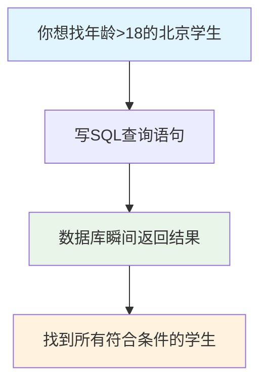
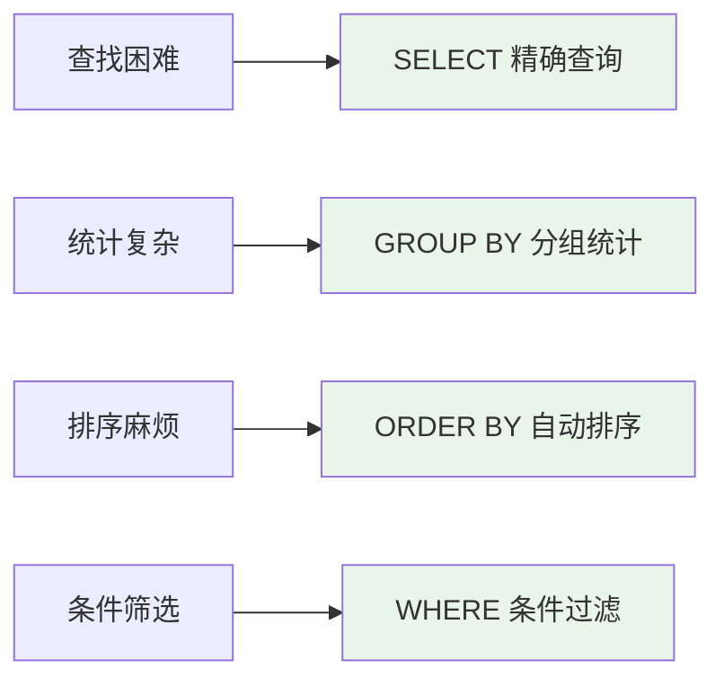

# S1C-SQL查询语句完全指南-从SELECT到GROUP BY的数据操作利器

## 📋 摘要

SQL 查询语句是数据库操作的核心技能，通过 SELECT、WHERE、ORDER BY 等关键词实现数据筛选、排序和统计，让数据查询变得简单高效，是后端开发必备技能。

---

## 🎯 目录

- [前置知识点](#前置知识点)
- [什么是 SQL 查询语句](#什么是-sql-查询语句)
- [为什么需要 SQL 查询](#为什么需要-sql-查询)
- [SQL 查询语句基础](#sql-查询语句基础)
- [SELECT 语句详解](#select-语句详解)
- [WHERE 条件筛选](#where-条件筛选)
- [ORDER BY 排序查询](#order-by-排序查询)
- [GROUP BY 分组统计](#group-by-分组统计)
- [实际应用场景](#实际应用场景)
- [常见问题与解决方案](#常见问题与解决方案)
- [学习建议](#学习建议)
- [总结与展望](#总结与展望)

---

## 📚 前置知识点

### 基础知识点（必须掌握）
- **数据库基础**：了解数据库、表、字段、记录的基本概念
- **数据概念**：理解什么是数据，数据的基本形式
- **表格思维**：知道 Excel 表格的基本操作

### 进阶知识点（建议了解）
- **编程基础**：了解编程语言的基本概念
- **逻辑思维**：理解条件判断和逻辑运算
- **数据分析**：了解统计和聚合的基本概念

---

## 🔍 什么是 SQL 查询语句

### 生活化比喻

SQL 查询语句就像**智能搜索引擎**，但比普通搜索更强大：

- **普通搜索**：输入关键词，返回相关结果
- **SQL 查询**：输入查询条件，精确返回需要的数据

想象一下，如果你有一个包含 100 万条学生信息的数据库，你想找所有年龄大于 18 岁的北京学生：



### 专业定义

**SQL 查询语句（SQL Query）** 是用于从数据库中检索数据的结构化查询语言，通过特定的语法规则告诉数据库需要什么数据。

### 核心特点

1. **精确查询**：可以精确指定需要的数据
2. **条件筛选**：支持复杂的条件筛选
3. **数据排序**：可以按指定规则排序
4. **统计计算**：支持数据统计和聚合
5. **高效执行**：数据库优化查询性能

---

## 🤔 为什么需要 SQL 查询

### 没有 SQL 查询的问题

想象一下，如果不用 SQL 查询，你的应用会是什么样子：

#### 问题 1：查找数据困难
```
// 传统方式：遍历所有数据
for (int i = 0; i < 1000000; i++) {
    if (students[i].age > 18 && students[i].city == "北京") {
        // 找到符合条件的学生
    }
}
```

**问题**：
- 需要遍历所有数据
- 代码复杂，容易出错
- 性能差，速度慢

#### 问题 2：数据统计复杂
```
// 传统方式：手动统计
int count = 0;
for (int i = 0; i < 1000000; i++) {
    if (students[i].grade == "高三") {
        count++;
    }
}
```

**问题**：
- 需要写大量代码
- 统计逻辑复杂
- 容易出错

### SQL 查询的解决方案



---

## 🏗️ SQL 查询语句基础

### 基本语法结构

**生活化比喻**：SQL 查询就像**点菜**，告诉服务员你要什么菜（SELECT），从哪个菜单（FROM），有什么要求（WHERE）。

```sql
SELECT 字段名        -- 我要什么数据（"我要什么菜"）
FROM 表名           -- 从哪个表查询（"从哪个菜单"）
WHERE 条件          -- 查询条件（"有什么要求"）
ORDER BY 排序字段   -- 排序方式（"按什么顺序上菜"）
```

### 关键词解释

| 关键词 | 作用 | 生活化比喻 | 具体例子 |
|--------|------|------------|----------|
| **SELECT** | 选择字段 | 我要什么菜 | `SELECT name, age` |
| **FROM** | 指定表 | 从哪个菜单 | `FROM students` |
| **WHERE** | 筛选条件 | 有什么要求 | `WHERE age > 18` |
| **ORDER BY** | 排序 | 按什么顺序 | `ORDER BY age DESC` |

---

## 📊 SELECT 语句详解

### 基本 SELECT 查询

**生活化比喻**：SELECT 就像**点菜**，告诉服务员你要什么菜。

#### 查询所有字段
```sql
-- 使用 SELECT *（推荐）
SELECT * FROM students;

-- 不使用 SELECT *（不推荐）
SELECT id, name, age, grade, city FROM students;
```

**对比说明**：
- **使用 SELECT \***：简单快捷，适合查看所有数据
- **不使用 SELECT \***：需要列出所有字段名，容易遗漏

#### 查询指定字段
```sql
-- 使用指定字段（推荐）
SELECT name, age FROM students;

-- 不使用指定字段（不推荐）
SELECT * FROM students;  -- 会返回不需要的字段
```

**对比说明**：
- **使用指定字段**：只返回需要的数据，节省网络传输
- **不使用指定字段**：返回所有数据，可能包含不需要的信息

### SELECT 高级用法

#### DISTINCT 去重
```sql
-- 使用 DISTINCT（推荐）
SELECT DISTINCT city FROM students;

-- 不使用 DISTINCT（不推荐）
SELECT city FROM students;  -- 可能返回重复的城市名
```

**对比说明**：
- **使用 DISTINCT**：自动去除重复值，结果更清晰
- **不使用 DISTINCT**：可能返回重复值，需要手动处理

---

## 🔍 WHERE 条件筛选

### 基本 WHERE 查询

**生活化比喻**：WHERE 就像**筛选器**，只让符合条件的数据通过。

#### 比较运算符
```sql
-- 使用比较运算符（推荐）
SELECT * FROM students WHERE age > 18;
SELECT * FROM students WHERE age = 20;
SELECT * FROM students WHERE age BETWEEN 18 AND 25;

-- 不使用比较运算符（不推荐）
SELECT * FROM students;  -- 返回所有数据，无法筛选
```

**对比说明**：
- **使用比较运算符**：精确筛选需要的数据
- **不使用比较运算符**：返回所有数据，无法满足查询需求

#### 逻辑运算符
```sql
-- 使用逻辑运算符（推荐）
SELECT * FROM students WHERE age > 18 AND city = '北京';
SELECT * FROM students WHERE grade = '高三' OR grade = '高二';

-- 不使用逻辑运算符（不推荐）
SELECT * FROM students WHERE age > 18;
SELECT * FROM students WHERE city = '北京';  -- 需要分别查询
```

**对比说明**：
- **使用逻辑运算符**：一次查询满足多个条件
- **不使用逻辑运算符**：需要多次查询，效率低

### WHERE 高级用法

#### LIKE 模糊查询
```sql
-- 使用 LIKE（推荐）
SELECT * FROM students WHERE name LIKE '张%';
SELECT * FROM students WHERE name LIKE '%明%';

-- 不使用 LIKE（不推荐）
SELECT * FROM students WHERE name = '张';  -- 只能精确匹配
```

**对比说明**：
- **使用 LIKE**：支持模糊匹配，查询更灵活
- **不使用 LIKE**：只能精确匹配，查询范围有限

#### IN 和 NOT IN
```sql
-- 使用 IN（推荐）
SELECT * FROM students WHERE city IN ('北京', '上海', '广州');

-- 不使用 IN（不推荐）
SELECT * FROM students WHERE city = '北京' OR city = '上海' OR city = '广州';
```

**对比说明**：
- **使用 IN**：语法简洁，易于维护
- **不使用 IN**：语法冗长，容易出错

---

## 📈 ORDER BY 排序查询

### 基本排序

**生活化比喻**：ORDER BY 就像**整理书架**，按指定规则排列书籍。

#### 升序排序
```sql
-- 使用 ORDER BY ASC（推荐）
SELECT * FROM students ORDER BY age ASC;

-- 不使用 ORDER BY（不推荐）
SELECT * FROM students;  -- 数据顺序随机，无法预测
```

**对比说明**：
- **使用 ORDER BY ASC**：数据按年龄从小到大排列
- **不使用 ORDER BY**：数据顺序随机，难以查找

#### 降序排序
```sql
-- 使用 ORDER BY DESC（推荐）
SELECT * FROM students ORDER BY age DESC;

-- 不使用 ORDER BY DESC（不推荐）
SELECT * FROM students ORDER BY age ASC;  -- 顺序相反
```

**对比说明**：
- **使用 ORDER BY DESC**：数据按年龄从大到小排列
- **不使用 ORDER BY DESC**：顺序相反，不符合需求

### 多字段排序

```sql
-- 使用多字段排序（推荐）
SELECT * FROM students ORDER BY city ASC, age DESC;

-- 不使用多字段排序（不推荐）
SELECT * FROM students ORDER BY city ASC;  -- 只按城市排序
```

**对比说明**：
- **使用多字段排序**：先按城市排序，再按年龄排序
- **不使用多字段排序**：只能按一个字段排序，结果不够精确

---

## 📊 GROUP BY 分组统计

### 基本分组统计

**生活化比喻**：GROUP BY 就像**分类统计**，把相同类型的数据归为一组进行统计。

#### COUNT 计数
```sql
-- 使用 GROUP BY（推荐）
SELECT city, COUNT(*) FROM students GROUP BY city;

-- 不使用 GROUP BY（不推荐）
SELECT COUNT(*) FROM students;  -- 只能统计总数
```

**对比说明**：
- **使用 GROUP BY**：按城市分组统计每个城市的学生数量
- **不使用 GROUP BY**：只能统计总数量，无法分组

#### SUM 求和
```sql
-- 使用 GROUP BY（推荐）
SELECT grade, SUM(score) FROM students GROUP BY grade;

-- 不使用 GROUP BY（不推荐）
SELECT SUM(score) FROM students;  -- 只能统计总分
```

**对比说明**：
- **使用 GROUP BY**：按年级分组统计每个年级的总分
- **不使用 GROUP BY**：只能统计总分，无法分组

### 聚合函数对比

| 函数 | 作用 | 生活化比喻 | 代码示例 |
|------|------|------------|----------|
| **COUNT** | 计数 | 数一数有多少个 | `COUNT(*)` |
| **SUM** | 求和 | 加起来是多少 | `SUM(score)` |
| **AVG** | 平均值 | 平均是多少 | `AVG(age)` |
| **MAX** | 最大值 | 最大的那个 | `MAX(score)` |
| **MIN** | 最小值 | 最小的那个 | `MIN(age)` |

---

## 🌟 实际应用场景

### 场景一：学生管理系统查询

**生活化比喻**：就像学校的**学生档案查询系统**，老师可以快速找到需要的学生信息。

```sql
-- 查询所有高三学生
SELECT name, age, city FROM students WHERE grade = '高三';

-- 查询北京地区年龄大于18的学生
SELECT * FROM students WHERE city = '北京' AND age > 18;

-- 按年龄排序查询学生
SELECT name, age FROM students ORDER BY age DESC;
```

**重要程度**：🔥 重要！必须掌握

### 场景二：销售数据统计

**生活化比喻**：就像**商店的销售报表**，老板可以快速了解销售情况。

```sql
-- 统计每个产品的销售数量
SELECT product_name, COUNT(*) FROM sales GROUP BY product_name;

-- 统计每个月的销售总额
SELECT MONTH(sale_date), SUM(amount) FROM sales GROUP BY MONTH(sale_date);

-- 查询销售额最高的前10个产品
SELECT product_name, SUM(amount) FROM sales GROUP BY product_name ORDER BY SUM(amount) DESC LIMIT 10;
```

**重要程度**：🔥 重要！必须掌握

### 场景三：用户行为分析

**生活化比喻**：就像**网站的用户分析报告**，产品经理可以了解用户行为。

```sql
-- 统计每个城市的用户数量
SELECT city, COUNT(*) FROM users GROUP BY city;

-- 查询最近注册的用户
SELECT name, register_date FROM users ORDER BY register_date DESC LIMIT 20;

-- 统计不同年龄段的用户分布
SELECT age_group, COUNT(*) FROM users GROUP BY age_group;
```

**重要程度**：⭐ 建议掌握

---

## ⚠️ 常见问题与解决方案

### 问题一：查询结果为空

**问题表现**：SQL 语句执行后没有返回任何数据

**错误写法**：
```sql
SELECT * FROM students WHERE age > 100;  -- 可能没有年龄大于100的学生
```

**正确写法**：
```sql
SELECT * FROM students WHERE age > 18;   -- 使用合理的年龄范围
```

**解决方案**：
1. 检查 WHERE 条件是否过于严格
2. 确认数据表中确实存在符合条件的数据
3. 使用 `SELECT COUNT(*)` 先统计数据量

### 问题二：查询性能慢

**问题表现**：查询大量数据时速度很慢

**错误写法**：
```sql
SELECT * FROM students;  -- 查询所有数据，包括不需要的字段
```

**正确写法**：
```sql
SELECT name, age FROM students WHERE city = '北京';  -- 只查询需要的字段和条件
```

**解决方案**：
1. 使用 WHERE 条件限制查询范围
2. 只选择需要的字段，避免 SELECT *
3. 为常用查询字段创建索引

### 问题三：排序结果不正确

**问题表现**：ORDER BY 排序结果不符合预期

**错误写法**：
```sql
SELECT * FROM students ORDER BY name;  -- 字符串排序可能不符合预期
```

**正确写法**：
```sql
SELECT * FROM students ORDER BY age DESC, name ASC;  -- 明确指定排序规则
```

**解决方案**：
1. 明确指定 ASC（升序）或 DESC（降序）
2. 多字段排序时注意字段顺序
3. 字符串排序注意大小写敏感性

---

## 🎯 学习建议

### 🔥 高优先级（必须掌握）
- **SELECT 基础查询**：掌握字段选择和基本查询
- **WHERE 条件筛选**：掌握各种比较和逻辑运算符
- **ORDER BY 排序**：掌握单字段和多字段排序

### ⭐ 中优先级（建议掌握）
- **GROUP BY 分组**：掌握基本分组和聚合函数
- **聚合函数**：掌握 COUNT、SUM、AVG、MAX、MIN
- **LIKE 模糊查询**：掌握通配符使用

### 💡 低优先级（可选掌握）
- **子查询**：掌握嵌套查询语法
- **JOIN 连接**：掌握多表关联查询
- **窗口函数**：掌握高级分析函数

### 📅 学习时间规划

- **第 1 周**：SELECT、WHERE 基础查询
- **第 2 周**：ORDER BY 排序和聚合函数
- **第 3 周**：GROUP BY 分组统计
- **第 4 周**：综合练习和项目实战

### 🛠️ 实践建议

1. **每天练习**：每天写 10-20 个 SQL 查询
2. **从简单开始**：先掌握单表查询，再学多表连接
3. **理解概念**：不要死记硬背，要理解每个语句的作用
4. **项目实战**：通过实际项目巩固理论知识

---

## 🎉 总结与展望

SQL 查询语句是数据库操作的**核心技能**，它就像一把万能钥匙，让你能够轻松地从海量数据中提取需要的信息。无论你是想成为后端开发者、数据分析师，还是系统管理员，掌握 SQL 查询都是必不可少的技能。

### 🌟 核心价值回顾

- **精确查询**：通过 SELECT 和 WHERE 精确获取需要的数据
- **智能排序**：通过 ORDER BY 让数据按指定规则排列
- **高效统计**：通过 GROUP BY 和聚合函数快速统计数据
- **灵活筛选**：支持复杂的条件组合和模糊查询

### 💪 学习建议

1. **从基础开始**：先掌握 SELECT、WHERE、ORDER BY 基础语法
2. **实践为主**：通过实际项目巩固理论知识
3. **循序渐进**：从简单查询到复杂统计
4. **关注性能**：学习查询优化和索引使用

### 🚀 未来发展趋势

- **智能查询优化**：AI 驱动的查询性能优化
- **自然语言查询**：用自然语言生成 SQL 语句
- **实时数据分析**：支持流式数据的实时查询
- **云原生查询**：更好的云数据库集成

现在你已经了解了 SQL 查询语句的基本概念和重要性，是时候开始你的 SQL 学习之旅了！记住，**最好的学习方式就是实践**。从简单的数据查询开始，逐步构建更复杂的数据分析系统，你会发现 SQL 让你的数据处理之路变得更加高效和可靠。

**加油，未来的 SQL 专家！** 🚀✨

---

**厦门工学院人工智能创作坊 -- 郑恩赐**  
**2025 年 10 月 25 日**
