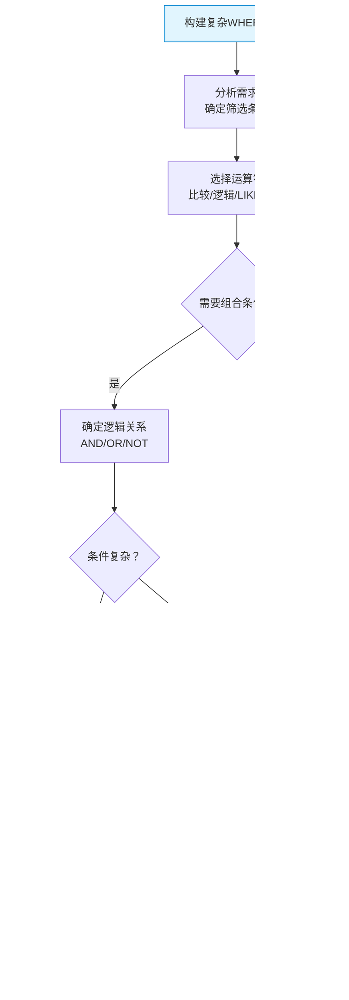

# S1D-SQL WHERE 条件筛选完全指南-99%的人只会用等于和大于，SQL高手却这样写：从基础运算符到复杂条件的数据过滤利器

## 📝 摘要

99% 的人只会用 = 和 > 筛选数据，遇到复杂条件就写不出来？SQL 高手却掌握所有运算符，查询效率提升 10 倍。本文档用生活化比喻解析 SQL WHERE 条件筛选，从基础运算符到复杂条件组合，帮你从新手到高手的蜕变。

---

## 目录

- [1. 前置知识点](#1-前置知识点)
- [2. 问题描述](#2-问题描述)
- [3. 问题考察点](#3-问题考察点)
- [4. 快速上手（3 分钟）](#4-快速上手3-分钟)
- [5. 什么是 WHERE 条件筛选（WHERE Clause）？](#5-什么是-where-条件筛选where-clause)
- [6. 为什么需要 WHERE 条件筛选？](#6-为什么需要-where-条件筛选)
- [7. 比较运算符（Comparison Operators）：精确匹配数据](#7-比较运算符comparison-operators精确匹配数据)
  - [7.1 比较运算符的基本概念](#71-比较运算符的基本概念)
  - [7.2 比较运算符对比表格](#72-比较运算符对比表格)
  - [7.3 字符串和日期比较注意事项](#73-字符串和日期比较注意事项)
  - [7.4 实际应用示例](#74-实际应用示例)
- [8. 逻辑运算符（Logical Operators）：组合多个条件](#8-逻辑运算符logical-operators组合多个条件)
  - [8.1 逻辑运算符的基本概念](#81-逻辑运算符的基本概念)
  - [8.2 AND、OR、NOT 对比](#82-andornot-对比)
  - [8.3 运算符优先级和括号使用](#83-运算符优先级和括号使用)
  - [8.4 实际应用示例](#84-实际应用示例)
- [9. LIKE 模糊查询（Pattern Matching）：灵活匹配文本](#9-like-模糊查询pattern-matching灵活匹配文本)
  - [9.1 LIKE 运算符的基本概念](#91-like-运算符的基本概念)
  - [9.2 通配符 % 和 _ 详解](#92-通配符--和-_-详解)
  - [9.3 LIKE 查询性能注意事项](#93-like-查询性能注意事项)
  - [9.4 实际应用示例](#94-实际应用示例)
- [10. IN 和 BETWEEN 运算符：简化条件表达](#10-in-和-between-运算符简化条件表达)
  - [10.1 IN 运算符：匹配列表中的值](#101-in-运算符匹配列表中的值)
  - [10.2 BETWEEN 运算符：匹配范围值](#102-between-运算符匹配范围值)
  - [10.3 IN vs 多个 OR 条件对比](#103-in-vs-多个-or-条件对比)
  - [10.4 实际应用示例](#104-实际应用示例)
- [11. NULL 值处理（NULL Handling）：特殊值的判断](#11-null-值处理null-handling特殊值的判断)
  - [11.1 NULL 值的基本概念](#111-null-值的基本概念)
  - [11.2 IS NULL 和 IS NOT NULL](#112-is-null-和-is-not-null)
  - [11.3 为什么不能用 = NULL](#113-为什么不能用--null)
  - [11.4 实际应用示例](#114-实际应用示例)
- [12. WHERE 条件组合实战：复杂查询场景](#12-where-条件组合实战复杂查询场景)
- [13. 性能优化建议](#13-性能优化建议)
- [14. 对比示例：WHERE 条件筛选错误的问题](#14-对比示例where-条件筛选错误的问题)
- [15. 常见错误与修正](#15-常见错误与修正)
- [16. 总结与展望](#16-总结与展望)
- [17. 📚 参考资料与学习资源](#17-参考资料与学习资源)

---

## 1. 前置知识点

### 基础知识点（必须掌握）

在学习 SQL WHERE 条件筛选之前，你需要掌握以下知识点：

- **数据库基本概念**：了解数据库、表、字段、记录的基本概念（参考 S1A 文档）
- **SQL 基本数据类型**：了解整数、字符串、日期等基本数据类型（参考 S1B 文档）
- **SELECT 查询语句**：了解基本的 SELECT 查询语法（参考 S1C 文档）

### 🎯 **学习建议**

- **零基础小白**：建议先学习数据库基本概念（S1A）、数据类型（S1B）和 SELECT 查询（S1C），再学习 WHERE 条件筛选
- **有基础读者**：可以直接学习 WHERE 条件筛选的各种运算符和最佳实践

---

## 2. 问题描述

### 实际场景

**真实事件：上周，某公司新来的实习生小王，在查询学生数据时遇到了一个奇怪的问题...**

他需要查询所有年龄大于 18 岁、来自北京或上海、且姓名包含"张"的学生。小王只会用 `WHERE age = 18` 这样的简单条件，遇到复杂条件就懵了，急得满头大汗，查了一下午也没写出来。

**面试官**：如何查询满足多个条件的数据？如果条件筛选错误会有什么问题？

**实际开发场景**：
- 查询学生表时，如何筛选年龄大于 18 岁的学生？
- 如何同时满足多个条件（年龄 > 18 AND 城市 = '北京'）？
- 如何查询姓名包含某个关键字的学生？
- 如何查询某个范围内的数据（如分数在 80-100 之间）？

**常见问题**：
- 只会用 = 和 >，遇到复杂条件就写不出来
- 查询 100 万条数据，没有 WHERE 条件导致查询超时
- 使用错误的运算符导致查询结果不准确
- 不知道如何处理 NULL 值，导致查询遗漏数据

---

## 3. 问题考察点

学习 SQL WHERE 条件筛选时，需要考察以下能力：

- **条件筛选意识**：能否识别 WHERE 条件筛选的重要性？是否理解不同运算符的特点？
- **运算符掌握**：是否掌握比较运算符、逻辑运算符、LIKE、IN、BETWEEN 等常用运算符？
- **条件组合能力**：能否正确组合多个条件？是否理解运算符优先级？
- **NULL 值处理**：是否理解 NULL 值的特殊性？能否正确处理 NULL 值？
- **性能优化认知**：是否理解 WHERE 条件对查询性能的影响？能否编写高效的查询语句？
- **实际应用能力**：能否在实际项目中合理使用 WHERE 条件？是否考虑业务需求和性能要求？

---

## 4. 快速上手（3 分钟）

<p align="right"><span style="background:#e53935;color:#fff;padding:2px 6px;border-radius:4px">🔥 Must（必做实践）</span></p>

### 4.1 WHERE 条件筛选快速概览

**WHERE 条件筛选（WHERE Clause（WHERE 子句））** 用于从表中筛选符合特定条件的记录，就像**筛选器**，只让符合条件的数据通过。

**常见运算符分类**：

| 运算符分类 | 主要运算符 | 用途示例 |
|---------|---------|---------|
| **比较运算符** | =, <>, >, <, >=, <= | 精确匹配数据（年龄 = 18、分数 > 80） |
| **逻辑运算符** | AND, OR, NOT | 组合多个条件（年龄 > 18 AND 城市 = '北京'） |
| **模糊查询** | LIKE | 匹配文本模式（姓名 LIKE '张%'） |
| **范围查询** | IN, BETWEEN | 匹配列表或范围（城市 IN ('北京', '上海')） |
| **NULL 判断** | IS NULL, IS NOT NULL | 判断空值（邮箱 IS NULL） |

### 4.1.1 运算符选择流程图

**运算符选择流程图**：下面的流程图帮助你根据实际需求选择合适的 WHERE 运算符。


**快速选择指南**：

1. **精确匹配**：使用比较运算符（=, <>, >, <, >=, <=）
2. **列表匹配**：使用 IN 运算符（比多个 OR 更简洁）
3. **范围匹配**：使用 BETWEEN 运算符（比 >= AND <= 更简洁）
4. **模糊匹配**：使用 LIKE 运算符（配合 % 和 _ 通配符）
5. **空值判断**：使用 IS NULL 或 IS NOT NULL（不能用 = NULL）
6. **组合条件**：使用 AND、OR、NOT 逻辑运算符

### 4.2 基础 WHERE 查询示例

**原理**：WHERE 子句放在 FROM 子句之后，用于指定筛选条件，只有满足条件的记录才会被返回。

```sql
-- 查询年龄大于 18 岁的学生
-- 下面逐行解释 WHERE 条件的使用
SELECT * 
FROM students 
WHERE age > 18;
-- 说明：WHERE age > 18 表示只返回年龄大于 18 的记录
-- 如果表中有 1000 条记录，只有年龄 > 18 的记录会被返回

-- 查询年龄大于 18 岁且来自北京的学生
SELECT * 
FROM students 
WHERE age > 18 AND city = '北京';
-- 说明：AND 表示同时满足两个条件
-- age > 18：年龄必须大于 18
-- city = '北京'：城市必须是北京
-- 只有同时满足这两个条件的记录才会被返回

-- 查询姓名包含"张"的学生
SELECT * 
FROM students 
WHERE name LIKE '张%';
-- 说明：LIKE '张%' 表示姓名以"张"开头
-- % 是通配符，表示匹配任意字符
-- 可以匹配"张三"、"张明"、"张伟"等
```

**关键要点**：WHERE 条件筛选是 SQL 查询的核心技能，掌握各种运算符可以精确筛选需要的数据，提高查询效率和准确性。

---

## 5. 什么是 WHERE 条件筛选（WHERE Clause）？

### 5.1 WHERE 条件筛选的基本定义

**WHERE 条件筛选（WHERE Clause（WHERE 子句））** 是 SQL 中用于从表中筛选符合特定条件的记录的子句，它决定了：
- 哪些记录会被返回（满足条件的记录）
- 哪些记录会被过滤掉（不满足条件的记录）
- 查询的精确性和性能

**WHERE 条件筛选的特点**：
- **条件过滤**：只返回满足条件的记录
- **性能影响**：合理的 WHERE 条件可以大幅提升查询性能
- **灵活性**：支持多种运算符和条件组合

### 5.2 生活化比喻

**生活化比喻**：WHERE 条件筛选就像**筛选器**或**过滤器**。

想象一下：
- **没有 WHERE 条件**：就像把整个仓库的货物都搬出来，然后人工筛选（效率低、耗时长）
- **有 WHERE 条件**：就像在仓库门口设置筛选器，只让符合条件的货物通过（效率高、速度快）

**另一个比喻**：
- **WHERE 条件筛选** = 招聘时的筛选条件
  - `WHERE age > 18`：只要年龄大于 18 岁的候选人
  - `WHERE city = '北京'`：只要来自北京的候选人
  - `WHERE age > 18 AND city = '北京'`：既要年龄大于 18 岁，又要来自北京

### 5.3 WHERE 条件筛选工作流程图

**WHERE 条件筛选工作流程**：下面的流程图展示了 WHERE 条件筛选的完整工作过程。


**流程说明**：
1. **读取表数据**：从数据库表中读取所有记录
2. **应用 WHERE 条件**：对每条记录应用 WHERE 条件进行判断
3. **条件判断**：检查记录是否满足 WHERE 条件
4. **筛选结果**：满足条件的记录被返回，不满足条件的记录被过滤
5. **返回结果**：返回所有通过筛选的记录

### 5.4 筛选器比喻可视化

**筛选器比喻可视化**：下面的图表直观展示了 WHERE 条件筛选的工作原理。


**对比说明**：
- **无 WHERE 条件**：返回所有记录，效率低、资源浪费
- **有 WHERE 条件**：只返回满足条件的记录，效率高、结果精确

---

## 6. 为什么需要 WHERE 条件筛选？

**原理**：WHERE 条件筛选用于从表中筛选符合特定条件的记录，没有 WHERE 条件会导致查询返回所有记录，效率低且不精确。

### 6.1 WHERE 条件筛选的重要性

**不使用 WHERE 条件（或使用错误条件）的问题**：

```sql
-- ❌ 问题：没有 WHERE 条件，返回所有记录
SELECT * FROM students;
-- 如果表中有 100 万条记录，会返回所有 100 万条记录
-- 问题：查询慢、网络传输量大、内存占用高

-- ❌ 问题：使用错误的运算符
SELECT * FROM students WHERE age = NULL;
-- 问题：NULL 值不能用 = 比较，这个查询不会返回任何结果（即使有 NULL 值）

-- ❌ 问题：条件组合错误
SELECT * FROM students WHERE age > 18 OR city = '北京';
-- 问题：OR 的逻辑可能不符合预期，会返回年龄 > 18 的所有学生，或者城市 = '北京' 的所有学生
-- 如果只想查询"年龄 > 18 且城市 = '北京'"的学生，应该用 AND
```

**使用正确 WHERE 条件的优势**：

```sql
-- ✅ 解决方案：使用 WHERE 条件筛选
SELECT * FROM students WHERE age > 18;
-- 只返回年龄大于 18 的记录，查询速度快、结果精确

-- ✅ 解决方案：正确处理 NULL 值
SELECT * FROM students WHERE age IS NULL;
-- 使用 IS NULL 正确判断 NULL 值

-- ✅ 解决方案：正确组合条件
SELECT * FROM students WHERE age > 18 AND city = '北京';
-- 使用 AND 同时满足两个条件，结果精确
```

**优势总结**：

| 优势 | 说明 | 实际收益 |
|------|------|---------|
| **查询精确性** | 只返回需要的数据 | 避免返回无关数据，提高查询准确性 |
| **性能提升** | 减少数据扫描量 | 查询速度可提升 10-100 倍 |
| **网络传输优化** | 减少数据传输量 | 节省带宽，提高响应速度 |
| **内存占用降低** | 减少内存使用 | 避免内存溢出，提高系统稳定性 |

### 6.2 性能对比可视化图表

**性能对比图表**：下面的图表直观展示了使用 WHERE 条件前后的性能差异。


**性能对比数据**（以 100 万条记录为例）：

| 场景 | 扫描记录数 | 返回记录数 | 扫描时间 | 传输时间 | 总耗时 | 性能提升 |
|------|-----------|-----------|---------|---------|--------|---------|
| **无 WHERE 条件** | 100 万 | 100 万 | 5 秒 | 10 秒 | 15 秒 | - |
| **有 WHERE 条件** | 100 万 | 10 万 | 0.5 秒 | 1 秒 | 1.5 秒 | **10 倍** |

**关键发现**：
- ✅ **扫描时间减少**：WHERE 条件可以提前过滤数据，减少无效扫描
- ✅ **传输时间减少**：只返回需要的数据，大幅减少网络传输
- ✅ **总体性能提升**：查询速度可提升 10-100 倍

### 6.3 数据筛选过程对比图

**数据筛选过程对比**：下面的流程图展示了有无 WHERE 条件的数据筛选过程差异。


**对比说明**：
- **无 WHERE 条件**：数据库返回所有数据，应用程序需要处理大量无用数据
- **有 WHERE 条件**：数据库先筛选数据，应用程序只处理需要的数据，效率大幅提升

---

## 7. 比较运算符（Comparison Operators）：精确匹配数据

**原理**：比较运算符用于比较两个值的大小或相等性，返回布尔值（真或假），只有条件为真的记录才会被返回。

### 7.1 比较运算符的基本概念 [📖官方文档](https://dev.mysql.com/doc/refman/8.0/en/comparison-operators.html) [📚教程](https://www.w3schools.com/sql/sql_operators.asp)

**比较运算符（Comparison Operators（比较运算符））** 用于比较两个值的大小或相等性，如年龄、分数、价格等。

**比较运算符的特点**：
- **精确匹配**：可以精确比较数值、字符串、日期等
- **返回布尔值**：条件为真返回记录，条件为假过滤记录
- **支持多种类型**：可以比较整数、浮点数、字符串、日期等

### 7.2 比较运算符对比表格

<p align="right"><span style="background:#e53935;color:#fff;padding:2px 6px;border-radius:4px">🔥 Must（必做实践）</span></p>

**MySQL 比较运算符对比**：

| 运算符 | 含义 | 示例 | 说明 |
|--------|------|------|------|
| **=** [📖](https://dev.mysql.com/doc/refman/8.0/en/comparison-operators.html#operator_equal) | 等于 | `age = 18` | 年龄等于 18 |
| **<>** 或 **!=** [📖](https://dev.mysql.com/doc/refman/8.0/en/comparison-operators.html#operator_not-equal) | 不等于 | `age <> 18` | 年龄不等于 18 |
| **>** [📖](https://dev.mysql.com/doc/refman/8.0/en/comparison-operators.html#operator_greater-than) | 大于 | `age > 18` | 年龄大于 18 |
| **<** [📖](https://dev.mysql.com/doc/refman/8.0/en/comparison-operators.html#operator_less-than) | 小于 | `age < 18` | 年龄小于 18 |
| **>=** [📖](https://dev.mysql.com/doc/refman/8.0/en/comparison-operators.html#operator_greater-than-or-equal) | 大于等于 | `age >= 18` | 年龄大于等于 18 |
| **<=** [📖](https://dev.mysql.com/doc/refman/8.0/en/comparison-operators.html#operator_less-than-or-equal) | 小于等于 | `age <= 18` | 年龄小于等于 18 |

**关键要点**：
- **=** 是最常用的比较运算符，用于精确匹配
- **<>** 和 **!=** 功能相同，都表示不等于（推荐使用 <>，更标准）
- 比较运算符可以用于数值、字符串、日期等类型

### 7.3 字符串和日期比较注意事项

**字符串比较**：
- 字符串比较通常不区分大小写（取决于数据库配置）
- 字符串按字典序比较（'A' < 'B' < 'a' < 'b'）

**日期比较**：
- 日期格式必须正确（MySQL 使用 'YYYY-MM-DD' 格式）
- 日期可以比较大小（较早的日期 < 较晚的日期）

### 7.4 实际应用示例

<p align="right"><span style="background:#fb8c00;color:#fff;padding:2px 6px;border-radius:4px">💡 Should（建议实践）</span></p>

```sql
-- 示例：使用比较运算符查询学生表
-- 下面详细解释每个比较运算符的使用

-- 1. 等于运算符（=）：查询年龄等于 18 的学生
SELECT * FROM students WHERE age = 18;
-- 说明：age = 18 表示年龄必须等于 18，精确匹配

-- 2. 不等于运算符（<>）：查询年龄不等于 18 的学生
SELECT * FROM students WHERE age <> 18;
-- 说明：age <> 18 表示年龄不等于 18，排除年龄为 18 的学生

-- 3. 大于运算符（>）：查询年龄大于 18 的学生
SELECT * FROM students WHERE age > 18;
-- 说明：age > 18 表示年龄必须大于 18，不包括 18

-- 4. 大于等于运算符（>=）：查询年龄大于等于 18 的学生
SELECT * FROM students WHERE age >= 18;
-- 说明：age >= 18 表示年龄大于等于 18，包括 18

-- 5. 小于运算符（<）：查询年龄小于 18 的学生
SELECT * FROM students WHERE age < 18;
-- 说明：age < 18 表示年龄必须小于 18，不包括 18

-- 6. 小于等于运算符（<=）：查询年龄小于等于 18 的学生
SELECT * FROM students WHERE age <= 18;
-- 说明：age <= 18 表示年龄小于等于 18，包括 18

-- 7. 字符串比较：查询城市等于"北京"的学生
SELECT * FROM students WHERE city = '北京';
-- 说明：字符串比较使用单引号，city = '北京' 表示城市必须等于"北京"

-- 8. 日期比较：查询生日在 2000-01-01 之后的学生
SELECT * FROM students WHERE birthday > '2000-01-01';
-- 说明：日期比较使用 'YYYY-MM-DD' 格式，birthday > '2000-01-01' 表示生日在 2000-01-01 之后
```

---

## 8. 逻辑运算符（Logical Operators）：组合多个条件

**原理**：逻辑运算符用于组合多个条件，实现复杂的筛选逻辑，AND 表示同时满足，OR 表示满足其一，NOT 表示取反。

### 8.1 逻辑运算符的基本概念 [📖官方文档](https://dev.mysql.com/doc/refman/8.0/en/logical-operators.html) [📚教程](https://www.w3schools.com/sql/sql_operators.asp)

**逻辑运算符（Logical Operators（逻辑运算符））** 用于组合多个条件，实现复杂的筛选逻辑。

**逻辑运算符的特点**：
- **条件组合**：可以将多个条件组合成一个复杂条件
- **逻辑清晰**：AND、OR、NOT 语义明确，易于理解
- **灵活强大**：可以实现各种复杂的筛选需求

### 8.2 AND、OR、NOT 对比

<p align="right"><span style="background:#e53935;color:#fff;padding:2px 6px;border-radius:4px">🔥 Must（必做实践）</span></p>

**逻辑运算符对比**：

| 运算符 | 含义 | 生活化比喻 | 示例 | 说明 |
|--------|------|------------|------|------|
| **AND** [📖](https://dev.mysql.com/doc/refman/8.0/en/logical-operators.html#operator_and) | 同时满足 | 既要...又要... | `age > 18 AND city = '北京'` | 年龄 > 18 **且** 城市 = '北京' |
| **OR** [📖](https://dev.mysql.com/doc/refman/8.0/en/logical-operators.html#operator_or) | 满足其一 | 要么...要么... | `city = '北京' OR city = '上海'` | 城市 = '北京' **或** 城市 = '上海' |
| **NOT** [📖](https://dev.mysql.com/doc/refman/8.0/en/logical-operators.html#operator_not) | 取反 | 不是... | `NOT city = '北京'` | 城市 **不是** '北京' |

**逻辑运算真值表**：

| 条件 A | 条件 B | A AND B | A OR B | NOT A |
|--------|--------|---------|--------|-------|
| 真 | 真 | 真 | 真 | 假 |
| 真 | 假 | 假 | 真 | 假 |
| 假 | 真 | 假 | 真 | 真 |
| 假 | 假 | 假 | 假 | 真 |

### 8.2.1 逻辑运算符真值表可视化

**逻辑运算符真值表可视化**：下面的图表直观展示了 AND、OR、NOT 的逻辑关系。


**逻辑关系说明**：
- **AND（与）**：只有两个条件都为真时，结果才为真（同时满足）
- **OR（或）**：只要有一个条件为真，结果就为真（满足其一）
- **NOT（非）**：对条件取反，真变假，假变真

### 8.3 运算符优先级和括号使用

**运算符优先级**（从高到低）：
1. 比较运算符（=, <>, >, <, >=, <=）
2. NOT
3. AND
4. OR

**括号使用技巧**：
- 使用括号明确条件优先级，避免歧义
- 当条件复杂时，建议使用括号提高可读性

```sql
-- ❌ 问题：运算符优先级可能导致歧义
SELECT * FROM students WHERE age > 18 OR city = '北京' AND score > 80;
-- 问题：AND 优先级高于 OR，实际执行的是 age > 18 OR (city = '北京' AND score > 80)
-- 可能不符合预期

-- ✅ 解决方案：使用括号明确优先级
SELECT * FROM students WHERE (age > 18 OR city = '北京') AND score > 80;
-- 说明：使用括号明确表示 (age > 18 OR city = '北京') 且 score > 80
```

### 8.3.1 条件组合决策流程图

**条件组合决策流程图**：下面的流程图帮助你正确组合多个条件。


**决策指南**：
1. **确定逻辑关系**：需要同时满足用 AND，满足其一用 OR，取反用 NOT
2. **检查优先级**：AND 优先级高于 OR，复杂条件使用括号
3. **验证结果**：检查查询结果是否符合预期

### 8.4 实际应用示例

<p align="right"><span style="background:#fb8c00;color:#fff;padding:2px 6px;border-radius:4px">💡 Should（建议实践）</span></p>

```sql
-- 示例：使用逻辑运算符组合多个条件
-- 下面详细解释每个逻辑运算符的使用

-- 1. AND 运算符：查询年龄大于 18 岁且来自北京的学生
SELECT * FROM students 
WHERE age > 18 AND city = '北京';
-- 说明：AND 表示同时满足两个条件
-- age > 18：年龄必须大于 18
-- city = '北京'：城市必须是北京
-- 只有同时满足这两个条件的记录才会被返回

-- 2. OR 运算符：查询来自北京或上海的学生
SELECT * FROM students 
WHERE city = '北京' OR city = '上海';
-- 说明：OR 表示满足其中一个条件即可
-- city = '北京'：城市是北京
-- city = '上海'：城市是上海
-- 满足其中任意一个条件的记录都会被返回

-- 3. NOT 运算符：查询不是来自北京的学生
SELECT * FROM students 
WHERE NOT city = '北京';
-- 说明：NOT 表示取反，NOT city = '北京' 表示城市不是北京
-- 等价于 city <> '北京'

-- 4. 复杂条件组合：查询年龄大于 18 岁，且（来自北京或上海），且分数大于 80 的学生
SELECT * FROM students 
WHERE age > 18 
  AND (city = '北京' OR city = '上海') 
  AND score > 80;
-- 说明：使用括号明确优先级
-- age > 18：年龄必须大于 18
-- (city = '北京' OR city = '上海')：城市是北京或上海
-- score > 80：分数必须大于 80
-- 只有同时满足这三个条件的记录才会被返回

-- 5. NOT 与其他运算符组合：查询年龄不大于 18 岁或城市不是北京的学生
SELECT * FROM students 
WHERE NOT (age > 18 AND city = '北京');
-- 说明：NOT 对整个条件取反
-- 等价于 age <= 18 OR city <> '北京'
```

---

## 9. LIKE 模糊查询（Pattern Matching）：灵活匹配文本

**原理**：LIKE 运算符用于在 WHERE 子句中进行模式匹配，支持通配符 %（匹配任意字符）和 _（匹配单个字符），适合模糊查询场景。

### 9.1 LIKE 运算符的基本概念 [📖官方文档](https://dev.mysql.com/doc/refman/8.0/en/string-comparison-functions.html#operator_like) [📚教程](https://www.w3schools.com/sql/sql_like.asp)

**LIKE 运算符（LIKE Operator（LIKE 运算符））** 用于在 WHERE 子句中进行模式匹配，支持通配符实现灵活的文本查询。

**LIKE 运算符的特点**：
- **模式匹配**：可以匹配文本模式，而不是精确值
- **通配符支持**：支持 % 和 _ 通配符
- **灵活强大**：适合搜索、筛选等场景

### 9.2 通配符 % 和 _ 详解

<p align="right"><span style="background:#fb8c00;color:#fff;padding:2px 6px;border-radius:4px">💡 Should（建议实践）</span></p>

**LIKE 通配符对比**：

| 通配符 | 含义 | 示例 | 匹配结果 |
|--------|------|------|---------|
| **%** | 匹配任意数量的字符（包括 0 个） | `'张%'` | 匹配"张"、"张三"、"张明"、"张伟明"等 |
| **_** | 匹配单个字符 | `'张_'` | 匹配"张三"、"张明"等（两个字符），不匹配"张"或"张伟明" |

### 9.2.1 LIKE 通配符匹配示例图

**LIKE 通配符匹配示例图**：下面的图表直观展示了 % 和 _ 通配符的匹配规则。


**通配符匹配规则说明**：
- **% 通配符**：匹配任意数量的字符（包括 0 个），可以出现在模式的开头、中间或结尾
- **_ 通配符**：匹配单个字符，必须匹配一个字符（不能是 0 个）
- **组合使用**：可以同时使用 % 和 _ 实现更复杂的匹配模式

**LIKE 查询示例**：

```sql
-- 1. % 通配符：查询姓名以"张"开头的学生
SELECT * FROM students WHERE name LIKE '张%';
-- 说明：'张%' 表示以"张"开头，后面可以是任意字符
-- 可以匹配"张三"、"张明"、"张伟明"等

-- 2. % 通配符：查询姓名包含"明"的学生
SELECT * FROM students WHERE name LIKE '%明%';
-- 说明：'%明%' 表示包含"明"，前后可以是任意字符
-- 可以匹配"张明"、"李明"、"明华"、"张明华"等

-- 3. % 通配符：查询姓名以"明"结尾的学生
SELECT * FROM students WHERE name LIKE '%明';
-- 说明：'%明' 表示以"明"结尾，前面可以是任意字符
-- 可以匹配"张明"、"李明"、"王明"等

-- 4. _ 通配符：查询姓名是三个字且以"张"开头的学生
SELECT * FROM students WHERE name LIKE '张__';
-- 说明：'张__' 表示以"张"开头，后面是两个字符（两个下划线）
-- 可以匹配"张三明"、"张伟华"等，不匹配"张"或"张明"

-- 5. 组合使用：查询姓名是三个字，第二个字是"明"的学生
SELECT * FROM students WHERE name LIKE '_明_';
-- 说明：'_明_' 表示三个字符，中间是"明"
-- 可以匹配"张明华"、"李明伟"等
```

### 9.3 LIKE 查询性能注意事项

**性能优化建议**：
- 避免在 LIKE 模式开头使用通配符（如 `'%明'`），会导致索引失效
- 如果可能，尽量在模式开头使用具体字符（如 `'张%'`），可以利用索引
- 对于大量数据的模糊查询，考虑使用全文索引（FULLTEXT）

```sql
-- ❌ 性能问题：模式开头使用通配符
SELECT * FROM students WHERE name LIKE '%明';
-- 问题：无法使用索引，需要全表扫描，性能差

-- ✅ 性能优化：模式开头使用具体字符
SELECT * FROM students WHERE name LIKE '张%';
-- 说明：可以使用索引，性能好
```

### 9.4 实际应用示例

<p align="right"><span style="background:#fb8c00;color:#fff;padding:2px 6px;border-radius:4px">💡 Should（建议实践）</span></p>

```sql
-- 示例：使用 LIKE 进行模糊查询
-- 下面详细解释 LIKE 的各种用法

-- 1. 查询姓名以"张"开头的学生
SELECT * FROM students WHERE name LIKE '张%';
-- 说明：'张%' 匹配以"张"开头的所有姓名
-- 可以匹配"张三"、"张明"、"张伟明"等

-- 2. 查询姓名包含"明"的学生
SELECT * FROM students WHERE name LIKE '%明%';
-- 说明：'%明%' 匹配包含"明"的所有姓名
-- 可以匹配"张明"、"李明"、"明华"、"张明华"等

-- 3. 查询邮箱以"@gmail.com"结尾的学生
SELECT * FROM students WHERE email LIKE '%@gmail.com';
-- 说明：'%@gmail.com' 匹配以"@gmail.com"结尾的邮箱
-- 可以匹配"zhangsan@gmail.com"、"lisi@gmail.com"等

-- 4. 查询手机号以"138"开头的学生
SELECT * FROM students WHERE phone LIKE '138%';
-- 说明：'138%' 匹配以"138"开头的手机号
-- 可以匹配"13800138000"、"13812345678"等

-- 5. 查询姓名是三个字且第二个字是"明"的学生
SELECT * FROM students WHERE name LIKE '_明_';
-- 说明：'_明_' 匹配三个字符，中间是"明"
-- 可以匹配"张明华"、"李明伟"等
```

---

## 10. IN 和 BETWEEN 运算符：简化条件表达

**原理**：IN 运算符用于匹配列表中的任意值，BETWEEN 运算符用于匹配某个范围内的值，可以简化多个 OR 条件或范围条件的表达。

### 10.1 IN 运算符：匹配列表中的值 [📖官方文档](https://dev.mysql.com/doc/refman/8.0/en/comparison-operators.html#function_in) [📚教程](https://www.w3schools.com/sql/sql_in.asp)

**IN 运算符（IN Operator（IN 运算符））** 用于匹配列表中的任意值，等价于多个 OR 条件，但更简洁易读。

**IN 运算符的特点**：
- **列表匹配**：可以匹配列表中的任意值
- **简洁易读**：比多个 OR 条件更简洁
- **性能优化**：数据库可以优化 IN 查询

### 10.2 BETWEEN 运算符：匹配范围值 [📖官方文档](https://dev.mysql.com/doc/refman/8.0/en/comparison-operators.html#operator_between) [📚教程](https://www.w3schools.com/sql/sql_between.asp)

**BETWEEN 运算符（BETWEEN Operator（BETWEEN 运算符））** 用于匹配某个范围内的值，包含边界值。

**BETWEEN 运算符的特点**：
- **范围匹配**：可以匹配某个范围内的值
- **包含边界**：BETWEEN 包含边界值（等价于 >= AND <=）
- **简洁易读**：比使用 >= AND <= 更简洁

### 10.3 IN vs 多个 OR 条件对比

<p align="right"><span style="background:#fb8c00;color:#fff;padding:2px 6px;border-radius:4px">💡 Should（建议实践）</span></p>

**对比示例**：

```sql
-- ❌ 问题：使用多个 OR 条件，代码冗长
SELECT * FROM students 
WHERE city = '北京' OR city = '上海' OR city = '广州' OR city = '深圳';
-- 问题：代码冗长，不易维护

-- ✅ 解决方案：使用 IN 运算符，代码简洁
SELECT * FROM students 
WHERE city IN ('北京', '上海', '广州', '深圳');
-- 说明：IN 运算符等价于多个 OR 条件，但更简洁易读
-- 可以匹配列表中的任意值

-- ❌ 问题：使用 >= AND <= 表示范围，代码冗长
SELECT * FROM students 
WHERE age >= 18 AND age <= 25;
-- 问题：代码冗长，不易理解

-- ✅ 解决方案：使用 BETWEEN 运算符，代码简洁
SELECT * FROM students 
WHERE age BETWEEN 18 AND 25;
-- 说明：BETWEEN 运算符等价于 >= AND <=，但更简洁易读
-- 注意：BETWEEN 包含边界值（18 和 25 都会被包含）
```

**选择建议**：

| 场景 | 推荐方式 | 理由 |
|------|---------|------|
| **匹配列表中的值** | IN | 代码简洁，易读易维护 |
| **匹配范围值** | BETWEEN | 代码简洁，语义清晰 |
| **匹配单个值** | = | 简单直接 |
| **匹配多个 OR 条件** | IN | 比多个 OR 更简洁 |

### 10.4 实际应用示例

<p align="right"><span style="background:#fb8c00;color:#fff;padding:2px 6px;border-radius:4px">💡 Should（建议实践）</span></p>

```sql
-- 示例：使用 IN 和 BETWEEN 简化条件表达
-- 下面详细解释 IN 和 BETWEEN 的用法

-- 1. IN 运算符：查询来自北京、上海、广州的学生
SELECT * FROM students 
WHERE city IN ('北京', '上海', '广州');
-- 说明：IN 运算符匹配列表中的任意值
-- 等价于 city = '北京' OR city = '上海' OR city = '广州'
-- 但更简洁易读

-- 2. IN 运算符：查询分数为 90、95、100 的学生
SELECT * FROM students 
WHERE score IN (90, 95, 100);
-- 说明：IN 运算符也可以用于数值类型
-- 等价于 score = 90 OR score = 95 OR score = 100

-- 3. BETWEEN 运算符：查询年龄在 18 到 25 岁之间的学生
SELECT * FROM students 
WHERE age BETWEEN 18 AND 25;
-- 说明：BETWEEN 运算符匹配范围值，包含边界
-- 等价于 age >= 18 AND age <= 25
-- 包括 18 和 25

-- 4. BETWEEN 运算符：查询分数在 80 到 100 分之间的学生
SELECT * FROM students 
WHERE score BETWEEN 80 AND 100;
-- 说明：BETWEEN 运算符也可以用于数值类型
-- 等价于 score >= 80 AND score <= 100
-- 包括 80 和 100

-- 5. BETWEEN 运算符：查询生日在 2000-01-01 到 2010-12-31 之间的学生
SELECT * FROM students 
WHERE birthday BETWEEN '2000-01-01' AND '2010-12-31';
-- 说明：BETWEEN 运算符也可以用于日期类型
-- 等价于 birthday >= '2000-01-01' AND birthday <= '2010-12-31'
-- 包括边界日期

-- 6. NOT IN 和 NOT BETWEEN：查询不在列表或范围中的记录
SELECT * FROM students 
WHERE city NOT IN ('北京', '上海');
-- 说明：NOT IN 表示不在列表中
-- 等价于 city <> '北京' AND city <> '上海'

SELECT * FROM students 
WHERE age NOT BETWEEN 18 AND 25;
-- 说明：NOT BETWEEN 表示不在范围内
-- 等价于 age < 18 OR age > 25
```

---

## 11. NULL 值处理（NULL Handling）：特殊值的判断

**原理**：NULL 值表示缺失或未知的数据，不能用普通的比较运算符（=, <>, >, <）进行比较，必须使用 IS NULL 或 IS NOT NULL 进行判断。

### 11.1 NULL 值的基本概念 [📖官方文档](https://dev.mysql.com/doc/refman/8.0/en/working-with-null.html) [📚教程](https://www.w3schools.com/sql/sql_null_values.asp)

**NULL 值（NULL Value（空值））** 表示缺失或未知的数据，它不是 0、空字符串或空格，而是一个特殊的值。

**NULL 值的特点**：
- **特殊值**：NULL 不是 0、空字符串或空格
- **不能比较**：不能用 =, <>, >, < 等比较运算符
- **必须特殊处理**：必须使用 IS NULL 或 IS NOT NULL

### 11.2 IS NULL 和 IS NOT NULL

<p align="right"><span style="background:#fb8c00;color:#fff;padding:2px 6px;border-radius:4px">💡 Should（建议实践）</span></p>

**NULL 值判断运算符**：

| 运算符 | 含义 | 示例 | 说明 |
|--------|------|------|------|
| **IS NULL** [📖](https://dev.mysql.com/doc/refman/8.0/en/comparison-operators.html#operator_is-null) | 是空值 | `email IS NULL` | 邮箱为空 |
| **IS NOT NULL** [📖](https://dev.mysql.com/doc/refman/8.0/en/comparison-operators.html#operator_is-not-null) | 不是空值 | `email IS NOT NULL` | 邮箱不为空 |

### 11.3 为什么不能用 = NULL

**原因**：
- NULL 值表示"未知"，任何与未知值的比较结果都是未知（NULL），而不是真或假
- 因此，`age = NULL` 永远不会返回真，即使 age 确实是 NULL

```sql
-- ❌ 错误：不能用 = NULL
SELECT * FROM students WHERE age = NULL;
-- 问题：这个查询不会返回任何结果，即使有 NULL 值
-- 原因：NULL 与任何值的比较结果都是 NULL（未知），不是真

-- ✅ 正确：使用 IS NULL
SELECT * FROM students WHERE age IS NULL;
-- 说明：IS NULL 专门用于判断 NULL 值
-- 可以正确返回 age 为 NULL 的记录

-- ❌ 错误：不能用 <> NULL
SELECT * FROM students WHERE age <> NULL;
-- 问题：这个查询不会返回任何结果
-- 原因：NULL 与任何值的比较结果都是 NULL（未知），不是真

-- ✅ 正确：使用 IS NOT NULL
SELECT * FROM students WHERE age IS NOT NULL;
-- 说明：IS NOT NULL 专门用于判断非 NULL 值
-- 可以正确返回 age 不为 NULL 的记录
```

### 11.3.1 NULL 值判断流程图

**NULL 值判断流程图**：下面的流程图展示了如何正确判断 NULL 值。


**判断规则说明**：
- **判断是否为 NULL**：必须使用 `IS NULL`，不能用 `= NULL`
- **判断是否不为 NULL**：必须使用 `IS NOT NULL`，不能用 `<> NULL`
- **原因**：NULL 与任何值的比较结果都是 NULL（未知），不是真或假

### 11.4 实际应用示例

<p align="right"><span style="background:#fb8c00;color:#fff;padding:2px 6px;border-radius:4px">💡 Should（建议实践）</span></p>

```sql
-- 示例：正确处理 NULL 值
-- 下面详细解释 NULL 值的处理

-- 1. 查询邮箱为空的学生
SELECT * FROM students WHERE email IS NULL;
-- 说明：IS NULL 用于判断字段是否为 NULL
-- 返回 email 字段为 NULL 的所有记录

-- 2. 查询邮箱不为空的学生
SELECT * FROM students WHERE email IS NOT NULL;
-- 说明：IS NOT NULL 用于判断字段是否不为 NULL
-- 返回 email 字段不为 NULL 的所有记录

-- 3. 查询年龄不为空且大于 18 的学生
SELECT * FROM students 
WHERE age IS NOT NULL AND age > 18;
-- 说明：先判断 age 不为 NULL，再判断 age > 18
-- 避免 NULL 值参与比较运算

-- 4. 查询邮箱为空或年龄大于 18 的学生
SELECT * FROM students 
WHERE email IS NULL OR age > 18;
-- 说明：使用 OR 组合条件
-- 返回 email 为 NULL 或 age > 18 的记录

-- 5. 查询所有字段都不为空的学生
SELECT * FROM students 
WHERE name IS NOT NULL 
  AND age IS NOT NULL 
  AND email IS NOT NULL;
-- 说明：使用 AND 组合多个 IS NOT NULL 条件
-- 返回所有字段都不为 NULL 的记录
```

---

## 12. WHERE 条件组合实战：复杂查询场景

<p align="right"><span style="background:#fb8c00;color:#fff;padding:2px 6px;border-radius:4px">💡 Should（建议实践）</span></p>

**原理**：在实际开发中，经常需要组合多个条件实现复杂的查询需求，合理使用括号和运算符优先级可以编写清晰、高效的查询语句。

### 12.1 复杂条件组合示例

```sql
-- 实战场景 1：查询年龄大于 18 岁，来自北京或上海，且分数在 80-100 之间的学生
SELECT * FROM students 
WHERE age > 18 
  AND (city = '北京' OR city = '上海') 
  AND score BETWEEN 80 AND 100;
-- 说明：
-- age > 18：年龄必须大于 18
-- (city = '北京' OR city = '上海')：城市是北京或上海（使用括号明确优先级）
-- score BETWEEN 80 AND 100：分数在 80-100 之间
-- 只有同时满足这三个条件的记录才会被返回

-- 实战场景 2：查询姓名包含"张"或"李"，且年龄在 18-25 岁之间，且邮箱不为空的学生
SELECT * FROM students 
WHERE (name LIKE '%张%' OR name LIKE '%李%') 
  AND age BETWEEN 18 AND 25 
  AND email IS NOT NULL;
-- 说明：
-- (name LIKE '%张%' OR name LIKE '%李%')：姓名包含"张"或"李"
-- age BETWEEN 18 AND 25：年龄在 18-25 岁之间
-- email IS NOT NULL：邮箱不为空
-- 只有同时满足这三个条件的记录才会被返回

-- 实战场景 3：查询（年龄大于 20 岁或分数大于 90 分），且城市不在北京、上海、广州的学生
SELECT * FROM students 
WHERE (age > 20 OR score > 90) 
  AND city NOT IN ('北京', '上海', '广州');
-- 说明：
-- (age > 20 OR score > 90)：年龄大于 20 或分数大于 90（使用括号明确优先级）
-- city NOT IN ('北京', '上海', '广州')：城市不在列表中
-- 只有满足条件的记录才会被返回

-- 实战场景 4：查询生日在 2000 年之后，且（姓名以"张"开头或城市为"北京"），且分数不为空的学生
SELECT * FROM students 
WHERE birthday > '2000-01-01' 
  AND (name LIKE '张%' OR city = '北京') 
  AND score IS NOT NULL;
-- 说明：
-- birthday > '2000-01-01'：生日在 2000-01-01 之后
-- (name LIKE '张%' OR city = '北京')：姓名以"张"开头或城市为"北京"
-- score IS NOT NULL：分数不为空
-- 只有同时满足这三个条件的记录才会被返回
```

### 12.2 条件组合最佳实践

**最佳实践建议**：
1. **使用括号明确优先级**：当条件复杂时，使用括号明确优先级，避免歧义
2. **合理使用 AND 和 OR**：AND 优先级高于 OR，注意使用括号
3. **先筛选后计算**：尽量在 WHERE 中筛选，减少后续处理的数据量
4. **避免在 WHERE 中使用函数**：在 WHERE 中对列使用函数可能导致索引失效

### 12.3 复杂条件组合决策流程图

**复杂条件组合决策流程图**：下面的流程图帮助你构建复杂的 WHERE 条件查询。



**构建步骤说明**：
1. **分析需求**：明确需要筛选哪些数据
2. **选择运算符**：根据需求选择合适的运算符
3. **组合条件**：使用 AND、OR、NOT 组合多个条件
4. **使用括号**：复杂条件使用括号明确优先级
5. **处理 NULL**：正确使用 IS NULL 或 IS NOT NULL
6. **验证结果**：检查查询结果是否符合预期

---

## 13. 性能优化建议

<p align="right"><span style="background:#43a047;color:#fff;padding:2px 6px;border-radius:4px">💡 Could（可选实践）</span></p>

**原理**：合理的 WHERE 条件可以大幅提升查询性能，避免全表扫描，利用索引加速查询。

### 13.1 WHERE 条件位置

**建议**：WHERE 条件应该放在 FROM 子句之后，在 JOIN 之前（如果有 JOIN），尽早筛选数据。

```sql
-- ✅ 正确：WHERE 条件放在 FROM 之后
SELECT * FROM students WHERE age > 18;

-- ❌ 错误：WHERE 条件位置错误（语法错误）
SELECT * WHERE age > 18 FROM students;
```

### 13.2 避免在 WHERE 中使用函数

**建议**：避免在 WHERE 子句中对列使用函数，这会导致索引失效，降低查询性能。

```sql
-- ❌ 性能问题：在 WHERE 中对列使用函数
SELECT * FROM students WHERE UPPER(name) = 'ZHANGSAN';
-- 问题：UPPER(name) 会导致索引失效，需要全表扫描

-- ✅ 性能优化：在 WHERE 中对值使用函数
SELECT * FROM students WHERE name = UPPER('zhangsan');
-- 说明：对值使用函数，不影响索引使用

-- ❌ 性能问题：在 WHERE 中使用日期函数
SELECT * FROM students WHERE YEAR(birthday) = 2000;
-- 问题：YEAR(birthday) 会导致索引失效

-- ✅ 性能优化：使用范围查询代替函数
SELECT * FROM students 
WHERE birthday >= '2000-01-01' AND birthday < '2001-01-01';
-- 说明：使用范围查询，可以利用索引
```

### 13.3 索引使用建议

**建议**：为 WHERE 子句中经常使用的列创建索引，可以显著提高查询性能。

```sql
-- 为经常用于 WHERE 条件的列创建索引
CREATE INDEX idx_age ON students(age);
CREATE INDEX idx_city ON students(city);
CREATE INDEX idx_score ON students(score);

-- 使用索引的查询示例
SELECT * FROM students WHERE age > 18;  -- 可以使用 idx_age 索引
SELECT * FROM students WHERE city = '北京';  -- 可以使用 idx_city 索引
```

**注意**：索引的详细讲解将在后续文档中介绍，这里只是简要提及。

### 13.4 性能优化建议流程图

**性能优化建议流程图**：下面的流程图帮助你优化 WHERE 条件查询的性能。


**优化检查清单**：
1. ✅ **WHERE 条件位置**：确保 WHERE 在 FROM 之后
2. ✅ **避免函数**：不在 WHERE 中对列使用函数
3. ✅ **LIKE 优化**：避免 LIKE 模式开头使用通配符
4. ✅ **索引使用**：为常用列创建索引，确保索引被使用

---

## 14. 对比示例：WHERE 条件筛选错误的问题

### 14.1 没有 WHERE 条件的问题

**问题场景 1：查询所有数据导致性能问题**

```sql
-- ❌ 问题：没有 WHERE 条件，返回所有数据
SELECT * FROM students;
-- 如果表中有 100 万条记录，会返回所有 100 万条记录
-- 问题：查询慢、网络传输量大、内存占用高

-- ✅ 解决方案：使用 WHERE 条件筛选
SELECT * FROM students WHERE age > 18;
-- 只返回年龄大于 18 的记录，查询速度快、结果精确
```

### 14.2 NULL 值处理错误

**问题场景 2：使用 = NULL 判断 NULL 值**

```sql
-- ❌ 问题：使用 = NULL 判断 NULL 值
SELECT * FROM students WHERE age = NULL;
-- 问题：这个查询不会返回任何结果，即使有 NULL 值
-- 原因：NULL 与任何值的比较结果都是 NULL（未知），不是真

-- ✅ 解决方案：使用 IS NULL
SELECT * FROM students WHERE age IS NULL;
-- 说明：IS NULL 专门用于判断 NULL 值
-- 可以正确返回 age 为 NULL 的记录
```

### 14.3 条件组合错误

**问题场景 3：运算符优先级导致逻辑错误**

```sql
-- ❌ 问题：运算符优先级导致逻辑错误
SELECT * FROM students WHERE age > 18 OR city = '北京' AND score > 80;
-- 问题：AND 优先级高于 OR，实际执行的是 age > 18 OR (city = '北京' AND score > 80)
-- 可能不符合预期（想查询年龄 > 18 且（城市 = '北京' 或分数 > 80）的学生）

-- ✅ 解决方案：使用括号明确优先级
SELECT * FROM students WHERE (age > 18 OR city = '北京') AND score > 80;
-- 说明：使用括号明确表示 (age > 18 OR city = '北京') 且 score > 80
```

### 14.4 LIKE 查询性能问题

**问题场景 4：LIKE 模式开头使用通配符**

```sql
-- ❌ 性能问题：LIKE 模式开头使用通配符
SELECT * FROM students WHERE name LIKE '%明';
-- 问题：无法使用索引，需要全表扫描，性能差
-- 如果表中有 100 万条记录，查询可能需要几秒甚至更长时间

-- ✅ 性能优化：LIKE 模式开头使用具体字符
SELECT * FROM students WHERE name LIKE '张%';
-- 说明：可以使用索引，性能好
-- 如果表中有索引，查询可能只需要几毫秒
```

**对比总结**：

| 错误做法 | 正确做法 | 问题 | 影响 |
|---------|---------|------|------|
| 没有 WHERE 条件 | 使用 WHERE 条件 | 返回所有数据 | 查询慢、内存占用高 |
| 使用 = NULL | 使用 IS NULL | 无法判断 NULL 值 | 查询结果不准确 |
| 忽略运算符优先级 | 使用括号明确优先级 | 逻辑错误 | 查询结果不符合预期 |
| LIKE 模式开头使用 % | LIKE 模式开头使用具体字符 | 索引失效 | 查询性能差 |

---

## 15. 常见错误与修正

### 15.1 比较运算符常见错误

**错误 1：字符串比较忘记加引号**

```sql
-- ❌ 错误：字符串比较忘记加引号
SELECT * FROM students WHERE city = 北京;
-- 问题：语法错误，北京 会被当作列名或变量

-- ✅ 修正：字符串比较必须加引号
SELECT * FROM students WHERE city = '北京';
-- 说明：字符串值必须用单引号或双引号括起来
```

**错误 2：日期格式错误**

```sql
-- ❌ 错误：日期格式错误
SELECT * FROM students WHERE birthday = '2000/01/01';
-- 问题：MySQL 可能无法正确解析日期格式

-- ✅ 修正：使用标准日期格式
SELECT * FROM students WHERE birthday = '2000-01-01';
-- 说明：MySQL 使用 'YYYY-MM-DD' 格式
```

### 15.2 逻辑运算符常见错误

**错误 1：忽略运算符优先级**

```sql
-- ❌ 错误：忽略运算符优先级
SELECT * FROM students WHERE age > 18 OR city = '北京' AND score > 80;
-- 问题：AND 优先级高于 OR，逻辑可能不符合预期

-- ✅ 修正：使用括号明确优先级
SELECT * FROM students WHERE (age > 18 OR city = '北京') AND score > 80;
-- 说明：使用括号明确条件优先级
```

**错误 2：AND 和 OR 混用不当**

```sql
-- ❌ 错误：AND 和 OR 混用不当
SELECT * FROM students WHERE age > 18 AND city = '北京' OR city = '上海';
-- 问题：逻辑不清晰，可能不符合预期

-- ✅ 修正：使用括号明确逻辑
SELECT * FROM students WHERE age > 18 AND (city = '北京' OR city = '上海');
-- 说明：使用括号明确表示年龄 > 18 且（城市是北京或上海）
```

### 15.3 LIKE 查询常见错误

**错误 1：LIKE 模式忘记加引号**

```sql
-- ❌ 错误：LIKE 模式忘记加引号
SELECT * FROM students WHERE name LIKE 张%;
-- 问题：语法错误

-- ✅ 修正：LIKE 模式必须加引号
SELECT * FROM students WHERE name LIKE '张%';
-- 说明：LIKE 模式必须用引号括起来
```

**错误 2：LIKE 模式开头使用通配符导致性能问题**

```sql
-- ❌ 错误：LIKE 模式开头使用通配符
SELECT * FROM students WHERE name LIKE '%明';
-- 问题：无法使用索引，性能差

-- ✅ 修正：尽量在模式开头使用具体字符
SELECT * FROM students WHERE name LIKE '张%';
-- 说明：可以使用索引，性能好
```

### 15.4 NULL 值处理常见错误

**错误 1：使用 = NULL 判断 NULL 值**

```sql
-- ❌ 错误：使用 = NULL 判断 NULL 值
SELECT * FROM students WHERE age = NULL;
-- 问题：不会返回任何结果

-- ✅ 修正：使用 IS NULL
SELECT * FROM students WHERE age IS NULL;
-- 说明：IS NULL 专门用于判断 NULL 值
```

**错误 2：忽略 NULL 值的影响**

```sql
-- ❌ 错误：忽略 NULL 值的影响
SELECT * FROM students WHERE age > 18;
-- 问题：如果 age 为 NULL，这些记录不会被返回（NULL 参与比较结果为 NULL）

-- ✅ 修正：如果需要排除 NULL 值，显式判断
SELECT * FROM students WHERE age IS NOT NULL AND age > 18;
-- 说明：先判断 age 不为 NULL，再判断 age > 18
```

---

## 16. 总结与展望

### 16.1 核心要点回顾

通过本指南的学习，你已经掌握了 SQL WHERE 条件筛选的核心知识：

1. **比较运算符**：
   - =, <>, >, <, >=, <= 用于精确匹配
   - 可以用于数值、字符串、日期等类型

2. **逻辑运算符**：
   - AND 表示同时满足，OR 表示满足其一，NOT 表示取反
   - 注意运算符优先级，使用括号明确逻辑

3. **LIKE 模糊查询**：
   - % 匹配任意字符，_ 匹配单个字符
   - 避免在模式开头使用通配符，影响性能

4. **IN 和 BETWEEN**：
   - IN 匹配列表中的值，BETWEEN 匹配范围值
   - 比多个 OR 条件或 >= AND <= 更简洁

5. **NULL 值处理**：
   - 必须使用 IS NULL 或 IS NOT NULL
   - 不能用 = NULL 或 <> NULL

**核心原则**：
- ✅ **精确筛选**：使用 WHERE 条件只返回需要的数据
- ✅ **性能优先**：合理的 WHERE 条件可以大幅提升查询性能
- ✅ **逻辑清晰**：使用括号明确条件优先级，避免歧义
- ✅ **NULL 处理**：正确处理 NULL 值，避免查询遗漏数据

### 16.2 下一步学习方向

完成本阶段的学习后，建议按照以下顺序继续学习：

1. **继续学习 SQL 排序和限制**（S1E、S1F）：掌握 ORDER BY 排序和 LIMIT 限制结果集
2. **学习数据操作**（S2A）：掌握 INSERT、UPDATE、DELETE 等操作
3. **学习多表查询**（S3A）：掌握 JOIN 等高级查询

**学习建议**：
- ✅ **多实践**：尝试编写各种 WHERE 条件查询，熟悉不同运算符的使用
- ✅ **多对比**：思考不同条件组合对查询结果和性能的影响
- ✅ **多思考**：理解每个运算符的适用场景，选择最合适的条件表达方式

### 16.3 鼓励与展望

WHERE 条件筛选是 SQL 查询的核心技能，掌握各种运算符和条件组合可以让你编写出精确、高效的查询语句。合理使用 WHERE 条件可以大幅提升查询性能，减少数据传输量，提高系统稳定性。

**记住**：
- WHERE = 数据筛选的核心工具
- AND/OR/NOT = 条件组合的三大法宝
- LIKE = 模糊查询的利器
- IN/BETWEEN = 简化条件表达的神器
- IS NULL = NULL 值判断的唯一正确方式

继续加油，你已经掌握了 SQL WHERE 条件筛选的基础知识！接下来，你将学习 ORDER BY 排序和 LIMIT 限制结果集，进一步提升数据库查询能力！

**继续加油，你离 SQL 高手又近了一步！** 🚀

---

## 17. 📚 参考资料与学习资源

### 17.1 官方文档

**MySQL WHERE 子句官方文档**：
- [MySQL WHERE 子句官方文档](https://dev.mysql.com/doc/refman/8.0/en/select.html) - MySQL SELECT 语句完整文档
- [MySQL 比较运算符文档](https://dev.mysql.com/doc/refman/8.0/en/comparison-operators.html) - 比较运算符详细说明
- [MySQL 逻辑运算符文档](https://dev.mysql.com/doc/refman/8.0/en/logical-operators.html) - 逻辑运算符详细说明
- [MySQL LIKE 运算符文档](https://dev.mysql.com/doc/refman/8.0/en/string-comparison-functions.html#operator_like) - LIKE 运算符详细说明

**其他数据库官方文档**：
- [PostgreSQL WHERE 子句文档](https://www.postgresql.org/docs/current/sql-select.html#SQL-WHERE) - PostgreSQL WHERE 子句文档
- [SQL Server WHERE 子句文档](https://docs.microsoft.com/sql/t-sql/queries/where-transact-sql) - SQL Server WHERE 子句文档

### 17.2 在线教程

**中文教程**：
- [SQL WHERE 子句教程 - 菜鸟教程](https://www.runoob.com/sql/sql-where.html) - 中文入门教程
- [MySQL WHERE 条件查询详解 - 51CTO](https://edu.51cto.com/article/note/29266.html) - 详细的 WHERE 条件查询教程

**英文教程**：
- [SQL WHERE 子句教程 - W3Schools](https://www.w3schools.com/sql/sql_where.asp) - 详细的英文教程
- [SQL WHERE 子句教程 - Tutorialspoint](https://www.tutorialspoint.com/sql/sql-where-clause.htm) - WHERE 子句使用示例

### 17.3 推荐书籍

**入门书籍**：
- 《SQL 必知必会》- Ben Forta（包含 WHERE 子句详细介绍）
- 《MySQL 必知必会》- Ben Forta（详细讲解 MySQL WHERE 条件查询）

**进阶书籍**：
- 《高性能 MySQL》- Baron Schwartz（包含 WHERE 条件优化）
- 《MySQL 技术内幕：SQL 编程》- 姜承尧（深入讲解 WHERE 条件查询）

---

**厦门工学院人工智能创作坊 -- 郑恩赐**  
**2025 年 11 月 06 日**

