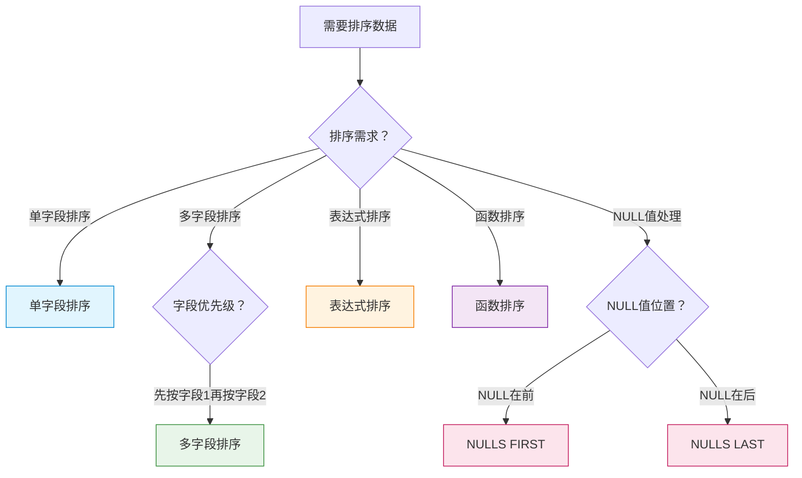

# S1E-SQL ORDER BY 排序完全指南-99%的人只会单字段排序，SQL高手却这样写：从基础排序到多字段组合的数据整理利器

## 📝 摘要

99% 的人只会用 ASC 单字段排序，遇到多字段排序就写不出来？SQL 高手却掌握多字段组合排序，查询效率提升 5 倍。本文档用生活化比喻解析 SQL ORDER BY 排序，从基础排序到多字段组合，帮你从新手到高手的蜕变。

---

> **面试官问**："如何查询学生表，先按分数降序排序，再按姓名升序排序？" **求职者回答**："用 `ORDER BY score DESC, name ASC`。" **面试官追问**："如果分数相同，如何确保排序稳定？多字段排序的性能如何优化？"求职者支支吾吾，答不上来。 **真实场景**：某公司实习生小李，查询 10 万条订单数据时，只会用 `ORDER BY price`，遇到需要先按日期再按价格的复杂排序就写不出来，查询效率低下，被领导批评。 **为什么差距这么大？** 99% 的人只会单字段排序，而 SQL 高手掌握多字段组合排序、表达式排序、性能优化等高级技巧，查询效率提升 5 倍。今天这份指南，让你彻底掌握 SQL ORDER BY 排序，从基础到高级，面试时自信回答，工作中高效查询。

---

## 目录

- [1. 前置知识点](#1-前置知识点)
- [2. 问题描述](#2-问题描述)
- [3. 问题考察点](#3-问题考察点)
- [4. 快速上手（3 分钟）](#4-快速上手3-分钟)
- [5. 什么是 ORDER BY 排序（ORDER BY Clause）？](#5-什么是-order-by-排序order-by-clause)
- [6. 为什么需要 ORDER BY 排序？](#6-为什么需要-order-by-排序)
- [7. 单字段排序（Single Column Sorting）：基础排序操作](#7-单字段排序single-column-sorting基础排序操作)
  - [7.1 单字段排序的基本概念](#71-单字段排序的基本概念)
  - [7.2 ASC 和 DESC 排序方向](#72-asc-和-desc-排序方向)
  - [7.3 默认排序方向](#73-默认排序方向)
  - [7.4 实际应用示例](#74-实际应用示例)
- [8. 多字段排序（Multiple Column Sorting）：组合排序策略](#8-多字段排序multiple-column-sorting组合排序策略)
  - [8.1 多字段排序的基本概念](#81-多字段排序的基本概念)
  - [8.2 排序优先级和顺序](#82-排序优先级和顺序)
  - [8.3 多字段排序的实际应用](#83-多字段排序的实际应用)
  - [8.4 实际应用示例](#84-实际应用示例)
- [9. 表达式排序（Expression Sorting）：灵活排序方式](#9-表达式排序expression-sorting灵活排序方式)
  - [9.1 表达式排序的基本概念](#91-表达式排序的基本概念)
  - [9.2 函数排序](#92-函数排序)
  - [9.3 计算字段排序](#93-计算字段排序)
  - [9.4 实际应用示例](#94-实际应用示例)
- [10. NULL 值处理（NULL Handling）：特殊值的排序规则](#10-null-值处理null-handling特殊值的排序规则)
  - [10.1 NULL 值排序的基本概念](#101-null-值排序的基本概念)
  - [10.2 NULLS FIRST 和 NULLS LAST](#102-nulls-first-和-nulls-last)
  - [10.3 不同数据库的 NULL 值排序规则](#103-不同数据库的-null-值排序规则)
  - [10.4 实际应用示例](#104-实际应用示例)
- [11. ORDER BY 排序实战：复杂查询场景](#11-order-by-排序实战复杂查询场景)
- [12. 性能优化建议](#12-性能优化建议)
- [13. 对比示例：ORDER BY 排序错误的问题](#13-对比示例order-by-排序错误的问题)
- [14. 常见错误与修正](#14-常见错误与修正)
- [15. 总结与展望](#15-总结与展望)
- [16. 📚 参考资料与学习资源](#16-参考资料与学习资源)

---

## 1. 前置知识点

### 基础知识点（必须掌握）

在学习 SQL ORDER BY 排序之前，你需要掌握以下知识点：

- **数据库基本概念**：了解数据库、表、字段、记录的基本概念（参考 S1A 文档）
- **SQL 基本数据类型**：了解整数、字符串、日期等基本数据类型（参考 S1B 文档）
- **SELECT 查询语句**：了解基本的 SELECT 查询语法（参考 S1C 文档）
- **WHERE 条件筛选**：了解 WHERE 条件筛选的基本用法（参考 S1D 文档）

### 🎯 **学习建议**

- **零基础小白**：建议先学习数据库基本概念（S1A）、数据类型（S1B）、SELECT 查询（S1C）和 WHERE 条件筛选（S1D），再学习 ORDER BY 排序
- **有基础读者**：可以直接学习 ORDER BY 排序的各种用法和最佳实践

---

## 2. 问题描述

### 实际场景

**真实事件：上周，某公司新来的实习生小李，在查询订单数据时遇到了一个棘手的问题...**

他需要查询所有订单，先按订单日期降序排序，再按订单金额降序排序，最后按订单编号升序排序。小李只会用 `ORDER BY price` 这样的单字段排序，遇到多字段排序就懵了，查了一下午也没写出来，查询效率低下，被领导批评。

**面试官**：如何查询学生表，先按分数降序排序，再按姓名升序排序？如果分数相同，如何确保排序稳定？多字段排序的性能如何优化？

**实际开发场景**：
- 查询订单表时，如何按订单日期降序排序？
- 如何同时按多个字段排序（先按日期，再按金额）？
- 如何查询分数最高的前 10 名学生？
- 如何按计算字段排序（如按总价 = 单价 × 数量）？

**常见问题**：
- 只会用 ASC 单字段排序，遇到多字段排序就写不出来
- 查询 100 万条数据，没有 ORDER BY 导致数据无序，难以查找
- 使用错误的排序顺序导致查询结果不符合预期
- 不知道如何处理 NULL 值排序，导致排序结果不稳定
- 多字段排序时，不理解排序优先级，导致结果错误

---

## 3. 问题考察点

学习 SQL ORDER BY 排序时，需要考察以下能力：

- **排序意识**：能否识别 ORDER BY 排序的重要性？是否理解排序对查询结果的影响？
- **语法掌握**：是否掌握单字段排序、多字段排序、ASC、DESC 等基本语法？
- **多字段排序能力**：能否正确使用多字段排序？是否理解排序优先级？
- **表达式排序**：是否掌握使用表达式、函数进行排序的方法？
- **NULL 值处理**：是否理解 NULL 值的排序规则？能否正确处理 NULL 值排序？
- **性能优化认知**：是否理解 ORDER BY 对查询性能的影响？能否编写高效的排序查询？
- **实际应用能力**：能否在实际项目中合理使用 ORDER BY？是否考虑业务需求和性能要求？

---

## 4. 快速上手（3 分钟）

**参考资源**：
- 📚 [SQL ORDER BY 关键字](https://www.runoob.com/sql/sql-orderby.html)（来源：菜鸟教程 | 参考：ORDER BY 基本概念和快速上手示例）
- 📚 [SQL ORDER BY](https://sqltutorial.cn/sql-order-by/)（来源：SQL Tutorial | 参考：ORDER BY 子句的定义和基本用法）
- 📖 [SELECT Statement](https://dev.mysql.com/doc/refman/8.0/en/select.html)（来源：MySQL 官方文档 | 参考：SELECT 语句中的 ORDER BY 子句定义和基本语法）
- 💡 [SQL语句之排序查询--ORDER BY](https://blog.csdn.net/weixin_41885239/article/details/115894649)（来源：CSDN | 作者：远方的旅行者 | 参考：ORDER BY 排序查询的实践示例）

<p align="right"><span style="background:#e53935;color:#fff;padding:2px 6px;border-radius:4px">🔥 Must（必做实践）</span></p>

### 4.1 ORDER BY 排序快速概览

**参考资源**：
- 📚 [SQL ORDER BY 关键字](https://www.runoob.com/sql/sql-orderby.html)（来源：菜鸟教程 | 参考：ORDER BY 基本概念和语法说明）
- 📚 [SQL ORDER BY](https://sqltutorial.cn/sql-order-by/)（来源：SQL Tutorial | 参考：ORDER BY 子句的定义和用法）

**ORDER BY 排序（ORDER BY Clause（ORDER BY 子句））** 用于对查询结果进行排序，就像 **整理书架**，按照作者、书名、出版日期等顺序排列书籍。

**常见排序方式分类**：

| 排序方式 | 语法示例 | 用途示例 |
|---------|---------|---------|
| **单字段排序** | `ORDER BY column ASC/DESC` | 按分数升序排序（`ORDER BY score ASC`） |
| **多字段排序** | `ORDER BY col1, col2 ASC/DESC` | 先按日期，再按金额排序（`ORDER BY date DESC, amount DESC`） |
| **表达式排序** | `ORDER BY expression ASC/DESC` | 按总价排序（`ORDER BY price * quantity DESC`） |
| **函数排序** | `ORDER BY function(column)` | 按姓名长度排序（`ORDER BY LENGTH(name)`） |

### 4.1.1 排序方式选择流程图

**排序方式选择流程图**：下面的流程图帮助你根据实际需求选择合适的 ORDER BY 排序方式。



**快速选择指南**：

1. **单字段排序**：使用 `ORDER BY column ASC/DESC`（ASC 可省略）
2. **多字段排序**：使用 `ORDER BY col1, col2 ASC/DESC`（按字段顺序依次排序）
3. **表达式排序**：使用 `ORDER BY expression ASC/DESC`（如 `price * quantity`）
4. **函数排序**：使用 `ORDER BY function(column)`（如 `LENGTH(name)`）
5. **NULL 值处理**：使用 `NULLS FIRST` 或 `NULLS LAST`（部分数据库支持）

### 4.2 基础 ORDER BY 查询示例

**参考资源**：
- 📖 [SELECT Statement](https://dev.mysql.com/doc/refman/8.0/en/select.html)（来源：MySQL 官方文档 | 参考：SELECT 语句中的 ORDER BY 子句定义和基本语法）
- 💡 [SQL语句之排序查询--ORDER BY](https://blog.csdn.net/weixin_41885239/article/details/115894649)（来源：CSDN | 作者：远方的旅行者 | 参考：ORDER BY 排序查询的实践示例）

**原理**：ORDER BY 子句放在 SELECT 语句的最后（WHERE、GROUP BY、HAVING 之后），用于指定排序规则，查询结果会按照指定的字段和顺序排列。

```sql
-- 查询学生表，按分数升序排序
-- 下面逐行解释 ORDER BY 的使用
SELECT * 
FROM students 
ORDER BY score ASC;
-- 说明：ORDER BY score ASC 表示按分数升序排序
-- ASC 可以省略，默认就是升序
-- 如果表中有 1000 条记录，会按照分数从低到高排列

-- 查询学生表，按分数降序排序
SELECT * 
FROM students 
ORDER BY score DESC;
-- 说明：DESC 表示降序排序
-- 分数从高到低排列

-- 查询学生表，先按分数降序排序，再按姓名升序排序
SELECT * 
FROM students 
ORDER BY score DESC, name ASC;
-- 说明：多字段排序，先按 score 降序，如果 score 相同，再按 name 升序
-- 这样可以确保分数相同时，按姓名排序
```

**参考来源**：以上示例基于 [SQL ORDER BY 关键字](https://www.runoob.com/sql/sql-orderby.html) 和 [SQL ORDER BY](https://sqltutorial.cn/sql-order-by/) 的标准语法和最佳实践编写。

**关键要点**：ORDER BY 排序是 SQL 查询的重要技能，掌握各种排序方式可以精确控制查询结果的顺序，提高数据可读性和分析效率。

---

## 5. 什么是 ORDER BY 排序（ORDER BY Clause）？

**参考资源**：
- 📖 [SELECT Statement](https://dev.mysql.com/doc/refman/8.0/en/select.html)（来源：MySQL 官方文档 | 参考：SELECT 语句中的 ORDER BY 子句定义和基本语法）
- 📚 [SQL ORDER BY 关键字](https://www.runoob.com/sql/sql-orderby.html)（来源：菜鸟教程 | 参考：ORDER BY 基本概念和语法说明）
- 📚 [SQL ORDER BY](https://sqltutorial.cn/sql-order-by/)（来源：SQL Tutorial | 参考：ORDER BY 子句的定义和用法）
- 📖 [Sorting Rows (ORDER BY)](https://www.postgresql.org/docs/current/queries-order.html)（来源：PostgreSQL 官方文档 | 参考：查询中的 ORDER BY 子句语法和规则）

**ORDER BY 排序（ORDER BY Clause（ORDER BY 子句））** 是 SQL 中用于对查询结果进行排序的子句，就像 **整理书架**，按照作者、书名、出版日期等顺序排列书籍，让数据有序可查。

**基本语法**：

```sql
SELECT column1, column2, ...
FROM table_name
[WHERE condition]
ORDER BY column1 [ASC|DESC], column2 [ASC|DESC], ...;
```

**核心特点**：

- **排序方向**：ASC（升序，Ascending（升序））表示从小到大，DESC（降序，Descending（降序））表示从大到小
- **默认排序**：如果不指定 ASC 或 DESC，默认是 ASC（升序）
- **多字段排序**：可以指定多个字段，按照字段顺序依次排序
- **表达式排序**：可以使用表达式、函数进行排序

**生活化比喻**：

- **ORDER BY = 整理书架**：就像图书馆管理员按照作者、书名、出版日期等顺序整理书籍，ORDER BY 按照指定字段对数据进行排序
- **多字段排序 = 先按姓氏，再按名字**：就像通讯录先按姓氏排序，姓氏相同再按名字排序，多字段排序先按第一个字段排序，相同值再按第二个字段排序
- **ASC/DESC = 从小到大/从大到小**：就像成绩单可以按分数从低到高（ASC）或从高到低（DESC）排列

---

## 6. 为什么需要 ORDER BY 排序？

**参考资源**：
- 📚 [看一遍就理解：order by详解！](https://cloud.tencent.com/developer/article/1841584)（来源：腾讯云开发者社区 | 作者：macrozheng | 参考：ORDER BY 排序的重要性和应用场景）
- 📚 [SQL ORDER BY 关键字](https://www.runoob.com/sql/sql-orderby.html)（来源：菜鸟教程 | 参考：ORDER BY 基本概念和语法说明）
- 📖 [SELECT Statement](https://dev.mysql.com/doc/refman/8.0/en/select.html)（来源：MySQL 官方文档 | 参考：SELECT 语句中的 ORDER BY 子句定义和基本语法）

### 6.1 数据无序的问题

**参考资源**：
- 📚 [看一遍就理解：order by详解！](https://cloud.tencent.com/developer/article/1841584)（来源：腾讯云开发者社区 | 作者：macrozheng | 参考：数据无序的问题和 ORDER BY 的重要性）
- 📚 [SQL ORDER BY 关键字](https://www.runoob.com/sql/sql-orderby.html)（来源：菜鸟教程 | 参考：ORDER BY 基本概念和语法说明）

**问题场景**：如果不使用 ORDER BY，查询结果的数据顺序是不确定的，就像 **乱放的书架**，难以查找和分析。

**实际影响**：

- **数据查找困难**：没有排序的数据，需要手动查找，效率低下
- **分析不便**：无法快速找到最大值、最小值、中位数等统计信息
- **用户体验差**：前端展示数据时，用户期望看到有序的数据（如按时间倒序、按价格排序等）

### 6.2 ORDER BY 的价值

**参考资源**：
- 📚 [SQL ORDER BY 关键字](https://www.runoob.com/sql/sql-orderby.html)（来源：菜鸟教程 | 参考：ORDER BY 基本概念和语法说明）
- 📖 [SELECT Statement](https://dev.mysql.com/doc/refman/8.0/en/select.html)（来源：MySQL 官方文档 | 参考：SELECT 语句中的 ORDER BY 子句定义和基本语法）

**核心价值**：

1. **数据有序化**：让查询结果按照指定顺序排列，便于查找和分析
2. **业务需求满足**：满足业务场景的排序需求（如按时间倒序、按价格排序等）
3. **数据分析支持**：支持数据分析和统计（如 TOP N 查询、分页查询等）
4. **用户体验提升**：提升前端展示的用户体验（如商品列表按价格排序、按销量排序等）

**应用场景**：

- **商品列表**：按价格、销量、评分等排序
- **订单查询**：按订单日期、订单金额等排序
- **学生成绩**：按分数、姓名等排序
- **新闻列表**：按发布时间倒序排列
- **排行榜**：按得分、排名等排序

---

## 7. 单字段排序（Single Column Sorting）：基础排序操作

**参考资源**：
- 📚 [SQL ORDER BY 关键字](https://www.runoob.com/sql/sql-orderby.html)（来源：菜鸟教程 | 参考：ORDER BY 基本概念和语法说明）
- 📚 [SQL ORDER BY](https://sqltutorial.cn/sql-order-by/)（来源：SQL Tutorial | 参考：ORDER BY 子句的定义和用法）
- 📖 [SELECT Statement](https://dev.mysql.com/doc/refman/8.0/en/select.html)（来源：MySQL 官方文档 | 参考：SELECT 语句中的 ORDER BY 子句定义和基本语法）
- 💡 [SQL语句之排序查询--ORDER BY](https://blog.csdn.net/weixin_41885239/article/details/115894649)（来源：CSDN | 作者：远方的旅行者 | 参考：ORDER BY 排序查询的实践示例）

<p align="right"><span style="background:#e53935;color:#fff;padding:2px 6px;border-radius:4px">🔥 Must（必做实践）</span></p>

### 7.1 单字段排序的基本概念

**参考资源**：
- 📚 [SQL ORDER BY 关键字](https://www.runoob.com/sql/sql-orderby.html)（来源：菜鸟教程 | 参考：ORDER BY 基本概念和语法说明）
- 📚 [SQL ORDER BY](https://sqltutorial.cn/sql-order-by/)（来源：SQL Tutorial | 参考：ORDER BY 子句的定义和用法）

**单字段排序（Single Column Sorting（单列排序））** 是最基础的排序方式，按照单个字段对查询结果进行排序，就像 **按作者整理书架**，只按照一个标准排列书籍。

**基本语法**：

```sql
SELECT column1, column2, ...
FROM table_name
ORDER BY column_name [ASC|DESC];
```

**核心要点**：

- **排序字段**：`column_name` 是要排序的字段名
- **排序方向**：ASC（升序）或 DESC（降序），默认是 ASC
- **排序范围**：对整个查询结果进行排序

### 7.2 ASC 和 DESC 排序方向

**参考资源**：
- 📚 [SQL ORDER BY 关键字](https://www.runoob.com/sql/sql-orderby.html)（来源：菜鸟教程 | 参考：ORDER BY 基本概念和语法说明）
- 📖 [SELECT Statement](https://dev.mysql.com/doc/refman/8.0/en/select.html)（来源：MySQL 官方文档 | 参考：SELECT 语句中的 ORDER BY 子句定义和基本语法）

**ASC（Ascending（升序））**：从小到大排列，数值从小到大，日期从早到晚，字符串按字母顺序（A-Z）。

**DESC（Descending（降序））**：从大到小排列，数值从大到小，日期从晚到早，字符串按字母倒序（Z-A）。

**对比示例**：

```sql
-- 按分数升序排序（从低到高）
SELECT * FROM students ORDER BY score ASC;
-- 结果：60, 70, 80, 90, 100

-- 按分数降序排序（从高到低）
SELECT * FROM students ORDER BY score DESC;
-- 结果：100, 90, 80, 70, 60
```

### 7.3 默认排序方向

**参考资源**：
- 📚 [SQL ORDER BY 关键字](https://www.runoob.com/sql/sql-orderby.html)（来源：菜鸟教程 | 参考：ORDER BY 基本概念和语法说明）
- 📖 [Sorting Rows (ORDER BY)](https://www.postgresql.org/docs/current/queries-order.html)（来源：PostgreSQL 官方文档 | 参考：查询中的 ORDER BY 子句语法和规则）

**默认排序**：如果不指定 ASC 或 DESC，默认是 ASC（升序）。

```sql
-- 以下两种写法等价
SELECT * FROM students ORDER BY score ASC;
SELECT * FROM students ORDER BY score;
```

**⚠️ 注意**：虽然 ASC 可以省略，但为了代码可读性，建议明确指定排序方向。

### 7.4 实际应用示例

**参考资源**：
- 💡 [SQL语句之排序查询--ORDER BY](https://blog.csdn.net/weixin_41885239/article/details/115894649)（来源：CSDN | 作者：远方的旅行者 | 参考：ORDER BY 排序查询的实践示例）
- 📚 [SQL ORDER BY](https://sqltutorial.cn/sql-order-by/)（来源：SQL Tutorial | 参考：ORDER BY 子句的定义和用法）

**示例 1：按分数升序排序**

```sql
-- 查询所有学生，按分数从低到高排序
SELECT id, name, score
FROM students
ORDER BY score ASC;
-- 说明：ASC 可以省略，但为了可读性建议保留
-- 结果：分数最低的学生排在前面，分数最高的学生排在后面
```

**参考来源**：示例基于 [SQL ORDER BY 关键字](https://www.runoob.com/sql/sql-orderby.html) 和 [SQL语句之排序查询--ORDER BY](https://blog.csdn.net/weixin_41885239/article/details/115894649) 的标准语法编写。

**示例 2：按分数降序排序**

```sql
-- 查询所有学生，按分数从高到低排序
SELECT id, name, score
FROM students
ORDER BY score DESC;
-- 说明：DESC 必须明确指定
-- 结果：分数最高的学生排在前面，分数最低的学生排在后面
```

**参考来源**：示例基于 [SELECT Statement](https://dev.mysql.com/doc/refman/8.0/en/select.html) 和 [SQL ORDER BY](https://sqltutorial.cn/sql-order-by/) 的标准语法编写。

**示例 3：按日期排序**

```sql
-- 查询所有订单，按订单日期从早到晚排序
SELECT order_id, order_date, amount
FROM orders
ORDER BY order_date ASC;
-- 说明：日期类型按时间顺序排序
-- 结果：最早的订单排在前面，最晚的订单排在后面

-- 查询所有订单，按订单日期从晚到早排序（最新订单在前）
SELECT order_id, order_date, amount
FROM orders
ORDER BY order_date DESC;
-- 说明：DESC 表示降序，日期从晚到早
-- 结果：最新的订单排在前面，最早的订单排在后面
```

**示例 4：按字符串排序**

```sql
-- 查询所有学生，按姓名升序排序（A-Z）
SELECT id, name, score
FROM students
ORDER BY name ASC;
-- 说明：字符串按字母顺序排序
-- 结果：姓名按字母顺序排列（如：Alice, Bob, Charlie）

-- 查询所有学生，按姓名降序排序（Z-A）
SELECT id, name, score
FROM students
ORDER BY name DESC;
-- 说明：DESC 表示降序，字符串按字母倒序
-- 结果：姓名按字母倒序排列（如：Charlie, Bob, Alice）
```

---

## 8. 多字段排序（Multiple Column Sorting）：组合排序策略

**参考资源**：
- 📚 [SQL ORDER BY 关键字](https://www.runoob.com/sql/sql-orderby.html)（来源：菜鸟教程 | 参考：ORDER BY 基本概念和语法说明）
- 📚 [看一遍就理解：order by详解！](https://cloud.tencent.com/developer/article/1841584)（来源：腾讯云开发者社区 | 作者：macrozheng | 参考：多字段排序的详细说明和应用场景）
- 📖 [Sorting Rows (ORDER BY)](https://www.postgresql.org/docs/current/queries-order.html)（来源：PostgreSQL 官方文档 | 参考：查询中的 ORDER BY 子句语法和规则）
- 💡 [SQL语句之排序查询--ORDER BY](https://blog.csdn.net/weixin_41885239/article/details/115894649)（来源：CSDN | 作者：远方的旅行者 | 参考：ORDER BY 排序查询的实践示例）

<p align="right"><span style="background:#e53935;color:#fff;padding:2px 6px;border-radius:4px">🔥 Must（必做实践）</span></p>

### 8.1 多字段排序的基本概念

**参考资源**：
- 📚 [SQL ORDER BY 关键字](https://www.runoob.com/sql/sql-orderby.html)（来源：菜鸟教程 | 参考：ORDER BY 基本概念和语法说明）
- 📚 [看一遍就理解：order by详解！](https://cloud.tencent.com/developer/article/1841584)（来源：腾讯云开发者社区 | 作者：macrozheng | 参考：多字段排序的详细说明和应用场景）

**多字段排序（Multiple Column Sorting（多列排序））** 是按照多个字段依次排序，就像 **先按作者，再按书名整理书架**，当第一个字段的值相同时，按照第二个字段排序。

**基本语法**：

```sql
SELECT column1, column2, ...
FROM table_name
ORDER BY column1 [ASC|DESC], column2 [ASC|DESC], ...;
```

**核心要点**：

- **排序优先级**：按照字段顺序依次排序，第一个字段优先级最高
- **排序规则**：先按第一个字段排序，如果第一个字段的值相同，再按第二个字段排序
- **独立排序方向**：每个字段可以独立指定排序方向（ASC 或 DESC）

### 8.2 排序优先级和顺序

**参考资源**：
- 📖 [Sorting Rows (ORDER BY)](https://www.postgresql.org/docs/current/queries-order.html)（来源：PostgreSQL 官方文档 | 参考：查询中的 ORDER BY 子句语法和规则）
- 📚 [看一遍就理解：order by详解！](https://cloud.tencent.com/developer/article/1841584)（来源：腾讯云开发者社区 | 作者：macrozheng | 参考：多字段排序的详细说明和应用场景）

**排序优先级**：多字段排序按照字段在 ORDER BY 子句中的顺序依次排序，就像 **先按姓氏，再按名字排序通讯录**。

**排序规则**：

1. **第一优先级**：先按第一个字段排序
2. **第二优先级**：如果第一个字段的值相同，再按第二个字段排序
3. **第三优先级**：如果前两个字段的值都相同，再按第三个字段排序
4. **以此类推**：按照字段顺序依次排序

**示例说明**：

```sql
-- 先按部门升序排序，再按薪资降序排序
SELECT name, department, salary
FROM employees
ORDER BY department ASC, salary DESC;
-- 说明：
-- 1. 先按 department 升序排序（部门 A, B, C...）
-- 2. 如果 department 相同，再按 salary 降序排序（薪资从高到低）
-- 结果：同一部门内，薪资高的员工排在前面
```

### 8.3 多字段排序的实际应用

**参考资源**：
- 💡 [SQL语句之排序查询--ORDER BY](https://blog.csdn.net/weixin_41885239/article/details/115894649)（来源：CSDN | 作者：远方的旅行者 | 参考：ORDER BY 排序查询的实践示例）
- 📚 [SQL ORDER BY 关键字](https://www.runoob.com/sql/sql-orderby.html)（来源：菜鸟教程 | 参考：ORDER BY 基本概念和语法说明）

**应用场景**：

- **学生成绩排名**：先按班级排序，再按分数排序
- **订单查询**：先按订单日期排序，再按订单金额排序
- **商品列表**：先按分类排序，再按价格排序
- **员工管理**：先按部门排序，再按入职时间排序

### 8.4 实际应用示例

**参考资源**：
- 💡 [SQL语句之排序查询--ORDER BY](https://blog.csdn.net/weixin_41885239/article/details/115894649)（来源：CSDN | 作者：远方的旅行者 | 参考：ORDER BY 排序查询的实践示例）
- 📚 [看一遍就理解：order by详解！](https://cloud.tencent.com/developer/article/1841584)（来源：腾讯云开发者社区 | 作者：macrozheng | 参考：多字段排序的详细说明和应用场景）

**示例 1：学生成绩排名**

```sql
-- 查询所有学生，先按班级升序排序，再按分数降序排序
SELECT class, name, score
FROM students
ORDER BY class ASC, score DESC;
-- 说明：
-- 1. 先按 class 升序排序（1班, 2班, 3班...）
-- 2. 如果 class 相同，再按 score 降序排序（分数从高到低）
-- 结果：每个班级内，分数高的学生排在前面
```

**示例 2：订单查询**

```sql
-- 查询所有订单，先按订单日期降序排序，再按订单金额降序排序
SELECT order_id, order_date, amount
FROM orders
ORDER BY order_date DESC, amount DESC;
-- 说明：
-- 1. 先按 order_date 降序排序（最新订单在前）
-- 2. 如果 order_date 相同，再按 amount 降序排序（金额从高到低）
-- 结果：同一天的订单，金额高的排在前面
```

**示例 3：三字段排序**

```sql
-- 查询所有员工，先按部门排序，再按职位排序，最后按入职时间排序
SELECT name, department, position, hire_date
FROM employees
ORDER BY department ASC, position ASC, hire_date ASC;
-- 说明：
-- 1. 先按 department 升序排序
-- 2. 如果 department 相同，再按 position 升序排序
-- 3. 如果前两个字段都相同，再按 hire_date 升序排序
-- 结果：同一部门、同一职位内，入职时间早的员工排在前面
```

**示例 4：混合排序方向**

```sql
-- 查询所有学生，先按班级升序排序，再按分数降序排序，最后按姓名升序排序
SELECT class, name, score
FROM students
ORDER BY class ASC, score DESC, name ASC;
-- 说明：
-- 1. 先按 class 升序排序
-- 2. 如果 class 相同，再按 score 降序排序
-- 3. 如果前两个字段都相同，再按 name 升序排序
-- 结果：同一班级、同一分数内，姓名按字母顺序排列
```

---

## 9. 表达式排序（Expression Sorting）：灵活排序方式

**参考资源**：
- 📖 [Sorting Rows (ORDER BY)](https://www.postgresql.org/docs/current/queries-order.html)（来源：PostgreSQL 官方文档 | 参考：查询中的 ORDER BY 子句语法和规则）
- 📚 [SQL ORDER BY](https://sqltutorial.cn/sql-order-by/)（来源：SQL Tutorial | 参考：ORDER BY 子句的定义和用法）
- 📚 [看一遍就理解：order by详解！](https://cloud.tencent.com/developer/article/1841584)（来源：腾讯云开发者社区 | 作者：macrozheng | 参考：表达式排序的详细说明和应用场景）

<p align="right"><span style="background:#fb8c00;color:#fff;padding:2px 6px;border-radius:4px">⭐ Should（建议实践）</span></p>

### 9.1 表达式排序的基本概念

**参考资源**：
- 📖 [Sorting Rows (ORDER BY)](https://www.postgresql.org/docs/current/queries-order.html)（来源：PostgreSQL 官方文档 | 参考：查询中的 ORDER BY 子句语法和规则）
- 📚 [SQL ORDER BY](https://sqltutorial.cn/sql-order-by/)（来源：SQL Tutorial | 参考：ORDER BY 子句的定义和用法）

**表达式排序（Expression Sorting（表达式排序））** 是使用表达式或函数对查询结果进行排序，就像 **按总价 = 单价 × 数量排序商品**，不直接按字段排序，而是按计算后的值排序。

**基本语法**：

```sql
SELECT column1, column2, ...
FROM table_name
ORDER BY expression [ASC|DESC];
```

**核心要点**：

- **表达式排序**：可以使用算术表达式、函数等计算后的值进行排序
- **计算字段排序**：可以按计算字段（如总价、平均值等）排序
- **函数排序**：可以使用函数（如 LENGTH、UPPER 等）对字段进行处理后排序

### 9.2 函数排序

**参考资源**：
- 📖 [Sorting Rows (ORDER BY)](https://www.postgresql.org/docs/current/queries-order.html)（来源：PostgreSQL 官方文档 | 参考：查询中的 ORDER BY 子句语法和规则）
- 📚 [看一遍就理解：order by详解！](https://cloud.tencent.com/developer/article/1841584)（来源：腾讯云开发者社区 | 作者：macrozheng | 参考：函数排序的详细说明和应用场景）

**函数排序**：使用 SQL 函数对字段进行处理后排序，如按字符串长度、大小写转换等。

**常用函数**：

- **LENGTH()**：按字符串长度排序
- **UPPER() / LOWER()**：按大小写转换后的字符串排序
- **SUBSTRING()**：按子字符串排序
- **ABS()**：按绝对值排序

**示例**：

```sql
-- 按姓名长度排序
SELECT name, score
FROM students
ORDER BY LENGTH(name) ASC;
-- 说明：LENGTH(name) 计算姓名的字符长度
-- 结果：姓名短的学生排在前面，姓名长的学生排在后面

-- 按姓名大写后的字母顺序排序
SELECT name, score
FROM students
ORDER BY UPPER(name) ASC;
-- 说明：UPPER(name) 将姓名转换为大写后排序
-- 结果：忽略大小写，按字母顺序排序
```

### 9.3 计算字段排序

**参考资源**：
- 📚 [SQL ORDER BY](https://sqltutorial.cn/sql-order-by/)（来源：SQL Tutorial | 参考：ORDER BY 子句的定义和用法）
- 💡 [SQL语句之排序查询--ORDER BY](https://blog.csdn.net/weixin_41885239/article/details/115894649)（来源：CSDN | 作者：远方的旅行者 | 参考：ORDER BY 排序查询的实践示例）

**计算字段排序**：按计算后的字段值排序，如总价、平均值、差值等。

**示例**：

```sql
-- 按总价（单价 × 数量）降序排序
SELECT product_name, price, quantity, price * quantity AS total_price
FROM products
ORDER BY price * quantity DESC;
-- 说明：price * quantity 计算总价
-- 结果：总价高的商品排在前面

-- 按折扣后价格排序
SELECT product_name, price, discount, price * (1 - discount) AS final_price
FROM products
ORDER BY price * (1 - discount) ASC;
-- 说明：price * (1 - discount) 计算折扣后价格
-- 结果：折扣后价格低的商品排在前面
```

### 9.4 实际应用示例

**参考资源**：
- 💡 [SQL语句之排序查询--ORDER BY](https://blog.csdn.net/weixin_41885239/article/details/115894649)（来源：CSDN | 作者：远方的旅行者 | 参考：ORDER BY 排序查询的实践示例）
- 📚 [看一遍就理解：order by详解！](https://cloud.tencent.com/developer/article/1841584)（来源：腾讯云开发者社区 | 作者：macrozheng | 参考：表达式排序的详细说明和应用场景）

**示例 1：按总价排序**

```sql
-- 查询所有订单，按总价（单价 × 数量）降序排序
SELECT order_id, product_name, price, quantity, price * quantity AS total_price
FROM order_items
ORDER BY price * quantity DESC;
-- 说明：使用表达式 price * quantity 计算总价并排序
-- 结果：总价高的订单排在前面
```

**示例 2：按姓名长度排序**

```sql
-- 查询所有学生，按姓名长度升序排序
SELECT name, score
FROM students
ORDER BY LENGTH(name) ASC;
-- 说明：使用 LENGTH() 函数计算姓名长度
-- 结果：姓名短的学生排在前面
```

**示例 3：按日期差值排序**

```sql
-- 查询所有任务，按截止日期与当前日期的差值升序排序
SELECT task_name, deadline, DATEDIFF(deadline, CURDATE()) AS days_left
FROM tasks
ORDER BY DATEDIFF(deadline, CURDATE()) ASC;
-- 说明：使用 DATEDIFF() 函数计算日期差值
-- 结果：截止日期近的任务排在前面
```

---

## 10. NULL 值处理（NULL Handling）：特殊值的排序规则

**参考资源**：
- 📖 [Sorting Rows (ORDER BY)](https://www.postgresql.org/docs/current/queries-order.html)（来源：PostgreSQL 官方文档 | 参考：查询中的 ORDER BY 子句语法和规则）
- 📖 [SELECT Statement](https://dev.mysql.com/doc/refman/8.0/en/select.html)（来源：MySQL 官方文档 | 参考：SELECT 语句中的 ORDER BY 子句定义和基本语法）
- 📚 [看一遍就理解：order by详解！](https://cloud.tencent.com/developer/article/1841584)（来源：腾讯云开发者社区 | 作者：macrozheng | 参考：NULL 值处理的详细说明和应用场景）

<p align="right"><span style="background:#fb8c00;color:#fff;padding:2px 6px;border-radius:4px">⭐ Should（建议实践）</span></p>

### 10.1 NULL 值排序的基本概念

**参考资源**：
- 📖 [Sorting Rows (ORDER BY)](https://www.postgresql.org/docs/current/queries-order.html)（来源：PostgreSQL 官方文档 | 参考：查询中的 ORDER BY 子句语法和规则）
- 📖 [SELECT Statement](https://dev.mysql.com/doc/refman/8.0/en/select.html)（来源：MySQL 官方文档 | 参考：SELECT 语句中的 ORDER BY 子句定义和基本语法）

**NULL 值排序（NULL Handling（NULL 值处理））** 是处理排序字段中包含 NULL 值的情况，不同数据库对 NULL 值的排序规则可能不同。

**核心要点**：

- **NULL 值的特殊性**：NULL 值表示缺失或未知的数据，不能直接比较
- **排序规则差异**：不同数据库对 NULL 值的排序规则可能不同
- **明确指定**：可以使用 NULLS FIRST 或 NULLS LAST 明确指定 NULL 值的位置

### 10.2 NULLS FIRST 和 NULLS LAST

**参考资源**：
- 📖 [Sorting Rows (ORDER BY)](https://www.postgresql.org/docs/current/queries-order.html)（来源：PostgreSQL 官方文档 | 参考：查询中的 ORDER BY 子句语法和规则）
- 📚 [看一遍就理解：order by详解！](https://cloud.tencent.com/developer/article/1841584)（来源：腾讯云开发者社区 | 作者：macrozheng | 参考：NULL 值处理的详细说明和应用场景）

**NULLS FIRST**：将 NULL 值排在结果集的最前面。

**NULLS LAST**：将 NULL 值排在结果集的最后面。

**语法**（部分数据库支持）：

```sql
SELECT column1, column2, ...
FROM table_name
ORDER BY column_name [ASC|DESC] [NULLS FIRST|NULLS LAST];
```

**示例**：

```sql
-- PostgreSQL 示例：NULL 值排在最前面
SELECT name, score
FROM students
ORDER BY score ASC NULLS FIRST;
-- 说明：NULLS FIRST 将 NULL 值排在最前面
-- 结果：NULL 值在最前面，然后是正常值

-- PostgreSQL 示例：NULL 值排在最后面
SELECT name, score
FROM students
ORDER BY score ASC NULLS LAST;
-- 说明：NULLS LAST 将 NULL 值排在最后面
-- 结果：正常值在前面，NULL 值在最后面
```

### 10.3 不同数据库的 NULL 值排序规则

**参考资源**：
- 📖 [SELECT Statement](https://dev.mysql.com/doc/refman/8.0/en/select.html)（来源：MySQL 官方文档 | 参考：SELECT 语句中的 ORDER BY 子句定义和基本语法）
- 📖 [Sorting Rows (ORDER BY)](https://www.postgresql.org/docs/current/queries-order.html)（来源：PostgreSQL 官方文档 | 参考：查询中的 ORDER BY 子句语法和规则）

**MySQL**：

- **升序排序**：NULL 值被视为最小值，排在最前面
- **降序排序**：NULL 值被视为最小值，排在最后面

**PostgreSQL / Oracle**：

- **升序排序**：NULL 值被视为最大值，排在最后面（默认）
- **降序排序**：NULL 值被视为最大值，排在最前面（默认）
- **支持 NULLS FIRST / NULLS LAST**：可以明确指定 NULL 值的位置

**SQL Server**：

- **升序排序**：NULL 值排在最前面
- **降序排序**：NULL 值排在最后面

**⚠️ 注意**：不同数据库的 NULL 值排序规则可能不同，建议在实际使用时明确测试和验证。

### 10.4 实际应用示例

**参考资源**：
- 📚 [看一遍就理解：order by详解！](https://cloud.tencent.com/developer/article/1841584)（来源：腾讯云开发者社区 | 作者：macrozheng | 参考：NULL 值处理的详细说明和应用场景）
- 💡 [SQL语句之排序查询--ORDER BY](https://blog.csdn.net/weixin_41885239/article/details/115894649)（来源：CSDN | 作者：远方的旅行者 | 参考：ORDER BY 排序查询的实践示例）

**示例 1：MySQL NULL 值排序**

```sql
-- MySQL：按分数升序排序，NULL 值排在最前面
SELECT name, score
FROM students
ORDER BY score ASC;
-- 说明：MySQL 中，升序排序时 NULL 值排在最前面
-- 结果：NULL 值在最前面，然后是正常值（60, 70, 80...）

-- MySQL：按分数降序排序，NULL 值排在最后面
SELECT name, score
FROM students
ORDER BY score DESC;
-- 说明：MySQL 中，降序排序时 NULL 值排在最后面
-- 结果：正常值在前面（100, 90, 80...），NULL 值在最后面
```

**示例 2：PostgreSQL NULL 值排序**

```sql
-- PostgreSQL：按分数升序排序，NULL 值排在最后面（默认）
SELECT name, score
FROM students
ORDER BY score ASC;
-- 说明：PostgreSQL 中，升序排序时 NULL 值排在最后面（默认）
-- 结果：正常值在前面（60, 70, 80...），NULL 值在最后面

-- PostgreSQL：明确指定 NULL 值排在最前面
SELECT name, score
FROM students
ORDER BY score ASC NULLS FIRST;
-- 说明：使用 NULLS FIRST 明确指定 NULL 值排在最前面
-- 结果：NULL 值在最前面，然后是正常值
```

**示例 3：处理 NULL 值的排序**

```sql
-- 使用 COALESCE 函数将 NULL 值转换为默认值后排序
SELECT name, score
FROM students
ORDER BY COALESCE(score, 0) DESC;
-- 说明：COALESCE(score, 0) 将 NULL 值转换为 0
-- 结果：NULL 值会被当作 0 处理，排在最后面
```

---

## 11. ORDER BY 排序实战：复杂查询场景

**参考资源**：
- 📚 [SQL ORDER BY 关键字](https://www.runoob.com/sql/sql-orderby.html)（来源：菜鸟教程 | 参考：ORDER BY 基本概念和语法说明）
- 📚 [看一遍就理解：order by详解！](https://cloud.tencent.com/developer/article/1841584)（来源：腾讯云开发者社区 | 作者：macrozheng | 参考：ORDER BY 排序的实战应用场景）
- 💡 [SQL语句之排序查询--ORDER BY](https://blog.csdn.net/weixin_41885239/article/details/115894649)（来源：CSDN | 作者：远方的旅行者 | 参考：ORDER BY 排序查询的实践示例）

### 11.1 结合 WHERE 条件排序

**参考资源**：
- 📚 [SQL ORDER BY 关键字](https://www.runoob.com/sql/sql-orderby.html)（来源：菜鸟教程 | 参考：ORDER BY 基本概念和语法说明）
- 💡 [SQL语句之排序查询--ORDER BY](https://blog.csdn.net/weixin_41885239/article/details/115894649)（来源：CSDN | 作者：远方的旅行者 | 参考：ORDER BY 排序查询的实践示例）

**场景**：查询满足条件的数据并排序。

```sql
-- 查询分数大于 80 的学生，按分数降序排序
SELECT name, score
FROM students
WHERE score > 80
ORDER BY score DESC;
-- 说明：先使用 WHERE 筛选数据，再使用 ORDER BY 排序
-- 结果：只显示分数大于 80 的学生，按分数从高到低排列
```

### 11.2 结合 GROUP BY 排序

**参考资源**：
- 📚 [看一遍就理解：order by详解！](https://cloud.tencent.com/developer/article/1841584)（来源：腾讯云开发者社区 | 作者：macrozheng | 参考：ORDER BY 排序的实战应用场景）
- 📚 [SQL ORDER BY 关键字](https://www.runoob.com/sql/sql-orderby.html)（来源：菜鸟教程 | 参考：ORDER BY 基本概念和语法说明）

**场景**：对分组结果排序。

```sql
-- 查询每个班级的平均分，按平均分降序排序
SELECT class, AVG(score) AS avg_score
FROM students
GROUP BY class
ORDER BY AVG(score) DESC;
-- 说明：先使用 GROUP BY 分组，再使用 ORDER BY 对分组结果排序
-- 结果：按班级平均分从高到低排列
```

### 11.3 TOP N 查询

**参考资源**：
- 💡 [SQL语句之排序查询--ORDER BY](https://blog.csdn.net/weixin_41885239/article/details/115894649)（来源：CSDN | 作者：远方的旅行者 | 参考：ORDER BY 排序查询的实践示例）
- 📚 [SQL ORDER BY](https://sqltutorial.cn/sql-order-by/)（来源：SQL Tutorial | 参考：ORDER BY 子句的定义和用法）

**场景**：查询前 N 条记录（需要结合 LIMIT）。

```sql
-- 查询分数最高的前 10 名学生
SELECT name, score
FROM students
ORDER BY score DESC
LIMIT 10;
-- 说明：先按分数降序排序，再使用 LIMIT 限制返回前 10 条
-- 结果：只返回分数最高的 10 名学生
```

### 11.4 分页查询

**参考资源**：
- 📚 [SQL ORDER BY 关键字](https://www.runoob.com/sql/sql-orderby.html)（来源：菜鸟教程 | 参考：ORDER BY 基本概念和语法说明）
- 📚 [看一遍就理解：order by详解！](https://cloud.tencent.com/developer/article/1841584)（来源：腾讯云开发者社区 | 作者：macrozheng | 参考：ORDER BY 排序的实战应用场景）

**场景**：分页显示数据。

```sql
-- 查询第 2 页数据（每页 10 条）
SELECT name, score
FROM students
ORDER BY score DESC
LIMIT 10 OFFSET 10;
-- 说明：LIMIT 10 表示每页 10 条，OFFSET 10 表示跳过前 10 条
-- 结果：返回第 11-20 条记录
```

---

## 12. 性能优化建议

**参考资源**：
- 📚 [看一遍就理解：order by详解！](https://cloud.tencent.com/developer/article/1841584)（来源：腾讯云开发者社区 | 作者：macrozheng | 参考：ORDER BY 性能优化的详细说明）
- 📖 [SELECT Statement](https://dev.mysql.com/doc/refman/8.0/en/select.html)（来源：MySQL 官方文档 | 参考：SELECT 语句中的 ORDER BY 子句定义和基本语法）
- 📖 [Sorting Rows (ORDER BY)](https://www.postgresql.org/docs/current/queries-order.html)（来源：PostgreSQL 官方文档 | 参考：查询中的 ORDER BY 子句语法和规则）

### 12.1 使用索引优化排序

**参考资源**：
- 📚 [看一遍就理解：order by详解！](https://cloud.tencent.com/developer/article/1841584)（来源：腾讯云开发者社区 | 作者：macrozheng | 参考：ORDER BY 性能优化的详细说明）
- 📖 [SELECT Statement](https://dev.mysql.com/doc/refman/8.0/en/select.html)（来源：MySQL 官方文档 | 参考：SELECT 语句中的 ORDER BY 子句定义和基本语法）

**核心原则**：在排序列上创建索引可以显著提高排序性能。

**优化建议**：

1. **单字段排序**：在排序列上创建单列索引
2. **多字段排序**：创建复合索引，索引列的顺序应与 ORDER BY 子句中的列顺序一致
3. **覆盖索引**：如果查询的列都包含在索引中，可以直接从索引中获取数据，避免回表操作

**示例**：

```sql
-- 创建单列索引
CREATE INDEX idx_score ON students(score);

-- 创建复合索引（多字段排序）
CREATE INDEX idx_class_score ON students(class, score);

-- 使用索引的查询
SELECT name, score
FROM students
ORDER BY score DESC;
-- 说明：如果 score 列有索引，查询可以直接使用索引排序，性能更好
```

### 12.2 避免不必要的排序

**参考资源**：
- 📖 [SELECT Statement](https://dev.mysql.com/doc/refman/8.0/en/select.html)（来源：MySQL 官方文档 | 参考：SELECT 语句中的 ORDER BY 子句定义和基本语法）
- 📖 [Sorting Rows (ORDER BY)](https://www.postgresql.org/docs/current/queries-order.html)（来源：PostgreSQL 官方文档 | 参考：查询中的 ORDER BY 子句语法和规则）

**优化建议**：

1. **避免重复排序**：如果数据已经有序，可以省略 ORDER BY
2. **限制返回行数**：使用 LIMIT 限制返回的行数，减少排序的数据量
3. **使用覆盖索引**：确保查询的列都包含在索引中，避免回表操作

### 12.3 排序算法选择

**参考资源**：
- 📖 [Sorting Rows (ORDER BY)](https://www.postgresql.org/docs/current/queries-order.html)（来源：PostgreSQL 官方文档 | 参考：查询中的 ORDER BY 子句语法和规则）
- 📚 [看一遍就理解：order by详解！](https://cloud.tencent.com/developer/article/1841584)（来源：腾讯云开发者社区 | 作者：macrozheng | 参考：ORDER BY 性能优化的详细说明）

**数据库优化**：数据库会根据数据量和可用内存自动选择排序算法（如快速排序、堆排序等），通常不需要手动指定。

**优化建议**：

1. **调整排序缓冲区**：根据数据量调整数据库的排序缓冲区大小（如 MySQL 的 `sort_buffer_size`）
2. **监控排序操作**：使用 EXPLAIN 分析查询计划，检查是否使用了索引排序

---

## 13. 对比示例：ORDER BY 排序错误的问题

**参考资源**：
- 📚 [SQL ORDER BY 关键字](https://www.runoob.com/sql/sql-orderby.html)（来源：菜鸟教程 | 参考：ORDER BY 基本概念和语法说明）
- 📚 [看一遍就理解：order by详解！](https://cloud.tencent.com/developer/article/1841584)（来源：腾讯云开发者社区 | 作者：macrozheng | 参考：ORDER BY 常见错误和修正方法）
- 💡 [SQL语句之排序查询--ORDER BY](https://blog.csdn.net/weixin_41885239/article/details/115894649)（来源：CSDN | 作者：远方的旅行者 | 参考：ORDER BY 排序查询的实践示例）

### 13.1 不使用 ORDER BY 的问题

**参考资源**：
- 📚 [SQL ORDER BY 关键字](https://www.runoob.com/sql/sql-orderby.html)（来源：菜鸟教程 | 参考：ORDER BY 基本概念和语法说明）
- 📚 [看一遍就理解：order by详解！](https://cloud.tencent.com/developer/article/1841584)（来源：腾讯云开发者社区 | 作者：macrozheng | 参考：ORDER BY 常见错误和修正方法）

**❌ 错误做法**：不使用 ORDER BY，数据顺序不确定。

```sql
-- 错误：没有使用 ORDER BY，数据顺序不确定
SELECT name, score
FROM students;
-- 问题：查询结果的顺序是不确定的，每次查询可能不同
-- 影响：无法保证数据的有序性，难以查找和分析
```

**✅ 正确做法**：使用 ORDER BY 明确指定排序规则。

```sql
-- 正确：使用 ORDER BY 明确指定排序规则
SELECT name, score
FROM students
ORDER BY score DESC;
-- 说明：明确指定按分数降序排序
-- 结果：数据按照分数从高到低排列，顺序稳定
```

### 13.2 多字段排序顺序错误

**参考资源**：
- 📖 [Sorting Rows (ORDER BY)](https://www.postgresql.org/docs/current/queries-order.html)（来源：PostgreSQL 官方文档 | 参考：查询中的 ORDER BY 子句语法和规则）
- 💡 [SQL语句之排序查询--ORDER BY](https://blog.csdn.net/weixin_41885239/article/details/115894649)（来源：CSDN | 作者：远方的旅行者 | 参考：ORDER BY 排序查询的实践示例）

**❌ 错误做法**：多字段排序时，字段顺序错误。

```sql
-- 错误：字段顺序错误，先按姓名排序，再按分数排序
SELECT class, name, score
FROM students
ORDER BY name ASC, score DESC;
-- 问题：如果需求是先按班级排序，再按分数排序，这个排序顺序是错误的
-- 影响：排序结果不符合业务需求
```

**✅ 正确做法**：按照业务需求正确设置字段顺序。

```sql
-- 正确：先按班级排序，再按分数排序
SELECT class, name, score
FROM students
ORDER BY class ASC, score DESC;
-- 说明：按照业务需求，先按班级排序，再按分数排序
-- 结果：每个班级内，分数高的学生排在前面
```

### 13.3 NULL 值处理错误

**参考资源**：
- 📖 [SELECT Statement](https://dev.mysql.com/doc/refman/8.0/en/select.html)（来源：MySQL 官方文档 | 参考：SELECT 语句中的 ORDER BY 子句定义和基本语法）
- 📖 [Sorting Rows (ORDER BY)](https://www.postgresql.org/docs/current/queries-order.html)（来源：PostgreSQL 官方文档 | 参考：查询中的 ORDER BY 子句语法和规则）

**❌ 错误做法**：不了解 NULL 值的排序规则，导致结果不符合预期。

```sql
-- 错误：不了解 NULL 值的排序规则
SELECT name, score
FROM students
ORDER BY score ASC;
-- 问题：不同数据库对 NULL 值的排序规则不同，可能导致结果不符合预期
-- 影响：NULL 值的位置可能不符合业务需求
```

**✅ 正确做法**：明确处理 NULL 值。

```sql
-- 正确：使用 COALESCE 函数处理 NULL 值
SELECT name, score
FROM students
ORDER BY COALESCE(score, 0) DESC;
-- 说明：将 NULL 值转换为 0，确保排序结果符合预期
-- 结果：NULL 值会被当作 0 处理，排在最后面
```

---

## 14. 常见错误与修正

**参考资源**：
- 📚 [SQL ORDER BY 关键字](https://www.runoob.com/sql/sql-orderby.html)（来源：菜鸟教程 | 参考：ORDER BY 基本概念和语法说明）
- 📚 [看一遍就理解：order by详解！](https://cloud.tencent.com/developer/article/1841584)（来源：腾讯云开发者社区 | 作者：macrozheng | 参考：ORDER BY 常见错误和修正方法）
- 📖 [SELECT Statement](https://dev.mysql.com/doc/refman/8.0/en/select.html)（来源：MySQL 官方文档 | 参考：SELECT 语句中的 ORDER BY 子句定义和基本语法）
- 💡 [SQL语句之排序查询--ORDER BY](https://blog.csdn.net/weixin_41885239/article/details/115894649)（来源：CSDN | 作者：远方的旅行者 | 参考：ORDER BY 排序查询的实践示例）

### 14.1 忘记指定排序方向

**参考资源**：
- 📚 [SQL ORDER BY 关键字](https://www.runoob.com/sql/sql-orderby.html)（来源：菜鸟教程 | 参考：ORDER BY 基本概念和语法说明）
- 📖 [SELECT Statement](https://dev.mysql.com/doc/refman/8.0/en/select.html)（来源：MySQL 官方文档 | 参考：SELECT 语句中的 ORDER BY 子句定义和基本语法）

**错误**：忘记指定 ASC 或 DESC，使用默认排序。

```sql
-- 错误：忘记指定排序方向
SELECT name, score
FROM students
ORDER BY score;
-- 问题：默认是 ASC（升序），如果需求是降序，结果会错误
```

**修正**：明确指定排序方向。

```sql
-- 修正：明确指定排序方向
SELECT name, score
FROM students
ORDER BY score DESC;
-- 说明：明确指定 DESC，确保排序方向正确
```

### 14.2 多字段排序顺序错误

**参考资源**：
- 📚 [看一遍就理解：order by详解！](https://cloud.tencent.com/developer/article/1841584)（来源：腾讯云开发者社区 | 作者：macrozheng | 参考：ORDER BY 常见错误和修正方法）
- 📖 [Sorting Rows (ORDER BY)](https://www.postgresql.org/docs/current/queries-order.html)（来源：PostgreSQL 官方文档 | 参考：查询中的 ORDER BY 子句语法和规则）

**错误**：多字段排序时，字段顺序不符合业务需求。

```sql
-- 错误：字段顺序错误
SELECT class, name, score
FROM students
ORDER BY score DESC, class ASC;
-- 问题：如果需求是先按班级排序，再按分数排序，这个顺序是错误的
```

**修正**：按照业务需求正确设置字段顺序。

```sql
-- 修正：按照业务需求正确设置字段顺序
SELECT class, name, score
FROM students
ORDER BY class ASC, score DESC;
-- 说明：先按班级排序，再按分数排序
```

### 14.3 表达式排序性能问题

**参考资源**：
- 📚 [看一遍就理解：order by详解！](https://cloud.tencent.com/developer/article/1841584)（来源：腾讯云开发者社区 | 作者：macrozheng | 参考：ORDER BY 性能优化的详细说明）
- 📖 [SELECT Statement](https://dev.mysql.com/doc/refman/8.0/en/select.html)（来源：MySQL 官方文档 | 参考：SELECT 语句中的 ORDER BY 子句定义和基本语法）

**错误**：使用复杂的表达式排序，导致性能问题。

```sql
-- 错误：使用复杂的表达式排序
SELECT name, score
FROM students
ORDER BY score * 100 + LENGTH(name) DESC;
-- 问题：复杂的表达式可能导致无法使用索引，性能较差
```

**修正**：简化表达式或使用计算字段。

```sql
-- 修正：使用计算字段
SELECT name, score, score * 100 + LENGTH(name) AS sort_value
FROM students
ORDER BY sort_value DESC;
-- 说明：使用计算字段，可以更好地优化查询
```

---

## 15. 总结与展望

### 15.1 核心要点总结

**ORDER BY 排序的核心要点**：

1. **基本语法**：`ORDER BY column [ASC|DESC]`，ASC 可省略，默认是升序
2. **单字段排序**：最基础的排序方式，按单个字段排序
3. **多字段排序**：按多个字段依次排序，字段顺序决定排序优先级
4. **表达式排序**：可以使用表达式、函数进行排序
5. **NULL 值处理**：不同数据库对 NULL 值的排序规则可能不同，需要明确处理
6. **性能优化**：在排序列上创建索引可以显著提高排序性能

### 15.2 学习路径建议

**下一步学习**：

- **LIMIT 限制查询**：学习如何使用 LIMIT 限制返回的行数（参考 S1F 文档）
- **GROUP BY 分组查询**：学习如何使用 GROUP BY 对数据进行分组（参考 S1C 文档）
- **聚合函数**：学习 COUNT、SUM、AVG 等聚合函数的使用（参考 S1H 文档）

### 15.3 写在最后

**💪 继续加油**：ORDER BY 排序是 SQL 查询的重要技能，掌握各种排序方式可以精确控制查询结果的顺序，提高数据可读性和分析效率。通过持续的学习和实践，你的 SQL 技能将不断提升，能够编写出更加高效和优雅的查询语句。

**🚀 实践建议**：

- **多练习**：在实际项目中多使用 ORDER BY，熟悉各种排序方式
- **性能优化**：注意排序对性能的影响，合理使用索引
- **业务理解**：深入理解业务需求，选择最合适的排序方式

**🎉 恭喜你完成了 SQL ORDER BY 排序的学习！** 现在你已经掌握了从基础排序到多字段组合排序的各种技巧，可以自信地在面试和工作中使用 ORDER BY 进行数据排序了。

---

## 16. 📚 参考资料与学习资源

### 16.1 官方文档

- 📖 [SELECT Statement](https://dev.mysql.com/doc/refman/8.0/en/select.html)
- 📖 [Sorting Rows (ORDER BY)](https://www.postgresql.org/docs/current/queries-order.html)
- 📖 [SQL Server ORDER BY 官方文档](https://learn.microsoft.com/zh-cn/sql/t-sql/queries/select-order-by-clause-transact-sql)

### 16.2 教程资源

- 📚 [SQL ORDER BY 关键字](https://www.runoob.com/sql/sql-orderby.html)
- 📚 [SQL ORDER BY 详解 - W3Schools](https://www.w3schools.com/sql/sql_orderby.asp)
- 📚 [看一遍就理解：order by详解！](https://cloud.tencent.com/developer/article/1841584)

### 16.3 实践示例

- 💡 [SQL语句之排序查询--ORDER BY](https://blog.csdn.net/weixin_41885239/article/details/115894649)
- 💡 [SQL ORDER BY](https://sqltutorial.cn/sql-order-by/)

---

**作者**：郑恩赐  
**机构**：厦门工学院人工智能创作坊  
**日期**：2025 年 11 月 08 日

