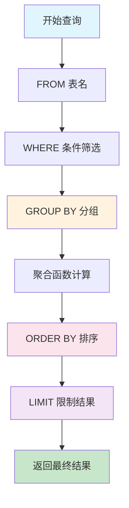

# S1G-SQL分组排序限制查询技术解析-GROUP-BY-ORDER-BY-DESC-LIMIT实战应用

## 📋 摘要

掌握 SQL 中 GROUP BY、ORDER BY DESC 和 LIMIT 的组合使用，轻松实现数据分组统计、排序筛选和结果限制。无论是数据分析还是业务报表，这三个子句都能帮你快速获取精准结果。

---

## 🎯 核心概念解析

### 1. GROUP BY（分组）子句

**GROUP BY** 就像把数据按照某个特征进行分类整理，就像整理图书馆的书籍一样，把相同类型的书放在一起。

```sql
-- 基础语法
SELECT 列名, 聚合函数(列名)
FROM 表名
GROUP BY 列名;
```

**核心特点：**
- 📊 **分组聚合**：将相同值的行归为一组
- 🔢 **配合聚合函数**：通常与 COUNT（计数）、SUM（求和）、AVG（平均值）等函数一起使用
- 🎯 **数据统计**：对每个分组进行统计计算

### 2. ORDER BY DESC（降序排序）子句

**ORDER BY DESC** 就像给数据排队，按照从大到小的顺序排列，就像考试成绩排名一样。

```sql
-- 基础语法
SELECT 列名
FROM 表名
ORDER BY 列名 DESC;  -- DESC 表示降序，ASC 表示升序（默认）
```

**核心特点：**
- 📈 **降序排列**：从大到小排序
- 🎯 **结果排序**：对查询结果进行排序
- 🔄 **灵活排序**：可以按多个字段排序

### 3. LIMIT（限制）子句

**LIMIT** 就像设置一个"只取前几名"的规则，就像比赛只取前三名一样。

```sql
-- 基础语法
SELECT 列名
FROM 表名
LIMIT 数量;  -- 限制返回的行数
```

**核心特点：**
- 🎯 **结果限制**：限制返回的行数
- ⚡ **性能优化**：减少数据传输量
- 📄 **分页查询**：常用于分页显示

---

## 🔄 执行顺序图解



---

## 💡 实践案例详解

### 案例 1：电商销售数据分析

假设我们有一个订单表 `orders`，包含以下字段：
- `customer_id`（客户 ID）
- `product_id`（商品 ID）
- `order_amount`（订单金额）
- `order_date`（订单日期）

#### 🎯 需求：找出销售额最高的前 5 名客户

```sql
-- 查询销售额最高的前 5 名客户
SELECT 
    customer_id,                    -- 客户 ID
    SUM(order_amount) AS total_sales -- 总销售额（使用 SUM 聚合函数）
FROM orders 
GROUP BY customer_id                -- 按客户分组
ORDER BY total_sales DESC           -- 按销售额降序排序
LIMIT 5;                           -- 只取前 5 名
```

**代码解析：**
- `SUM(order_amount)`：计算每个客户的总销售额
- `GROUP BY customer_id`：按客户 ID 分组
- `ORDER BY total_sales DESC`：按总销售额从高到低排序
- `LIMIT 5`：只返回前 5 条记录

#### 🎯 需求：统计每个商品的销售数量，找出最受欢迎的前 3 个商品

```sql
-- 查询销售数量最多的前 3 个商品
SELECT 
    product_id,                     -- 商品 ID
    COUNT(*) AS sales_count         -- 销售次数（使用 COUNT 聚合函数）
FROM orders 
GROUP BY product_id                 -- 按商品分组
ORDER BY sales_count DESC          -- 按销售数量降序排序
LIMIT 3;                          -- 只取前 3 个
```

### 案例 2：学生成绩统计分析

假设我们有一个学生成绩表 `student_scores`，包含以下字段：
- `student_id`（学生 ID）
- `subject`（科目）
- `score`（分数）
- `class_id`（班级 ID）

#### 🎯 需求：找出平均分最高的前 3 个班级

```sql
-- 查询平均分最高的前 3 个班级
SELECT 
    class_id,                       -- 班级 ID
    AVG(score) AS avg_score,        -- 平均分（使用 AVG 聚合函数）
    COUNT(*) AS student_count       -- 学生人数
FROM student_scores 
GROUP BY class_id                   -- 按班级分组
ORDER BY avg_score DESC            -- 按平均分降序排序
LIMIT 3;                          -- 只取前 3 个班级
```

**代码解析：**
- `AVG(score)`：计算每个班级的平均分
- `COUNT(*)`：统计每个班级的学生人数
- `GROUP BY class_id`：按班级 ID 分组
- `ORDER BY avg_score DESC`：按平均分从高到低排序

---

## ⚠️ 重要注意事项

### 1. GROUP BY 使用规则

```sql
-- ❌ 错误示例：SELECT 中的非聚合列必须包含在 GROUP BY 中
SELECT customer_id, customer_name, SUM(order_amount)
FROM orders 
GROUP BY customer_id;  -- 错误！customer_name 不在 GROUP BY 中

-- ✅ 正确示例：所有非聚合列都要在 GROUP BY 中
SELECT customer_id, customer_name, SUM(order_amount)
FROM orders 
GROUP BY customer_id, customer_name;  -- 正确！
```

**错误原因详解：**

想象一下，你是一个班级的班长，老师让你统计每个小组的总分。现在有一个问题：

- 📚 **班级情况**：班里有 3 个小组，每个小组有多个学生
- 🎯 **任务要求**：统计每个小组的总分和小组长姓名
- ❌ **错误做法**：你只按小组分组，但每个小组可能有多个小组长，你不知道该选哪个小组长的姓名

**具体例子：**
```
小组A：张三（小组长）、李四（小组长）、王五
小组B：赵六（小组长）、孙七
小组C：周八（小组长）
```

如果你只按小组分组，数据库就困惑了：
- 小组 A 有两个小组长（张三和李四），该选哪个？
- 小组 B 有一个小组长（赵六），这个没问题
- 小组 C 有一个小组长（周八），这个也没问题

**💥 数据库报错**：大多数数据库会抛出 "column must appear in GROUP BY clause" 错误

**🎯 解决方案**：
1. **方案一**：把小组长姓名也加入分组条件
2. **方案二**：使用聚合函数，比如选择第一个小组长：`MAX(customer_name)`

### 2. 执行顺序的重要性

```sql
-- SQL 子句的执行顺序（不是书写顺序）
SELECT customer_id, SUM(order_amount) AS total_sales
FROM orders 
WHERE order_date >= '2024-01-01'    -- 1. 先筛选数据
GROUP BY customer_id                -- 2. 再分组
HAVING SUM(order_amount) > 1000     -- 3. 然后筛选分组
ORDER BY total_sales DESC           -- 4. 接着排序
LIMIT 10;                          -- 5. 最后限制结果
```

---

## 🎨 高级应用技巧

### 1. 多字段分组排序

```sql
-- 按年份和月份分组，统计每月销售额
SELECT 
    YEAR(order_date) AS order_year,     -- 订单年份
    MONTH(order_date) AS order_month,   -- 订单月份
    SUM(order_amount) AS monthly_sales  -- 月销售额
FROM orders 
GROUP BY YEAR(order_date), MONTH(order_date)  -- 多字段分组
ORDER BY order_year DESC, order_month DESC    -- 多字段排序
LIMIT 12;                                    -- 最近 12 个月
```

**多字段排序规则详解：**

想象一下，你是一个学校的老师，要给学生的成绩排名。现在有两个排名标准：

- 🎯 **第一优先级**：按班级排名（order_year）
- 🎯 **第二优先级**：按学号排名（order_month）

**具体排序过程：**
1. **第一步**：先把所有学生按班级分组（2024 年、2023 年、2022 年...）
2. **第二步**：在每个班级内部，再按学号排序（12 月、11 月、10 月...）

**实际例子：**
```
排序结果：
2024年12月  ← 最新
2024年11月
2024年10月
2023年12月
2023年11月
2022年12月  ← 最旧
```

**重要理解：**
- ❌ **不是同时排序**：不是把年份和月份混在一起排序
- ✅ **分层排序**：先按年份分组，再在年份内部按月份排序
- 🎯 **优先级明确**：第一个字段优先级最高，第二个字段只在第一个字段相同时才起作用

### 2. 条件分组统计

```sql
-- 统计不同价格区间的商品数量
SELECT 
    CASE 
        WHEN price < 100 THEN '低价商品'
        WHEN price BETWEEN 100 AND 500 THEN '中价商品'
        ELSE '高价商品'
    END AS price_category,           -- 价格分类
    COUNT(*) AS product_count        -- 商品数量
FROM products 
GROUP BY price_category              -- 按价格分类分组
ORDER BY product_count DESC          -- 按商品数量降序排序
LIMIT 3;                           -- 只显示前 3 个分类
```

**CASE...END 语句详解：**

想象一下，你是一个超市的收银员，需要给商品贴上价格标签。现在有一个规则：

- 🏷️ **低价商品**：价格小于 100 元的商品
- 🏷️ **中价商品**：价格在 100-500 元之间的商品  
- 🏷️ **高价商品**：价格大于 500 元的商品

**CASE...END 就像是一个智能标签机：**

```sql
CASE 
    WHEN price < 100 THEN '低价商品'        -- 如果价格 < 100，贴上"低价商品"标签
    WHEN price BETWEEN 100 AND 500 THEN '中价商品'  -- 如果价格在 100-500 之间，贴上"中价商品"标签
    ELSE '高价商品'                        -- 其他情况，贴上"高价商品"标签
END AS price_category
```

**AS 关键字详解：**

想象一下，你是一个老师，给学生起外号。现在有一个学生叫"张三"，但是你想给他起个更形象的外号叫"学霸"。

- 🏷️ **原名**：张三（原始数据）
- 🏷️ **外号**：学霸（AS 起的别名）

**AS 就像起外号一样：**

```sql
-- 原始写法（没有别名）
SELECT COUNT(*) FROM products GROUP BY price_category;

-- 使用 AS 起别名（更清晰）
SELECT COUNT(*) AS product_count FROM products GROUP BY price_category;
```

**AS 的作用：**
1. **📝 起别名**：给列或表起一个更容易理解的名字
2. **🎯 简化引用**：在后续的 ORDER BY、GROUP BY 中可以直接使用别名
3. **📊 美化输出**：让查询结果更直观，比如显示"商品数量"而不是"COUNT(*)"

**实际例子：**
```sql
-- 没有 AS：结果列名显示为 COUNT(*)
SELECT COUNT(*) FROM products;

-- 使用 AS：结果列名显示为 product_count
SELECT COUNT(*) AS product_count FROM products;
```

**重要理解：**
- 🎯 **别名作用**：AS 给列起一个"外号"，让名字更友好
- 📝 **可选使用**：AS 关键字可以省略，但建议保留让代码更清晰
- 🔄 **后续引用**：起了别名后，ORDER BY 可以直接使用别名

**具体工作过程：**
1. **检查第一个条件**：价格 < 100 吗？
   - 如果是 → 返回"低价商品"
   - 如果不是 → 继续检查下一个条件
2. **检查第二个条件**：价格在 100-500 之间吗？
   - 如果是 → 返回"中价商品"
   - 如果不是 → 继续检查下一个条件
3. **其他情况**：所有不满足上面条件的 → 返回"高价商品"

**实际例子：**
```
商品A：价格 50 元  → 贴上"低价商品"标签
商品B：价格 200 元 → 贴上"中价商品"标签
商品C：价格 800 元 → 贴上"高价商品"标签
```

**重要理解：**
- 🎯 **条件判断**：CASE 就像 if-else 语句，按顺序检查条件
- 📝 **标签生成**：根据条件给每行数据贴上不同的"标签"
- 🔄 **分组依据**：这个"标签"可以作为 GROUP BY 的分组依据

### 3. 分页查询应用

```sql
-- 分页查询：获取第 2 页数据（每页 10 条）
SELECT customer_id, SUM(order_amount) AS total_sales
FROM orders 
GROUP BY customer_id
ORDER BY total_sales DESC
LIMIT 10 OFFSET 10;  -- 跳过前 10 条，取接下来的 10 条
```

**OFFSET 关键字详解：**

想象一下，你是一个图书管理员，要给学生发书。现在有 100 本书，学生要按顺序领取：

- 📚 **第 1 页**：第 1-10 本书（前 10 本）
- 📚 **第 2 页**：第 11-20 本书（跳过前 10 本，取接下来的 10 本）
- 📚 **第 3 页**：第 21-30 本书（跳过前 20 本，取接下来的 10 本）

**OFFSET 就像"跳过"指令：**

```sql
-- 第 1 页：取前 10 条记录
SELECT * FROM orders ORDER BY total_sales DESC LIMIT 10;

-- 第 2 页：跳过前 10 条，取接下来的 10 条
SELECT * FROM orders ORDER BY total_sales DESC LIMIT 10 OFFSET 10;

-- 第 3 页：跳过前 20 条，取接下来的 10 条
SELECT * FROM orders ORDER BY total_sales DESC LIMIT 10 OFFSET 20;
```

**OFFSET 的工作过程：**
1. **第一步**：ORDER BY 先排序所有数据
2. **第二步**：OFFSET 跳过指定数量的记录
3. **第三步**：LIMIT 从剩余记录中取指定数量

**具体例子：**
```
总共有 30 条记录，按销售额排序：
1. 客户A：10000元  ← 第1页
2. 客户B：9000元   ← 第1页
...
10. 客户J：1000元  ← 第1页
11. 客户K：900元   ← 第2页（OFFSET 10 从这里开始）
12. 客户L：800元   ← 第2页
...
20. 客户T：100元   ← 第2页
21. 客户U：90元    ← 第3页（OFFSET 20 从这里开始）
```

**重要理解：**
- 🎯 **跳过功能**：OFFSET 告诉数据库"跳过前面几条记录"
- 📄 **分页核心**：OFFSET + LIMIT 是实现分页的关键组合
- 🔢 **计算公式**：第 N 页的 OFFSET = (N-1) × 每页条数
- ⚡ **性能注意**：OFFSET 值越大，查询越慢，因为要跳过更多记录

---

## 🎯 适用开发者水平

| 开发者水平 | 适用程度 | 说明 |
|-----------|---------|------|
| **小白（零基础）** | ⭐⭐⭐ | 需要先掌握基础 SQL 语法 |
| **刚入门不久（初级）** | ⭐⭐⭐⭐⭐ | 非常适合，是核心技能 |
| **入门一段时间（中级）** | ⭐⭐⭐⭐⭐ | 必须掌握的高级技巧 |
| **资深开发者（高级）** | ⭐⭐⭐⭐ | 性能优化和复杂应用 |

---

## 📊 实际业务场景

### 1. 电商平台
- 📈 **销售排行榜**：商品销量 TOP 10
- 👥 **客户分析**：VIP 客户识别
- 📊 **数据报表**：月度销售统计

### 2. 教育系统
- 🏆 **成绩排名**：班级平均分排名
- 📚 **学科分析**：最受欢迎课程
- 👨‍🎓 **学生管理**：优秀学生筛选

### 3. 金融系统
- 💰 **交易分析**：大额交易监控
- 📊 **风险评估**：高风险客户识别
- 📈 **业绩统计**：业务员业绩排名

---

## 🎉 总结

通过本文的学习，你已经掌握了 SQL 中 **GROUP BY**、**ORDER BY DESC** 和 **LIMIT** 这三个强大子句的组合使用。这三个子句就像数据分析的"三剑客"，能够帮你：

- 🎯 **精准分组**：GROUP BY 让数据按需分类
- 📊 **智能排序**：ORDER BY DESC 让结果有序排列  
- ⚡ **高效限制**：LIMIT 让查询结果可控

无论是处理海量数据还是生成业务报表，这三个子句的组合都能让你的 SQL 查询更加高效和精准。记住，**实践是掌握 SQL 的最佳途径**，多动手练习，你一定能成为数据分析的高手！

继续加油，让数据为你说话！🚀

---

**厦门工学院人工智能创作坊 -- 郑恩赐**  
**2025 年 10 月 11 日**
