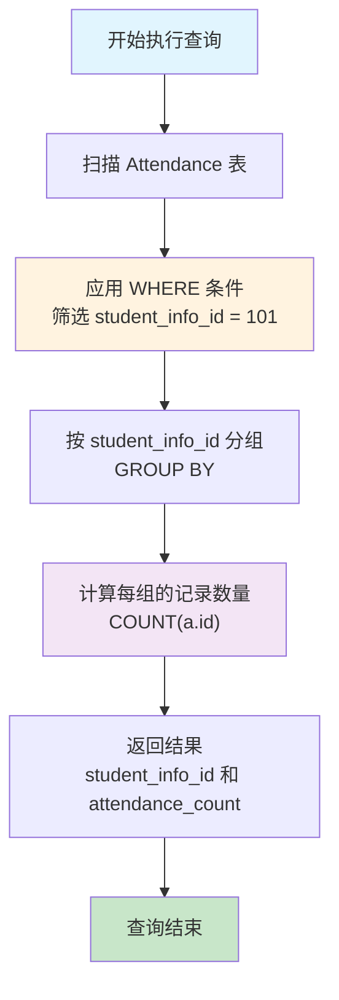

# S1H-SQL统计查询入门宝典-COUNT-GROUP-BY技术解析

## 📋 摘要

**零基础也能轻松掌握！** 以学生出勤统计为例，深入解析 SQL 统计查询语句，从语法结构到执行原理，从实际应用到问题解决，让您彻底理解数据库统计查询核心技术，快速提升数据处理能力。

---

## 🎯 适用开发者水平

- **小白（零基础）**：完全适合，本文从最基础的概念开始讲解
- **刚入门不久（初级）**：适合，可加深对 SQL 查询的理解
- **入门一段时间（中级）**：适合，可学习更多查询技巧
- **资深开发者（高级）**：适合，可了解查询的深层原理

---

## 📚 目录

1. [查询语句概览](#查询语句概览)
2. [语法结构深度解析](#语法结构深度解析)
3. [执行流程详解](#执行流程详解)
4. [实际应用场景](#实际应用场景)
5. [常见问题与解决方案](#常见问题与解决方案)

---

## 🔍 查询语句概览

### 📋 示例背景

为了更好地理解 SQL 统计查询的核心技术，我们以一个**学生出勤管理系统**为例进行讲解。

**业务背景**：
- 学校需要统计每个学生的出勤情况
- 系统中有 `Attendance`（出勤表）记录学生的每次出勤
- 需要按学生 ID 统计出勤次数

### 🎯 示例查询语句

```sql
SELECT student_info_id, COUNT(a.id) as attendance_count 
FROM Attendance a 
WHERE student_info_id = 101
GROUP BY student_info_id
```

**查询目的**：统计学生 ID 为 101 的出勤记录数量

**通俗理解**：就像老师点名一样，我们要统计某个学生（ID 为 101）一共被点到过多少次名。

---

## 🔧 语法结构深度解析

### 1. SELECT 子句（选择字段）

```sql
SELECT student_info_id, COUNT(a.id) as attendance_count
```

**详细解析**：
- `student_info_id`：选择学生信息 ID（学生信息标识符）
- `COUNT(a.id)`：统计记录数量（统计记录数）
- `as attendance_count`：给统计结果起别名（给统计结果起别名）

**💡 小白理解**：SELECT 就像购物时选择要买的东西，这里我们选择学生 ID 和出勤次数。

### 2. FROM 子句（数据来源）

```sql
FROM Attendance a
```

**详细解析**：
- `Attendance`：出勤表（出勤表）
- `a`：表别名（表别名）

**💡 小白理解**：FROM 就像告诉店员"我要从哪个货架拿东西"，这里我们从出勤表拿数据。

### 3. WHERE 子句（筛选条件）

```sql
WHERE student_info_id = 101
```

**详细解析**：
- `student_info_id = 101`：筛选条件（筛选条件）
- 只选择学生 ID 为 101 的记录

**💡 小白理解**：WHERE 就像筛选器，只留下我们想要的数据，这里只要学生 101 的记录。

### 4. GROUP BY 子句（分组统计）

```sql
GROUP BY student_info_id
```

**详细解析**：
- `GROUP BY`：分组操作（分组操作）
- `student_info_id`：按学生 ID 分组

**💡 小白理解**：GROUP BY 就像把相同的东西放在一起，这里把同一个学生的记录放在一起统计。

---

## ⚡ 执行流程详解

### 🔄 执行流程图



### 📝 执行步骤详解

#### 步骤 1：数据筛选（WHERE）
```sql
-- 假设原始数据
| id | student_info_id | attendance_date |
|----|-----------------|----------------|
| 1  | 101             | 2025-10-01     |
| 2  | 101             | 2025-10-02     |
| 3  | 102             | 2025-10-01     |
| 4  | 101             | 2025-10-03     |

-- 应用 WHERE student_info_id = 101 后
| id | student_info_id | attendance_date |
|----|-----------------|----------------|
| 1  | 101             | 2025-10-01     |
| 2  | 101             | 2025-10-02     |
| 4  | 101             | 2025-10-03     |
```

#### 步骤 2：分组统计（GROUP BY + COUNT）
```sql
-- 按 student_info_id 分组并统计
| student_info_id | attendance_count |
|-----------------|-----------------|
| 101             | 3                |
```

**💡 小白理解**：就像数苹果一样，我们把所有红色的苹果（学生 101 的记录）放在一起，然后数一数有多少个。

---

## 🎯 实际应用场景

### 场景 1：学生出勤统计
```sql
-- 统计特定学生的出勤次数
SELECT student_info_id, COUNT(a.id) as attendance_count 
FROM Attendance a 
WHERE student_info_id = 101
GROUP BY student_info_id
```

### 场景 2：多学生出勤统计
```sql
-- 统计所有学生的出勤次数
SELECT student_info_id, COUNT(a.id) as attendance_count 
FROM Attendance a 
GROUP BY student_info_id
ORDER BY attendance_count DESC
```

### 场景 3：出勤率分析
```sql
-- 统计出勤次数大于 5 次的学生
SELECT student_info_id, COUNT(a.id) as attendance_count 
FROM Attendance a 
GROUP BY student_info_id
HAVING COUNT(a.id) > 5
```

---

## ❓ 常见问题与解决方案

### 问题 1：查询结果为空

**现象**：执行查询后没有返回任何结果

**原因分析**：
- 表中没有 `student_info_id = 101` 的记录
- 数据被意外删除

**解决方案**：
```sql
-- 先检查是否存在该学生的记录
SELECT COUNT(*) FROM Attendance WHERE student_info_id = 101;

-- 如果结果为 0，说明没有该学生的出勤记录
```

### 问题 2：COUNT 结果不准确

**现象**：COUNT 的结果比预期少

**原因分析**：
- `a.id` 字段存在 NULL 值
- COUNT 函数不计算 NULL 值

**解决方案**：
```sql
-- 使用 COUNT(*) 统计所有行
SELECT student_info_id, COUNT(*) as attendance_count 
FROM Attendance a 
WHERE student_info_id = 101
GROUP BY student_info_id

-- 或者使用 COUNT(1) 统计所有行
SELECT student_info_id, COUNT(1) as attendance_count 
FROM Attendance a 
WHERE student_info_id = 101
GROUP BY student_info_id
```

---

## 🎉 总结

通过本文的学习，您已经掌握了：

✅ **SQL 查询语法**：深入理解了 SELECT、FROM、WHERE、GROUP BY 各个子句的作用  
✅ **执行原理**：明白了数据库如何一步步处理查询请求  
✅ **实际应用**：学会了在不同场景下使用统计查询  
✅ **问题解决**：具备了排查和解决常见问题的能力  

**🚀 继续加油！** 数据库查询技术是后端开发的核心技能，您现在已经具备了坚实的基础。建议您多动手实践，尝试不同的查询场景，相信您很快就能成为 SQL 查询的高手！

---

**厦门工学院人工智能创作坊 -- 郑恩赐**  
**2025 年 10 月 11 日**
