# 05-自注意力机制详解 🧠

本文档深入讲解自注意力机制（Self-Attention）的核心原理，涵盖自注意力的概念定义与产生背景、QKV三大角色的直观理解与线性变换的作用、自注意力与交叉注意力的本质区别、掩码自注意力（Padding Mask 与 Causal Mask）的完整解析、手动代码实现及逐行讲解，以及注意力权重可视化方法。通过理论与实践相结合的方式，帮助读者彻底吃透自注意力机制 🛠️

> 📖 **前置阅读**：本文档是 [03-注意力机制基础](https://juejin.cn/post/7634873282535161882)（[CSDN](https://blog.csdn.net/2301_79239314/article/details/160742121)）的深入篇，建议先阅读注意力机制基础再学习本文。代码实现部分可配合 [04-缩放点积注意力代码实现](https://juejin.cn/post/7635839300292362267)（[CSDN](https://blog.csdn.net/2301_79239314/article/details/160774442)）一起阅读。

## 章节阅读路线图 🗺️

```mermaid
flowchart LR
    A["1. 什么是自注意力"]:::concept --> B["2. QKV三大角色"]:::qkv
    B --> C["3. 自注意力 vs 交叉注意力"]:::compare
    C --> D["4. 掩码自注意力"]:::mask
    D --> E["5. 手动代码实现"]:::code
    E --> F["6. 可视化注意力权重"]:::viz
    F --> G["7. 完整可运行示例"]:::example
    G --> H["8. 总结"]:::summary

    classDef concept fill:#e3f2fd,stroke:#1565c0
    classDef qkv fill:#e8f5e9,stroke:#2e7d32
    classDef compare fill:#fff3e0,stroke:#ef6c00
    classDef mask fill:#f3e5f5,stroke:#6a1b9a
    classDef code fill:#fce4ec,stroke:#c62828
    classDef viz fill:#e0f2f1,stroke:#00695c
    classDef example fill:#ede7f6,stroke:#4527a0
    classDef summary fill:#e0f2f1,stroke:#00695c
```



**阅读顺序说明**：

- **第1章 → 第2章**：先建立自注意力的概念认知，再深入Q、K、V三大角色
- **第2章 → 第3章**：理解QKV后，对比自注意力与交叉注意力的本质区别
- **第3章 → 第4章**：掌握基础形式后，学习带掩码的自注意力变体
- **第4章 → 第5章**：理论学完后，动手写代码实现
- **第5章 → 第6章**：有了代码基础，可视化注意力权重加深理解
- **第6章 → 第7章**：把所有内容整合成一个完整可运行的示例

---

## 1. 什么是自注意力机制 🤔

> 本章介绍自注意力机制的核心定义、产生背景及其革命性意义

### 1.1 核心定义 📝

自注意力机制（Self-Attention）是 Transformer 架构的核心组件，它允许序列中的每个元素直接与序列中的所有其他元素（包括自身）进行交互和关联，从而动态计算每个位置在理解当前元素时应该关注序列中的哪些部分。

用一句话概括：**自注意力让每个位置都能看到全局，并决定关注哪里。**

---

**参考资料：**

- [Transformer的核心：自注意力机制 -- 阿里云](https://developer.aliyun.com/article/1688141)
- [深度学习核心模型架构解析：Transformer自注意力机制 -- 腾讯云](https://cloud.tencent.com/developer/article/2560472)

### 1.2 自注意力 vs 传统注意力 🔍

传统注意力机制（如 Seq2Seq 中的注意力）是**跨序列**的：Query 来自解码器，Key 和 Value 来自编码器，用于连接两个不同的序列。

自注意力机制则是**序列内部**的：Query、Key、Value 全部来自同一个序列，让序列中的每个元素都能关注序列中的所有元素。

| 维度 | 传统注意力（Attention） | 自注意力（Self-Attention） |
|------|------------------------|---------------------------|
| Q 来源 | 解码器（目标序列） | 输入序列自身 |
| K、V 来源 | 编码器（源序列） | 输入序列自身 |
| 作用范围 | 跨序列关联 | 序列内部关联 |
| 典型场景 | 机器翻译中解码器关注编码器输出 | 理解句子中词与词之间的关系 |

---

**参考资料：**

- [注意力机制 VS 自注意力机制 -- GitHub](https://github.com/winterpi/blog/issues/127)
- [一次理解Attention/Self-Attention/Multi-Head Attention -- CSDN](https://blog.csdn.net/Mr_XLM/article/details/158464873)

### 1.3 为什么需要自注意力？——传统模型的痛点 ⚠️

在自注意力出现前，序列数据的建模主要依赖 RNN 和 CNN，但两者都存在难以回避的局限：

**RNN 的"顺序枷锁"**：RNN 需按时间步依次处理序列，无法并行计算，训练效率极低；处理长序列时，梯度会随时间步衰减或激增（梯度消失/爆炸），导致无法捕捉长距离依赖。

**CNN 的"局部局限"**：CNN 通过卷积核提取局部特征，若要捕捉全局关系，需堆叠多层卷积，不仅增加计算量，还会导致远距离信息传递损耗。

自注意力机制的出现恰好打破了这两大局限：它能**并行处理**序列中所有位置，同时**直接计算任意两个位置的关联度**，让每个输出都能"看见"整个序列的全局信息。

---

**参考资料：**

- [【小白必看】解锁 Transformer 核心！一文吃透自注意力机制原理与实践 -- CSDN](https://blog.csdn.net/2301_76168381/article/details/150857789)
- [Transformer架构深度解析：重新定义序列建模的革命 -- 阿里云](https://developer.aliyun.com/article/1688142)

---

## 2. Q、K、V 三大角色 🎭

> 本章深入讲解 Query、Key、Value 的直观含义与线性变换的作用

### 2.1 直观理解：图书馆检索类比 📚

自注意力机制的核心公式为：

```
Attention(Q, K, V) = softmax(Q × K^T / √d_k) × V
```

其中 Q、K、V 分别代表三个核心角色。可以用**图书馆检索**来直观理解：

- **Query（查询）**：你要找什么？——比如你想找"关于深度学习的书"
- **Key（键）**：我能提供什么？——每本书的标题/标签，用来和你的查询匹配
- **Value（值）**：实际内容是什么？——匹配成功后，你拿到的是书的实际内容

在自注意力中，序列中的每个词都会同时扮演这三个角色：它既在"查询"其他词（Q），也在被其他词"匹配"（K），还提供自己的"内容"（V）。

---

**参考资料：**

- [QKV简单叙述 -- CSDN](https://blog.csdn.net/wei12366/article/details/159767126)
- [Transformer的自注意力机制详细解析 -- 腾讯云](https://cloud.tencent.com/developer/article/2648495)

### 2.2 Q、K、V 的线性变换：为什么要投影到不同子空间？ 🔄

Q、K、V 并不是直接用原始词向量，而是通过三个可学习的权重矩阵 W_Q、W_K、W_V 对输入 X 做线性变换得到的：

```
Q = X × W_Q
K = X × W_K
V = X × W_V
```

**为什么需要这三个线性变换？**

如果直接用原始 embedding 做 Q、K、V，相当于在同一个空间计算相似度，模型无法学习不同语义关系的权重。通过三个不同的权重矩阵，输入被投影到三个不同的子空间：

- **Query 空间**：定义了"需要寻找什么特征"
- **Key 空间**：定义了"可以提供什么特征"
- **Value 空间**：存储着实际的特征表达

这三个权重矩阵是可学习的参数，模型在训练过程中会自动学会：什么样的 Q 应该匹配什么样的 K，以及应该从 V 中提取什么信息。

---

**参考资料：**

- [深入解析Self-Attention：QKV线性变换的作用与重要性 -- CSDN](https://blog.csdn.net/m0_65555479/article/details/154840206)
- [封神级解析，Transformer 的灵魂 QKV 矩阵 -- 头条](http://m.toutiao.com/group/7627416956227863080/)

### 2.3 自注意力的计算流程 📐

以句子"我喜欢苹果"为例（3个词），完整计算流程如下：

**第1步：生成 Q、K、V**

输入矩阵 X（形状 `[3, d_model]`）分别乘以 W_Q、W_K、W_V，得到 Q、K、V（形状均为 `[3, d_k]`）。

**第2步：计算注意力分数**

用每个词的 Q 与所有词的 K 做点积，得到注意力分数矩阵（形状 `[3, 3]`）：

```
scores[i][j] = Q[i] · K[j]  （第i个词对第j个词的关注程度）
```

**第3步：缩放**

将分数除以 √d_k，防止点积结果过大导致 Softmax 梯度消失。

**第4步：Softmax 归一化**

在每一行上做 Softmax，使每行的权重之和为 1。

**第5步：加权求和**

用注意力权重对 V 做加权求和，得到每个词的最终表示。

---

**参考资料：**

- [自注意力机制深度讲解：从直觉到工程 -- CSDN](https://blog.csdn.net/aifs2025/article/details/150511052)
- [How Self-Attention Works — Visually Explained](https://www.kudosai.com/Blog/How-Self-Attention-Works-Visually-Explained) ⭐值得阅读

---

## 3. 自注意力 vs 交叉注意力 ⚔️

> 本章对比两种注意力形式的本质区别与应用场景

### 3.1 核心区别 📊

| 维度 | 自注意力（Self-Attention） | 交叉注意力（Cross-Attention） |
|------|--------------------------|------------------------------|
| Q 来源 | 当前序列自身 | 目标序列（如解码器） |
| K、V 来源 | 当前序列自身 | 源序列（如编码器输出） |
| 作用 | 捕捉序列内部依赖关系 | 连接两个不同序列的信息 |
| 所在位置 | 编码器和解码器的自注意力层 | 解码器的编码器-解码器注意力层 |
| 典型场景 | 理解句子中词与词的关系 | 机器翻译中生成目标语言时参考源语言 |

### 3.2 直观类比 🎯

**自注意力**：像一个团队内部开会，每个人（词）都在听其他人说什么，综合所有人的意见来形成自己的理解。

**交叉注意力**：像一个翻译官在翻译时，一边听源语言（编码器输出），一边生成目标语言（解码器），每生成一个词都要回头看看源语言中哪些部分最相关。

---

**参考资料：**

- [Cross-Attention vs Self-Attention Explained -- AIML](https://aiml.com/explain-cross-attention-and-how-is-it-different-from-self-attention/)
- [一次理解Attention/Self-Attention/Multi-Head Attention -- CSDN](https://blog.csdn.net/Mr_XLM/article/details/158464873)

---

## 4. 掩码自注意力 🎭

> 本章讲解两种关键掩码：Padding Mask 与 Causal Mask

### 4.1 为什么需要掩码？ 🤔

在实际应用中，我们经常需要限制注意力机制"能看到"的范围。掩码（Mask）的作用就是在计算注意力分数后、Softmax 之前，将某些位置的分数设为负无穷（-inf），这样经过 Softmax 后这些位置的权重就会变成 0，相当于"屏蔽"了这些位置。

### 4.2 Padding Mask：屏蔽填充位置 📏

**问题**：在批处理中，不同句子长度不一，短句子需要用 `<PAD>` 填充到相同长度。但这些填充位置没有实际语义，不应该参与注意力计算。

**解决方案**：构造一个布尔掩码，标记哪些位置是真实词（True）、哪些是填充（False）。在计算注意力分数后，将填充位置的分数设为 -inf。

```python
# padding_mask 形状: [batch_size, seq_len]，True 表示真实词
# 将其扩展为 [batch_size, 1, 1, seq_len] 用于注意力计算
if padding_mask is not None:
    # padding_mask == 0 的位置设为 -inf
    scores = scores.masked_fill(padding_mask.unsqueeze(1).unsqueeze(2) == 0, float('-inf'))
```

### 4.3 Causal Mask：防止"偷看未来" 🔮

**问题**：在自回归生成（如 GPT 解码器）中，生成第 t 个词时，模型只能看到前 t-1 个词，不能看到后面的词（因为后面的词还没生成）。

**解决方案**：构造一个上三角矩阵作为掩码，使得位置 i 只能关注位置 j ≤ i（即只能看到自己和前面的词）。

```python
# 构造因果掩码（下三角矩阵）
seq_len = scores.size(-1)
causal_mask = torch.tril(torch.ones(seq_len, seq_len)).bool()
# causal_mask[i][j] = True 当 j <= i，即位置i可以看到位置j
scores = scores.masked_fill(causal_mask.unsqueeze(0).unsqueeze(0) == 0, float('-inf'))
```

**直观理解**：

```
因果掩码矩阵（seq_len=4）：
        K0   K1   K2   K3
Q0  [  1    0    0    0  ]   ← Q0只能看到K0（自己）
Q1  [  1    1    0    0  ]   ← Q1能看到K0、K1
Q2  [  1    1    1    0  ]   ← Q2能看到K0、K1、K2
Q3  [  1    1    1    1  ]   ← Q3能看到所有
```

---

**参考资料：**

- [torch.nn.functional.scaled_dot_product_attention -- PyTorch 文档](https://pytorch.ac.cn/docs/stable/generated/torch.nn.functional.scaled_dot_product_attention.html)
- [FlexAttention：兼具 PyTorch 的灵活性与 FlashAttention 的高性能 -- PyTorch](https://pytorch.ac.cn/blog/flexattention/)
- [Multi-Head Attention Explained -- DigitalOcean](https://www.digitalocean.com/community/tutorials/multi-head-attention-simple-explained)

---

## 5. 手动代码实现 💻

> 本章从零编写自注意力机制的完整代码，逐行讲解

### 5.1 完整代码实现 🧮

```python
import torch
import torch.nn as nn
import math


class SelfAttention(nn.Module):
    """
    自注意力机制的手动实现

    结构：输入 → Q/K/V线性变换 → 缩放点积注意力 → 输出

    参数:
        d_model: 输入向量的维度
        d_k: Q、K的维度（默认与d_model相同）
        d_v: V的维度（默认与d_model相同）
        dropout: Dropout概率
    """

    def __init__(self, d_model, d_k=None, d_v=None, dropout=0.1):
        super(SelfAttention, self).__init__()
        d_k = d_k or d_model
        d_v = d_v or d_model

        self.W_Q = nn.Linear(d_model, d_k)
        self.W_K = nn.Linear(d_model, d_k)
        self.W_V = nn.Linear(d_model, d_v)

        self.dropout = nn.Dropout(dropout)
        self.d_k = d_k

    def forward(self, X, mask=None):
        """
        前向传播

        参数:
            X: 输入序列 [batch_size, seq_len, d_model]
            mask: 可选的掩码 [batch_size, seq_len] 或 [batch_size, seq_len, seq_len]

        返回:
            output: 自注意力输出 [batch_size, seq_len, d_v]
            attention_weights: 注意力权重 [batch_size, seq_len, seq_len]
        """
        Q = self.W_Q(X)
        K = self.W_K(X)
        V = self.W_V(X)

        scores = torch.matmul(Q, K.transpose(-2, -1)) / math.sqrt(self.d_k)

        if mask is not None:
            if mask.dim() == 2:
                mask = mask.unsqueeze(1).unsqueeze(2)
            scores = scores.masked_fill(mask == 0, float('-inf'))

        attention_weights = torch.softmax(scores, dim=-1)
        attention_weights = self.dropout(attention_weights)

        output = torch.matmul(attention_weights, V)

        return output, attention_weights
```

### 5.2 代码逐行解析 🔍

**第1步：定义 Q、K、V 的线性变换层**

```python
self.W_Q = nn.Linear(d_model, d_k)
self.W_K = nn.Linear(d_model, d_k)
self.W_V = nn.Linear(d_model, d_v)
```

三个 `nn.Linear` 层分别对应 W_Q、W_K、W_V 权重矩阵。每个 Linear 层内部包含一个权重矩阵（形状 `[d_k, d_model]`）和一个偏置向量（形状 `[d_k]`）。

**第2步：生成 Q、K、V**

```python
Q = self.W_Q(X)  # [batch, seq_len, d_k]
K = self.W_K(X)  # [batch, seq_len, d_k]
V = self.W_V(X)  # [batch, seq_len, d_v]
```

输入 X 经过三个不同的线性变换，投影到三个不同的子空间。注意 Q 和 K 的维度必须相同（都是 d_k），因为要做点积；V 的维度可以不同。

**第3步：计算注意力分数并缩放**

```python
scores = torch.matmul(Q, K.transpose(-2, -1)) / math.sqrt(self.d_k)
```

- `K.transpose(-2, -1)`：交换 K 的最后两个维度，实现转置
- `torch.matmul(Q, K^T)`：计算每对词之间的相似度
- `/ math.sqrt(d_k)`：缩放，防止点积值过大

**第4步：应用掩码**

```python
if mask is not None:
    if mask.dim() == 2:
        mask = mask.unsqueeze(1).unsqueeze(2)
    scores = scores.masked_fill(mask == 0, float('-inf'))
```

支持两种掩码格式：2D 掩码 `[batch, seq_len]`（Padding Mask）自动扩展为 4D，以及预构造的 4D 掩码（Causal Mask）。

**第5步：Softmax + Dropout + 加权求和**

```python
attention_weights = torch.softmax(scores, dim=-1)
attention_weights = self.dropout(attention_weights)
output = torch.matmul(attention_weights, V)
```

Softmax 将分数转为概率分布，Dropout 随机丢弃部分权重防止过拟合，最后用权重对 V 加权求和得到输出。

---

## 6. 可视化注意力权重 👁️

> 本章通过热力图直观展示自注意力的权重分布

```python
import matplotlib.pyplot as plt
import torch
import math
import torch.nn as nn


class SelfAttention(nn.Module):
    def __init__(self, d_model, d_k=None, d_v=None, dropout=0.1):
        super(SelfAttention, self).__init__()
        d_k = d_k or d_model
        d_v = d_v or d_model
        self.W_Q = nn.Linear(d_model, d_k)
        self.W_K = nn.Linear(d_model, d_k)
        self.W_V = nn.Linear(d_model, d_v)
        self.dropout = nn.Dropout(dropout)
        self.d_k = d_k

    def forward(self, X, mask=None):
        Q = self.W_Q(X)
        K = self.W_K(X)
        V = self.W_V(X)
        scores = torch.matmul(Q, K.transpose(-2, -1)) / math.sqrt(self.d_k)
        if mask is not None:
            if mask.dim() == 2:
                mask = mask.unsqueeze(1).unsqueeze(2)
            scores = scores.masked_fill(mask == 0, float('-inf'))
        attention_weights = torch.softmax(scores, dim=-1)
        attention_weights = self.dropout(attention_weights)
        output = torch.matmul(attention_weights, V)
        return output, attention_weights


def visualize_self_attention(attention_weights, tokens=None, title="Self-Attention Weights"):
    """
    可视化自注意力权重热力图

    参数:
        attention_weights: 注意力权重 [batch, seq_len, seq_len] 或 [batch, heads, seq_len, seq_len]
        tokens: 词列表，用于标注坐标轴
        title: 图表标题
    """
    if attention_weights.dim() == 4:
        attention_weights = attention_weights[0, 0]
    elif attention_weights.dim() == 3:
        attention_weights = attention_weights[0]

    weights = attention_weights.detach().cpu().numpy()

    fig, axes = plt.subplots(1, 2, figsize=(14, 5))

    im = axes[0].imshow(weights, cmap='Blues', aspect='auto')
    plt.colorbar(im, ax=axes[0])
    if tokens:
        axes[0].set_xticks(range(len(tokens)))
        axes[0].set_yticks(range(len(tokens)))
        axes[0].set_xticklabels(tokens, rotation=45)
        axes[0].set_yticklabels(tokens)
    axes[0].set_xlabel('Key Positions')
    axes[0].set_ylabel('Query Positions')
    axes[0].set_title(f'{title} - Heatmap')

    for i in range(weights.shape[0]):
        axes[1].bar(range(weights.shape[1]), weights[i], alpha=0.7, label=f'Q{i}' if tokens else f'Pos {i}')
    axes[1].set_xlabel('Key Positions')
    axes[1].set_ylabel('Attention Weight')
    axes[1].set_title(f'{title} - Bar Chart')
    if tokens:
        axes[1].set_xticks(range(len(tokens)))
        axes[1].set_xticklabels(tokens, rotation=45)
    axes[1].legend()

    plt.tight_layout()
    plt.savefig('self_attention_visualization.png', dpi=150, bbox_inches='tight')
    print("图片已保存为 self_attention_visualization.png")
    plt.show()


# ========== 运行可视化 ==========
torch.manual_seed(42)

d_model, seq_len = 16, 6
X = torch.randn(1, seq_len, d_model)

self_attn = SelfAttention(d_model=d_model, dropout=0.0)
output, weights = self_attn(X)

words = ['我', '喜欢', '吃', '苹果', '因为', '甜']
visualize_self_attention(weights, tokens=words, title='Self-Attention Weights')
```

**热力图解读**：

- **颜色越深**，表示注意力权重越高
- 每一行代表一个查询词（Query）对所有键词（Key）的注意力分布
- 每一行的权重之和为 1.0（Softmax 归一化的结果）
- 对角线通常权重较高，因为每个词与自身的相似度最大


---

## 7. 完整可运行示例 🚀

> 本章整合所有内容，提供一个包含 Padding Mask 和 Causal Mask 的完整示例

```python
import torch
import torch.nn as nn
import math
import matplotlib.pyplot as plt

plt.rcParams['font.sans-serif'] = ['SimHei', 'DejaVu Sans']
plt.rcParams['axes.unicode_minus'] = False


class SelfAttention(nn.Module):
    def __init__(self, d_model, d_k=None, d_v=None, dropout=0.1):
        super(SelfAttention, self).__init__()
        d_k = d_k or d_model
        d_v = d_v or d_model
        self.W_Q = nn.Linear(d_model, d_k)
        self.W_K = nn.Linear(d_model, d_k)
        self.W_V = nn.Linear(d_model, d_v)
        self.dropout = nn.Dropout(dropout)
        self.d_k = d_k

    def forward(self, X, mask=None):
        Q = self.W_Q(X)
        K = self.W_K(X)
        V = self.W_V(X)
        scores = torch.matmul(Q, K.transpose(-2, -1)) / math.sqrt(self.d_k)
        if mask is not None:
            if mask.dim() == 2:
                mask = mask.unsqueeze(1).unsqueeze(2)
            scores = scores.masked_fill(mask == 0, float('-inf'))
        attention_weights = torch.softmax(scores, dim=-1)
        attention_weights = self.dropout(attention_weights)
        output = torch.matmul(attention_weights, V)
        return output, attention_weights


def create_padding_mask(seq_lengths, max_len):
    """创建 Padding Mask：True 表示有效位置"""
    batch_size = len(seq_lengths)
    mask = torch.zeros(batch_size, max_len)
    for i, length in enumerate(seq_lengths):
        mask[i, :length] = 1
    return mask


def create_causal_mask(seq_len):
    """创建 Causal Mask：下三角矩阵"""
    return torch.tril(torch.ones(seq_len, seq_len))


# ========== 示例1：无掩码自注意力 ==========
print("=" * 50)
print("示例1：无掩码自注意力")
print("=" * 50)

torch.manual_seed(42)
d_model, seq_len = 8, 4
X = torch.randn(1, seq_len, d_model)

self_attn = SelfAttention(d_model=d_model, dropout=0.0)
output, weights = self_attn(X)

print(f"输入形状: {X.shape}")
print(f"输出形状: {output.shape}")
print(f"注意力权重形状: {weights.shape}")
print(f"注意力权重:\n{weights[0].detach().numpy()}")
print()

# ========== 示例2：带 Padding Mask 的自注意力 ==========
print("=" * 50)
print("示例2：带 Padding Mask 的自注意力")
print("=" * 50)

seq_lengths = [3, 4]
max_len = 4
X_batch = torch.randn(2, max_len, d_model)
padding_mask = create_padding_mask(seq_lengths, max_len)

output_masked, weights_masked = self_attn(X_batch, mask=padding_mask)

print(f"Padding Mask:\n{padding_mask}")
print(f"\n第一个样本（长度3）的注意力权重:\n{weights_masked[0].detach().numpy()}")
print(f"注意：第4列（PAD位置）的权重全为0")
print()

# ========== 示例3：带 Causal Mask 的自注意力 ==========
print("=" * 50)
print("示例3：带 Causal Mask 的自注意力")
print("=" * 50)

causal_mask = create_causal_mask(seq_len)
output_causal, weights_causal = self_attn(X, mask=causal_mask)

print(f"Causal Mask:\n{causal_mask}")
print(f"\n因果注意力权重:\n{weights_causal[0].detach().numpy()}")
print(f"注意：每行只看得到自己和前面的位置（上三角全为0）")
print()

# ========== 可视化对比 ==========
fig, axes = plt.subplots(1, 3, figsize=(18, 5))

titles = ['无掩码', 'Padding Mask (长度=3)', 'Causal Mask']
weights_list = [weights[0], weights_masked[0], weights_causal[0]]

for ax, w, title in zip(axes, weights_list, titles):
    im = ax.imshow(w.detach().numpy(), cmap='Blues', aspect='auto', vmin=0, vmax=1)
    plt.colorbar(im, ax=ax)
    ax.set_title(title)
    ax.set_xlabel('Key')
    ax.set_ylabel('Query')

plt.tight_layout()
plt.savefig('self_attention_masks_comparison.png', dpi=150, bbox_inches='tight')
print("对比图已保存为 self_attention_masks_comparison.png")
```

运行输出示例：

```
==================================================
示例1：无掩码自注意力
==================================================
输入形状: torch.Size([1, 4, 8])
输出形状: torch.Size([1, 4, 8])
注意力权重形状: torch.Size([1, 4, 4])
注意力权重:
[[0.312 0.218 0.245 0.225]
 [0.243 0.268 0.251 0.238]
 [0.239 0.252 0.262 0.247]
 [0.241 0.244 0.249 0.266]]

==================================================
示例2：带 Padding Mask 的自注意力
==================================================
Padding Mask:
tensor([[1., 1., 1., 0.],
        [1., 1., 1., 1.]])
第一个样本（长度3）的注意力权重:
[[0.333 0.333 0.333 0.000]
 [0.333 0.333 0.333 0.000]
 [0.333 0.333 0.333 0.000]
 [0.333 0.333 0.333 0.000]]
注意：第4列（PAD位置）的权重全为0

==================================================
示例3：带 Causal Mask 的自注意力
==================================================
Causal Mask:
tensor([[1., 0., 0., 0.],
        [1., 1., 0., 0.],
        [1., 1., 1., 0.],
        [1., 1., 1., 1.]])
因果注意力权重:
[[1.000 0.000 0.000 0.000]
 [0.512 0.488 0.000 0.000]
 [0.338 0.332 0.330 0.000]
 [0.254 0.249 0.251 0.246]]
注意：每行只看得到自己和前面的位置（上三角全为0）
```


---

## 8. 总结 📝

> 本章回顾自注意力机制的核心要点

自注意力机制是 Transformer 架构的灵魂所在，它的核心价值在于：

1. **全局视野**：每个位置都能直接看到序列中的所有其他位置，彻底解决了长距离依赖问题
2. **并行计算**：所有位置同时计算，无需像 RNN 那样顺序处理，训练效率大幅提升
3. **动态权重**：根据输入内容自适应地分配注意力，不同语境下同一词的关注点可以完全不同
4. **可解释性**：注意力权重可以直接可视化，让我们"看见"模型的决策逻辑
5. **灵活掩码**：通过 Padding Mask 和 Causal Mask，可以灵活控制注意力的可见范围，适应不同任务需求

掌握了自注意力机制，就掌握了理解 Transformer、BERT、GPT 等现代大模型的关键钥匙 🔑

---

**参考资料：**

- [Attention Is All You Need -- arXiv](https://arxiv.org/abs/1706.03762) ⭐值得阅读
- [The Illustrated Transformer -- Jay Alammar](https://jalammar.github.io/illustrated-transformer/) ⭐值得阅读
- [Transformer从入门到精通 -- CSDN](https://blog.csdn.net/2401_84208172/article/details/155598899)
