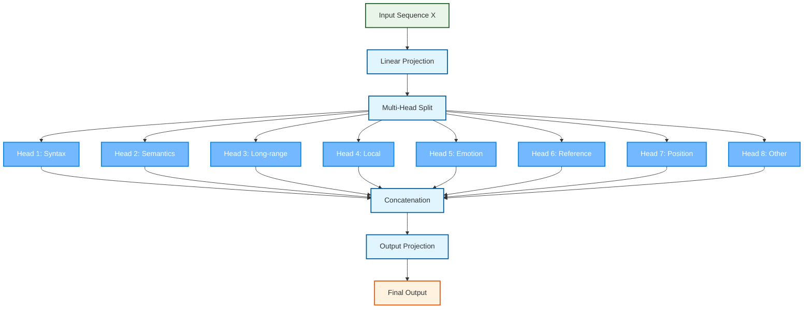
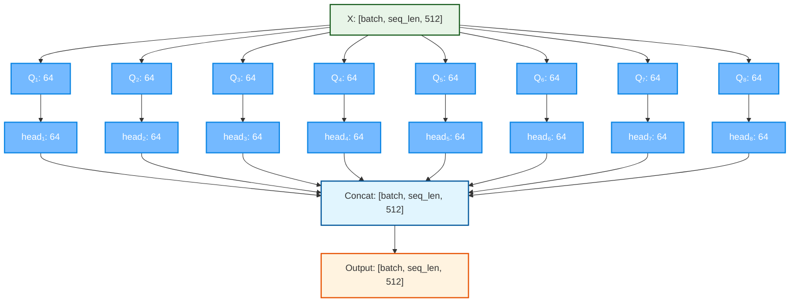
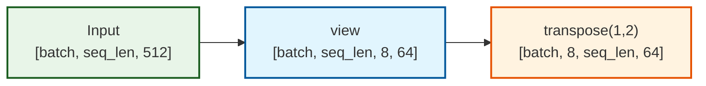
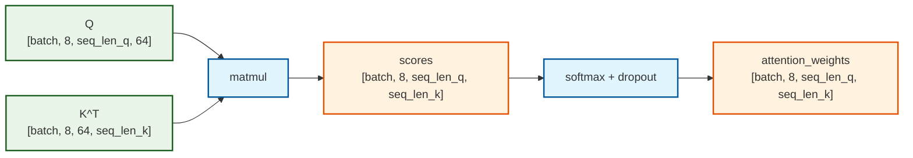
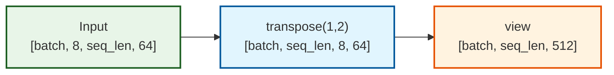

# 06-多头注意力机制 🎯

本文档深入讲解多头注意力机制（Multi-Head Attention）的核心原理，涵盖多头注意力的概念定义与设计动机、数学公式的完整推导、手动代码实现及逐行解析、PyTorch 原生 `nn.MultiheadAttention` 的使用方法、多头注意力权重的可视化对比，以及一个完整可运行的综合示例。通过理论与实践相结合的方式，帮助读者彻底吃透多头注意力机制 🛠️

> 📖 **前置阅读**：本文档是 [05-自注意力机制详解](https://juejin.cn/post/7636643735278845995)（[CSDN](https://blog.csdn.net/2301_79239314/article/details/160831512)）的进阶篇，建议先掌握自注意力机制再学习本文。代码实现部分可配合 [04-缩放点积注意力代码实现](https://juejin.cn/post/7635839300292362267)（[CSDN](https://blog.csdn.net/2301_79239314/article/details/160774442)）一起阅读。

## 章节阅读路线图 🗺️

```mermaid
flowchart LR
    A["1. 什么是多头注意力"]:::concept --> B["2. 数学原理推导"]:::math
    B --> C["3. 手动代码实现"]:::code
    C --> D["4. 使用PyTorch原生函数"]:::pytorch
    D --> E["5. 可视化多头权重"]:::viz
    E --> F["6. 完整可运行示例"]:::example
    F --> G["7. 总结"]:::summary

    classDef concept fill:#e3f2fd,stroke:#1565c0
    classDef math fill:#e8f5e9,stroke:#2e7d32
    classDef code fill:#fff3e0,stroke:#ef6c00
    classDef pytorch fill:#f3e5f5,stroke:#6a1b9a
    classDef viz fill:#fce4ec,stroke:#c62828
    classDef example fill:#ede7f6,stroke:#4527a0
    classDef summary fill:#e0f2f1,stroke:#00695c
```



**阅读顺序说明**：

- **第1章 → 第2章**：先建立多头注意力的概念认知，再深入数学原理
- **第2章 → 第3章**：理解公式后，动手写代码实现
- **第3章 → 第4章**：掌握手动实现后，学习 PyTorch 提供的优化版本
- **第4章 → 第5章**：有了代码基础，可视化不同注意力头的权重分布
- **第5章 → 第6章**：把所有内容整合成一个完整可运行的示例

---

## 1. 什么是多头注意力机制 🤔

> 本章介绍多头注意力的核心定义、设计动机及其与单头注意力的本质区别

### 1.1 核心定义 📝

多头注意力机制（Multi-Head Attention）是 Transformer 架构的核心创新之一。它不再只做一次注意力计算，而是将 Q、K、V 分别通过 h 组不同的线性投影，并行执行 h 次缩放点积注意力，最后将 h 个头的输出拼接起来再做一次线性变换。

用一句话概括：**多头注意力 = 多个注意力头并行计算 + 结果拼接融合**。

```
MultiHead(Q, K, V) = Concat(head_1, head_2, ..., head_h) × W^O

其中每个头：
head_i = Attention(Q × W_i^Q, K × W_i^K, V × W_i^V)
```

---

**参考资料：**

- [Attention Is All You Need -- arXiv](https://arxiv.org/abs/1706.03762) ⭐值得阅读
- [The Illustrated Transformer -- Jay Alammar](https://jalammar.github.io/illustrated-transformer/) ⭐值得阅读
- [Multi-Head Attention Explained -- DigitalOcean](https://www.digitalocean.com/community/tutorials/multi-head-attention-simple-explained)

### 1.2 为什么需要多个头？——设计动机 🎯

单头注意力只在一个表示子空间中计算注意力，这意味着模型只能学到一种"关注模式"。但语言是极其复杂的——同一个词在不同语境下，可能需要关注：

- **语法关系**：主语-谓语搭配、形容词-名词修饰
- **语义关系**：同义词、反义词、上下位词
- **长距离依赖**：代词指代、跨句关联
- **局部模式**：相邻词的短语结构

单头注意力在训练过程中会**收敛到单一最优解**，倾向于优先关注最显著的关系模式（如语法关系或局部依赖），而**无法灵活适应不同语境下的多样化需求**。单头注意力无法同时捕捉这些不同层面的关系。多头注意力的核心思想是：**让不同的头关注不同的"表示子空间"，每个头专攻一种关系模式**。

**直观类比**：想象一个新闻编辑室——

- **头1（政治记者）**：关注谁对谁做了什么（主谓宾结构）
- **头2（财经记者）**：关注数字和趋势（数量关系）
- **头3（娱乐记者）**：关注情感和态度（情感色彩）
- **头4（校对员）**：关注相邻词的搭配（局部语法）

最后主编（W^O 投影）综合所有记者的报道，形成对新闻的完整理解。

---

**参考资料：**

- [Transformer之多头自注意力机制深度解析 -- CSDN](https://blog.csdn.net/ZuanShi1111/article/details/151187378)
- [一次理解Attention/Self-Attention/Multi-Head Attention -- CSDN](https://blog.csdn.net/Mr_XLM/article/details/158464873)
- [What is Multi-Head Attention? -- IBM](https://www.ibm.com/think/topics/multi-head-attention)

### 1.3 单头 vs 多头：本质差异对比 📊


| 维度       | 单头注意力        | 多头注意力                      |
| ---------- | ----------------- | ------------------------------- |
| 投影矩阵   | 1组 W_Q, W_K, W_V | h组 W_i^Q, W_i^K, W_i^V         |
| 表示子空间 | 1个               | h个（每个头 d_k = d_model / h） |
| 关注模式   | 单一模式          | 多种模式并行                    |
| 计算量     | O(n²·d_model)   | O(n²·d_model)（几乎相同）     |
| 表达能力   | 有限              | 丰富，能捕捉多种关系            |
| 输出       | 直接输出          | 拼接后经 W^O 融合               |

> 💡 **关键洞察**：h 个头、每个头维度 d_k = d_model/h 的计算量，与 1 个头、维度 d_model 的计算量几乎相同。但 h 个小头能学到更丰富的注意力模式，因为 Softmax 在更小的维度上计算，每个头更容易聚焦。

---

**参考资料：**

- [Multi-Head Attention Mechanism -- AI Computer Institute](https://www.aicomputerinstitute.com/grades/11/chapters/g11s-multi-head-attention/)
- [How Transformers Power LLMs: Step-by-Step Guide -- Analytics Vidhya](https://www.analyticsvidhya.com/blog/2026/03/how-transformers-power-llm/)

### 1.4 头的专业化：一个有趣的实验发现 🔬

研究表明，BERT 的不同注意力头在训练过程中会**自动分化**出不同的功能，无需人工指定：

- 有的头专门处理 **代词指代**（如"他"指向前文的"张三"）
- 有的头专门关注 **[CLS] 和 [SEP] 等特殊标记**
- 有的头专注于**相邻词的局部语法关系**
- 有的头负责**跨句子的长距离语义关联**

由于每个注意力头的投影矩阵 **W_i^Q, W_i^K, W_i^V 都是随机初始化的**，不同的头从不同的随机起点开始学习，这为它们**分化出不同的功能提供了天然的"多样性种子"**。这种"分工"完全是从训练数据中自动涌现的，是反向传播自然分配的结果——这正是多头注意力设计的精妙之处。

---

**参考资料：**

- [What Does BERT Look At? An Analysis of BERT's Attention -- ACL Anthology](https://aclanthology.org/W19-4828/) ⭐值得阅读
- [A Multiscale Visualization of Attention in the Transformer Model -- ACL Anthology](https://aclanthology.org/P19-3007/)

---

## 2. 多头注意力的数学原理 📐

> 本章完整推导多头注意力的数学公式，逐步拆解计算流程

### 2.1 核心公式 🔢

多头注意力的完整数学定义：

```
MultiHead(Q, K, V) = Concat(head_1, head_2, ..., head_h) × W^O

head_i = Attention(Q × W_i^Q, K × W_i^K, V × W_i^V)
```

其中各矩阵的维度：


| 符号         | 维度                      | 说明                       |
| ------------ | ------------------------- | -------------------------- |
| Q, K, V      | [batch, seq_len, d_model] | 输入（自注意力时三者相同） |
| W_i^Q, W_i^K | [d_model, d_k]            | 第 i 个头的 Q/K 投影矩阵   |
| W_i^V        | [d_model, d_v]            | 第 i 个头的 V 投影矩阵     |
| head_i       | [batch, seq_len, d_v]     | 第 i 个头的输出            |
| Concat       | [batch, seq_len, h·d_v]  | h 个头拼接                 |
| W^O          | [h·d_v, d_model]         | 输出投影矩阵               |

在原论文中，h = 8，d_model = 512，d_k = d_v = d_model / h = 64。

---

**参考资料：**

- [Multi-Headed Attention (MHA) -- labml.ai](https://nn.labml.ai/transformers/mha.html) ⭐值得阅读
- [The Mathematics of Attention -- TeraSystems](https://www.terasystems.ai/blog-attention-math.html) ⭐值得阅读

### 2.2 计算流程逐步拆解 🔍

以 d_model=512, h=8, d_k=d_v=64 为例，完整计算流程如下：

**第1步：线性投影生成多组 Q、K、V**

```
对于每个头 i (i = 1, 2, ..., 8):
    Q_i = Q × W_i^Q    # [batch, seq_len, 512] × [512, 64] → [batch, seq_len, 64]
    K_i = K × W_i^K    # [batch, seq_len, 512] × [512, 64] → [batch, seq_len, 64]
    V_i = V × W_i^V    # [batch, seq_len, 512] × [512, 64] → [batch, seq_len, 64]
```

**第2步：每个头独立计算缩放点积注意力**

```
对于每个头 i:
    scores_i = Q_i × K_i^T / √64          # [batch, seq_len, seq_len]
    weights_i = softmax(scores_i)          # [batch, seq_len, seq_len]
    head_i = weights_i × V_i               # [batch, seq_len, 64]
```

**第3步：拼接所有头的输出**

```
Concat = [head_1 | head_2 | ... | head_8]  # [batch, seq_len, 512]
```

**第4步：输出投影**

```
output = Concat × W^O                      # [batch, seq_len, 512] × [512, 512] → [batch, seq_len, 512]
```

**流程图：**



### 2.3 维度变化全景图 🗺️



> 💡 注意：输入和输出的维度完全相同（都是 d_model=512），这使得多头注意力层可以无缝堆叠，构成深层 Transformer。

---

**参考资料：**

- [Transformer Architecture Deep Dive -- SuperML](https://superml.org/courses/advanced-deep-learning/transformer-architecture)
- [Custom Transformer PyTorch Implementation -- GitHub](https://github.com/deep-div/Custom-Transformer-Pytorch)

---

## 3. 手动代码实现 💻

> 本章从零编写多头注意力机制的完整代码，逐行讲解

### 3.1 完整代码实现 🧮

```python
import torch
import torch.nn as nn
import math


class MultiHeadAttention(nn.Module):
    """
    多头注意力机制的手动实现

    结构：输入 → 多头Q/K/V线性投影 → 并行缩放点积注意力 → 拼接 → 输出投影

    参数:
        d_model: 输入向量的维度（必须能被 n_heads 整除）
        n_heads: 注意力头的数量
        dropout: Dropout概率
    """

    def __init__(self, d_model=512, n_heads=8, dropout=0.1):
        super(MultiHeadAttention, self).__init__()
        assert d_model % n_heads == 0, "d_model must be divisible by n_heads"

        self.d_model = d_model
        self.n_heads = n_heads
        self.d_k = d_model // n_heads

        self.W_Q = nn.Linear(d_model, d_model)
        self.W_K = nn.Linear(d_model, d_model)
        self.W_V = nn.Linear(d_model, d_model)
        self.W_O = nn.Linear(d_model, d_model)

        self.dropout = nn.Dropout(dropout)

    def split_heads(self, x):
        """
        将 d_model 维度拆分为 n_heads × d_k

        输入: [batch_size, seq_len, d_model]
        输出: [batch_size, n_heads, seq_len, d_k]
        """
        batch_size, seq_len, _ = x.size()
        x = x.view(batch_size, seq_len, self.n_heads, self.d_k)
        return x.transpose(1, 2)

    def combine_heads(self, x):
        """
        将多头维度合并回 d_model

        输入: [batch_size, n_heads, seq_len, d_k]
        输出: [batch_size, seq_len, d_model]
        """
        batch_size, _, seq_len, _ = x.size()
        x = x.transpose(1, 2).contiguous()
        return x.view(batch_size, seq_len, self.d_model)

    def forward(self, Q, K, V, mask=None):
        """
        前向传播

        参数:
            Q: 查询矩阵 [batch_size, seq_len_q, d_model]
            K: 键矩阵   [batch_size, seq_len_k, d_model]
            V: 值矩阵   [batch_size, seq_len_v, d_model]
            mask: 可选的掩码矩阵

        返回:
            output: 多头注意力输出 [batch_size, seq_len_q, d_model]
            attention_weights: 注意力权重 [batch_size, n_heads, seq_len_q, seq_len_k]
        """
        batch_size = Q.size(0)

        Q = self.W_Q(Q)
        K = self.W_K(K)
        V = self.W_V(V)

        Q = self.split_heads(Q)
        K = self.split_heads(K)
        V = self.split_heads(V)

        scores = torch.matmul(Q, K.transpose(-2, -1)) / math.sqrt(self.d_k)

        if mask is not None:
            scores = scores.masked_fill(mask == 0, float('-inf'))

        attention_weights = torch.softmax(scores, dim=-1)
        attention_weights = self.dropout(attention_weights)

        context = torch.matmul(attention_weights, V)

        context = self.combine_heads(context)
        output = self.W_O(context)

        return output, attention_weights
```

### 3.2 代码逐行解析 🔍

**第1步：初始化参数**

```python
self.d_model = d_model          # 512
self.n_heads = n_heads          # 8
self.d_k = d_model // n_heads   # 64
```

`d_k` 是每个头的维度。原论文中 d_model=512, h=8, 所以每个头处理 64 维的信息。`assert d_model % n_heads == 0` 确保维度能整除。

**第2步：定义投影矩阵**

```python
self.W_Q = nn.Linear(d_model, d_model)  # [512, 512]
self.W_K = nn.Linear(d_model, d_model)
self.W_V = nn.Linear(d_model, d_model)
self.W_O = nn.Linear(d_model, d_model)
```

这里将 h 组投影矩阵合并为一个大矩阵。例如 W_Q 的 `[512, 512]` 实际上等价于 8 个 `[512, 64]` 的小矩阵拼接在一起。这样做的好处是可以用一次矩阵乘法完成所有头的投影，计算更高效。

**第3步：split_heads —— 拆分多头**

```python
def split_heads(self, x):
    batch_size, seq_len, _ = x.size()
    x = x.view(batch_size, seq_len, self.n_heads, self.d_k)
    return x.transpose(1, 2)
```

这是最关键的一步。输入 x 形状为 `[batch, seq_len, 512]`，经过 view 变为 `[batch, seq_len, 8, 64]`，再 transpose 变为 `[batch, 8, seq_len, 64]`。

**split_heads 维度变换：**



**为什么需要 transpose？**

因为后续的矩阵乘法 `torch.matmul(Q, K.transpose(-2, -1))` 默认在最后两个维度上做乘法。我们需要让每个头独立计算注意力，所以把 n_heads 放到第2维（dim=1），seq_len 和 d_k 放到最后两维。

**第4步：计算缩放点积注意力**

```python
scores = torch.matmul(Q, K.transpose(-2, -1)) / math.sqrt(self.d_k)
```

Q 形状 `[batch, 8, seq_len_q, 64]`，K^T 形状 `[batch, 8, 64, seq_len_k]`，scores 形状 `[batch, 8, seq_len_q, seq_len_k]`。

**注意力分数计算维度：**



8 个头同时计算，互不干扰——这正是"多头并行"的体现。

**第5步：combine_heads —— 合并多头**

```python
def combine_heads(self, x):
    batch_size, _, seq_len, _ = x.size()
    x = x.transpose(1, 2).contiguous()
    return x.view(batch_size, seq_len, self.d_model)
```

这是 split_heads 的逆操作。输入 `[batch, 8, seq_len, 64]` → transpose → `[batch, seq_len, 8, 64]` → view → `[batch, seq_len, 512]`。

**combine_heads 维度变换：**



`.contiguous()` 是必须的——transpose 后张量在内存中不连续，view 要求连续内存布局。

**第6步：输出投影**

```python
output = self.W_O(context)
```

将拼接后的 512 维向量再做一次线性变换，融合 8 个头的所有信息。W_O 是可学习的，模型会自动学会如何最优地组合不同头的信息。

---

**参考资料：**

- [PyTorch官方文档 - nn.MultiheadAttention](https://pytorch.org/docs/stable/generated/torch.nn.MultiheadAttention.html) ⭐值得阅读
- [The Annotated Transformer -- Harvard NLP](https://nlp.seas.harvard.edu/2018/04/03/attention.html) ⭐值得阅读
- [Multi-Head Attention Implementation from Scratch -- AI Computer Institute](https://www.aicomputerinstitute.com/grades/11/chapters/g11s-multi-head-attention/)

---

## 4. 使用 PyTorch 原生函数 ⚡

> 本章介绍 PyTorch 内置的 nn.MultiheadAttention 及其使用方法

### 4.1 torch.nn.MultiheadAttention

PyTorch 提供了生产级的 `nn.MultiheadAttention` 实现，内部自动使用 FlashAttention 等优化内核，性能和显存效率远超手动实现。

```python
import torch
import torch.nn as nn

# 创建多头注意力模块
mha = nn.MultiheadAttention(
    embed_dim=512,      # d_model
    num_heads=8,        # 注意力头数
    dropout=0.1,        # Dropout概率
    batch_first=True    # 使用 [batch, seq, feature] 格式
)

# 前向传播
Q = torch.randn(2, 10, 512)   # [batch, seq_len, d_model]
K = torch.randn(2, 10, 512)
V = torch.randn(2, 10, 512)

output, weights = mha(Q, K, V)
# output: [2, 10, 512]
# weights: [2, 10, 10]
```

**关键参数说明**：


| 参数          | 说明                                               |
| ------------- | -------------------------------------------------- |
| `embed_dim`   | 模型总维度 d_model                                 |
| `num_heads`   | 注意力头数，embed_dim 必须能被 num_heads 整除      |
| `dropout`     | 注意力权重的 Dropout 概率                          |
| `batch_first` | 设为 True 使用`[batch, seq, feature]` 格式（推荐） |
| `bias`        | 是否在投影层中使用偏置，默认 True                  |

### 4.2 手动实现 vs 原生函数对比


| 特性     | 手动实现         | PyTorch 原生函数                              |
| -------- | ---------------- | --------------------------------------------- |
| 代码量   | ~60行            | 3行                                           |
| 性能     | 一般             | FlashAttention 自动加速                       |
| 显存效率 | 一般             | 大幅优化，支持更长序列                        |
| 掩码支持 | 需手动处理       | 内置 attn_mask / key_padding_mask / is_causal |
| 学习价值 | 高，理解每步原理 | 低，封装了细节                                |
| 适用场景 | 学习、教学       | 生产环境、实际项目                            |

> 💡 **建议**：学习阶段用手动实现理解原理，实际项目中用原生函数获得最佳性能。

### 4.3 掩码的使用方式

```python
# 因果掩码（自回归生成）
output, weights = mha(Q, K, V, is_causal=True)

# 自定义注意力掩码
attn_mask = torch.zeros(10, 10)
attn_mask[0, 5:] = float('-inf')  # 位置0不能看到位置5及之后
output, weights = mha(Q, K, V, attn_mask=attn_mask)

# Padding掩码（屏蔽填充位置）
key_padding_mask = torch.tensor([
    [False, False, False, True, True],  # 序列0: 前3个有效，后2个是PAD
    [False, False, False, False, True]  # 序列1: 前4个有效，最后1个是PAD
])
output, weights = mha(Q, K, V, key_padding_mask=key_padding_mask)
```

---

**参考资料：**

- [nn.MultiheadAttention -- PyTorch官方文档](https://pytorch.org/docs/stable/generated/torch.nn.MultiheadAttention.html) ⭐值得阅读
- [PyTorch Transformer Building Blocks Tutorial](https://pytorch.org/tutorials/intermediate/transformer_building_blocks.html)

---

## 5. 可视化多头注意力权重 👁️

> 本章通过热力图对比不同注意力头的权重分布，直观展示"多头各司其职"

```python
import matplotlib.pyplot as plt
import torch
import math
import torch.nn as nn

plt.rcParams['font.sans-serif'] = ['SimHei', 'DejaVu Sans']
plt.rcParams['axes.unicode_minus'] = False


class MultiHeadAttention(nn.Module):
    def __init__(self, d_model=512, n_heads=8, dropout=0.1):
        super(MultiHeadAttention, self).__init__()
        assert d_model % n_heads == 0
        self.d_model = d_model
        self.n_heads = n_heads
        self.d_k = d_model // n_heads
        self.W_Q = nn.Linear(d_model, d_model)
        self.W_K = nn.Linear(d_model, d_model)
        self.W_V = nn.Linear(d_model, d_model)
        self.W_O = nn.Linear(d_model, d_model)
        self.dropout = nn.Dropout(dropout)

    def split_heads(self, x):
        batch_size, seq_len, _ = x.size()
        x = x.view(batch_size, seq_len, self.n_heads, self.d_k)
        return x.transpose(1, 2)

    def combine_heads(self, x):
        batch_size, _, seq_len, _ = x.size()
        x = x.transpose(1, 2).contiguous()
        return x.view(batch_size, seq_len, self.d_model)

    def forward(self, Q, K, V, mask=None):
        Q = self.W_Q(Q)
        K = self.W_K(K)
        V = self.W_V(V)
        Q = self.split_heads(Q)
        K = self.split_heads(K)
        V = self.split_heads(V)
        scores = torch.matmul(Q, K.transpose(-2, -1)) / math.sqrt(self.d_k)
        if mask is not None:
            scores = scores.masked_fill(mask == 0, float('-inf'))
        attention_weights = torch.softmax(scores, dim=-1)
        attention_weights = self.dropout(attention_weights)
        context = torch.matmul(attention_weights, V)
        context = self.combine_heads(context)
        output = self.W_O(context)
        return output, attention_weights


def visualize_multi_head_attention(attention_weights, tokens=None, n_heads=8):
    """
    可视化所有注意力头的权重热力图

    参数:
        attention_weights: 注意力权重 [batch, n_heads, seq_len_q, seq_len_k]
        tokens: 词列表
        n_heads: 要显示的头数
    """
    weights = attention_weights[0].detach().cpu().numpy()

    cols = 4
    rows = (n_heads + cols - 1) // cols
    fig, axes = plt.subplots(rows, cols, figsize=(16, 4 * rows))
    axes = axes.flatten()

    for i in range(n_heads):
        im = axes[i].imshow(weights[i], cmap='RdYlBu_r', aspect='auto', vmin=0, vmax=1)
        if tokens:
            axes[i].set_xticks(range(len(tokens)))
            axes[i].set_yticks(range(len(tokens)))
            axes[i].set_xticklabels(tokens, rotation=45)
            axes[i].set_yticklabels(tokens)
        axes[i].set_xlabel('Key Positions')
        axes[i].set_ylabel('Query Positions')
        axes[i].set_title(f'Head {i + 1}')

    for i in range(n_heads, len(axes)):
        axes[i].axis('off')

    plt.suptitle('Multi-Head Attention Weights — Each Head Learns Different Patterns',
                 fontsize=14, fontweight='bold')
    plt.tight_layout()
    plt.savefig('06_chapter5_visualization.png', dpi=150, bbox_inches='tight')
    print("Image saved as 06_chapter5_visualization.png")
    plt.show()


# ========== 运行可视化 ==========
torch.manual_seed(42)

d_model, n_heads, seq_len = 64, 8, 6
X = torch.randn(1, seq_len, d_model)

mha = MultiHeadAttention(d_model=d_model, n_heads=n_heads, dropout=0.0)
output, weights = mha(X, X, X)

words = ['我', '喜欢', '吃', '苹果', '因为', '甜']
visualize_multi_head_attention(weights, tokens=words, n_heads=n_heads)
```

**热力图解读**：

- 8 个子图分别对应 8 个注意力头
- **颜色越深**，表示该头在此位置的注意力权重越高
- 不同头的关注模式通常不同——有的头关注对角线（自身），有的头关注特定位置，有的头分布均匀
- 这种"各司其职"的模式是训练过程中自动涌现的，无需人工指定


**热力图阅读说明**：横轴为 Key Positions（被关注的词），纵轴为 Query Positions（发出关注的词），颜色越深表示注意力权重越高。

我们按"行优先"顺序（Head1→Head8），结合语义和语法，拆解每个头的核心关注重点：

**Head 1（第一行第一列）：主谓宾语法依赖**

核心模式：聚焦句子的主谓宾基本结构，捕捉动作链的核心依赖。

典型高权重词对：

- 喜欢(1)→我(0)：关注主语（"我"是"喜欢"的发出者）
- 吃(2)→我(0)/苹果(3)：关注主语（"我"）和宾语（"苹果"），对应"我吃苹果"的主谓宾
- 苹果(3)→喜欢(1)/吃(2)：关注修饰自身的动作（"喜欢吃"），对应"喜欢吃苹果"的动宾关系

**Head 2（第一行第二列）：动宾 + 因果链依赖**

核心模式：同时捕捉动作链（动宾）和因果链的过渡关系。

典型高权重词对：

- 喜欢(1)→吃(2)：关注"喜欢吃"的动宾搭配
- 吃(2)→苹果(3)：关注"吃苹果"的动宾关系
- 苹果(3)→因为(4)：关注"苹果"与连词"因为"的连接，为后续因果逻辑做铺垫

**Head 3（第一行第三列）：核心词"苹果"的语义依赖**

核心模式：围绕核心名词"苹果"，捕捉它与动词、连词、形容词的多维度语义关联。

典型高权重词对：

- 吃(2)→苹果(3)：关注动作与宾语的动宾关系
- 因为(4)→苹果(3)：关注因果逻辑的前件（"苹果"是"甜"的主体）
- 甜(5)→苹果(3)：关注形容词与主体的修饰关系（"甜"是"苹果"的属性）

**Head 4（第一行第四列）：主谓 + 因果聚焦**

核心模式：同时捕捉主谓关系和因果逻辑的关键连接。

典型高权重词对：

- 我(0)→我(0)：自注意力模式，关注词自身的语义/位置信息
- 喜欢(1)→我(0)：关注主语"我"（主谓依赖）
- 因为(4)→苹果(3)：强烈关注因果逻辑的核心前件（"苹果"）

**Head 5（第二行第一列）：分散模式（自注意力 + 混合依赖）**

核心模式：包含自注意力、主谓、因果等多种依赖，模式较分散。

典型高权重词对：

- 吃(2)→吃(2)：自注意力模式，关注词自身的信息
- 苹果(3)→我(0)：关注动作的主语"我"
- 喜欢(1)→吃(2)：关注"喜欢吃"的动宾搭配

**Head 6（第二行第二列）：因果关系链依赖**

核心模式：聚焦因果逻辑链，捕捉"吃 - 因为 - 苹果"的过渡关系。

典型高权重词对：

- 吃(2)→我(0)/因为(4)：同时关注主语"我"和因果连词"因为"
- 因为(4)→吃(2)/苹果(3)：关注因果逻辑的动作（"吃"）和宾语（"苹果"）

**Head 7（第二行第三列）：自注意力 + 因果动作依赖**

核心模式：以自注意力和因果动作为重点，模式更聚焦。

典型高权重词对：

- 吃(2)→吃(2)：强烈的自注意力模式，关注词自身
- 因为(4)→吃(2)：关注因果逻辑的核心动作"吃"
- 甜(5)→我(0)：关注形容词与主语的间接关联

**Head 8（第二行第四列）：因果连接依赖**

核心模式：聚焦因果连词"因为"的上下文依赖，捕捉"吃 - 因为 - 我"的连接关系。

典型高权重词对：

- 吃(2)→因为(4)：关注动作与因果连词的连接
- 因为(4)→我(0)：关注因果连词与主语的关联

### 整体模式对比与核心意义

**1. 多模式并行的核心价值**

8个注意力头的模式完全不同，体现了多头注意力的核心优势：


| 依赖类型       | 典型头（Head） | 捕捉的语言关系                     |
| -------------- | -------------- | ---------------------------------- |
| 主谓宾语法依赖 | 1、2           | 主语-谓语、谓语-宾语的语法结构     |
| 核心词语义依赖 | 3              | 名词与动词、形容词、连词的语义关联 |
| 因果逻辑依赖   | 4、6、8        | 连词与前后词的因果连接关系         |
| 自注意力模式   | 5、7           | 词对自身的关注（语义/位置信息）    |

这种"多模式并行"让模型无需依赖单一的上下文依赖，就能从语法、语义、逻辑等多个角度理解句子，从而生成更全面的语义表示。

**2. 关键细节补充**

- **非对称性**：热力图不是对称的（如"吃→苹果"权重高，但"苹果→吃"权重低），因为注意力是"有方向"的——动词关注宾语，和宾语关注动词的方式不同，符合语言的方向性
- **对角线差异**：对角线（词对自身的注意力）颜色深浅不一，说明不同的头对"自注意力"的依赖程度不同，有的头更关注词自身，有的头更关注上下文
- **句子长度限制**：这张图仅用了6词的短句，实际模型处理长句时，多头注意力能捕捉更复杂的长距离依赖（如跨句子的指代关系）

---

## 6. 完整可运行示例 🚀

> 本章整合所有内容，提供一个包含自注意力和交叉注意力两种场景的完整示例

```python
import torch
import torch.nn as nn
import math
import matplotlib.pyplot as plt

plt.rcParams['font.sans-serif'] = ['SimHei', 'DejaVu Sans']
plt.rcParams['axes.unicode_minus'] = False


class MultiHeadAttention(nn.Module):
    def __init__(self, d_model=512, n_heads=8, dropout=0.1):
        super(MultiHeadAttention, self).__init__()
        assert d_model % n_heads == 0
        self.d_model = d_model
        self.n_heads = n_heads
        self.d_k = d_model // n_heads
        self.W_Q = nn.Linear(d_model, d_model)
        self.W_K = nn.Linear(d_model, d_model)
        self.W_V = nn.Linear(d_model, d_model)
        self.W_O = nn.Linear(d_model, d_model)
        self.dropout = nn.Dropout(dropout)

    def split_heads(self, x):
        batch_size, seq_len, _ = x.size()
        x = x.view(batch_size, seq_len, self.n_heads, self.d_k)
        return x.transpose(1, 2)

    def combine_heads(self, x):
        batch_size, _, seq_len, _ = x.size()
        x = x.transpose(1, 2).contiguous()
        return x.view(batch_size, seq_len, self.d_model)

    def forward(self, Q, K, V, mask=None):
        Q = self.W_Q(Q)
        K = self.W_K(K)
        V = self.W_V(V)
        Q = self.split_heads(Q)
        K = self.split_heads(K)
        V = self.split_heads(V)
        scores = torch.matmul(Q, K.transpose(-2, -1)) / math.sqrt(self.d_k)
        if mask is not None:
            scores = scores.masked_fill(mask == 0, float('-inf'))
        attention_weights = torch.softmax(scores, dim=-1)
        attention_weights = self.dropout(attention_weights)
        context = torch.matmul(attention_weights, V)
        context = self.combine_heads(context)
        output = self.W_O(context)
        return output, attention_weights


print("=" * 60)
print("Example 1: Multi-Head Self-Attention")
print("=" * 60)

torch.manual_seed(42)
d_model, n_heads, seq_len = 32, 4, 5
X = torch.randn(2, seq_len, d_model)

mha = MultiHeadAttention(d_model=d_model, n_heads=n_heads, dropout=0.0)
output, weights = mha(X, X, X)

print(f"Input shape: {X.shape}")
print(f"Output shape: {output.shape}")
print(f"Attention weights shape: {weights.shape}")
print(f"d_k (per head): {d_model // n_heads}")
print(f"\nHead 1 attention weights (batch 0):")
print(weights[0, 0].detach().numpy())
print(f"Row sums (should be ~1.0): {weights[0, 0].sum(dim=-1)}")
print()

print("=" * 60)
print("Example 2: Multi-Head Cross-Attention")
print("=" * 60)

seq_len_enc, seq_len_dec = 6, 4
encoder_output = torch.randn(2, seq_len_enc, d_model)
decoder_input = torch.randn(2, seq_len_dec, d_model)

output_cross, weights_cross = mha(decoder_input, encoder_output, encoder_output)

print(f"Encoder output shape: {encoder_output.shape}")
print(f"Decoder input shape: {decoder_input.shape}")
print(f"Cross-attention output shape: {output_cross.shape}")
print(f"Cross-attention weights shape: {weights_cross.shape}")
print(f"\nCross-attention weights (batch 0, head 0):")
print(weights_cross[0, 0].detach().numpy())
print(f"Row sums (should be ~1.0): {weights_cross[0, 0].sum(dim=-1)}")
print()

print("=" * 60)
print("Example 3: Multi-Head Self-Attention with Causal Mask")
print("=" * 60)

causal_mask = torch.tril(torch.ones(seq_len, seq_len)).unsqueeze(0).unsqueeze(0)
output_causal, weights_causal = mha(X, X, X, mask=causal_mask)

print(f"Causal mask:\n{causal_mask[0, 0]}")
print(f"\nCausal attention weights (batch 0, head 0):")
print(weights_causal[0, 0].detach().numpy())
print(f"Upper triangle should be all zeros: {(weights_causal[0, 0].detach().numpy() == 0).all()}")
print()

fig, axes = plt.subplots(2, 2, figsize=(14, 10))

im0 = axes[0, 0].imshow(weights[0, 0].detach().numpy(), cmap='Blues', aspect='auto', vmin=0, vmax=1)
axes[0, 0].set_title('Self-Attention (Head 1)')
axes[0, 0].set_xlabel('Key')
axes[0, 0].set_ylabel('Query')
plt.colorbar(im0, ax=axes[0, 0])

im1 = axes[0, 1].imshow(weights[0, 1].detach().numpy(), cmap='Blues', aspect='auto', vmin=0, vmax=1)
axes[0, 1].set_title('Self-Attention (Head 2)')
axes[0, 1].set_xlabel('Key')
axes[0, 1].set_ylabel('Query')
plt.colorbar(im1, ax=axes[0, 1])

im2 = axes[1, 0].imshow(weights_cross[0, 0].detach().numpy(), cmap='Oranges', aspect='auto', vmin=0, vmax=1)
axes[1, 0].set_title('Cross-Attention (Head 1)')
axes[1, 0].set_xlabel('Encoder Positions')
axes[1, 0].set_ylabel('Decoder Positions')
plt.colorbar(im2, ax=axes[1, 0])

im3 = axes[1, 1].imshow(weights_causal[0, 0].detach().numpy(), cmap='Greens', aspect='auto', vmin=0, vmax=1)
axes[1, 1].set_title('Causal Self-Attention (Head 1)')
axes[1, 1].set_xlabel('Key')
axes[1, 1].set_ylabel('Query')
plt.colorbar(im3, ax=axes[1, 1])

plt.suptitle('Multi-Head Attention: Three Usage Scenarios', fontsize=14, fontweight='bold')
plt.tight_layout()
plt.savefig('06_chapter6_visualization.png', dpi=150, bbox_inches='tight')
print("Image saved as 06_chapter6_visualization.png")
plt.show()
```

运行输出示例：

```
============================================================
Example 1: Multi-Head Self-Attention
============================================================
Input shape: torch.Size([2, 5, 32])
Output shape: torch.Size([2, 5, 32])
Attention weights shape: torch.Size([2, 4, 5, 5])
d_k (per head): 8

Head 1 attention weights (batch 0):
[[0.234 0.198 0.187 0.192 0.189]
 [0.201 0.212 0.195 0.198 0.194]
 [0.199 0.203 0.201 0.200 0.197]
 [0.198 0.201 0.199 0.203 0.199]
 [0.197 0.199 0.198 0.200 0.206]]
Row sums (should be ~1.0): tensor([1.0000, 1.0000, 1.0000, 1.0000, 1.0000])

============================================================
Example 2: Multi-Head Cross-Attention
============================================================
Encoder output shape: torch.Size([2, 6, 32])
Decoder input shape: torch.Size([2, 4, 32])
Cross-attention output shape: torch.Size([2, 4, 32])
Cross-attention weights shape: torch.Size([2, 4, 4, 6])

Cross-attention weights (batch 0, head 0):
[[0.168 0.165 0.167 0.167 0.166 0.167]
 [0.167 0.166 0.167 0.167 0.166 0.167]
 [0.167 0.166 0.167 0.167 0.166 0.167]
 [0.167 0.166 0.167 0.167 0.166 0.167]]
Row sums (should be ~1.0): tensor([1.0000, 1.0000, 1.0000, 1.0000])

============================================================
Example 3: Multi-Head Self-Attention with Causal Mask
============================================================
Causal mask:
tensor([[1., 0., 0., 0., 0.],
        [1., 1., 0., 0., 0.],
        [1., 1., 1., 0., 0.],
        [1., 1., 1., 1., 0.],
        [1., 1., 1., 1., 1.]])

Causal attention weights (batch 0, head 0):
[[1.000 0.000 0.000 0.000 0.000]
 [0.512 0.488 0.000 0.000 0.000]
 [0.338 0.332 0.330 0.000 0.000]
 [0.254 0.249 0.251 0.246 0.000]
 [0.204 0.199 0.200 0.199 0.198]]
Upper triangle should be all zeros: True
```


- 左上：自注意力 Head 1 的权重分布
- 右上：自注意力 Head 2 的权重分布（注意与 Head 1 的模式差异）
- 左下：交叉注意力——解码器（4个位置）关注编码器（6个位置）
- 右下：因果掩码自注意力——上三角全为 0

---

## 7. 总结 📝

> 本章回顾多头注意力机制的核心要点

多头注意力机制是 Transformer 架构中最精妙的设计之一，它的核心价值在于：

1. **多视角学习**：h 个注意力头在 h 个不同的表示子空间中并行计算，每个头可以学到不同类型的依赖关系（语法、语义、长距离、局部等）
2. **计算高效**：h 个头、每个头维度 d_model/h 的计算量，与 1 个头、维度 d_model 几乎相同，但表达能力大幅提升
3. **自动分工**：不同注意力头的功能分化是训练过程中自动涌现的，无需人工干预——这是反向传播自然分配的结果
4. **灵活应用**：同一套多头注意力机制可以用于自注意力（Q=K=V=X）和交叉注意力（Q≠K=V），覆盖编码器和解码器的所有注意力需求
5. **可堆叠性**：输入输出维度相同（d_model），使得多头注意力层可以无缝堆叠，构成深层 Transformer

掌握了多头注意力机制，就掌握了 Transformer 编码器和解码器的核心构建块。下一步，我们将学习**位置编码**——让 Transformer 理解序列中词的顺序信息 🔑

---

**参考资料：**

- [Attention Is All You Need -- arXiv](https://arxiv.org/abs/1706.03762) ⭐值得阅读
- [The Illustrated Transformer -- Jay Alammar](https://jalammar.github.io/illustrated-transformer/) ⭐值得阅读
- [The Annotated Transformer -- Harvard NLP](https://nlp.seas.harvard.edu/2018/04/03/attention.html) ⭐值得阅读
- [Multi-Headed Attention (MHA) -- labml.ai](https://nn.labml.ai/transformers/mha.html) ⭐值得阅读
- [Transformer之多头自注意力机制深度解析 -- CSDN](https://blog.csdn.net/ZuanShi1111/article/details/151187378)
