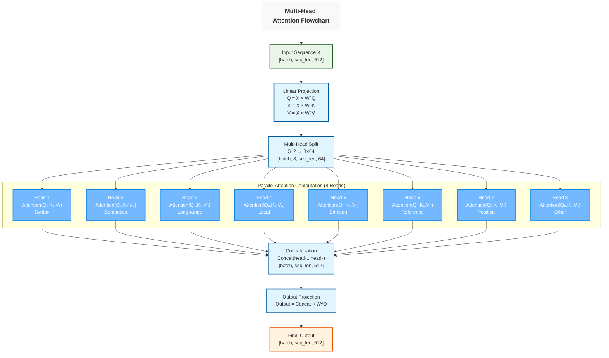

```mermaid
flowchart TD
    title["Multi-Head Attention Flowchart"]
    title:::titleStyle
    
    input["Input Sequence X<br/>[batch, seq_len, 512]"]:::inputStyle
    
    linear["Linear Projection<br/>Q = X × W^Q<br/>K = X × W^K<br/>V = X × W^V"]:::processStyle
    
    split["Multi-Head Split<br/>512 → 8×64<br/>[batch, 8, seq_len, 64]"]:::processStyle
    
    subgraph parallel["Parallel Attention Computation (8 Heads)"]
        direction TB
        head1["Head 1<br/>Attention(Q₁,K₁,V₁)<br/>Syntax"]:::headStyle
        head2["Head 2<br/>Attention(Q₂,K₂,V₂)<br/>Semantics"]:::headStyle
        head3["Head 3<br/>Attention(Q₃,K₃,V₃)<br/>Long-range"]:::headStyle
        head4["Head 4<br/>Attention(Q₄,K₄,V₄)<br/>Local"]:::headStyle
        head5["Head 5<br/>Attention(Q₅,K₅,V₅)<br/>Emotion"]:::headStyle
        head6["Head 6<br/>Attention(Q₆,K₆,V₆)<br/>Reference"]:::headStyle
        head7["Head 7<br/>Attention(Q₇,K₇,V₇)<br/>Position"]:::headStyle
        head8["Head 8<br/>Attention(Q₈,K₈,V₈)<br/>Other"]:::headStyle
    end
    
    concat["Concatenation<br/>Concat(head₁...head₈)<br/>[batch, seq_len, 512]"]:::processStyle
    
    output_proj["Output Projection<br/>Output = Concat × W^O"]:::processStyle
    
    final["Final Output<br/>[batch, seq_len, 512]"]:::outputStyle
    
    title --> input
    input --> linear
    linear --> split
    split --> head1
    split --> head2
    split --> head3
    split --> head4
    split --> head5
    split --> head6
    split --> head7
    split --> head8
    
    head1 --> concat
    head2 --> concat
    head3 --> concat
    head4 --> concat
    head5 --> concat
    head6 --> concat
    head7 --> concat
    head8 --> concat
    
    concat --> output_proj
    output_proj --> final
    
    classDef titleStyle fill:#f9f9f9,stroke:#2c3e50,stroke-width:0px,font-size:20px,font-weight:bold
    classDef inputStyle fill:#e8f5e8,stroke:#1b5e20,stroke-width:2px
    classDef processStyle fill:#e1f5fe,stroke:#01579b,stroke-width:2px
    classDef headStyle fill:#74b9ff,stroke:#0984e3,stroke-width:2px,color:white
    classDef outputStyle fill:#fff3e0,stroke:#e65100,stroke-width:2px
```
