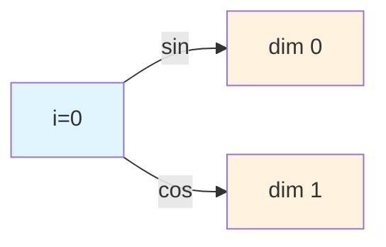
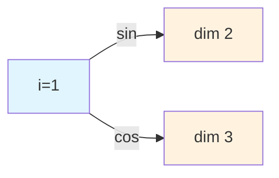
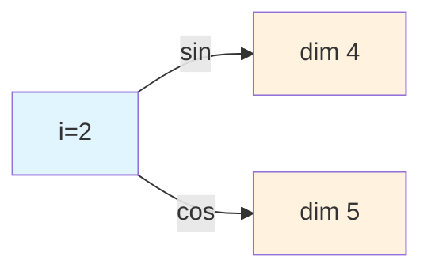

# 07-位置编码 📍

本文档基于 PyTorch 从零实现 Transformer 中的位置编码机制，涵盖为什么需要位置编码、正弦位置编码的数学原理与完整代码实现及逐行解析、可学习位置编码的对比、位置编码的可视化方法，以及 RoPE 和 ALiBi 等现代变体的简介。通过理论与实践相结合的方式，帮助读者深入理解位置编码的设计思想与实现细节 🧠

## 章节阅读路线图 🗺️

```mermaid
flowchart LR
    A["1. 环境准备"]:::setup --> B["2. 为什么需要位置编码"]:::theory
    B --> C["3. 正弦位置编码"]:::code
    C --> D["4. 可学习位置编码"]:::learn
    D --> E["5. 可视化位置编码"]:::viz
    E --> F["6. 其他位置编码简介"]:::adv
    F --> G["7. 完整可运行示例"]:::example
    G --> H["8. 总结"]:::summary

    classDef setup fill:#e3f2fd,stroke:#1565c0
    classDef theory fill:#fff3e0,stroke:#ef6c00
    classDef code fill:#e8f5e9,stroke:#2e7d32
    classDef learn fill:#f3e5f5,stroke:#6a1b9a
    classDef viz fill:#fce4ec,stroke:#c62828
    classDef adv fill:#e0f2f1,stroke:#00695c
    classDef example fill:#fff8e1,stroke:#f9a825
    classDef summary fill:#eceff1,stroke:#546e7a
```



**阅读顺序说明**：

- **第1章 → 第2章**：先确认环境就绪，再理解位置编码的必要性
- **第2章 → 第3章**：理解动机后，深入学习正弦位置编码的公式与代码
- **第3章 → 第4章**：掌握固定编码后，对比可学习位置编码的异同
- **第4章 → 第5章**：有了代码基础，可视化编码结果加深直观理解
- **第5章 → 第6章**：了解 RoPE、ALiBi 等现代变体的设计思路
- **第6章 → 第7章**：把所有内容整合成一个完整可运行的示例

---

## 1. 环境准备 🧰

> 本章确认 PyTorch 安装并导入必要库

在开始写代码之前，请确保你的环境中已经安装了 PyTorch。如果还没有安装，可以参考 [03ab-PyTorch安装教程](https://juejin.cn/post/7635465776091267122)（[CSDN](https://blog.csdn.net/2301_79239314/article/details/160747499)）。

我们需要导入以下库：

```python
import torch
import torch.nn as nn
import math
import matplotlib.pyplot as plt
import numpy as np
```

- **torch**：PyTorch 核心库，提供张量运算和自动求导
- **torch.nn**：神经网络模块，包含各种层
- **math**：Python 数学库，用于计算对数和三角函数
- **matplotlib.pyplot**：用于可视化位置编码热力图和波形图
- **numpy**：用于辅助数值计算和可视化

> 💡 如果你还没有安装 matplotlib，可以用 `pip install matplotlib` 快速安装。

---

## 2. 为什么需要位置编码 🤔

> 本章解释 Transformer 架构中位置编码的必要性

### 2.1 Transformer 的"失忆"问题 📝

在 Transformer 出现之前，NLP 任务大多以 RNN、LSTM 为代表的循环方式处理——一个 token 一个 token 地输入模型。这种顺序结构天然包含了 token 在序列中的位置信息。

但 Transformer 彻底改变了这一点：它使用 **自注意力机制（Self-Attention）** 一次性处理整个序列，所有 token 并行计算。这带来了巨大的效率提升，但也产生了一个新问题——**模型无法感知 token 的顺序**。

举个例子，下面两句话的 token 完全一样，但含义截然相反：

- "我把小姐姐安全的送回家"
- "小姐姐把我安全的送回家"

对于纯粹的自注意力机制来说，这两句话是 **完全等价** 的——它看到的只是一个"词袋"（Bag of Words），无法区分谁在前、谁在后。

**参考资料：**

- [一文搞懂Transformer的位置编码 -- CSDN](https://blog.csdn.net/xian0710830114/article/details/133377460) ⭐值得阅读
- [通俗理解Transformer的位置编码 -- CSDN](https://blog.csdn.net/u012263509/article/details/157136761)

### 2.2 位置编码的解决思路 💡

为了解决这个问题，Transformer 在输入词向量中 **显式地加入位置信息**——这就是位置编码（Positional Encoding）。

具体做法是：为序列中的每个位置生成一个唯一的编码向量，然后将这个位置编码向量与词嵌入向量 **相加**，作为模型的最终输入：

```
Input = Word_Embedding + Positional_Encoding
```

这样，即使两个位置的词向量完全相同，由于加上了不同的位置编码，模型也能区分它们。

**位置编码的理想性质**：

1. **唯一性**：每个位置具有独特的编码
2. **有界性**：编码值范围可控，避免数值不稳定
3. **泛化性**：能处理比训练时更长的序列
4. **可区分性**：不同位置之间的编码具有良好的相对位置可区分性

---

## 3. 正弦位置编码（Sinusoidal Positional Encoding）🧮

> 本章从零编写正弦位置编码的完整代码，逐行讲解

### 3.1 核心公式回顾 📝

Transformer 原始论文《Attention is All You Need》提出了基于正弦和余弦函数的位置编码方案。对于位置 `pos` 和维度索引 `i`，编码值的计算公式为：

```
PE(pos, 2i)   = sin(pos / 10000^(2i / d_model))
PE(pos, 2i+1) = cos(pos / 10000^(2i / d_model))
```

其中：
- **pos**：token 在序列中的位置（0, 1, 2, ...）
- **i**：维度索引（0, 1, 2, ..., d_model/2 - 1），**每个 i 对应一对正弦/余弦波**
- **d_model**：位置编码的总维度（必须为偶数）

**维度索引 i 的直观理解** 💡

直接看公式中的数字：

当 d_model = 6 时，位置编码向量的 6 个维度是：维度0、维度1、维度2、维度3、维度4、维度5

公式中 i 的取值范围是 0, 1, 2（因为 d_model/2 - 1 = 3 - 1 = 2）

| i 的值 | 对应公式 | 填入的维度 | 用什么函数 |
|--------|----------|------------|------------|
| i = 0 | 2i = 0, 2i+1 = 1 | 维度0、维度1 | sin、cos |
| i = 1 | 2i = 2, 2i+1 = 3 | 维度2、维度3 | sin、cos |
| i = 2 | 2i = 4, 2i+1 = 5 | 维度4、维度5 | sin、cos |

所以：
- **i = 0** → 控制**最前面两个维度**（0和1）
- **i = 1** → 控制**中间两个维度**（2和3）
- **i = 2** → 控制**最后两个维度**（4和5）

**i 就是"第几组维度"的编号**。每组 2 个维度，一个用 sin，一个用 cos。

看图理解：

<div align="center">







</div>

**设计思想**：

- **偶数维度用 sin，奇数维度用 cos**：相邻维度之间存在明确的相位关系
- **不同维度对应不同频率**：分母 `10000^(2i/d_model)` 随 i 增大而指数增长，频率呈几何级数下降
  - 低维度（i 小）→ 高频 → 编码局部位置信息
  - 高维度（i 大）→ 低频 → 编码全局位置信息
- **固定编码，不可学习**：不需要额外参数，推理时可泛化到任意长度

**为什么用 sin/cos 而不用简单的 1, 2, 3...？**

直接用递增整数（1, 2, 3...）有两个致命问题：
1. 序列越长，后面的值越大，数值不稳定
2. 数字越大占的权重越大，无法公平对待每个位置

而 sin/cos 函数的输出始终在 [-1, 1] 之间，天然有界。同时，不同频率的多尺度编码让每个位置获得独特的"多频信号"，模型可以从中学习到丰富的相对位置关系。

（维度索引 i 的含义）参考资料：
- [Transformer中的位置编码 -- CSDN](https://blog.csdn.net/lpy0204/article/details/142765968)
- [Attention Is All You Need -- arXiv](https://arxiv.org/abs/1706.03762) ⭐值得阅读
- [一文看懂Transformer中的位置编码 -- CSDN](https://blog.csdn.net/qq_41897558/article/details/137297209)
- [Transformer位置编码的深度解析 -- 腾讯云](https://cloud.tencent.com.cn/developer/article/2560432)

### 3.2 完整代码实现 💻

下面是基于 PyTorch 的完整手动实现：

```python
import torch
import torch.nn as nn
import math

class SinusoidalPositionalEncoding(nn.Module):
    """
    正弦位置编码的 PyTorch 实现
    
    参数:
        d_model: 编码向量的维度（必须为偶数）
        max_len: 支持的最大序列长度
        dropout: Dropout 概率
    """
    def __init__(self, d_model, max_len=5000, dropout=0.1):
        super(SinusoidalPositionalEncoding, self).__init__()
        self.dropout = nn.Dropout(dropout)
        
        # 1. 创建位置编码矩阵 [max_len, d_model]
        pe = torch.zeros(max_len, d_model)
        
        # 2. 生成位置索引 [max_len, 1]
        position = torch.arange(0, max_len, dtype=torch.float).unsqueeze(1)
        
        # 3. 计算频率除数项 [d_model/2]
        # 等价于 1 / (10000^(2i/d_model))
        div_term = torch.exp(
            torch.arange(0, d_model, 2).float() * (-math.log(10000.0) / d_model)
        )
        
        # 4. 偶数维度填 sin，奇数维度填 cos
        pe[:, 0::2] = torch.sin(position * div_term)
        pe[:, 1::2] = torch.cos(position * div_term)
        
        # 5. 增加 batch 维度 [1, max_len, d_model]
        pe = pe.unsqueeze(0)
        
        # 6. 注册为 buffer（不参与梯度更新，但会随模型保存）
        self.register_buffer('pe', pe)
        
    def forward(self, x):
        """
        前向传播
        
        参数:
            x: 输入张量 [batch_size, seq_len, d_model]
            
        返回:
            加上位置编码后的张量 [batch_size, seq_len, d_model]
        """
        # 取出对应长度的位置编码并加到输入上
        x = x + self.pe[:, :x.size(1), :]
        return self.dropout(x)
```

### 3.3 代码逐行解析 🔍

> 本节详细拆解每一步的计算过程和数据形状变化

**第1步：创建编码矩阵**

```python
pe = torch.zeros(max_len, d_model)
```

创建一个形状为 `[max_len, d_model]` 的全零矩阵，后续用 sin/cos 值填充。`max_len` 是预设的最大序列长度（如 5000），`d_model` 是编码维度（如 512）。

**第2步：生成位置索引**

```python
position = torch.arange(0, max_len, dtype=torch.float).unsqueeze(1)
```

- `torch.arange(0, max_len)` 生成 `[0, 1, 2, ..., max_len-1]`，形状 `[max_len]`
- `.unsqueeze(1)` 在第 1 维增加一个维度，形状变为 `[max_len, 1]`

这样做的目的是让后续的 `position * div_term` 能够广播——`[max_len, 1] * [d_model/2]` → `[max_len, d_model/2]`。

**第3步：计算频率除数项**

```python
div_term = torch.exp(
    torch.arange(0, d_model, 2).float() * (-math.log(10000.0) / d_model)
)
```

这行代码等价于计算 `1 / (10000^(2i/d_model))`，但使用了指数-对数变换来避免数值溢出：

```
原始公式: 10000^(2i/d_model)
对数变换: exp(2i/d_model * ln(10000))
倒数形式: exp(-2i/d_model * ln(10000))
代码实现: exp(i * (-ln(10000) / d_model))   # 注意这里 i 是 0,1,2... 而非 2i
```

由于 `torch.arange(0, d_model, 2)` 步长为 2，取的是 0, 2, 4, ...，所以 `i` 本身就对应了公式中的 `2i`。

**为什么用 exp-log 而不是 pow？**

`torch.pow(10000, 2*i/d_model)` 在数值上等价，但当 `d_model` 很大时，`10000^(2i/d_model)` 可能产生极大的中间值。使用 exp-log 变换可以避免这个问题，数值更稳定。

**第4步：填入 sin 和 cos**

```python
pe[:, 0::2] = torch.sin(position * div_term)
pe[:, 1::2] = torch.cos(position * div_term)
```

- `pe[:, 0::2]`：选取所有行的第 0, 2, 4, ... 列（偶数维度），填入 sin 值
- `pe[:, 1::2]`：选取所有行的第 1, 3, 5, ... 列（奇数维度），填入 cos 值
- `position * div_term`：`[max_len, 1] * [d_model/2]` → `[max_len, d_model/2]`，即每个位置在每个频率下的角度值

**第5步：增加 batch 维度**

```python
pe = pe.unsqueeze(0)
```

形状从 `[max_len, d_model]` 变为 `[1, max_len, d_model]`，方便后续与输入 `[batch_size, seq_len, d_model]` 进行广播相加。

**第6步：注册为 buffer**

```python
self.register_buffer('pe', pe)
```

`register_buffer` 将张量注册为模型的持久状态：
- **不参与梯度更新**（不是可训练参数）
- **会随模型一起保存和加载**（`model.state_dict()` 中包含）
- **会自动迁移到正确的设备**（`model.to(device)` 时一起移动）

**forward 方法**

```python
x = x + self.pe[:, :x.size(1), :]
```

- `self.pe[:, :x.size(1), :]`：从预计算的编码矩阵中取出前 `seq_len` 个位置的编码
- 形状：`[1, seq_len, d_model]`，通过广播与 `[batch_size, seq_len, d_model]` 相加

---

**参考资料：**

- [PyTorch register_buffer 详解 -- PyTorch](https://pytorch.org/docs/stable/generated/torch.nn.Module.html#torch.nn.Module.register_buffer)
- [位置编码/绝对位置编码/相对位置编码/Rope原理+公式详细推导及代码实现 -- CSDN](https://blog.csdn.net/m0_37586991/article/details/149334112)
- [CODE04:实现 Sinusoidal 编码 -- GitHub](https://github.com/helloyinwei/AIInfra/blob/main/06AlgoData/01Basic/Practice04Sinusoidal.md)

---

## 4. 可学习位置编码（Learned Positional Embedding）📚

> 本章介绍另一种常见的绝对位置编码方案

### 4.1 原理与对比 🔄

除了固定的正弦位置编码，另一种常见方案是 **可学习的位置嵌入**——将位置编码视为可训练的参数，在训练过程中由模型自主学习。

```python
class LearnedPositionalEncoding(nn.Module):
    """
    可学习位置编码
    
    参数:
        d_model: 编码向量维度
        max_len: 支持的最大序列长度
    """
    def __init__(self, d_model, max_len=5000):
        super(LearnedPositionalEncoding, self).__init__()
        # 创建一个可学习的 Embedding 层
        self.pe = nn.Embedding(max_len, d_model)
        
    def forward(self, x):
        """
        参数:
            x: 输入张量 [batch_size, seq_len, d_model]
        """
        seq_len = x.size(1)
        # 生成位置索引 [0, 1, ..., seq_len-1]
        positions = torch.arange(seq_len, device=x.device).unsqueeze(0)
        # 查表获取位置编码并加到输入上
        x = x + self.pe(positions)
        return x
```

### 4.2 两种方案对比 📊

| 特性 | 正弦位置编码 | 可学习位置编码 |
|------|------------|--------------|
| 参数量 | 0（固定函数） | max_len × d_model |
| 训练方式 | 无需训练 | 随模型一起训练 |
| 序列长度 | 理论上无限 | 受 max_len 限制 |
| 外推能力 | 较好（可泛化到更长序列） | 较差（超出训练长度效果下降） |
| 可解释性 | 高（数学公式明确） | 低（黑盒学习） |
| 代表模型 | 原始 Transformer | BERT、GPT、ViT |

> 💡 **建议**：正弦位置编码适合需要灵活序列长度的场景，可学习位置编码在固定长度任务中通常表现更好。BERT 和 GPT 系列选择了可学习方案，而原始 Transformer 使用了正弦方案。

**参考资料：**

- [位置编码祛魅 | 详解Transformer中位置编码 -- CSDN](https://blog.csdn.net/2402_85668383/article/details/144412038)
- [超越Attention：高级位置嵌入方法 -- 智源社区](https://hub.baai.ac.cn/view/40718)

---

## 5. 可视化位置编码 👁️

> 本章通过热力图和波形图直观展示位置编码

### 5.1 热力图可视化 🔥

位置编码矩阵的每一行是一个位置的编码向量，每一列是一个维度在不同位置上的值。热力图可以直观展示整体模式：

```python
import matplotlib.pyplot as plt
import torch
import math
import numpy as np

# 设置 Matplotlib 支持中文显示
plt.rcParams['font.sans-serif'] = ['SimHei', 'DejaVu Sans']
plt.rcParams['axes.unicode_minus'] = False


def get_sinusoidal_pe(seq_len, d_model):
    """生成正弦位置编码矩阵 [seq_len, d_model]"""
    pe = torch.zeros(seq_len, d_model)
    position = torch.arange(0, seq_len, dtype=torch.float).unsqueeze(1)
    div_term = torch.exp(
        torch.arange(0, d_model, 2).float() * (-math.log(10000.0) / d_model)
    )
    pe[:, 0::2] = torch.sin(position * div_term)
    pe[:, 1::2] = torch.cos(position * div_term)
    return pe


def visualize_pe_heatmap(pe, save_path='pe_heatmap.png'):
    """
    可视化位置编码热力图
    
    参数:
        pe: 位置编码矩阵 [seq_len, d_model]
        save_path: 图片保存路径
    """
    pe_np = pe.detach().cpu().numpy()
    
    plt.figure(figsize=(12, 6))
    plt.imshow(pe_np, aspect='auto', cmap='coolwarm')
    plt.colorbar(label='Encoding Value')
    plt.xlabel('Embedding Dimension')
    plt.ylabel('Token Position')
    plt.title('Sinusoidal Positional Encoding Heatmap')
    plt.tight_layout()
    plt.savefig(save_path, dpi=150, bbox_inches='tight')
    print(f"图片已保存为 {save_path}")


# ========== 运行可视化 ==========
seq_len, d_model = 100, 128
pe = get_sinusoidal_pe(seq_len, d_model)
visualize_pe_heatmap(pe)
```

**热力图解读**：

- **纵轴**：token 位置（0 到 seq_len-1）
- **横轴**：编码维度（0 到 d_model-1）
- **颜色**：编码值（红色为正，蓝色为负）
- **左侧（低维度）**：变化快，呈现高频条纹 → 编码局部位置差异
- **右侧（高维度）**：变化慢，呈现低频渐变 → 编码全局位置信息

### 5.2 波形图可视化 🌊

选取特定维度，绘制其在不同位置上的值变化，可以更直观地看到 sin/cos 的周期性：

```python
def visualize_pe_waveforms(pe, dims_to_plot=[0, 1, 10, 11, 30, 31, 60, 61]):
    """
    可视化特定维度的位置编码波形
    
    参数:
        pe: 位置编码矩阵 [seq_len, d_model]
        dims_to_plot: 要绘制的维度索引列表
    """
    pe_np = pe.detach().cpu().numpy()
    seq_len = pe_np.shape[0]
    positions = np.arange(seq_len)
    
    fig, axes = plt.subplots(len(dims_to_plot), 1, figsize=(12, 2 * len(dims_to_plot)))
    
    for idx, dim in enumerate(dims_to_plot):
        axes[idx].plot(positions, pe_np[:, dim], linewidth=0.8)
        axes[idx].set_ylabel(f'Dim {dim}')
        axes[idx].set_xlim(0, seq_len)
        axes[idx].set_ylim(-1.1, 1.1)
        axes[idx].grid(True, alpha=0.3)
    
    axes[-1].set_xlabel('Token Position')
    fig.suptitle('Positional Encoding Waveforms (Selected Dimensions)', fontsize=14)
    plt.tight_layout()
    plt.savefig('pe_waveforms.png', dpi=150, bbox_inches='tight')
    print("图片已保存为 pe_waveforms.png")


# ========== 运行可视化 ==========
visualize_pe_waveforms(pe)
```

**波形图解读**：

- **低维度（Dim 0, 1）**：频率极高，相邻位置的值剧烈变化 → 捕捉细粒度的局部位置差异
- **中维度（Dim 30, 31）**：频率适中，呈现明显的周期性波动
- **高维度（Dim 60, 61）**：频率极低，几乎呈线性变化 → 捕捉粗粒度的全局位置趋势

> 💡 这种"多频率"设计类似于信号处理中的 **傅里叶变换**——用不同频率的正弦波组合来表示任意信号。位置编码借用了同样的思想：用不同频率的 sin/cos 波来唯一标识每个位置。

**参考资料：**

- [位置编码（Positional Encoding）-- CSDN](https://blog.csdn.net/u013172930/article/details/145607554)
- [positional-encodings PyPI -- PyPI](https://pypi.org/project/positional-encodings/)

---

## 6. 其他位置编码简介 🔬

> 本章简要介绍 RoPE 和 ALiBi 两种现代位置编码方案

### 6.1 RoPE（Rotary Position Embedding）🔄

RoPE（旋转位置编码）由苏剑林等人在 2021 年提出，核心思想是 **通过对 Q 和 K 向量进行旋转来编码位置信息**，而非将位置编码加到输入上。

**核心公式**（对于一对特征）：

```
RoPE(x_m, m) = [cos(mθ)  -sin(mθ)] [x_m^(1)]
               [sin(mθ)   cos(mθ)] [x_m^(2)]
```

其中 θ_i = 10000^(-2i/d)，不同特征对使用不同的旋转角度。

**关键特性**：
- 注意力分数天然只依赖相对位置 (m - n)
- 兼具绝对位置编码和相对位置编码的优势
- 被 LLaMA、Qwen、ChatGLM 等主流大模型广泛采用

```python
# RoPE 核心代码片段（简化版）
class RotaryPositionalEmbeddings(nn.Module):
    def __init__(self, d: int, base: int = 10_000):
        super().__init__()
        self.d = d
        self.base = base
        
    def forward(self, x: torch.Tensor):
        # x: [seq_len, batch_size, n_heads, head_dim]
        seq_len = x.shape[0]
        theta = 1.0 / (self.base ** (torch.arange(0, self.d, 2).float() / self.d))
        seq_idx = torch.arange(seq_len, device=x.device).float()
        idx_theta = torch.einsum('n,d->nd', seq_idx, theta)
        
        cos_cached = idx_theta.cos()[:, None, None, :]
        sin_cached = idx_theta.sin()[:, None, None, :]
        
        # 旋转操作
        neg_half_x = torch.cat([-x[..., self.d//2:], x[..., :self.d//2]], dim=-1)
        x_rope = x * cos_cached + neg_half_x * sin_cached
        return x_rope
```

**参考资料：**

- [RoFormer: Enhanced Transformer with Rotary Position Embedding -- arXiv](https://arxiv.org/abs/2104.09864) ⭐值得阅读
- [Rotary Positional Embeddings (RoPE) -- labml.ai](https://nn.labml.ai/transformers/rope/index.html)
- [RoPE-PyTorch -- GitHub](https://github.com/aju22/RoPE-PyTorch)

### 6.2 ALiBi（Attention with Linear Biases）📏

ALiBi 由 Press 等人在 2021 年提出（ICLR 2022），核心思想是 **完全不使用位置编码向量，而是在注意力分数上直接加一个与距离成正比的线性偏置**。

**核心公式**：

```
Attention(Q, K, V) = softmax((QK^T + m × (-|i-j|)) / √d_k) × V
```

其中 m 是每个注意力头特有的斜率，|i-j| 是 token 之间的相对距离。

**关键特性**：
- **零额外参数**：不需要位置编码层
- **极强外推能力**：训练用 1024 长度，推理可外推到 2048+
- **简单高效**：训练速度提升 11%，内存节省 11%
- 被 BLOOM、MPT 等模型采用

```python
# ALiBi 偏置矩阵生成（简化版）
def build_alibi_bias(n_heads, seq_len):
    """生成 ALiBi 注意力偏置矩阵"""
    # 计算每个头的斜率
    slopes = torch.pow(2, torch.arange(1, n_heads + 1).float().neg() * (8.0 / n_heads))
    
    # 计算相对距离矩阵
    position = torch.arange(seq_len).unsqueeze(0)
    distance = (position - position.transpose(0, 1)).abs()
    
    # 生成偏置 [n_heads, seq_len, seq_len]
    alibi_bias = -slopes.view(-1, 1, 1) * distance.unsqueeze(0)
    return alibi_bias
```

**参考资料：**

- [Train Short, Test Long: ALiBi -- arXiv](https://arxiv.org/abs/2108.12409) ⭐值得阅读
- [Attention with Linear Biases (ALiBi) -- labml.ai](https://nn.labml.ai/transformers/alibi/index.html)
- [ALiBi PyTorch Implementation -- GitHub](https://github.com/jaketae/alibi)

### 6.3 方案对比总览 📊

| 方案 | 类型 | 参数量 | 外推能力 | 代表模型 |
|------|------|--------|---------|---------|
| Sinusoidal | 绝对 | 0 | 较好 | 原始 Transformer |
| Learned | 绝对 | max_len×d | 差 | BERT、GPT、ViT |
| RoPE | 相对 | 0 | 好 | LLaMA、Qwen、ChatGLM |
| ALiBi | 相对 | 0 | 极好 | BLOOM、MPT |

**参考资料：**

- [大模型位置编码2万5千字详解 -- CSDN](https://blog.csdn.net/weixin_41645791/article/details/148143474) ⭐值得阅读

---

## 7. 完整可运行示例 🎯

> 本章提供一个从头到尾可运行的完整代码

把上面的内容整合起来，下面是一个完整的可运行脚本：

```python
import torch
import torch.nn as nn
import math
import matplotlib.pyplot as plt
import numpy as np

# 设置 Matplotlib 支持中文显示
plt.rcParams['font.sans-serif'] = ['SimHei', 'DejaVu Sans']
plt.rcParams['axes.unicode_minus'] = False


class SinusoidalPositionalEncoding(nn.Module):
    """正弦位置编码"""
    
    def __init__(self, d_model, max_len=5000, dropout=0.1):
        super(SinusoidalPositionalEncoding, self).__init__()
        self.dropout = nn.Dropout(dropout)
        
        pe = torch.zeros(max_len, d_model)
        position = torch.arange(0, max_len, dtype=torch.float).unsqueeze(1)
        div_term = torch.exp(
            torch.arange(0, d_model, 2).float() * (-math.log(10000.0) / d_model)
        )
        pe[:, 0::2] = torch.sin(position * div_term)
        pe[:, 1::2] = torch.cos(position * div_term)
        pe = pe.unsqueeze(0)
        self.register_buffer('pe', pe)
        
    def forward(self, x):
        x = x + self.pe[:, :x.size(1), :]
        return self.dropout(x)


def test_positional_encoding():
    """测试位置编码模块"""
    torch.manual_seed(42)
    
    # 参数设置
    batch_size = 2
    seq_len = 10
    d_model = 512
    
    # 模拟词嵌入输入
    x = torch.randn(batch_size, seq_len, d_model)
    
    # 创建位置编码模块
    pe = SinusoidalPositionalEncoding(d_model=d_model, max_len=5000, dropout=0.0)
    
    # 前向传播
    output = pe(x)
    
    print("=" * 50)
    print("正弦位置编码测试")
    print("=" * 50)
    print(f"输入形状: {x.shape}")
    print(f"输出形状: {output.shape}")
    print(f"输入与输出形状一致: {x.shape == output.shape}")
    print(f"位置编码矩阵形状: {pe.pe.shape}")
    print(f"位置编码值范围: [{pe.pe.min():.4f}, {pe.pe.max():.4f}]")
    print("=" * 50)
    
    return pe.pe.squeeze(0)


def visualize_pe_heatmap(pe, save_path='pe_heatmap.png'):
    """可视化位置编码热力图"""
    pe_np = pe.detach().cpu().numpy()
    
    plt.figure(figsize=(12, 6))
    plt.imshow(pe_np, aspect='auto', cmap='coolwarm')
    plt.colorbar(label='Encoding Value')
    plt.xlabel('Embedding Dimension')
    plt.ylabel('Token Position')
    plt.title('Sinusoidal Positional Encoding Heatmap')
    plt.tight_layout()
    plt.savefig(save_path, dpi=150, bbox_inches='tight')
    print(f"图片已保存为 {save_path}")


def visualize_pe_waveforms(pe, dims_to_plot=[0, 1, 30, 31, 100, 101, 300, 301]):
    """可视化特定维度的位置编码波形"""
    pe_np = pe.detach().cpu().numpy()
    seq_len = pe_np.shape[0]
    positions = np.arange(seq_len)
    
    fig, axes = plt.subplots(len(dims_to_plot), 1, figsize=(12, 2 * len(dims_to_plot)))
    
    for idx, dim in enumerate(dims_to_plot):
        axes[idx].plot(positions, pe_np[:, dim], linewidth=0.8)
        axes[idx].set_ylabel(f'Dim {dim}')
        axes[idx].set_xlim(0, seq_len)
        axes[idx].set_ylim(-1.1, 1.1)
        axes[idx].grid(True, alpha=0.3)
    
    axes[-1].set_xlabel('Token Position')
    fig.suptitle('Positional Encoding Waveforms (Selected Dimensions)', fontsize=14)
    plt.tight_layout()
    plt.savefig('pe_waveforms.png', dpi=150, bbox_inches='tight')
    print("图片已保存为 pe_waveforms.png")


if __name__ == "__main__":
    # 运行测试
    pe_matrix = test_positional_encoding()
    
    # 可视化热力图
    visualize_pe_heatmap(pe_matrix[:100, :128])
    
    # 可视化波形图
    visualize_pe_waveforms(pe_matrix[:200, :512])
```

### 7.1 运行结果示例

```
==================================================
正弦位置编码测试
==================================================
输入形状: torch.Size([2, 10, 512])
输出形状: torch.Size([2, 10, 512])
输入与输出形状一致: True
位置编码矩阵形状: torch.Size([1, 5000, 512])
位置编码值范围: [-1.0000, 1.0000]
==================================================
图片已保存为 pe_heatmap.png
图片已保存为 pe_waveforms.png
```

可以看到：
- 输出形状与输入完全一致，位置编码只是改变了数值，不改变形状
- 编码值始终在 [-1, 1] 范围内，数值稳定
- 预计算了 5000 个位置的编码，实际使用时按需取用

---

## 8. 总结 📝

本节我们完成了位置编码的学习与代码实现，核心要点回顾：

| 要点 | 说明 |
|------|------|
| 为什么需要 | Transformer 的自注意力机制不具备顺序感知能力 |
| 正弦编码公式 | PE(pos,2i)=sin(pos/10000^(2i/d)), PE(pos,2i+1)=cos(pos/10000^(2i/d)) |
| 多频率设计 | 低维高频编码局部，高维低频编码全局 |
| 固定 vs 可学习 | 正弦编码无参数可外推，可学习编码需固定长度但表现更好 |
| 现代变体 | RoPE 旋转编码（LLaMA系），ALiBi 线性偏置（BLOOM系） |

🔴 **关键理解**：

- 位置编码是 Transformer 感知序列顺序的 **唯一途径**，没有它模型就是"词袋"
- 正弦编码的多频率设计是其精髓——类似傅里叶变换，用不同频率的波组合来唯一标识位置
- `register_buffer` 是关键技巧：既不是可训练参数，又能随模型保存/加载/迁移设备
- 实际项目中，现代大模型多采用 RoPE（LLaMA、Qwen）或 ALiBi（BLOOM），但理解正弦编码是掌握所有位置编码方案的基础

---

**参考资料：**

- [Attention Is All You Need -- arXiv](https://arxiv.org/abs/1706.03762) ⭐值得阅读
- [一文搞懂Transformer的位置编码 -- CSDN](https://blog.csdn.net/xian0710830114/article/details/133377460) ⭐值得阅读
- [大模型位置编码2万5千字详解 -- CSDN](https://blog.csdn.net/weixin_41645791/article/details/148143474)
- [从0开始AIGC：一文看懂Transformer中的位置编码 -- CSDN](https://blog.csdn.net/qq_41897558/article/details/137297209)
- [The Illustrated Transformer -- Jay Alammar](https://jalammar.github.io/illustrated-transformer/) ⭐值得阅读
- [Rotary Positional Embeddings (RoPE) -- labml.ai](https://nn.labml.ai/transformers/rope/index.html)
- [Attention with Linear Biases (ALiBi) -- labml.ai](https://nn.labml.ai/transformers/alibi/index.html)
