<!--
  文档：09aa-偏置是什么？.md
  说明：详细解释偏置（bias）在神经网络中的概念、作用与几何意义，通过代码示例和可视化帮助读者直观理解
-->

# 09aa-偏置是什么？🧠

<!-- 重要规范：本文档中所有数学公式（包括块级公式 $$...$$ 和行内公式 $...$）必须使用标准 LaTeX 格式编写，禁止使用纯文本或 Unicode 数学符号 -->

<!-- 全文摘要说明：以下段落是本文档的全文摘要，必须精炼概括文档核心内容，字数不能超过100个字 -->
本文档详细解释神经网络中偏置（bias）的概念，涵盖数学定义（y=wx+b 中的 b）、几何意义（y 轴截距）、为什么需要偏置、PyTorch 代码示例对比带偏置与无偏置的区别，以及偏置在深度学习和现代大语言模型中的角色 🛠️
<!-- 全文摘要结束 -->

---



```mermaid
flowchart LR
    A["1. 什么是偏置"]:::basic --> B["2. 为什么需要偏置"]:::why
    B --> C["3. 偏置的几何意义"]:::geo
    C --> D["4. 代码示例"]:::code
    D --> E["5. 偏置在神经网络中的作用"]:::role
    E --> F["6. 现代LLM中的偏置"]:::modern
    F --> G["7. 总结"]:::summary

    classDef basic fill:#e3f2fd,stroke:#1565c0
    classDef why fill:#e8f5e9,stroke:#2e7d32
    classDef geo fill:#fff3e0,stroke:#ef6c00
    classDef code fill:#f3e5f5,stroke:#6a1b9a
    classDef role fill:#fce4ec,stroke:#c62828
    classDef modern fill:#e0f2f1,stroke:#00695c
    classDef summary fill:#e0f2f1,stroke:#00695c
```

**阅读顺序说明**：

- **第1章 → 第2章**：先了解偏置是什么，再理解为什么需要它
- **第2章 → 第3章**：掌握数学直觉后，通过几何视角加深理解
- **第3章 → 第4章**：有了理论基础，用代码验证概念
- **第4章 → 第5章**：深入理解偏置在神经网络中的多重角色

---

## 1. 什么是偏置？📖

> 本章从最基本的概念开始，介绍偏置的定义

### 1.1 偏置的基本定义

在深度学习中，**偏置（bias）** 是线性层中的一个可学习参数。标准的全连接层（线性层）执行以下运算：

<!-- 数学公式必须使用 LaTeX 格式 -->
$$
y = x \times W^T + b
$$
<!-- 数学公式必须使用 LaTeX 格式 -->

其中：
- **$x$**：输入向量，形状为 $[1, d_{\text{in}}]$
- **$W$**：权重矩阵，形状为 $[d_{\text{out}}, d_{\text{in}}]$
- **$b$**：偏置向量，形状为 $[d_{\text{out}}]$
- **$y$**：输出向量，形状为 $[1, d_{\text{out}}]$

**偏置就是方程中的 $b$ —— 一个可学习的偏移量。**

```python
import torch                                              # 导入 PyTorch 核心库
import torch.nn as nn                                     # 导入神经网络模块

# 创建一个线性层：输入维度 64，输出维度 128，带偏置（默认行为）
linear = nn.Linear(in_features=64, out_features=128, bias=True)
# linear.weight.shape=[128, 64] — 权重矩阵
# linear.bias.shape=[128]       — 偏置向量

print(f"权重形状: {linear.weight.shape}")                 # 打印权重形状：[128, 64]
print(f"偏置形状: {linear.bias.shape}")                   # 打印偏置形状：[128]
print(f"偏置初始值 (前10个): {linear.bias[:10]}")         # 打印前10个偏置值，观察初始化
```

运行结果示例：

```
权重形状: torch.Size([128, 64])
偏置形状: torch.Size([128])
偏置初始值 (前10个): tensor([-0.0160, -0.0062,  -0.0073, ...])
```

> 💡 默认情况下，`nn.Linear` 使用 **均匀分布（Uniform）** 初始化偏置，初始值通常在 $[- \frac{1}{\sqrt{d_{\text{in}}}}, \frac{1}{\sqrt{d_{\text{in}}}}]$ 范围内。

### 1.2 不带偏置的线性层

如果设置 `bias=False`，则运算简化为只做线性变换，没有偏移：

<!-- 数学公式必须使用 LaTeX 格式 -->
$$
y = x \times W^T
$$
<!-- 数学公式必须使用 LaTeX 格式 -->

```python
# 创建不带偏置的线性层
linear_no_bias = nn.Linear(in_features=64, out_features=128, bias=False)

print(f"无偏置 - 权重形状: {linear_no_bias.weight.shape}")   # 打印：[128, 64]
print(f"无偏置 - 偏置属性: {linear_no_bias.bias}")            # 打印：None，表示没有偏置参数
```

运行结果：

```
无偏置 - 权重形状: torch.Size([128, 64])
无偏置 - 偏置属性: None
```

> ⚠️ 无偏置时，线性层少了一组参数。对于一个大模型而言，这意味着数万到数百万个参数被移除，既减少计算量又提升训练稳定性。

---

**参考资料：**

- [PyTorch官方文档 - nn.Linear -- PyTorch](https://pytorch.org/docs/stable/generated/torch.nn.Linear.html)
- [神经网络中的偏置（bias）究竟有什么用？ -- CSDN](https://blog.csdn.net/qq_15821487/article/details/127692277) ⭐值得阅读
- [神经网络中的偏置项(bias)的设置及作用 -- 博客园](https://www.cnblogs.com/mq0036/p/14655597.html)
- [权重和偏置：网络的参数 -- ApX Machine Learning](https://apxml.com/zh/courses/introduction-to-neural-networks/chapter-1-neural-network-foundations/weights-and-biases)

---

## 2. 为什么需要偏置？🤔

> 本章从单变量线性回归出发，直观展示偏置的必要性

### 2.1 一维情况的直观理解

考虑最简单的线性模型：用一个神经元拟合数据点，输出公式为：

<!-- 数学公式必须使用 LaTeX 格式 -->
$$
y = wx + b
$$
<!-- 数学公式必须使用 LaTeX 格式 -->

**如果没有偏置（$b=0$）**：

<!-- 数学公式必须使用 LaTeX 格式 -->
$$
y = wx
$$
<!-- 数学公式必须使用 LaTeX 格式 -->

这意味着模型拟合的直线**必须经过原点 $(0, 0)$**。但现实世界的数据几乎不会经过原点！

**直观例子**：假设我们要预测房价和面积的关系

| 面积 (平方米) | 实际价格 (万元) |
|--------------|----------------|
| 50 | 100 |
| 100 | 200 |
| 150 | 300 |

理想模型：`价格 = 2 × 面积`，即 $y = 2x$，这里的偏置 $b=0$，巧合地经过原点。

但如果在数据中加入"土地转让费"（固定成本 50 万）：

| 面积 (平方米) | 实际价格 (万元) |
|--------------|----------------|
| 50 | 150 |
| 100 | 250 |
| 150 | 350 |

此时模型为：`价格 = 2 × 面积 + 50`，即 $y = 2x + 50$。

- **带偏置**（$b=50$）：完美拟合
- **无偏置**（$b=0$）：再怎么调整 $w$，直线也必须经过原点，永远无法在纵轴方向上有偏移，误差始终存在

**这就是偏置存在的根本原因：让模型能够在 y 轴方向自由移动，不必强制经过原点。**

### 2.2 多维度推广

在高维空间中，偏置的作用是相同的。线性层的输出是输入向量的线性组合加上一个偏移量：

<!-- 数学公式必须使用 LaTeX 格式 -->
$$
y_j = \sum_{i=1}^{d_{\text{in}}} w_{ji} x_i + b_j, \quad j = 1, 2, \ldots, d_{\text{out}}
$$
<!-- 数学公式必须使用 LaTeX 格式 -->

- $w_{ji}$：第 $j$ 个输出神经元对第 $i$ 个输入的权重
- $b_j$：第 $j$ 个输出神经元的偏置（独立的偏移量）

每个输出维度都有自己独立的偏置——相当于在高维空间中给每个维度一个独立的"平移"能力。

---

**参考资料：**

- [为什么神经网络的感知机中的神经元需要偏置项？ -- 阿里云开发者社区](https://developer.aliyun.com/article/1110991) ⭐值得阅读
- [Bias in Neural Networks -- Manning](https://livebook.manning.com/wiki/categories/llm/bias)
- [Why is a bias parameter needed in neural networks? -- AI StackExchange](https://ai.stackexchange.com/questions/39511/why-is-a-bias-parameter-needed-in-neural-networks)

---

## 3. 偏置的几何意义 📐

> 本章通过几何视角，直观理解偏置的作用

### 3.1 二维空间的类比

把偏置想象成**一次函数的 y 轴截距**：

<!-- 数学公式必须使用 LaTeX 格式 -->
$$
y = wx + b
$$
<!-- 数学公式必须使用 LaTeX 格式 -->

- **$w$（权重）**：控制直线的**斜率**（倾斜程度）
- **$b$（偏置）**：控制直线在 y 轴上的**截距**（上下平移）


**关键洞察**：

| 参数 | 控制方向 | 类比 |
|------|---------|------|
| 权重 $w$ | 直线的**旋转**（斜率） | 音响的音量旋钮 |
| 偏置 $b$ | 直线的**平移**（截距） | 桌面的高度调节脚垫 |

两者配合才能精确拟合各种数据分布。

### 3.2 偏置让线性层"活"起来

**没有偏置的线性层，无论权重怎么调整，其输出值都必须通过原点。** 这带来了两个严重限制：

1. **无法处理非零均值数据**：如果输入数据的均值不是零，模型需要额外"消化"这种偏移，浪费了学习能力
2. **激活函数失效区域**：对于 Sigmoid 或 Tanh 等激活函数，如果加权和后恰好落在饱和区（梯度接近 0 的区域），没有偏置就无法通过平移来"救活"神经元


有了偏置，就能把输入整体平移，确保激活函数工作在合适的区间。

---

**参考资料：**

- [神经网络中的偏置（bias）究竟有什么用？ -- 知乎](https://www.zhihu.com/question/305340182) ⭐值得阅读
- [深度学习基础：为什么神经网络中的神经元需要偏置项？ -- 阿里云](https://developer.aliyun.com/article/1110991)
- [The role of bias in Neural Networks -- Pico](https://www.pico.net/kb/the-role-of-bias-in-neural-networks/)

---

## 4. 代码示例 💻

> 本章通过 PyTorch 代码演示带偏置和无偏置的区别

### 4.1 前向传播对比

```python
import torch                                              # 导入 PyTorch 核心库
import torch.nn as nn                                     # 导入神经网络模块

"""对比带偏置和无偏置线性层的前向传播

参数:
    无
    
返回:
    无（打印对比结果）
    
示例:
    compare_bias()
"""
def compare_bias():
    # 固定随机种子，保证结果可复现
    torch.manual_seed(42)
    
    # 构造输入：batch_size=3, in_features=4
    # 数据流动：随机张量 → x[3,4]
    x = torch.randn(3, 4)                                 # 输入张量 x，形状 [3,4]
    
    # 创建两个线性层：一个带偏置，一个不带
    # 输入 4 维 → 输出 3 维
    linear_w_bias = nn.Linear(4, 3, bias=True)            # 带偏置：y = xW^T + b
    linear_wo_bias = nn.Linear(4, 3, bias=False)          # 无偏置：y = xW^T
    
    # 为了让对比公平，手动设置相同权重，无偏置层的偏置设为 0
    with torch.no_grad():                                 # 禁用梯度跟踪，仅修改参数值
        linear_wo_bias.weight.copy_(linear_w_bias.weight) # 复制相同权重，数据流动：权重[3,4] → 权重[3,4]
    
    # 前向传播
    # 数据流动：x[3,4] → y_with_bias[3,3]
    y_with_bias = linear_w_bias(x)                        # 带偏置前向传播
    # 数据流动：x[3,4] → y_without_bias[3,3]
    y_without_bias = linear_wo_bias(x)                    # 无偏置前向传播
    
    # 打印结果对比
    print("=" * 60)                                       # 打印分隔线
    print("带偏置 vs 无偏置 前向传播对比")                 # 打印标题
    print("=" * 60)                                       # 打印分隔线
    print(f"输入 x:\n{x}")                                # 打印输入张量
    print(f"\n带偏置输出 y = xW^T + b:\n{y_with_bias}")  # 打印带偏置输出
    print(f"\n无偏置输出 y = xW^T:\n{y_without_bias}")   # 打印无偏置输出
    print(f"\n差异（偏置的效果）:\n{y_with_bias - y_without_bias}")  # 打印差值，即偏置的影响
    
    # 手动验证：偏置效果应该等于 linear_w_bias.bias
    print(f"\n手动验证 - 偏置向量 b:\n{linear_w_bias.bias}")  # 打印偏置向量
    
    print("=" * 60)                                       # 打印分隔线

# 运行对比
compare_bias()
```

运行结果示例：

```
============================================================
带偏置 vs 无偏置 前向传播对比
============================================================
输入 x:
tensor([[ 0.3367,  0.1288,  0.2345,  0.2303],
        [-1.1229, -0.1863,  2.2082, -0.6380],
        [ 0.4617,  0.2674,  0.5349,  0.8094]])

带偏置输出 y = xW^T + b:
tensor([[-0.1870,  0.3643,  0.2284],
        [ 0.4441,  1.7111, -0.9499],
        [-0.4848,  0.1915,  0.4183]], grad_fn=<AddmmBackward0>)

无偏置输出 y = xW^T:
tensor([[-0.2649, -0.0397,  0.1738],
        [ 0.3662,  1.3071, -1.0046],
        [-0.5627, -0.2125,  0.3637]], grad_fn=<MmBackward0>)

差异（偏置的效果）:
tensor([[0.0779, 0.4040, 0.0547],
        [0.0779, 0.4040, 0.0547],
        [0.0779, 0.4040, 0.0547]], grad_fn=<SubBackward0>)

手动验证 - 偏置向量 b:
Parameter containing:
tensor([0.0779, 0.4040, 0.0547], requires_grad=True)
```

从结果可以观察到：

- **差异列是相同的**：对于同一批次的不同样本，偏置的贡献是**固定的**
- **差异值就是 $b$ 向量**：带偏置的输出 = 无偏置的输出 + b
- **权重负责按输入调整**：即使没有偏置，权重矩阵 W 也能根据输入 x 产生变化

### 4.2 训练效果对比

下面用一个简单的线性回归任务，验证偏置对训练效果的影响：

```python
import torch                                              # 导入 PyTorch 核心库
import torch.nn as nn                                     # 导入神经网络模块
import torch.optim as optim                               # 导入优化器模块

"""比较带偏置和无偏置线性层的训练效果

参数:
    num_epochs: 训练轮数（默认1000）
    
返回:
    无（打印最终损失对比）
    
示例:
    compare_training()
"""
def compare_training(num_epochs=1000):
    # 生成数据：真实规律 y = 2*x + 3（斜率2，截距3）
    # 数据流动：torch.linspace → x_train[100,1]
    x_train = torch.linspace(-1, 1, 100).reshape(-1, 1)   # 创建 100 个等间隔点，形状 [100,1]
    # 数据流动：2*x + 3 + 噪声 → y_train[100,1]
    y_train = 2 * x_train + 3 + 0.1 * torch.randn(100, 1) # 真实值加噪声，形状 [100,1]
    
    # 创建模型
    model_with_bias = nn.Linear(1, 1, bias=True)          # 带偏置模型：y = wx + b
    model_wo_bias = nn.Linear(1, 1, bias=False)           # 无偏置模型：y = wx
    
    # 分别训练
    results = []                                          # 存储训练结果
    for name, model in [("带偏置", model_with_bias), ("无偏置", model_wo_bias)]:
        optimizer = optim.SGD(model.parameters(), lr=0.1) # SGD 优化器，学习率 0.1
        loss_fn = nn.MSELoss()                            # 均方误差损失函数
        
        losses = []                                       # 记录每轮损失
        for epoch in range(num_epochs):                   # 训练循环
            optimizer.zero_grad()                         # 清零梯度
            y_pred = model(x_train)                       # 前向传播，数据流动：x[100,1] → y_pred[100,1]
            loss = loss_fn(y_pred, y_train)               # 计算损失
            loss.backward()                               # 反向传播
            optimizer.step()                              # 更新参数
            losses.append(loss.item())                    # 记录损失值
        
        # 获取训练后的参数
        w = model.weight.item()                           # 取权重数值
        b = model.bias.item() if model.bias is not None else 0.0  # 取偏置数值（如存在）
        
        results.append((name, w, b, losses[-1]))          # 存入结果
    
    print("=" * 60)                                       # 打印分隔线
    print("带偏置 vs 无偏置 训练效果对比")                 # 打印标题
    print("=" * 60)                                       # 打印分隔线
    print(f"真实规律: y = 2*x + 3")                       # 打印真实规律
    print(f"{'模型类型':<10} {'学习到的 w':<15} {'学习到的 b':<15} {'最终损失':<15}")
    print("-" * 60)                                       # 打印分隔线
    for name, w, b, loss in results:                      # 遍历结果
        print(f"{name:<10} {w:<15.4f} {b:<15.4f} {loss:<15.6f}")
    
    # 分析
    print("-" * 60)                                       # 打印分隔线
    w_bias_results = results[0]                           # 带偏置结果
    w_bias_results_wo = results[1]                        # 无偏置结果
    print(f"\n带偏置模型能否逼近真实规律? {'✅ 能 (w≈2.0, b≈3.0)' if abs(w_bias_results[1]-2)<0.1 and abs(w_bias_results[2]-3)<0.5 else '❌ 不能'}")
    print(f"无偏置模型能否逼近真实规律? {'✅ 能 (w≈2.0)' if abs(w_bias_results_wo[1]-2)<0.1 else '❌ 不能'}")
    print(f"\n结论：当数据存在 y 轴偏移（非零截距）时，")
    print(f"      带偏置的模型可以准确拟合，无偏置的模型永远无法逼近真实规律。")

# 运行训练对比
compare_training(num_epochs=1000)
```

运行结果示例：

```
============================================================
带偏置 vs 无偏置 训练效果对比
============================================================
真实规律: y = 2*x + 3
模型类型       学习到的 w          学习到的 b          最终损失       
------------------------------------------------------------
带偏置        2.0032          3.0039          0.012189       
无偏置        2.0032          0.0000          9.035391       
------------------------------------------------------------

带偏置模型能否逼近真实规律? ✅ 能 (w≈2.0, b≈3.0)
无偏置模型能否逼近真实规律? ✅ 能 (w≈2.0)

结论：当数据存在 y 轴偏移（非零截距）时，
      带偏置的模型可以准确拟合，无偏置的模型永远无法逼近真实规律。
```

**关键观察**：
- 带偏置模型学习到 $w \approx 2.0, b \approx 3.0$，完美逼近真实规律
- 无偏置模型只能学习到 $w \approx 2.0$，但 $b$ 固定为 0，最终损失高达 9.04（无法拟合截距 3）
- 这就是偏置的**核心价值**：让模型拥有在 y 轴方向平移的自由度

---

**参考资料：**

- [PyTorch官方文档 - nn.Linear -- PyTorch](https://pytorch.org/docs/stable/generated/torch.nn.Linear.html)
- [深度学习偏置的作用与bias=False场景 -- CSDN](https://blog.csdn.net/Boys_Wu/article/details/109819534)

---

## 5. 偏置在神经网络中的作用 🎯

> 本章系统总结偏置在深度网络中的多重角色

### 5.1 五大核心作用

| 作用 | 描述 | 直观类比 |
|------|------|---------|
| **1. 提供偏移能力** | 即使输入全为零，偏置也能产生非零输出，避免神经元"死掉" | 桌子的水平调节脚垫 |
| **2. 增加表达力** | 让神经元能表示不经过原点的线性函数，覆盖更广泛的函数空间 | 画笔的白纸位置 |
| **3. 适应数据偏差** | 当输入数据均值不为零时，偏置可以吸收这种偏移，避免权重去"补偿" | 调音台的均衡器 |
| **4. 打破对称性** | 多个神经元从相同初始状态出发时，偏置帮助它们"各司其职" | 宴会桌上的不同座位 |
| **5. 支持万能近似** | 万能近似定理要求网络能逼近任意函数，偏置是不可或缺的条件 | 工具箱中的必备工具 |

### 5.2 作用详解

**1. 提供偏移能力**

即使某一层的所有输入都为 0（比如序列 `<PAD>` 位置在全零填充后），没有偏置层输出也一定为 0；有了偏置，输出可以是非零值：

```python
import torch                                              # 导入 PyTorch 核心库
import torch.nn as nn                                     # 导入神经网络模块

# 输入全为零
x = torch.zeros(1, 4)                                     # 全零输入 [1,4]
linear = nn.Linear(4, 3, bias=True)                       # 带偏置线性层

with torch.no_grad():                                     # 禁用梯度跟踪
    print(f"全零输入的输出: {linear(x)}")                  # 输出非零，因为加入了偏置
```

**2. 增加表达力**

考虑两个神经元，分别尝试拟合不同的数据分布：

- 神经元 A 接收正输入，需要正偏移 → $y = 2x + 5$
- 神经元 B 接收负输入，需要负偏移 → $y = 2x - 5$

如果没有偏置，这两个神经元表达式相同（$y = 2x$），无法区分。偏置让每个神经元拥有**独立于输入的"默认状态"**。

**3. 适应数据偏差**

在实际数据中，输入特征往往不会完美中心化（均值为零）。偏置项可以吸收这种偏移：

```
# 无偏置时
y = w1*x1 + w2*x2 + ...   # 权重必须同时"消化"数据偏移和实际规律

# 有偏置时
y = w1*x1 + w2*x2 + ... + b  # 偏置专门吸收偏移，权重聚焦捕捉规律
```

这让权重可以专注于学习**输入和输出的关系模式**，而非被数据分布的偏移干扰。

**核心洞察**：偏置的本质是为非零中心的输入分布提供补偿。换句话说：

- **输入分布不是零中心时** → 需要偏置 $b$ 来补偿偏移，否则 $y = wx$ 即使调整权重也无法拟合（例如要拟合 $y = 2x + 100$，无偏置模型永远不可能做到）
- **输入经过归一化后（零中心）** → 偏置变得多余，$y = wx$ 即可拟合（相当于数据平移到原点附近后，只需学斜率）

这一对比可以用一个具体的例子来说明：

| 真实规律 | 带偏置模型 $y=wx+b$ | 无偏置模型 $y=wx$ |
|---------|-------------------|------------------|
| $y = 2x + 100$（数据远离原点） | ✅ 可学习 $w\!\approx\!2, b\!\approx\!100$ | ❌ 直线必须经过原点，无论如何都无法拟合 |
| $y = 2x$（数据已平移到原点附近） | ✅ 可学习 $w\!\approx\!2, b\!\approx\!0$ | ✅ 可学习 $w\!\approx\!2$（$b$ 本就为0） |

> 💡 **引申到现代 LLM**：Transformer 中每一层前面都有 LayerNorm / RMSNorm，它会将输入**归一化为零均值、单位方差**。当输入已经是零中心分布时，偏置的补偿功能就被归一化替代了——这就是为什么现代大模型可以在注意力投影层安全地设置 `bias=False`。

---

**参考资料：**

- [神经网络中的偏置（bias）究竟有什么用？ -- CSDN](https://blog.csdn.net/qq_15821487/article/details/127692277) ⭐值得阅读
- [当模型足够大时，Bias项不会有什么特别的作用 -- CSDN](https://blog.csdn.net/ningyanggege/article/details/136698236) ⭐值得阅读
- [深度学习基础：为什么神经网络中的神经元需要偏置项？ -- 阿里云开发者社区](https://developer.aliyun.com/article/1110991)
- [Bias in Neural Networks -- Manning](https://livebook.manning.com/wiki/categories/llm/bias)


## 7. 总结 📝

偏置是神经网络中最基础但最重要的概念之一。核心要点回顾：

| 方面 | 核心结论 |
|------|---------|
| **数学定义** | $y = xW^T + b$，$b$ 就是偏置向量 |
| **几何意义** | 相当于一次函数的 y 轴截距，控制直线上下平移 |
| **为什么要偏置** | 让模型不必强制经过原点，灵活拟合真实数据分布 |
| **核心作用** | 提供偏移、增加表达力、适应数据偏差、打破对称性 |
| **偏置的取舍** | 现代大模型在 Pre-Norm + 残差连接架构下，部分层的偏置作用可被归一化替代 |

🔴 **关键理解**：

- **偏置的本质是"平移"**：在权重控制"旋转"的同时，偏置控制"平移"——两者配合才能精确拟合数据
- **偏置不是万能的**：现代大模型在标准化和残差连接架构下，偏置的作用部分被其他机制替代
- **理解偏置是理解大模型架构的基础**：[09ab-无偏置线性层](09ab-无偏置线性层.md)将深入探讨 Transformer 中偏置取舍的数学原理

---

**参考资料：**

- [神经网络中的偏置（bias）究竟有什么用？ -- CSDN](https://blog.csdn.net/qq_15821487/article/details/127692277) ⭐值得阅读
- [当模型足够大时，Bias项不会有什么特别的作用 -- CSDN](https://blog.csdn.net/ningyanggege/article/details/136698236) ⭐值得阅读
- [权重和偏置：网络的参数 -- ApX Machine Learning](https://apxml.com/zh/courses/introduction-to-neural-networks/chapter-1-neural-network-foundations/weights-and-biases)
- [The role of bias in Neural Networks -- Pico](https://www.pico.net/kb/the-role-of-bias-in-neural-networks/)
- [Why is a bias parameter needed in neural networks? -- AI StackExchange](https://ai.stackexchange.com/questions/39511/why-is-a-bias-parameter-needed-in-neural-networks)
- [深度学习基础：为什么神经网络中的神经元需要偏置项？ -- 阿里云开发者社区](https://developer.aliyun.com/article/1110991)

---

**最后更新时间**：2026-05-25
