<!--
  文档：09aaab-Softmax是什么？.md
  说明：详细解释Softmax函数的概念、数学公式、计算过程、关键性质与数值稳定性，结合注意力机制中的应用，帮助读者理解这一深度学习核心组件
-->

# 09aaab-Softmax是什么？🔥

<!-- 重要规范：本文档中所有数学公式（包括块级公式 $$...$$ 和行内公式 $...$）必须使用标准 LaTeX 格式编写，禁止使用纯文本或 Unicode 数学符号 -->

<!-- 全文摘要说明：以下段落是本文档的全文摘要，必须精炼概括文档核心内容，字数不能超过100个字 -->
本文档详细解释Softmax函数的定义、数学公式与计算过程，包括数值稳定性技巧（减去最大值）、与Sigmoid的核心区别，以及在Transformer注意力机制中如何将分数转化为概率分布，最后提供PyTorch代码示例 🛠️

```mermaid
flowchart LR
    A["1. 什么是Softmax"]:::basic --> B["2. 为什么需要Softmax"]:::why
    B --> C["3. Softmax的计算过程"]:::calc
    C --> D["4. Softmax的关键性质"]:::prop
    D --> E["5. 数值稳定性：减去最大值"]:::stable
    E --> F["6. Softmax vs Sigmoid"]:::compare
    F --> G["7. Softmax在注意力机制中的作用"]:::attn
    G --> H["8. 总结"]:::summary

    classDef basic fill:#e3f2fd,stroke:#1565c0
    classDef why fill:#e8f5e9,stroke:#2e7d32
    classDef calc fill:#fff3e0,stroke:#ef6c00
    classDef prop fill:#f3e5f5,stroke:#6a1b9a
    classDef stable fill:#fce4ec,stroke:#c62828
    classDef compare fill:#fff8e1,stroke:#f9a825
    classDef attn fill:#e0f7fa,stroke:#00838f
    classDef summary fill:#e0f2f1,stroke:#00695c
```

<!-- 全文摘要结束 -->



**阅读顺序说明**：

- **第1章 → 第2章**：先了解Softmax是什么，再理解为什么必不可少
- **第2章 → 第3章**：掌握动机后，通过手算示例理解计算细节
- **第3章 → 第4章**：有了计算直觉，系统掌握关键性质
- **第4章 → 第5章**：理解数值稳定性——实际工程中的必知技巧
- **第5章 → 第6章**：通过对比Sigmoid理解Softmax的独特定位
- **第6章 → 第7章**：回归主线，理解Softmax在注意力中的核心作用

---

## 1. 什么是Softmax？📖

> 本章给出Softmax的基本定义和核心公式

### 1.1 Softmax的基本定义

**Softmax函数**，全称"归一化指数函数"（Normalized Exponential Function），是逻辑斯谛函数（Sigmoid）从二分类到多分类的推广。它能把一个含任意实数的向量 $\mathbf{z} = [z_1, z_2, \ldots, z_n]$ 转换为一个概率分布向量 $\mathbf{p} = [p_1, p_2, \ldots, p_n]$，满足每个元素在 $(0, 1)$ 区间内，且所有元素之和为 1。

<!-- 数学公式必须使用 LaTeX 格式 -->
$$
\text{Softmax}(z_i) = \frac{e^{z_i}}{\sum_{j=1}^{n} e^{z_j}}, \quad i = 1, 2, \ldots, n
$$
<!-- 数学公式必须使用 LaTeX 格式 -->

其中：
- **$z_i$**：输入向量的第 $i$ 个元素（也叫 logit，即未归一化的原始分数）
- **$e^{z_i}$**：对每个元素取指数（以自然常数 $e \approx 2.718$ 为底）
- **$\sum_{j=1}^{n} e^{z_j}$**：所有元素的指数之和，作为归一化的分母
- **$n$**：类别总数（向量的维度）

### 1.2 通俗理解

Softmax 的核心思想可以用一句话概括：**先放大差异（指数运算），再统一换算成百分比（除以总和）。**

类比场景：假设有 3 位评委给选手打分：`[2, 5, 8]`。我们想知道每位评委的"话语权"占多大比例。

- 普通归一化：`2/(2+5+8) = 0.133`，`5/15 = 0.333`，`8/15 = 0.533` → 差异不够明显
- Softmax 归一化：先做 $e^{z}$ 放大差异，再归一化 → 最高分8获得压倒性权重，低分2几乎被忽略

**Softmax 的特点就是"强者愈强，弱者愈弱"**——它用指数函数把原本线性的差距放大为指数级的差距，让模型能够清晰聚焦于最重要的选项。

---

**参考资料：**

- [A Simple Explanation of the Softmax Function -- Victor Zhou](https://victorzhou.com/blog/softmax/) ⭐值得阅读
- [Softmax函数 -- 维基百科](https://zh.wikipedia.org/zh-cn/Softmax%E5%87%BD%E6%95%B0)
- [一文详解Softmax函数 -- 知乎](https://zhuanlan.zhihu.com/p/105722023)
- [Softmax Activation Function: Everything You Need to Know -- Pinecone](https://www.pinecone.io/learn/softmax-activation/) ⭐值得阅读

---

## 2. 为什么需要Softmax？🤔

> 本章解释Softmax在深度学习中的核心价值

### 2.1 从原始分数到概率分布

神经网络的最后一层通常会输出一组实数（logits），例如 `[2.0, 1.0, 0.1]`。这些原始分数不能直接当作"概率"使用，因为它们：

1. **可以是任意实数**（正数、负数、很大或很小），不在 $[0, 1]$ 区间
2. **总和不为 1**，无法解释为"各类别的可能性占比"
3. **相邻分数之间的相对差距不直观**：分数差 1 意味着什么？很难直接解释

Softmax 把这三个问题一次性解决——输出的每个值都在 0 到 1 之间，加起来恰好等于 1，而且分数高的类别获得更高的概率。

### 2.2 Softmax的三大核心价值

1. **转化为概率分布**
   
   Softmax 将任意实数向量映射为概率向量，使得输出可以被解释为"模型对各类别的置信度"。这在分类任务中至关重要——我们关心的不是原始分数本身，而是"模型认为这张图是猫的概率有 95%"。

2. **放大差异，突出重点**
   
   Softmax 使用指数函数 $e^x$，具有"放大差异"的特性：分数略高的选项会获得远高于比例值的权重。例如三个分数 $[1.0, 2.0, 3.0]$ 简单归一化得到 $[0.17, 0.33, 0.50]$，而 Softmax 得到 $[0.09, 0.24, 0.67]$——最高分从 50% 提升到 67%，差异更显著。

3. **可导且梯度简洁**
   
   Softmax 与交叉熵损失（Cross-Entropy Loss）组合使用时，梯度公式会退化为极其简洁的形式：$\frac{\partial L}{\partial z_i} = p_i - y_i$（预测概率减去真实标签）。这不仅计算高效，还能有效缓解梯度消失问题。

### 2.3 为什么用 $e$ 而不是其他底数？

选择自然常数 $e$ 作为指数底数有三个原因：

- **求导方便**：$(e^x)' = e^x$，指数函数的导数等于自身，在反向传播中计算简洁
- **单调递增**：$e^x$ 严格单调递增，保证输入越大 → 输出概率越大，不改变顺序
- **输出恒正**：$e^x > 0$ 对所有实数 $x$ 成立，确保概率不会出现负数或零（理论上无限接近零）

---

**参考资料：**

- [为什么大模型还在用Softmax？从概率归一化到注意力机制的底层逻辑 -- 腾讯云](https://cloud.tencent.com/developer/article/2598688) ⭐值得阅读
- [为什么softmax公式里有自然常数e -- 知乎](https://zhuanlan.zhihu.com/p/32019455928)
- [使用softmax函数进行归一化原因 -- CSDN](https://blog.csdn.net/weixin_41048094/article/details/140528380)
- [Softmax Function Definition -- DeepAI](https://deepai.org/machine-learning-glossary-and-terms/softmax-layer)

---

## 3. Softmax的计算过程 🔢

> 本章通过一个具体数值演示例，手把手计算Softmax

### 3.1 手算示例

假设输入向量为 $\mathbf{z} = [-1, 0, 3, 5]$，我们要计算 Softmax 后的概率分布。

**第1步：计算每个元素的指数**

<!-- 数学公式必须使用 LaTeX 格式 -->
$$
e^{-1} = 0.368,\quad e^{0} = 1,\quad e^{3} = 20.086,\quad e^{5} = 148.413
$$
<!-- 数学公式必须使用 LaTeX 格式 -->

**第2步：求和（分母）**

<!-- 数学公式必须使用 LaTeX 格式 -->
$$
\sum_{j=1}^{4} e^{z_j} = 0.368 + 1 + 20.086 + 148.413 = 169.867
$$
<!-- 数学公式必须使用 LaTeX 格式 -->

**第3步：每个指数除以总和（得到概率）**

<!-- 数学公式必须使用 LaTeX 格式 -->
$$
\begin{aligned}
p_1 &= \frac{0.368}{169.867} = 0.0022 \\
p_2 &= \frac{1}{169.867} = 0.0059 \\
p_3 &= \frac{20.086}{169.867} = 0.1182 \\
p_4 &= \frac{148.413}{169.867} = 0.8737
\end{aligned}
$$
<!-- 数学公式必须使用 LaTeX 格式 -->

**结果汇总**：

| 原始分数 $z_i$ | 指数 $e^{z_i}$ | Softmax 概率 $p_i$ |
|:-:|:-:|:-:|
| -1 | 0.368 | 0.22% |
| 0 | 1.000 | 0.59% |
| 3 | 20.086 | 11.82% |
| 5 | 148.413 | **87.37%** |

> ✅ 验证：$0.0022 + 0.0059 + 0.1182 + 0.8737 = 1.0000$，概率之和恰为 1。

**关键观察**：原始分数从 -1 到 5 差了 6，但经过 Softmax 后，最高分的概率（87.37%）是最低分（0.22%）的约 400 倍——指数函数将线性差距放大为指数级差距。

### 3.2 NumPy 实现（基础版）

```python
import numpy as np                                         # 导入 NumPy，用于数组运算

"""Softmax 的基础 NumPy 实现（不含数值稳定性优化）

参数:
    z: 输入向量 [n]，元素为任意实数
    
返回:
    probs: 概率分布向量 [n]，每个元素在 (0,1) 且和为 1
    
示例:
    probs = softmax_naive(np.array([-1, 0, 3, 5]))
"""
def softmax_naive(z):
    exp_z = np.exp(z)                                      # 计算每个元素的指数，数据流动：[-1,0,3,5] → [0.368,1,20.09,148.41]
    sum_exp = np.sum(exp_z)                                # 求和作为分母，数据流动：[0.368,1,20.09,148.41] → 169.87
    probs = exp_z / sum_exp                                # 逐一除以总和，数据流动：exp_z / 169.87 → probs
    return probs

# 测试
z = np.array([-1, 0, 3, 5])                                # 输入向量，与手算示例一致
print(softmax_naive(z))                                    # 输出：[0.0022 0.0059 0.1182 0.8737]
```

> ⚠️ 这个实现有**数值稳定性问题**，当输入值很大时（如 $z_i = 1000$），$e^{1000}$ 会溢出超出浮点数范围。第5章将介绍解决方案。

---

**参考资料：**

- [A Simple Explanation of the Softmax Function -- Victor Zhou](https://victorzhou.com/blog/softmax/) ⭐值得阅读
- [Softmax函数全面而详细的解读 -- 博客园](https://www.cnblogs.com/tlnshuju/p/19226188)

---

## 4. Softmax的关键性质 📐

> 本章系统总结Softmax的数学性质，帮助理解其行为

### 4.1 五大核心性质

| 性质 | 说明 | 意义 |
|------|------|------|
| **输出为概率分布** | $\sum_{i} p_i = 1$，且 $p_i \in (0, 1)$ | 可直接解释为各类别的置信度 |
| **单调递增性** | 若 $z_i > z_j$，则 $p_i > p_j$ | 保持输入的大小顺序不变 |
| **平移不变性** | $\text{Softmax}(z_i + c) = \text{Softmax}(z_i)$ | 给所有输入加相同常数，输出不变（这是数值稳定性技巧的基础） |
| **非饱和性** | 导数不会严格为 0 | 与 Sigmoid/Tanh 不同，Softmax 没有"死区" |
| **可微性** | 处处可导，梯度公式简洁 | 适合反向传播训练 |

### 4.2 平移不变性的推导

平移不变性（Translation Invariance）是 Softmax 最优雅的性质之一：

<!-- 数学公式必须使用 LaTeX 格式 -->
$$
\text{Softmax}(z_i + c) = \frac{e^{z_i + c}}{\sum_{j} e^{z_j + c}} = \frac{e^{c} \cdot e^{z_i}}{e^{c} \cdot \sum_{j} e^{z_j}} = \frac{e^{z_i}}{\sum_{j} e^{z_j}} = \text{Softmax}(z_i)
$$
<!-- 数学公式必须使用 LaTeX 格式 -->

分子和分母的 $e^c$ 因子被约掉了，所以给所有输入同时加任何常数 $c$，输出概率完全不变。

**实际应用**：这个性质正是第5章"减去最大值"技巧的数学基础——我们可以把所有输入减去最大值（$c = -\max(z)$），让最大输入变成 0，避免指数运算溢出，而输出结果完全等价。

### 4.3 Softmax 是"软"的 argmax

Softmax 可以被理解为 argmax 的**可导近似**（soft version of argmax）：

| | argmax | Softmax |
|------|---------|---------|
| **输出** | 硬选择：最大值的索引（one-hot） | 软选择：概率分布（所有选项都有权重） |
| **可导性** | 不可导 | 可导 |
| **信息保留** | 丢失"第二名"的信息 | 保留所有分数的相对大小信息 |
| **适用场景** | 推理时取最终结果 | 训练时需要梯度反向传播 |

这就是名字 "Soft"-"max" 的由来：它做的是类似 max 的事情（突出最大的），但用"软"的方式（保留所有选项的权重），而不是"硬"地只选一个。

---

**参考资料：**

- [Softmax函数 -- 维基百科](https://zh.wikipedia.org/zh-cn/Softmax%E5%87%BD%E6%95%B0)
- [Softmax is everywhere! -- GitHub](https://github.com/QingyaFan/blog/issues/179)
- [The Softmax function and its derivative -- Eli Bendersky](https://eli.thegreenplace.net/2016/the-softmax-function-and-its-derivative/) ⭐值得阅读

---

## 5. 数值稳定性：减去最大值 🛡️

> 本章讲解Softmax实际部署中的关键优化——防止指数溢出

### 5.1 问题：指数运算容易溢出

Softmax 要对每个元素计算 $e^{z_i}$。当 $z_i$ 很大时（如 $z_i = 1000$），$e^{1000} \approx 10^{434}$，远超 float32 能表示的最大值（约 $3.4 \times 10^{38}$），导致**上溢（overflow）**，计算结果变成 `inf` 或 `nan`。

### 5.2 解决方案：减去最大值

基于平移不变性（第4.2节），我们可以将所有输入减去向量中的最大值 $m = \max(z)$：

<!-- 数学公式必须使用 LaTeX 格式 -->
$$
\text{Softmax}(z_i) = \frac{e^{z_i - m}}{\sum_{j} e^{z_j - m}}, \quad m = \max(z_1, z_2, \ldots, z_n)
$$
<!-- 数学公式必须使用 LaTeX 格式 -->

**为什么这样安全？**

- 减去最大值后，最大的元素变成 $e^{0} = 1$，其余元素 $\le 1$
- 分子不可能溢出（都 $\le 1$），分母至少为 1（因为至少有一个 $e^0 = 1$）
- 根据平移不变性，输出概率与原始公式**完全一致**

**例子**：输入 $[1000, 999, 998]$，$m = 1000$

- 原始公式：$e^{1000}$ 直接溢出 ❌
- 稳定公式：$[e^{0}, e^{-1}, e^{-2}] = [1, 0.368, 0.135]$
- 归一化后：$[0.665, 0.245, 0.090]$
- 与理论值 $[0.665, 0.245, 0.090]$ 完全一致 ✅

### 5.3 NumPy 实现（稳定版）

```python
import numpy as np                                         # 导入 NumPy，用于数组运算

"""Softmax 的数值稳定 NumPy 实现

参数:
    z: 输入向量 [n]，元素为任意实数
    
返回:
    probs: 概率分布向量 [n]，每个元素在 (0,1) 且和为 1
    
示例:
    probs = softmax(np.array([1000, 999, 998]))
"""
def softmax(z):
    z_max = np.max(z)                                      # 找到最大值 m，示例：[1000,999,998] → 1000
    z_shifted = z - z_max                                  # 减去最大值，数据流动：z - m → z_shifted。确保所有值 ≤ 0，避免指数溢出
    exp_z = np.exp(z_shifted)                              # 计算稳定后的指数，数据流动：z_shifted → exp_z（最大值为 e^0=1）
    sum_exp = np.sum(exp_z)                                # 求和作为分母
    probs = exp_z / sum_exp                                # 逐一除以总和，数据流动：exp_z / sum_exp → probs
    return probs

# 测试：大数值输入
z_big = np.array([1000, 999, 998])                         # 大数值输入，原始公式会溢出
print(softmax(z_big))                                      # 输出：[0.6652 0.2447 0.0900]（稳定且正确）
```

> 💡 PyTorch 和 TensorFlow 内置的 Softmax 函数已经自动应用了此优化，你不需要手动处理。

---

**参考资料：**

- [Numerically Stable Softmax -- Brian Lester](https://blester125.com/blog/softmax.html) ⭐值得阅读
- [Numerically stable softmax -- Stack Overflow](https://stackoverflow.com/questions/42599498/numerically-stable-softmax)
- [Softmax Uncovered: Balancing Precision with Numerical Stability -- Medium](https://medium.com/@harrietfiagbor/softmax-uncovered-balancing-precision-with-numerical-stability-in-deep-learning-b8876490d411)

---

## 6. Softmax vs Sigmoid ⚔️

> 本章通过对比Sigmoid，帮助读者在工作流中正确选择

Sigmoid 和 Softmax 是最常用的两种概率化激活函数，但它们的适用场景截然不同。

### 6.1 核心公式对比

| | Sigmoid | Softmax |
|------|---------|---------|
| **公式** | $\sigma(z) = \frac{1}{1 + e^{-z}}$ | $\text{Softmax}(z_i) = \frac{e^{z_i}}{\sum_{j} e^{z_j}}$ |
| **输入** | 单个标量 | 长度为 $n$ 的向量 |
| **输出** | 单个概率值 $\in (0, 1)$ | 概率分布向量 $\in (0, 1)^n$，和为 1 |
| **输出之间** | 相互独立 | 相互竞争（一个增高，其他降低） |

### 6.2 适用场景对比

| 场景 | 推荐函数 | 原因 |
|------|---------|------|
| **二分类** | Sigmoid | 只需一个概率值判断"是/否" |
| **多分类（互斥）** | Softmax | 各类别互斥，概率之和为 1，一个样本只属于一类 |
| **多标签分类** | Sigmoid（逐元素） | 各类别独立，一个样本可以同时属于多个类别 |
| **注意力权重** | Softmax | 所有位置的关注权重之和必须为 1 |

### 6.3 关键区别：竞争 vs 独立

Sigmoid 对每个输出**独立**做决策——即使有 100 个类别，每个类别的概率也是独立计算的，总和不为 1。

Softmax 则引入**竞争**机制——所有类别共享一个分母，一个类别的概率升高必然导致其他类别降低。这更符合"互斥多分类"的直觉：如果一张图 90% 是猫，它就不太可能同时 80% 是狗。

> 💡 **选型口诀**：互斥多分类用 Softmax，独立多标签用 Sigmoid，二分类两者等价（但习惯用 Sigmoid 更省资源）。

---

**参考资料：**

- [Softmax vs Sigmoid Activation function -- GeeksforGeeks](https://www.geeksforgeeks.org/deep-learning/softmax-vs-sigmoid-activation-function/) ⭐值得阅读
- [Understanding Logits, Sigmoid, Softmax, and Cross-Entropy Loss -- Weights & Biases](https://wandb.ai/amanarora/Written-Reports/reports/Understanding-Logits-Sigmoid-Softmax-and-Cross-Entropy-Loss-in-Deep-Learning--Vmlldzo0NDMzNTU3) ⭐值得阅读
- [Sigmoid and SoftMax Functions in 5 minutes -- Medium](https://medium.com/data-science/sigmoid-and-softmax-functions-in-5-minutes-f516c80ea1f9)

---

## 7. Softmax在注意力机制中的作用 🎯

> 本章回归Transformer主线，解释Softmax在注意力中的核心地位

### 7.1 注意力公式中的Softmax

在[04-缩放点积注意力代码实现](https://juejin.cn/post/7635839300292362267)（[CSDN](https://blog.csdn.net/2301_79239314/article/details/160774442)）中，我们学过缩放点积注意力的核心公式：

<!-- 数学公式必须使用 LaTeX 格式 -->
$$
\text{Attention}(Q, K, V) = \text{softmax}\left(\frac{Q \times K^T}{\sqrt{d_k}}\right) \times V
$$
<!-- 数学公式必须使用 LaTeX 格式 -->

Softmax 在这里承担了**将注意力分数转化为注意力权重**的关键角色。

### 7.2 为什么注意力机制必须用Softmax？

注意力分数矩阵 $Q \times K^T$ 是一个 `[seq_len, seq_len]` 的矩阵，其中每个元素可以是任意实数。这个矩阵不能直接用来对 Value 做加权求和，原因有三：

1. **分数可以是负数**：如果用负数权重去加权 $V$，会抵消其他位置的信息，违背"加权贡献"的初衷
2. **分数范围不统一**：分数大小受 $d_k$ 影响（所以需要先除以 $\sqrt{d_k}$ 缩放），但仍缺乏统一的上界
3. **权重应该归一化**：一个词对所有位置的关注程度本质上是一个"注意力预算分配"问题——如果总共只有 100% 的注意力，哪些词分多少？

Softmax 恰好完美解决这三个问题：输出恒正、自动归一化到 $[0,1]$ 且和为 1、放大重要位置的权重差异。

### 7.3 Softmax + 掩码 = 选择性注意力

在 Transformer 中，Softmax 经常与掩码（Mask）配合使用。掩码操作把不需要关注的位置的分数设为 $-\infty$，经过 Softmax 后：

<!-- 数学公式必须使用 LaTeX 格式 -->
$$
\lim_{x \to -\infty} e^{x} = 0
$$
<!-- 数学公式必须使用 LaTeX 格式 -->

这些位置的权重变为 0，实现了"选择性屏蔽"。这就是为什么 Softmax 和掩码是注意力机制的黄金搭档——Softmax 提供归一化，掩码提供筛选。

### 7.4 一行代码看本质

```python
import torch.nn.functional as F                           # 导入函数式 API，包含 Softmax 操作

# 注意力分数矩阵（已缩放）：scores.shape = [seq_len, seq_len]
# 数据流动：scores[10,10] → Softmax(dim=-1) → weights[10,10]（每行和为 1）
attention_weights = F.softmax(scores, dim=-1)             # dim=-1 表示沿最后一个维度（每一行）做 Softmax
```

`dim=-1` 的含义：对于 `[batch, heads, seq_q, seq_k]` 的张量，在 `seq_k` 维度上做 Softmax，使得每个 Query 对所有 Key 的注意力权重之和为 1。这正是一个 Query 的"注意力预算"在 $n$ 个 Key 之间的分配。

---

**参考资料：**

- [Transformer自注意力中的Softmax归一化详解 -- CSDN](https://blog.csdn.net/qq_41803278/article/details/151754381) ⭐值得阅读
- [深度学习之注意力机制中的"线性变换"、"归一化"与"加权求和" -- 腾讯云](https://cloud.tencent.com/developer/article/2634501)
- [What is an attention mechanism? -- IBM](https://www.ibm.com/think/topics/attention-mechanism) ⭐值得阅读
- [Pytorch学习笔记17----Attention机制的原理与softmax函数 -- 博客园](https://www.cnblogs.com/luckyplj/p/13612646.html)

---

## 8. 总结 📝

Softmax 是深度学习中最常用的激活函数之一，核心要点回顾：

| 方面 | 核心结论 |
|------|---------|
| **数学定义** | $\text{Softmax}(z_i) = e^{z_i} / \sum_{j} e^{z_j}$，将任意实数向量转为概率分布 |
| **核心价值** | 转化为概率分布、放大差异、可导且梯度简洁 |
| **平移不变性** | $\text{Softmax}(z_i + c) = \text{Softmax}(z_i)$，是数值稳定性技巧的数学基础 |
| **数值稳定性** | 减去最大值 $m = \max(z)$ 后计算，输出等价且防止溢出 |
| **vs Sigmoid** | Softmax 用于多分类（互斥），Sigmoid 用于二分类或多标签（独立） |
| **在注意力中** | 将注意力分数 $QK^T/\sqrt{d_k}$ 归一化为权重分布，配合掩码实现选择性关注 |

🔴 **关键理解**：

- **Softmax 的本质是"归一化 + 放大"**：指数函数放大差异，除以总和完成归一化，两者配合将原始分数变为可解释的概率
- **"soft" 意味着可导**：Softmax 是 argmax 的可导近似，保留了所有选项的权重信息，使梯度能反向传播
- **平移不变性是工程基石**：理解减去最大值的原理，是写出数值稳定代码的关键

---

**最后更新时间**：2026-05-26
