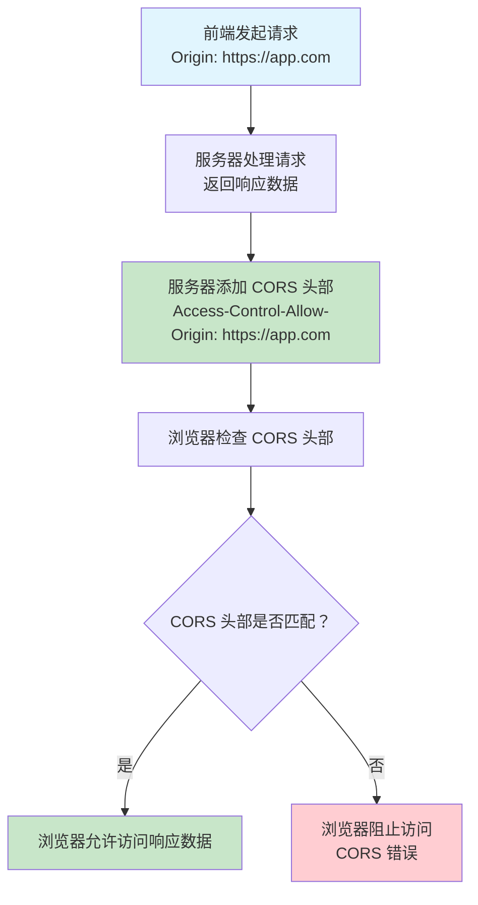
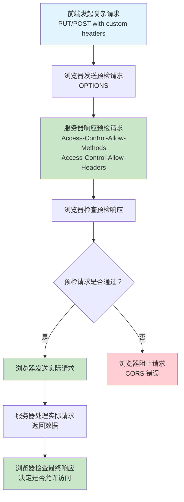

# CORS 跨域资源共享完全指南 - 从同源策略到安全跨域访问的 Web 开发利器

## 📋 摘要

CORS（Cross-Origin Resource Sharing，跨域资源共享）解决浏览器同源策略限制，通过配置 HTTP 头部实现不同域名 Web 应用安全共享资源，是前后端分离架构必备技能。

---

## 🎯 什么是 CORS？

### 生活化比喻：智能门禁系统

想象一下，你住在一个小区里，每个楼栋都有自己的门禁系统。**同源策略（Same-Origin Policy）**就像小区的安全规定：只有本楼栋的居民才能进入，外来人员需要特殊许可。

**CORS** 就像是一个**智能门禁系统**，它允许物业管理员为特定的外来人员（不同域名的应用）发放临时通行证，让他们可以安全地访问小区内的资源（API 接口）。

### 技术定义

CORS（Cross-Origin Resource Sharing，跨域资源共享）是一种基于 HTTP 头部的机制，允许服务器声明哪些源（域、协议或端口）可以访问其资源，从而实现安全的跨域数据共享。

### 同源策略详解

**同源（Same Origin）**是指协议、域名、端口三者完全相同：

| 请求 URL | 目标 URL | 是否同源 | 原因 |
|---------|---------|---------|------|
| `https://example.com` | `https://example.com` | ✅ 是 | 完全相同 |
| `https://example.com` | `http://example.com` | ❌ 否 | 协议不同（https vs http） |
| `https://example.com` | `https://api.example.com` | ❌ 否 | 域名不同 |
| `https://example.com` | `https://example.com:8080` | ❌ 否 | 端口不同 |

---

## 🔄 CORS 工作原理

### 简单请求流程



### 预检请求流程



### 为什么是浏览器决定访问权限？

**关键理解**：CORS 错误是由**浏览器**在客户端执行的安全检查引起的，而不是服务器端的错误。

#### 🔒 浏览器的安全职责

想象一下，浏览器就像一个**严格的保安**：

1. **服务器处理请求**：服务器正常处理请求并返回数据
2. **服务器添加 CORS 头部**：服务器在响应中添加 `Access-Control-Allow-Origin` 等头部
3. **浏览器检查头部**：浏览器收到响应后，检查 CORS 头部是否匹配
4. **浏览器决定访问**：只有头部匹配时，浏览器才允许 JavaScript 访问响应数据

#### 📋 具体流程说明

```javascript
// 前端代码
fetch('https://api.example.com/data')
  .then(response => response.json())  // 这里可能被浏览器阻止
  .then(data => console.log(data));  // 只有浏览器允许才能执行到这里
```

**流程详解：**
1. **请求发送**：浏览器发送请求到 `https://api.example.com`
2. **服务器响应**：服务器返回数据 + CORS 头部
3. **浏览器检查**：浏览器检查 `Access-Control-Allow-Origin` 是否包含当前域名
4. **访问控制**：
   - ✅ **匹配**：浏览器允许 JavaScript 访问响应数据
   - ❌ **不匹配**：浏览器阻止访问，抛出 CORS 错误

#### ⚠️ 重要说明

- **服务器已经处理了请求**：即使 CORS 配置错误，服务器仍然正常处理请求
- **浏览器阻止的是数据访问**：浏览器阻止的是 JavaScript 对响应数据的访问
- **错误信息来自浏览器**：CORS 错误信息是浏览器在控制台显示的，不是服务器返回的

#### 🛡️ 安全原因

浏览器这样做是为了保护用户安全：
- **防止 CSRF 攻击**：恶意网站无法窃取用户数据
- **保护用户隐私**：防止未经授权的跨域数据访问
- **维护同源策略**：确保只有授权的跨域请求才能访问数据

### 🔒 深度安全解析：CORS 的真实安全机制

#### 关键问题：恶意服务器能攻击前端吗？

您可能会想：**"如果恶意服务器要攻击前端，它完全可以模拟真正的服务器，配置正确的 CORS 头部，这样浏览器就会允许访问了！"**

**您说得完全正确！** 这确实是一个重要的安全考虑。

#### 🎯 CORS 的真实安全机制

**重要理解**：CORS **不是**防止恶意服务器攻击前端的机制！

CORS 的真正作用是：
- **防止恶意前端攻击服务器**：阻止恶意网站向其他服务器发送请求
- **保护服务器资源**：让服务器决定谁可以访问自己的数据
- **防止 CSRF 攻击**：阻止恶意网站利用用户的身份向其他服务器发送请求

#### 📋 真实的安全场景

**场景一：恶意前端攻击服务器**
```javascript
// 恶意网站 evil.com 试图攻击银行服务器
fetch('https://bank.com/transfer', {
    method: 'POST',
    body: JSON.stringify({
        to: 'attacker-account',
        amount: 10000
    })
});
```

**CORS 的保护作用**：
- ✅ **银行服务器**：设置 `Access-Control-Allow-Origin: https://bank.com`（只允许自己的前端）
- ❌ **浏览器阻止**：evil.com 的请求被阻止，因为银行服务器没有允许它

**场景二：恶意服务器攻击前端**
```http
# 恶意服务器正确配置 CORS
HTTP/1.1 200 OK
Access-Control-Allow-Origin: https://victim-app.com
Content-Type: application/json

{"malicious_data": "攻击数据"}
```

**现实情况**：
- ✅ **浏览器允许**：因为 CORS 配置正确
- ⚠️ **安全风险**：恶意服务器确实可以攻击前端

#### 🔐 CORS 的安全局限性

**重要认识**：CORS **无法**防止恶意服务器攻击前端！

**CORS 能做什么**：
- ✅ 防止恶意前端攻击服务器
- ✅ 让服务器控制谁可以访问
- ✅ 防止 CSRF 攻击

**CORS 不能做什么**：
- ❌ 防止恶意服务器攻击前端
- ❌ 验证服务器是否可信
- ❌ 防止恶意服务器返回有害数据

#### 🛡️ 真正的安全防护

**防止恶意服务器攻击前端的机制**：

1. **HTTPS 证书验证**：验证服务器身份
2. **内容安全策略（CSP）**：限制资源加载
3. **用户教育**：不要访问可疑网站
4. **服务器白名单**：只信任已知的服务器

#### 🎭 生活化比喻

**CORS 就像门禁系统**：
- **防止外人进入**：CORS 防止恶意前端访问服务器
- **不能防止内部威胁**：CORS 不能防止恶意服务器攻击前端
- **需要其他安全措施**：还需要监控、审计等其他安全机制

#### ⚠️ 重要安全原则

**"CORS 不是万能的"**

- CORS 主要保护服务器，不是前端
- 恶意服务器确实可以攻击前端
- 需要多层安全防护
- 用户教育和服务器验证同样重要

### 🔍 浏览器 CORS 检查实现机制

#### 关键问题：浏览器如何判断 CORS 配置是否正确？

您可能会好奇：**"浏览器是如何知道 `Access-Control-Allow-Origin: *` 和 `Access-Control-Allow-Credentials: true` 冲突的？"**

#### 🧠 浏览器的内置 CORS 规范检查

**核心机制**：浏览器内置了完整的 CORS 规范检查逻辑

想象一下，浏览器就像一个**智能检查器**，它内置了所有 CORS 规则：

```javascript
// 浏览器内部的 CORS 检查逻辑（简化版）
function validateCORSHeaders(responseHeaders, requestOrigin) {
    const allowOrigin = responseHeaders['Access-Control-Allow-Origin'];
    const allowCredentials = responseHeaders['Access-Control-Allow-Credentials'];
    
    // 规则 1：检查通配符与凭据冲突
    if (allowOrigin === '*' && allowCredentials === 'true') {
        return {
            valid: false,
            error: 'CORS policy: Credentials flag is true, but Access-Control-Allow-Origin is *'
        };
    }
    
    // 规则 2：检查源匹配
    if (allowOrigin !== '*' && allowOrigin !== requestOrigin) {
        return {
            valid: false,
            error: 'CORS policy: Origin mismatch'
        };
    }
    
    // 规则 3：检查方法允许
    const allowMethods = responseHeaders['Access-Control-Allow-Methods'];
    if (allowMethods && !allowMethods.includes(requestMethod)) {
        return {
            valid: false,
            error: 'CORS policy: Method not allowed'
        };
    }
    
    return { valid: true };
}
```

#### 📋 浏览器的检查步骤

**步骤 1：解析响应头部**
```http
HTTP/1.1 200 OK
Access-Control-Allow-Origin: *
Access-Control-Allow-Credentials: true
Access-Control-Allow-Methods: GET, POST
```

**步骤 2：应用 CORS 规范检查**
- ✅ 检查 `Access-Control-Allow-Origin` 值
- ✅ 检查 `Access-Control-Allow-Credentials` 值
- ✅ 检查两者是否冲突
- ✅ 检查请求源是否匹配

**步骤 3：执行安全决策**
- ❌ 发现冲突：`*` + `credentials: true` = 阻止访问
- ✅ 配置正确：允许访问响应数据

#### 🔧 具体检查规则

**规则 1：通配符与凭据冲突检查**
```javascript
// 浏览器内部检查逻辑
if (allowOrigin === '*' && allowCredentials === 'true') {
    // 这是一个不安全的配置
    throw new Error('CORS policy violation: Cannot use wildcard with credentials');
}
```

**规则 2：源匹配检查**
```javascript
// 检查请求源是否被允许
if (allowOrigin !== '*' && allowOrigin !== requestOrigin) {
    throw new Error('CORS policy violation: Origin not allowed');
}
```

**规则 3：方法检查**
```javascript
// 检查请求方法是否被允许
if (!allowedMethods.includes(requestMethod)) {
    throw new Error('CORS policy violation: Method not allowed');
}
```

#### 🏗️ 浏览器实现架构

**Chrome/Chromium 实现**：
- **Blink 引擎**：负责解析 HTTP 头部
- **V8 引擎**：执行 JavaScript 检查逻辑
- **网络层**：处理跨域请求和响应

**Firefox 实现**：
- **Gecko 引擎**：处理网络请求
- **SpiderMonkey 引擎**：执行 JavaScript
- **安全模块**：专门处理 CORS 检查

#### 📚 CORS 规范的内置实现

**W3C CORS 规范**：浏览器厂商严格按照规范实现

```text
规范要求：
1. 当 Access-Control-Allow-Credentials 为 true 时
2. Access-Control-Allow-Origin 不能是 *
3. 必须明确指定允许的源
```

**浏览器实现**：
- Chrome：在 `net/` 模块中实现
- Firefox：在 `netwerk/` 模块中实现
- Safari：在 `WebKit/` 模块中实现

#### 🎯 为什么浏览器能"知道"这些规则？

1. **标准规范**：W3C CORS 规范明确定义了所有规则
2. **内置实现**：浏览器厂商在源码中硬编码了这些检查
3. **安全优先**：浏览器优先保护用户安全，而不是服务器配置
4. **持续更新**：浏览器会更新 CORS 实现以应对新的安全威胁

#### 🔍 实际检查示例

**场景：恶意服务器配置**
```http
# 服务器返回
Access-Control-Allow-Origin: *
Access-Control-Allow-Credentials: true
```

**浏览器检查过程**：
1. 解析头部：`allowOrigin = "*"`, `allowCredentials = "true"`
2. 应用规则：检查 `*` + `credentials` 组合
3. 发现冲突：根据 CORS 规范，这是不允许的
4. 执行阻止：抛出 CORS 错误，阻止访问

**结果**：
```javascript
// 浏览器控制台错误
Access to fetch at 'https://api.example.com/data' from origin 'https://app.example.com' 
has been blocked by CORS policy: The value of the 'Access-Control-Allow-Credentials' 
header in the response is 'true' which must be 'false' when the request's credentials 
mode is 'include'. The value of the 'Access-Control-Allow-Origin' header in the 
response is '*' which must be a specific origin when the request's credentials mode is 'include'.
```

#### 🛡️ 安全设计的智慧

**"浏览器比服务器更懂安全"**

- 浏览器内置了所有安全规则
- 浏览器不会信任服务器的错误配置
- 浏览器会严格按照标准执行检查
- 浏览器是用户安全的最后保障

---

## 🔍 CORS 核心概念深度解析

### CORS 头部详解

CORS 通过 HTTP 头部实现跨域资源共享，每个头部都有特定的作用：

#### 📋 请求头部（浏览器自动添加）

| 头部名称 | 作用 | 示例 |
|---------|------|------|
| `Origin` | 指示请求的来源 | `Origin: https://app.example.com` |
| `Access-Control-Request-Method` | 预检请求中指定实际请求的方法 | `Access-Control-Request-Method: POST` |
| `Access-Control-Request-Headers` | 预检请求中指定实际请求的头部 | `Access-Control-Request-Headers: Content-Type` |

#### 📋 响应头部（服务器需要设置）

| 头部名称 | 作用 | 示例 |
|---------|------|------|
| `Access-Control-Allow-Origin` | 指定允许访问的源 | `Access-Control-Allow-Origin: https://app.example.com` |
| `Access-Control-Allow-Methods` | 指定允许的 HTTP 方法 | `Access-Control-Allow-Methods: GET, POST, PUT` |
| `Access-Control-Allow-Headers` | 指定允许的请求头部 | `Access-Control-Allow-Headers: Content-Type, Authorization` |
| `Access-Control-Allow-Credentials` | 是否允许发送凭据 | `Access-Control-Allow-Credentials: true` |
| `Access-Control-Expose-Headers` | 指定可访问的响应头部 | `Access-Control-Expose-Headers: X-Total-Count` |
| `Access-Control-Max-Age` | 预检请求缓存时间 | `Access-Control-Max-Age: 3600` |

### 简单请求 vs 预检请求

#### 🟢 简单请求条件

满足以下**所有条件**的请求被视为简单请求：

1. **HTTP 方法**：`GET`、`POST` 或 `HEAD`
2. **请求头部**：仅包含以下安全头部：
   - `Accept`
   - `Accept-Language`
   - `Content-Language`
   - `Content-Type`（仅限 `application/x-www-form-urlencoded`、`multipart/form-data` 或 `text/plain`）

#### 🟡 预检请求触发条件

以下情况会触发预检请求：

1. **复杂 HTTP 方法**：`PUT`、`DELETE`、`PATCH` 等
2. **自定义头部**：任何非安全头部
3. **复杂 Content-Type**：`application/json`、`application/xml` 等

#### 🔄 两种请求的处理流程

**简单请求流程：**
1. 浏览器直接发送请求
2. 服务器返回数据 + CORS 头部
3. 浏览器检查 CORS 头部，决定是否允许访问

**预检请求流程：**
1. 浏览器先发送 `OPTIONS` 预检请求
2. 服务器返回允许的方法和头部信息
3. 浏览器检查预检响应，决定是否发送实际请求
4. 如果允许，发送实际请求并处理响应

---

## ⚠️ 常见问题与解决方案

### 问题一：CORS 错误：Access to fetch at 'xxx' from origin 'xxx' has been blocked by CORS policy

**问题原因：** 服务器未正确配置 CORS 头部，或允许的源不匹配

**解决思路：**
- 检查服务器是否正确设置了 `Access-Control-Allow-Origin` 头部
- 确认头部值是否与请求的源域名匹配
- 验证是否允许相应的 HTTP 方法

### 问题二：预检请求失败

**问题原因：** 复杂请求需要预检请求，但服务器未正确处理 OPTIONS 请求

**解决思路：**
- 确保服务器能够处理 `OPTIONS` 请求
- 检查 `Access-Control-Allow-Methods` 和 `Access-Control-Allow-Headers` 设置
- 验证预检请求的响应头部是否完整

### 问题三：Cookie 无法发送

**问题原因：** 跨域请求默认不发送 Cookie，需要特殊配置

**解决思路：**
- 服务器设置 `Access-Control-Allow-Credentials: true`
- 前端请求设置 `credentials: 'include'`
- 注意：使用凭据时不能使用通配符 `*`

### 问题四：通配符 `*` 与凭据冲突

**问题原因：** 当 `Access-Control-Allow-Credentials` 为 `true` 时，不能使用通配符 `*`

**解决思路：**
- 明确指定允许的源域名，避免使用通配符
- 列出所有需要访问的域名
- 考虑使用环境变量管理不同环境的配置

---

## 🚀 最佳实践

### 安全最佳实践

1. **明确指定允许的源**
   - ✅ **推荐**：明确指定域名，如 `https://app.example.com`
   - ❌ **不推荐**：使用通配符 `*`，存在安全风险

2. **最小权限原则**
   - ✅ **推荐**：只允许必要的方法和头部
   - ❌ **不推荐**：允许所有方法和头部

3. **环境特定配置**
   - 开发环境：可以适当放宽限制
   - 生产环境：严格限制允许的源和方法
   - 使用配置文件管理不同环境的设置

### 性能优化建议

1. **合理设置缓存时间**
   - 使用 `Access-Control-Max-Age` 设置预检请求缓存时间
   - 建议设置为 1 小时（3600 秒）或根据业务需求调整

2. **使用 CDN 优化**
   - 静态资源使用 CDN，减少跨域请求
   - 将静态资源部署到与前端同源的 CDN

### 监控和调试

1. **添加 CORS 日志**
   - 记录跨域请求的来源和方法
   - 监控 CORS 错误的发生频率
   - 便于排查和优化 CORS 配置

2. **CORS 测试工具**
   - 使用浏览器开发者工具检查 CORS 头部
   - 验证预检请求的响应
   - 测试不同源的访问权限

---

## 🎉 总结

CORS（跨域资源共享）是现代 Web 开发中不可或缺的技术，它解决了浏览器同源策略的限制，让前后端分离架构得以实现。通过合理配置 CORS，我们可以在保证安全的前提下，实现不同域名间的资源共享。

**核心要点回顾：**
- **同源策略**是浏览器的安全机制，CORS 是其补充
- **简单请求**直接发送，**预检请求**需要先询问服务器
- **安全配置**要遵循最小权限原则
- **性能优化**要考虑缓存和 CDN 使用

掌握 CORS 技术，让你的 Web 应用能够安全、高效地实现跨域资源共享，为构建现代化的 Web 应用奠定坚实基础！继续深入学习，你将成为 Web 开发领域的专家！ 🚀

---

**厦门工学院人工智能创作坊 -- 郑恩赐**  
**2025 年 10 月 19 日**
