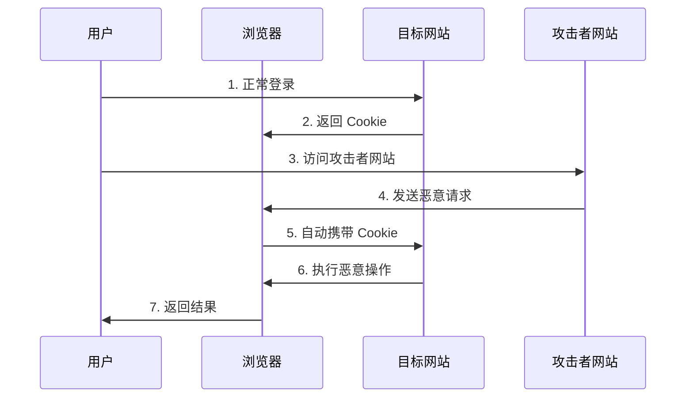

# CSRF 跨站请求伪造攻击防护指南 - 全栈 Web 安全必备知识

## 📋 摘要

**CSRF（Cross-Site Request Forgery，跨站请求伪造）** 是 Web 开发中最常见的安全威胁之一，攻击者利用用户已登录的身份，诱导用户执行非本意的恶意操作。想象一下，你在银行网站登录后，不小心点击了恶意链接，结果账户里的钱被转走了 —— 这就是 CSRF 攻击的典型场景。本文档将用通俗易懂的方式，为你揭示 CSRF 攻击的原理、危害和跨语言防护策略，让你在 5 分钟内掌握这个重要的 Web 安全知识点，为你的项目构建坚实的安全防线。

## 📚 目录

- [什么是 CSRF 攻击](#什么是-csrf-攻击)
- [攻击原理详解](#攻击原理详解)
- [常见攻击场景](#常见攻击场景)
- [跨语言防护策略](#跨语言防护策略)
- [总结](#总结)

---

## 什么是 CSRF 攻击

**CSRF（Cross-Site Request Forgery，跨站请求伪造）** 是一种网络攻击方式，攻击者通过诱导已登录用户在不知情的情况下执行恶意操作。

### 🎯 核心特点

- **利用用户身份**：攻击者不直接攻击用户，而是利用用户已登录的身份
- **诱导执行**：通过欺骗手段让用户主动触发恶意请求
- **跨站操作**：攻击发生在不同网站之间
- **语言无关**：无论使用 Java、Python、Node.js、PHP 等任何后端语言都可能遭受攻击

### 🔍 简单理解

把 CSRF 攻击比作**"冒名顶替"**：
- 你（用户）在银行（目标网站）有账户
- 坏人（攻击者）伪造你的签名（恶意请求）
- 银行看到你的签名就执行操作，不知道是坏人伪造的

---

## 攻击原理详解

### 📊 CSRF 攻击流程图



### 🔧 技术原理

1. **用户登录**：用户在目标网站正常登录，获得身份认证 Cookie
2. **诱导访问**：攻击者通过邮件、链接等方式诱导用户访问恶意网站
3. **自动请求**：恶意网站自动向目标网站发送请求，浏览器自动携带 Cookie
4. **执行操作**：目标网站认为这是用户的合法请求，执行相应操作

### 💡 关键点

- **浏览器自动行为**：浏览器会自动在请求中携带同域名的 Cookie
- **用户无感知**：用户可能完全不知道发生了攻击
- **利用信任关系**：攻击者利用网站对浏览器的信任
- **跨语言通用**：无论后端使用什么技术栈，都存在此风险

---

## 常见攻击场景

### 🏦 金融类攻击

```html
<!-- 恶意网站中的隐藏表单 -->
<form action="https://bank.com/transfer" method="POST" style="display:none">
    <input name="to" value="attacker-account">
    <input name="amount" value="10000">
</form>
<script>document.forms[0].submit();</script>
```

**攻击效果**：用户访问恶意网站时，自动向银行转账 10000 元

### 📧 邮件类攻击

```html
<!-- 恶意邮件中的链接 -->
<a href="https://social-media.com/delete-account">查看精彩内容</a>
```

**攻击效果**：用户点击链接后，社交账号被删除

### 🛒 电商类攻击

```html
<!-- 恶意网站中的请求 -->

```

**攻击效果**：用户访问恶意网站时，购物车自动添加 100 件昂贵商品

---

## 跨语言防护策略

### 🛡️ 1. CSRF Token（推荐方案）

**原理**：为每个用户会话生成唯一的随机 Token，验证请求的合法性

#### Java（Spring Security）

```java
@Configuration
@EnableWebSecurity
public class SecurityConfig {
    
    @Bean
    public SecurityFilterChain filterChain(HttpSecurity http) throws Exception {
        http
            .csrf(csrf -> csrf
                .csrfTokenRepository(CookieCsrfTokenRepository.withHttpOnlyFalse())
                .ignoringRequestMatchers("/api/public/**")
            );
        return http.build();
    }
}
```

#### Python（Django）

```python
# settings.py
MIDDLEWARE = [
    'django.middleware.csrf.CsrfViewMiddleware',
    # 其他中间件...
]

# views.py
from django.middleware.csrf import get_token
from django.http import JsonResponse

def get_csrf_token(request):
    return JsonResponse({'csrfToken': get_token(request)})
```

#### Node.js（Express）

```javascript
const express = require('express');
const csrf = require('csurf');

const app = express();

// CSRF 防护中间件
const csrfProtection = csrf({ cookie: true });

app.use(csrfProtection);

// 获取 CSRF Token
app.get('/csrf-token', (req, res) => {
    res.json({ csrfToken: req.csrfToken() });
});
```

#### PHP（Laravel）

```php
// 在 Blade 模板中
<form method="POST" action="/transfer">
    @csrf
    <input type="text" name="amount">
    <button type="submit">转账</button>
</form>

// 在控制器中验证
public function transfer(Request $request)
{
    $request->validate([
        'amount' => 'required|numeric'
    ]);
    
    // 业务逻辑
}
```

### 🔒 2. SameSite Cookie 属性

**原理**：限制 Cookie 在跨站请求中的使用

#### Java（Spring Boot）

```java
@Configuration
public class CookieConfig {
    
    @Bean
    public CookieSerializer cookieSerializer() {
        DefaultCookieSerializer serializer = new DefaultCookieSerializer();
        serializer.setSameSite("Strict");
        serializer.setUseHttpOnlyCookie(true);
        serializer.setUseSecureCookie(true);
        return serializer;
    }
}
```

#### Python（Flask）

```python
from flask import Flask, make_response

app = Flask(__name__)

@app.route('/login')
def login():
    response = make_response('登录成功')
    response.set_cookie('session', 'session_value', 
                       samesite='Strict', 
                       secure=True, 
                       httponly=True)
    return response
```

#### Node.js（Express）

```javascript
const express = require('express');
const session = require('express-session');

const app = express();

app.use(session({
    secret: 'your-secret-key',
    cookie: {
        sameSite: 'strict',
        secure: true,
        httpOnly: true
    }
}));
```

#### PHP（原生）

```php
// 设置 SameSite Cookie
setcookie('session', $sessionId, [
    'expires' => time() + 3600,
    'path' => '/',
    'domain' => '',
    'secure' => true,
    'httponly' => true,
    'samesite' => 'Strict'
]);
```

### 🌐 3. Referer 验证

**原理**：检查请求来源，确保来自受信任的域名

#### Java（Spring Boot）

```java
@RestController
public class SecureController {
    
    @PostMapping("/sensitive-operation")
    public ResponseEntity<String> sensitiveOperation(HttpServletRequest request) {
        String referer = request.getHeader("Referer");
        
        // 验证 Referer
        if (referer == null || !referer.startsWith("https://yourdomain.com")) {
            return ResponseEntity.status(403).body("非法请求来源");
        }
        
        // 执行业务逻辑
        return ResponseEntity.ok("操作成功");
    }
}
```

#### Python（Django）

```python
from django.http import JsonResponse
from django.views.decorators.csrf import csrf_exempt

@csrf_exempt
def sensitive_operation(request):
    referer = request.META.get('HTTP_REFERER')
    
    if not referer or not referer.startswith('https://yourdomain.com'):
        return JsonResponse({'error': '非法请求来源'}, status=403)
    
    # 执行业务逻辑
    return JsonResponse({'message': '操作成功'})
```

#### Node.js（Express）

```javascript
app.post('/sensitive-operation', (req, res) => {
    const referer = req.get('Referer');
    
    if (!referer || !referer.startsWith('https://yourdomain.com')) {
        return res.status(403).json({ error: '非法请求来源' });
    }
    
    // 执行业务逻辑
    res.json({ message: '操作成功' });
});
```

#### PHP（原生）

```php
function sensitiveOperation() {
    $referer = $_SERVER['HTTP_REFERER'] ?? '';
    
    if (empty($referer) || !str_starts_with($referer, 'https://yourdomain.com')) {
        http_response_code(403);
        echo json_encode(['error' => '非法请求来源']);
        return;
    }
    
    // 执行业务逻辑
    echo json_encode(['message' => '操作成功']);
}
```

### ⚠️ 注意事项

- **Referer 限制**：某些浏览器或代理可能不发送 Referer
- **HTTPS 要求**：SameSite=None 需要 HTTPS 环境
- **用户体验**：过度防护可能影响正常功能
- **跨语言通用**：无论使用什么后端技术，都需要实施这些防护措施

---

## 总结

CSRF 攻击是 Web 安全领域的重要威胁，**与编程语言无关**，无论使用 Java、Python、Node.js、PHP 还是其他任何后端技术都可能遭受攻击。通过理解其攻击原理和防护策略，我们可以有效保护用户和系统的安全。

### 🎯 防护建议

1. **优先使用 CSRF Token**：这是最可靠的防护方案
2. **合理设置 Cookie 属性**：结合 SameSite 和 HttpOnly
3. **多层防护**：不要依赖单一防护措施
4. **定期安全审计**：检查现有防护措施的有效性
5. **跨语言学习**：掌握不同技术栈的防护实现

### 🚀 写在最后

Web 安全是一个持续学习的过程，掌握 CSRF 防护只是第一步。无论你使用什么编程语言，安全防护的核心思想都是相通的。保持对安全技术的敏感度，不断学习新的防护方法，你就能成为一名优秀的全栈开发者！记住，**安全无小事，防护靠大家** —— 每一个细节都可能成为保护用户的关键。

---

**厦门工学院人工智能创作坊 -- 郑恩赐**  
**2025 年 10 月 8 日**
