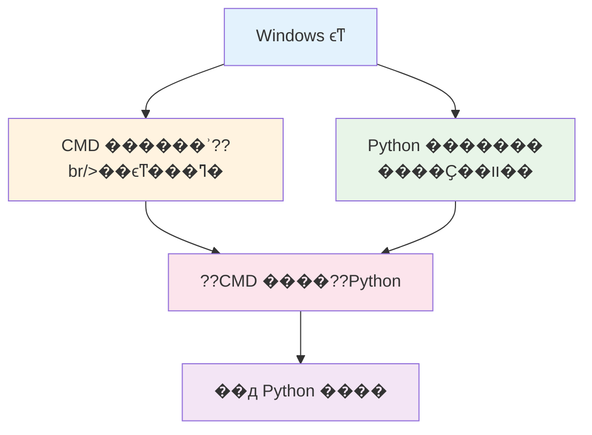

# CMD ??Python ��ȫ����ָ�� - С�ױؿ��ı�����Ž��??

## ?? ժҪ

С�׳��� CMD��������ʾ��������Ϊ??Python��������ԣ���CMD ??Windows �����й��ߣ�Python �DZ�����ԣ�������ȫ��ͬ���������������������������ṩѧϰ·��??

## ?? �����������

### ΪʲôС�׻���� CMD ??Python??

����һ�£����һ���߽�һ�Ҳ�����
- **CMD** ����??*�����ķ���̨** - ������������ˡ�ѯ����Ϣ���������ҵ??
- **Python** ����??*�˵��ϵIJ�Ʒ** - ����Ҫͨ������̨��CMD�����������

�ܶ�С�׿��� CMD �ĺڴ��ڣ���Ϊ����� Python����??CMD ֻ��һ??*����**��Python ����**�������**??

## ?? ��ϸ����Ա�

### 1. ��������

| ��??| CMD��������ʾ��??| Python���������??|
|------|------------------|-------------------|
| **����** | Windows ϵͳ���� | ������� |
| **����** | ִ��ϵͳ���� | ��д������� |
| **����** | ��ɫ�����д�??| ����༭���򽻻�ʽ��??|
| **��??* | �ļ������ϵͳ��??| ������������ݷ�??|

### 2. �����??

**CMD ������һ������ң����**??
- ���Կ��Ƶ��ӡ��յ�������ȸ����豸
- ��ң����������ǵ��ӣ�Ҳ���ǿյ�
- ��ֻ������������Щ�豸�Ĺ���

**Python ������һ̨���ܵ�??*??
- �����ͨ��ң������CMD��������??
- �����ӱ������Լ��Ĺ��ܺ�����
- ����Ҫѧϰ���ʹ����̨��??

## ?? ��ϵͼ��



## ????ʵ��Ӧ�ó���

### ����һ���ļ����������ˮƽ��С�ף�

**??CMD �����??*??
```cmd
# �鿴��ǰĿ¼�µ��ļ�
dir

# �������ļ���
mkdir �ҵ���Ŀ

# �����ļ�??
cd �ҵ���Ŀ
```

**??Python �����??*??
```python
# ʹ�� Python ��ȡ�ļ�����
with open('�ҵ��ļ�.txt', 'r', encoding='utf-8') as file:
    content = file.read()
    print(content)
```

### ��������ϵͳ��Ϣ��ѯ������ˮƽ��������

**CMD ��ѯϵͳ��Ϣ**??
```cmd
# �鿴ϵͳ�汾
systeminfo

# �鿴��������
ipconfig

# �鿴����
tasklist
```

**Python ��ȡϵͳ��Ϣ**??
```python
import platform
import psutil

# ��ȡϵͳ��Ϣ
print(f"����ϵͳ: {platform.system()}")
print(f"CPU ʹ��?? {psutil.cpu_percent()}%")
print(f"�ڴ�ʹ��?? {psutil.virtual_memory().percent}%")
```

### ���������Զ����ű�������ˮƽ���м���

**CMD �������??*??
```cmd
@echo off
echo ��ʼ������??..
xcopy C:\��Ҫ�ļ� D:\���� /E /I
echo �������??
pause
```

**Python �Զ�����??*??
```python
import shutil
import datetime

def backup_files():
    source = r"C:\��Ҫ�ļ�"
    backup_dir = f"D:\����\{datetime.datetime.now().strftime('%Y%m%d')}"
    
    try:
        shutil.copytree(source, backup_dir)
        print("���ݳɹ�??)
    except Exception as e:
        print(f"����ʧ��: {e}")

backup_files()
```

## ?? ��������������??

### ���� 1���� CMD ����??`python` ��ʾ"�����ڲ����ⲿ��??

**ԭ��**��Python û�а�װ��û����ӵ�ϵͳ����������Environment Variables����

**�������**??
1. ??[Python ����](https://www.python.org) ���ز���??Python
2. ��װʱ��??Add Python to PATH"ѡ��
3. ���� CMD ���ڣ��ٴ���??`python` ����

### ���� 2����֪�����??CMD ����??Python �ļ�

**�������**??
```cmd
# ���� Python �ļ�����Ŀ??
cd C:\�ҵ���Ŀ

# ���� Python �ļ�
python �ҵij���.py
```

### ���� 3��Python ����??CMD ����ʾ��??

**ԭ��**���ַ����루Character Encoding����??

**�������**??
```python
# ??Python �ļ���ͷ��ӱ�����??
# -*- coding: utf-8 -*-

# ������ CMD �����ñ�??
chcp 65001
```

## ?? ѧϰ·������

### С�ף������??
1. **��ѧ CMD ����**�����ջ������ļ���������
2. **��װ Python**���ӹ������ذ�װ��ȷ������������??
3. **??CMD ����??Python**��ѧ��ʹ??`python` ����

### ������������??
1. **ѧϰ Python �����﷨**���������������͡����ƽ�??
2. **ʹ�ô���༭??*����??VS Code��PyCharm ??
3. **��� CMD ??Python �Ĺ�??*��CMD �ǹ��ߣ�Python ������

### �м�������һ��ʱ�䣩
1. **���� Python �߼���??*���������ࡢģ??
2. **ѧϰ CMD ����??*����??`.bat` �ļ�
3. **���ɿ�����??*��ʹ??IDE ��߿���Ч??

### �߼���������ߣ�
1. **Python ���Ӧ��**��Django��Flask ??Web ���
2. **ϵͳ�Զ�??*����??CMD ??Python ʵ�ָ�������
3. **�����Ż�**�������Ż���ϵͳ����

## ?? ���ʵ����??

### 1. ��������
- **Python ��װ**��ѡ�������ȶ��汾��2025 ����??Python 3.12+??
- **��������**��ȷ??Python ·����ȷ���??PATH
- **����༭??*��ʹ��רҵ�� Python IDE ��߿���Ч??

### 2. ѧϰ˳��
- **������??*��CMD �ǹ��ߣ�Python ������
- **ʵ������**���� CMD ����??Python ����
- **������**���Ӽ򵥽ű������ӳ���

### 3. ������������
- **��Ҫ����**��CMD ���� Python��ֻ����??Python �Ĺ�??
- **��Ҫ��������**�������� CMD ��������
- **��Ҫ�������**��ѭ�򽥽�ѧϰ��̸�??

## ?? δ����չ����

### CMD �ķ�??
- **PowerShell ���**��Windows 10/11 �Ƽ�ʹ�� PowerShell
- **��ƽ̨��??*��WSL��Windows Subsystem for Linux����??Linux ����
- **ͼ�λ���??*��Windows Terminal �ṩ���õ�����������

### Python �ķ�??
- **�汾����**��Python 3.13 �������������ܳ����Ż�
- **AI ����**�������ѧϰ���˹�������Ƚ�??
- **��ƽ̨֧??*���� Windows��macOS��Linux �϶�������֧??

## ?? �ܽ�

ͨ�����ĵ�ѧϰ����Ӧ���Ѿ��������� CMD ??Python �ı�������

- **CMD** ??Windows �������й��ߣ���������ķ���??
- **Python** �DZ�����ԣ�����˵��ϵIJ�??
- **���߹�??*��ͨ�� CMD �������� Python ���򣬵� CMD ������� Python

��ס��ѧϰ�����һ��ѭ�򽥽��Ĺ��̡���Ҫ��Ϊһ��ʼ�������������ÿһ������Ա��������С�ס�ֻҪ�㱣�ֺ����ģ�����ѧϰ����һ���ܹ�������Щ���ܣ�

**���ͣ�δ���ij���Ա��** ??

---

**���Ź�ѧԺ�˹����ܴ����� -- ֣��??*  
**2025 ??10 ??16 ??*


