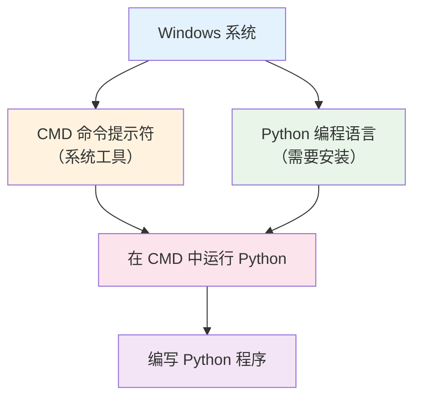

# CMD 与 Python 完全区别指南 - 小白必看的编程入门解惑宝典

## 📝 摘要

小白常把 CMD（命令提示符）误认为是 Python（编程语言）。CMD 是 Windows 命令行工具，Python 是编程语言，两者完全不同。本文用生活化比喻帮你理解区别，提供学习路径。

## 🎯 核心问题解析

### 为什么小白会混淆 CMD 和 Python？

想象一下，你第一次走进一家餐厅：
- **CMD** 就像是**餐厅的服务台** - 你可以在这里点菜、询问信息、办理各种业务
- **Python** 就像是**菜单上的菜品** - 你需要通过服务台（CMD）来点这道菜

很多小白看到 CMD 的黑窗口，以为这就是 Python，其实 CMD 只是一个**工具**，Python 才是**编程语言**。

## 🔍 详细区别对比

### 1. 本质区别

| 特性 | CMD（命令提示符） | Python（编程语言） |
|------|------------------|-------------------|
| **本质** | Windows 系统工具 | 编程语言 |
| **作用** | 执行系统命令 | 编写程序代码 |
| **界面** | 黑色命令行窗口 | 代码编辑器或交互式环境 |
| **用途** | 文件管理、系统操作 | 软件开发、数据分析 |

### 2. 生活化比喻

**CMD 就像是一个万能遥控器**：
- 可以控制电视、空调、音响等各种设备
- 但遥控器本身不是电视，也不是空调
- 它只是用来操作这些设备的工具

**Python 就像是一台智能电视**：
- 你可以通过遥控器（CMD）来操作它
- 但电视本身有自己的功能和内容
- 你需要学习如何使用这台电视

## 📊 关系图解



## 🛠️ 实际应用场景

### 场景一：文件管理（适用水平：小白）

**在 CMD 中管理文件**：
```cmd
# 查看当前目录下的文件
dir

# 创建新文件夹
mkdir 我的项目

# 进入文件夹
cd 我的项目
```

**在 Python 中处理文件**：
```python
# 使用 Python 读取文件内容
with open('我的文件.txt', 'r', encoding='utf-8') as file:
    content = file.read()
    print(content)
```

### 场景二：系统信息查询（适用水平：初级）

**CMD 查询系统信息**：
```cmd
# 查看系统版本
systeminfo

# 查看网络连接
ipconfig

# 查看进程
tasklist
```

**Python 获取系统信息**：
```python
import platform
import psutil

# 获取系统信息
print(f"操作系统: {platform.system()}")
print(f"CPU 使用率: {psutil.cpu_percent()}%")
print(f"内存使用率: {psutil.virtual_memory().percent}%")
```

### 场景三：自动化脚本（适用水平：中级）

**CMD 批处理脚本**：
```cmd
@echo off
echo 开始备份文件...
xcopy C:\重要文件 D:\备份 /E /I
echo 备份完成！
pause
```

**Python 自动化脚本**：
```python
import shutil
import datetime

def backup_files():
    source = r"C:\重要文件"
    backup_dir = f"D:\备份\{datetime.datetime.now().strftime('%Y%m%d')}"
    
    try:
        shutil.copytree(source, backup_dir)
        print("备份成功！")
    except Exception as e:
        print(f"备份失败: {e}")

backup_files()
```

## ⚠️ 常见问题与解决方案

### 问题 1：在 CMD 中输入 `python` 提示"不是内部或外部命令"

**原因**：Python 没有安装或没有添加到系统环境变量（Environment Variables）中

**解决方案**：
1. 从 [Python 官网](https://www.python.org) 下载并安装 Python
2. 安装时勾选"Add Python to PATH"选项
3. 重启 CMD 窗口，再次输入 `python` 命令

### 问题 2：不知道如何在 CMD 中运行 Python 文件

**解决方案**：
```cmd
# 进入 Python 文件所在目录
cd C:\我的项目

# 运行 Python 文件
python 我的程序.py
```

### 问题 3：Python 代码在 CMD 中显示乱码

**原因**：字符编码（Character Encoding）问题

**解决方案**：
```python
# 在 Python 文件开头添加编码声明
# -*- coding: utf-8 -*-

# 或者在 CMD 中设置编码
chcp 65001
```

## 🎓 学习路径建议

### 小白（零基础）
1. **先学 CMD 基础**：掌握基本的文件操作命令
2. **安装 Python**：从官网下载安装，确保环境配置正确
3. **在 CMD 中运行 Python**：学会使用 `python` 命令

### 初级（刚入门）
1. **学习 Python 基础语法**：变量、数据类型、控制结构
2. **使用代码编辑器**：推荐 VS Code、PyCharm 等
3. **理解 CMD 和 Python 的关系**：CMD 是工具，Python 是语言

### 中级（入门一段时间）
1. **掌握 Python 高级特性**：函数、类、模块
2. **学习 CMD 批处理**：编写 `.bat` 文件
3. **集成开发环境**：使用 IDE 提高开发效率

### 高级（资深开发者）
1. **Python 框架应用**：Django、Flask 等 Web 框架
2. **系统自动化**：结合 CMD 和 Python 实现复杂任务
3. **性能优化**：代码优化和系统调优

## 💡 最佳实践建议

### 1. 环境配置
- **Python 安装**：选择最新稳定版本（2025 年推荐 Python 3.12+）
- **环境变量**：确保 Python 路径正确添加到 PATH
- **代码编辑器**：使用专业的 Python IDE 提高开发效率

### 2. 学习顺序
- **先理解概念**：CMD 是工具，Python 是语言
- **实践操作**：在 CMD 中运行 Python 代码
- **逐步深入**：从简单脚本到复杂程序

### 3. 常见误区避免
- **不要混淆**：CMD 不是 Python，只是运行 Python 的工具
- **不要跳过基础**：先掌握 CMD 基本操作
- **不要急于求成**：循序渐进学习编程概念

## 🔮 未来发展趋势

### CMD 的发展
- **PowerShell 替代**：Windows 10/11 推荐使用 PowerShell
- **跨平台工具**：WSL（Windows Subsystem for Linux）提供 Linux 环境
- **图形化界面**：Windows Terminal 提供更好的命令行体验

### Python 的发展
- **版本更新**：Python 3.13 即将发布，性能持续优化
- **AI 集成**：与机器学习、人工智能深度结合
- **跨平台支持**：在 Windows、macOS、Linux 上都有良好支持

## 📚 总结

通过本文的学习，你应该已经清楚理解了 CMD 和 Python 的本质区别：

- **CMD** 是 Windows 的命令行工具，就像餐厅的服务台
- **Python** 是编程语言，就像菜单上的菜品
- **两者关系**：通过 CMD 可以运行 Python 程序，但 CMD 本身不是 Python

记住，学习编程是一个循序渐进的过程。不要因为一开始的困惑而放弃，每一个程序员都曾经是小白。只要你保持好奇心，持续学习，就一定能够掌握这些技能！

**加油，未来的程序员！** 🚀

---

**厦门工学院人工智能创作坊 -- 郑恩赐**  
**2025 年 10 月 16 日**