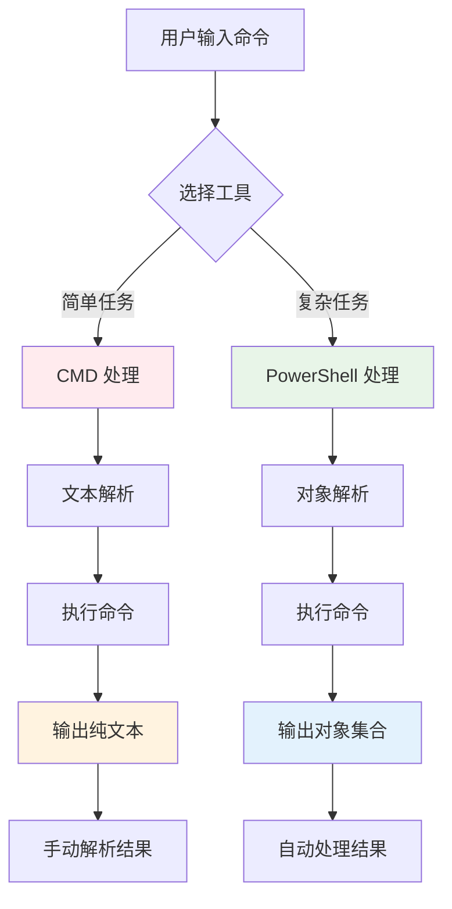

# PowerShell 与 CMD 完全对比指南 - 从传统命令行到现代脚本的 Windows 利器

## 📋 摘要

Windows 两大命令行工具对比：CMD 如传统打字机，简单直接；PowerShell 如智能助手，功能强大。通过生活化比喻和实战案例，帮助小白到高级开发者掌握工具特点、适用场景和最佳实践。

## 🎯 核心概念对比

### CMD（Command Prompt）- 传统打字机

想象 CMD 就像一台传统的打字机：
- **简单直接**：只能输入文字，输出文字
- **历史悠久**：从 DOS（Disk Operating System，磁盘操作系统）时代传承至今
- **功能基础**：适合执行简单的文件操作和批处理脚本

```cmd
# CMD 示例 - 查看文件列表
dir
# 输出：纯文本格式的文件列表
```

### PowerShell - 智能助手

PowerShell 就像一位智能助手：
- **功能强大**：不仅能处理文字，还能操作对象（Object）
- **现代设计**：基于 .NET Framework（.NET 框架）构建
- **面向对象**：输出的是结构化数据，便于进一步处理

```powershell
# PowerShell 示例 - 获取文件信息
Get-ChildItem
# 输出：文件对象集合，包含属性、方法等
```

## 🔄 执行流程对比



## 📊 功能特性对比表

<table>
<tr>
<th>特性</th>
<th>CMD</th>
<th>PowerShell</th>
</tr>
<tr>
<td><strong>内存占用</strong></td>
<td>&lt; 1 MB</td>
<td>~20 MB</td>
</tr>
<tr>
<td><strong>语法复杂度</strong></td>
<td>简单</td>
<td>复杂但强大</td>
</tr>
<tr>
<td><strong>输出格式</strong></td>
<td>纯文本</td>
<td>对象集合</td>
</tr>
<tr>
<td><strong>脚本支持</strong></td>
<td>批处理（.bat）</td>
<td>PowerShell 脚本（.ps1）</td>
</tr>
<tr>
<td><strong>管道操作</strong></td>
<td>基础文本管道</td>
<td>对象管道</td>
</tr>
<tr>
<td><strong>错误处理</strong></td>
<td>基础</td>
<td>高级异常处理</td>
</tr>
<tr>
<td><strong>跨平台</strong></td>
<td>Windows 专用</td>
<td>跨平台支持</td>
</tr>
</table>

## 🛠️ 实际应用场景

### 场景一：文件管理（小白适用）

**CMD 方式**：
```cmd
# 查看当前目录文件
dir
# 创建文件夹
mkdir test_folder
# 复制文件
copy source.txt destination.txt
```

**PowerShell 方式**：
```powershell
# 查看当前目录文件（功能更丰富）
Get-ChildItem
# 创建文件夹（支持更多参数）
New-Item -ItemType Directory -Name "test_folder"
# 复制文件（支持进度显示）
Copy-Item -Path "source.txt" -Destination "destination.txt" -Verbose
```

### 场景二：系统信息查询（初级适用）

**CMD 方式**：
```cmd
# 查看系统信息
systeminfo
# 查看网络配置
ipconfig
```

**PowerShell 方式**：
```powershell
# 获取系统信息（结构化输出）
Get-ComputerInfo
# 获取网络适配器信息（对象化处理）
Get-NetAdapter | Select-Object Name, Status, LinkSpeed
```

### 场景三：自动化脚本（中级适用）

**CMD 批处理脚本**：
```cmd
@echo off
echo 开始备份文件...
xcopy C:\Source D:\Backup /E /I
echo 备份完成！
pause
```

**PowerShell 脚本**：
```powershell
# 高级备份脚本
param(
    [string]$SourcePath = "C:\Source",
    [string]$BackupPath = "D:\Backup"
)

try {
    Write-Host "开始备份文件..." -ForegroundColor Green
    Copy-Item -Path $SourcePath -Destination $BackupPath -Recurse -Force
    Write-Host "备份完成！" -ForegroundColor Green
} catch {
    Write-Error "备份失败：$($_.Exception.Message)"
}
```

### 场景四：数据处理（高级适用）

**PowerShell 数据处理示例**：
```powershell
# 处理 CSV 文件并生成报告
$data = Import-Csv "sales.csv"
$summary = $data | Group-Object Department | 
    Select-Object Name, Count, 
    @{Name="TotalSales"; Expression={($_.Group | Measure-Object Sales -Sum).Sum}}

$summary | Export-Csv "department_summary.csv" -NoTypeInformation
```

## ⚠️ 常见问题与解决方案

### 问题一：PowerShell 执行策略限制

**现象**：PowerShell 脚本无法执行
```powershell
# 错误信息
无法加载文件，因为在此系统上禁止运行脚本
```

**解决方案**：
```powershell
# 查看当前执行策略
Get-ExecutionPolicy

# 设置执行策略（需要管理员权限）
Set-ExecutionPolicy RemoteSigned -Scope CurrentUser
```

### 问题二：CMD 中文乱码

**现象**：CMD 显示中文时出现乱码

**解决方案**：
```cmd
# 设置代码页为 UTF-8
chcp 65001
```

### 问题三：PowerShell 模块导入失败

**现象**：无法导入某些 PowerShell 模块

**解决方案**：
```powershell
# 检查模块是否已安装
Get-Module -ListAvailable

# 安装模块
Install-Module -Name ModuleName -Force
```

## 🎨 界面与体验对比

### CMD 界面特点
- **简洁朴素**：黑白界面，无语法高亮
- **快速启动**：启动速度快，资源占用少
- **兼容性好**：几乎所有 Windows 版本都支持

### PowerShell 界面特点
- **现代美观**：支持语法高亮和彩色输出
- **智能提示**：Tab 键自动补全功能强大
- **错误友好**：错误信息以红色显示，便于识别

## 🚀 最佳实践建议

### CMD 使用建议
1. **简单任务优先**：文件复制、目录切换等基础操作
2. **批处理脚本**：编写简单的自动化脚本
3. **系统兼容**：在老旧系统或资源受限环境中使用

### PowerShell 使用建议
1. **复杂任务**：系统管理、数据处理、自动化脚本
2. **对象操作**：利用面向对象特性进行数据处理
3. **跨平台开发**：利用跨平台特性进行多系统管理

### 学习路径建议

**小白（零基础）**：
- 先学习 CMD 基础命令（dir、cd、copy 等）
- 掌握文件系统操作
- 了解批处理脚本基础

**初级开发者**：
- 学习 PowerShell 基础语法
- 掌握 Get-* 系列命令
- 学习管道操作基础

**中级开发者**：
- 深入学习 PowerShell 脚本编写
- 掌握错误处理和异常管理
- 学习模块化开发

**高级开发者**：
- 掌握高级 PowerShell 特性
- 学习跨平台 PowerShell Core
- 开发企业级自动化解决方案

## 📈 性能对比分析

<table>
<tr>
<th>操作类型</th>
<th>CMD 性能</th>
<th>PowerShell 性能</th>
<th>推荐工具</th>
</tr>
<tr>
<td><strong>文件操作</strong></td>
<td>快</td>
<td>中等</td>
<td>CMD</td>
</tr>
<tr>
<td><strong>文本处理</strong></td>
<td>慢</td>
<td>快</td>
<td>PowerShell</td>
</tr>
<tr>
<td><strong>系统管理</strong></td>
<td>基础</td>
<td>强大</td>
<td>PowerShell</td>
</tr>
<tr>
<td><strong>脚本执行</strong></td>
<td>快</td>
<td>中等</td>
<td>根据复杂度选择</td>
</tr>
<tr>
<td><strong>内存占用</strong></td>
<td>低</td>
<td>高</td>
<td>CMD（资源受限时）</td>
</tr>
</table>

## 🔮 未来发展趋势

### CMD 发展趋势
- **维护模式**：Microsoft（微软）主要维护现有功能
- **兼容性保持**：确保向后兼容性
- **功能稳定**：不会添加重大新功能

### PowerShell 发展趋势
- **跨平台扩展**：PowerShell Core 支持 Linux 和 macOS
- **云集成**：与 Azure（微软云服务）深度集成
- **AI 集成**：集成 AI 功能，提供智能建议

## 📝 总结

PowerShell 和 CMD 各有优势，选择标准如下：

- **选择 CMD**：简单文件操作、批处理脚本、资源受限环境
- **选择 PowerShell**：复杂系统管理、数据处理、现代自动化

掌握两种工具，就像拥有传统打字机和智能助手两套工具，在不同场景下发挥各自优势。从 CMD 的简单直接到 PowerShell 的强大功能，Windows 命令行世界为你提供了丰富的选择。

**加油！** 无论是选择 CMD 的简洁高效，还是 PowerShell 的强大功能，都能让你的 Windows 系统管理更加得心应手。记住，工具只是手段，解决问题才是目标！

---

**厦门工学院人工智能创作坊 -- 郑恩赐**  
**2025 年 1 月 14 日**