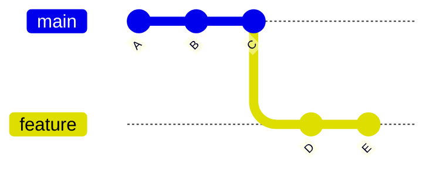
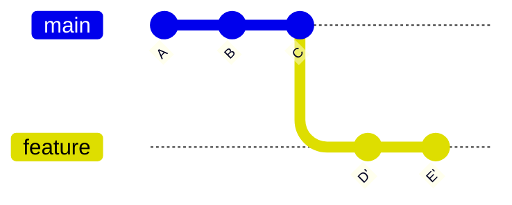

# Git 所有命令 📚

## 1. 概述 🎯

Git 是目前最流行的分布式版本控制系统，掌握 Git 命令是每个开发者的必备技能。本文档将系统整理 Git 的所有命令，按功能分类，方便查阅和学习。

## 2. 配置命令 ⚙️

Git 配置分为三个层级，后者会覆盖前者：

| 层级 | 影响范围 | 配置文件路径 |
|------|----------|--------------|
| 🔹 `--system` | 整台机器所有用户 | `/etc/gitconfig` |
| 🔹 `--global` | 当前用户的所有仓库 | `~/.gitconfig` 或 `C:\Users\用户名\.gitconfig` |
| 🔹 `--local` | 仅当前仓库 | `.git/config` |

### 2.1 全局配置

全局配置使用 `--global` 参数，对当前用户的所有 Git 仓库生效。

**设置用户名和邮箱** 📧
这是最基本的配置，每次提交都会用到：

```bash
git config --global user.name "Your Name"
git config --global user.email "your.email@example.com"
```

**设置默认编辑器** 📝
配置用于编写提交信息或交互式操作的文本编辑器。

> 💡 **什么时候会用到编辑器？**
> - 执行 `git commit` 不加 `-m` 参数时，打开编辑器编写提交信息
> - 执行 `git rebase -i` 进行交互式变基时
> - 解决合并冲突时编辑冲突文件
> - 创建标签 `git tag -a` 时编写标签注释

```bash
# 设置为 VS Code
git config --global core.editor "code --wait"

# 设置为 Vim
git config --global core.editor "vim"

# 设置为 Notepad++ (Windows)
git config --global core.editor "'C:/Program Files/Notepad++/notepad++.exe' -multiInst -nosession"
```

设置默认编辑器参考资料：
- [Git - Git 配置](https://git-scm.cn/book/en/v2/Customizing-Git-Git-Configuration)
- [关于Git的安装选项说明 -- CSDN](https://blog.csdn.net/weixin_43525499/article/details/151618104)
- [如何为git配置默认编辑器 -- PHP中文网](https://global.php.cn/zh/faq/1796910633.html)

**设置默认分支名称** 🌿
初始化新仓库时使用的默认分支名：

```bash
git config --global init.defaultBranch main
```

**设置行尾符处理** 🔧
处理 Windows 和 Unix 系统间的换行符差异：

```bash
# Windows 用户推荐
git config --global core.autocrlf true

# Mac/Linux 用户推荐
git config --global core.autocrlf input
```

**设置别名** ⚡
为常用命令设置简短的别名，提高效率：

```bash
git config --global alias.st status
git config --global alias.co checkout
git config --global alias.br branch
git config --global alias.ci commit
git config --global alias.lg "log --color --graph --pretty=format:'%Cred%h%Creset -%C(yellow)%d%Creset %s %Cgreen(%cr) %C(bold blue)<%an>%Creset' --abbrev-commit"
```

全局配置参考资料：
- [Git - git-config Documentation](https://git-scm.com/docs/git-config/zh_HANS-CN)
- [Git配置的深度解析与实战应用 -- CSDN](https://blog.csdn.net/m0_74337424/article/details/145818646)
- [git全局配置与局部配置 -- CSDN](https://blog.csdn.net/weixin_42738495/article/details/149328048)

### 2.2 本地配置

本地配置使用 `--local` 参数（或省略），仅对当前仓库生效，优先级高于全局配置。

**为特定项目设置不同的用户名和邮箱** 👤
当你需要使用不同的身份提交代码时（如区分工作和个人项目）：

```bash
git config --local user.name "Work Name"
git config --local user.email "work@company.com"
```

**设置项目特定的忽略文件** 🚫

`.git/info/exclude` 是本地仓库私有的忽略文件，仅对当前仓库有效，不会被提交到远程仓库。

> 💡 **什么时候用它？**
> - 忽略只对你个人有意义的文件（如 IDE 配置、本地调试脚本）
> - 不想污染项目的 `.gitignore` 文件
> - 不想让别人知道你的忽略规则

```bash
git config --local core.excludesfile .git/info/exclude
```

三种忽略文件方式对比：

| 方式 | 文件位置 | 作用范围 | 是否共享 |
|------|----------|----------|----------|
| `.gitignore` | 仓库根目录 | 整个仓库 | ✅ 会提交，所有人共享 |
| `.git/info/exclude` | `.git/info/exclude` | 仅当前本地仓库 | ❌ 不会提交，仅自己有效 |
| `core.excludesFile` | 自定义路径 | 全局或指定范围 | 取决于文件位置 |

设置项目特定的忽略文件参考资料：
- [Git - gitignore Documentation](https://git-scm.com/docs/gitignore/2.34.0)
- [Git设置忽略文件/文件夹 -- CSDN](https://blog.csdn.net/weixin_34191845/article/details/91938008)
- [Git忽略文件详解 -- CSDN](https://blog.csdn.net/FLY_THINK2012/article/details/101841032)
- [Git 忽略文件机制:.gitignore 与 .git/info/exclude -- CSDN](https://blog.csdn.net/wenxuankeji/article/details/157320740)

**设置项目特定的钩子路径** 🪝

Git 钩子（Hooks）是在特定事件发生时自动执行的脚本。默认情况下，钩子存放在 `.git/hooks/` 目录，但这个目录不会被提交到版本控制。

通过设置 `core.hooksPath`，可以把钩子脚本放到项目目录下（如 `.githooks/`），这样就可以将钩子脚本纳入版本控制，实现团队共享。

> 💡 **常见使用场景**
> - `pre-commit`：提交前自动运行代码检查（如 ESLint、格式化）
> - `commit-msg`：检查提交信息格式是否符合规范
> - `pre-push`：推送前自动运行测试

```bash
# 将钩子路径设置为项目根目录下的 .githooks 文件夹
git config --local core.hooksPath .githooks
```

设置后，Git 会从 `.githooks/` 而不是 `.git/hooks/` 加载钩子脚本。

**实现团队共享钩子的步骤：**
1. 在项目根目录创建 `.githooks/` 文件夹
2. 将钩子脚本放入该文件夹（如 `pre-commit`、`commit-msg`）
3. 确保脚本有执行权限：`chmod +x .githooks/pre-commit`
4. 将 `.githooks/` 提交到版本控制
5. 团队成员克隆后执行 `git config --local core.hooksPath .githooks`

常用客户端钩子：

| 钩子名称 | 触发时机 | 用途 |
|----------|----------|------|
| `pre-commit` | 执行 `git commit` 之前 | 代码检查、格式化 |
| `prepare-commit-msg` | 打开提交信息编辑器之前 | 自动生成提交信息模板 |
| `commit-msg` | 提交信息编辑完成后 | 验证提交信息格式 |
| `post-commit` | 提交完成后 | 发送通知、更新日志 |
| `pre-push` | 执行 `git push` 之前 | 运行测试、检查分支 |

设置项目特定的钩子路径参考资料：
- [Git - githooks Documentation](https://git-scm.com/docs/githooks/2.28.0)
- [实现 Git 挂钩 -- Microsoft Learn](https://learn.microsoft.com/zh-cn/training/modules/explore-git-hooks/3-implement)
- [配置 Git hooks | Jay 的博客](https://z-j-wang.github.io/front-end-engineering/%E7%AC%AC11%E7%AB%A0%EF%BC%9A%E9%85%8D%E7%BD%AEgitHooks)
- [Git hook pre-commit -- CSDN](https://blog.csdn.net/xiaoma_bk/article/details/154348151)
- [Git 钩子(Git Hooks)详解 -- CSDN](https://blog.csdn.net/Irene1991/article/details/155820944)

本地配置参考资料：
- [Git Config Commands Guide -- GitHub](https://github.com/Abdelrahman-Zagloul/Git-Reference-Guide/blob/master/Config/Configuration%20Commands.md)
- [Git 首次使用完整设置指南 -- CSDN](https://blog.csdn.net/weixin_43114209/article/details/148608213)

### 2.3 查看配置

**查看所有配置** 📋

```bash
# 查看所有层级的配置
git config --list

# 查看全局配置
git config --global --list

# 查看本地配置
git config --local --list

# 查看系统配置
git config --system --list
```

**查看特定配置项** 🔍

```bash
# 查看用户名
git config user.name

# 查看邮箱
git config user.email

# 查看全局特定的配置
git config --global core.editor

# 查看本地特定的配置
git config --local user.name
```

**查看配置文件位置** 📁

```bash
# 显示配置文件的来源
git config --list --show-origin

# 显示配置的作用域
git config --list --show-scope
```

**编辑配置文件** ✏️

```bash
# 打开全局配置文件
git config --global --edit

# 打开本地配置文件
git config --local --edit
```

查看配置参考资料：
- [Git - git-config Documentation](https://git-scm.com/docs/git-config/zh_HANS-CN)
- [Git Config Commands Guide -- GitHub](https://github.com/Abdelrahman-Zagloul/Git-Reference-Guide/blob/master/Config/Configuration%20Commands.md)

## 3. 仓库操作 📁

### 3.1 创建仓库

**初始化新仓库** 🆕

将当前目录转换为 Git 仓库，创建 `.git` 隐藏目录存放版本控制元数据：

```bash
# 在当前目录初始化 Git 仓库
git init

# 指定目录初始化（自动创建目录）
git init my-project

# 初始化裸仓库（常用于远程中心仓库，无工作区）
git init --bare my-project.git
```

> 💡 **什么时候用裸仓库？**
> - 搭建私有 Git 服务器时
> - 作为团队共享的中央仓库
> - 不需要直接编辑文件，只用于推送和拉取

创建仓库参考资料：
- [Git 全命令超级详细指南 -- CSDN](https://blog.csdn.net/qq_37547964/article/details/160432526)
- [Git常用命令 -- 掘金](https://juejin.cn/post/7520959840199901235)
- [Git基础——《Pro Git》 -- 阿里云开发者](https://developer.aliyun.com/article/1648858)

### 3.2 克隆仓库

**从远程仓库复制到本地** 📥

克隆会下载仓库的所有历史记录、分支和标签：

```bash
# 克隆默认分支（通常是 main 或 master）
git clone https://github.com/username/repository.git

# 克隆并指定本地文件夹名称
git clone https://github.com/username/repository.git my-folder

# 克隆指定分支
git clone -b branch-name https://github.com/username/repository.git

# 克隆最新版本（不下载完整历史，速度更快）
git clone --depth 1 https://github.com/username/repository.git

# 克隆到当前目录（注意末尾的点）
git clone https://github.com/username/repository.git .
```

> 💡 **常用克隆场景**
> - 加入新项目时，获取完整代码库
> - 参与开源项目，先 fork 再克隆自己的仓库
> - 使用 `--depth 1` 快速克隆大型仓库（CI/CD 场景常用）

克隆仓库参考资料：
- [Git从入门到掌握 -- CSDN](https://blog.csdn.net/m0_73500006/article/details/150220987)
- [Git教程(入门) -- 腾讯云](https://developer.cloud.tencent.com/article/2622894)
- [Git基础——《Pro Git》 -- 阿里云开发者](https://developer.aliyun.com/article/1648858)

### 3.3 仓库状态

**查看工作区和暂存区状态** 👀

```bash
# 查看完整状态（默认命令）
git status

# 简洁模式，只显示文件名
git status -s
git status --short

# 显示分支和追踪信息
git status -b
git status --branch

# 不显示未跟踪文件（Untracked files）
git status -uno
```

**状态标识符说明** 📋

在 `git status -s` 输出中，每行有两个字符：

| 位置 | 字符 | 含义 |
|------|------|------|
| 左列（暂存区） | `A` | 已添加到暂存区 |
| 左列（暂存区） | `M` | 已修改并已暂存 |
| 左列（暂存区） | `D` | 已删除并已暂存 |
| 左列（暂存区） | `?` | 未跟踪文件 |
| 右列（工作区） | `M` | 已修改但未暂存 |
| 右列（工作区） | `D` | 已删除但未暂存 |

示例输出：
```
M  README.md      # 已修改并已暂存
 M main.py        # 已修改但未暂存
A  newfile.txt    # 新文件已添加到暂存区
?? untracked.txt  # 未跟踪的新文件
```

> 💡 **什么时候用 `git status`？**
> - 随时查看当前工作区的改动情况
> - 确认哪些文件已暂存、哪些未暂存
> - 提交前检查，避免遗漏或误提交

仓库状态参考资料：
- [Git常用命令 -- 掘金](https://juejin.cn/post/7520959840199901235)
- [Git 全命令超级详细指南 -- CSDN](https://blog.csdn.net/qq_37547964/article/details/160432526)

## 4. 文件操作 📝

### 4.1 添加文件

**将文件添加到暂存区** ➕

`git add` 将工作区的改动添加到暂存区（Staging Area），为提交做准备。

```bash
# 添加单个文件
git add filename.txt

# 添加多个文件
git add file1.txt file2.txt

# 添加当前目录所有变更（常用）
git add .

# 添加所有变更（包括上级目录）
git add -A
git add --all

# 只添加已跟踪文件的变更（不包含新文件）
git add -u
git add --update

# 添加指定目录
git add src/

# 添加特定类型文件
git add *.js

# 强制添加被 .gitignore 忽略的文件
git add -f filename.txt
```

**交互式添加** 🎯

使用 `-p` 或 `--patch` 可以逐块选择要暂存的内容：

```bash
# 交互式选择要暂存的内容
git add -p
git add --patch
```

交互式模式中的常用选项：

| 选项 | 含义 |
|------|------|
| `y` | 暂存当前块（hunk） |
| `n` | 不暂存当前块 |
| `s` | 拆分成更小的块 |
| `e` | 手动编辑当前块 |
| `q` | 退出交互模式 |
| `?` | 显示帮助 |

> 💡 **常用场景**
> - `git add .`：日常开发中最常用，添加当前目录所有变更
> - `git add -p`：一个文件有多个改动，但想分开提交时使用
> - `git add -u`：只想提交修改和删除，不提交新文件

**不同添加命令对比** 📊

| 命令 | 新文件 | 修改文件 | 删除文件 | 上级目录 |
|------|--------|----------|----------|----------|
| `git add .` | ✅ | ✅ | ✅ | ❌ |
| `git add -A` | ✅ | ✅ | ✅ | ✅ |
| `git add -u` | ❌ | ✅ | ✅ | ✅ |

添加文件参考资料：
- [Git - git-add Documentation](https://git-scm.org/docs/git-add)
- [【Git "git add" 命令详解】-- CSDN](https://blog.csdn.net/wzt001005/article/details/145734398)
- [Git版本控制核心教程：深入理解git add命令 -- CSDN](https://blog.csdn.net/gitblog_01072/article/details/148524289)
- [Git Guides - git add · GitHub](https://github.com/git-guides/git-add)

### 4.2 移除文件

**从 Git 中删除文件** 🗑️

```bash
# 删除文件并从工作区和暂存区移除
git rm filename.txt

# 删除文件但保留在工作区（仅从版本控制中移除）
git rm --cached filename.txt

# 强制删除（用于已修改的文件）
git rm -f filename.txt

# 递归删除目录
git rm -r folder/

# 删除已重命名的文件（旧文件名）
git rm oldname.txt
```

> 💡 **使用场景**
> - 误将敏感文件提交到仓库，使用 `git rm --cached` 停止跟踪但保留本地文件
> - 彻底删除不再需要的文件，使用 `git rm` 同时删除文件和版本记录
> - 删除文件夹时使用 `-r` 递归删除

移除文件参考资料：
- [Git常用命令的详细指南 -- 腾讯云](https://cloud.tencent.com.cn/developer/article/2582009)
- [git核心命令及其用法 -- CSDN](https://blog.csdn.net/xpd1234/article/details/147926822)

### 4.3 重命名文件

**移动或重命名文件** 📝

```bash
# 重命名文件
git mv oldname.txt newname.txt

# 移动文件到另一个目录
git mv file.txt folder/file.txt

# 重命名并移动
git mv old.txt newfolder/new.txt
```

> 💡 **为什么要用 git mv？**
> - 直接使用系统命令重命名，Git 会认为是删除旧文件 + 创建新文件
> - 使用 `git mv` 会保留文件的历史记录，可以追溯重命名前的历史
> - 相当于执行了 `mv` + `git rm` + `git add` 三个操作

重命名文件参考资料：
- [Git常用命令的详细指南 -- 腾讯云](https://cloud.tencent.com.cn/developer/article/2582009)
- [git常用命令大全 -- CSDN](https://blog.csdn.net/qq_57828911/article/details/153044304)

### 4.4 查看状态

**查看文件变更状态** 👁️

```bash
# 查看工作区与暂存区的差异（工作区 vs 暂存区）
git diff

# 查看暂存区与最新提交的差异（暂存区 vs 仓库）
git diff --cached
git diff --staged

# 查看工作区与最新提交的差异（工作区 vs 仓库）
git diff HEAD

# 查看指定文件的差异
git diff filename.txt

# 查看某次提交的变更
git diff commit-id

# 查看两次提交之间的差异
git diff commit-id1 commit-id2
```

**diff 输出格式说明** 📋

```diff
- 这一行被删除
+ 这一行被添加
  这一行没有变化
```

> 💡 **使用场景**
> - 提交前使用 `git diff` 检查修改内容
> - 使用 `git diff --cached` 确认暂存区的内容是否正确
> - 代码审查时查看具体变更

查看状态参考资料：
- [git核心命令及其用法 -- CSDN](https://blog.csdn.net/xpd1234/article/details/147926822)
- [git常用命令大全 -- CSDN](https://blog.csdn.net/qq_57828911/article/details/153044304)

## 5. 提交管理 💾

### 5.1 提交更改

**将暂存区的内容提交到版本库** 📤

```bash
# 提交暂存区的内容（最常用）
git commit -m "提交信息"

# 提交信息支持多行
git commit -m "第一行" -m "第二行"

# 自动暂存已跟踪文件的修改（不包括新文件）
git commit -a -m "提交已跟踪文件的修改"
git commit -am "提交已跟踪文件的修改"

# 修改最后一次提交（修正提交信息或补充遗漏文件）
git commit --amend

# 修改最后一次提交，并指定新的提交信息
git commit --amend -m "修正后的提交信息"
```

> 💡 **常用场景**
> - `-m`：最常用的提交方式，快速指定提交信息
> - `-am`：已跟踪的文件修改，可以跳过 `git add` 步骤（但不适用于新文件）
> - `--amend`：修改最后一次提交，适合修正提交信息或补充遗漏文件

**提交信息规范** 📝

好的提交信息应该清晰描述这次修改的内容：

```
# 推荐格式：类型: 简短描述

feat: 添加用户登录功能
fix: 修复首页样式错位问题
docs: 更新README文档
refactor: 重构用户模块代码
```

提交更改参考资料：
- [Git - git-commit Documentation](https://git-scm.com/docs/git-commit)
- [【Git】git commit命令使用介绍 -- CSDN](https://blog.csdn.net/weixin_43510208/article/details/148854564)
- [【Git "git commit" 命令详解】-- CSDN](https://blog.csdn.net/wzt001005/article/details/145734819)
- [Git - Commit命令 -- CSDN](https://blog.csdn.net/guoqx/article/details/148888910)

### 5.2 查看提交历史

**查看项目的提交记录** 📜

```bash
# 查看完整提交历史
git log

# 简洁模式（一行显示）
git log --oneline

# 图形化显示分支和合并历史
git log --graph

# 常用组合：图形化 + 简洁显示 + 所有分支
git log --oneline --graph --all --decorate

# 查看最近 N 条提交
git log -n 5
git log -5

# 查看特定文件的提交历史
git log filename.txt

# 查看某个作者的提交
git log --author="username"

# 查看提交信息包含关键字的提交
git log --grep="keyword"

# 显示每次提交的文件变更统计
git log --stat

# 显示每次提交的文件列表
git log --name-only
```

**`--oneline` 输出示例**：

```
a1b2c3d feat: 添加用户登录功能
f0e9d8c fix: 修复首页样式错位问题
d3e4f5a docs: 更新README文档
```

> 💡 **常用场景**
> - `git log`：查看完整提交历史，了解项目演进
> - `git log --oneline`：快速浏览提交列表
> - `git log --graph --oneline`：查看分支结构
> - `git log -10`：查看最近 10 条提交
> - `git log --author="xxx"`：查看某个人的提交记录

查看提交历史参考资料：
- [Git - git-log Documentation](https://git-scm.com/docs/git-log/zh_HANS-CN)
- [图解Git提交历史:git log命令 -- CSDN](https://blog.csdn.net/tcy1429920627/article/details/155223548)
- [Git log 可视化 -- CSDN](https://blog.csdn.net/2501_93892898/article/details/154242120)
- [Git 进阶指南 -- 技术栈](https://jishuzhan.net/article/1972451684149428226)

### 5.3 查看差异

**比较不同版本之间的差异** 🔍

```bash
# 比较工作区与暂存区的差异
git diff

# 比较暂存区与最新提交的差异
git diff --cached
git diff --staged

# 比较工作区与最新提交的差异
git diff HEAD

# 比较两个分支的差异
git diff branch1 branch2

# 比较两个提交的差异
git diff commit1 commit2

# 只显示文件名，不显示具体内容
git diff --name-only

# 显示文件变更统计
git diff --stat

# 比较特定文件
git diff filename.txt
```

> 💡 **常用场景**
> - `git diff`：提交前检查修改内容
> - `git diff --cached`：确认暂存区的修改是否正确
> - `git diff HEAD`：查看工作区与最新提交的差异
> - `git diff main..feature`：查看 main 和 feature 分支之间的差异

**diff 输出格式**：

```diff
- 被删除的行（红色）
+ 新增的行（绿色）
  未修改的行
```

查看差异参考资料：
- [Git 日常最常用 20 条命令速查表 -- CSDN](https://blog.csdn.net/likuolei/article/details/155138773)
- [Git 完全指南 -- 阿里云开发者社区](https://developer.aliyun.com/article/1643994)

### 5.4 撤销操作

**回退或撤销已做的修改** ↩️

```bash
# 撤销暂存区的修改（文件回到工作区）
git reset HEAD filename.txt

# 撤销暂存区的所有修改
git reset HEAD

# 撤销最后一次提交，保留修改在工作区（常用）
git reset --soft HEAD~1

# 撤销最后一次提交，保留修改在暂存区
git reset --mixed HEAD~1

# 撤销最后一次提交，丢弃所有修改（危险！）
git reset --hard HEAD~1

# 撤销到指定提交（保留之后的所有修改）
git reset commit-id

# 创建新提交来撤销某次提交（安全，不会修改历史）
git revert commit-id
```

**reset vs revert 对比** 📊

| 命令 | 作用 | 是否修改历史 | 适用场景 |
|------|------|--------------|----------|
| `git reset --soft HEAD~1` | 撤销提交，保留修改 | ✅ 修改 | 未推送的本地提交 |
| `git reset --hard HEAD~1` | 完全丢弃提交和修改 | ✅ 修改 | 彻底放弃本次提交 |
| `git revert commit-id` | 创建新提交抵消原提交 | ❌ 不修改 | 已推送到远程的提交 |

> 💡 **使用建议**
> - 本地未推送的提交：使用 `git reset --soft HEAD~1`
> - 已推送到远程的提交：使用 `git revert` 安全撤销
> - 彻底放弃所有修改：`git reset --hard`（慎用！）

**场景示例**：

```bash
# 场景1：提交信息写错了，想修改
git commit --amend -m "正确的提交信息"

# 场景2：漏提交了文件，追加到上一次提交
git add forgotten.txt
git commit --amend --no-edit

# 场景3：提交后发现有误，想撤销但保留修改
git reset --soft HEAD~1

# 场景4：已经推送到远程，想安全撤销
git revert abc1234
```

撤销操作参考资料：
- [Git 撤销操作大全 -- CSDN](https://blog.csdn.net/tryutgycghaa/article/details/153598003)
- [git commit 如何回退 -- 掘金](https://juejin.cn/post/7566965016281464882)
- [Git 完全指南 -- 阿里云开发者社区](https://developer.aliyun.com/article/1643994)

## 6. 分支管理 🌿

### 6.1 查看分支

**列出所有分支** 📋

```bash
# 查看本地分支
git branch

# 查看所有分支（包括远程分支）
git branch -a

# 只查看远程分支
git branch -r

# 查看分支详情（包含最后提交信息）
git branch -v

# 查看已合并到当前分支的分支
git branch --merged

# 查看未合并到当前分支的分支
git branch --no-merged

# 查看包含特定提交的分支
git branch --contains commit-id
```

> 💡 **常用场景**
> - `git branch`：快速查看本地分支，当前分支会有 `*` 标记
> - `git branch -a`：查看所有分支，包括远程分支
> - `git branch -v`：查看分支和对应的最新提交
> - `git branch --merged`：查看哪些分支已合并，可以安全删除

查看分支参考资料：
- [Git 分支管理策略与实践 -- CSDN](https://blog.csdn.net/qq_42190530/article/details/145468928)
- [【Git】Git04:分支管理 -- 技术栈](https://jishuzhan.net/article/1990458611500384257)

### 6.2 创建分支

**创建新的分支** 🆕

```bash
# 基于当前提交创建新分支（不切换）
git branch branch-name

# 基于指定提交/分支/标签创建
git branch branch-name commit-id
git branch branch-name other-branch
git branch branch-name v1.0.0

# 创建并切换到新分支（Git 2.23+ 推荐）
git switch -c branch-name
git switch -c branch-name commit-id

# 创建并切换到新分支（旧版方式）
git checkout -b branch-name

# 创建并自动跟踪远程分支
git switch -c branch-name origin/branch-name
git checkout -b branch-name origin/branch-name

# 基于远程分支创建本地分支（自动跟踪）
git branch --track branch-name origin/branch-name
```

> 💡 **常用场景**
> - `git branch feature-login`：创建功能分支但不切换
> - `git checkout -b feature-login`：创建并立即切换（习惯用法）
> - `git switch -c feature-login`：Git 2.23+ 推荐方式，更清晰的语义

创建分支参考资料：
- [Git - git-switch Documentation](https://git-scm.com/docs/git-switch/zh_HANS-CN.html)
- [【Git】第五节:分支管理基础 -- CSDN](https://blog.csdn.net/qq_38060125/article/details/148842372)
- [Git 分支管理操作 -- CSDN](https://blog.csdn.net/sun80760/article/details/156338201)

### 6.3 切换分支

**在不同分支之间切换** 🔀

```bash
# 切换到已存在的分支（Git 2.23+ 推荐）
git switch branch-name

# 切换到上一个分支
git switch -

# 切换并丢弃本地修改（强制切换）
git switch -f branch-name
git switch --force branch-name

# 切换到某个提交（进入分离 HEAD 状态）
git checkout commit-id
git switch --detach commit-id

# 创建并切换到新分支（等同于 git branch + git switch）
git checkout -b new-branch
git switch -c new-branch

# 设置上游分支并切换
git switch -u origin/branch-name
git switch --set-upstream-to=origin/branch-name
```

> 💡 **常用场景**
> - `git switch main`：切换到主分支
> - `git switch -`：快速切换到上一个分支
> - 注意：切换前确保当前分支的修改已提交或储藏

> ⚠️ **checkout vs switch**
> - `git checkout` 功能较多（切换分支、恢复文件、分离 HEAD）
> - `git switch` 是 Git 2.23 引入的新命令，专职负责分支切换，语义更清晰

切换分支参考资料：
- [Git - git-switch Documentation](https://git-scm.com/docs/git-switch/zh_HANS-CN.html)
- [简述常用Git命令整理 -- CSDN](https://blog.csdn.net/weixin_39291964/article/details/149108978)

### 6.4 合并分支

**将一个分支的修改合并到当前分支** 🔀

```bash
# 合并指定分支到当前分支
git merge branch-name

# 使用快进合并（如果可以）
git merge --ff branch-name

# 禁用快进合并，强制创建合并提交
git merge --no-ff branch-name

# 压缩合并（不保留分支历史）
git merge --squash branch-name

# 取消合并
git merge --abort

# 解决冲突后继续合并
git merge --continue
```

**合并模式说明** 📊

| 模式 | 命令 | 特点 | 适用场景 |
|------|------|------|----------|
| 快进合并 | `git merge --ff` | 无新提交，历史线性 | 分支未公开时 |
| 禁止快进 | `git merge --no-ff` | 保留分支历史 | 团队协作、公开分支 |
| 压缩合并 | `git merge --squash` | 合并为单个提交 | 功能完成后整理历史 |

**解决合并冲突** ⚔️

```bash
# 1. 查看冲突文件
git status

# 2. 手动编辑冲突文件，保留需要的代码
# 冲突标记格式：
# <<<<<<< HEAD
# 当前分支的内容
# =======
# 被合并分支的内容
# >>>>>>> branch-name

# 3. 解决后标记文件为已解决
git add filename.txt

# 4. 完成合并提交
git commit
```

合并分支参考资料：
- [Git - git-merge Documentation](https://git-scm.com/docs/git-merge/2.38.0)
- [Git | 分支管理操作 -- CSDN](https://blog.csdn.net/sun80760/article/details/156338201)
- [【Git】Git04:分支管理 -- 技术栈](https://jishuzhan.net/article/1990458611500384257)

### 6.5 删除分支

**删除不需要的分支** 🗑️

```bash
# 删除已合并的本地分支（安全删除）
git branch -d branch-name

# 强制删除本地分支（无论是否合并）
git branch -D branch-name

# 删除远程分支
git push origin --delete branch-name
git push origin :branch-name

# 删除已合并到主分支的所有功能分支
git branch --merged main | grep -v "main" | xargs git branch -d
```

> 💡 **常用场景**
> - 功能开发完成后删除 `git branch -d feature-login`
> - 放弃实验性分支使用 `git branch -D experimental-feature`
> - 删除远程已合并的分支 `git push origin --delete old-feature`

> ⚠️ **注意**：无法删除当前检出的分支，需先切换到其他分支

删除分支参考资料：
- [Git - git-branch 文档](https://git-scm.cn/docs/git-branch)
- [Git分支操作：branch命令的创建、删除与重命名 -- CSDN](https://blog.csdn.net/gitblog_01055/article/details/151813185)

### 6.6 重命名分支

**修改分支名称** ✏️

```bash
# 重命名当前分支
git branch -m new-branch-name

# 重命名指定分支
git branch -m old-branch-name new-branch-name

# 强制重命名（覆盖已存在的分支）
git branch -M new-branch-name

# 重命名远程分支（需先删除旧分支，再推送新分支）
git push origin --delete old-branch-name
git push origin new-branch-name

# 更新本地分支的上游跟踪
git branch --set-upstream-to=origin/new-branch-name
```

> 💡 **使用场景**
> - 分支名拼写错误需要修正
> - 统一分支命名规范（如 `feature/` 改为 `feat/`）
> - 合并分支后重命名保留历史

重命名分支参考资料：
- [Git - git-branch 文档](https://git-scm.cn/docs/git-branch)
- [Git分支操作：branch命令的创建、删除与重命名 -- CSDN](https://blog.csdn.net/gitblog_01055/article/details/151813185)
- [git 分支改名 -- 51CTO](https://blog.51cto.com/u_14273/14349827)

## 7. 远程协作 🌐

### 7.1 查看远程仓库

**查看配置的远程仓库信息** 📡

```bash
# 查看远程仓库简写名称
git remote

# 查看远程仓库详细信息（包含 URL）
git remote -v
git remote --verbose

# 查看特定远程仓库的详细信息
git remote show origin
git remote show upstream

# 查看远程仓库的分支
git remote show origin | grep "Fetch URL" -A 5
```

**输出示例**：

```
origin  https://github.com/user/myrepo.git (fetch)
origin  https://github.com/user/myrepo.git (push)
upstream  https://github.com/original/myrepo.git (fetch)
upstream  https://github.com/original/myrepo.git (push)
```

> 💡 **常用场景**
> - `git remote -v`：查看远程仓库的 fetch 和 push URL
> - `git remote show origin`：查看远程分支状态、跟踪关系等详细信息

查看远程仓库参考资料：
- [Git - git-remote Documentation](https://git-scm.com/docs/git-remote)
- [Git 远程协作完全指南 -- CSDN](https://blog.csdn.net/qq_37547964/article/details/160436352)
- [Git - 使用远程仓库](https://git-scm.cn/book/en/v2/Git-Basics-Working-with-Remotes)

### 7.2 添加远程仓库

**关联或修改远程仓库** 🔗

```bash
# 添加新的远程仓库
git remote add origin https://github.com/user/repo.git
git remote add upstream https://github.com/original/repo.git

# 重命名远程仓库
git remote rename old-name new-name

# 修改远程仓库的 URL
git remote set-url origin https://github.com/user/new-repo.git

# 添加额外的推送 URL
git remote set-url --add --push origin git@github.com:user/repo.git

# 删除远程仓库关联
git remote remove origin
git remote rm upstream
```

> 💡 **常用场景**
> - 克隆后想添加额外的远程仓库（如 fork 的源仓库）使用 `git remote add upstream`
> - 远程仓库迁移后更新 URL 使用 `git remote set-url`
> - 删除不再使用的远程仓库使用 `git remote remove`

添加远程仓库参考资料：
- [Git - git-remote Documentation](https://git-scm.com/docs/git-remote)
- [《Git remote:添加、查看和删除远程仓库的方法》-- CSDN](https://blog.csdn.net/2501_93892980/article/details/153782553)

### 7.3 拉取更新

**从远程仓库获取并合并更新** 📥

```bash
# 拉取当前分支的更新（自动合并）
git pull

# 拉取指定远程的指定分支
git pull origin main

# 拉取并使用变基（保持线性历史）
git pull --rebase origin main
git pull -r origin main

# 拉取所有分支
git pull --all

# 拉取时自动 rebase（配置为默认行为）
git config --global pull.rebase true
```

**pull vs fetch + merge** 🔀

| 命令 | 行为 | 适用场景 |
|------|------|----------|
| `git pull` | 获取 + 自动合并 | 快速同步 |
| `git fetch` + `git merge` | 分步执行，可控性强 | 需要先查看差异 |
| `git pull --rebase` | 获取 + 变基 | 保持线性历史 |

> ⚠️ **注意事项**
> - 本地有未提交的修改时，`git pull` 可能导致冲突
> - 建议先 `git fetch` 查看差异，再决定是否合并
> - 团队协作推荐使用 `git pull --rebase` 保持线性历史

拉取更新参考资料：
- [Git远程协作核心技巧全解析 -- CSDN](https://blog.csdn.net/2401_83672277/article/details/150937538)
- [Git入门:手把手教你远程仓库操作 -- CSDN](https://opc.csdn.net/696dfd7a437a6b4033693284.html)

### 7.4 推送提交

**将本地提交推送到远程仓库** 📤

```bash
# 推送到远程仓库（首次推送需设置上游）
git push origin main

# 推送到远程并设置上游分支
git push -u origin branch-name
git push --set-upstream origin branch-name

# 推送到当前分支的上游
git push

# 强制推送（谨慎使用，会覆盖远程历史！）
git push -f origin branch-name
git push --force origin branch-name

# 推送所有分支
git push --all origin

# 推送所有标签
git push --tags origin

# 推送单个标签
git push origin tag-name

# 删除远程分支
git push origin --delete branch-name
git push origin :branch-name

# 删除远程标签
git push origin --delete v1.0.0
```

> 💡 **常用场景**
> - `git push -u origin main`：首次推送并设置上游
> - `git push`：后续推送（已设置上游）
> - `git push -f`：慎用，仅在确认要覆盖远程历史时使用

> ⚠️ **警告**
> - 永远不要对公共分支（如 main、master）使用强制推送
> - 强制推送会覆盖远程历史，影响其他协作者

推送提交参考资料：
- [Git 远程协作完全指南 -- CSDN](https://blog.csdn.net/qq_37547964/article/details/160436352)
- [git 常用命令 -- 51CTO](https://blog.51cto.com/u_14444/14311975)

### 7.5 抓取分支

**从远程获取最新数据但不自动合并** 🔍

```bash
# 获取远程更新（下载到远程跟踪分支）
git fetch origin

# 获取所有远程仓库的更新
git fetch --all

# 获取指定分支
git fetch origin main

# 抓取并清理已删除的远程分支
git fetch --prune
git fetch -p

# 浅获取（只获取最近 N 个提交）
git fetch --depth=1
git fetch --shallow-since="2024-01-01"
```

> 💡 **fetch vs pull 的区别**
> - `git fetch`：只下载远程更新到本地远程跟踪分支，不影响工作区
> - `git pull`：下载 + 自动合并，会直接修改工作区
> - 推荐：先 `git fetch` 查看差异，确认无误后再合并

**查看远程更新** 👁️

```bash
# 查看远程分支的更新
git log origin/main

# 查看远程分支与本地分支的差异
git diff main origin/main

# 切换到远程分支查看
git checkout origin/main
git switch --detach origin/main
```

抓取分支参考资料：
- [Git远程协作核心技巧全解析 -- CSDN](https://blog.csdn.net/2401_83672277/article/details/150937538)
- [Git入门:手把手教你远程仓库操作 -- CSDN](https://opc.csdn.net/696dfd7a437a6b4033693284.html)
- [多人协作 - Git教程](https://liaoxuefeng.com/books/git/branch/collaboration/index.html)

## 8. 变基与历史重写 🔄

> 💡 **什么是变基？**
> 变基（Rebase）的核心是改变提交的基准点。简单来说，就是把你的分支的"起点"挪到另一个分支的最新位置，让提交历史变成一条直线。





> - **merge**：产生合并节点，历史有分叉
> - **rebase**：线性历史，更整洁

### 8.1 变基操作

**将提交重新应用到另一个基准点** 🎯

变基（Rebase）的核心是改变提交的基准点，将当前分支的提交"嫁接"到目标分支的最新提交之上，使提交历史呈线性结构。

```bash
# 将当前分支变基到目标分支
git rebase main

# 将 feature 分支变基到 main
git checkout feature
git rebase main

# 变基到指定分支的某个提交
git rebase commit-id

# 使用变基方式拉取更新（保持线性历史）
git pull --rebase origin main
git pull -r origin main

# 变基时保留空提交
git rebase --keep-empty
```

**变基过程中处理冲突** ⚔️

```bash
# 1. 解决冲突后，标记已解决
git add <冲突文件>

# 2. 继续变基
git rebase --continue

# 3. 跳过当前提交（谨慎使用）
git rebase --skip

# 4. 终止变基，回退到操作前状态
git rebase --abort
```

> 💡 **使用场景**
> - 保持 feature 分支与 main 分支同步，避免合并节点污染历史
> - 使用 `git pull --rebase` 替代 `git pull`，保持线性历史
> - 个人本地分支整理提交

> ⚠️ **黄金法则**
> - **私有分支**：可随意 rebase（尚未推送到远程）
> - **公共分支**：禁止 rebase（已与他人共享的分支）
> - 永远不要对 main/master 等公共分支执行 rebase

变基操作参考资料：
- [Git - git-rebase Documentation](https://git-scm.com/docs/git-rebase)
- [告别分支混乱：Git Rebase实战指南与避坑手册 -- CSDN](https://blog.csdn.net/gitblog_01084/article/details/151559474)
- [git实战（9）git rebase 终极详解 -- CSDN](https://blog.csdn.net/weixin_42969320/article/details/150648462)

### 8.2 交互式变基

**以交互方式修改提交历史** 🎨

交互式变基让你可以编辑、重排、合并或删除提交。

```bash
# 修改最近 N 个提交
git rebase -i HEAD~3

# 从某个提交开始变基
git rebase -i commit-id

# 从第一个提交开始修改（重写整个历史）
git rebase -i --root
```

**交互式界面中的命令** 📝

执行命令后会打开编辑器，显示类似内容：

```
pick 1a2b3c4 实现用户登录功能
pick 5d6e7f8 修复登录页样式问题
pick 9g0h1i2 调整按钮位置
```

常用命令选项：

| 命令 | 缩写 | 功能说明 |
|------|------|----------|
| `pick` | `p` | 保留该提交（默认） |
| `reword` | `r` | 保留提交但修改提交信息 |
| `edit` | `e` | 保留提交但暂停以修改内容 |
| `squash` | `s` | 将提交合并到前一个提交 |
| `fixup` | `f` | 类似 squash 但丢弃提交信息 |
| `drop` | `d` | 删除该提交 |
| `exec` | `x` | 执行 shell 命令 |

**常见工作流示例** 📋

```bash
# 示例1：合并多个提交
pick 1a2b3c4 实现用户登录功能
squash 5d6e7f8 修复登录页样式问题
squash 9g0h1i2 调整按钮位置
# 结果：这3个提交会合并为1个

# 示例2：修改提交信息
reword 1a2b3c4 新的提交信息
pick 5d6e7f8 第二个提交

# 示例3：调整提交顺序
pick 5d6e7f8 第二个提交
pick 1a2b3c4 第一个提交
```

交互式变基参考资料：
- [About Git rebase - GitHub Docs](https://docs.github.com/en/get-started/using-git/about-git-rebase)
- [Git每日总结（一）git rebase -i 的用法 -- 掘金](https://juejin.cn/post/7498714607688515620)
- [git实战（9）git rebase 终极详解 -- CSDN](https://blog.csdn.net/weixin_42969320/article/details/150648462)

### 8.3 修改历史提交

**修改或撤销已存在的提交** 🛠️

```bash
# 修改最后一次提交（修正提交信息或补充文件）
git commit --amend
git commit --amend -m "修正后的提交信息"

# 修改最后一次提交，但保持提交信息不变
git commit --amend --no-edit

# 撤销最近 N 个提交，保留修改在工作区
git reset --soft HEAD~3

# 撤销最近 N 个提交，保留修改在暂存区
git reset --mixed HEAD~3

# 撤销最近 N 个提交，丢弃所有修改（危险！）
git reset --hard HEAD~3

# 撤销到指定提交
git reset commit-id

# 创建新提交来撤销某次提交（安全，不修改历史）
git revert commit-id

# 撤销多个提交
git revert commit1..commit3
```

**reset vs revert vs rebase -i** 📊

| 命令 | 作用 | 是否修改历史 | 适用场景 |
|------|------|--------------|----------|
| `git reset --soft` | 撤销提交，保留修改 | ✅ 修改 | 未推送的本地提交 |
| `git reset --hard` | 完全丢弃提交和修改 | ✅ 修改 | 彻底放弃修改 |
| `git revert` | 创建新提交抵消原提交 | ❌ 不修改 | 已推送到远程的提交 |
| `git rebase -i` | 编辑、重排、合并提交 | ✅ 修改 | 整理本地提交历史 |

**找回误删的提交** 🔍

```bash
# 查看引用的历史记录
git reflog

# 恢复到指定状态
git reset --hard HEAD@{n}

# 找到丢失的提交哈希后恢复
git reset --hard commit-id
```

修改历史提交参考资料：
- [git实战（9）git rebase 终极详解 -- CSDN](https://blog.csdn.net/weixin_42969320/article/details/150648462)
- [Git 撤销操作大全 -- CSDN](https://blog.csdn.net/tryutgycghaa/article/details/153598003)

## 9. 标签管理 🏷️

> 💡 **什么是标签？**
> 标签（Tag）用于给某个提交（通常是版本发布节点）打上标记，就像给书页夹上书签一样。常用的标签如 `v1.0.0`、`release-2024-01` 等，方便我们快速定位重要的版本节点。

### 9.1 创建标签

**创建轻量标签或附注标签** 🏷️

```bash
# 创建轻量标签（就是一个指针）
git tag v1.0.0

# 创建附注标签（包含标签信息，可签名）
git tag -a v1.0.0 -m "发布版本 1.0.0"
git tag -a v1.0.0 -m "发布版本 1.0.0" commit-id

# 给特定提交打标签
git tag -a v1.0.0 -m "版本 1.0.0" abc1234

# 创建私钥签名标签（需要 GPG 密钥）
git tag -s v1.0.0 -m "签名版本 1.0.0"
```

**轻量标签 vs 附注标签** 📊

| 类型 | 命令 | 特点 | 适用场景 |
|------|------|------|----------|
| 轻量标签 | `git tag v1.0` | 简单，只是个指针 | 临时标记、私用 |
| 附注标签 | `git tag -a v1.0 -m "信息"` | 包含标签者、时间、消息 | 正式发布、团队共享 |

创建标签参考资料：
- [Git - git-tag Documentation](https://git-scm.org/docs/git-tag/2.35.0)
- [Git 打标签完全指南 -- CSDN](https://blog.csdn.net/weixin_43242942/article/details/151684150)

### 9.2 查看标签

**列出和查看标签信息** 🔍

```bash
# 查看所有标签
git tag

# 查看符合条件的标签
git tag -l "v1.*"
git tag --list "v1.*"

# 查看标签详情（附注标签）
git show v1.0.0

# 查看轻量标签
git show v1.0

# 查看某个提交上的标签
git tag --contains commit-id

# 按排序显示标签
git tag --sort=-version:refname

# 显示标签最新到旧排序
git tag --sort=-creatordate
```

> 💡 **常用场景**
> - `git tag`：快速查看所有标签
> - `git tag -l "v1.*"`：查看某个版本的标签
> - `git show v1.0.0`：查看标签详情和对应的提交

查看标签参考资料：
- [(三)分支与标签 - git tag 命令的使用 -- 技术栈](https://jishuzhan.net/article/1995297676074745857)
- [详细介绍:Git 标签管理使用指南 -- 51CTO](https://blog.51cto.com/u_15469972/14402012)

### 9.3 推送标签

**将标签推送到远程仓库** 📤

```bash
# 推送单个标签到远程
git push origin v1.0.0

# 推送所有本地标签到远程
git push origin --tags

# 推送标签时同时推送分支
git push origin v1.0.0 -o release

# 删除远程标签后重新推送
git push origin :refs/tags/v1.0.0
```

> 💡 **注意事项**
> - 默认情况下，`git push` 不会推送标签
> - 需要显式推送标签：`git push origin v1.0`
> - 或推送所有标签：`git push origin --tags`

推送标签参考资料：
- [Git 打标签完全指南 -- CSDN](https://blog.csdn.net/weixin_43242942/article/details/151684150)
- [git的tag标签 -- CSDN](https://blog.csdn.net/NIIT0532/article/details/153923506)

### 9.4 删除标签

**删除本地或远程标签** 🗑️

```bash
# 删除本地标签
git tag -d v1.0.0
git tag --delete v1.0.0

# 删除远程标签（方式1：--delete）
git push origin --delete v1.0.0

# 删除远程标签（方式2：推送空引用）
git push origin :refs/tags/v1.0.0

# 删除本地所有标签
git tag -d $(git tag -l)

# 清理已删除的远程标签的本地引用
git fetch --prune
git fetch -p
```

> 💡 **使用场景**
> - 误打标签需要删除
> - 版本废弃需要清理
> - 同步远程标签变化

删除标签参考资料：
- [(三)分支与标签 - git tag 命令的使用 -- 技术栈](https://jishuzhan.net/article/1995297676074745857)
- [详细介绍:Git 标签管理使用指南 -- 51CTO](https://blog.51cto.com/u_15469972/14402012)

## 10. 储藏与清理 🧹

> 💡 **什么是储藏？**
> 储藏（Stash）就像一个"临时代码抽屉"。当你正在开发一个功能，代码还没写完，突然需要切换分支处理紧急问题，但又不希望提交半成品时，就可以把未完成的代码"储藏"到这个抽屉里，等处理完其他任务后再取出来继续开发。

### 10.1 储藏更改

**将未提交的修改临时保存** 📦

```bash
# 基础储藏（保存工作区和暂存区的修改）
git stash

# 带备注储藏（推荐，便于后续识别）
git stash push -m "feature/user: 完成用户列表接口，未测试"

# 包含未跟踪的文件
git stash push -u
git stash push --include-untracked

# 包含未跟踪 + 忽略的文件
git stash push -a
git stash push --all

# 只储藏暂存区的修改（不储藏工作区）
git stash push --staged

# 储藏时保持暂存区状态
git stash push --keep-index
```

> 💡 **使用场景**
> - 突然需要切换分支处理紧急 Bug
> - 拉取远程最新代码前临时保存本地修改
> - 不想提交半成品但需要保持工作区干净

储藏更改参考资料：
- [Git - git-stash Documentation](https://git-scm.com/docs/git-stash/zh_HANS-CN.html)
- [git stash：优雅处理未完成的代码改动 -- 掘金](https://juejin.cn/post/7584653722593935412)

### 10.2 应用储藏

**恢复或管理储藏的修改** 🔄

```bash
# 查看所有储藏列表
git stash list

# 查看储藏的详细修改内容
git stash show

# 查看储藏的具体代码改动
git stash show -p
git stash show -p stash@{1}

# 恢复储藏但保留储藏记录（可重复使用）
git stash apply
git stash apply stash@{1}

# 恢复储藏并删除储藏记录（最常用）
git stash pop
git stash pop stash@{1}

# 删除指定储藏
git stash drop stash@{1}

# 清空所有储藏（谨慎使用）
git stash clear

# 从储藏创建新分支（解决冲突）
git stash branch new-branch-name stash@{1}
```

**apply vs pop** 📊

| 命令 | 特点 | 适用场景 |
|------|------|----------|
| `git stash apply` | 恢复但保留储藏记录 | 需要多次复用同一份储藏 |
| `git stash pop` | 恢复并删除储藏记录 | 用完即删，最常用 |

> ⚠️ **注意事项**
> - 恢复储藏可能产生冲突，需要手动解决
> - 储藏记录是本地独有的，不会推送到远程

应用储藏参考资料：
- [Git - git-stash Documentation](https://git-scm.com/docs/git-stash/zh_HANS-CN.html)
- [git stash：优雅处理未完成的代码改动 -- 掘金](https://juejin.cn/post/7584653722593935412)

### 10.3 清理工作区

**删除未跟踪的文件和目录** 🧹

```bash
# 预览哪些文件会被删除（先执行这一步！）
git clean -n

# 显示目录信息
git clean -nd

# 删除所有未跟踪的文件
git clean -f

# 删除未跟踪的文件和目录
git clean -fd

# 删除未跟踪的文件、目录 + 忽略的文件
git clean -fdx

# 删除未跟踪的文件、目录（保留忽略的文件）
git clean -fd

# 交互式清理（逐步确认）
git clean -i
```

> ⚠️ **危险警告**
> - `git clean` 是不可逆操作，删除后无法恢复！
> - 务必先使用 `-n` 预览，确认无误后再执行
> - 只删除未跟踪的文件，已提交的修改不受影响

**git stash vs git clean** 📊

| 命令 | 作用 | 是否可逆 |
|------|------|----------|
| `git stash` | 临时保存修改，可恢复 | ✅ 可恢复 |
| `git clean` | 永久删除未跟踪文件 | ❌ 不可恢复 |

清理工作区参考资料：
- [Git - git-clean Documentation](https://git-scm.org/docs/git-clean/2.39.0)
- [git clean 命令讲解 -- CSDN](https://blog.csdn.net/CSDN_RTKLIB/article/details/149069104)

## 11. 查询与调试 🔍

> 💡 **本章简介**
> 这些命令帮助你追踪代码问题、查找历史记录，是排查 bug 和理解代码变更的利器。

### 11.1 文件追溯

**查看文件每行的修改历史** 📜

`git blame` 可以显示文件中每一行的最后修改信息，包括是谁修改的、什么时候修改的、哪个提交改的。

```bash
# 查看文件每行的修改历史
git blame filename

# 查看指定行范围
git blame -L 10,20 filename
git blame -L 23,30 filename

# 查看某个函数的所有行
git blame -L :functionName filename

# 忽略空白符的变更
git blame -w filename

# 显示简短格式
git blame -s filename

# 反向追溯（查找某行最初被引入的提交）
git blame --reverse START..END filename
```

> 💡 **使用场景**
> - 代码出了问题，想知道这行是谁写的、什么时候改的
> - 阅读别人的代码，需要了解某段代码的变更历史
> - 团队协作中定责（俗称"甩锅"）

**输出格式说明** 📊

```
abc1234 (张三 2024-01-15 10:30) const name = "hello";
^def567 (李四 2023-06-01) // 初始添加
```

- 第一列：提交哈希（缩写）
- 第二列：作者
- 第三列：日期和时间
- 第四列：行号和代码内容
- `^` 开头：表示该行是文件首次提交时就存在的

文件追溯参考资料：
- [Git - git-blame Documentation](https://git-scm.com/docs/git-blame/zh_HANS-CN)

### 11.2 二分查找

**快速定位引入 Bug 的提交** 🔍

`git bisect` 使用二分查找算法，在"好"提交和"坏"提交之间快速定位第一个出问题 的提交。

```bash
# 开始二分查找
git bisect start

# 标记当前版本是有问题的
git bisect bad

# 标记最后一个正常的提交
git bisect good v1.0.0
git bisect good abc1234

# 标记当前提交是正常的
git bisect good

# 标记当前提交是有问题的
git bisect bad

# 找到问题提交后，重置 HEAD
git bisect reset

# 跳过无法测试的提交
git bisect skip

# 查看二分查找状态
git bisect log
```

**自动二分查找** 🤖

```bash
# 使用测试脚本自动查找
git bisect start HEAD v1.0.0
git bisect run ./test.sh

# test.sh 返回 0 表示正常，非 0 表示有问题
```

> 💡 **工作流程**
> 1. `git bisect start` 开始
> 2. `git bisect bad` 标记当前版本有问题
> 3. `git bisect good <commit>` 标记一个已知正常的版本
> 4. Git 自动跳转到中间提交，测试后标记 good/bad
> 5. 重复直到找到问题提交
> 6. `git bisect reset` 结束

> ⚠️ **注意**
> - 每次测试后用 `git bisect good` 或 `git bisect bad` 标记
> - 完成后务必执行 `git bisect reset` 恢复 HEAD

二分查找参考资料：
- [项目出了bug如何甩锅？使用这个Git工具帮你找到元凶 -- CSDN](https://blog.csdn.net/weixin_39977642/article/details/112150059)

### 11.3 查看对象

**查看 Git 内部对象和详细信息** 🧐

```bash
# 查看提交详情
git show abc1234

# 查看某个提交改了什么
git show abc1234 --stat

# 查看文件在某个版本的内容
git show v1.0.0:filename

# 查看某个分支的最新提交
git show branch-name

# 查看标签信息
git show v1.0.0

# 查看对象类型
git cat-file -t abc1234
git cat-file -t v1.0.0

# 查看对象内容
git cat-file -p abc1234
git cat-file -p v1.0.0

# 查看仓库信息
git show-ref

# 查看所有引用
git for-each-ref

# 查看远程仓库引用
git ls-remote origin
```

> 💡 **常用场景**
> - `git show`：查看具体某次提交的内容
> - `git cat-file`：查看 Git 内部对象的类型和内容
- 查看标签对应的提交

查看对象参考资料：
- [Git - git Documentation](https://git-scm.com/docs/git)

## 12. 高级命令 🚀

> 💡 **本章简介**
> 这些是 Git 的高级功能，适合处理复杂项目结构、并行开发和代码交换场景。

### 12.1 子模块

**管理仓库中的独立子仓库** 📦

子模块（Submodule）允许你将一个 Git 仓库作为另一个 Git 仓库的子目录，同时保持独立版本控制。

```bash
# 添加子模块
git submodule add https://github.com/xxx/lib.git lib

# 克隆包含子模块的项目
git clone --recurse-submodules main-repo.git

# 初始化子模块
git submodule init

# 更新子模块到最新版本
git submodule update

# 递归更新所有子模块
git submodule update --init --recursive

# 查看子模块状态
git submodule status

# 删除子模块
# 1. 删除 .gitmodules 中的对应行
# 2. 删除 .git/config 中的对应行
# 3. 执行
git rm --cached submodle-path
rm -rf submodle-path
```

> 💡 **使用场景**
> - 项目依赖第三方库，需要保持独立版本控制
> - 将大型项目拆分为多个独立管理的模块
> - 需要同时引用多个不同仓库的代码

子模块参考资料：
- [Git - git-submodule 文档](https://git-scm.cn/docs/git-submodule)
- [Git 常用命令 -- CSDN](https://blog.csdn.net/weixin_41469272/article/details/151189349)

### 12.2 工作区管理

**同时在多个分支工作** 🌳

工作区（Worktree）允许你同时检出多个分支到不同目录，无需来回切换。

```bash
# 列出所有工作区
git worktree list

# 添加新的工作区
git worktree add ../project-feature feature-branch

# 基于某个提交创建工作区
git worktree add ../project-hotfix abc1234

# 删除工作区
git worktree remove ../project-feature

# 清理已删除工作区的引用
git worktree prune

# 锁定工作区（防止被意外删除）
git worktree lock ../project-feature

# 解锁工作区
git worktree unlock ../project-feature
```

> 💡 **使用场景**
> - 同时开发多个功能，互不干扰
> - 需要在修复 Bug 时保持主分支代码不变
> - 代码审查时同时查看多个分支

> ⚠️ **注意事项**
> - 多个工作区共享同一个 .git 目录
> - 避免在同一文件上同时操作

工作区管理参考资料：
- [Git - git-worktree Documentation](https://git-scm.com/docs/git-worktree/zh_HANS-CN)

### 12.3 补丁操作

**创建和应用代码补丁** 📄

补丁（Patch）是代码变更的文本文件，可以在不同仓库或开发者之间共享代码。

```bash
# 生成补丁文件
# 从最近 N 个提交生成补丁
git format-patch -1

# 从某个提交开始生成所有补丁
git format-patch abc1234

# 生成多个提交的补丁
git format-patch -3

# 生成补丁并包含统计信息
git format-patch --stat

# 生成补丁（stdout 格式）
git format-patch --stdout HEAD~3

# 应用补丁（不创建提交）
git apply fix-bug.patch

# 检查补丁能否应用
git apply --check fix-bug.patch

# 应用补丁并暂存
git apply --index fix-bug.patch

# 应用邮箱格式补丁（创建提交）
git am --signoff < fix-bug.patch

# 交互式应用补丁
git am -i < fix-bug.patch

# 解决补丁冲突后继续应用
git am --resolved

# 跳过当前补丁
git am --skip
```

**format-patch vs apply vs am** 📊

| 命令 | 作用 | 是否创建提交 |
|------|------|--------------|
| `git format-patch` | 生成补丁文件 | N/A |
| `git apply` | 应用补丁（仅工作区） | ❌ |
| `git am` | 应用补丁（创建提交） | ✅ |

> 💡 **使用场景**
> - 在没有网络时共享代码给其他人
> - 代码评审前生成分补丁文件
> - 跨项目复用代码变更

补丁操作参考资料：
- [Git - git-format-patch Documentation](https://git-scm.com/docs/git-format-patch/zh_HANS-CN)
- [Git 补丁完整指南 -- CSDN](https://blog.csdn.net/weixin_44932366/article/details/152819368)

最后更新时间：2026-04-27
