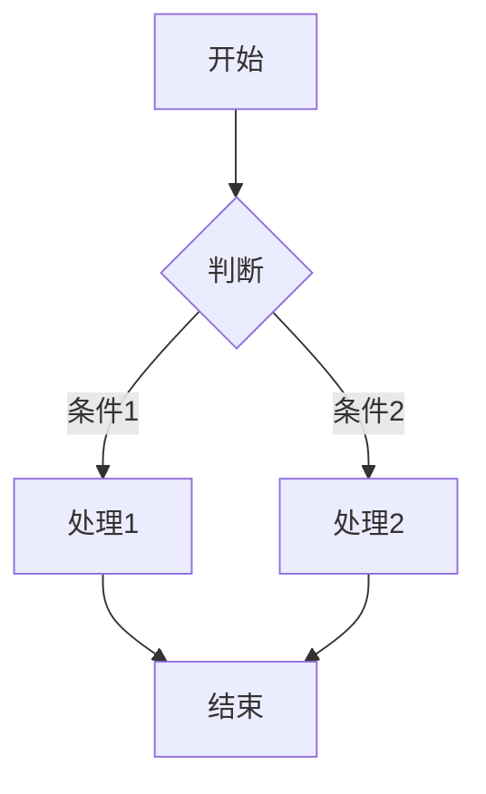

# M4-更新日志v0.1.3-Mermaid图表支持 📝

## 0.1.3 版本更新 🆕

今天来聊聊 0.1.3 版本的新变化，这次我们带来了一个超棒的特性——Mermaid 图表支持！🎉

### Mermaid 图表支持 🌈

从 markconv 0.1.3 版本开始，你们在导出 HTML 和 PDF 的时候可以直接渲染 Mermaid 图表啦！以后画流程图、时序图什么的就方便多了～

那怎么用呢？很简单，直接在 Markdown 文件里写 Mermaid 代码就行：

```markdown

```

目前支持这些类型的图表：

- 流程图 Flowchart
- 时序图 Sequence Diagram
- 类图 Class Diagram
- 状态图 State Diagram
- 实体关系图 ER Diagram
- 甘特图 Gantt Chart
- 饼图 Pie Chart
- 用户旅程图 User Journey

### 样式方面的小改进 🎨

我再说几个小细节：

**透明背景**这个功能我觉得挺实用的，Mermaid 图表默认用透明背景，这样你在 HTML 或 PDF 里想怎么调背景色都行。

**水平居中**这个也加上了，所有图表都会自动居中显示，看起来更整齐～

**自定义背景色**如果你想指定背景色，可以这样设置：

```python
from markconv.tools import MermaidProcessor

processor = MermaidProcessor(
    output_dir='./images',
    background_color='white'
)
```

### 怎么使用 💻

PDF 导出：

```python
from markconv import MDConverter

converter = MDConverter()
converter.to_pdf('input.md', 'output.pdf')
```

HTML 导出：

```python
from markconv import MDConverter

converter = MDConverter()
converter.to_html('input.md', 'output.html')
```

### 技术实现 🔧

简单说说我们是怎么做的：

- 用 mermaid-cli 这个库来渲染图表
- 图表先渲染成 PNG 图片，再嵌入到 HTML/PDF 里
- PDF 生成完会自动清理临时文件
- 支持透明背景和自定义背景色

### 依赖更新 📦

这次新增了一个依赖：

- mermaid-cli>=0.1.3 - 用来渲染 Mermaid 图表

---

## 0.1.2 早期版本 📋

之前版本的功能比较简单：

- 基础 Markdown 转 HTML/PDF 功能
- 支持自定义 CSS 样式
- 支持中文内容

---

最后更新时间：2026-05-01
