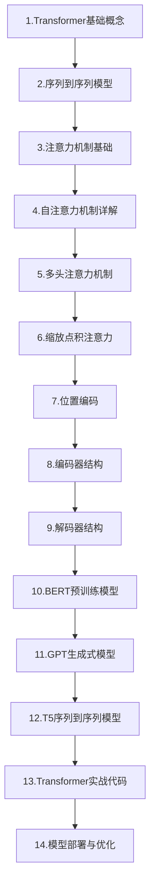

# 00-Transformer技术专栏链接目录

Transformer技术学习路线与专栏文档链接目录

## 📋 专栏概述

Transformer是2017年Google提出的深度学习架构，是GPT、BERT等大语言模型的基石。本专栏涵盖核心概念、注意力机制、模型架构及实战应用，帮助开发者从入门到精通掌握Transformer技术。

> 📌 **文档更新说明**：本专栏文档会不定期更新，随着新文档的发布，将及时在下方链接目录中添加对应的在线文档链接。

## 1. 为什么需要学习Transformer

Transformer已成为现代人工智能领域最重要的技术架构之一。掌握Transformer技术对于AI开发者来说具有重要意义。Transformer是GPT、BERT、Claude等所有主流大语言模型的基础架构，理解Transformer就是理解当代AI的核心。同时，Transformer的注意力机制已被广泛应用于计算机视觉、语音处理、生物信息学等领域，具有很强的通用性。随着大语言模型在各行各业的落地，掌握Transformer技术是成为AI应用开发者的必备技能。

## 2. 学习阶段概览

## 📚 专栏文档链接目录（按学习顺序排序）

### 01-Transformer基础概念
- **掘金**：[01-Transformer基础概念](https://juejin.cn/post/7624451674656784394)
- **CSDN**：[01-Transformer基础概念](https://blog.csdn.net/2301_79239314/article/details/159824877)

### 01a-编码器解码器架构详解
- **掘金**：[01a-编码器解码器架构详解](https://juejin.cn/spost/7631034166373597210)
- **CSDN**：[01a-编码器解码器架构详解](https://blog.csdn.net/2301_79239314/article/details/160380736)

### 01a1-LSTM与GRU门控机制详解
- **掘金**：[01a1-LSTM与GRU门控机制详解](https://juejin.cn/post/7631179225043927067)
- **CSDN**：[01a1-LSTM与GRU门控机制详解](https://blog.csdn.net/2301_79239314/article/details/160415547)

### 01b-上下文向量与信息瓶颈
- **掘金**：[01b-上下文向量与信息瓶颈](https://juejin.cn/post/7631595203976101915)
- **CSDN**：[01b-上下文向量与信息瓶颈](https://blog.csdn.net/2301_79239314/article/details/160419503)

### 01c-循环神经网络RNN详解
- **掘金**：[01c-循环神经网络RNN详解](https://juejin.cn/post/7632201056928268334)
- **CSDN**：[01c-循环神经网络RNN详解](https://blog.csdn.net/2301_79239314/article/details/160481070)

### 01d-前馈神经网络
- **掘金**：[01d-前馈神经网络](https://juejin.cn/post/7632239365552488494)
- **CSDN**：[01d-前馈神经网络](https://blog.csdn.net/2301_79239314/article/details/160500890)

### 02-序列到序列模型
- **掘金**：[02-序列到序列模型](https://juejin.cn/post/7634438325378891818)
- **CSDN**：[02-序列到序列模型](https://blog.csdn.net/2301_79239314/article/details/160683518)

### 02a-什么是矩阵
- **掘金**：[02a-什么是矩阵](https://juejin.cn/post/7634874542255849510)
- **CSDN**：[02a-什么是矩阵](https://blog.csdn.net/2301_79239314/article/details/160720626)

### 03-注意力机制基础

### 04-自注意力机制详解

### 05-多头注意力机制

### 06-缩放点积注意力

### 07-位置编码

### 08-编码器结构

### 09-解码器结构

### 10-BERT预训练模型

### 11-GPT生成式模型

### 12-T5序列到序列模型

### 13-Transformer实战代码

### 14-模型部署与优化

---

**最后更新时间**：2026-04-24
