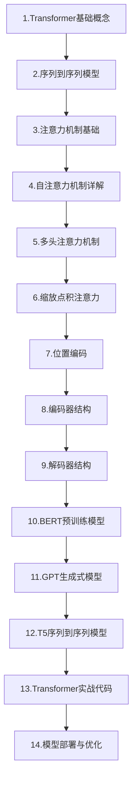

# 00-Transformer技术专栏链接目录

Transformer技术学习路线与专栏文档链接目录

## 📋 专栏概述

Transformer是一种基于注意力机制的深度学习架构，由Google研究团队在2017年论文《Attention Is All You Need》中首次提出。Transformer彻底改变了自然语言处理领域，是现代大语言模型（LLM）的基石架构，包括GPT、BERT、Claude等模型都基于Transformer。本专栏基于最新技术趋势，涵盖Transformer核心概念、注意力机制、模型架构、变体发展以及实战应用等关键技术，帮助开发者从入门到精通掌握Transformer技术。

> 📌 **文档更新说明**：本专栏文档会不定期更新，随着新文档的发布，将及时在下方链接目录中添加对应的在线文档链接。

## 1. 为什么需要学习Transformer

Transformer已成为现代人工智能领域最重要的技术架构之一。掌握Transformer技术对于AI开发者来说具有重要意义。Transformer是GPT、BERT、Claude等所有主流大语言模型的基础架构，理解Transformer就是理解当代AI的核心。同时，Transformer的注意力机制已被广泛应用于计算机视觉、语音处理、生物信息学等领域，具有很强的通用性。随着大语言模型在各行各业的落地，掌握Transformer技术是成为AI应用开发者的必备技能。

## 2. 学习阶段概览

## 📚 专栏文档链接目录（按学习顺序排序）

### 01-Transformer基础概念

### 02-序列到序列模型

### 03-注意力机制基础

### 04-自注意力机制详解

### 05-多头注意力机制

### 06-缩放点积注意力

### 07-位置编码

### 08-编码器结构

### 09-解码器结构

### 10-BERT预训练模型

### 11-GPT生成式模型

### 12-T5序列到序列模型

### 13-Transformer实战代码

### 14-模型部署与优化

---

**最后更新时间**：2026-04-04
